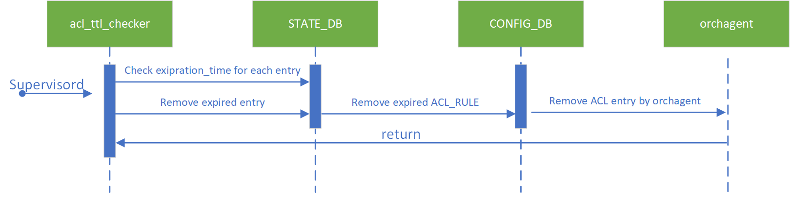

# Dynamic ACL #


## Table of Content

- [Revision](#revision)
- [Scope](#scope)
- [Definitions/Abbreviations](#definitionsabbreviations)
- [Overview](#overview)
- [Requirements](#requirements)
- [Architecture Design](#architecture-design)
- [High-Level Design](#high-level-design)
  - [db schema](#db-schema)
    - [CONFIG DB](#config-db)
    - [STATE DB](#state-db)
    - [acl-loader](#acl-loader)
    - [acl_ttl_checker](#aclttlchecker)
  -[Work flow](#work-flow)
    - [Add dynamic ACL rule](#add-dynamic-acl-rule)
    - [Refresh TTL of existing ACL rule](#refresh-ttl-of-existing-acl-rule)
    - [Remove ACL rule when TTL expires](#remove-acl-rule-when-ttl-expires)
  - [Testing Requirements/Design](#testing-requirementsdesign)
    - [Unit Test cases](#unit-test-cases)
    - [System Test cases](#system-test-cases)
- [Open questions](#open-questions)


## Revision

| Rev |     Date    |       Author       | Change Description                |
|:---:|:-----------:|:------------------:|-----------------------------------|
| 0.1 |             | Bing Wang   | Initial version                   |

## Scope

The scope of this document covers the design of dynamic data plane ACL, which assigns a TTL to ACL rule, and removes the expired rule. Control plane ACL is not covered in this document.

## Definitions/Abbreviations 

| Definitions/Abbreviation | Description                                |
|--------------------------|--------------------------------------------|
| ACL                      | Access Control List                        |


## Overview 

The current design of data plane ACL supports only persistent rules, that is, once the rule is applied to SONiC, it will be there until manually removed or config reload.

This doc proposes an enhancement to current ACL, which add a TTL to ACL rules and the rules are deleted after TTL expires.

## Requirements

- ACL rules are removed when TTL expired
- The precision of TTL is no more than 1 minute
- Support TTL refreshment
- The count down of TTL keeps going after warm-boot

## Architecture Design 

No SONiC architecture change is required to support dynamic ACL.

## High-Level Design

### db schema

#### CONFIG DB
Add a `dynamic` flag to current `ACL_RULE` table
```
key: ACL_RULE_TABLE:table_name:seq                    ; key of the rule entry in the table, seq is the order of the rules   
                                                          ; when the packet is filtered by the ACL "policy_name".   
                                                          ; A rule is always assocaited with a policy.

;field        = value
is_dynamic    = true/false       ; Boolean; Optional. There will be a TTL assigned to this rule if is_dynamic is true, the
                                  ;rule will be removed from CONFIG DB.
                                  ;If is_dynamic is false or absent, the rule will be persistent
......
```
A sample config for ACL rule
```json
{
    "ACL_RULE|DATAACL|RULE_1":{
        "DST_IP":"192.168.0.3/32",
        "ETHER_TYPE":"2048",
        "PACKET_ACTION":"FORWARD",
        "PRIORITY":"9999",
        "SRC_IP":"192.168.0.2/32",
        "is_dynamic":"true"
    }
}
```
A sample json config for ACL rule
```json
{
    "acl":{
        "acl-sets":{
            "acl-set":{
                "DATAACL":{
                    "acl-entries":{
                        "acl-entry":{
                            "1":{
                                "actions":{
                                    "config":{
                                        "forwarding-action":"ACCEPT"
                                    }
                                },
                                "config":{
                                    "sequence-id":1
                                },
                                "ip":{
                                    "config":{
                                        "source-ip-address":"192.168.0.2/32",
                                        "destination-ip-address":"192.168.0.3/32"
                                    }
                                },
                                "ttl":"300"
                            }
                        }
                    }
                }
            }
        }
    }
}
```
The YANG of ACL_RULE is required to be updated to accept new field `is_dynamic`

Orchagent (actually `aclorch`) won't consume the value of `is_dynamic`. So no change is required to `orchagent`.
#### STATE DB
A new table is introduced to state_db to record the timestamp of creation, expiration and TTL of an ACL rule.
```
  key                      = ACL_TTL_TABLE:acl_rule_name     ; acl_rule_name specifies the corresponding ACL rule name, must be unique
  ;field                   = value  
  creation_time            = Integer                         ; timestamp when the rule is created or refreshed  
  expiration_time          = Integer                         ; timestamp when the rule will expire
  ttl                      = Integer                         ; the ttl, in second 
```
A sample
```json
{
    "ACL_TTL_TABLE|DATAACL|RULE_1":{
        "creation_time":1645686213,
        "expiration_time":1645686513,
        "ttl":300
    }
}
```
#### acl-loader

Update `acl-loader` script to parse new field `is_dynamic`. The entry will be created in `ACL_TTL_TABLE` in `state_db` if `ttl` is present for certain an ACL rule in `acl.json`. Please find more details in workflow diagram.  

#### acl_ttl_checker

A helper script managed by `Monit` service. The checker is triggered every 60 seconds by default. It will walk through all entries in `ACL_TTL_TABLE` and delete the corresponding `ACL_RULE` from `config_db` if

- Current timestamp is larger than the `expiration_time` in the entry
- The corresponding ACL rule is marked as dynamic

### Work flow
#### Add dynamic ACL rule
<p align=center>

</p>

#### Refresh TTL of existing ACL rule
<p align=center>

</p>

#### Remove ACL rule when TTL expires
<p align=center>

</p>

### Testing Requirements/Design  

#### Unit Test cases  

1. Enhance unit test for `acl-loader` to verify ACL rule with TTL is created as expected; verify `ACL_TTL_TABLE` entry is created as expected.
2. Add unit test for `acl_ttl_checker` to verify expired ACL entries are cleared. 


#### System Test cases

1. Test case 1 Verify dynamic ACL rule is created as expected
2. Test case 2 Verify dynamic ACL rule can be refreshed
3. Test case 3 Verify expired dynamic ACL rule can be removed

## Open questions
1. `monit` service is delay started(5 minutes) after reboot or reload. So there will be no expiration at the first 5 minutes after reboot or reload.
