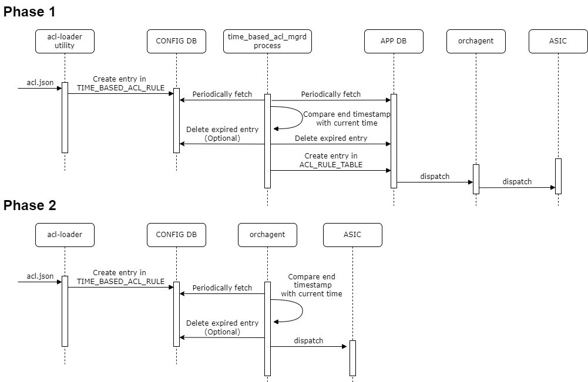

# Time-based ACL #


## Table of Content

- [Time-based ACL](#time-based-acl)
  - [Table of Content](#table-of-content)
  - [Revision](#revision)
  - [Scope](#scope)
  - [Definitions/Abbreviations](#definitionsabbreviations)
  - [Overview](#overview)
  - [Requirements](#requirements)
  - [Architecture Design](#architecture-design)
  - [High-Level Design](#high-level-design)
    - [db schema](#db-schema)
      - [CONFIG DB](#config-db)
      - [APP DB](#app-db)
      - [acl-loader](#acl-loader)
      - [dynamic_acl_mgrd](#dynamic_acl_mgrd)
    - [Work flow](#work-flow)
      - [Add and remove time-based ACL rule](#add-and-remove-time-based-acl-rule)
      - [Refresh TTL of existing ACL rule](#refresh-ttl-of-existing-acl-rule)
    - [Testing Requirements/Design](#testing-requirementsdesign)
      - [Unit Test cases](#unit-test-cases)
      - [System Test cases](#system-test-cases)
  - [Open questions](#open-questions)
  -[Work flow](#work-flow)
    - [Add dynamic ACL rule](#add-dynamic-acl-rule)
    - [Refresh TTL of existing ACL rule](#refresh-ttl-of-existing-acl-rule)
    - [Remove ACL rule when TTL expires](#remove-acl-rule-when-ttl-expires)
  - [Testing Requirements/Design](#testing-requirementsdesign)
    - [Unit Test cases](#unit-test-cases)
    - [System Test cases](#system-test-cases)
- [Open questions](#open-questions)


## Revision

| Rev |     Date    |       Author       | Change Description                |
|:---:|:-----------:|:------------------:|-----------------------------------|
| 0.1 |             | Bing Wang          | Initial version                   |
| 0.2 |9/6/2022     | Shiyan Wang        |                                   |

## Scope

The scope of this document covers the design of dynamic data plane ACL, which assigns a TTL to ACL rule, and removes the expired rule. Control plane ACL is not covered in this document.

## Definitions/Abbreviations 

| Definitions/Abbreviation | Description                                |
|--------------------------|--------------------------------------------|
| ACL                      | Access Control List                        |


## Overview 

The current design of data plane ACL supports only persistent rules, that is, once the rule is applied to SONiC, it will be there until manually removed or config reload.

This doc proposes an enhancement to current ACL, which add a TTL to ACL rules and the rules are deleted after TTL expires.

## Requirements

- ACL rules are added with a TTL value
- ACL rules are removed when TTL expired
- ACL rules' TTL can be refreshed
- ACL rules with TTL are kept after reboot

## Architecture Design 

No SONiC architecture change is required to support dynamic ACL.

## High-Level Design

### db schema

#### CONFIG DB

A new table `DYNAMIC_ACL_RULE_TABLE` is introduced to config_db to record the ACL rules with the timestamp of creation, expiration and TTL of an ACL rule.
The new table contains all fileds of ACL rules and new fields are added: `is_dynamic`, `ttl`, `creation_time` and `expiration_time`.
```
key: ACL_RULE_TABLE:table_name:seq  ; key of the rule entry in the table, seq is the order of the rules   
                                    ; when the packet is filtered by the ACL "policy_name".   
                                    ; A rule is always assocaited with a policy.

;field          = value
is_dynamic      = true/false  ; Boolean; Optional. Indicate the rule is a time-based ACL rule.
creation_time   = Integer     ; timestamp when the rule is created or refreshed
expiration_time = Integer     ; timestamp when the rule is expired
ttl             = Integer     ; the ttl, in second
```
A sample config for ACL rule
```json
{
    "DYNAMIC_ACL_RULE_TABLE|DATAACL|DYNAMIC_RULE_1":{
        "DST_IP":"192.168.0.3/32",
        "ETHER_TYPE":"2048",
        "PACKET_ACTION":"FORWARD",
        "PRIORITY":"9999",
        "SRC_IP":"192.168.0.2/32",
        "creation_time": "1662432143",
        "expiration_time": "1662432153",
        "is_dynamic": "True",
        "ttl": "10"
    }
}
```
A sample json config for ACL rule
```json
{
    "acl":{
        "acl-sets":{
            "acl-set":{
                "DATAACL":{
                    "acl-entries":{
                        "acl-entry":{
                            "1":{
                                "actions":{
                                    "config":{
                                        "forwarding-action":"ACCEPT"
                                    }
                                },
                                "config":{
                                    "sequence-id":1
                                },
                                "ip":{
                                    "config":{
                                        "source-ip-address":"192.168.0.2/32",
                                        "destination-ip-address":"192.168.0.3/32"
                                    }
                                },
                                "dynamic-acl":{
                                    "config":{
                                        "ttl":"10"
                                    }
                                }
                            }
                        }
                    }
                }
            }
        }
    }
}
```
The YANG of ACL_RULE is required to be updated to accept new field `is_dynamic`, `ttl`, `creation_time` and `expiration_time`

Orchagent (actually `aclorch`) won't consume the value of the new flags. So no change is required to `orchagent`.
#### APP DB
Existing table `ACL_RULE_TABLE` is used to activate an effective ACL rule. The ACL rule format is the same as in CONFIG DB.

A sample
```json
{
    "APP_ACL_RULE|DATAACL|DYNAMIC_RULE_1":{
        "DST_IP":"192.168.0.3/32",
        "ETHER_TYPE":"2048",
        "PACKET_ACTION":"FORWARD",
        "PRIORITY":"9999",
        "SRC_IP":"192.168.0.2/32",
    }
}
```
#### acl-loader

Update `acl-loader` script to parse new field `ttl`. The entry will be created in `DYNAMIC_ACL_RULE_TABLE` in `CONFIG DB` if `ttl` is present for certain an ACL rule in `acl.json`. Please find more details in workflow diagram.  

#### dynamic_acl_mgrd

A helper script will be added to `swss` container. The checker is started after `orchagent` and check the TTL of dynamic ACL rules every 10 seconds by default. It will walk through all entries in `DYNAMIC_ACL_RULE_TABLE`. New effective ACL rules are added to `APP_ACL_RULE` in `APP DB` and expired ACL rules are deleted both from `CONFIG DB` and `APP DB`.

### Work flow
#### Add and remove time-based ACL rule
<p align=center>

</p>

#### Refresh TTL of existing ACL rule
<p align=center>

</p>

### Testing Requirements/Design  

#### Unit Test cases  

1. Enhance unit test for `acl-loader` to verify ACL rule with TTL is accepted; verify `DYNAMIC_ACL_RULE_TABLE` entry is created by CLI in `CONFIG DB`.
2. Enhance unit test for `acl-loader` to verfiy ACL rule is deleted by CLI in `CONFIG DB`.
3. Add unit test for `dynamic_acl_mgrd` to verify effective ACL rule is added to `APP DB`; verify expired ACL rule is removed both from `APP DB` and `CONFIG DB`.

#### System Test cases

1. Test case 1 Verify dynamic ACL rule is created as expected
2. Test case 2 Verify dynamic ACL rule can be refreshed
3. Test case 3 Verify expired dynamic ACL rule can be removed

## Open questions
1. memory leak issue detection and validation.
