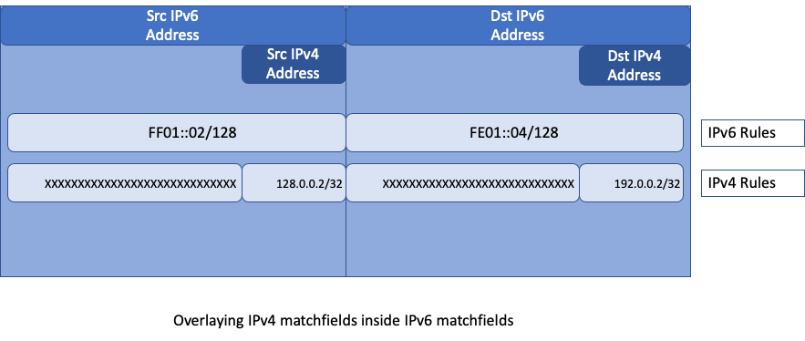
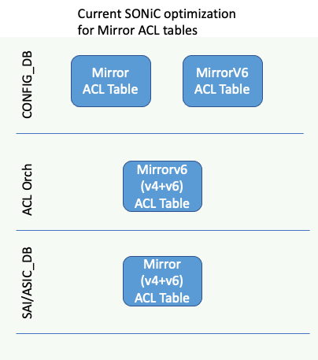
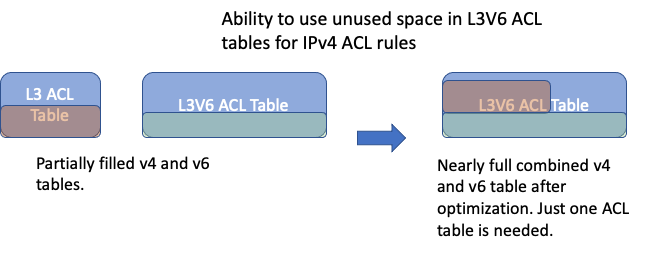
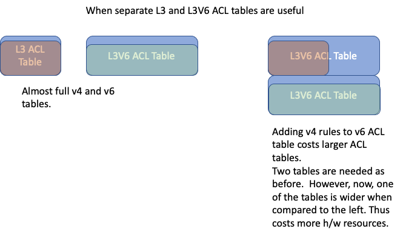
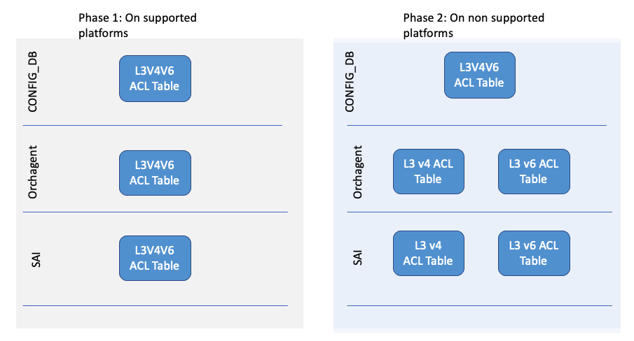

# Support a new ACL Table Type that combines L3 ACL and L3V6 ACL Tables

## Introduction to L3 and L3V6 ACL Table Types
SONiC supports different in-built ACL Table types. These ACL table types have a pre-defined set of ACL match-fields, ACL actions and bind points. _L3_ and _L3V6_ are such in-built ACL Table types. These ACL tables support packet actions like drop, redirect etc. 

L3 ACL Table type supports matching IPv4 fields like Source IPv4 address, Destination IPv4 address etc.
 Similarly, L3V6 ACL Table type supports matching IPv6 fields like Source IPv6 address, Destination IPv6 address etc.

## Problem overview
Currently SONiC creates separate SAI ACL tables for L3 and L3V6 ACLs. In some ASICs, if a user wants both v4 and v6 rules, they would end up using two hardware ACL tables instead of one. This is sub-optimal in ASICs where both v4 and v6 ACLs can be supported using the same hardware ACL table.
 
The proposal is to give the operator an ability to configure  L3 and L3V6 ACLs in the same hardware ACL Table wherever the underlying platform supports it. 

**Note**: SONiC already supports this optimization for MIRROR and MIRRORV6 ACL tables. Only L3 and L3V6 ACL tables have not been optimized so far.


## Table of Contents 
- [Support a new ACL Table Type that combines L3 ACL and L3V6 ACL Tables](#support-a-new-acl-table-type-that-combines-l3-acl-and-l3v6-acl-tables)
  - [Introduction to L3 and L3V6 ACL Table Types](#introduction-to-l3-and-l3v6-acl-table-types)
  - [Problem overview](#problem-overview)
  - [Table of Contents](#table-of-contents)
    - [Revision](#revision)
    - [Scope](#scope)
    - [Terminology](#terminology)
    - [Overview](#overview)
    - [Requirements](#requirements)
    - [Architecture Design](#architecture-design)
    - [High-Level Design](#high-level-design)
      - [Option-A: Follow the _existing_ optimization for Mirror ACL table](#option-a-follow-the-existing-optimization-for-mirror-acl-table)
        - [Pros](#pros)
        - [Cons](#cons)
      - [Option-B: Include IPv4 match fields in _existing_ table type L3V6](#option-b-include-ipv4-match-fields-in-existing-table-type-l3v6)
        - [Pros](#pros-1)
        - [Cons](#cons-1)
      - [Option-C: Create a _new_ ACL Table Type *L3V4V6*](#option-c-create-a-new-acl-table-type-l3v4v6)
        - [Phase 1:](#phase-1)
        - [Phase 2:](#phase-2)
        - [Pros](#pros-2)
      - [Implementation](#implementation)
        - [Orchagent](#orchagent)
        - [STATE\_DB](#state_db)
    - [SAI API](#sai-api)
    - [Configuration and management](#configuration-and-management)
      - [YANG model changes](#yang-model-changes)
    - [CLI](#cli)
        - [ACL table create CLI](#acl-table-create-cli)
    - [Warmboot and Fastboot Design Impact](#warmboot-and-fastboot-design-impact)
    - [Restrictions/Limitations](#restrictionslimitations)
    - [Testing Requirements/Design](#testing-requirementsdesign)
      - [Unit Test cases](#unit-test-cases)
      - [System Test cases](#system-test-cases)

### Revision  

| Rev | Date     | Author          | Change Description |
|:---:|:--------:|:---------------:|--------------------|
| 0.1 | 18/Feb/23 | Ravindranath (**Marvell**)   | Initial Version.  |
| 0.2 | 21/Mar/23 | Ravindranath (**Marvell**)   | Updates based on the community discussion on 21/Feb/23 and other offline comments  |

### Scope  


This document discusses the various options to combine L3 and L3V6 ACL tables in SAI on supported hardware. It then provides the high level design in SONiC to support a new ACL table type called **L3V4V6**.

### Terminology


| SONiC User ACL Table Types     | Description |
|---------------|--------------------|
| __L3__ ACL table type | A built-in ACL table type in SONiC that can match __IPv4__ fields along with incoming port and support ACL redirect and packet ACL actions.|
| __L3V6__ ACL  table type | A built-in ACL table type in SONiC that can match __IPv6__ fields along with incoming port  and support redirect and packet ACL actions.|
| __Mirror__ ACL  table type | A built-in ACL table type in SONiC that can match __IPv4__ fields and supports __Mirror__ ACL action. |
| __MirrorV6__ ACL  table type | A built-in ACL table type in SONiC that can match __IPv6__ fields and supports __Mirror__ ACL action. |
| __Custom__ ACL  table types | A recent enhancement where one or more ACL table types can be created by the user specifying the match-field list, action-list and the bindpoint-types list.|


### Overview 

This document describes the orchagent support by which user can create a  new ACL table of type L3V4V6 on platforms that support this feature.

In several ASICs,  IPv4 and IPv6 ACL rules can be supported in the same ACL table. Further, in many hardware, when the hardware tables (TCAMs) are configured to match IPv6 addresses, the hardware can use the same resources to match the corresponding IPv4 packet fields without incurring additional hardware resources (like TCAM width). For example, IPv6 Destination address (128b) and IPv4 Destination address (32b) keys can be fit using only 128 bits instead of 128 + 32bits.


<p align=center>

</p>


 So in these types of hardware, during ACL table creation, when a v6 match field is added, it is desirable to add the corresponding v4 match field. This does not cost any extra hardware resource and at the same time gives the user the flexibility to create IPv4 ACL rules in these ACL tables.

Note: SAI lacks a mechanism to identify this platform capability and it is left for the NOS to customise the ACL tables based on the platform type.
Refer https://github.com/opencomputeproject/SAI/pull/1408#issue-1126526787

### Requirements

1. Support v6 and v4 ACL rules with a single underlying SAI ACL table.
   * This will be enabled only on platforms needing this optimization.
2. Allow the operator the flexibility to choose when to use this optimization


### Architecture Design 

 ACL Orchagent is enhanced to achieve these requirements. There are no architecture changes.

### High-Level Design 

The following design options were considered for implementing this solution:
-  **Option-A**: Follow the existing SONiC behavior to combine Mirror ACL table and MirrorV6 ACL table.
-  **Option-B**: Extend the existing L3V6 ACL table type to include v4 fields.
-  **Option-C**: Create a new ACL table type called L3V4V6 that combines v4 and v6.


#### Option-A: Follow the _existing_ optimization for Mirror ACL table

Today, Orchagent already optimizes Mirror and MirrorV6 ACL table creation for platforms that support it. Orchagent does this by using a static compile time check to determine platforms that support v4 and v6 Mirror ACL rules in the same ACL table. On these platforms, when user creates a MirrorV4 (or a MirrorV6) ACL table in the CONFIG_DB, orchagent creates a single SAI ACL Table that has both v4 and v6 match fields. Later, when the user creates another MirrorV6 (or a MirrorV4) ACL table with the same ACL direction in CONFIG_DB, orchagent reuses the previously created SAI ACL table.

The below diagram illustrates the behavior of the optimization in supported platforms when both these ACL tables are created in the same ACL direction, say ingress. 
The user sees two different ACL tables irrespective of the platform. Orchagent, internally enables the optimization based on the platform and this is transparent to the end user. 

<p align=center>

</p>

##### Pros
- Ease for the operator: the operator does not need to change their ACL configuration based on the platform. The operator configuration remains identical, and orchagent internally does the merging based on the platform type.

##### Cons
However, this mechanism has several disadvantages

- Today, the MirrorV4 and v6 ACL tables are combined based on platform specific checks done at compile time.  These are done using platform names since SAI does not have a mechanism to detect the ASIC capability to combine tables. The flip side of these platform checks is that the platform vendor has to  decide at compile time between these two choices: either always combine or never combine. There is no mechanism to configure this based on the deployments/customers. In some deployments, when the operator has no v6 rules, we would need the optimization disabled so that the hardware TCAM tables width can be reduced. However disabling this optimization would need a new build.

- SONiC cannot support more than one ACL table type of Mirror. If Orchagent has to support multiple mirror ACL tables, then orchagent has to identify which Mirror table is to be combined with which MirrorV6 table. This would need additional inputs from the operator.
  
- With the optimization enabled, the user configuration in CONFIG_DB and the actual ASIC_DB configuration are different. Say the user configures the Mirror ACL table to ports P1 and P2 and MirrorV6 table to port P3 and P4. Orchagent configures the ASIC to bind the combined table to only the ports configured on Mirror ACL table i.e., ports P1 and P2. Ports P3 and P4 do not undergo the ACL table lookup contrary to user's configuration. 
- Similarly, when the user deletes one of the ACL tables, orchagent deletes the combined ACL table from the hardware even though the user expects the other ACL table to still be present and bound to the attached ports.
  

#### Option-B: Include IPv4 match fields in _existing_ table type L3V6

As explained before, in several ASIC platforms, including v4 matchfields along with v6 matchfields does not cost extra hardware resources. Hence, on these platforms, v4 matchfields will be included in table type L3V6. In the below table, the second column shows the matchfields in current L3V6 ACL table. The third column shows the matchfields that will be added to L3V6 on platforms that needs this optimization.

    /*
     * Type of Tables and Supported Match Types 
     * |----------------------------------------------------|
     * |                      |   Original   | New L3V6 on  |
     * |    Match Type        |   L3V6       | optimized    |
     * |                      |              | platforms    |
     * |----------------------------------------------------|
     * | MATCH_OUTER_VLAN_ID  |      √       |      √       |
     * |----------------------------------------------------|
     * | MATCH_ACL_IP_TYPE    |      √       |      √       |
     * | MATCH_ETHER_TYPE     |              |      √       |
     * |----------------------------------------------------|
     * | MATCH_SRC_IPV6       |      √       |      √       |
     * | MATCH_DST_IPV6       |      √       |      √       |
     * | MATCH_SRC_IP         |              |      √       |
     * | MATCH_DST_IP         |              |      √       |
     * |----------------------------------------------------|
     * | MATCH_ICMPV6_TYPE    |      √       |      √       |
     * | MATCH_ICMPV6_CODE    |      √       |      √       |
     * | MATCH_ICMP_TYPE      |              |      √       |
     * | MATCH_ICMP_CODE      |              |      √       |
     * |----------------------------------------------------|
     * | MATCH_IP_PROTOCOL    |      √       |      √       |
     * | MATCH_NEXT_HEADER    |      √       |      √       |
     * | ---------------------------------------------------|
     * | MATCH_L4_SRC_PORT    |      √       |      √       |
     * | MATCH_L4_DST_PORT    |      √       |      √       |
     * | MATCH_TCP_FLAGS      |      √       |      √       |
     * |----------------------------------------------------|
     */

##### Pros


-  Operator can create multiple L3 and L3V6 ACL tables. This would not be possible if we use option-A.
- Gives the flexibility to the operator to utilize unused space in L3V6 ACL table for L3 ACL rules. 
<p align=right>

</p>

- If there are many v4 rules and many v6 rules, the user can continue to use separate L3 and L3V6 ACL Tables.

<p align=right>

</p>

- No impact on other platforms  
  
##### Cons
- If the operator decides to use the optimization, the operator needs to modify the ACL configuration, i.e., operator must modify the V4 ACL rules that need to be placed in L3V6 ACL table- the rule's ACL Table is renamed to the L3V6 ACL table.

#### Option-C: Create a _new_ ACL Table Type *L3V4V6*

Create a new built-in table type called L3V4V6 with the following match types:


    /*
     * Supported Match Types in a new table type L3V4V6
     * |-------------------------------------|
     * |                      |              |
     * |    Match Type        |  New L3V4V6  |
     * |                      |              |
     * |-------------------------------------|
     * | MATCH_OUTER_VLAN_ID  |      √       |
     * |-------------------------------------|
     * | MATCH_ACL_IP_TYPE    |      √       |
     * | MATCH_ETHER_TYPE     |      √       |
     * |-------------------------------------|
     * | MATCH_SRC_IPV6       |      √       |
     * | MATCH_DST_IPV6       |      √       |
     * | MATCH_SRC_IP         |      √       |
     * | MATCH_DST_IP         |      √       |
     * |-------------------------------------|
     * | MATCH_ICMPV6_TYPE    |      √       |
     * | MATCH_ICMPV6_CODE    |      √       |
     * | MATCH_ICMP_TYPE      |      √       |
     * | MATCH_ICMP_CODE      |      √       |
     * |-------------------------------------|
     * | MATCH_IP_PROTOCOL    |      √       |
     * | MATCH_NEXT_HEADER    |      √       |
     * | ------------------------------------|
     * | MATCH_L4_SRC_PORT    |      √       |
     * | MATCH_L4_DST_PORT    |      √       |
     * | MATCH_TCP_FLAGS      |      √       |
     * |-------------------------------------|
     */


##### Phase 1:
On platforms supporting v4 and v6 in a single SAI ACL table, this _new L3V4V6_ ACL table is supported.

##### Phase 2:
On platforms NOT supporting v4 and v6 in a single SAI ACL table, this new L3V4V6 ACL table will be supported by orchagent's special handling. Orchagent would internally create and manage two SAI ACL tables as shown in the right picture below. The operator is agnostic about the underlying ASIC behavior and only sees a consolidated SONiC ACL table.


<p align=center>

</p>

Note: 
* Due to the lack of SAI APIs to detect this capability, platform checks in orchagent code are used to detect the support.
* Currently, phase-1 is supported. On non-supporting ASICs, when operator creates an ACL table of type L3V4V6, orchagent throws an error in syslog.
* Phase-2 will be implemented in the future release.
  
##### Pros
- Readability: L3V4V6 ACL table type conveys to the operator that the ACL table type supports v4 and v6 match qualifiers.
- Allows the operator the flexibility to use only L3 ACL tables when the deployment does not need v6 rules.
- Using the same config across ASIC families: Once the future plan of orchagent creating separate v4 and v6 SAI ACL tables on unsupported platform is done, the operator can have the same ACL configuration across ASIC platforms.
  

#### Implementation

Based on the above design considerations and feedback from the community, **option-C is implemented**.
New fields are added to the ACL capability in STATE_DB to help applications identify the platforms where the new L3V4V6 ACL table is supported; this is done for both ingress and egress individually.


**Matches supported in L3V4V6 table**

- VLAN_ID
- *IP_TYPE**
- *ETHER_TYPE**
- SRC_IPV6
- DST_IPV6
- SRC_IP
- DST_IP
- ICMPV6_TYPE
- ICMPV6_CODE
- ICMP_TYPE
- ICMP_CODE
- IP_PROTOCOL
- NEXT_HEADER
- L4_SRC_PORT
- L4_DST_PORT
- TCP_FLAGS

***Note**: It is recommended that every ACL Rule should include at least one of [*IP_TYPE*, *ETHER_TYPE*] in the matching criteria when matching of L3 header fields. When we handle unsupported platforms by adding two ACL tables in SAI, this allows orchestrator to decide in which underlying SAI ACL table to place the rule in. In phase-1, if these fields are not provided in the ACL rule, the underlying SAI platform must do one of the following: 
1) install a single rule if the hardware supports it, or
2) make multiple rules (one rule per IP type), or
3) throw error as unsupported.

**Actions allowed in the table of the type L3V4V6**

The default actions supported in the new table type are the same as L3 and L3V6, viz.,

- PACKET_ACTION 
- REDIRECT_ACTION 

Note: The above actions would be added to the ACL table based on the ACL capability. For example, on platforms where REDIRECT_ACTION is not supported in the egress direction, the only action supported will be PACKET_ACTION. This is similar to what is being done today for L3 and L3V6 ACL tables.

**Bindpoints supported in the table of the type L3V4V6**
The same as L3 and L3V6 ACL table, viz.,
- Port
- LAG

##### Orchagent

 The new ACL table type called L3V4V6 is created during Orchagent initialization.

  ``` aclorch::init() -> initDefaultTableTypes() -> addAclTableType(TABLE_TYPE_L3V4V6) ```
  
Using platform specific checks, AclOrch identifies platforms where  L3V4V6 ACL tables can be supported. Creation of an ACL table of type L3V4V6 on an unsupported platform results in orchagent logging an error in the syslog. A SAI ACL table create call is done only on supported platforms; this avoids crashes on unsupported platforms. In the future, orchagent would internally create separate v4 and v6 ACL tables on these unsupported platforms.

##### STATE_DB
A new field called `supported_L3V4V6` is added to the ACL capability in STATE_DB. This field is set to true by orchagent during 'AclOrch init' on platforms where v4 fields and v6 fields can be matched in the same hardware ACL table. This provides an interface to the operator to identify the platforms where the new L3V4V6 ACL table is supported. In the future, this field will be used by Orchagent to implement a single user configured L3V4V6 ACL table as two underlying SAI ACL tables on platforms where v4 fields and v6 fields cannot be matched in the same hardware ACL table.


```
127.0.0.1:6379[6]> hgetall "ACL_STAGE_CAPABILITY_TABLE|INGRESS"
  :
  :
1) "supported_L3V4V6"
2) "true"


127.0.0.1:6379[6]> hgetall "ACL_STAGE_CAPABILITY_TABLE|EGRESS"
  :
  :
5) "supported_L3V4V6"
6) "true"
```

### SAI API 

There are no new SAI APIs required for this feature.

### Configuration and management 

#### YANG model changes

```
--- a/models/yang/sonic/sonic-acl.yang
+++ b/models/yang/sonic/sonic-acl.yang

    container sonic-acl {

        container ACL_TABLE {
                :
                :
                leaf type {
                    type enumeration {
                        enum MIRROR;
                        enum MIRRORV6;
                        enum L3;
                        enum L3V6;
+                       enum L3V4V6;
                    }
                }

                :
                :
            }
        }
  }


```


**Example:**
```
{
    "ACL_TABLE": {
        "DATAACL": {
            "STAGE": "INGRESS",
            "TYPE" : "L3V4V6",
            "PORTS": [
                "Ethernet0",
                "Ethernet1"
            ]
        }
    },
    "ACL_RULE": {
      "DATAACL|RULE1": {
	    "ETHER_TYPE": "0x0800",
	    "PRIORITY": "5",
            "DST_IP": "20.2.2.2/32",
	    "PACKET_ACTION": "DROP"
        }
      "DATAACL|RULE2": {
	    "IP_TYPE": "IPV6ANY",
	    "PRIORITY": "6",
            "DST_IPV6": "2001::2/64",
	    "PACKET_ACTION": "DROP"
        }
    }
}
```
### CLI

##### ACL table create CLI 
The existing CLI is extended to support the new table type.
```
config acl add table -s <stage> -p <ports> <table_name> <table_type>
```
_table_type_ needs to be passed as _"L3V4V6"_ to create a table of the new L3V4V6 type.
```
Example : config acl add table -s ingress -p Ethernet0 DATAACL L3V4V6
```


### Warmboot and Fastboot Design Impact  
There is no impact on warmboot or fastboot.

### Restrictions/Limitations  
* SONiC does not specify the ACL table priority  when an ACL table is being created in SAI. (Refer SAI_ACL_TABLE_GROUP_MEMBER_ATTR_PRIORITY). So, when more than one ACL table is bound to a port, and if these ACL tables result in conflicting actions, the winner is not predictable. This will be addressed in phase-2 by enhancing config DB to let the operator configure the ACL table priority.
* "IP_TYPE" or "ETHER_TYPE" must be specified for ACL rules added in L3V4V6 ACL table. This will be used in phase-2 to decide on which underlying SAI ACL table a given ACL rule should be placed in.

### Testing Requirements/Design  

#### Unit Test cases  
- Verify ACL Capability in STATE_DB on supported platforms.
    - The new field `supported_L3V4V6` must be true.
- Verify ACL Capability in STATE_DB on non-supported platforms.
    - The new field `supported_L3V4V6` must be false.
- Create IPv4 ACL rules (match SRC-IP, DST-IP, ICMP Type, ICMP Code, EtherType) on L3V4V6 ACL table.
  - This MUST pass in supported platforms
  - This should fail with meaningful error messages in non-supported platforms.
- Create IPv6 ACL rules (match SRC-IPv6, DST-IPv6, ICMPv6 Type, ICMPv6 Code, EtherType) on L3V4V6 ACL table.
  - This MUST pass in supported platforms
  - This should fail with meaningful error messages in non-supported platforms.
- On supported platforms, test full ACL workflow: create V4 and V6 ACL Rules on L3V4V6 ACL Table type, set packet action, get the ACL rules and counters, delete ACL rules and then delete the ACL table.
  
#### System Test cases
* Modify existing sonic-mgmt(PTF) __test_acl.py__ to test the L3V4V6 ACL table on ingress and egress  *on supported platforms*
  * Traffic Testing must pass for v4 and v6
  
