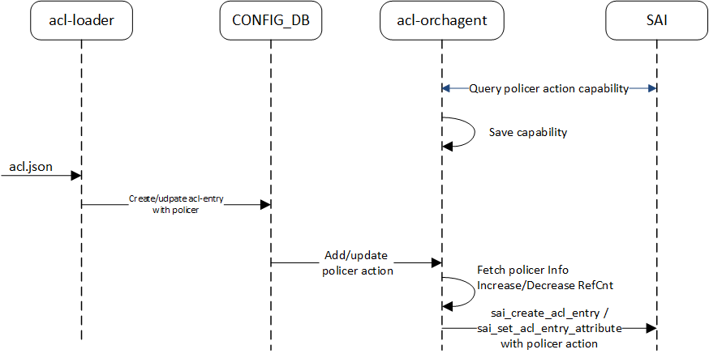

# SONiC ACL based metering Design #

## Table of Content

- [Revision][def]
- [Scope](#scope)
- [Definitions/Abbreviations](#definitionsabbreviations)
- [Overview](#overview)
- [Requirements](#requirements)
- [High-Level Design](#high-level-design)
- [SAI API Requirements](#sai-api-requirements)
- [DB Schema](#db-schema)
- [SWSS Enhancements](#swss-enhancements)
- [Configuration and management ](#configuration-and-management)
    - [Config command](#config-command)
    - [Show command](#show-command)
- [YANG Model changes](#yang-model-changes)
- [Warmboot and Fastboot Considerations](#warmboot-and-fastboot-considerations)
- [Assumptions/Limitations](#assumptionslimitations)
- [Testing Design](#testing-design)
    - [VS Test cases](#vs-test-cases)
    - [System Test cases](#system-test-cases)


### Revision

 | Rev |     Date    |       Author             | Change Description                   |
 |:---:|:-----------:|:------------------------:|--------------------------------------|
 | 0.1 |  01/07/24   |  Rajkumar (Marvell)      | Initial version                      |

### Scope
This document covers the design of ACL based policer. This includes the requirement definition, CLI/yang models, DB schema changes and enhancement to existing acl module in sonic-utils and swss.

### Definitions/Abbreviations
 ACL - Access Control List

### Overview
In SONiC, the current design of dataplane ACL supports actions:packet_action, mirror_action. This document proposes the support of new ACL action "policer".

### Requirements
- Support ACL action "policer" for all DATAPLANE table types. 
- Allow ACL action policer as configurable option from user. Applicable for rules from all below predefined DATAPLANE ACL tables,
    - L3
    - L3V6
    - L3V4V6
    - MIRROR
    - MIRRORV6
    - MIRRORDSCP

- Support for stage: INGRESS and EGRESS.
- Support policer types: storm_control, srTCM, trTCM.
- Support packet and byte mode.


### High-Level Design

ACL action "policer" is added to action list. There is no architectural or flow change with introdution of this feature.
User should be able to attach policer action to an ACL rule. We will re-use the functionality of policer orchagent introduced as part of everflow feature.
Pls refer [everflow HLD](https://github.com/sonic-net/SONiC/blob/master/doc/everflow/SONiC%20Everflow%20Always-on%20HLD.pdf) to understand the config schema and API flow of policer.
Policer action will be supported for DATAPLANE and MIRROR ACLs. An enhancement will be added to policer orchagent to query the policer packet-action capability per color. This will be used in validation, when policer is created/updated with per color packet-action.

<p align=center>

</p>

As part of table creation, we will introduce an optional action-list parameter. Since predefined DATAPLANE ACL tables has default actions, there are two option to realize the policer functionality for predefined tables.

For example, table type L3 support below default actions,
```c
 // L3
    TABLE_TYPE_L3,
    {
        {
            ACL_STAGE_INGRESS,
            {
                SAI_ACL_ACTION_TYPE_PACKET_ACTION,
                SAI_ACL_ACTION_TYPE_REDIRECT
            }
        },
        {
            ACL_STAGE_EGRESS,
            {
                SAI_ACL_ACTION_TYPE_PACKET_ACTION,
                SAI_ACL_ACTION_TYPE_REDIRECT
            }
        }
    }
```

**Option 1**

 This list of actions will override default action-list for that table. If not set, default actions will be assigned by aclorch. 

As part of table creation, if action-list is not set (current behavior), action list assigned to L3 table will have SAI_ACL_ACTION_TYPE_PACKET_ACTION, SAI_ACL_ACTION_TYPE_REDIRECT.
If user configures, **"action-list=policer,redirect,packet-action"**, action list of L3 table will have SAI_ACL_ACTION_TYPE_PACKET_ACTION, SAI_ACL_ACTION_TYPE_REDIRECT, SAI_ACL_ACTION_TYPE_SET_POLICER


**Option 2**

The list of actions will be augmented to existing default actions. If user configures, **"action-list=policer"**, action list of L3 table will have SAI_ACL_ACTION_TYPE_PACKET_ACTION, SAI_ACL_ACTION_TYPE_REDIRECT, SAI_ACL_ACTION_TYPE_SET_POLICER

**Preferred Option : Option1**

### SAI API Requirements
Below saiacl attribute will be used to pass POLICER OID.
```c
    /**
     * @brief Associate with policer
     *
     * @type sai_acl_action_data_t sai_object_id_t
     * @flags CREATE_AND_SET
     * @objects SAI_OBJECT_TYPE_POLICER
     * @default disabled
     */
    SAI_ACL_ENTRY_ATTR_ACTION_SET_POLICER = SAI_ACL_ENTRY_ATTR_ACTION_START + 0x8,

```
### DB Schema
A new field, "actions" is added to accept optional action-list with value as "policer" keyword. This can be extended to add new actions in future.  
```
key           = ACL_TABLE:name          ; acl_table_name must be unique
;field        = value
policy_desc   = 1*255VCHAR              ; name of the ACL policy table description
type          = 1*255VCHAR              ; type of acl table, every type of
                                        ; table defines the match/action a
                                        ; specific set of match and actions.
                                        ; There are pre-defined table types like
                                        ; "MIRROR", "MIRRORV6", "MIRROR_DSCP",
                                        ; "L3", "L3V6", "MCLAG", "PFCWD", "DROP".
ports         = [0-max_ports]*port_name ; the ports to which this ACL
                                        ; table is applied, can be entry
                                        ; value annotations
port_name     = 1*64VCHAR               ; name of the port, must be unique
max_ports     = 1*5DIGIT                ; number of ports supported on the chip
actions       = ["policer, packet-action, redirect"] ; table action list
```

```
   "ACL_TABLE": {
        "ACL_TABLE_V6": {
            "policy_desc": "ACL_TABLE_V6",
            "ports": [
                "Ethernet0",
                "Ethernet1",
                "Ethernet2"
            ],
            "stage": "ingress",
            "type": "L3V6",
            "action-list":[
                packet-action,
                policer,
                redirect
            ]
        }
    },

```
A new action parameter "policer_action" is added to existing schema of ACL rule table. Its value is one of the policer object names.

```
key: ACL_RULE_TABLE:table_name:rule_name   ; key of the rule entry in the table,
                                           ; seq is the order of the rules
                                           ; when the packet is filtered by the
                                           ; ACL "policy_name".
                                           ; A rule is always associated with a
                                           ; policy.

;field        = value
priority      = 1*3DIGIT                   ; rule priority. Valid values range
                                           ; could be platform dependent

packet_action = "forward"/"drop"/"redirect:"redirect_parameter
                                           ; an action when the fields are matched
                                           ; we have a parameter in case of packet_action="redirect"
                                           ; This parameter defines a destination for redirected packets
                                           ; it could be:
                                           : name of physical port.          Example: "Ethernet10"
                                           : name of LAG port                Example: "PortChannel5"
                                           : next-hop ip address             Example: "10.0.0.1"
                                           : next-hop group set of addresses Example: "10.0.0.1,10.0.0.3"

mirror_action = 1*255VCHAR                 ; refer to the mirror session
policer_action = 1*255VCHAR                ; refer to the policer name

```
### SWSS Enhancements
- Query and save the POLCIER action capability in acl orchangent
- As part of rule processing,
    - Parse and validate policer info as part of rule action processing. Allow policer action only when capability is enabled.
    - For platforms with action_type_list is mandatory on create, if rule is set with policer action, validation is added to check corresponding table action list and accept/drop the rule configuration with policer action.
    - Set or disable policer action.
- Policer cannot be deleted when referenced by ACL rule.

### Configuration and management
Note that policer configurations will leverage existing method.

#### Config command

In acl-loader script, an optional argument "--policer_name" will be taken as input and all rules configured as part of the json will be enabled with policer action.
```
acl-loader update full /tmp/test.json --policer_name policer_1
```
Alternatively, user can use "config load" command to configure the policer action or use sonic-cli interface.

```c
{
   	"POLICER": {
		"policer1": {
		    "meter_type": "bytes",
		    "mode": "sr_tcm",
		    "cir": "12500",
		    "cbs": "12500",
		    "pir": "17500",
		    "pbs": "17500",
		    "color": "aware",
		    "red_packet_action": "drop",
		    "yellow_packet_action": "drop",
		    "green_packet_action": "forward"
        },
        "policer2": {
		    "meter_type": "bytes",
		    "mode": "sr_tcm",
		    "cir": "12500",
		    "cbs": "12500",
		    "pir": "17500",
		    "pbs": "17500",
		    "color": "aware",
		    "red_packet_action": "drop",
		    "yellow_packet_action": "drop",
		    "green_packet_action": "forward"
        }
	},
    "ACL_TABLE": {
        "VRF_ACL_REDIRECT_V4": {
            "policy_desc": "Redirect traffic to nexthop in different vrfs",
            "type": "L3",
            "ports": ["Ethernet1"]
        },
        "VRF_ACL_REDIRECT_V6": {
            "policy_desc": "Redirect traffic to nexthop in different vrfs",
            "type": "L3V6",
            "ports": ["Ethernet1"]
        }
    },
    "ACL_RULE": {
        "VRF_ACL_REDIRECT_V4|rule1": {
            "priority": "55",
            "SRC_IP": "30.0.0.1",
            "policer_action":"policer1"
        },
        "VRF_ACL_REDIRECT_V6|rule1": {
            "priority": "55",
            "SRC_IPV6": "2000:0030::1",
            "policer_action":"policer2"
        }
    }
}

```

#### Show command

acl-loader script will be updated to display policer action in show output. 

```c
admin@sonic:~$ show acl rule
Table     Rule          Priority    Action                     Match
--------  ------------  ----------  -------------------------  ----------------------------
EVERFLOW  RULE_3        9997        MIRROR INGRESS: everflow0  SRC_IP: 20.0.0.2/32
                                    POLICER: policer0
EVERFLOW  RULE_4        9996        MIRROR EGRESS : everflow1  L4_SRC_PORT: 4621
                                    POLICER: policer1
DATAACL   RULE_5        9995        REDIRECT: Ethernet8        IP_PROTOCOL: 126
                                    POLICER: policer2
DATAACL   RULE_6        9994        FORWARD                    L4_SRC_PORT: 179
                                    POLICER: policer3
```
```
admin@sonic:~$ show acl table
Name                 Type    Binding     Description          Stage    Action-list    Status
-------------------  ------  ----------  -------------------  -------  ------------   -------
SAMPLE_ACL_TABLE_V6  L3V6    Ethernet0   SAMPLE_ACL_TABLE_V6  ingress  packet-action  Active
                             Ethernet1                                 policer
                             Ethernet2                                                                  
                             Ethernet3 
                             Ethernet4

```
### YANG model changes

The sonic acl yang model will be updated as below.

sonic-yang-models/yang-templates/sonic-types.yang.j2
```c
    typedef packet_action{
        type enumeration {
            enum DROP;
            enum ACCEPT;
            enum FORWARD;
            enum REDIRECT;
            enum DO_NOT_NAT;
+           enum POLICER;
        }
    }
```

sonic-yang-models/yang-templates/sonic-acl.yang.j2
```c
module sonic-acl {
:
:
+   import sonic-policer {
+       prefix policer;
+   }
+
    container sonic-acl {

            container ACL_RULE {

                description "ACL_RULE part of config_db.json";

                    list ACL_RULE_LIST {

+                       leaf POLICER_ACTION {
+                           when "current()/../PACKET_ACTION = 'POLICER'";
+                           type leafref {
+                               path "/policer:sonic-policer/policer:POLICER/policer:POLICER_LIST/policer:name";
+                           }
+                       }
+
:
:
            container ACL_TABLE_TYPE {
                    list ACL_TABLE_TYPE_LIST {
                             key "ACL_TABLE_TYPE_NAME";

                            leaf ACL_TABLE_TYPE_NAME {
                                    type string;
                            }

                            leaf-list MATCHES {
                                    type string;
                                    min-elements 1;
                            }

                            leaf-list ACTIONS {
                                    type string;
                                    default "";
                            }
                    }
            }
            container ACL_TABLE {

                    description "ACL_TABLE part of config_db.json";

                    list ACL_TABLE_LIST {

                            key "ACL_TABLE_NAME";
                            :
                            :
+                           leaf-list actions {
+                                   type enumeration {
+                                       enum PACKET_ACTION;
+                                       enum POLICER;
+                                       enum REDIRECT;
+                                   }
+                           }
                    }
            }
    }
}

```

### Warmboot and Fastboot Considerations

No impact to warm or fastboot

### Assumptions/Limitations
Since SAI has not defined the precedence of packet command derived between ACL RULE's packet_action and ACL RULE's policer action, it is assumed that packet-action of policer object takes precedence over ACL rule packet-action field. For example, if both are set like below, packet-action of policer should be applied by SAI. In this case, it is vendor SAI responsibility to apply this behavior and NOS will set both SAI_ACL_ENTRY_ATTR_ACTION_PACKET_ACTION and SAI_ACL_ENTRY_ATTR_ACTION_SET_POLICER to vendor SAI. If policer configuration is removed from ACL, SAI_ACL_ENTRY_ATTR_ACTION_PACKET_ACTION should be applied to the final packet command by SAI.

In below example, aclorch will set sai acl entry action as SAI_ACL_ACTION_TYPE_PACKET_ACTION, SAI_ACL_ACTION_TYPE_SET_POLICER.

```
"policer2": {
		    "meter_type": "bytes",
		    "mode": "sr_tcm",
		    "cir": "12500",
		    "cbs": "12500",
		    "pir": "17500",
		    "pbs": "17500",
		    "color": "aware",
		    "red_packet_action": "drop",
		    "yellow_packet_action": "drop",
		    "green_packet_action": "trap"
        }

 "VRF_ACL_REDIRECT_V6|rule1": {
            "priority": "55",
            "SRC_IPV6": "2000:0030::1",
            "packet_action": "FORWARD",
            "policer_action":"policer2"
        }
```
If policer action set across rules from different table members of a table-group, the final resolution should be decided based on "SAI_ACL_TABLE_GROUP_MEMBER_ATTR_PRIORITY".

SAI documentation is not clear about the behavior when different policers are attached in each stage for the same traffic flow and assumption here is, if policers are attached at different stages in pipeline, traffic should be policed in each of the stage. Say,
- storm control policer P1 attached to Ingress port port_1
- poicre P2 attached to Ingress acl matching flow "x", bind to port_1

Say for flow "x", P1 is applied first, and the remaining traffic is policed by P2. Other traffic flows are applied with policer P1.
### Testing Design

#### VS Test cases
- Create acl table and validate action_type_list 
- Create acl table with policer and validate action_type_list 
- Create acl table and add acl rule with action as policer. 
- Delete acl rule with valid policer action.
- Create acl rule with policer and modify the policer rate.
- Create acl rule with valid policer and delete the policer.
- Create acl rule with multiple actions packet_action, mirror, policer.
- Delete acl rule from above step. 
- Create acl table with policer action, add rules with policer.
- Create acl rule with action as non-existent policer.


#### System Test cases
New SONiC PTF test plan will be added for this feature.

[def]: #revision
