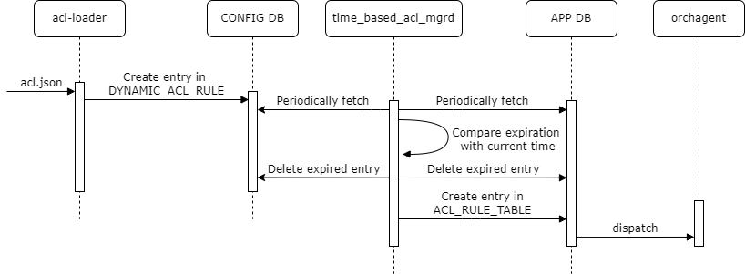

# Time-based ACL #


## Table of Content

- [Time-based ACL](#time-based-acl)
  - [Table of Content](#table-of-content)
  - [Revision](#revision)
  - [Scope](#scope)
  - [Definitions/Abbreviations](#definitionsabbreviations)
  - [Overview](#overview)
  - [Feature Prerequisites and supported platform](#feature-prerequisites-and-supported-platform)
  - [Requirements](#requirements)
  - [Architecture Design](#architecture-design)
  - [High-Level Design](#high-level-design)
    - [DB schema](#db-schema)
      - [CONFIG DB](#config-db)
      - [APP DB](#app-db)
    - [Code change](#code-change)
      - [acl-loader](#acl-loader)
      - [time_based_acl_mgrd](#time_based_acl_mgrd)
    - [Workflow](#workflow)
      - [Add and remove time-based ACL rule](#add-and-remove-time-based-acl-rule)
    - [Testing Requirements/Design](#testing-requirementsdesign)
      - [Unit Test cases](#unit-test-cases)
        - [For `acl-loader`](#for-acl-loader)
        - [For `time_based_acl_mgrd`](#for-time_based_acl_mgrd)
      - [System Test cases](#system-test-cases)
  -[Work flow](#work-flow)
    - [Add dynamic ACL rule](#add-dynamic-acl-rule)
    - [Refresh TTL of existing ACL rule](#refresh-ttl-of-existing-acl-rule)
    - [Remove ACL rule when TTL expires](#remove-acl-rule-when-ttl-expires)
  - [Testing Requirements/Design](#testing-requirementsdesign)
    - [Unit Test cases](#unit-test-cases)
    - [System Test cases](#system-test-cases)


## Revision

| Rev |     Date    |       Author       | Change Description                |
|:---:|:-----------:|:------------------:|-----------------------------------|
| 0.1 |             | Bing Wang          | Initial version                   |
| 0.2 |9/6/2022     | Shiyan Wang        |                                   |

## Scope

The scope of this document covers the design of time-based data plane ACL, which assigns a start timestamp and an end timestamp to ACL rule. Control plane ACL is not covered in this document.

## Definitions/Abbreviations 

| Definitions/Abbreviation | Description                                |
|--------------------------|--------------------------------------------|
| ACL                      | Access Control List                        |

## Overview 

The current design of data plane ACL supports only persistent rules, that is, once the rule is applied to SONiC, it will be there until manually removed or config reload.

This doc proposes an enhancement to current ACL, which add a time range to ACL rule and the rule will only be activated during the specific time range.

## Feature Prerequisites and supported platform
Any platform which supports dataplane ACL.

## Requirements

- ACL rules are added with start timestamp and end timestamp.
- ACL rules are removed after end timestamp.
- The timestamps in ACL rules can be updated.
- ACL rules with the timestamps are kept after reboot.

## Architecture Design 

No SONiC architecture change is required to support time-based ACL.

## High-Level Design

### DB schema

#### CONFIG DB

A new table `TIME_BASED_ACL_RULE` is introduced to `CONFIG DB` to record the ACL rules with start timestamp and end timestamp.

The new table contains all fields of a normal ACL rule, and 2 new fields are added: `start_time` and `end_time`. The new fields definition is listed below:
```
key: TIME_BASED_ACL_RULE:table_name:seq  ; key of the rule entry in the table, seq is the order of the rules   

;field       = value
start_time   = Integer     ; timestamp when the rule is created or updated
end_time     = Integer     ; timestamp when the rule is expired
```
A sample config for ACL rule in `CONFIG DB`
```json
{
    "TIME_BASED_ACL_RULE|DATAACL|TIME_BASED_RULE_1":{
        "DST_IP":"192.168.0.3/32",
        "ETHER_TYPE":"2048",
        "PACKET_ACTION":"FORWARD",
        "PRIORITY":"9999",
        "SRC_IP":"192.168.0.2/32",
        "start_time": "1662432143",
        "end_time": "1662432153"
    }
}
```

The YANG of `TIME_BASED_ACL_RULE` is required to be added to accept new fields `start_time` and `end_time`.

Orchagent (actually `aclorch`) won't consume the value of the new flags. So no change is required to `orchagent`.
#### APP DB
Existing table `ACL_RULE_TABLE` in `APP DB` is used to activate an effective ACL rule. The ACL rule format is the same as in `CONFIG DB`.

A sample config for ACL rule in APP DB
```json
{
    "APP_ACL_RULE:DATAACL:TIME_BASED_RULE_1":{
        "DST_IP":"192.168.0.3/32",
        "ETHER_TYPE":"2048",
        "PACKET_ACTION":"FORWARD",
        "PRIORITY":"9999",
        "SRC_IP":"192.168.0.2/32",
    }
}
```
### Code change
#### acl-loader

Update `acl-loader` script to parse new field `time_range` as shown in below example. The entry will be created in `TIME_BASED_ACL_RULE` in `CONFIG DB` if `time_range` is present for an ACL rule in `acl.json`. The entry's `start_time` and `end_time` is from the json file. Please find more details in workflow diagram.

Currently, the `start_time` and `end_time` in the `time_range` config only accept `Unix epoch` time format. It is the number of seconds that have elapsed siny January 1, 1970(midnight UTC/GMT). Higher level user-end CLI/API may accept other time format and convert to Unix epoch time format which is not covered by the document.

It is end-user's responsibility to make sure the time is synchronized between the device and the `acl-loader` caller. If the time is not synchronized, the dataplan ACL behaivor is undefined.

A sample input json config for ACL rule with TTL value
```json
{
    "acl":{
        "acl-sets":{
            "acl-set":{
                "DATAACL":{
                    "acl-entries":{
                        "acl-entry":{
                            "1":{
                                "actions":{
                                    "config":{
                                        "forwarding-action":"ACCEPT"
                                    }
                                },
                                "config":{
                                    "sequence-id":1
                                },
                                "ip":{
                                    "config":{
                                        "source-ip-address":"192.168.0.2/32",
                                        "destination-ip-address":"192.168.0.3/32"
                                    }
                                },
                                "time_range":{
                                    "config":{
                                        "start_time": "1662432143",
                                        "end_time":"1662432153"
                                    }
                                }
                            }
                        }
                    }
                }
            }
        }
    }
}
```

#### time_based_acl_mgrd

A helper script will be added to `swss` container. The checker is started after `orchagent` and check the end timestamp of time-based ACL rules in every 10 seconds by default. It will walk through all entries in `TIME_BASED_ACL_RULE` in `CONFIG DB`. New effective ACL rules are added to `APP_ACL_RULE` in `APP DB` and expired ACL rules are deleted both `APP DB`.

If the device time is changed after the time_based ACL is loaded. The helper script will re-evaluate all the time_based ACL rules based on the new time. New effective ACL rules from `CONFIG DB` will be added and expired ACL rules in `APP DB` will be removed.

If the device reboots, the time normally will NOT lost. So the time_base ACL rules will continue working.

As an optimization, a global flag can be set to indicate if expired ACL rules are delete from `CONFIG DB` automatically. However, this behaivor is under discussion. This is not covered by the document yet.

### Workflow
#### Add and remove time-based ACL rule
<p align=center>

</p>

### Testing Requirements/Design  

#### Unit Test cases  

##### For `acl-loader`
+ Test case 1: Verify ACL rule with TTL is accepted by acl-loader.
+ Test case 2: Verify ACL rule without TTL is refused if acl-loader is trying to load time-base ACL rule.
+ Test case 3: Verify `TIME_BASED_ACL_RULE` entry is created in `CONFIG DB` by using `acl-loader` CLI to loads time-base ACL rule.
+ Test case 4: Verfiy ACL rule is deleted in `CONFIG DB` by using `acl-loader` CLI to delete time-base ACL rule.

##### For `time_based_acl_mgrd`
+ Test case 5: Verify effective ACL rule is added to `APP DB`.
+ Test case 6: Verify expired ACL rule is removed both from `APP DB` and `CONFIG DB`.

#### System Test cases

+ Test case 1: Verify time-based ACL rule is created as expected. The related traffic behavior(ACCEPT or DROP) is consistent with ACL rule.
+ Test case 2: Verify time-based ACL rule is updated. The related traffic hehavior is kept the same.
+ Test case 3: Verify expired time-based ACL rule is removed. The related traffic behavior is consistent with ACL rule. 
+ Test case 4: Verify time-based ACL rule is restored in `CONFIG DB` after reboot.
