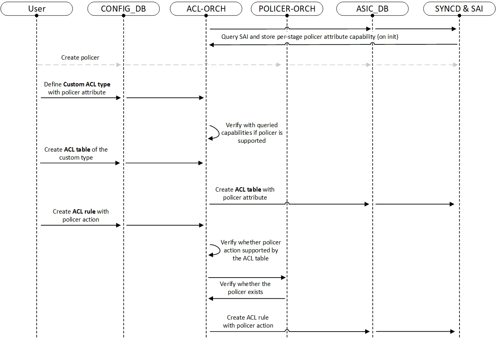

# Custom ACL Based Metering

### Table Of Contents
- [Custom ACL Based Metering](#custom-acl-based-metering)
    - [Table Of Contents](#table-of-contents)
    - [Revision](#revision)
    - [Scope](#scope)
    - [Definitions/Abbreviations](#definitionsabbreviations)
    - [Overview](#overview)
    - [Requirements](#requirements)
      - [Functional Requirements](#functional-requirements)
    - [Scalability Requirements:](#scalability-requirements)
      - [CLI Requirements](#cli-requirements)
    - [Architecture Design](#architecture-design)
    - [High-Level Design](#high-level-design)
      - [Custom ACL Mechanism](#custom-acl-mechanism)
      - [**Configuration Flow**](#configuration-flow)
    - [Configuration and Management](#configuration-and-management)
      - [Config DB Enhancements](#config-db-enhancements)
        - [ACL Tables Table --\> No Change](#acl-tables-table----no-change)
        - [ACL Table Type Table](#acl-table-type-table)
        - [ACL Rules Table](#acl-rules-table)
      - [YANG Model Enhancements](#yang-model-enhancements)
      - [CLI Config Commands](#cli-config-commands)
      - [CLI Show Commands](#cli-show-commands)
    - [SAI API](#sai-api)
    - [Warmboot and Fastboot Design Impact](#warmboot-and-fastboot-design-impact)
    - [Restrictions/Limitations](#restrictionslimitations)
    - [Testing Requirements/Design](#testing-requirementsdesign)
      - [Unit Test Cases](#unit-test-cases)
      - [System Test Cases](#system-test-cases)
      - [CLI Level Tests](#cli-level-tests)
        - [Negative Test Cases](#negative-test-cases)
      - [DB validation](#db-validation)
    - [Open/Action Items](#openaction-items)
      - [Related HLDs](#related-hlds)
---

### Revision

| Version | Date       | Author                       | Description   |
| ------- | ---------- | ---------------------------- | ------------- |
| 1.0     | 2024-10-13 | Shay Goldshmit (**Marvell**) | Initial Draft |

---
### Scope

This document describes the Custom ACL Based Metering (CABM) feature design in SONiC.

---
### Definitions/Abbreviations

| Term | Definition                         |
| ---- | ---------------------------------- |
| ACL  | Access Control List                |
| NAT  | Network Address Translation        |
| SAI  | Switch Abstraction Interface       |
| CIR  | Committed Information Rate         |
| CBS  | Committed Burst Size               |

---
### Overview

The Custom ACL-Based Metering (CABM) feature extends SONiC's capabilities to provide granular traffic management by integrating policers with ACL rules.
Policers are essential tools for **metering** (Monitoring the rate of traffic) and **marking** (Flagging traffic that exceeds defined limits) traffic based on predefined criteria.

By leveraging flexible ACL tables with customized match fields and action sets, CABM allows customers to implement smart traffic policies dedicated to their needs.
This flexibility ensures scalability and adaptability in diverse network environments.

Usage examples:
- **Security**: Custom ACL Based Metering can be used to guard against **DoS attacks (such as TCP SYN attacks)**.
  This can be done by defining rules that detect specific traffic patterns (e.g., TCP SYN packets) and applies rate-limiting policers to minimize their impact.
- **Efficient Bandwidth Distribution**: Ensures bandwidth is allocated effectively across applications and services by rate-limiting specific traffic types (e.g., backup traffic sent with SCP or FTP), ensuring priority traffic can operate without interruption.

---
### Requirements
#### Functional Requirements
- Backward compatibility for existing ACL features.
- Ability to bind policers to ACL entries.
- Extend [ACL User Defined Table Type](https://github.com/sonic-net/SONiC/blob/master/doc/acl/ACL-Table-Type-HLD.md) (custom ACL type) mechanism with policers.
- Ability to have customer specific table that contains a list of actions and match fields.
- Gracefully handle unsupported or invalid configurations (e.g., rules referencing non-existent policers).
### Scalability Requirements:
- Support binding of multiple ACL rules to a single policer.
- Query and validate SAI capabilities.
#### CLI Requirements
- Extend ACL table command to support policer.
- Extend ACl rules command to bind and unbind rule to policers.
- Support show ACL rules command with policers.
---
### Architecture Design

No SONiC architecture changes are required as the existing infrastructure is being used.

---
### High-Level Design

#### Custom ACL Mechanism
SONiC currently supports [ACL User Defined Table Types](https://github.com/sonic-net/SONiC/blob/master/doc/acl/ACL-Table-Type-HLD.md) that enables customers to define flexible ACL tables tailored to specific operational needs.
This mechanism extends SONiC’s ACL framework by allowing users to specify their own match fields and actions supporting a wide range of traffic management policies.

Custom ACL Based Metering (CABM) builds directly upon this custom ACL mechanism by introducing support for policer actions within custom ACL table types, allowing customers to enforce advanced traffic management policies.

#### **Configuration Flow**




1. Query Capabilities on Initialization: ACL-Orch queries SAI to retrieve supported ACL actions, including SAI_ACL_ACTION_TYPE_SET_POLICER.
2. Create Policer Object: Policer configurations are defined in POLICER_TABLE, validated, and created in SAI.
3. Define Custom ACL Table Type: Users define custom ACL table types in ACL_TABLE_TYPE with specified matches and actions, including POLICER_ACTION.
4. Verify Table Capabilities: ACL-Orch ensures that the custom table type's action set, including POLICER_ACTION, is supported by the queried SAI capabilities.
5. Create ACL Table: Add an ACL table in ACL_TABLE, referencing the custom table type and validates the configuration.
6. Create ACL Rule: Add an ACL rule in ACL_RULE, referencing actions, including policer_action.
7. Verify Rule Compatibility: ACL-Orch validates that the rule action compatibility with the associated ACL table type.
8. Verify and Map Policer to SAI Object: Policer-Orch maps the policer_action name if it exists from CONFIG_DB to SAI object IDs.
9. Program ACL Rule in SAI: ACL-Orch programs ACL rule entries into SAI associating them with the policer object.

---

### Configuration and Management
#### Config DB Enhancements

##### ACL Tables Table --> No Change

##### ACL Table Type Table
When a new ACL table is created, SAI needs to receive a list of supported actions which the rules belonging to this table are allowed to use.
To support the new policer action, the custom table types table schema will be extended with a policer action attribute - **"POLICER_ACTION"** for the actions attribute field.

```
key: ACL_TABLE_TYPE|<TYPE_NAME>               ; key of the ACL table type entry.
                                              ; the name is arbitary name user chooses.
;field        = value
matches       = match-list                    ; list of matches for this table.
                                              ; matches are same as in ACL_RULE table.
actions       = action-list                   ; list of actions for this table.
                                              ; ["REDIRECT_ACTION", ... , "POLICER_ACTION"]
```

##### ACL Rules Table
The CONFIG_DB ACL Rules Table schema will be updated with a new attribute field **"policer_action"** with the value of one of the existing policer object names.

```
key: ACL_RULE|<TABLE_NAME>|<RULE_NAME>        ; key of the rule entry in the table,
                                              ; seq is the order of the rules
                                              ; when the packet is filtered by the
                                              ; ACL "policy_name".
                                              ; A rule is always associated with a policy.
;field        = value
priority      = 1*3DIGIT                      ; rule priority. Valid values range
                                              ; could be platform dependent

packet_action = "FORWARD"/"DROP"/"DO_NOT_NAT" ; action when the fields are matched

mirror_ingress_action = 1*255VCHAR            ; refer to the mirror session
...
+ policer_action = 1*255VCHAR                 ; refer to the policer object name
```

#### YANG Model Enhancements

sonic-yang-models/yang-templates/**sonic-acl**.yang.j2:
```c++
    ...
+   import sonic-policer {
+       prefix policer;
+   }
    ...
    container sonic-acl {
        container ACL_RULE {
            ...
            leaf MIRROR_INGRESS_ACTION {
                type leafref {
                    path "/sms:sonic-mirror-session/sms:MIRROR_SESSION/sms:MIRROR_SESSION_LIST/sms:name";
                }
            }

+           leaf POLICER_ACTION {
+               type leafref {
+                   path "/policer:sonic-policer/policer:POLICER/policer:POLICER_LIST/policer:name";
+               }
+           }
        }

        container ACL_TABLE_TYPE {
            ...
            leaf-list ACTIONS {
                type string;
                default "";
            }
            ...
          }
      }
```

sonic-yang-models/yang-templates/**sonic-policer**.yang.j2:
```c++
    ...
+   import sonic-acl {
+       prefix acl;
+   }
    ...
    container sonic-policer {
        container POLICER {
        ...
+        /* prevent deletion of policer that referenced by ACL rule.
+           Note that new policer won't be referenced by any ACL rules initially */
+           must "not(../acl:sonic-acl/acl:ACL_RULE/acl:ACL_RULE_LIST[acl:policer_action=current()/name])" {
+               error-message "Policer cannot be deleted when referenced by an ACL rule.";
+           }
        }
    }
```

#### CLI Config Commands

- **Policers configuration** - No changes (no CLI commands).

- **ACL configuration:**
Two options to bind policer with ACL rules:

1. Use the "config load" command to load the complete JSON file to CONFIG_DB.
   This method enables flexibility to bind different policers to different rules in the same ACL:
```JSON
    /* Example for JSON file 'acl_with_policer_example.json': */
    {
        /* create 2 policers */
        "POLICER_TABLE|M_POLICER_7": {
            "meter_type": "packets",
            "mode": "tr_tcm",
            "color": "aware",
            "cir": "5000",
            "cbs": "5000",
            "green_packet_action": "forward",
            "red_packet_action": "drop"
        },
        "POLICER_TABLE|M_POLICER_93": {
            "meter_type": "packets",
            "mode": "tr_tcm",
            "color": "aware",
            "cir": "73000",
            "cbs": "82000",
            "red_packet_action": "drop"
        },

        /* create custom ACL table type */
        "ACL_TABLE_TYPE": {
          "CUSTOM_1_POLICER": {
            "MATCHES": [
                "IN_PORTS",
                "SRC_IP",
            ],
            "ACTIONS": [
             "REDIRECT_ACTION",
          +  "POLICER_ACTION"
            ],
          }
        }

        /* create ACL policer type table */
        "ACL_TABLE|MY_ACL_1": {
            "policy_desc": "Limit some traffic flows",
            "type": "CUSTOM_1_POLICER",
            "ports": [
                "Ethernet2",
                "Ethernet4",
                "Ethernet7"
            ],
            "OP": "SET"
        },

        /* create 2 rules with polcier action */
        "ACL_RULE|MY_ACL_1|MY_RULE_1": {
            "priority": "70",
          + "policer_action": "M_POLICER_7",
            "IP_PROTOCOL": "TCP",
            "SRC_IP": "10.2.130.0/24",
            "DST_IP": "10.5.170.0/24",
            "L4_SRC_PORT_RANGE": "1024-65535",
            "L4_DST_PORT_RANGE": "80-89",
            "OP": "SET"
        },
        "ACL_RULE|MY_ACL_1|MY_RULE_2": {
            "priority": "80",
          + "policer_action": "M_POLICER_93",
            "IP_PROTOCOL": "TCP",
            "SRC_IP": "192.168.0/24",
            "DST_IP": "10.5.170.0/24",
            "L4_SRC_PORT_RANGE": "1024-65535",
            "L4_DST_PORT_RANGE": "80-89",
            "OP": "SET"
        }
    }

    /* load the file to CONFIG_DB */
    config load acl_with_policer_example.json
```

2. Extending the existing "config acl" CLI to support a new optional argument **"policer_name"**.
   All rules that belong to that table (as part of the JSON file) will be bound with that policer object.
```bash
    # Config a new ACL table --> no change
    config acl add table [OPTIONS] <table_name> <table_type>

    # Config new ACL rules --> new optional field 'policer_name'
    config acl update full [OPTIONS] [--policer_name <policer_name>] <FILE_NAME>
    config acl update incremental [OPTIONS] [--policer_name <policer_name>] <FILE_NAME>

    # Example:
    config acl add table "MY_ACL_1" "Custom_1_POLICER"
    config acl update incremental "MY_ACL_1" --policer_name "M_POLICER_7" rules_example.json

    # note that these commands wrapps "AclLoader" utility script that uses the external "open_config" lib
```

#### CLI Show Commands
```bash
# Show existing policers --> no change
show policer [OPTIONS] [POLICER_NAME]

# Show existing ACL tables --> no change
show acl table [OPTIONS] [TABLE_NAME]

# Show existing ACL rules --> prints are contained the new proposal field
show acl rule [OPTIONS] [TABLE_NAME] [RULE_ID]

# note that these commands wrraps "AclLoader" utility script


# Example:
admin@sonic:~$ show acl rule
Table         Rule          Priority      Actions                    Match
--------      ------------  ----------    -------------------------  ----------------------------
MY_ACL_1      MY_RULE_1     60            POLICER:  M_POLICER_7      IP_PROTOCOL: 17

MY_ACL_1      MY_RULE_2     70            POLICER:  M_POLICER_93     L4_SRC_PORT: 80

MY_ACL_1      MY_RULE_3     80            POLICER:  M_POLICER_93     L4_SRC_PORT: 443

MY_ACL_1      MY_RULE_4     90            REDIRECT: Ethernet8        L4_SRC_PORT: 20
```

---

### SAI API

Use these **existing** SAI attributes for ACL actions and ACE action:

| SAI Table Attribute                       | Description                                                                 |
| ---------------------------------------   | --------------------------------------------------------------------------- |
|   SAI_ACL_TABLE_ATTR_ACL_ACTION_TYPE_LIST | List of action types that can be applied in the ACL table                   |
|   SAI_ACL_ACTION_TYPE_PACKET_ACTION       | Action type (Forward, Drop, etc) that can be taken in that ACL entry        |
| + SAI_ACL_ACTION_TYPE_SET_POLICER         | Action type (policer) that can be taken in that ACL entry                   |


| SAI Rule Attribute                        | Description                                                                 |
| ---------------------------------------   | --------------------------------------------------------------------------- |
|   SAI_ACL_ENTRY_ATTR_ACTION_PACKET_ACTION | Action (Forward, Drop, etc) to be executed on packets matching the ACL rule |
| + SAI_ACL_ENTRY_ATTR_ACTION_SET_POLICER   | Action (policer) to be executed on packets matching the ACL rule            |

---

### Warmboot and Fastboot Design Impact
During warmboot or fastboot, both ACL rules and policers configurations are restored from the CONFIG_DB.

---
### Restrictions/Limitations

- Policers must be supported.
- PRE/POST INGRESS stage isn't supported (not supported by the existing ACL creation logic).
- Single Action per Rule - each ACL rule performs one action due to the existing ACL-Orch implementation.

---
### Testing Requirements/Design
#### Unit Test Cases
- Create custom acl table type with policer attribute.
- Create acl table of the custom type and add acl rule with policer action.
- Delete acl rule with valid policer action.
- Create acl rule with valid policer and try to delete the policer.
- Create acl rule with action as non-existent policer.
- Test ACL-Orch and Policer-Orch logic for correct processing.
#### System Test Cases
- Ensure correct packet marking based on policer configurations.
- Test different traffic patterns and rates to ensure consistent marking.
- Warm/Fast reboot tests
  - verify that policer configurations are preserved across reboots.
  - verify that ACL configurations are preserved across reboots.
#### CLI Level Tests
- Verify command run successfully with valid policer parameter.
- Verify command abort with invalid policer parameter.
- Verify show acl rule command display the policer parameter.
- Verify binding and unbinding policers with ACL rules.
##### Negative Test Cases
  - Configure a rule with an action not listed in the custom ACL table type's action set, verify that the configuration is rejected with an appropriate error message.
  - Configure a rule with a non-existent policer name, verify that the configuration is rejected with an appropriate error message.
  - Attempt to delete a policer referenced by active ACL rules, verify that the deletion is blocked with an appropriate error message.
#### DB validation
- Verify CONFIG DB is correctly updated.
---
### Open/Action Items

---
#### Related HLDs
- [Everflow](https://github.com/sonic-net/SONiC/blob/master/doc/everflow/SONiC%20Everflow%20Always-on%20HLD.pdf) - Creating and managing policers.
- [ACL User Defined Table Type Support](https://github.com/sonic-net/SONiC/blob/master/doc/acl/ACL-Table-Type-HLD.md) - Introducing a new concept of user defined ACL table types in SONiC.
- [Policer Counter](https://github.com/sonic-net/SONiC/blob/e3f439dcfe2857540a02e4449fce247d4167b621/doc/policer_counter/PolicerCounter-HLD.md#Architecture-Design) - Display and check matching policer statistics.