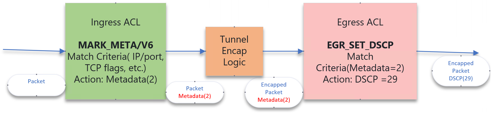

# Egress Outer DSCP change table

Support a new ACL Table Type that can change Outer DSCP fields of an encapsulated packet based on inner L3 header


## Problem overview
Currently, the SONiC ACL tables do not have the capability to set the outer DSCP field value of an encapsulated packet based on the original packet's L3 header fields. While Ingress L3 ACL tables can be used to change the original packet's DSCP value and tunnel configurations can be used to copy it to the outer header, this solution does not preserve the original DSCP value of the inner packet. On the other hand, the Egress L3 ACL can be used to change the DSCP value of the encapsulated packet, but it is not able to match the inner L3 fields of the encapsulated packets. Although some hardware platforms may have the ability to match the Inner L3 header fields in the Egress stage ACL, this capability is not uniformly available for all hardware platforms. 

This proposal introduces a new table type that allows for changing the DSCP value of the encapsulated packet's outer header based on the original packet's L3 header fields.


## Table of Contents
- [Egress Outer DSCP change table](#egress-outer-dscp-change-table)
- [Problem overview](#Problem-overview)
- [Revision](#Revision)
- [Scope](#Scope)
- [Overview](#Overview)
- [Terminology](#Terminology)
- [Requirements](#requirements)
- [Architecture Design](#architecture-design)
- [High-Level Design](#high-level-design)
  - [Option-A: Ingress and Egress Tables with management of metadata by user](#option-a-ingress-and-egress-tables-with-management-of-metadata-by-user)
  - [Option-B: Augment existing L3/L3V6 tables to include support for metadata action type](#option-b-augment-existing-l3l3v6-tables-to-include-support-for-metadata-action-type)
  - [Option-C: Create a dummy table type which translates into MARK_META/V6 and EGR_SET_DSCP as in the approach mentioned above. Manage the metadata internally](#option-c-create-a-dummy-table-type-which-translates-into-mark_metav6-and-egr_set_dscp-as-in-the-approach-mentioned-above-manage-the-metadata-internally)
- [Implementation](#implementation)
  - [SAI API](#sai-api)
  - [YANG model changes](#yang-model-changes)
  - [Example Configuration](#example-configuration)
  - [CLI](#cli)
    - [ACL table create CLI](#acl-table-create-cli)
- [Warmboot and Fastboot Design Impact](#warmboot-and-fastboot-design-impact)
- [Testing Requirements/Design](#testing-requirementsdesign)
  - [Unit Test cases](#unit-test-cases)
  - [System Test cases](#system-test-cases)

### Revision  


| Rev | Date     | Author          | Change Description |
|:---:|:--------:|:---------------:|--------------------|
| 0.1 | 07/10/24 | shahzad Iqbal (**Microsoft**)   | Initial Draft.  |

### Scope  


This document discusses the various design options to change the outer DSCP value of an encapsulated packet based on the inner L3 header fields using ACLs. It then provides the high-level design in SONiC to support two new ACL table types called **UNDERLAY_SET_DSCP** and **UNDERLAY_SET_DSCPV6**.

### Terminology


| SONiC User ACL Table Types     | Description |
|---------------|--------------------|
| Underlay DSCP | The DSCP value of the outer packet header after the packet has been encapsulated.|
| Overlay DSCP  | The DSCP value of the original unencapsulated packet. |
| Metadata attribute| A SAI ACL match attribute which allows packet matching based on the metadata value set by previous stage ACL. |
| Metadata action | A SAI ACL action which allows setting the metadata value associated with a packet. The metadata is not part of the packet itself but is kept along with the packet by the pipeline.|
|  MARK_META/V6 | This term is used to represent both MARK_META and MARK_METAV6 tables.|
| UNDERLAY_SET_DSCP/V6 | This term is used to represent both UNDERLAY_SET_DSCP and UNDERLAY_SET_DSCPV6 tables.|


### Overview 

This document describes the orchagent support by which the user can create a new ACL table of type UNDERLAY_SET_DSCP/V6 on platforms that support the underlying SAI capabilities.

*This new table requires ASICs to support the SAI_ACL_ENTRY_ATTR_ACTION_SET_ACL_META_DATA and SAI_ACL_ENTRY_ATTR_FIELD_ACL_USER_META fields.*

The recommended design approach would translate the new defined tables into three internal tables. MARK_META/V6 and EGR_SET_DSCP. The MARK_META/V6 tables would set the metadata field associated with the packet and EGR_SET_DSCP would set the DSCP field based on the metadata value.


<p align=center>

</p>


### Requirements

1. Support DSCP change of the outer header for an encapsulated IPv4/IPv6 packets. The orignal packet may be IPv4/IPv6 as well, and the DSCP change for both should be supported.
2. Match Criteria supported should be the same as standard L3 IPv4/IPv6 match criteria.
3. Platform capabilities should be utilized to determine if these tables can be created and the supported range of metadata values.
4. The solution should be extendable in a way that more action types can be added later.
5. Reuse resources as much as possible to reduce TCAM utilization.


### Architecture Design 


ACL Orchagent is enhanced to achieve these requirements. There are no architecture changes.


### High-Level Design 


The following design options were considered:
-  **Option-A**: create only the 3 tables MARK_META, MARK_METAV6, and EGR_SET_DSCP and let the user manage the metadata field themselves.
-  **Option-B**: Augment the existing L3 and L3V6 tables to include SET_METADATA action and create the EGR_SET_DSCP table.
-  **Option-C**: Create a dummy table type that translates into MARK_META/V6 and EGR_SET_DSCP as in the approach mentioned above. Manage the metadata internally.


#### Option-A: Ingress and Egress Tables with management of metadata by user.


This approach involves defining 3 new tables with the following schema. The Orchagent can provide the metadata capability and range via the ACL_ACTIONS table in STATEDB. The user can create ACLs for both MARK_META and EGR_SET_DSCP. The user would also ensure that the metadata value they choose must be supported by the platform. They can then create entries for the MARK_META table to specify the match criteria and entries for the EGR_SET_DSCP to change the DSCP value based on the metadata value. The user can reuse the same EGR_SET_DSCP entry for various IPv4 and IPv6 flows.

##### User accessible tables
    /*
     * MARK_META
     * |----------------------------------------------------|
     * |                        |              |            |
     * |    Match Type          |   Actions    |    Bind    |
     * |                        |              |   points   |
     * |----------------------------------------------------|
     * |  MATCH_SRC_IP        | SET_METADATA |      PORT    |
     * |  MATCH_DST_IP        |              |      LAG     |
     * |  MATCH_IP_PROTOCOL   |              |              |
     * |  MATCH_L4_SRC_PORT   |              |              |
     * |  MATCH_L4_DST_PORT   |              |              |
     * |  MATCH_TCP_FLAGS     |              |              |
     * |  MATCH_DSCP          |              |              |
     * |----------------------------------------------------|
     
     * MARK_METAV6
     * |----------------------------------------------------|
     * |                        |              |            |
     * |    Match Type          |   Actions    |    Bind    |
     * |                        |              |   points   |
     * |----------------------------------------------------|
     * |  MATCH_SRC_IPV6        | SET_METADATA |    PORT    |
     * |  MATCH_DST_IPV6        |              |    LAG     |
     * |  MATCH_IPV6_NEXT_HEADER|              |            |
     * |  MATCH_L4_SRC_PORT     |              |            |
     * |  MATCH_L4_DST_PORT     |              |            |
     * |  MATCH_DSCP            |              |            |
     * |----------------------------------------------------|

     * EGR_SET_DSCP
     * |----------------------------------------------------|
     * |                        |              |            |
     * |    Match Type          |   Actions    |    Bind    |
     * |                        |              |   points   |
     * |----------------------------------------------------|
     * |  MATCH_METADATA        | SET_DSCP     |    PORT    |
     * |                        |              |    LAG     |
     * |----------------------------------------------------|
     */


##### Pros
- Ease of Implementation: The changes to the Orchagent would be minimal.
- Specific ACL table port bindings: Since the packet can come from a few set of ports but can go out on any of the ports available, the MARK_META/V6 tables need to be bound to only the ports from which the packet is expected. The EGR_SET_DSCP would be bound to all the ports except loopback and internal ports.

##### Cons
This mechanism has a major disadvantage from the user's perspective. They would need to keep track of the Metadata availability and range. They would also need to keep track of the relationship between MARK_META/V6 entries and EGR_SET_DSCP entries as one entry of EGR_SET_DSCP may be referenced by multiple entries from the other tables. This would expose the user to the internal functioning of the ACL metadata capability.


#### Option-B: Augment existing L3/L3V6 tables to include support for metadata action type.

This approach is similar to Option A with the exception that instead of creating new Ingress tables such as MARK_META/V6, the existing L3 and L3V6 tables would be augmented to include SET_METADATA action field. This would still require the creation of an EGR_SET_DSCP table. This has the advantages of Option A with less ingress stage TCAM utilization.

##### User accessible tables
    /*
     * L3 table augmentation
     * |----------------------------------------------------|
     * |                        |              |            |
     * |    Match Type          |   Actions    |    Bind    |
     * |                        |              |   points   |
     * |----------------------------------------------------|
     * | No additionnal Match | SET_METADATA*|              |
     * |----------------------------------------------------|
     
     * L3V6 Table augmentation
     * |----------------------------------------------------|
     * |                        |              |            |
     * |    Match Type          |   Actions    |    Bind    |
     * |                        |              |   points   |
     * |----------------------------------------------------|
     * | No additionnal Match | SET_METADATA*|              |
     * |----------------------------------------------------|

     * EGR_SET_DSCP
     * |----------------------------------------------------|
     * |                        |              |            |
     * |    Match Type          |   Actions    |    Bind    |
     * |                        |              |   points   |
     * |----------------------------------------------------|
     * |  MATCH_METADATA        | SET_DSCP     |    PORT    |
     * |                        |              |    LAG     |
     * |----------------------------------------------------|
     */


##### Pros
- Ease of Implementation: The changes to the Orchagent would be minimal.
- The TCAM utilization would be minimal with the introduction of just one egress table. This table would be associated with all the ports excluding loopback and internal ports.

##### Cons
Apart from the cons mentioned in Option A, this approach may not work on all platforms as some platforms use the same TCAM entry space for actions. This can result in the increase of L3 and L3V6 table footprint. Such a change would break backward compatibility.
Due to this reason, this option may not be viable at all.


#### Option-C: Create a dummy table type which translates into MARK_META/V6 and EGR_SET_DSCP as in the approach mentioned above. Manage the metadata internally.

This option is similar to Option A except it tracks the metadata and EGR_SET_DSCP entry internally in the Orchagent. In this option, 5 different tables are defined, but two of them are user-facing and are not internally created. Instead, they are translated into the three internal tables by Orchagent.
The user would create ACL based on UNDERLAY_SET_DSCP/UNDERLAY_SET_DSCPV6 tables and add entries to them. The action parameters of these tables are SET_DSCP. The Orchagent would then allocate/assign metadata value based on the DSCP value and translate these entries into entries for MARK_META/V6 tables. It would also create the entry for EGR_SET_DSCP based on metadata and DSCP values. One instance of EGR_SET_DSCP would suffice for both V4 and V6 tables.
In addition, by keeping track of DSCP and metadata values, the entries in the EGR_SET_DSCP would be reference-checked and reused whenever possible.

##### User accessible tables


    /*
     * UNDERLAY_SET_DSCP
     * |----------------------------------------------------|
     * |                        |              |            |
     * |    Match Type          |   Actions    |    Bind    |
     * |                        |              |   points   |
     * |----------------------------------------------------|
     * |  MATCH_SRC_IP        |   SET_DSCP   |      PORT    |
     * |  MATCH_DST_IP        |              |      LAG     |
     * |  MATCH_IP_PROTOCOL   |              |              |
     * |  MATCH_L4_SRC_PORT   |              |              |
     * |  MATCH_L4_DST_PORT   |              |              |
     * |  MATCH_TCP_FLAGS     |              |              |
     * |  MATCH_DSCP          |              |              |
     * |----------------------------------------------------|
     
     * UNDERLAY_SET_DSCPV6
     * |----------------------------------------------------|
     * |                        |              |            |
     * |    Match Type          |   Actions    |    Bind    |
     * |                        |              |   points   |
     * |----------------------------------------------------|
     * |  MATCH_SRC_IPV6        |   SET_DSCP   |    PORT    |
     * |  MATCH_DST_IPV6        |              |    LAG     |
     * |  MATCH_IPV6_NEXT_HEADER|              |            |
     * |  MATCH_L4_SRC_PORT     |              |            |
     * |  MATCH_L4_DST_PORT     |              |            |
     * |  MATCH_DSCP            |              |            |
     * |----------------------------------------------------|
     */


##### Internal tables


    /*
     * MARK_META
     * |----------------------------------------------------|
     * |                        |              |            |
     * |    Match Type          |   Actions    |    Bind    |
     * |                        |              |   points   |
     * |----------------------------------------------------|
     * |  MATCH_SRC_IP        | SET_METADATA |     PORT     |
     * |  MATCH_DST_IP        |              |     LAG      |
     * |  MATCH_IP_PROTOCOL   |              |              |
     * |  MATCH_L4_SRC_PORT   |              |              |
     * |  MATCH_L4_DST_PORT   |              |              |
     * |  MATCH_TCP_FLAGS     |              |              |
     * |  MATCH_DSCP          |              |              |
     * |----------------------------------------------------|
     
     * MARK_METAV6
     * |----------------------------------------------------|
     * |                        |              |            |
     * |    Match Type          |   Actions    |    Bind    |
     * |                        |              |   points   |
     * |----------------------------------------------------|
     * |  MATCH_SRC_IPV6        | SET_METADATA |    PORT    |
     * |  MATCH_DST_IPV6        |              |    LAG     |
     * |  MATCH_IPV6_NEXT_HEADER|              |            |
     * |  MATCH_L4_SRC_PORT     |              |            |
     * |  MATCH_L4_DST_PORT     |              |            |
     * |  MATCH_DSCP            |              |            |
     * |----------------------------------------------------|

     * EGR_SET_DSCP
     * |----------------------------------------------------|
     * |                        |              |            |
     * |    Match Type          |   Actions    |    Bind    |
     * |                        |              |   points   |
     * |----------------------------------------------------|
     * |  MATCH_METADATA        | SET_DSCP     |    PORT    |
     * |                        |              |    LAG     |
     * |----------------------------------------------------|
     */


##### Metadata Management

Since not all platforms support metadata matching and action, the implementation would use SAI capability check to see if metadata action and match attributes are supported. In addition, the range of the metadata field would be checked by 'SAI_SWITCH_ATTR_ACL_USER_META_DATA_RANGE'.
The orcahagent would check if a DSCP action value has an assigned metadata value, thereby reusing the same value and EGR_SET_DSCP entry. If a DSCP value has no associated metadata value, a new one would be allcoated along with EGR_SET_DSCP entry.
Since these metadata values would be reused accross differnt ACLs and for both V4 and V6 type entries, Each metadata, DSCP combition would be reference counted.
During the processing of an ACL, if metadata allocation fails for an entry, the orchagent would return failure for that and subsequent entries and the user would have to remove the complete ACL.
 

##### EGR_SET_DSCP Management

The EGR_SET_DSCP table would be created and managed by the orchagent internally. Only a single instance of this table would be created upon creation of UNDERLAY_SET_DSCP/V6 table and subsequent tables of type UNDERLAY_SET_DSCP/V6 would reuse this instance. By employing ref-counting this table would be retained until the last user of this table is removed. Entries in this table would also be ref-counted as mnetioned in above section.
The interface association of this table can be implemented in two ways. 

  1) EGR_SET_DSCP association with all dataplane interfaces. This approach is resource intensive and would require changes in portsOrch to accomodate exposing all ports to the AclOrch. However this allows us to decouple the ingress stage table port association from EGR_SET_DSCP.
  2) EGR_SET_DSCP be associated with a superset of all interfaces which are associated with tables referencing it. e.g. if UNDERLAY_SET_DSCP is associated with interfaces [a,b,c] and UNDERLAY_SET_DSCPV6 is associated with [c,d,e] then EGR_SET_DSCP would be associated with [a,b,c,d,e]. This gives the user of the feature the choice to limit port association when needed. Based on common use case pattern, the tables would almost always be associated with all data-plane interfaces. 


##### Pros

This approach has the benefit of providing a uniform interface to the user. The management and efficient utilization of resources is done by the Orchagent.


##### Cons

This approach adds complexity in the Orchagent and less resource effiecient as the user is forced to associate the UNDERLAY_SET_DSCP/V6 tables with interfaces which can have packets ingressing or egressing.


### Implementation

Based on the above design discussion, the designer's recommendation is to select option C.


#### SAI API 

There are no new SAI APIs required for this feature.


#### YANG model changes

```
--- a/models/yang/sonic/sonic-acl.yang
+++ b/models/yang/sonic/sonic-acl.yang

    container sonic-acl {

        container ACL_TABLE {
                :
                :
                leaf type {
                    type enumeration {
                        enum MIRROR;
                        enum MIRRORV6;
                        enum L3;
                        enum L3V6;
+                       enum UNDERLAY_SET_DSCP;
+                       enum UNDERLAY_SET_DSCPV6;
                    }
                }
                :
                :
            }
        }
```


#### Example Configuration
```
{
    "ACL_TABLE": {
        "OVERLAY_SET_DSCP_TEST": {
            "policy_desc": "OVERLAY_SET_DSCP_TEST_V4",
            "ports": [
                "PortChannel102",
                "PortChannel105",
                "PortChannel108",
                "PortChannel1011",
                "PortChannel1014",
                "PortChannel1017",
                "PortChannel1020",
                "PortChannel1023",
                "Ethernet64",
                "Ethernet68",
                "Ethernet72",
                "Ethernet76",
                "Ethernet80",
                "Ethernet84",
                "Ethernet88",
                "Ethernet92",
                "Ethernet96",
                "Ethernet100",
                "Ethernet104",
                "Ethernet108",
                "Ethernet112",
                "Ethernet116",
                "Ethernet120",
                "Ethernet124"
            ],
            "stage": "ingress",
            "type": "UNDERLAY_SET_DSCP"
        },
        "OVERLAY_SET_DSCP_TESTV6": {
            "policy_desc": "OVERLAY_SET_DSCP_TEST_V6",
            "ports": [
                "PortChannel102",
                "PortChannel105",
                "PortChannel108",
                "PortChannel1011",
                "PortChannel1014",
                "PortChannel1017",
                "PortChannel1020",
                "PortChannel1023",
                "Ethernet64",
                "Ethernet68",
                "Ethernet72",
                "Ethernet76",
                "Ethernet80",
                "Ethernet84",
                "Ethernet88",
                "Ethernet92",
                "Ethernet96",
                "Ethernet100",
                "Ethernet104",
                "Ethernet108",
                "Ethernet112",
                "Ethernet116",
                "Ethernet120",
                "Ethernet124"
            ],
            "stage": "ingress",
            "type": "UNDERLAY_SET_DSCPV6"
        }		
    }
}
{   "ACL_RULE": {
        "OVERLAY_SET_DSCP_TEST|RULE0": {
            "PRIORITY": "999",
            "DSCP_ACTION": "40",
            "SRC_IP": "1.1.1.1/32"
        },
        "OVERLAY_SET_DSCP_TEST|RULE1": {
            "PRIORITY": "998",
            "DSCP_ACTION": "42",
            "SRC_IP": "2.2.2.2/32"
        },
		"OVERLAY_SET_DSCP_TESTV6|RULE0": {
            "PRIORITY": "999",
            "DSCP_ACTION": "41",
			"SRC_IPV6": "2777::0/64",
            "DST_IPV6": "2788::0/64"
        },
        "OVERLAY_SET_DSCP_TESTV6|RULE1": {
            "PRIORITY": "998",
            "DSCP_ACTION": "42",
			"SRC_IPV6": "2666::0/64",
            "DST_IPV6": "2555::0/64"
        }
    }
}

```


#### CLI
##### ACL table create CLI 

The existing CLI is extended to support the new table types.
```
config acl add table -s <stage> -p <ports> <table_name> <table_type>
```
_table_type_ needs to be passed as _"UNDERLAY_SET_DSCPV6"_ or _"UNDERLAY_SET_DSCP"_  to create tables of new types.
```
Example : config acl add table -s ingress -p Ethernet0 DATAACL UNDERLAY_SET_DSCP
Example : config acl add table -s ingress -p Ethernet0 DATAACL UNDERLAY_SET_DSCPV6

```


### Warmboot and Fastboot Design Impact  

There is no impact on warmboot or fastboot.


### Testing Requirements/Design  

#### Unit Test cases 

- Verify ACL Capability in STATE_DB on supported platforms.
    - The new field `supported_UnderlaySetDSCPV6` must be true.
- Verify ACL Capability in STATE_DB on non-supported platforms.
    - The new field `supported_UnderlaySetDSCPV6` must be false.
- Verify ACL tables creation and deletion
    - The UNDERLAY_SET_DSCP and UNDERLAY_SET_DSCPV6 tables can be created and deleted togther and separately.
- Verify that both UNDERLAY_SET_DSCP/V6 can be bound to same ports as well as separate ports.
    - The EGR_SET_DSCP table is only created once and is bound to the superset of the ports for both UNDERLAY_SET_DSCP/V6 and removed when all referencing tables are removed.
- Verify that for multiple tables, different order of creation and removal should not have adverse affect.
    - The EGR_SET_DSCP table is only created once and is bound to the superset of the ports for both UNDERLAY_SET_DSCP/V6 and removed when all referencing tables are removed.
- Verify a single EGR_SET_DSP entry is created per a unique DSCP action value in the same table.
    - If multiple rules share the same SET_DSCP action value only one entry should be created. Also EGR_SET_DSP rule should be created with first entry and removed when last rule is removed.
- Verify a single EGR_SET_DSP entry is created per a unique DSCP action value accorss different tables.
    - If multiple rules share the same SET_DSCP action value only one entry should be created. Also EGR_SET_DSP rule should be created with first entry and removed when last rule is removed.
- Verfiy metadata allocation and deallocation
    - freed metadata values should be available for next allocation.
- Verfiy metadata allcoation failure.
    - when metadata is exhausted, this should result in failure.


#### System Test cases 

  New sonic-mgmt(PTF) tests *on supported platforms*
  * UNDERLAY_SET_DSCP/V6 creation failure test.
    - Create multiple tables so that tcam is full and ensure that UNDERLAY_SET_DSCP/V6 creation fails gracefully.
  * UNDERLAY_SET_DSCP/V6 traffic tests with tunneled packets.
    - Verify outer DSCP value change after packets are encapsualted.
  * UNDERLAY_SET_DSCP/V6 traffic tests with non-tunneled packets.
    - Verify DSCP value change even when packets are not encapsulated.
  * Metadata exhaustion with traffic test.
    - Verfiy metadata exhaustion results in graceful acl failure.
  * UNDERLAY_SET_DSCP/V6 multi-creation test with traffic.
    - Verfiy metadata value leak doesnt happen by creating and removing UNDERLAY_SET_DSCP/V6 entries multiple times in differnet order. Ensure proper function in each iteration with traffic.

### Addendum
### Changes proposed by the Community to be introduced in the next iteration
The following changes have been proposed by the community and would be incorporated in the next iteration of implementation.
These changes do not conflict with the Option C chosen for the current design implementation and would be incorporated as an enhancement.
Some of these changes can be hidden in the Orchagent implementation and would not require user API change.
Following are the changes.

1. A single Egress ACL table to match L3 v4/v6 inner payload fields (or separate V4, V6 tables) and change the outer DSCP field of encapsulated packet on platforms supporting this capability.
2. A single Ingress ACL table to match L3 v4/v6 inner payload fields and an egress set DSCP table to change the outer DSCP field of encapsulated packet on platforms supporting this capability.
3. Support for ACL binding to switch instead of ports.
4. (TODO) Request the SAI community to create a capability check to expose the ability to use either Single V4V6 or separate V4V6 Egress tables which can match inner header fields.

Based on these proposals, the Orchagent would try to create the tables in the following order and would attempt the next option if it fails with the first one.

1) Egress single V4V6 inner header match-Outer DSCP change table if possible for the platform.
2) Egress V4 or V6 inner header match-Outer DSCP change table if possible for the platform.
3) Single Ingress V4V6 inner header match table with metadata support and Single Egress Outer DSCP change table if possible for the platform.
4) Ingress V4 or V6 inner header match table with metadata support and Single Egress Outer DSCP change table. (Current design option C.)
