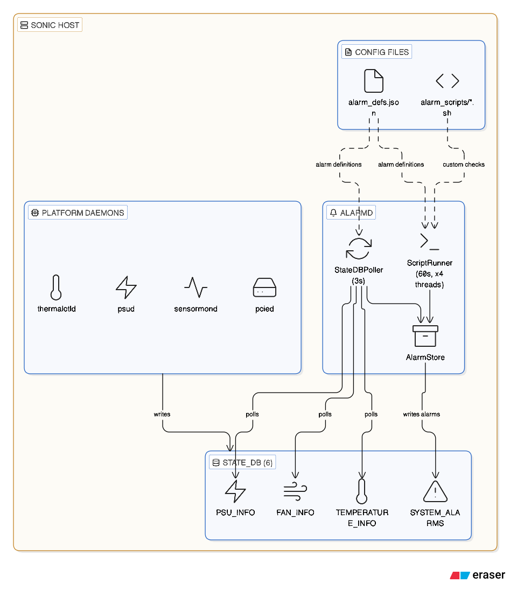

# alarmd — A Data-Driven Alarm Framework for SONiC

## Proposal for Upstream Community Discussion

**Date**: April 2026  
**Author**: Neel Datta  
**Status**: Pre-proposal / Initial discussion draft

---

## TL;DR

SONiC has no centralized, data-driven alarm system. Platform daemons (psud, thermalctld, sensormond, etc.) each write operational state to STATE_DB, but **nothing evaluates that data against fault conditions and presents a unified alarm view**. We've built `alarmd` — a generic, vendor-agnostic daemon that fills this gap with zero modifications to existing daemons. This doc introduces the idea for discussion.

---

## The Problem

Today in SONiC:

1. **No unified alarm table.** An operator who wants to know "what's currently broken on my switch?" has no single place to look. Fault state is scattered across PSU_INFO, FAN_INFO, TEMPERATURE_INFO, etc. — each with different field names and conventions.

2. **Hardware fault detection is hard-coded.** The closest thing we have is `system-health` / `healthd`, but its hardware checks are baked into Python code (`hardware_checker.py`). Adding a new check — say, per-field voltage thresholds or PMBus fault status — requires modifying healthd's source code.

3. **No structured alarm metadata.** healthd produces a binary OK/Not-OK per object. There's no alarm_id taxonomy, no severity levels, no category tags, and no dedicated queryable table a gNMI collector or CLI can subscribe to.

4. **The event framework was designed but not broadly adopted.** The `eventd` / event framework (HLD Rev 0.3, 2022) requires every producing daemon to call `event_publish()` with RAISE/CLEAR actions — meaning every daemon must be modified. Events are also transient fire-and-forget; there's no "current alarm state" concept.

5. **monit has no STATE_DB integration.** It monitors processes and basic system resources, but has no awareness of Redis tables. Its output is syslog-only.

**Bottom line:** There is no mechanism in SONiC where a platform vendor can say *"raise a Major alarm when this STATE_DB field equals this value"* without writing custom Python code.

---

## The Idea: `alarmd`

alarmd is a **pure consumer** of STATE_DB. It:

- Reads data that existing daemons **already publish** (zero modifications to psud, thermalctld, etc.)
- Evaluates conditions defined in **JSON config files** (no code changes to add/remove/modify checks)
- Writes structured alarm state to a single **`SYSTEM_ALARMS`** table in STATE_DB
- Runs external **scripts** for anything not in STATE_DB (CPU, disk, container health, custom HW)

### Architecture



### How It Works — The Input

All alarm logic is defined in JSON. Here's what the **common catalog** looks like (ships with the package, covers every SONiC platform out of the box):

```json
{
    "alarm_tables": [
        {
            "type": "statedb",
            "table_name": "PSU_INFO",
            "checks": [
                {
                    "check_name": "psu_presence",
                    "alarm_id": "PSU_MISSING",
                    "severity": "Critical",
                    "category": "Hardware",
                    "description_template": "{object_name} Absent",
                    "condition": {"field": "presence", "operator": "==", "value": "false"}
                },
                {
                    "check_name": "power_status",
                    "alarm_id": "PSU_POWER_BAD",
                    "severity": "Critical",
                    "category": "Hardware",
                    "description_template": "{object_name} Power Bad",
                    "condition": {"field": "status", "operator": "==", "value": "false"}
                }
            ]
        },
        {
            "type": "statedb",
            "table_name": "FAN_INFO",
            "checks": [
                {
                    "check_name": "fan_presence",
                    "alarm_id": "FAN_MISSING",
                    "severity": "Major",
                    "category": "Hardware",
                    "description_template": "{object_name} Absent",
                    "condition": {"field": "presence", "operator": "==", "value": "false"}
                },
                {
                    "check_name": "fan_status",
                    "alarm_id": "FAN_FAULT",
                    "severity": "Major",
                    "category": "Hardware",
                    "description_template": "{object_name} Fault",
                    "condition": {"field": "status", "operator": "==", "value": "false"}
                }
            ]
        }
    ]
}
```

**That's it.** No Python code. Want to add a temperature alarm? Add a JSON block:

```json
{
    "type": "statedb",
    "table_name": "TEMPERATURE_INFO",
    "checks": [
        {
            "check_name": "temp_critical",
            "alarm_id": "TEMP_CRITICAL",
            "severity": "Critical",
            "category": "Hardware",
            "description_template": "{object_name} Critical Temperature",
            "condition": {"field": "critical_status", "operator": "==", "value": "True"}
        }
    ]
}
```

There's also a **shorthand syntax** for brevity:

```json
{
    "table_name": "FAN_INFO",
    "checks_short": [
        ["FAN_MISSING",     "presence == false",      "Major"],
        ["FAN_FAULT",       "status == false",        "Major"],
        ["FAN_UNDER_SPEED", "is_under_speed == True", "Minor"],
        ["FAN_OVER_SPEED",  "is_over_speed == True",  "Minor"]
    ]
}
```

For **script-based checks** (things not in STATE_DB):

```json
{
    "type": "script",
    "group_name": "system_resources",
    "checks": [
        {
            "check_name": "cpu_usage",
            "alarm_id": "CPU_USAGE_HIGH",
            "severity": "Minor",
            "category": "System",
            "description_template": "System CPU Usage High",
            "command": "/etc/sonic/alarm_scripts/check_cpu.sh",
            "condition": {"operator": "!=", "value": "0"}
        }
    ]
}
```

### How It Works — The Output

#### SYSTEM_ALARMS STATE_DB Schema

```
SYSTEM_ALARMS|<alarm_id>|<object_name>
    "alarm_id":      "PSU_MISSING"
    "object_name":   "PSU 2"
    "severity":      "Critical"
    "category":      "Hardware"
    "source":        "PSU_INFO"
    "description":   "PSU 2 Absent"
    "time_created":  "2026-04-22 14:30:05.123"
    "status":        "active"
```

When the fault clears, the key is **deleted** from STATE_DB. The table always reflects **current** fault state only — no stale entries.

#### CLI Output

```
admin@sonic:~$ show alarms

Severity  Category  Alarm ID         Object  Description        Source    Time
--------  --------  ---------------  ------  -----------------  --------  ---------------------
Critical  Hardware  PSU_MISSING      PSU 2   PSU 2 Absent       PSU_INFO  2026-04-22 14:30:05
Minor     Hardware  FAN_UNDER_SPEED  FAN 5   FAN 5 Under Speed  FAN_INFO  2026-04-22 14:31:12

Total: 2 active alarm(s)
```

```
admin@sonic:~$ show alarms --summary

Alarm Summary
------------------------------
  Critical    : 1
  Major       : 0
  Minor       : 1
  Total       : 2
```

```
admin@sonic:~$ show alarms --json
[
  {
    "alarm_id": "PSU_MISSING",
    "object_name": "PSU 2",
    "severity": "Critical",
    "category": "Hardware",
    "source": "PSU_INFO",
    "description": "PSU 2 Absent",
    "time_created": "2026-04-22 14:30:05.123",
    "status": "active"
  }
]
```

Filter options: `--severity`, `--category`, `--object-name`, `--group-by`, `--json`.

---

## Common Catalog + Per-Platform Merge

The key to making this work across the entire community is the **two-tier config model**:

1. **Common catalog** (`common_alarm_defs.json`) — ships with the package. Contains PSU_INFO and FAN_INFO checks that work on every SONiC platform (10 checks using standardized field names from sonic-platform-common).

2. **Per-platform file** (`alarm_defs.json`) — optional. Vendors add their platform-specific checks (thermal thresholds, custom HW tables, scripts). Merged on top of common at load time.

**Merge rules are dead simple:**
- Same `table_name` → platform checks are appended (same `check_name` → platform wins)
- New `table_name` → added as new table
- `"disable": ["TABLE.check_name"]` → suppresses unwanted common checks

**If a platform provides no alarm_defs.json at all**, alarmd uses the common catalog directly. Every platform gets baseline PSU/fan alarm coverage for free — zero config.

---

## Comparison with system-health / healthd

| Aspect | system-health / healthd | alarmd |
|--------|------------------------|--------|
| **Hardware fault detection** | Hard-coded in `hardware_checker.py` — limited to ASIC temp, PSU presence/status/temp/voltage, fan presence/status/speed/direction | **Data-driven** — any STATE_DB table, any field, any condition, declared in JSON |
| **Adding a new check** | Modify Python source code, rebuild | Add a JSON entry, reload with SIGHUP |
| **Fault granularity** | Binary OK / Not-OK per object | Per-field alarm with alarm_id, severity, category, description |
| **Output** | `SYSTEM_HEALTH_INFO` — flat status dump | `SYSTEM_ALARMS` — structured, queryable, severity-tagged |
| **Alarm lifecycle** | No alarm concept — point-in-time status | Stateful: raise on fault, clear on recovery, delete from DB |
| **Script checks** | Yes (monit-style, via `user_defined_checker`) | Yes (any executable, exit code 0/non-0) |
| **Service monitoring** | Yes (via monit integration) | No (not its job — monit/healthd already do this well) |
| **System LED control** | Yes | No (orthogonal — could consume SYSTEM_ALARMS) |
| **NBI/gNMI integration** | Limited — flat status table | `SYSTEM_ALARMS` in STATE_DB is directly subscribable |
| **Platform onboarding effort** | N/A (same checks for everyone) | Zero for baseline; one JSON file for platform-specific |

**alarmd is not a replacement for healthd** — it's complementary. healthd excels at service liveness, container health, and system LED control. alarmd excels at structured, data-driven hardware fault detection. They could coexist, or alarmd's `SYSTEM_ALARMS` output could feed into healthd's overall system health assessment.

---

## Why Upstream This?

1. **Every vendor needs alarms.** Every SONiC deployment — whether on Broadcom, Mellanox, Barefoot, or Centec silicon — needs to know when a PSU fails, a fan dies, or a temperature threshold is crossed. Today, each vendor builds their own solution or relies on healthd's limited hard-coded checks.

2. **Zero changes to existing daemons.** alarmd is a pure consumer of STATE_DB. It doesn't touch psud, thermalctld, or any other daemon. It reads what they already publish. This makes adoption trivial.

3. **Data-driven = no code changes for new checks.** A platform vendor can go from "I need to alarm on this new field" to "it's in production" with a one-line JSON addition and a SIGHUP. No PRs to sonic-platform-daemons.

4. **Standardized alarm taxonomy.** A common `SYSTEM_ALARMS` table with consistent schema gives the entire community a unified interface for fault state — useful for gNMI telemetry, SNMP trap generation, or any NBI that wants structured alarm data.

5. **Works out of the box.** The common catalog provides baseline coverage on any SONiC platform with zero configuration. Vendors only write config for platform-specific needs.

6. **Follows existing SONiC patterns.** alarmd extends `DaemonBase` from `sonic_py_common`, uses `swsscommon` for DB access, runs as a systemd service, and follows the same code structure as healthd and psud. No new frameworks or dependencies.

---

## Implementation Summary

- **~1000 lines of Python** across 5 modules (entry point, alarm_store, statedb_poller, script_runner, config)
- Extends `DaemonBase` from `sonic_py_common` (same as healthd, psud)
- Uses only `swsscommon`, `sonic_py_common`, and Python stdlib — no new dependencies
- Runs as a systemd service (`After=sonic.target`)
- SIGHUP for live config reload without restart
- Hard limits on check counts and script timeouts to prevent runaway configs
- Full unit test suite

---

## What We're Asking

This is an early conversation. We'd love to get your thoughts on:

1. **Is this something the community would benefit from?** We think the gap is clear, but want to validate.
2. **Coexistence vs. integration with healthd** — should alarmd complement healthd, or should its alarm evaluation engine be folded into healthd as a new capability?
3. **Common catalog scope** — should the community-maintained common catalog cover more than PSU/FAN (e.g., TEMPERATURE_INFO, PCIE_DEVICES)?
4. **SYSTEM_ALARMS schema** — any feedback on the table structure before we propose it formally?

If there's interest, the next step would be a formal community HLD proposal with the full design, schema, test plan, and migration path.

---

*The code is implemented and tested. Happy to demo or share the implementation for review.*
