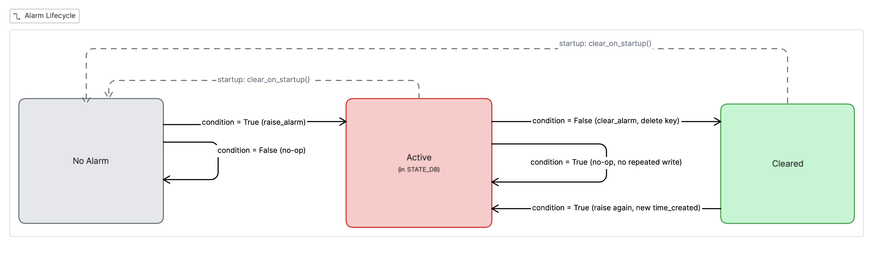
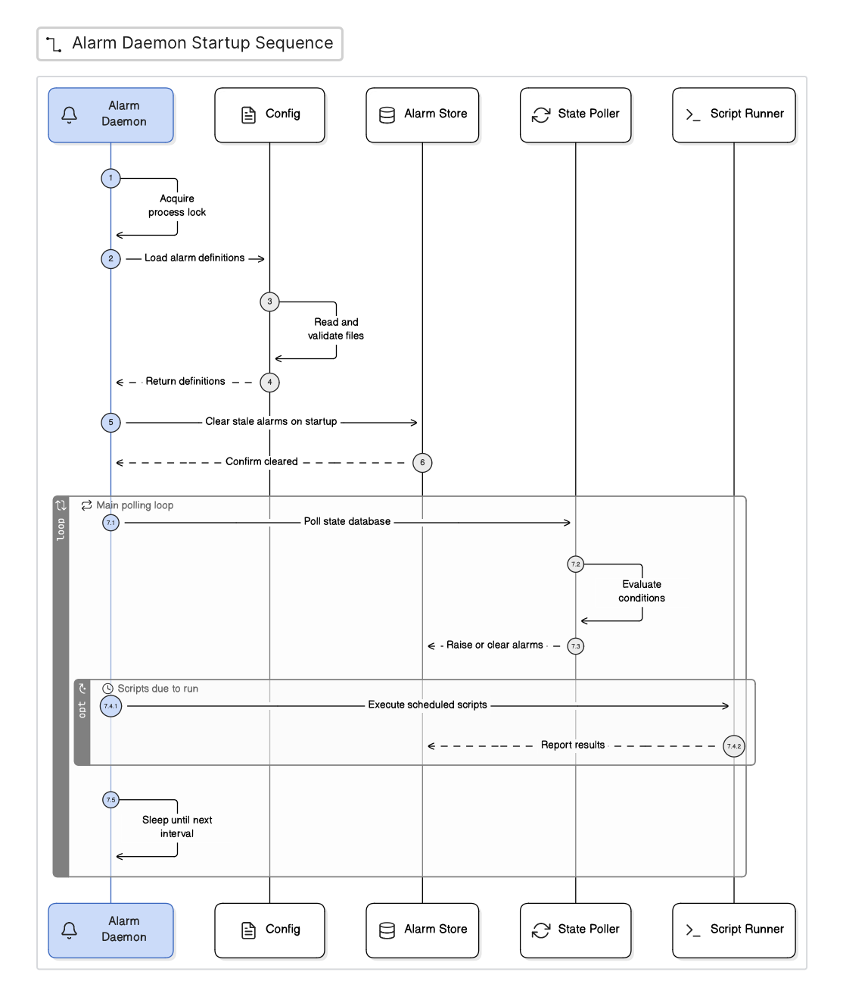
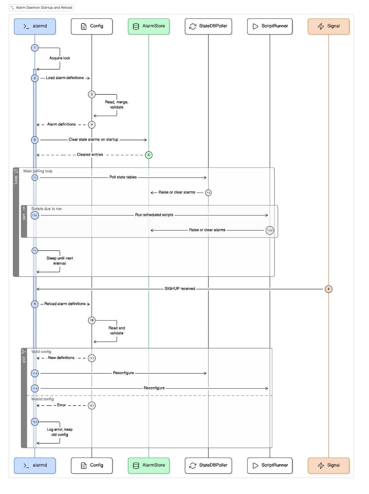

# alarmd -- SONiC Alarm Monitoring Daemon

## High Level Design Document


## Table of Contents

1. [Revision](#revision)
2. [Scope](#scope)
3. [Definitions and Abbreviations](#definitions-and-abbreviations)
4. [Overview](#overview)
5. [Requirements](#requirements)
6. [Architecture Design](#architecture-design)
7. [High-Level Design](#high-level-design)
   - 7.1 [Module Overview](#71-module-overview)
   - 7.2 [Repositories Changed](#72-repositories-changed)
   - 7.3 [StateDB Polling](#73-statedb-polling)
   - 7.4 [Script Execution](#74-script-execution)
   - 7.5 [Alarm Store](#75-alarm-store)
   - 7.6 [Alarm Lifecycle](#76-alarm-lifecycle)
   - 7.7 [Condition Evaluation](#77-condition-evaluation)
   - 7.8 [OR-Logic (Multiple Checks, Same alarm_id)](#78-or-logic)
   - 7.9 [Configuration Loading](#79-configuration-loading)
   - 7.10 [Common Alarm Catalog and Platform Merge](#710-common-alarm-catalog-and-platform-merge)
   - 7.11 [Shorthand Syntax](#711-shorthand-syntax)
   - 7.12 [Config Validation](#712-config-validation)
   - 7.13 [Hard Limits](#713-hard-limits)
   - 7.14 [Sequence Diagrams](#714-sequence-diagrams)
   - 7.15 [DB and Schema Changes](#715-db-and-schema-changes)
   - 7.16 [Linux Dependencies](#716-linux-dependencies)
   - 7.17 [Docker Dependency](#717-docker-dependency)
   - 7.18 [Build Dependency](#718-build-dependency)
   - 7.19 [Platform Dependencies](#719-platform-dependencies)
8. [SAI API](#sai-api)
9. [Configuration and Management](#configuration-and-management)
   - 9.1 [CLI Enhancements — show alarms](#91-cli-enhancements--show-alarms)
   - 9.2 [Alarm Definition Schema](#92-alarm-definition-schema)
10. [Warmboot and Fastboot Design Impact](#warmboot-and-fastboot-design-impact)
11. [Memory Consumption](#memory-consumption)
12. [Restrictions and Limitations](#restrictions-and-limitations)
13. [Testing Requirements](#testing-requirements)
    - 13.1 [Unit Tests](#131-unit-tests)
    - 13.2 [System Tests](#132-system-tests)
    - 13.3 [Scalability and Performance](#133-scalability-and-performance)
14. [Future Enhancements](#future-enhancements)
    - 14.1 [Runtime Configuration CLI (config alarm)](#141-runtime-configuration-cli)
    - 14.2 [Alarm History Table](#142-alarm-history-table)
15. [Open and Action Items](#open-and-action-items)

---

## 1. Revision


| Rev | Date       | Author     | Change Description |
|:---:|:----------:|:----------:|:-------------------|
| 0.1 | 04/28/2026 | Neel Datta | Initial version    |

---

## 2. Scope

This document describes the design of `alarmd`, a centralized alarm monitoring
daemon for SONiC. alarmd polls STATE_DB tables and executes external health-check
scripts to detect hardware and system faults, then writes alarm state to a
`SYSTEM_ALARMS` table in STATE_DB.

The scope covers:

- The alarmd daemon itself (architecture, data flow, alarm lifecycle).
- The alarm definition file format (JSON), including the common alarm catalog,
  per-platform merge mechanism, and shorthand syntax.
- The `SYSTEM_ALARMS` STATE_DB schema.
- The `show alarms` CLI commands.
- Integration with existing SONiC platform daemons (psud, thermalctld,
  sensormond, pcied, etc.) -- read-only, no modifications to those daemons.
- Cross-platform applicability: alarmd works on any SONiC platform. The
  alarm definitions are the only platform-specific component; the daemon
  itself is generic.


---

## 3. Definitions and Abbreviations

| Term | Definition |
|------|-----------|
| alarmd | The alarm monitoring daemon described in this document |
| SYSTEM_ALARMS | The STATE_DB table where alarmd writes alarm entries |
| alarm_id | A string identifier for an alarm type (e.g. `PSU_MISSING`, `FAN_FAULT`) |
| object_name | The specific instance an alarm applies to (e.g. `PSU 1`, `FAN 3`, `Ethernet4`) |
| alarm_defs | The `alarm_defs.json` file(s) that declare which STATE_DB fields or scripts to monitor and under what conditions to raise alarms |
| common catalog | The built-in `common_alarm_defs.json` file shipped with the `sonic_alarm` package, containing standard SONiC alarm definitions applicable to most platforms |
| merge | The mechanism where alarmd loads the common catalog as a baseline, then the per-platform `alarm_defs.json` adds or replaces tables and checks on top of it. Same `table_name` + `check_name` = platform wins. An optional `disable` list suppresses unwanted common checks. |
| shorthand | A compact single-line notation for alarm checks: `[alarm_id, "field op value", severity]` |

---

## 4. Overview

SONiC daemons (psud, thermalctld, sensormond, etc.)
each publish operational state to their respective STATE_DB tables (PSU_INFO,
FAN_INFO, TEMPERATURE_INFO, etc.). However, there is no
single daemon that evaluates this data against fault thresholds and presents a
unified alarm view.

alarmd fills this gap. It has two detection mechanisms:

1. **STATE_DB polling** — alarmd reads the data that existing daemons already
   publish, evaluates conditions defined in JSON alarm definition files, and
   writes alarm state to a single `SYSTEM_ALARMS` table. No existing daemon
   requires modification.

2. **Script execution** — for conditions not represented in STATE_DB, alarmd
   can execute external health-check scripts. Any executable that exits 0
   (healthy) or non-zero (fault) can be used as an alarm source — whether
   that is a system resource check (CPU, memory, disk) or any custom script
   a platform vendor chooses to add.

The alarm definition files are static platform configuration, stored in the
device directory (`/usr/share/sonic/device/<platform>/`) and installed at
build time. A common alarm catalog shipped with the package contains standard
SONiC checks; per-platform files are merged on top of it — platform tables
and checks are added to the common baseline, and an optional `disable` list
suppresses any unwanted common checks.

### Relationship to existing SONiC components

| Component | What it does well | Limitation |
|-----------|-------------------|----------------------------|
| system-health / healthd | Service liveness (via monit), container health, hardware OK/Not-OK rollup, system LED control. | healthd's hardware checks are **hard-coded** in `hardware_checker.py` — limited to ASIC temperature, PSU presence/status/temp/voltage, fan presence/status/speed/direction, and liquid cooling. Adding a new check (e.g. per-field voltage thresholds, PSU PMBus fault status, I2C errors) requires Python code changes to healthd. healthd also produces only a binary OK / Not-OK status per object — no per-field severity, no alarm_id taxonomy, and no dedicated alarm table. Its output (`SYSTEM_HEALTH_INFO`) is a flat status dump, not a structured alarm registry that a gNMI collector can subscribe to. alarmd makes hardware fault checks **data-driven** (JSON config, no code changes) and writes structured, severity-tagged alarms to `SYSTEM_ALARMS`. |
| monit | Process liveness, basic resource thresholds (CPU, memory, disk), automatic restart actions. | monit has no STATE_DB integration — it cannot monitor any Redis table. Its check definitions live in `/etc/monit/conf.d/` with a monit-specific DSL, not JSON. monit's alert output is syslog-only; there is no DB table a CLI or NBI can query for current fault state. alarmd's script checks can replicate monit's resource monitoring while writing results to `SYSTEM_ALARMS`, giving operators a single queryable alarm table. |
| eventd / event framework | Structured event publishing via gNMI, event history in EVENT DB, event profiles with severity overrides. | Events are **transient fire-and-forget notifications** — there is no "current alarm state" concept. The ALARM table in the event framework requires each producing daemon to explicitly call `event_publish()` with RAISE/CLEAR actions, meaning **every daemon must be modified** to participate. The framework was designed (HLD Rev 0.3, April 2022) but has not been broadly adopted across SONiC daemons. alarmd is a **pure consumer** — it reads STATE_DB data that existing daemons already publish, with zero modifications to those daemons, and maintains stateful alarm lifecycle (active until cleared) in a queryable `SYSTEM_ALARMS` table. |


### Cross-Platform Applicability

alarmd is designed to be **vendor/platform agnostic**. The daemon itself
contains no platform-specific logic -- all platform specificity is in the
alarm definition files (JSON) and optional health-check scripts, which reside
in the device directory.

Because alarmd monitors STATE_DB generically (any table, any field, any
condition), it can alarm on faults produced by **any daemon or process** that writes to
STATE_DB -- not just the standard pmon daemons. Platform vendors can add
alarm checks for custom tables and fields simply by declaring them in the
alarm definition files, with no code changes to alarmd.

### Example Use Cases

The following examples illustrate the breadth of conditions alarmd can
monitor. These range from standard hardware faults common to all SONiC
platforms, to platform-specific PSU and thermal monitoring, to system-level resource exhaustion.

#### 1. Standard Hardware Faults — PSU and Fan (common catalog)

The common alarm catalog (`common_alarm_defs.json`) provides a **minimal
baseline** that works on every SONiC platform out of the box. It covers
**PSU_INFO** and **FAN_INFO** only — these tables use standardized
boolean/presence fields (`presence`, `status`, `is_under_speed`, etc.) that
psud and thermalctld write identically on all platforms. This makes them
safe to include as universal defaults.

The common catalog is designed to grow over time as additional STATE_DB
tables and fields stabilize across the SONiC ecosystem. Platform vendors
can also extend or override the common catalog by providing a per-platform
`alarm_defs.json` (see Use Cases 2 and 3 below, and §7.10 for merge
details).

**Common catalog alarm inventory (PSU_INFO + FAN_INFO):**

| Table | alarm_id | check_name | Condition | Severity |
|-------|----------|------------|-----------|----------|
| PSU_INFO | `PSU_MISSING` | `psu_presence` | `presence == "false"` | Critical |
| PSU_INFO | `PSU_POWER_BAD` | `power_status` | `status == "false"` | Critical |
| PSU_INFO | `PSU_VOLTAGE_OOR` | `voltage_out_of_range` | `voltage_out_of_range == "True"` | Major |
| PSU_INFO | `PSU_CURRENT_OOR` | `current_out_of_range` | `current_out_of_range == "True"` | Major |
| PSU_INFO | `PSU_FAN_FAULT` | `fan_fault` | `fan_fault == "True"` | Major |
| PSU_INFO | `PSU_TEMP_FAULT` | `temperature_fault` | `temp_fault == "True"` | Major |
| FAN_INFO | `FAN_MISSING` | `fan_presence` | `presence == "false"` | Major |
| FAN_INFO | `FAN_FAULT` | `fan_status` | `status == "false"` | Major |
| FAN_INFO | `FAN_UNDER_SPEED` | `fan_under_speed` | `is_under_speed == "True"` | Minor |
| FAN_INFO | `FAN_OVER_SPEED` | `fan_over_speed` | `is_over_speed == "True"` | Minor |

These checks use boolean and presence fields that psud and thermalctld write identically on
every platform, so no per-platform overrides are needed for baseline
coverage.

**Alarm table structure (template):**

```json
{
    "type": "statedb",
    "table_name": "<STATE_DB table>",
    "object_key_pattern": "<table>|*",
    "checks": [
        {
            "check_name": "<unique name>",
            "alarm_id": "<ALARM_ID>",
            "severity": "Critical | Major | Minor | Warning",
            "category": "Hardware | System",
            "description_template": "{object_name} <description>",
            "condition": {"field": "<field>", "operator": "<op>", "value": "<expected>"}
        }
    ]
}
```

See §9.2 for the full schema reference.

#### 2. Platform-Specific Statedb Checks (per-platform merge)

Platform specific checks beyond the common PSU_INFO and FAN_INFO can be added
by declaring them in the platform's `alarm_defs.json`. The platform file's
`alarm_tables` are merged on top of the common catalog — new tables are added,
and checks in a table with the same `table_name` as a common table are
appended to it (or replace a common check if they share the same `check_name`).

For example, a platform with a custom PSU monitoring daemon that writes
PMBus fault status fields into PSU_INFO can simply declare additional
checks in the per-platform `alarm_defs.json`:

```json
{
    "sonic_version": "master",
    "alarm_tables": [
        {
            "type": "statedb",
            "table_name": "PSU_INFO",
            "object_key_pattern": "PSU_INFO|*",
            "checks": [
                {
                    "check_name": "input_voltage_pmbus_fault",
                    "alarm_id": "PSU_INPUT_VOLTAGE_FAULT",
                    "severity": "Major",
                    "category": "Hardware",
                    "description_template": "{object_name} Input Voltage Fault",
                    "condition": {"field": "input_voltage_status", "operator": "==", "value": "Fault"}
                }
            ]
        }
    ]
}
```

Because the platform file declares a PSU_INFO table, alarmd merges it with
the common catalog's PSU_INFO: the common checks (6) plus this platform
check (1) = 7 total PSU_INFO checks.

#### 3. Custom Platform Health via Script Checks (per-platform)

For conditions not representable in STATE_DB, alarmd's script check
mechanism provides a catch-all. Any executable that returns exit code 0
(healthy) or non-zero (fault) can be an alarm source. Examples:

- **System resources**: CPU, memory, disk usage (similar to monit, but
  integrated into SYSTEM_ALARMS)
- **Container health**: Check if critical Docker containers are running
- **Platform-specific hardware**: FPGA status, I2C bus health, GPIO state,
  watchdog health -- anything a shell script or Python script can check
- **Network conditions**: Default route presence, BGP session count,
  link-local reachability

**Example script check declaration** (in the platform's `alarm_defs.json`):

```json
{
    "type": "script",
    "group_name": "system_resources",
    "checks": [
        {
            "check_name": "disk_usage",
            "alarm_id": "DISK_USAGE_HIGH",
            "object_name": "root-partition",
            "severity": "Major",
            "category": "System",
            "description_template": "{object_name} Disk Usage Exceeds Threshold",
            "command": "/etc/sonic/alarm_scripts/check_disk.sh",
            "timeout": 10,
            "condition": {"exit_code": "!=", "value": 0}
        }
    ]
}
```

See §9.2 for the full script check schema reference.

---

## 5. Requirements

### 5.1 Functional Requirements

- alarmd shall poll STATE_DB tables at a configurable interval (default 3 seconds) and evaluate field conditions defined in alarm definition files.
- alarmd shall execute external health-check scripts at a configurable interval (default 60 seconds) and evaluate exit codes.
- When a fault condition is detected, alarmd shall write an alarm entry to `SYSTEM_ALARMS` in STATE_DB with fields: alarm_id, object_name, severity, category, source, description, time_created, status. The `source` field is derived automatically from the alarm definition (`table_name` for statedb checks, `group_name` for script checks).
- When a fault condition clears, alarmd shall delete the alarm entry from `SYSTEM_ALARMS` in STATE_DB and remove it from its in-memory active set.
- alarmd shall track alarms per FRU independently. An alarm on PSU 1 shall not affect the alarm state of PSU 2.
- alarmd shall support OR-logic: multiple checks sharing the same alarm_id shall raise one alarm if any check is true, and clear only when all checks are false.
- alarmd shall support SIGHUP for live reload of alarm definitions without restart. If the new config fails validation, the old config shall remain in effect.
- On startup (including after daemon restart or warmboot), alarmd shall clear all pre-existing `SYSTEM_ALARMS` entries from STATE_DB and rediscover faults on its first poll cycle. This ensures no stale alarms persist across config changes or reboots (see §10).
- alarmd shall enforce hard limits on the number of statedb checks, script checks, and script timeout to prevent resource exhaustion from misconfigured alarm definitions.
- alarmd shall support a common alarm catalog with per-platform merge mechanism to minimize per-platform configuration.
- `show alarms` CLI command shall read SYSTEM_ALARMS from STATE_DB and display alarm state. Supports `--summary` for severity counts, `--json` for JSON output, and filter options (`-s`, `-c`, `-o`, `-g`).

---

## 6. Architecture Design

Alarmd reads from tables published by existing daemons and writes to its
own `SYSTEM_ALARMS` table. It interacts exclusively with 
STATE_DB via the standard swsscommon library. 


### Data flow summary

1. Platform daemons write operational state to their STATE_DB tables
   (no change to existing behavior).
2. alarmd reads those tables every `statedb_poll_interval` seconds.
3. alarmd runs health-check scripts every `script_poll_interval` seconds.
4. For each check, alarmd evaluates the condition and calls
   `AlarmStore.raise_alarm()` or `AlarmStore.clear_alarm()`.
5. AlarmStore writes to `SYSTEM_ALARMS` in STATE_DB.
6. CLI commands (`show alarms`) read `SYSTEM_ALARMS` from STATE_DB.

---

## 7. High-Level Design

### 7.1 Module Overview

Package structure:

```
platform/common/daemons/alarmd/
    scripts/
        alarmd                      # Entry point: AlarmDaemon(DaemonBase)
    sonic_alarm/
        __init__.py                 # Package exports, __version__
        constants.py                # All constants, paths, default intervals, hard limits
        config.py                   # Load, merge, shorthand expansion, validation
        alarm_store.py              # AlarmStore class
        statedb_poller.py           # StateDBPoller class + evaluate_condition()
        script_runner.py            # ScriptRunner class (ThreadPoolExecutor)
        common_alarm_defs.json      # Common SONiC alarm catalog
    tests/
        __init__.py
        test_alarmd.py
        test_show_alarms.py
        alarm_defs.json             # Test fixtures
        alarm_scripts/
    setup.cfg
    pytest.ini
    alarmd.service
```

#### Module Roles

- **`scripts/alarmd`** — Entry point. Subclasses `DaemonBase`, acquires PID lock, connects to STATE_DB, instantiates the components below, runs `clear_on_startup()`, then enters the main polling loop. Handles `SIGHUP` (reload) and `SIGTERM` (shutdown).
- **`constants.py`** — All magic strings, file paths, default intervals, and hard limits. Pure data, no logic.
- **`config.py`** — Loads alarm definitions from disk, merges with common catalog, expands shorthand, validates, and checks `sonic_version` compatibility.
- **`alarm_store.py`** — Sole writer to `SYSTEM_ALARMS` in STATE_DB. Maintains a thread-safe in-memory active-alarm set. Provides `raise_alarm()`, `clear_alarm()`, `clear_on_startup()`, and `purge_stale_alarms()`.
- **`statedb_poller.py`** — Reads STATE_DB tables each poll cycle, evaluates field conditions via `evaluate_condition()`, and calls AlarmStore to raise or clear alarms (with OR-logic aggregation).
- **`script_runner.py`** — Executes health-check scripts via `ThreadPoolExecutor(max_workers=4)`. Handles timeouts (SIGKILL), mtime modification detection, and exit-code evaluation.
- **`common_alarm_defs.json`** — The built-in common alarm catalog (PSU_INFO + FAN_INFO, 10 checks). Loaded at runtime by `config.py` during the merge step.

### 7.2 Repositories Changed

| Repository | Changes |
|-----------|---------|
| `sonic-buildimage` | New directory: `platform/common/daemons/alarmd/` containing the `sonic_alarm` package, entry point, tests, and systemd unit. |
| `sonic-buildimage` (device directory) | Per-platform: `device/<platform>/alarm_defs.json` and `alarm_scripts/*.sh`. |
| `sonic-utilities` | New `show` CLI: `show alarms` (with `--summary`, `--json`, filter, and grouping options) in `show/alarms.py`. |


### 7.3 StateDB Polling

`StateDBPoller` is responsible for reading STATE_DB tables and evaluating
check conditions.

For each alarm table of type `statedb` in the loaded alarm definitions:

1. Open the table via `Table(db_connector, table_name)`.
2. Call `getKeys()` to enumerate all object keys (e.g. `["PSU 1", "PSU 2"]`).
3. Optionally filter keys against `exclude_keys` if specified (e.g., to
   skip sentinel keys that are not real objects).
4. For each key, for each check in the table's `checks` array:
   a. Read the field value via `table.hget(key, field)`.
   b. Call `evaluate_condition(field_value, operator, expected_value)`.
   c. If condition is true and no active alarm exists for
      `(alarm_id, object_name)`: call `alarm_store.raise_alarm(...)`.
   d. If condition is false and an active alarm exists: call
      `alarm_store.clear_alarm(...)` (subject to OR-logic aggregation).

The poll runs on every main-loop iteration. The main loop sleeps for
`statedb_poll_interval` seconds (default 3) between iterations.

**Configuring the poll interval**: The statedb poll interval is set via the
`alarmd_settings.statedb_poll_interval` field in the platform's
`alarm_defs.json` (see §9.2 for schema). The default is 3 seconds, chosen
to balance detection latency against Redis overhead (0.30% CPU at production
load). alarmd enforces a floor of 2 seconds (`MIN_STATEDB_INTERVAL` in
`constants.py`) to prevent busy-loop thrashing. If a value below the floor
is specified, it is silently clamped to the floor. See §7.13 for the full
hard-limits table and the scalability evidence behind these values.

alarmd can poll **any** STATE_DB table published by **any** SONiC daemon.
The tables to poll are declared entirely in the alarm definition files — not
hard-coded in alarmd. The v1.0 common catalog ships with PSU_INFO and
FAN_INFO only (see §4 Use Case 1 for the full inventory). Platform vendors
may add checks for any additional table their daemons populate simply by
declaring them in the alarm definition files — no code changes to alarmd
are required (see §4 Use Case 2 for examples).


### 7.4 Script Execution

`ScriptRunner` executes external health-check scripts using
`ThreadPoolExecutor(max_workers=4)`.

For each alarm table of type `script` in the loaded alarm definitions:

1. For each check, determine if it is due to run (based on per-check
   `interval` or the global `script_poll_interval`, default 60s).
2. Submit due checks to the thread pool as futures.
3. Each future checks the script's modification time (mtime) against the
   baseline recorded when the config was loaded. If the script has been
   modified since config load, a WARNING is logged ("MODIFIED SCRIPT …
   executing anyway, results may be unreliable") — but the script **still
   executes**. A SIGHUP reload resets the baseline.
4. Call `subprocess.run(command, timeout=timeout, capture_output=True)`.
5. Collect results. For each completed check:
   a. If exit code matches the fault condition (typically `!= 0`): raise alarm.
   b. If exit code does not match: clear alarm.
6. Scripts that exceed their timeout are killed (SIGKILL) and treated as faults.

Script paths are absolute. alarmd does not search PATH. Scripts must be
executable and owned by root. Scripts live in
`/etc/sonic/alarm_scripts/` on the host filesystem (installed at build time
from the platform's `device/<platform>/alarm_scripts/` directory).

Like statedb checks, the scripts to execute are declared entirely in alarm
definition files. Any executable that exits 0 (healthy) or non-zero (fault)
can serve as an alarm source. The v1.0 common catalog does **not** include
any script checks — script checks are per-platform. Example script checks
that a platform might declare:

| Command | alarm_id | object_name | Severity | Timeout |
|---------|----------|-------------|----------|---------|
| `check_disk.sh` | DISK_USAGE_HIGH | root-partition | Major | 10s |
| `check_memory.sh` | MEMORY_USAGE_HIGH | SYSTEM | Major | 10s |
| `check_cpu.sh` | CPU_USAGE_HIGH | SYSTEM | Minor | 10s |
| `check_containers.sh` | CONTAINER_DOWN | SYSTEM | Critical | 15s |
| `check_default_route.sh` | DEFAULT_ROUTE_MISSING | SYSTEM | Major | 10s |
| `check_coredumps.sh` | COREDUMP_DETECTED | SYSTEM | Minor | 10s |

Platform vendors may add **any custom script** as an alarm check (e.g., a
script that checks platform initialization state, FPGA health, I2C bus
health, or watchdog status) simply by declaring it in the alarm
definition files.

**Configuring script execution parameters**:

| Parameter | Where to set | Default | Allowed range | Rationale |
|-----------|-------------|---------|---------------|-----------|
| `script_poll_interval` | `alarmd_settings` in `alarm_defs.json` | 60s | ≥ 30s (floor: `MIN_SCRIPT_INTERVAL`) | Scripts are I/O-bound (subprocess fork); 60s avoids subprocess storms while keeping detection timely. |
| Per-check `interval` | `interval` field on individual script checks | Inherits global | ≥ 30s | Allows high-priority scripts (e.g. container health) to run more often than low-priority ones. |
| Per-check `timeout` | `timeout` field on individual script checks | 10s (`SCRIPT_TIMEOUT`) | ≤ 30s (ceiling: `MAX_SCRIPT_TIMEOUT`) | Scripts exceeding the ceiling are clamped; scripts exceeding their timeout at runtime are killed via SIGKILL. |
| `max_workers` | Hard-coded in `constants.py` (not user-configurable) | 4 | — | Bounds concurrent subprocesses. 4 threads handle 50 scripts comfortably (0.35% CPU). Not exposed in `alarm_defs.json` because increasing it risks fork storms. |

All intervals and timeouts are validated at config load time. Values below
the floor are clamped up; values above the ceiling are clamped down. See
§7.13 for the complete hard-limits table with scalability evidence, and §9.2
for the full `alarm_defs.json` schema.

### 7.5 Alarm Store

`AlarmStore` is the singular
writer to and manages the `SYSTEM_ALARMS` table in STATE_DB.

Internal state:

```python
self._active: set[str] = set()
# Each element is "alarm_id|object_name"
# Thread-safe via self._lock (threading.Lock)

self._meta: dict[str, dict] = {}
# alarm_id -> {"severity", "category", "description_template", "source"}
# Built from alarm_defs at init; rebuilt on SIGHUP via _rebuild_meta()
```

Methods:

| Method | Description |
|--------|-----------|
| `raise_alarm(alarm_id, object_name, description)` | Looks up severity, category, and source from the alarm_id metadata (built from alarm_defs at startup). If `alarm_id\|object_name` not in `_active`: write to STATE_DB with `status=active`, `time_created=now()`. Add to `_active`. Log at WARNING. |
| `clear_alarm(alarm_id, object_name)` | If `alarm_id\|object_name` in `_active`: **delete** the STATE_DB key entirely. Remove from `_active`. Log at INFO. |
| `set_alarm(alarm_id, object_name, is_fault)` | Convenience: calls `raise_alarm` if `is_fault` is True, else `clear_alarm`. Primary entry point used by StateDBPoller. |
| `clear_on_startup()` | Called once at startup. Deletes all pre-existing `SYSTEM_ALARMS` entries from STATE_DB and starts with an empty `_active` set. The first poll cycle re-raises alarms for faults that still exist. See Section 10 for rationale. |
| `clear_all()` | Clears every alarm this instance has raised. Available for administrative use; not called during normal shutdown (alarms persist in STATE_DB across restarts). |
| `purge_stale_alarms(valid_ids)` | After SIGHUP reload, removes any active alarms whose alarm_id is no longer in the config. |
| `sync_active_set()` | Scans STATE_DB for existing SYSTEM_ALARMS keys and populates `_active` (survives daemon restart). |
| `active_count` (property) | Returns the number of currently active alarms. |
| `active_tags` (property) | Returns a `frozenset` copy of the active alarm tags. |
| `known_alarm_ids()` | Returns the set of alarm_ids currently in the metadata lookup. |

### 7.6 Alarm Lifecycle




States:

1. **No Alarm**: No entry exists for `(alarm_id, object_name)`. If condition
   evaluates false, this is a no-op (there is nothing to clear). If condition
   evaluates true, transition to Active.
2. **Active**: Entry exists in STATE_DB with `status=active`. If condition
   evaluates true again on subsequent polls, it is a no-op -- no repeated
   STATE_DB writes, no duplicate syslog entries. The alarm stays active with
   its original `time_created`. Only transitions out on condition=False.
3. **Cleared**: Condition transitions from true to false. AlarmStore **deletes**
   the STATE_DB key entirely and removes the tag from `_active`.
   If the condition becomes true again later, a new alarm is raised with a
   new `time_created`.
4. **Startup clean slate**: On startup, `clear_on_startup()` deletes all
   pre-existing `SYSTEM_ALARMS` entries and starts with an empty active set.
   The first poll cycle (within `statedb_poll_interval` seconds) re-raises
   alarms for faults that genuinely still exist. This prevents stale alarms
   from surviving across warmboots (where STATE_DB is preserved). See
   Section 10 for detailed rationale.

### 7.7 Condition Evaluation

`evaluate_condition(field_value, operator, expected)` is a module-level
function in `statedb_poller.py` that compares a single STATE_DB field value
against an expected value declared in the alarm definition. Both sides are
strings (STATE_DB stores everything as strings); the function returns a
boolean indicating whether the fault condition is met.

The function is designed to be **fail-safe**: any ambiguous or error case
returns `False` (no alarm raised), because a false positive (spurious alarm)
is worse than a brief detection delay.

#### Missing field or missing key

If the field does not exist in the hash for a given key (i.e.,
`fields.get(field_name)` returns `None`), the condition evaluates to `False`.
This prevents spurious alarms when a daemon hasn't finished populating all
fields yet (e.g., psud writes `presence` before `voltage`).

If the owning daemon never writes a key at all — for instance, thermalctld
crashes on startup and never populates `FAN_INFO` — then
`table.getKeys()` returns an empty list and alarmd has nothing to iterate
over. No alarms are raised or cleared for that table. This is intentional:
alarmd monitors **data that exists in STATE_DB**, not the absence of a
daemon. Daemon liveness is the responsibility of monit and system-health.
If a platform needs an alarm for "daemon not writing data," it should use a
script check that verifies expected keys exist and were recently updated.

#### Operator behavior

- **`==`, `!=`**: Case-sensitive string comparison after whitespace strip.
  Alarm definitions must match the exact casing the producing daemon writes
  (e.g., `"True"` vs `"true"` are distinct).

- **`<`, `>`, `<=`, `>=`**: Both operands are converted to `float()`. If
  both convert successfully, comparison is numeric. If either fails (e.g.,
  field contains `"N/A"`), falls back to lexicographic string comparison.
  Numeric comparisons on non-numeric fields are not recommended.

- **Unknown operator**: Returns `False`. Cannot happen in practice because
  `config.validate()` rejects unknown operators at load time.

Any unexpected exception at any point returns `False` (fail-safe).

### 7.8 OR-Logic

When multiple checks share the same `alarm_id` but differ in `check_name`,
alarmd implements OR-logic for the alarm:

- The alarm is raised if **any** check evaluates true.
- The alarm is cleared only when **all** checks with that alarm_id evaluate
  false for the same object.

Concrete example -- PSU voltage range monitoring:

```json
{"check_name": "output_voltage_low",  "alarm_id": "PSU_OUTPUT_VOLTAGE_FAULT",
 "condition": {"field": "voltage", "operator": "<", "value": "11.6"}},
{"check_name": "output_voltage_high", "alarm_id": "PSU_OUTPUT_VOLTAGE_FAULT",
 "condition": {"field": "voltage", "operator": ">", "value": "12.8"}}
```

`PSU_OUTPUT_VOLTAGE_FAULT` for `PSU 1` fires if voltage < 11.6V (under the
PSU's `voltage_min_threshold`) or voltage > 12.8V (over the PSU's
`voltage_max_threshold`). It clears only when voltage returns to the
11.6V-12.8V range.

Implementation: StateDBPoller collects all check results per
`(alarm_id, object_name)` before calling AlarmStore. If any check is true,
`raise_alarm()`. If all are false and alarm is active, `clear_alarm()`.

### 7.9 Configuration Loading

alarmd resolves alarm definitions at startup (and on SIGHUP reload):

```
1. Read /host/machine.conf -> extract onie_platform
   (e.g. x86_64-<vendor>_<platform>-r0)

2. platform_dir = /usr/share/sonic/device/<onie_platform>

3. Check for platform_dir/alarm_defs.json
4. If platform file exists, load it and merge with common catalog (see 7.10).
5. If no platform file exists, use common catalog directly as the config.
6. Expand shorthand entries (see 7.11).
7. Validate the merged config (see 7.12).
```

**Configuration priority** (lowest to highest):
1. Common alarm catalog (`common_alarm_defs.json`) — built-in baseline
2. Per-platform `alarm_defs.json` — build-time (merged on top of common)

This is deliberately simple: one file per platform. The common catalog
provides PSU and fan checks automatically; the platform file just declares
any additional tables/checks it needs plus an optional `disable` list to
suppress unwanted common checks.

### 7.10 Common Alarm Catalog and Platform Merge

Every SONiC platform needs PSU and fan alarm checks, and those checks are
identical everywhere because sonic-platform-common standardizes the table
names and field names. Writing the same 10 checks in every platform's
`alarm_defs.json` would be pointless repetition.

So alarmd ships a `common_alarm_defs.json` inside the `sonic_alarm` package
with those 10 standard PSU_INFO + FAN_INFO checks (see §4 Use Case 1 for
the full list). Platform files only need to declare what's different —
additional tables, extra checks, or checks they want to suppress.

At load time, alarmd merges the platform file on top of the common catalog:

1. The common catalog's `alarm_tables` are the starting point.
2. For each table in the platform file:
   - Same `table_name` as a common table → platform checks are appended.
     If a platform check shares a `check_name` with a common check, the
     platform version wins (last-writer-wins).
   - New `table_name` → added as a new table.
3. If the platform file has a `"disable"` list, those checks are removed
   from the merged result. Format: `["TABLE_NAME.check_name", ...]`.

The merge is purely additive with an opt-out mechanism. Platform files just
declare what they need and optionally suppress what they don't.

**Example: platform `alarm_defs.json`** (adds PMBus checks,
overrides a threshold, disables a check, adds TEMPERATURE_INFO):

```json
{
    "sonic_version": "master",
    "alarmd_settings": {
        "statedb_poll_interval": 3,
        "script_poll_interval": 60
    },
    "disable": [
        "PSU_INFO.current_out_of_range"
    ],
    "alarm_tables": [
        {
            "type": "statedb",
            "table_name": "PSU_INFO",
            "object_key_pattern": "PSU_INFO|*",
            "checks": [
                {
                    "check_name": "input_voltage_pmbus_fault",
                    "alarm_id": "PSU_INPUT_VOLTAGE_FAULT",
                    "severity": "Major",
                    "category": "Hardware",
                    "description_template": "{object_name} Input Voltage Fault",
                    "condition": {"field": "input_voltage_status", "operator": "==", "value": "Fault"}
                },
                {
                    "check_name": "output_voltage_low",
                    "alarm_id": "PSU_OUTPUT_VOLTAGE_FAULT",
                    "severity": "Major",
                    "category": "Hardware",
                    "description_template": "{object_name} Output Voltage Out of Range",
                    "condition": {"field": "voltage", "operator": "<", "value": "11.6"}
                },
                {
                    "check_name": "output_voltage_high",
                    "alarm_id": "PSU_OUTPUT_VOLTAGE_FAULT",
                    "severity": "Major",
                    "category": "Hardware",
                    "description_template": "{object_name} Output Voltage Out of Range",
                    "condition": {"field": "voltage", "operator": ">", "value": "12.8"}
                }
            ]
        },
        {
            "type": "statedb",
            "table_name": "TEMPERATURE_INFO",
            "object_key_pattern": "TEMPERATURE_INFO|*",
            "checks": [
                {
                    "check_name": "temp_warning",
                    "alarm_id": "TEMP_WARNING",
                    "severity": "Major",
                    "category": "Hardware",
                    "description_template": "{object_name} Temperature Warning",
                    "condition": {"field": "warning_status", "operator": "==", "value": "True"}
                }
            ]
        }
    ]
}
```

**After merge with common catalog, the effective config is:**

| Table | Checks | Source |
|-------|--------|--------|
| PSU_INFO | psu_presence, power_status, voltage_out_of_range, fan_fault, temperature_fault | common (5 — `current_out_of_range` disabled) |
| PSU_INFO | input_voltage_pmbus_fault, output_voltage_low, output_voltage_high | platform (3 added) |
| FAN_INFO | fan_presence, fan_status, fan_under_speed, fan_over_speed | common (4, untouched) |
| TEMPERATURE_INFO | temp_warning | platform (new table) |

**Total: 13 checks** (10 common − 1 disabled + 3 platform + 1 new table).

Once merged, the result is a flat list of tables and checks. The runtime
engine doesn't know or care which checks came from common vs. platform.

For a platform that only needs the common PSU/fan checks, **no
`alarm_defs.json` is needed at all** — alarmd falls back to the common
catalog automatically.

### 7.11 Shorthand Syntax

Alarm tables may use `checks_short` as a compact alternative to the verbose
`checks` array. Each entry is a three-element array:

```json
"checks_short": [
    ["FAN_MISSING",     "presence == false",      "Major"],
    ["FAN_FAULT",       "status == false",        "Major"],
    ["FAN_UNDER_SPEED", "is_under_speed == True", "Minor"],
    ["FAN_OVER_SPEED",  "is_over_speed == True",  "Minor"]
]
```

Format: `[alarm_id, "field operator value", severity]`. The condition
expression is split on the first matching operator token (`==`, `!=`, `<=`,
`>=`, `<`, `>` — matched longest-first). Each entry expands into a full
check object with `check_name` defaulting to the alarm_id, `category`
defaulting to `"Hardware"`, and `description_template` set to
`"{object_name} <alarm_id>"`.

`checks` and `checks_short` may coexist on the same table; they are
concatenated after expansion.

### 7.12 Config Validation

`config.validate()` performs semantic validation after loading and merging:

| Check | Error condition |
|-------|----------------|
| Duplicate check_name within a table | Two checks in the same alarm_table share a check_name |
| Invalid operator | Operator is not one of `==`, `!=`, `<`, `>`, `<=`, `>=` |
| Invalid severity | Severity is not one of `Critical`, `Major`, `Minor`, `Warning` |
| Script path not found | A script check references a command whose executable does not exist on disk |
| Hard limit exceeded | Total statedb checks > 200 or script checks > 50 |
| Script timeout exceeded | Per-script timeout > 30 seconds |
| Missing required fields | A check is missing alarm_id, condition, or severity |
| SONiC version mismatch | `sonic_version` in alarm_defs differs from running image branch (WARNING only — does not block loading) |

On SIGHUP reload, validation failures are logged and the old config remains
in effect. On startup, validation failure is fatal. The `sonic_version` check
is advisory and never blocks loading.

### 7.13 Hard Limits

The following limits are coded in `constants.py` and have been validated
through scalability testing on a reference platform (x86_64, 8-core Intel
Xeon D @ 2.2 GHz, 32 GB RAM).

| Constant | Value | Purpose | Evidence |
|----------|-------|---------|----------|
| `MAX_STATEDB_CHECKS` | 200 | Cap on total statedb field evaluations per cycle | 1000 checks: 1.72% CPU, 28.9 MB — limit is 5× production (31) with huge headroom |
| `MAX_SCRIPT_CHECKS` | 50 | Cap on total script checks | 50 checks: 0.35% CPU, +40 KB over baseline — truncation guardrail verified at 100→50 |
| `MIN_STATEDB_INTERVAL` | 2 seconds | Floor for statedb poll interval | 2s: 0.46% CPU — prevents sub-second busy-loops that could thrash Redis |
| `MIN_SCRIPT_INTERVAL` | 30 seconds | Floor for script poll interval | CPU flat (~0.33%) across 30–120s — floor prevents subprocess I/O storms |
| `MAX_SCRIPT_TIMEOUT` | 30 seconds | Ceiling for any single script's execution time | 6/6 enforcement tests passed: scripts > ceiling are clamped and killed correctly |
| `DEFAULT_STATEDB_INTERVAL` | 3 seconds | Default STATE_DB poll interval | 0.30% CPU at production load (31 checks) — balances latency vs. overhead |
| `DEFAULT_SCRIPT_INTERVAL` | 60 seconds | Default script poll interval | Scripts are I/O-bound (subprocess fork, docker inspect); 60s is appropriate |
| `SCRIPT_TIMEOUT` | 10 seconds | Default per-script timeout | Conservative default; MAX_SCRIPT_TIMEOUT=30s covers slow scripts |
| `ThreadPoolExecutor max_workers` | 4 | Bounds concurrent subprocess count | Thread count stays at 3 persistent; pool threads are transient per cycle |

**Combined worst-case validation**: All hard limits exercised simultaneously
(200 statedb @ 2s + 50 scripts @ 30s). Measured: 0.65% CPU, 27.5 MB, 0 errors.
Combined load is sub-additive (lower than the sum of isolated tests),
confirming no compounding effects.

### 7.14 Sequence Diagrams

#### Startup Sequence



<!-- Diagram description (for regeneration):
     UML sequence diagram with 5 participants (vertical lifelines, left to right):
       alarmd, config.py, AlarmStore, StateDBPoller, ScriptRunner

     Sequence:
     1. alarmd calls acquire_pidfile_lock() — flock(/var/run/alarmd.pid, LOCK_EX|LOCK_NB).
        Note: if already locked, exit with "already running".
     2. alarmd calls config.py: load_alarm_defs()
        config.py internally: read files → merge common → expand shorthand → validate() → check sonic_version (warn-only)
        config.py returns alarm_defs to alarmd.
     3. alarmd calls AlarmStore: clear_on_startup()
        AlarmStore deletes all SYSTEM_ALARMS entries from STATE_DB.
        Returns "N stale entries cleared".
     4. Separator line: "MAIN LOOP START"
     5. alarmd calls StateDBPoller: poll()
        StateDBPoller: for each table, getKeys(), evaluate conditions.
        StateDBPoller calls AlarmStore: raise_alarm() or clear_alarm().
     6. alarmd calls ScriptRunner: run() (if due)
        ScriptRunner submits futures to thread pool.
        ScriptRunner calls AlarmStore: raise_alarm() or clear_alarm().
     7. alarmd: sleep(statedb_poll_interval)
     8. Separator line: "MAIN LOOP REPEAT"

     Style: standard UML sequence diagram, white background, black lines, sans-serif font.
-->

#### SIGHUP Reload Sequence



<!-- Diagram description (for regeneration):
     UML sequence diagram with 5 participants: signal, alarmd, config.py, StateDBPoller, ScriptRunner

     Sequence:
     1. signal sends SIGHUP to alarmd.
     2. alarmd sets reload_flag internally.
     3. Note: "next loop iteration"
     4. alarmd calls config.py: load_alarm_defs()
        config.py: read files → validate()
     5. Alt box with two branches:
        [if valid]:
          config.py returns new alarm_defs to alarmd.
          alarmd calls StateDBPoller: reconfigure()
          alarmd calls ScriptRunner: reconfigure()
        [if invalid]:
          config.py returns error to alarmd.
          alarmd logs error, keeps old config.

     Style: standard UML sequence diagram, white background, black lines, sans-serif font.
-->

### 7.15 DB and Schema Changes

alarmd introduces one new table in STATE_DB. No changes to CONFIG_DB, APP_DB,
ASIC_DB, COUNTERS_DB, or LOGLEVEL_DB.

#### STATE_DB: SYSTEM_ALARMS

**Key format**: `SYSTEM_ALARMS|<alarm_id>|<object_name>`

**Fields**:

| Field | Type | Description | Example |
|-------|------|-------------|---------|
| `alarm_id` | string | Alarm type identifier | `PSU_MISSING` |
| `object_name` | string | Object instance the alarm applies to | `PSU 2` |
| `severity` | string | `Critical`, `Major`, `Minor`, or `Warning` | `Critical` |
| `category` | string | `Hardware` or `System` | `Hardware` |
| `source` | string | The STATE_DB table (for statedb checks) or script group (for script checks) that triggered this alarm. Derived automatically from the alarm definition — not manually declared. | `PSU_INFO` |
| `description` | string | Human-readable alarm description | `PSU 2 Absent` |
| `time_created` | string | UTC timestamp (millisecond precision) | `2025-03-12 18:45:02.123` |
| `status` | string | Always `active` (cleared alarms are deleted from STATE_DB rather than updated) | `active` |

Key examples:
```
SYSTEM_ALARMS|PSU_MISSING|PSU 2
SYSTEM_ALARMS|FAN_FAULT|FAN 3
SYSTEM_ALARMS|CPU_USAGE_HIGH|SYSTEM
SYSTEM_ALARMS|PSU_INPUT_VOLTAGE_FAULT|PSU 1
SYSTEM_ALARMS|PSU_OUTPUT_VOLTAGE_FAULT|PSU 1
```

### 7.16 Linux Dependencies

| Dependency | Usage |
|-----------|-------|
| Python 3.10+ | Runtime |
| `sonic_py_common` (`DaemonBase`, `SysLogger`) | `DaemonBase` for the entry point (signal handling, syslog setup, `db_connect()`); `SysLogger` for per-module logging in helper classes. Same classes used by psud, thermalctld, system-health. |
| `swsscommon` (Python bindings) | `Table`, `FieldValuePairs` for STATE_DB access (direct imports, no lazy loading) |
| `subprocess` (stdlib) | Script execution |
| `concurrent.futures` (stdlib) | ThreadPoolExecutor for parallel script execution |
| `signal` (stdlib) | SIGHUP / SIGTERM handlers (override via `DaemonBase.signal_handler()`) |
| `fcntl` (stdlib) | PID file locking for single-instance enforcement |
| `json` (stdlib) | Alarm definition parsing |
| systemd | Service management via `alarmd.service` |

No additional pip packages are required beyond what SONiC already provides.

### 7.17 Docker Dependency

alarmd runs directly on the host as a systemd service. It requires access to:

- STATE_DB (Redis on the host, accessible via swsscommon)
- `/host/machine.conf` (to resolve platform)
- `/etc/sonic/sonic_version.yml` (for `sonic_version` mismatch check)
- `/usr/share/sonic/device/<platform>/` (alarm definition files)
- `/etc/sonic/alarm_scripts/` (health check scripts)

### 7.18 Build Dependency

alarmd adds the `sonic_alarm` Python package to the sonic-platform-daemons
build. The `setup.cfg` declares:

```ini
[metadata]
name = sonic-alarmd

[options]
packages = sonic_alarm
package_data =
    sonic_alarm = common_alarm_defs.json
```

The entry point (`scripts/alarmd`) is installed directly to
`/usr/local/bin/alarmd` by the build system. The `alarmd.service` systemd
unit file is installed alongside other platform daemon service files.

No new Debian packages, C/C++ libraries, or external downloads are required.

### 7.19 Platform Dependencies

alarmd is **platform-independent at the code level**. The daemon binary and
the `sonic_alarm` Python package are identical across all SONiC platforms.
The only platform-specific components are the alarm definition file
(`alarm_defs.json`) and optional alarm scripts
(`alarm_scripts/*.sh`), which reside in the per-platform device directory.

For a platform to use alarmd, the platform vendor must provide:

1. **Alarm definition file**: A single `alarm_defs.json` that declares which
   STATE_DB tables and fields to monitor. The common catalog provides baseline
   checks for PSU_INFO and FAN_INFO (10 checks total). Platforms add thermal,
   PMBus fault, and any other table checks by declaring them in their
   `alarm_tables` array. An optional `disable` list suppresses unwanted
   common checks.

2. **Alarm scripts** (optional): Shell scripts in `/etc/sonic/alarm_scripts/`
   for conditions not represented in STATE_DB. The common catalog does not
   include any script checks — scripts are entirely per-platform.
   Platform vendors may add custom scripts for system resource monitoring,
   container health, platform-specific hardware checks (FPGA, I2C bus
   health, GPIO state, etc.).

If no platform-specific alarm definition file is provided, alarmd falls
back to the common alarm catalog (`common_alarm_defs.json`) shipped with
the `sonic_alarm` package. The common catalog monitors PSU_INFO and FAN_INFO
with standard boolean/presence checks. This provides baseline PSU and fan
alarm coverage on any SONiC platform without any platform-specific
configuration.

If neither a platform-specific file nor the common catalog can be loaded,
alarmd will log an error and exit.

**Onboarding a new platform** requires no work for baseline coverage --
the common catalog provides it automatically. To add platform-specific
checks, disable unwanted common checks, or add script checks, the platform
vendor writes an `alarm_defs.json` with its `alarm_tables` and optional
`disable` list.
---

## 8. SAI API

No SAI API changes are required. alarmd does not interact with the SAI layer.

---

## 9. Configuration and Management

### 9.1 CLI Enhancements — show alarms

A new `show alarms` CLI command is added to `sonic-utilities` under the
`show` group. It is a CLICK-based command (consistent with existing SONiC
show commands) with filter and output options.

#### `show alarms`

Displays active alarms in tabular format, sorted by severity.

```
admin@sonic-switch:~$ show alarms

Severity  Category  Alarm ID          Object  Description         Source    Time
----------  ----------  ----------------  --------  ------------------  --------  ---------------------
Critical  Hardware  PSU_MISSING       PSU 2   PSU 2 Absent        PSU_INFO  2025-03-12 18:45:02.123
Minor     Hardware  FAN_UNDER_SPEED   FAN 5   FAN 5 Under Speed   FAN_INFO  2025-03-12 18:46:15.456

Total: 2 active alarm(s)
```

#### `show alarms --summary`

Displays alarm counts grouped by severity.

```
admin@sonic-switch:~$ show alarms --summary

Alarm Summary
------------------------------
  Critical    : 1
  Major       : 0
  Minor       : 1
  Total       : 2
```

#### `show alarms --json`

Outputs all active alarms as JSON.

```
admin@sonic-switch:~$ show alarms --json
[
  {
    "alarm_id": "PSU_MISSING",
    "object_name": "PSU 2",
    "severity": "Critical",
    ...
  }
]
```

#### Filter and grouping options

| Option | Description | Example |
|--------|-------------|---------|
| `-s`, `--severity` | Filter by severity | `show alarms -s Critical` |
| `-c`, `--category` | Filter by category | `show alarms -c Hardware` |
| `-o`, `--object-name` | Filter by object name | `show alarms -o "PSU 2"` |
| `-g`, `--group-by` | Group output by field (`severity`, `category`, `source`) | `show alarms -g severity` |
| `--json` | Output as JSON | `show alarms --json` |
| `--summary` | Show severity counts only | `show alarms --summary` |

The `show alarms` CLI is implemented as a standalone script
(`show/alarms.py`) that connects to STATE_DB via `SonicV2Connector`, reads
all keys under `SYSTEM_ALARMS`, and formats the output. It has no dependency
on the alarmd process being running — it reads directly from STATE_DB.

### 9.2 Alarm Definition Schema

The alarm definition file format is JSON. The top-level structure is:

```json
{
    "sonic_version": "master",          // SONiC branch this file targets (see below)
    "alarmd_settings": {
        "statedb_poll_interval": 3,    // seconds
        "script_poll_interval": 60     // seconds
    },
    "disable": [                        // optional — suppress unwanted common checks
        "TABLE_NAME.check_name"
    ],
    "alarm_tables": [ ... ]            // alarm table declarations (merged with common)
}
```

**`sonic_version` field**: Declares which SONiC release branch (e.g.
`"master"`, `"202505"`) the alarm definitions were authored for. At config
load time, alarmd compares it against the running image's branch from
`/etc/sonic/sonic_version.yml`. A mismatch produces a WARNING in syslog but
does not block loading. If the field is omitted or the version file is
unreadable, the check is skipped.

See sections 7.10 and 7.11 for the merge and shorthand formats.

Full statedb check schema:

```json
{
    "type": "statedb",
    "table_name": "string (STATE_DB table name — also used as 'source' in SYSTEM_ALARMS)",
    "object_key_pattern": "string (glob pattern for key discovery)",
    "exclude_keys": ["string (optional, keys to skip)"],
    "checks": [
        {
            "check_name": "string (unique within table)",
            "alarm_id": "string",
            "reference": "string (optional, vendor alarm reference)",
            "reference_codes": ["string (optional, vendor alarm codes)"],
            "severity": "Critical | Major | Minor | Warning",
            "category": "Hardware | System",
            "description_template": "string ({object_name} substitution)",
            "condition": {
                "field": "string (STATE_DB field name)",
                "operator": "== | != | < | > | <= | >=",
                "value": "string"
            }
        }
    ]
}
```

Full script check schema:

```json
{
    "type": "script",
    "group_name": "string",
    "description": "string (optional)",
    "checks": [
        {
            "check_name": "string",
            "alarm_id": "string",
            "object_name": "string",
            "severity": "Critical | Major | Minor | Warning",
            "category": "System",
            "description_template": "string",
            "command": "string (absolute path)",
            "timeout": "integer (seconds, default 10, max 30)",
            "interval": "integer (optional, per-check override in seconds)",
            "condition": {
                "exit_code": "!= | ==",
                "value": "integer"
            }
        }
    ]
}
```

---

## 10. Warmboot and Fastboot Design Impact 

### Alarm State Across Reboots

On startup, alarmd **clears all pre-existing `SYSTEM_ALARMS` entries** from
STATE_DB and starts with an empty in-memory active set. The first poll cycle
(within `statedb_poll_interval` seconds, default 3s) then re-raises alarms
for any faults that genuinely still exist.

This "clear-and-rediscover" approach is deliberate:

- **Warmboot**: The `warm-reboot` script deletes most STATE_DB keys except a
  specific allowlist (FDB_TABLE, WARM_RESTART_TABLE, MIRROR_SESSION_TABLE,
  TRANSCEIVER_INFO, etc.). `SYSTEM_ALARMS` is **not** in this allowlist, so
  it is already wiped by the reboot script before alarmd starts.
  `clear_on_startup()` is still performed as a defensive measure in case the
  reboot script's allowlist changes in the future.

- **Cold reboot**: STATE_DB is wiped entirely, so there is nothing to clear.
  Same end result as warmboot.

- **alarmd-only restart** (`systemctl restart alarmd`): This is the case
  where `clear_on_startup()` actually matters — STATE_DB is still running and
  `SYSTEM_ALARMS` entries from the previous alarmd session persist. Clearing
  and re-raising within 3 seconds ensures no stale alarms linger from a
  previous config or a fault that was fixed while alarmd was down.

The trade-off is a brief window (≤ `statedb_poll_interval` seconds) after
startup where `show alarms` returns an empty table even if faults exist. This
is acceptable because alarmd is ordered `After=sonic.target`,
so platform daemons have already populated STATE_DB by the time alarmd's
first poll runs. The window is at most 3 seconds in the default configuration.

### Warmboot and Fastboot Performance Impact

| Metric | Expected | Measured |
|--------|----------|----------|
| Boot time delta (alarmd enabled vs disabled) | Zero | Zero — alarmd starts after database.service/pmon.service; startup overhead < 200ms |
| Control-plane downtime impact | None | None — alarmd does not interact with orchagent or syncd |
| Data-plane downtime impact | None | None — alarmd is a monitoring-only daemon |

---

## 11. Memory Consumption

Measured during scalability testing.

| Configuration | Memory (VmRSS) | CPU % | Threads |
|---------------|----------------|-------|---------|
| Production (31 statedb, 7 script) | ~27 MB | 0.30% | 3 |
| Max statedb (200 checks) | ~27.4 MB | 0.60% | 3 |
| Max script (50 checks) | ~29.5 MB | 0.35% | 3 |
| **Combined max (200 statedb + 50 scripts)** | **~27.5 MB** | **0.65%** | **3** |
| Extreme statedb (1000 checks) | ~28.9 MB | 1.72% | 3 |

Memory scales linearly at ~133 KB per 100 additional statedb checks.
Script checks add negligible memory (~40 KB for 50 scripts).
At maximum combined configuration (200 statedb + 50 scripts running
simultaneously), total footprint is 27.5 MB and CPU is 0.65%.
Combined load is sub-additive — no compounding effects.

---

## 12. Restrictions and Limitations

1. **Polling model only**: alarmd polls STATE_DB on a fixed interval. It does
   not use Redis keyspace notifications or pub/sub. This means alarm raise
   latency is bounded by the poll interval (default 3 seconds for statedb,
   60 seconds for scripts). This is acceptable for hardware fault monitoring
   where sub-second response is not required.

2. **No alarm history table**: alarmd tracks only the current state (active
   or cleared); this can be subscribed to via gNMI by a remote collector.
   Historical alarm data (when was an alarm raised and cleared
   over time) is available through syslog but not through a dedicated
   STATE_DB table. See §14.2 for planned future enhancement.

3. **No runtime configuration CLI**: In this initial version, alarm
   definitions are static build-time configuration. To change thresholds or
   add/disable checks, the platform alarm_defs.json must be edited and
   alarmd reloaded via SIGHUP. A `config alarm` CLI for runtime
   modification is planned as a future enhancement (see §14.2).

4. **Script execution model**: alarmd executes scripts specified in alarm
   definition files as the alarmd process user (root if running as a systemd
   service). At config load time, `config.validate()` verifies that each
   script path exists on disk, is executable, and has a valid timeout. Script
   paths must be absolute. At runtime, before each execution, alarmd compares
   the script's current modification time (mtime) against a baseline
   snapshotted when the config was loaded (startup or SIGHUP reload). If the
   mtime has changed, alarmd logs a WARNING ("MODIFIED SCRIPT … executing
   anyway, results may be unreliable") but **still executes the script**.
   This provides syslog-visible acknowledgement that a script was changed
   post-config-load, without blocking execution — which would conflict with
   the runtime modifiability that SIGHUP reload is designed to support.
   A SIGHUP reload resets the mtime baseline, clearing the warning for
   scripts that were intentionally updated. There is no OS-level sandboxing
   (seccomp, namespaces, capability drops) on executed scripts — this is
   consistent with how other SONiC daemons (monit, system-health) execute
   scripts.

5. **Single-instance enforcement**: alarmd acquires an exclusive `fcntl.flock()`
   on `/var/run/alarmd.pid` at startup. If a second instance is launched while
   the first is running, the lock acquisition fails immediately and the second
   process exits with an error message. The kernel releases the lock
   automatically when the owning process exits (including crashes), so stale
   lock files cannot prevent restart.

---

## 13. Testing Requirements

### 13.1 Unit Tests

202 unit tests in `tests/test_alarmd.py`, all mocking `swsscommon` (no live DB
required). Coverage areas:

| Module | Key scenarios |
|--------|--------------|
| `evaluate_condition` | String/numeric equality, relational operators, missing fields, type fallback |
| `AlarmStore` | raise / clear / clear_on_startup / idempotency / DB failure rollback / severity counts |
| `StateDBPoller` | Fault detection, clearing, multi-FRU independence, OR-logic, exclude_keys |
| `ScriptRunner` | Exit-code / stdout evaluation, timeout enforcement, mtime modification detection (unmodified, modified-warns-but-runs, SIGHUP-resets-baseline) |
| `config` | Base file, merge with common, shorthand expansion, validation errors, hard-limit rejection, sonic_version mismatch detection (match, mismatch-warns, unreadable-skips, omitted-skips), disable list |
| PID lock | Exclusive lock acquired, second instance blocked, lock released on close |
| `main()` / startup | Exception → return 1, SystemExit propagation |
| SIGHUP reload | Successful swap, failed reload preserves old config, stale alarm purge, metadata refresh |

### 13.2 System Tests

Functional tests run on a live DUT over SSH, injecting faults via direct
STATE_DB writes and verifying `SYSTEM_ALARMS` response.

| Category | Scenarios |
|----------|-----------|
| Alarm raise / clear | PSU missing, fan under-speed, thermal warning — verify raise within 2 poll intervals, clear on recovery |
| Multi-FRU independence | Fault on PSU 1 does not affect PSU 2 |
| OR-logic | Voltage low / high both raise `PSU_OUTPUT_VOLTAGE_FAULT`; clears only when in range |
| Script checks | Inject fault script → alarm raised; restore → cleared |
| SIGHUP reload | Valid reload → new thresholds take effect; invalid JSON → old config preserved |
| Daemon restart | Stop/start with active fault → alarms cleared then re-raised within one poll |
| Warmboot / fastboot | `clear_on_startup()` removes stale alarms; faults re-raised; no boot delay |
| CLI | `show alarms`, `show alarms --summary`, `show alarms --json`, filter options (`-s`, `-c`, `-o`, `-g`) output verification |

### 13.3 Scalability and Performance

We stress-tested alarmd on a reference DUT (x86_64, 8-core Intel Xeon D @
2.2 GHz, 32 GB RAM) to find its limits. Even at configurations far beyond
what any real platform would use, it stays under 2% CPU and 29 MB RAM.

- **Statedb checks**: scales linearly. 200 checks (our hard limit) = 0.60%
  CPU. Even at 1000 checks (5× the limit) it's only 1.72% CPU, 28.9 MB.
  Production runs ~31 checks.
- **Script checks**: 50 scripts (our hard limit) = 0.35% CPU, negligible
  memory. Config validation rejects anything over 50.
- **Poll interval floors**: 2s statedb floor = 0.46% CPU. Below 2s you
  thrash Redis for no benefit. Script interval is flat across 30–120s.
- **Timeout enforcement**: 6/6 test cases passed — over-ceiling values
  clamped at load, over-timeout scripts killed at runtime.
- **Combined worst-case** (200 statedb @ 2s + 50 scripts @ 30s running
  simultaneously): 0.65% CPU, 27.5 MB, zero errors. Load is sub-additive —
  no compounding.

These results informed the hard limits in §7.13 and the memory envelope in
§11.

---

## 14. Open and Action Items

### 14.1 Runtime Configuration CLI (config alarm)

**Motivation**: Operators on live production DUTs may need to disable noisy
alarms, adjust thresholds, or add temporary checks without rebuilding the
image or manually editing JSON files.

**Design**: A `config alarm` CLICK command group in `sonic-utilities` that
writes to a runtime override file (`/etc/sonic/alarm_defs_runtime.json`) and
sends SIGHUP to alarmd for live reload. The override file uses the same
merge format as the platform file (`alarm_tables` + `disable` list).

The runtime override file is applied as the highest-priority layer in the
config loading pipeline, above the common catalog and platform files. No
CONFIG_DB is involved — the override is a plain JSON file on the persistent
`/etc/sonic/` filesystem.


### 14.2 Alarm History Table

**Motivation**: Operators and NMS/gNMI collectors may want to query historical
alarm state transitions (when was an alarm raised and cleared over time),
not just current state.

**Design**: A dedicated `ALARM_HISTORY` table in STATE_DB (or a separate DB)
that records every raise/clear event with timestamps. Configurable retention
(e.g., last 1000 events or last 24 hours).

**Status**: Not implemented. Current alarm history is available through
syslog only. This can be added in a future iteration without changing the
core daemon architecture.

---