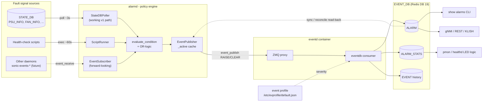
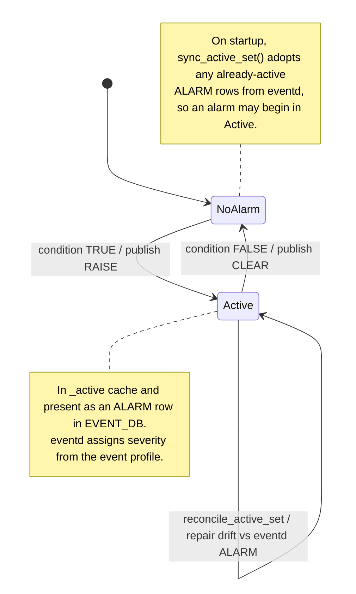
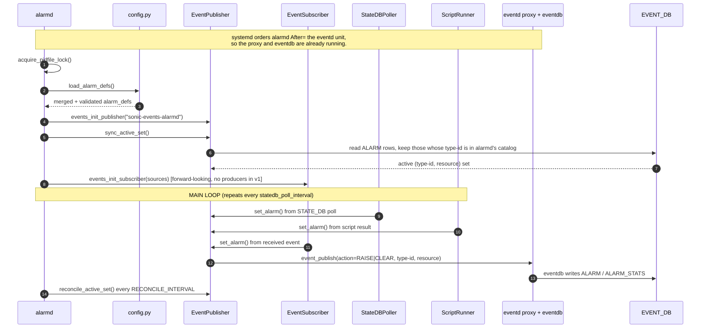
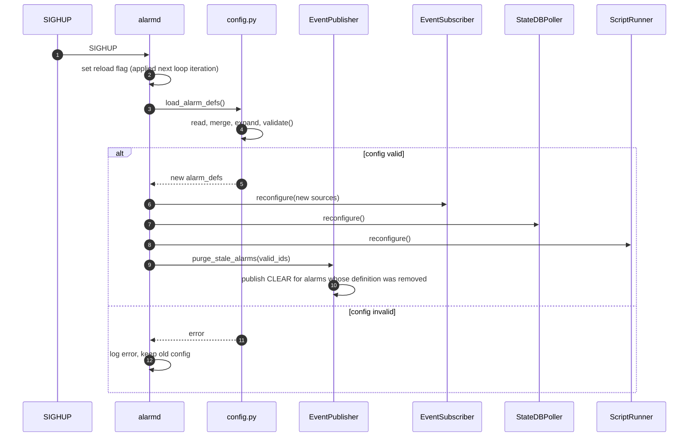

# alarmd -- SONiC Alarm Monitoring Daemon

## High Level Design Document


## Table of Contents

1. [Revision](#revision)
2. [Scope](#scope)
3. [Definitions and Abbreviations](#definitions-and-abbreviations)
4. [Overview](#overview)
5. [Requirements](#requirements)
6. [Architecture Design](#architecture-design)
7. [High-Level Design](#high-level-design)
   - 7.1 [Module Overview](#71-module-overview)
   - 7.2 [Repositories Changed](#72-repositories-changed)
   - 7.3 [Event Subscription and Condition Evaluation](#73-event-subscription-and-condition-evaluation)
   - 7.4 [Script Execution and Event Publishing](#74-script-execution-and-event-publishing)
   - 7.5 [Event Publisher](#75-event-publisher)
   - 7.6 [Alarm Lifecycle](#76-alarm-lifecycle)
   - 7.7 [Condition Evaluation](#77-condition-evaluation)
   - 7.8 [OR-Logic (Multiple Checks, Same alarm_id)](#78-or-logic)
   - 7.9 [Configuration Loading](#79-configuration-loading)
   - 7.10 [Common Alarm Catalog and Platform Merge](#710-common-alarm-catalog-and-platform-merge)
   - 7.11 [Shorthand Syntax](#711-shorthand-syntax)
   - 7.12 [Config Validation](#712-config-validation)
   - 7.13 [Hard Limits](#713-hard-limits)
   - 7.14 [Sequence Diagrams](#714-sequence-diagrams)
   - 7.15 [DB and Schema Changes](#715-db-and-schema-changes)
   - 7.16 [Linux Dependencies](#716-linux-dependencies)
   - 7.17 [Docker Dependency](#717-docker-dependency)
   - 7.18 [Build Dependency](#718-build-dependency)
   - 7.19 [Platform Dependencies](#719-platform-dependencies)
8. [SAI API](#sai-api)
9. [Configuration and Management](#configuration-and-management)
   - 9.1 [CLI Enhancements — show alarms](#91-cli-enhancements--show-alarms)
   - 9.2 [Alarm Definition Schema](#92-alarm-definition-schema)
   - 9.3 [Event Profile and YANG Registration](#93-event-profile-and-yang-registration)
10. [Warmboot and Fastboot Design Impact](#warmboot-and-fastboot-design-impact)
11. [Memory Consumption](#memory-consumption)
12. [Restrictions and Limitations](#restrictions-and-limitations)
13. [Testing Requirements](#testing-requirements)
    - 13.1 [Unit Tests](#131-unit-tests)
    - 13.2 [System Tests](#132-system-tests)
    - 13.3 [Scalability and Performance](#133-scalability-and-performance)
14. [Future Enhancements](#future-enhancements)
    - 14.1 [Runtime Configuration CLI (config alarm)](#141-runtime-configuration-cli)
    - 14.2 [Alarm History View](#142-alarm-history-view)
15. [Open and Action Items](#open-and-action-items)

---

## 1. Revision


| Rev | Date       | Author     | Change Description |
|:---:|:----------:|:----------:|:-------------------|
| 0.1 | 04/28/2026 | Neel Datta | Initial version    |
| 0.2 | 06/30/2026 | Neel Datta | Integrate with the Event & Alarm Framework (eventd): alarmd publishes `RAISE`/`CLEAR` through eventd's `event_publish()` API and relies on eventd's `ALARM`/`ALARM_STATS` tables (`EVENT_DB`, logical Redis DB 19) instead of a private `SYSTEM_ALARMS` table. Design verified against the merged eventd source (`eventutils.h`, `eventconsume.cpp`): action tokens `RAISE`/`CLEAR`/`ACKNOWLEDGE`/`UNACKNOWLEDGE`; alarm identity is `type-id\|resource` (a bare `type-id`, no source prefix); severity is assigned by eventd from the event profile; unprofiled `type-id`s are dropped. Adds a forward-looking event-subscription adapter (STATE_DB polling is the working v1 path), periodic reconciliation against the `ALARM` table, event-profile/YANG registration, and systemd ordering after the eventd service. |

---

## 2. Scope

This document describes the design of `alarmd`, a centralized alarm policy
engine for SONiC that works **alongside the Event & Alarm Framework
(eventd)**. alarmd is primarily an **event producer** (and optionally an
**event consumer**): it detects fault conditions from one or more input
adapters, applies data-driven alarm policies defined in JSON config files,
and publishes alarm actions (`RAISE`/`CLEAR`) through eventd's ZMQ
infrastructure via the `event_publish()` API. Those actions are processed by
eventd's Event Consumer (the `eventdb` service), which writes unified alarm
state to eventd's `ALARM` table (in `EVENT_DB`, logical Redis DB 19) and
maintains `ALARM_STATS`.

> **Note on action tokens.** Confirmed against the merged eventd source: eventd's
> `eventutils.h` defines the action values as `RAISE`, `CLEAR`, `ACKNOWLEDGE`,
> and `UNACKNOWLEDGE`, and the Event Consumer (`eventconsume.cpp`)
> string-compares against these exact tokens. alarmd publishes the short forms
> `RAISE`/`CLEAR` (not the `RAISE_ALARM`/`CLEAR_ALARM` spellings used in some
> framework prose).

alarmd detects faults from three input adapters — STATE_DB polling (the
working v1 path), event subscription (forward-looking), and health-check
scripts — and, regardless of adapter, has a **single output**: it publishes
alarm actions through eventd and never writes its own alarm table. The adapters
are detailed in §4 and §7.3–§7.4.

The scope covers:

- The alarmd daemon itself (architecture, input adapters, alarm lifecycle).
- The alarm definition file format (JSON), including the common alarm catalog,
  per-platform merge mechanism, and shorthand syntax.
- How alarmd publishes alarms through eventd (`sonic-events-alarmd` source,
  event profile, and YANG model registration).
- The `show alarms` CLI command (reads eventd's `ALARM` table).
- Integration with existing SONiC platform daemons (psud, thermalctld,
  sensormond, pcied, etc.) -- read-only, no modifications to those daemons.
- Cross-platform applicability: alarmd works on any SONiC platform. The
  alarm definitions are the only platform-specific component; the daemon
  itself is generic.


---

## 3. Definitions and Abbreviations

| Term | Definition |
|------|-----------|
| alarmd | The alarm policy engine described in this document |
| eventd | The SONiC Event & Alarm Framework. In the merged implementation this is **two** binaries in the eventd container: `eventd` (the ZMQ pub/sub proxy + stats collector and the `libswsscommon` producer/subscriber APIs) and `eventdb` (the Event Consumer that persists the `EVENT`, `ALARM`, `EVENT_STATS`, and `ALARM_STATS` tables to `EVENT_DB`). See `doc/event-alarm-framework/event-alarm-framework.md`. |
| eventdb | The Event Consumer daemon (added by sonic-buildimage #22617) that subscribes to the ZMQ proxy and writes `EVENT_DB`. Only present when the image is built with `include_system_eventd == "y"`. |
| EVENT_DB | Logical Redis DB **19** (in the main redis instance) that holds the `EVENT`, `ALARM`, `EVENT_STATS`, and `ALARM_STATS` tables. Defined in `schema.h`; created only when `include_system_eventd == "y"`. |
| ALARM table | The eventd-managed table (in `EVENT_DB`) holding currently-active alarms, keyed by sequence-id. Alarm identity is `type-id\|resource` via eventd's internal lookup map (`cal_lookup_map`). alarmd populates it indirectly by publishing `RAISE`/`CLEAR` events; `eventdb` performs the writes. |
| ALARM_STATS | The eventd-managed table (in `EVENT_DB`) of per-severity active-alarm counts (`alarms`, `critical`, `major`, `minor`, `warning`, `acknowledged`). |
| `event_publish()` | The libswsscommon producer API alarmd calls to emit an alarm event. params carry `type-id` (the alarm-type id, equal to alarmd's `alarm_id`), `action` (`RAISE`/`CLEAR`), `resource` (object_name), and `text`. |
| `events_init_subscriber()` / `event_receive()` | The libswsscommon subscriber APIs alarmd uses to receive upstream events from eventd's ZMQ proxy (event-subscription input adapter). |
| event source | The YANG module name an event belongs to (e.g. `sonic-events-psu`). alarmd publishes its alarms under the source `sonic-events-alarmd`. |
| event tag | The YANG container name within a source that names an event type (e.g. `psu-status`). The full path is `<source>:<tag>`. |
| event profile | The single eventd JSON file `/etc/evprofile/default.json` (`EVENTD_DEFAULT_MAP_FILE`) that maps each `type-id` to its severity, message, and enable flag. **eventd's consumer drops any event whose `type-id` is not in the profile**, so alarmd must contribute profile entries for every `alarm_id` (see §9.3). eventd uses a single default profile (there is no per-operator profile). |
| alarm_id | A string identifier for an alarm type (e.g. `PSU_MISSING`, `FAN_FAULT`). Published to eventd as the `type-id`. |
| object_name | The specific instance an alarm applies to (e.g. `PSU 1`, `FAN 3`, `Ethernet4`). Published to eventd as the `resource`. |
| alarm_defs | The `alarm_defs.json` file(s) that declare which events, STATE_DB fields, or scripts to monitor and under what conditions to raise alarms |
| common catalog | The built-in `common_alarm_defs.json` file shipped with the `sonic_alarm` package, containing standard SONiC alarm definitions applicable to most platforms |
| merge | The mechanism where alarmd loads the common catalog as a baseline, then the per-platform `alarm_defs.json` adds or replaces definitions and checks on top of it. Same definition key + `check_name` = platform wins. An optional `disable` list suppresses unwanted common checks. |
| shorthand | A compact single-line notation for alarm checks: `[alarm_id, "field op value", severity]` |

---

## 4. Overview

SONiC daemons detect hardware and software faults, but they express that
information in two very different ways. Some daemons (psud, thermalctld,
sensormond, pcied, etc.) publish operational state to STATE_DB tables
(`PSU_INFO`, `FAN_INFO`, `TEMPERATURE_INFO`, etc.) but do **not** emit
events. Others can publish structured events through eventd's ZMQ
infrastructure via the `event_publish()` API. eventd collects published
events and maintains the `EVENT` table (history) and the `ALARM` table
(current state of active alarms), but it does this only for producers that
explicitly call `event_publish()` with `RAISE`/`CLEAR` actions —
which requires code changes in every participating daemon.

There is no single component that evaluates these heterogeneous fault signals
against policy and presents a unified, severity-tagged alarm view.

**alarmd fills this gap** by acting as a **policy engine** layered on top of
eventd. It detects fault conditions from multiple inputs, applies data-driven
policies defined in JSON configuration, and autonomously publishes alarm
actions back through eventd. This lets operators define which conditions
constitute faults, aggregate multiple fault signals into a single alarm
(OR-logic), and enrich them with severity and category — **without modifying
the daemons that produced the underlying signals**, and without inventing a
parallel alarm store. eventd remains the single source of truth for alarm
state.

alarmd detects faults from three input adapters:

1. **Event subscription** (forward-looking) — alarmd can subscribe to events
   from other daemons via eventd's ZMQ proxy using `events_init_subscriber()`.
   When an event arrives, alarmd evaluates the conditions defined in JSON
   config against the event payload. This path has **no in-tree producers
   today** (the standard pmon daemons publish STATE_DB, not events); it is
   scaffolding that activates as daemons adopt event publishing. Until then,
   adapter 2 carries the coverage.

2. **STATE_DB polling** (the working v1 path) — for daemons that
   write STATE_DB but do not yet publish events (psud, thermalctld, etc.),
   alarmd reads the data those daemons already publish and evaluates the same
   JSON-defined conditions. This preserves baseline PSU/fan/thermal coverage
   with **zero changes to existing daemons**. As more daemons adopt event
   publishing, checks can migrate from this adapter to the event-subscription
   adapter without any change to alarmd's output behavior.

3. **Health-check scripts** — for conditions not represented in STATE_DB or
   in any event, alarmd can execute external scripts. Any executable that
   exits 0 (healthy) or non-zero (fault) can be used as an alarm source.

**Single output through eventd.** No matter which adapter detects a fault,
alarmd's response is identical: it calls `event_publish()` on the
`sonic-events-alarmd` source with `action=RAISE` (or `CLEAR`),
`resource=<object_name>`, a descriptive `text`, and a `type-id` equal to the
`alarm_id` — the identifier eventd uses (together with `resource`) as the
alarm's identity. eventd's Event Consumer
(the `eventdb` service) receives the
action, assigns severity from the event profile, writes the `ALARM` table,
updates `ALARM_STATS`, and records the event in the `EVENT` history table.
alarmd therefore needs **no direct alarm table and no STATE_DB write access** —
it is stateless with respect to alarm storage.

The alarm definition files are static platform configuration, stored in the
device directory (`/usr/share/sonic/device/<platform>/`) and installed at
build time. A common alarm catalog shipped with the package contains standard
SONiC checks; per-platform files are merged on top of it — platform
definitions and checks are added to the common baseline, and an optional
`disable` list suppresses any unwanted common checks.

### Relationship to existing SONiC components

| Component | What it does well | Relationship to alarmd |
|-----------|-------------------|------------------------|
| system-health / healthd | Service liveness (via monit), container health, hardware OK/Not-OK rollup, system LED control. | alarmd and healthd are **complementary**. healthd produces a binary OK/Not-OK status per object in `SYSTEM_HEALTH_INFO`. alarmd adds **per-field, severity-tagged alarms** and routes them into eventd's `ALARM` table. Because pmon/healthd can subscribe to eventd's `ALARM_STATS` for LED control (see eventd HLD §3.1.3–§3.1.4.1), alarmd's alarms can drive the same LED logic without alarmd touching the LED directly. |
| monit | Process liveness, basic resource thresholds (CPU, memory, disk), automatic restart actions. | alarmd's **script adapter** can replicate monit's resource checks by executing the same scripts, then publishing the result through eventd — giving operators a unified, queryable `ALARM` table and gNMI interface. monit remains the system's restart handler. |
| eventd / Event & Alarm Framework | Structured event publishing via `event_publish()`, ZMQ pub/sub proxy, `EVENT` history, and full `ALARM`/`ALARM_STATS` lifecycle (raise/clear/acknowledge), with gNMI/REST export and an event profile for severity assignment. | **alarmd is a producer (and optional consumer) of eventd.** alarmd subscribes to the ZMQ event stream (consumer), evaluates conditions, and publishes `RAISE`/`CLEAR` actions back through eventd (producer). eventd's Event Consumer (the `eventdb` service) processes those actions and owns all `ALARM`/`ALARM_STATS` writes. This clean separation makes alarmd **daemon-agnostic** — it can turn any fault signal (event, STATE_DB field, or script result) into a managed eventd alarm without each daemon implementing alarm lifecycle logic itself. |


### Cross-Platform Applicability

alarmd is designed to be **vendor/platform agnostic**. The daemon itself
contains no platform-specific logic -- all platform specificity is in the
alarm definition files (JSON) and optional health-check scripts, which reside
in the device directory.

Because alarmd evaluates conditions generically (any event source/tag, any
STATE_DB table/field, or any script exit code), it can alarm on faults
surfaced by **any daemon or process** -- not just the standard pmon daemons.
Platform vendors can add alarm checks for custom event sources, custom
STATE_DB tables, or custom scripts simply by declaring them in the alarm
definition files, with no code changes to alarmd. Every such check produces a
standard eventd alarm on the `sonic-events-alarmd` source.

### Example Use Cases

The following examples illustrate the breadth of conditions alarmd can
monitor. These range from standard hardware faults common to all SONiC
platforms, to platform-specific PSU and thermal monitoring, to system-level resource exhaustion.

#### 1. Standard Hardware Faults — PSU and Fan (common catalog)

The common alarm catalog (`common_alarm_defs.json`) provides a **minimal
baseline** that works on every SONiC platform out of the box. It covers
**PSU_INFO** and **FAN_INFO** only — these tables use standardized
boolean/presence fields (`presence`, `status`, `is_under_speed`, etc.) that
psud and thermalctld write identically on all platforms. This makes them
safe to include as universal defaults.

The common catalog is designed to grow over time as additional STATE_DB
tables and fields stabilize across the SONiC ecosystem. Platform vendors
can also extend or override the common catalog by providing a per-platform
`alarm_defs.json` (see Use Cases 2 and 3 below, and §7.10 for merge
details).

**Common catalog alarm inventory (PSU_INFO + FAN_INFO):**

| Table | alarm_id | check_name | Condition | Severity |
|-------|----------|------------|-----------|----------|
| PSU_INFO | `PSU_MISSING` | `psu_presence` | `presence == "false"` | Critical |
| PSU_INFO | `PSU_POWER_BAD` | `power_status` | `status == "false"` | Critical |
| PSU_INFO | `PSU_VOLTAGE_OOR` | `voltage_out_of_range` | `voltage_out_of_range == "True"` | Major |
| PSU_INFO | `PSU_CURRENT_OOR` | `current_out_of_range` | `current_out_of_range == "True"` | Major |
| PSU_INFO | `PSU_FAN_FAULT` | `fan_fault` | `fan_fault == "True"` | Major |
| PSU_INFO | `PSU_TEMP_FAULT` | `temperature_fault` | `temp_fault == "True"` | Major |
| FAN_INFO | `FAN_MISSING` | `fan_presence` | `presence == "false"` | Major |
| FAN_INFO | `FAN_FAULT` | `fan_status` | `status == "false"` | Major |
| FAN_INFO | `FAN_UNDER_SPEED` | `fan_under_speed` | `is_under_speed == "True"` | Minor |
| FAN_INFO | `FAN_OVER_SPEED` | `fan_over_speed` | `is_over_speed == "True"` | Minor |

These checks use boolean and presence fields that psud and thermalctld write identically on
every platform, so no per-platform overrides are needed for baseline
coverage.

**Alarm table structure (template):**

```json
{
    "type": "statedb",
    "table_name": "<STATE_DB table>",
    "object_key_pattern": "<table>|*",
    "checks": [
        {
            "check_name": "<unique name>",
            "alarm_id": "<ALARM_ID>",
            "severity": "Critical | Major | Minor | Warning",
            "category": "Hardware | System",
            "description_template": "{object_name} <description>",
            "condition": {"field": "<field>", "operator": "<op>", "value": "<expected>"}
        }
    ]
}
```

See §9.2 for the full schema reference.

#### 2. Platform-Specific Statedb Checks (per-platform merge)

Platform specific checks beyond the common PSU_INFO and FAN_INFO can be added
by declaring them in the platform's `alarm_defs.json`. The platform file's
`alarm_tables` are merged on top of the common catalog — new tables are added,
and checks in a table with the same `table_name` as a common table are
appended to it (or replace a common check if they share the same `check_name`).

For example, a platform with a custom PSU monitoring daemon that writes
PMBus fault status fields into PSU_INFO can simply declare additional
checks in the per-platform `alarm_defs.json`:

```json
{
    "sonic_version": "master",
    "alarm_tables": [
        {
            "type": "statedb",
            "table_name": "PSU_INFO",
            "object_key_pattern": "PSU_INFO|*",
            "checks": [
                {
                    "check_name": "input_voltage_pmbus_fault",
                    "alarm_id": "PSU_INPUT_VOLTAGE_FAULT",
                    "severity": "Major",
                    "category": "Hardware",
                    "description_template": "{object_name} Input Voltage Fault",
                    "condition": {"field": "input_voltage_status", "operator": "==", "value": "Fault"}
                }
            ]
        }
    ]
}
```

Because the platform file declares a PSU_INFO table, alarmd merges it with
the common catalog's PSU_INFO: the common checks (6) plus this platform
check (1) = 7 total PSU_INFO checks.

#### 3. Custom Platform Health via Script Checks (per-platform)

For conditions not representable in STATE_DB, alarmd's script check
mechanism provides a catch-all. Any executable that returns exit code 0
(healthy) or non-zero (fault) can be an alarm source. Examples:

- **System resources**: CPU, memory, disk usage (similar to monit, but
  surfaced as managed alarms through eventd's `ALARM` table)
- **Container health**: Check if critical Docker containers are running
- **Platform-specific hardware**: FPGA status, I2C bus health, GPIO state,
  watchdog health -- anything a shell script or Python script can check
- **Network conditions**: Default route presence, BGP session count,
  link-local reachability

**Example script check declaration** (in the platform's `alarm_defs.json`):

```json
{
    "type": "script",
    "group_name": "system_resources",
    "checks": [
        {
            "check_name": "disk_usage",
            "alarm_id": "DISK_USAGE_HIGH",
            "object_name": "root-partition",
            "severity": "Major",
            "category": "System",
            "description_template": "{object_name} Disk Usage Exceeds Threshold",
            "command": "/etc/sonic/alarm_scripts/check_disk.sh",
            "timeout": 10,
            "condition": {"exit_code": "!=", "value": 0}
        }
    ]
}
```

See §9.2 for the full script check schema reference.

---

## 5. Requirements

### 5.1 Functional Requirements

- alarmd shall poll STATE_DB tables at a configurable interval (default 3 seconds) and evaluate field conditions for daemons that publish operational state but not events. This is the working detection path in v1.
- alarmd shall optionally subscribe to events from eventd's ZMQ proxy (via `events_init_subscriber()`) and evaluate conditions against the received event payloads. This adapter is forward-looking; it has no in-tree producers until pmon daemons adopt event publishing.
- alarmd shall execute external health-check scripts at a configurable interval (default 60 seconds) and evaluate exit codes.
- When a fault condition is detected, alarmd shall publish an event through eventd via `event_publish()` on the `sonic-events-alarmd` source with `action=RAISE`, `resource=<object_name>`, a `type-id` equal to the `alarm_id` (eventd's alarm identity together with `resource`), and a descriptive `text`. eventd's Event Consumer (`eventdb`) writes the `ALARM` table and updates `ALARM_STATS`. alarmd shall not write any alarm table directly.
- When a fault condition clears, alarmd shall publish `action=CLEAR` through eventd and remove the alarm from its in-memory active set. eventd removes the entry from `ALARM` and decrements `ALARM_STATS`.
- alarmd shall suppress redundant publishes: while an `(alarm_id, object_name)` is already active in its local cache, a repeated fault evaluation shall not republish `RAISE`.
- alarmd shall track alarms per FRU independently. An alarm on PSU 1 shall not affect the alarm state of PSU 2.
- alarmd shall support OR-logic: multiple checks sharing the same alarm_id shall raise one alarm if any check is true, and clear only when all checks are false.
- alarmd shall support SIGHUP for live reload of alarm definitions without restart. If the new config fails validation, the old config shall remain in effect.
- On startup (including after daemon restart or warmboot), alarmd shall rebuild its in-memory active set from eventd's `ALARM` table so it does not republish alarms that are already active, and shall publish `CLEAR` only for conditions that have since cleared (see §10).
- alarmd shall periodically reconcile its in-memory active set against eventd's `ALARM` table (not only at startup) to repair drift, because eventd does not robustly de-duplicate repeated `RAISE`s (see §7.6, §12).
- alarmd shall publish each alarm with a `type-id` equal to its `alarm_id`, drawn from a globally-unique namespace of event-ids registered in the shared event profile, so its alarm identity (`type-id|resource`) does not collide with alarms raised by other producers.
- alarmd shall contribute event profile entries and a `sonic-events-alarmd` YANG model so eventd can assign severity to each `alarm_id` (see §9.3).
- alarmd shall enforce hard limits on the number of event/statedb checks, script checks, and script timeout to prevent resource exhaustion from misconfigured alarm definitions.
- alarmd shall support a common alarm catalog with per-platform merge mechanism to minimize per-platform configuration.
- `show alarms` CLI command shall read the `ALARM` table (eventd's schema) and display alarm state. Supports `--summary` for severity counts, `--json` for JSON output, and filter options (`-s`, `-c`, `-o`, `-g`).

---

## 6. Architecture Design

alarmd sits between fault signal sources and eventd. It consumes signals from
three input adapters (event subscription, STATE_DB polling, scripts),
evaluates JSON-defined conditions, and emits alarm actions to eventd through
the libswsscommon producer API. eventd's Event Consumer is the sole writer of
the `ALARM`/`ALARM_STATS` tables. alarmd holds no alarm table of its own.


```mermaid
flowchart LR
    subgraph SRC["Fault signal sources"]
        SDB[("STATE_DB<br/>PSU_INFO, FAN_INFO, ...")]
        SCR["Health-check scripts"]
        UPEV["Other daemons<br/>sonic-events-* (future)"]
    end

    subgraph ALARMD["alarmd - policy engine"]
        POLL["StateDBPoller<br/>(working v1 path)"]
        RUN["ScriptRunner"]
        SUB["EventSubscriber<br/>(forward-looking)"]
        EVAL["evaluate_condition<br/>+ OR-logic"]
        PUB["EventPublisher<br/>_active cache"]
    end

    subgraph EVENTD["eventd container"]
        PROXY["ZMQ proxy"]
        CONS["eventdb consumer"]
    end

    subgraph EDB["EVENT_DB (Redis DB 19)"]
        ALARM[("ALARM")]
        STATS[("ALARM_STATS")]
        EVENTT[("EVENT history")]
    end

    PROF["event profile<br/>/etc/evprofile/default.json"]

    SDB -->|"poll ~3s"| POLL
    SCR -->|"exec ~60s"| RUN
    UPEV -.->|"event_receive"| SUB
    POLL --> EVAL
    RUN --> EVAL
    SUB --> EVAL
    EVAL --> PUB
    PUB -->|"event_publish RAISE/CLEAR"| PROXY
    PROXY --> CONS
    PROF -.->|"severity"| CONS
    CONS --> ALARM
    CONS --> STATS
    CONS --> EVENTT
    ALARM -.->|"sync / reconcile read-back"| PUB
    ALARM --> SHOW["show alarms CLI"]
    ALARM --> GNMI["gNMI / REST / KLISH"]
    STATS --> LED["pmon / healthd LED logic"]
```

### Data flow summary

1. Fault signals arrive from one of three sources:
   - **Events**: daemons publish events through eventd's ZMQ proxy via
     `event_publish()`; alarmd subscribes via `events_init_subscriber()`.
   - **STATE_DB**: daemons that do not publish events write their normal
     STATE_DB tables (no change to existing behavior); alarmd reads them.
   - **Scripts**: alarmd executes health-check scripts on a timer.
2. For each signal, alarmd evaluates the matching condition(s) from the
   loaded alarm definitions.
3. On a state transition, alarmd calls `EventPublisher.publish_alarm(...)`,
   which invokes `event_publish()` on the `sonic-events-alarmd` source with
   `action=RAISE` or `action=CLEAR`, plus the `alarm_id` as the event tag,
   `resource=<object_name>`, and a descriptive `text`.
4. eventd's Event Consumer receives the action, looks up severity from the
   event profile, writes the `ALARM` table (or removes the entry on clear),
   updates `ALARM_STATS`, and records the event in the `EVENT` history table.
5. CLI commands (`show alarms`) and gNMI/REST clients read the `ALARM` table
   from eventd — there is no alarmd-private table to query.

alarmd maintains only a small in-memory cache of active `(alarm_id,
object_name)` pairs to suppress duplicate publishes; the authoritative alarm
state lives in eventd's `ALARM` table.

---

## 7. High-Level Design

### 7.1 Module Overview

Package structure:

```
src/alarmd/                             # standalone wheel (sonic-alarmd), like src/system-health
    scripts/
        alarmd                      # Entry point: AlarmDaemon(DaemonBase)
    sonic_alarm/
        __init__.py                 # Package exports, __version__
        constants.py                # All constants, paths, default intervals, hard limits
        config.py                   # Load, merge, shorthand expansion, validation
        event_publisher.py          # EventPublisher class (publishes alarms through eventd)
        event_subscriber.py         # EventSubscriber class (subscribes to eventd's ZMQ)
        statedb_poller.py           # StateDBPoller class + evaluate_condition()
        script_runner.py            # ScriptRunner class (ThreadPoolExecutor)
        common_alarm_defs.json      # Common SONiC alarm catalog
        sonic_events_alarmd.json    # eventd event-profile fragment (alarm_id -> severity)
    tests/
        __init__.py
        test_alarmd.py
        test_event_publisher.py
        test_show_alarms.py
        alarm_defs.json             # Test fixtures
        alarm_scripts/
    setup.py                        # wheel metadata (name=sonic-alarmd, scripts, package_data)
    setup.cfg
    pytest.ini

# Build wiring (in sonic-buildimage, outside the wheel):
rules/alarmd.mk, rules/alarmd.dep          # builds the sonic_alarmd wheel
files/image_config/alarmd/alarmd.service   # host systemd unit (installed by the image build)
```

#### Module Roles

- **`scripts/alarmd`** — Entry point. Subclasses `DaemonBase`, acquires PID lock, initializes the eventd publisher and (optionally) subscriber, instantiates the components below, rebuilds the active set from eventd's `ALARM` table (`sync_active_set()`), then enters the main loop. Handles `SIGHUP` (reload) and `SIGTERM` (shutdown).
- **`constants.py`** — All magic strings, file paths, default intervals, hard limits, and the `sonic-events-alarmd` source/tag names. Pure data, no logic.
- **`config.py`** — Loads alarm definitions from disk, merges with common catalog, expands shorthand, validates, and checks `sonic_version` compatibility.
- **`event_publisher.py`** — The single point that emits alarm actions to eventd. Wraps `events_init_publisher("sonic-events-alarmd")` and calls `event_publish()` with `action=RAISE`/`CLEAR` (the tokens eventd's Event Consumer accepts; see the action-token note in §2). Maintains a thread-safe in-memory active-alarm set for idempotency. Provides `publish_alarm()`, `publish_clear()`, `set_alarm()`, `sync_active_set()`, and `purge_stale_alarms()`. Does **not** write any DB table directly.
- **`event_subscriber.py`** — Subscribes to eventd's ZMQ proxy via `events_init_subscriber(use_cache=True, sources=[...])`, blocks on `event_receive()`, parses the event JSON, evaluates matching conditions, and calls `EventPublisher` to raise/clear (with OR-logic aggregation).
- **`statedb_poller.py`** — Compatibility adapter for daemons that do not publish events. Reads STATE_DB tables each poll cycle, evaluates field conditions via `evaluate_condition()`, and calls `EventPublisher` to raise or clear alarms (with OR-logic aggregation).
- **`script_runner.py`** — Executes health-check scripts via `ThreadPoolExecutor(max_workers=4)`. Handles timeouts (SIGKILL), mtime modification detection, and exit-code evaluation, then calls `EventPublisher`.
- **`common_alarm_defs.json`** — The built-in common alarm catalog (PSU_INFO + FAN_INFO, 10 checks). Loaded at runtime by `config.py` during the merge step.
- **`sonic_events_alarmd.json`** — The eventd event-profile fragment generated from the alarm catalog (one entry per `alarm_id` with severity, enable flag, and static message). Installed so eventd's consumer can assign severity (see §9.3).

### 7.2 Repositories Changed

| Repository | Changes |
|-----------|---------|
| `sonic-buildimage` | New directory: `src/alarmd/` -- a standalone Python wheel (`sonic-alarmd`) built by `rules/alarmd.mk` (mirroring `src/system-health`) and installed on the host rootfs by `files/build_templates/sonic_debian_extension.j2`. The host systemd unit lives at `files/image_config/alarmd/alarmd.service` and is registered in `generated_services.conf`. |
| `sonic-buildimage` (device directory) | Per-platform: `device/<platform>/alarm_defs.json` and `alarm_scripts/*.sh`. |
| `sonic-buildimage` (event profile) | Install the `sonic-events-alarmd` event-profile fragment so eventd assigns severity to alarmd's `alarm_id`s (merged into `/etc/evprofile/`). See §9.3. |
| `sonic-utilities` | New `show` CLI: `show alarms` (with `--summary`, `--json`, filter, and grouping options) in `show/alarms.py`, reading eventd's `ALARM` table. |
| `sonic-yang-models` | New `sonic-events-alarmd` YANG module declaring the alarm event source/tag and params (see §9.3). |

alarmd depends on the Event & Alarm Framework (eventd) being present in the
image. Specifically, alarmd's eventd output requires the image to be built
with `include_system_eventd == "y"` (sonic-buildimage #22617), which adds the
`eventdb` consumer and the `EVENT_DB` (logical Redis DB 19) instance. On
images built without this flag, alarms are published to the ZMQ proxy and
streamed via gNMI, but there is no persistent `ALARM` table for `show alarms`
to read — see §12. No existing daemon is modified; alarmd only consumes
eventd's producer and subscriber APIs from `libswsscommon`.


### 7.3 Event Subscription and Condition Evaluation

alarmd detects faults from two read-side adapters that feed a common
evaluation engine: the **event-subscription adapter** (primary) and the
**STATE_DB polling adapter** (compatibility). Both produce the same
`(alarm_id, object_name, is_fault)` results that are handed to
`EventPublisher` (§7.5).

#### 7.3.1 Event subscription (forward-looking)

`EventSubscriber` receives events from eventd's ZMQ proxy and evaluates alarm
conditions against the event payloads.

> **Status:** This adapter has **no in-tree producers in v1** — the standard
> pmon daemons (psud, thermalctld, sensormond, pcied) publish STATE_DB, not
> `sonic-events-*`. It is implemented as forward-looking scaffolding; until a
> daemon publishes events, the STATE_DB polling adapter (§7.3.2) carries the
> corresponding checks. See §15, item 5.

Initialization:

1. alarmd builds the list of event sources of interest from the
   `event_source_mapping` in the loaded alarm definitions (see §9.2). Each
   source is a YANG module name, e.g. `sonic-events-psu`.
2. alarmd calls `events_init_subscriber(use_cache=True, sources=[...])`.
   The events library filters by source so alarmd only delivers the events it
   cares about (confirm whether filtering is applied broker-side at the proxy
   or in the subscriber library for the target eventd build). If no mapping is
   given, `sources=None` (subscribe to everything).

On each event (a blocking `event_receive(handle, event, missed_cnt)` call):

1. The event arrives as a JSON string of the form
   `{ "<source>:<tag>": { <param>: <value>, ... } }`, e.g.
   `{ "sonic-events-psu:psu-status": { "psu_id": "PSU 1", "status": "down" } }`.
2. alarmd parses the YANG path key into `(event_source, event_tag)` and looks
   up the matching `event` checks in the alarm definitions.
3. For each matching check, alarmd extracts the relevant field(s) from the
   event payload and calls `evaluate_condition(field_value, operator, expected)`
   (§7.7).
4. The result is aggregated per `(alarm_id, object_name)` (OR-logic, §7.8) and
   passed to `EventPublisher.set_alarm(...)`, which publishes `RAISE`/`CLEAR`
   through eventd (§7.5).

`object_name` is derived from a configured key field in the event payload
(e.g. `psu_id`), falling back to the event's `resource` param if present.

**Missed events**: the `missed_cnt` returned by `event_receive()` reports how
many events from a publisher were dropped before this one (ZMQ buffer overflow
or subscriber lag). alarmd logs this at WARNING and relies on its periodic
re-evaluation (and, for STATE_DB-backed checks, the polling adapter) to
reconcile state. See §12 for the reliability discussion.

#### 7.3.2 STATE_DB polling (compatibility adapter)

Most pmon daemons (psud, thermalctld, sensormond, pcied) publish operational
state to STATE_DB but do **not** publish events. To cover those faults with
zero daemon changes, alarmd retains a STATE_DB polling adapter. As daemons
adopt event publishing, checks migrate from §7.3.2 to §7.3.1 with **no change
to alarmd's output** — both adapters publish through eventd identically.

`StateDBPoller` reads STATE_DB tables and evaluates check conditions. For each
alarm definition of type `statedb`:

1. Open the table via `Table(db_connector, table_name)`.
2. Call `getKeys()` to enumerate all object keys (e.g. `["PSU 1", "PSU 2"]`).
3. Optionally filter keys against `exclude_keys` (e.g., to skip sentinel keys
   that are not real objects).
4. For each key, for each check:
   a. Read the field value via `table.hget(key, field)`.
   b. Call `evaluate_condition(field_value, operator, expected_value)`.
   c. Aggregate results per `(alarm_id, object_name)` and call
      `event_publisher.set_alarm(...)` (subject to OR-logic aggregation).

The poll runs on every main-loop iteration. The main loop sleeps for
`statedb_poll_interval` seconds (default 3) between iterations.

**Configuring the poll interval**: set via `alarmd_settings.statedb_poll_interval`
in `alarm_defs.json` (see §9.2). The default is 3 seconds, chosen to balance
detection latency against Redis polling overhead. alarmd
enforces a floor of 2 seconds (`MIN_STATEDB_INTERVAL`); values below the floor
are silently clamped. See §7.13 for the full hard-limits table.

alarmd can poll **any** STATE_DB table published by **any** SONiC daemon. The
tables to poll are declared entirely in the alarm definition files. The v1.0
common catalog ships with PSU_INFO and FAN_INFO statedb checks (see §4 Use
Case 1). Platform vendors may add checks for any additional table simply by
declaring them — no code changes to alarmd are required (see §4 Use Case 2).

> If a future release ships event sources for PSU/fan/thermal (e.g.
> `sonic-events-psu`), the common catalog can move those checks to the
> event-subscription adapter and the STATE_DB polling adapter becomes a
> fallback for un-migrated platforms.


### 7.4 Script Execution and Event Publishing

`ScriptRunner` executes external health-check scripts using
`ThreadPoolExecutor(max_workers=4)`. Script results are published through
eventd exactly like any other alarm — scripts are treated as first-class
event sources, not as DB writers.

For each alarm definition of type `script`:

1. For each check, determine if it is due to run (based on per-check
   `interval` or the global `script_poll_interval`, default 60s).
2. Submit due checks to the thread pool as futures.
3. Each future checks the script's modification time (mtime) against the
   baseline recorded when the config was loaded. If the script has been
   modified since config load, a WARNING is logged ("MODIFIED SCRIPT …
   executing anyway, results may be unreliable") — but the script **still
   executes**. A SIGHUP reload resets the baseline.
4. Call `subprocess.run(command, timeout=timeout, capture_output=True)`.
5. Collect results. For each completed check:
   a. If the exit code matches the fault condition (typically `!= 0`): call
      `event_publisher.set_alarm(alarm_id, object_name, is_fault=True)` →
      publishes `RAISE` through eventd.
   b. If the exit code does not match: `set_alarm(..., is_fault=False)` →
      publishes `CLEAR`.
6. Scripts that exceed their timeout are killed (SIGKILL) and treated as faults.

**Example flow — disk-usage check:**

```
1. /etc/sonic/alarm_scripts/check_disk.sh exits 1 (disk > 90%).
2. alarmd calls EventPublisher.set_alarm("DISK_USAGE_HIGH", "root-partition", True).
3. EventPublisher calls event_publish(handle, "alarm",
     params={"type-id":"DISK_USAGE_HIGH", "action":"RAISE",
             "resource":"root-partition", "text":"..."}).
4. eventd's Event Consumer (eventdb) looks up DISK_USAGE_HIGH severity in the
   event profile, adds a row to ALARM, and increments ALARM_STATS.
5. When the script later exits 0, alarmd publishes action="CLEAR" and eventd
   removes the ALARM row.
```

Script paths are absolute. alarmd does not search PATH. Scripts must be
executable and owned by root, and live in `/etc/sonic/alarm_scripts/`
(installed at build time from `device/<platform>/alarm_scripts/`).

The scripts to execute are declared entirely in alarm definition files. Any
executable that exits 0 (healthy) or non-zero (fault) can serve as an alarm
source. The v1.0 common catalog does **not** include any script checks —
script checks are per-platform. Example script checks a platform might declare:

| Command | alarm_id | object_name | Severity | Timeout |
|---------|----------|-------------|----------|---------|
| `check_disk.sh` | DISK_USAGE_HIGH | root-partition | Major | 10s |
| `check_memory.sh` | MEMORY_USAGE_HIGH | SYSTEM | Major | 10s |
| `check_cpu.sh` | CPU_USAGE_HIGH | SYSTEM | Minor | 10s |
| `check_containers.sh` | CONTAINER_DOWN | SYSTEM | Critical | 15s |
| `check_default_route.sh` | DEFAULT_ROUTE_MISSING | SYSTEM | Major | 10s |
| `check_coredumps.sh` | COREDUMP_DETECTED | SYSTEM | Minor | 10s |

Platform vendors may add **any custom script** as an alarm check (FPGA health,
I2C bus health, watchdog status, etc.) simply by declaring it.

**Configuring script execution parameters**:

| Parameter | Where to set | Default | Allowed range | Rationale |
|-----------|-------------|---------|---------------|-----------|
| `script_poll_interval` | `alarmd_settings` in `alarm_defs.json` | 60s | ≥ 30s (floor: `MIN_SCRIPT_INTERVAL`) | Scripts are I/O-bound (subprocess fork); 60s avoids subprocess storms while keeping detection timely. |
| Per-check `interval` | `interval` field on individual script checks | Inherits global | ≥ 30s | Allows high-priority scripts (e.g. container health) to run more often than low-priority ones. |
| Per-check `timeout` | `timeout` field on individual script checks | 10s (`SCRIPT_TIMEOUT`) | ≤ 30s (ceiling: `MAX_SCRIPT_TIMEOUT`) | Scripts exceeding the ceiling are clamped; scripts exceeding their timeout at runtime are killed via SIGKILL. |
| `max_workers` | Hard-coded in `constants.py` (not user-configurable) | 4 | — | Bounds the number of concurrent subprocesses so a large script catalog cannot fork-storm the host. Not exposed in `alarm_defs.json` because raising it removes that bound. |

All intervals and timeouts are validated at config load time. Values below
the floor are clamped up; values above the ceiling are clamped down. See
§7.13 for the complete hard-limits table and its rationale, and §9.2
for the full `alarm_defs.json` schema.

### 7.5 Event Publisher

`EventPublisher` is the single point that emits alarm actions to eventd. It is
**not** a writer to any DB table; eventd's Event Consumer (`eventdb`) performs
all `ALARM`/`ALARM_STATS` writes.

Internal state:

```python
self._handle = events_init_publisher("sonic-events-alarmd")
# libswsscommon producer handle for the alarmd event source

self._active: set[str] = set()
# Each element is "alarm_id|object_name"
# Thread-safe via self._lock (threading.Lock)
# Local cache used only to suppress duplicate publishes (idempotency)

self._meta: dict[str, dict] = {}
# alarm_id -> {"category", "description_template", "source"}
# Built from alarm_defs at init; rebuilt on SIGHUP via _rebuild_meta()
# Note: severity is NOT sent by alarmd — eventd assigns it from the event
# profile (see §9.3). _meta carries only fields alarmd puts in the event text.
```

Methods:

| Method | Description |
|--------|-----------|
| `publish_alarm(alarm_id, object_name, description, action="RAISE")` | If `alarm_id\|object_name` not already in `_active` (for RAISE): call `event_publish(self._handle, "alarm", params={"type-id": alarm_id, "action": action, "resource": object_name, "text": description})`. The publisher handle already carries the `sonic-events-alarmd` source, so the tag is the bare event tag (`alarm`); `type-id` is the bare `alarm_id`, which eventd uses (with `resource`) as the alarm identity and as the event-profile lookup key. Add to `_active` on RAISE. Log at WARNING. |
| `publish_clear(alarm_id, object_name)` | If `alarm_id\|object_name` in `_active`: call `publish_alarm(..., action="CLEAR")` and remove from `_active`. Log at INFO. |
| `set_alarm(alarm_id, object_name, is_fault)` | Convenience: calls `publish_alarm` if `is_fault` else `publish_clear`. Primary entry point used by all three adapters. |
| `sync_active_set()` | At startup, reads eventd's `ALARM` table and — keeping only rows whose `type-id` is one of alarmd's own `alarm_id`s (the `ALARM` table has no source column) — populates `_active` so alarmd does not republish alarms that are already active across an alarmd restart (§7.6, §10). |
| `reconcile_active_set()` | Runs periodically (every `RECONCILE_INTERVAL`, §7.13): re-reads eventd's `ALARM` table (rows whose `type-id` is one of alarmd's `alarm_id`s) and repairs drift between `_active` and eventd — re-publishing a `CLEAR` for orphaned rows and re-syncing entries that were lost (e.g. a dropped `CLEAR` over lossy ZMQ). Best-effort: a duplicate row from a repeated `RAISE` cannot be reclaimed via `CLEAR` (eventd's `cal_lookup_map` tracks only one sequence-id per `type-id|resource`), so the durable fix is idempotent `RAISE` in eventd (§15 item 7). Required because eventd does **not** robustly de-duplicate raises (§7.6). |
| `purge_stale_alarms(valid_ids)` | After SIGHUP reload, publishes `CLEAR` for any active alarm whose `alarm_id` is no longer in the config. |
| `active_count` (property) | Number of currently active alarms (local cache). |
| `active_tags` (property) | `frozenset` copy of the active alarm tags. |
| `known_alarm_ids()` | Set of `alarm_id`s currently in the metadata lookup. |

Why publish instead of writing the DB directly:

1. alarmd needs no STATE_DB/EVENT_DB write access — eventd is the single point
   of alarm-state management.
2. alarmd's alarms get the same lifecycle as every other SONiC event:
   `EVENT` history, gNMI/REST export, and acknowledge/unacknowledge.
3. Because eventd does not de-duplicate raises, idempotency is alarmd's
   responsibility — see the lifecycle and the `_active` /
   `reconcile_active_set()` mechanism in §7.6.

### 7.6 Alarm Lifecycle

alarmd's view of the lifecycle is **event-driven**. alarmd keeps a small
in-memory cache (`_active`) only to suppress redundant publishes; the
authoritative state lives in eventd's `ALARM` table.


```mermaid
stateDiagram-v2
    [*] --> NoAlarm

    NoAlarm --> Active: condition TRUE / publish RAISE
    Active --> NoAlarm: condition FALSE / publish CLEAR
    Active --> Active: condition still TRUE / no-op, alarmd owns de-dup
    Active --> Active: reconcile_active_set / repair drift vs eventd ALARM

    note left of NoAlarm
        On startup, sync_active_set() adopts any already-active
        ALARM rows from eventd, so an alarm may begin in Active.
    end note

    note right of Active
        In _active cache and present as an ALARM row in EVENT_DB.
        eventd assigns severity from the event profile.
    end note
```

States (from alarmd's perspective):

1. **No Alarm**: `(alarm_id, object_name)` is not in `_active`. A false
   condition is a no-op. A true condition transitions to Active by publishing
   `RAISE`.
2. **Active**: `(alarm_id, object_name)` is in `_active`. If the condition
   evaluates true again, it is a no-op — alarmd does **not** republish. This
   discipline is essential: eventd does **not** robustly de-duplicate raises
   (its flood protection only catches an event identical to the one
   immediately before it), so a stray repeated `RAISE` would create a
   duplicate `ALARM` row and inflate `ALARM_STATS`. alarmd's `_active` cache is
   the authoritative de-dup, backstopped by periodic reconciliation (item 5).
   The alarm stays active until the condition clears.
3. **Cleared**: the condition transitions true→false. alarmd publishes `CLEAR`
   exactly once and removes the tag from `_active`. eventd removes the `ALARM`
   row and decrements `ALARM_STATS`. If the condition becomes true again later,
   a fresh `RAISE` is published (eventd assigns a new sequence-id).
4. **Startup reconciliation**: on startup alarmd calls `sync_active_set()` to
   load any already-active alarms from eventd's `ALARM` table into `_active`.
   On the first evaluation from each adapter, alarmd publishes `CLEAR` only for
   conditions that have since recovered, and refrains from re-`RAISE`ing alarms
   that are still active. See §10.
5. **Periodic reconciliation**: because ZMQ delivery is lossy (a dropped
   `CLEAR` leaves an orphaned `ALARM` row) and eventd does not de-duplicate
   raises, alarmd re-runs `reconcile_active_set()` every `RECONCILE_INTERVAL`
   (§7.13) to detect and repair drift between `_active` and eventd's `ALARM`
   table — not just at startup. This restores the level-triggered robustness
   of re-deriving from authoritative state on every cycle.

This decouples detection (alarmd) from storage (eventd): alarmd never wipes the
`ALARM` table at startup, so `show alarms` reflects authoritative state
continuously rather than briefly showing an empty set while alarms are
rediscovered.

### 7.7 Condition Evaluation

`evaluate_condition(field_value, operator, expected)` is a shared module-level
function used by both the event-subscription adapter (§7.3.1) and the STATE_DB
polling adapter (§7.3.2). It compares a single value — an event-payload field
or a STATE_DB hash field — against an expected value declared in the alarm
definition. Both sides are strings; the function returns a boolean indicating
whether the fault condition is met.

The function is designed to be **fail-safe**: any ambiguous or error case
returns `False` (no alarm raised), because a false positive (spurious alarm)
is worse than a brief detection delay.

#### Missing field or missing key

If the field does not exist (i.e., `fields.get(field_name)` returns `None`),
the condition evaluates to `False`. For the polling adapter this prevents
spurious alarms when a daemon hasn't finished populating all fields yet (e.g.,
psud writes `presence` before `voltage`). For the event adapter it means an
event missing an expected param is treated as non-faulting.

If the owning daemon never writes a STATE_DB key at all — for instance,
thermalctld crashes on startup and never populates `FAN_INFO` — then
`table.getKeys()` returns an empty list and alarmd has nothing to iterate
over. No alarms are raised or cleared for that table. This is intentional:
alarmd monitors **data that exists**, not the absence of a daemon. Daemon
liveness is the responsibility of monit and system-health. If a platform needs
an alarm for "daemon not writing data," it should use a script check that
verifies expected keys exist and were recently updated.

#### Operator behavior

- **`==`, `!=`**: Case-sensitive string comparison after whitespace strip.
  Alarm definitions must match the exact casing the producing daemon writes
  (e.g., `"True"` vs `"true"` are distinct).

- **`<`, `>`, `<=`, `>=`**: Both operands are converted to `float()`. If
  both convert successfully, comparison is numeric. If either fails (e.g.,
  field contains `"N/A"`), falls back to lexicographic string comparison.
  Numeric comparisons on non-numeric fields are not recommended.

- **Unknown operator**: Returns `False`. Cannot happen in practice because
  `config.validate()` rejects unknown operators at load time.

Any unexpected exception at any point returns `False` (fail-safe).

### 7.8 OR-Logic

When multiple checks share the same `alarm_id` but differ in `check_name`,
alarmd implements OR-logic for the alarm:

- The alarm is raised if **any** check evaluates true.
- The alarm is cleared only when **all** checks with that alarm_id evaluate
  false for the same object.

Concrete example -- PSU voltage range monitoring:

```json
{"check_name": "output_voltage_low",  "alarm_id": "PSU_OUTPUT_VOLTAGE_FAULT",
 "condition": {"field": "voltage", "operator": "<", "value": "11.6"}},
{"check_name": "output_voltage_high", "alarm_id": "PSU_OUTPUT_VOLTAGE_FAULT",
 "condition": {"field": "voltage", "operator": ">", "value": "12.8"}}
```

`PSU_OUTPUT_VOLTAGE_FAULT` for `PSU 1` fires if voltage < 11.6V (under the
PSU's `voltage_min_threshold`) or voltage > 12.8V (over the PSU's
`voltage_max_threshold`). It clears only when voltage returns to the
11.6V-12.8V range.

Implementation: each adapter collects all check results per
`(alarm_id, object_name)` before calling `EventPublisher`. If any check is
true, `set_alarm(..., is_fault=True)` (publishes `RAISE`). If all are false
and the alarm is active in the local cache, `set_alarm(..., is_fault=False)`
(publishes `CLEAR`).

### 7.9 Configuration Loading

alarmd resolves alarm definitions at startup (and on SIGHUP reload):

```
1. Read /host/machine.conf -> extract onie_platform
   (e.g. x86_64-<vendor>_<platform>-r0)

2. platform_dir = /usr/share/sonic/device/<onie_platform>

3. Check for platform_dir/alarm_defs.json
4. If platform file exists, load it and merge with common catalog (see 7.10).
5. If no platform file exists, use common catalog directly as the config.
6. Expand shorthand entries (see 7.11).
7. Validate the merged config (see 7.12).
```

**Configuration priority** (lowest to highest):
1. Common alarm catalog (`common_alarm_defs.json`) — built-in baseline
2. Per-platform `alarm_defs.json` — build-time (merged on top of common)

This is deliberately simple: one file per platform. The common catalog
provides PSU and fan checks automatically; the platform file just declares
any additional tables/checks it needs plus an optional `disable` list to
suppress unwanted common checks.

### 7.10 Common Alarm Catalog and Platform Merge

Every SONiC platform needs PSU and fan alarm checks, and those checks are
identical everywhere because sonic-platform-common standardizes the table
names and field names. Writing the same 10 checks in every platform's
`alarm_defs.json` would be pointless repetition.

So alarmd ships a `common_alarm_defs.json` inside the `sonic_alarm` package
with those 10 standard PSU_INFO + FAN_INFO checks (see §4 Use Case 1 for
the full list). Platform files only need to declare what's different —
additional tables, extra checks, or checks they want to suppress.

At load time, alarmd merges the platform file on top of the common catalog:

1. The common catalog's `alarm_tables` are the starting point.
2. For each table in the platform file:
   - Same `table_name` as a common table → platform checks are appended.
     If a platform check shares a `check_name` with a common check, the
     platform version wins (last-writer-wins).
   - New `table_name` → added as a new table.
3. If the platform file has a `"disable"` list, those checks are removed
   from the merged result. Format: `["TABLE_NAME.check_name", ...]`.

The merge is purely additive with an opt-out mechanism. Platform files just
declare what they need and optionally suppress what they don't.

**Example: platform `alarm_defs.json`** (adds PMBus checks,
overrides a threshold, disables a check, adds TEMPERATURE_INFO):

```json
{
    "sonic_version": "master",
    "alarmd_settings": {
        "statedb_poll_interval": 3,
        "script_poll_interval": 60
    },
    "disable": [
        "PSU_INFO.current_out_of_range"
    ],
    "alarm_tables": [
        {
            "type": "statedb",
            "table_name": "PSU_INFO",
            "object_key_pattern": "PSU_INFO|*",
            "checks": [
                {
                    "check_name": "input_voltage_pmbus_fault",
                    "alarm_id": "PSU_INPUT_VOLTAGE_FAULT",
                    "severity": "Major",
                    "category": "Hardware",
                    "description_template": "{object_name} Input Voltage Fault",
                    "condition": {"field": "input_voltage_status", "operator": "==", "value": "Fault"}
                },
                {
                    "check_name": "output_voltage_low",
                    "alarm_id": "PSU_OUTPUT_VOLTAGE_FAULT",
                    "severity": "Major",
                    "category": "Hardware",
                    "description_template": "{object_name} Output Voltage Out of Range",
                    "condition": {"field": "voltage", "operator": "<", "value": "11.6"}
                },
                {
                    "check_name": "output_voltage_high",
                    "alarm_id": "PSU_OUTPUT_VOLTAGE_FAULT",
                    "severity": "Major",
                    "category": "Hardware",
                    "description_template": "{object_name} Output Voltage Out of Range",
                    "condition": {"field": "voltage", "operator": ">", "value": "12.8"}
                }
            ]
        },
        {
            "type": "statedb",
            "table_name": "TEMPERATURE_INFO",
            "object_key_pattern": "TEMPERATURE_INFO|*",
            "checks": [
                {
                    "check_name": "temp_warning",
                    "alarm_id": "TEMP_WARNING",
                    "severity": "Major",
                    "category": "Hardware",
                    "description_template": "{object_name} Temperature Warning",
                    "condition": {"field": "warning_status", "operator": "==", "value": "True"}
                }
            ]
        }
    ]
}
```

**After merge with common catalog, the effective config is:**

| Table | Checks | Source |
|-------|--------|--------|
| PSU_INFO | psu_presence, power_status, voltage_out_of_range, fan_fault, temperature_fault | common (5 — `current_out_of_range` disabled) |
| PSU_INFO | input_voltage_pmbus_fault, output_voltage_low, output_voltage_high | platform (3 added) |
| FAN_INFO | fan_presence, fan_status, fan_under_speed, fan_over_speed | common (4, untouched) |
| TEMPERATURE_INFO | temp_warning | platform (new table) |

**Total: 13 checks** (10 common − 1 disabled + 3 platform + 1 new table).

Once merged, the result is a flat list of tables and checks. The runtime
engine doesn't know or care which checks came from common vs. platform.

For a platform that only needs the common PSU/fan checks, **no
`alarm_defs.json` is needed at all** — alarmd falls back to the common
catalog automatically.

### 7.11 Shorthand Syntax

Alarm tables may use `checks_short` as a compact alternative to the verbose
`checks` array. Each entry is a three-element array:

```json
"checks_short": [
    ["FAN_MISSING",     "presence == false",      "Major"],
    ["FAN_FAULT",       "status == false",        "Major"],
    ["FAN_UNDER_SPEED", "is_under_speed == True", "Minor"],
    ["FAN_OVER_SPEED",  "is_over_speed == True",  "Minor"]
]
```

Format: `[alarm_id, "field operator value", severity]`. The condition
expression is split on the first matching operator token (`==`, `!=`, `<=`,
`>=`, `<`, `>` — matched longest-first). Each entry expands into a full
check object with `check_name` defaulting to the alarm_id, `category`
defaulting to `"Hardware"`, and `description_template` set to
`"{object_name} <alarm_id>"`.

`checks` and `checks_short` may coexist on the same table; they are
concatenated after expansion.

### 7.12 Config Validation

`config.validate()` performs semantic validation after loading and merging:

| Check | Error condition |
|-------|----------------|
| Duplicate check_name within a table | Two checks in the same alarm_table share a check_name |
| Invalid operator | Operator is not one of `==`, `!=`, `<`, `>`, `<=`, `>=` |
| Invalid severity | Severity is not one of `Critical`, `Major`, `Minor`, `Warning`, `Informational` |
| Conflicting severity for an `alarm_id` | Two checks share an `alarm_id` but declare different `severity` values. eventd's profile allows only one severity per `type-id`, so this must be an error, not a silent pick. |
| Script path not found | A script check references a command whose executable does not exist on disk |
| Hard limit exceeded | Total event + statedb checks > 200 or script checks > 50 |
| Script timeout exceeded | Per-script timeout > 30 seconds |
| Missing required fields | A check is missing alarm_id, condition, or severity; an `event` check is missing `event_source`/`event_tag` |
| Unprofiled alarm_id | An `alarm_id` has no entry in the generated `sonic-events-alarmd` profile fragment — eventd would drop it (WARNING; surfaced so CI can fail, see §9.3) |
| SONiC version mismatch | `sonic_version` in alarm_defs differs from running image branch (WARNING only — does not block loading) |

On SIGHUP reload, validation failures are logged and the old config remains
in effect. On startup, validation failure is fatal. The `sonic_version` check
is advisory and never blocks loading.

### 7.13 Hard Limits

The following limits are coded in `constants.py`. They are **design guardrails**
chosen to bound alarmd's resource use. The eventd-integrated design has since
been validated by an on-DUT PoC (§11) and on-DUT scaling measurements (§13.3);
the `MAX_STATEDB_CHECKS` rationale below is annotated with the measured
per-cycle cost at that limit.

| Constant | Value | Purpose | Rationale |
|----------|-------|---------|-----------|
| `MAX_STATEDB_CHECKS` | 200 | Cap on total event + statedb field evaluations per cycle | Comfortably above expected production use (~31 checks) while bounding per-cycle Redis reads and condition evaluations. On-DUT measurement (§13.3): at this limit a full poll cycle is ~2.5 ms including real Redis round-trips, and the live daemon holds ~33 MB RAM at ~0.4 % CPU (2 s interval) — negligible against the 2–3 s poll interval. |
| `MAX_SCRIPT_CHECKS` | 50 | Cap on total script checks | Bounds the number of subprocesses launched per cycle; config validation rejects definitions beyond this. |
| `MIN_STATEDB_INTERVAL` | 2 seconds | Floor for statedb poll interval | Prevents sub-second busy-loops that would thrash Redis for no detection benefit. |
| `MIN_SCRIPT_INTERVAL` | 30 seconds | Floor for script poll interval | Prevents subprocess-fork storms from frequent script execution. |
| `MAX_SCRIPT_TIMEOUT` | 30 seconds | Ceiling for any single script's execution time | Ensures a hung script cannot stall a worker indefinitely; over-ceiling values are clamped and over-timeout scripts are killed. |
| `DEFAULT_STATEDB_INTERVAL` | 3 seconds | Default STATE_DB poll interval | Balances detection latency against polling overhead for hardware faults. |
| `DEFAULT_SCRIPT_INTERVAL` | 60 seconds | Default script poll interval | Scripts are I/O-bound (subprocess fork, docker inspect); 60s keeps detection timely without churn. |
| `RECONCILE_INTERVAL` | 60 seconds | Period for `reconcile_active_set()` to re-read eventd's `ALARM` table and repair drift | A single `HGETALL`-class scan of the alarmd-owned rows; infrequent enough to be cheap. |
| `SCRIPT_TIMEOUT` | 10 seconds | Default per-script timeout | Conservative default; `MAX_SCRIPT_TIMEOUT` (30s) covers slower scripts. |
| `ThreadPoolExecutor max_workers` | 4 | Bounds concurrent subprocess count | Caps parallel script execution regardless of catalog size. |

These limits are corroborated by on-DUT measurements (§11, §13.3) that swept the
catalog to the 200-check guardrail; a script-adapter stress run remains useful
future work (§15).

### 7.14 Sequence Diagrams

#### Startup Sequence


```mermaid
sequenceDiagram
    autonumber
    participant A as alarmd
    participant C as config.py
    participant P as EventPublisher
    participant S as EventSubscriber
    participant DB as StateDBPoller
    participant R as ScriptRunner
    participant E as eventd proxy + eventdb
    participant EDB as EVENT_DB

    Note over A,E: systemd orders alarmd After= the eventd unit,<br/>so the proxy and eventdb are already running.
    A->>A: acquire_pidfile_lock()
    A->>C: load_alarm_defs()
    C-->>A: merged + validated alarm_defs
    A->>P: events_init_publisher("sonic-events-alarmd")
    A->>P: sync_active_set()
    P->>EDB: read ALARM rows, keep those whose type-id is in alarmd's catalog
    EDB-->>P: active (type-id, resource) set
    A->>S: events_init_subscriber(sources) [forward-looking, no producers in v1]

    Note over A,R: MAIN LOOP (repeats every statedb_poll_interval)
    DB->>P: set_alarm() from STATE_DB poll
    R->>P: set_alarm() from script result
    S->>P: set_alarm() from received event
    P->>E: event_publish(action=RAISE|CLEAR, type-id, resource)
    E->>EDB: eventdb writes ALARM / ALARM_STATS
    A->>P: reconcile_active_set() every RECONCILE_INTERVAL
```

#### SIGHUP Reload Sequence


```mermaid
sequenceDiagram
    autonumber
    participant SIG as SIGHUP
    participant A as alarmd
    participant C as config.py
    participant P as EventPublisher
    participant S as EventSubscriber
    participant DB as StateDBPoller
    participant R as ScriptRunner

    SIG->>A: SIGHUP
    A->>A: set reload flag (applied next loop iteration)
    A->>C: load_alarm_defs()
    C->>C: read, merge, expand, validate()
    alt config valid
        C-->>A: new alarm_defs
        A->>S: reconfigure(new sources)
        A->>DB: reconfigure()
        A->>R: reconfigure()
        A->>P: purge_stale_alarms(valid_ids)
        P->>P: publish CLEAR for alarms whose definition was removed
    else config invalid
        C-->>A: error
        A->>A: log error, keep old config
    end
```

### 7.15 DB and Schema Changes

alarmd introduces **no new database tables**. It does not write CONFIG_DB,
APPL_DB, STATE_DB, ASIC_DB, COUNTERS_DB, or LOGLEVEL_DB. All alarm state is
owned by eventd's Event Consumer (`eventdb`), which writes the `ALARM` and
`ALARM_STATS` tables in **`EVENT_DB` (logical Redis DB 19)**. These tables are
defined by the Event & Alarm Framework HLD (§3.1.7); alarmd is only an
indirect contributor to them via `event_publish()`.

alarmd keeps no alarm table of its own: detection (alarmd) and storage (eventd)
are deliberately separated, so the single source of truth for alarm state is
eventd's `ALARM` table.

#### EVENT_DB: ALARM (owned by eventd, written by `eventdb`)

When alarmd publishes `action=RAISE`, eventd's consumer assigns severity from
the event profile (§9.3) and creates/updates an `ALARM` entry. On
`action=CLEAR`, the consumer deletes the entry and decrements `ALARM_STATS`.
The schema is eventd's, not alarmd's; the columns alarmd's data populates are:

| Field | Type | Source | Example |
|-------|------|--------|---------|
| key (`sequence-id`) | string | eventd-assigned monotonic id | `1234` |
| `id` | string | eventd-assigned sequence-id, stored as a field | `1234` |
| `type-id` | string | alarmd's `alarm_id` (a globally-unique event-id) — eventd's alarm identity together with `resource`, and the event-profile lookup key | `PSU_MISSING` |
| `resource` | string | alarmd's `object_name` | `PSU 2` |
| `text` | string | alarmd's rendered `description_template` | `PSU 2 Absent` |
| `severity` | string | **eventd**, from event profile (uppercase: `CRITICAL`/`MAJOR`/`MINOR`/`WARNING`/`INFORMATIONAL`) | `CRITICAL` |
| `time-created` | string | eventd, UTC nanosecond timestamp | `1678646702123456789` |
| `acknowledged` | bool | eventd, toggled by `ACKNOWLEDGE`/`UNACKNOWLEDGE` | `false` |

> **Note (identity model, confirmed against `eventconsume.cpp`).** The `ALARM`
> row is keyed by an eventd-assigned `sequence-id` (also stored in the `id`
> field), but eventd's internal de-dup/clear lookup (`cal_lookup_map`) keys
> each alarm by **`type-id | resource`** — a bare `type-id`, *global across all
> event sources* (the `ALARM` table has no source column). alarmd therefore
> publishes `type-id = <alarm_id>` and `resource = <object_name>`: alarm_ids are
> globally-unique event-ids registered in the shared event profile, so they do
> not collide with other producers, and the distinct `resource` keeps per-FRU
> alarms independent (e.g. `PSU 1` vs `PSU 2`). alarmd keys its in-memory active
> set by its `alarm_id|object_name` pair, which maps 1:1 to eventd's
> `type-id|resource`; eventd assigns the sequence-id.

#### EVENT_DB: ALARM_STATS (owned by eventd)

eventd maintains aggregate counters (`alarms`, `acknowledged`, and per-severity
counts such as `critical`, `major`, `minor`, `warning`). alarmd does not write
this table; `show alarms --summary` reads it.

#### EVENT_DB availability

`EVENT_DB` and the `eventdb` consumer exist only when the image is built with
`include_system_eventd == "y"` (sonic-buildimage #22617). On images without
that flag, alarmd's `event_publish()` calls still reach the ZMQ proxy and are
streamed via gNMI, but there is no persistent `ALARM` table for `show alarms`
to read. See §12.

### 7.16 Linux Dependencies

| Dependency | Usage |
|-----------|-------|
| Python 3.10+ | Runtime |
| `sonic_py_common` (`DaemonBase`, `SysLogger`) | `DaemonBase` for the entry point (signal handling, syslog setup, `db_connect()`); `SysLogger` for per-module logging in helper classes. Same classes used by psud, thermalctld, system-health. |
| `swsscommon` (Python bindings) | eventd producer/subscriber APIs: `events_init_publisher()`, `event_publish()`, `events_init_subscriber()`, `event_receive()`. Also `Table`/`SonicV2Connector` — but read-only: the STATE_DB polling compatibility adapter (§7.3.2) reads tables, and `sync_active_set()` reads eventd's `ALARM` table from `EVENT_DB`. alarmd performs **no alarm-table writes**. |
| `subprocess` (stdlib) | Script execution |
| `concurrent.futures` (stdlib) | ThreadPoolExecutor for parallel script execution |
| `signal` (stdlib) | SIGHUP / SIGTERM handlers (override via `DaemonBase.signal_handler()`) |
| `fcntl` (stdlib) | PID file locking for single-instance enforcement |
| `json` (stdlib) | Alarm definition parsing |
| systemd | Service management via `alarmd.service` |

No additional pip packages are required beyond what SONiC already provides.
The eventd producer/subscriber APIs (`event_publish`, `events_init_publisher`,
`events_init_subscriber`, `event_receive`) ship in `libswsscommon`
(sonic-swss-common #852), so no extra package is added.

### 7.17 Docker Dependency

alarmd runs directly on the host as a systemd service. It requires access to:

- eventd's ZMQ proxy sockets (for `event_publish()` and `event_receive()`)
- `EVENT_DB` (logical Redis DB 19) to read the `ALARM` table at startup
  (`sync_active_set()`) — present only when `include_system_eventd == "y"`
- STATE_DB (Redis on the host, accessible via swsscommon) for the polling
  compatibility adapter (§7.3.2)
- `/host/machine.conf` (to resolve platform)
- `/etc/sonic/sonic_version.yml` (for `sonic_version` mismatch check)
- `/usr/share/sonic/device/<platform>/` (alarm definition files)
- `/etc/sonic/alarm_scripts/` (health check scripts)

### 7.18 Build Dependency

alarmd is a standalone Python wheel (`sonic-alarmd`) under `src/alarmd`, built
by `rules/alarmd.mk` (mirroring `src/system-health`) and added to
`SONIC_PYTHON_WHEELS`. Its `setup.py` declares:

```python
setup(
    name='sonic-alarmd',
    packages=['sonic_alarm', 'tests'],
    scripts=['scripts/alarmd'],
    package_data={'sonic_alarm': ['common_alarm_defs.json',
                                  'sonic_events_alarmd.json']},
    install_requires=['sonic-py-common'],
)
```

The wheel is installed on the host rootfs by
`files/build_templates/sonic_debian_extension.j2`
(`install_pip_package {{alarmd_py3_wheel_path}}`); the `scripts/alarmd` entry
point lands at `/usr/local/bin/alarmd`. The host systemd unit is installed from
`files/image_config/alarmd/alarmd.service` by the same debian-extension step
and registered in `generated_services.conf` (the systemd-sonic-generator
symlinks it per its `[Install] WantedBy=`), exactly like other host services
(e.g. `warmboot-finalizer`). The `sonic_events_alarmd.json` event-profile
fragment is installed into eventd's profile directory (`/etc/evprofile/`) so
the Event Consumer can assign severity to alarmd's `alarm_id`s (see §9.3).

alarmd's persistent alarm state depends on the image being built with
`include_system_eventd == "y"` (sonic-buildimage #22617), which provides the
`eventdb` consumer and `EVENT_DB`. No new Debian packages, C/C++ libraries, or
external downloads are required.

### 7.19 Platform Dependencies

alarmd is **platform-independent at the code level**. The daemon binary and
the `sonic_alarm` Python package are identical across all SONiC platforms.
The only platform-specific components are the alarm definition file
(`alarm_defs.json`) and optional alarm scripts
(`alarm_scripts/*.sh`), which reside in the per-platform device directory.

For a platform to use alarmd, the platform vendor must provide:

1. **Alarm definition file**: A single `alarm_defs.json` that declares which
   STATE_DB tables and fields to monitor. The common catalog provides baseline
   checks for PSU_INFO and FAN_INFO (10 checks total). Platforms add thermal,
   PMBus fault, and any other table checks by declaring them in their
   `alarm_tables` array. An optional `disable` list suppresses unwanted
   common checks.

2. **Alarm scripts** (optional): Shell scripts in `/etc/sonic/alarm_scripts/`
   for conditions not represented in STATE_DB. The common catalog does not
   include any script checks — scripts are entirely per-platform.
   Platform vendors may add custom scripts for system resource monitoring,
   container health, platform-specific hardware checks (FPGA, I2C bus
   health, GPIO state, etc.).

If no platform-specific alarm definition file is provided, alarmd falls
back to the common alarm catalog (`common_alarm_defs.json`) shipped with
the `sonic_alarm` package. The common catalog monitors PSU_INFO and FAN_INFO
with standard boolean/presence checks. This provides baseline PSU and fan
alarm coverage on any SONiC platform without any platform-specific
configuration.

If neither a platform-specific file nor the common catalog can be loaded,
alarmd will log an error and exit.

**Onboarding a new platform** requires no work for baseline coverage --
the common catalog provides it automatically. To add platform-specific
checks, disable unwanted common checks, or add script checks, the platform
vendor writes an `alarm_defs.json` with its `alarm_tables` and optional
`disable` list.
---

## 8. SAI API

No SAI API changes are required. alarmd does not interact with the SAI layer.

---

## 9. Configuration and Management

### 9.1 CLI Enhancements — show alarms

A new `show alarms` CLI command is added to `sonic-utilities` under the
`show` group. It is a CLICK-based command (consistent with existing SONiC
show commands) with filter and output options.

#### `show alarms`

Displays active alarms in tabular format, sorted by severity. Fields come
directly from eventd's `ALARM` table, so severities are uppercase and each
row carries the eventd-assigned `sequence-id` and `acknowledged` flag.

```
admin@sonic-switch:~$ show alarms

Seq   Severity  Alarm ID          Resource  Description         Ack    Time
----  --------  ----------------  --------  ------------------  -----  ---------------------
1234  CRITICAL  PSU_MISSING       PSU 2     PSU 2 Absent        False  2025-03-12 18:45:02.123
1235  MINOR     FAN_UNDER_SPEED   FAN 5     FAN 5 Under Speed   False  2025-03-12 18:46:15.456

Total: 2 active alarm(s)
```

#### `show alarms --summary`

Displays alarm counts grouped by severity. Counts are read from eventd's
`ALARM_STATS` table.

```
admin@sonic-switch:~$ show alarms --summary

Alarm Summary
------------------------------
  Critical    : 1
  Major       : 0
  Minor       : 1
  Total       : 2
```

#### `show alarms --json`

Outputs all active alarms as JSON (the raw `ALARM` table rows).

```
admin@sonic-switch:~$ show alarms --json
[
  {
    "sequence-id": "1234",
    "id": "PSU_MISSING",
    "resource": "PSU 2",
    "severity": "CRITICAL",
    "acknowledged": false,
    ...
  }
]
```

#### Filter and grouping options

| Option | Description | Example |
|--------|-------------|---------|
| `-s`, `--severity` | Filter by severity (matched case-insensitively against eventd's uppercase values) | `show alarms -s critical` |
| `-i`, `--id` | Filter by alarm id (`type-id`) | `show alarms -i PSU_MISSING` |
| `-r`, `--resource` | Filter by resource (object name) | `show alarms -r "PSU 2"` |
| `-a`, `--acknowledged` | Show only acknowledged / unacknowledged alarms | `show alarms -a false` |
| `-g`, `--group-by` | Group output by field (`severity`, `id`, `resource`) | `show alarms -g severity` |
| `--json` | Output as JSON | `show alarms --json` |
| `--summary` | Show severity counts only (from `ALARM_STATS`) | `show alarms --summary` |

The `show alarms` CLI is implemented as a standalone script
(`show/alarms.py`) that connects to **`EVENT_DB` (logical Redis DB 19)** via
`SonicV2Connector`, reads all `ALARM` entries written by eventd's Event
Consumer, and formats the output (using `ALARM_STATS` for `--summary`). It has
no dependency on the alarmd process being running — it reads directly from
eventd's table. If the image was built without `include_system_eventd == "y"`,
`EVENT_DB` does not exist and the command reports that the Event & Alarm
Framework is not enabled (see §12).

### 9.2 Alarm Definition Schema

The alarm definition file format is JSON. The top-level structure is:

```json
{
    "sonic_version": "master",          // SONiC branch this file targets (see below)
    "alarmd_settings": {
        "statedb_poll_interval": 3,    // seconds (compatibility polling adapter)
        "script_poll_interval": 60     // seconds
    },
    "event_source_mapping": [           // optional — eventd sources to subscribe to
        "sonic-events-psu",
        "sonic-events-thermal"
    ],
    "disable": [                        // optional — suppress unwanted common checks
        "TABLE_NAME.check_name"
    ],
    "alarm_tables": [ ... ]            // alarm definitions (event / statedb / script)
}
```

**`sonic_version` field**: Declares which SONiC release branch (e.g.
`"master"`, `"202505"`) the alarm definitions were authored for. At config
load time, alarmd compares it against the running image's branch from
`/etc/sonic/sonic_version.yml`. A mismatch produces a WARNING in syslog but
does not block loading. If the field is omitted or the version file is
unreadable, the check is skipped.

**`event_source_mapping` field**: The list of eventd source modules
(YANG module names, e.g. `sonic-events-psu`) the event-subscription adapter
(§7.3.1) subscribes to. Passed to `events_init_subscriber(sources=[...])` so
the events library delivers only those sources (whether the filter is applied
broker-side or in the subscriber is an eventd build detail to confirm). If
omitted, alarmd subscribes to all sources.

**`severity` and the event profile**: every check carries a `severity`. alarmd
does **not** attach severity to the published event — eventd's Event Consumer
assigns it from the event profile (§9.3). alarmd uses the `severity` declared
here only to **generate** the `sonic-events-alarmd` profile fragment (one
entry per `alarm_id`). The runtime value written to the `ALARM` table is the
uppercase form (`CRITICAL`/`MAJOR`/`MINOR`/`WARNING`/`INFORMATIONAL`).

Two consequences follow from severity living in eventd's profile: it is
**build-time** (changing a severity requires regenerating the profile, not a
SIGHUP reload or the runtime CLI in §14.1), and there is **one severity per
`alarm_id`** (all checks sharing an `alarm_id` must declare the same
`severity`; `config.validate()` rejects conflicts, §7.12). Both are detailed in
§9.3.

See sections 7.10 and 7.11 for the merge and shorthand formats, and §9.3 for
profile/YANG registration.

Full event check schema (primary, §7.3.1):

```json
{
    "type": "event",
    "event_source": "string (eventd YANG module, e.g. sonic-events-psu)",
    "event_tag": "string (event tag within the source, e.g. psu-status)",
    "object_key_field": "string (event param used as object_name, e.g. psu_id)",
    "checks": [
        {
            "check_name": "string (unique within source/tag)",
            "alarm_id": "string (also the event tag alarmd publishes)",
            "reference": "string (optional, vendor alarm reference)",
            "severity": "Critical | Major | Minor | Warning | Informational",
            "category": "Hardware | System",
            "description_template": "string ({object_name} substitution)",
            "condition": {
                "field": "string (event param name)",
                "operator": "== | != | < | > | <= | >=",
                "value": "string"
            }
        }
    ]
}
```

Full statedb check schema (compatibility adapter, §7.3.2):

```json
{
    "type": "statedb",
    "table_name": "string (STATE_DB table name)",
    "object_key_pattern": "string (glob pattern for key discovery)",
    "exclude_keys": ["string (optional, keys to skip)"],
    "checks": [
        {
            "check_name": "string (unique within table)",
            "alarm_id": "string",
            "reference": "string (optional, vendor alarm reference)",
            "reference_codes": ["string (optional, vendor alarm codes)"],
            "severity": "Critical | Major | Minor | Warning | Informational",
            "category": "Hardware | System",
            "description_template": "string ({object_name} substitution)",
            "condition": {
                "field": "string (STATE_DB field name)",
                "operator": "== | != | < | > | <= | >=",
                "value": "string"
            }
        }
    ]
}
```

Full script check schema:

```json
{
    "type": "script",
    "group_name": "string",
    "description": "string (optional)",
    "checks": [
        {
            "check_name": "string",
            "alarm_id": "string",
            "object_name": "string",
            "severity": "Critical | Major | Minor | Warning | Informational",
            "category": "System",
            "description_template": "string",
            "command": "string (absolute path)",
            "timeout": "integer (seconds, default 10, max 30)",
            "interval": "integer (optional, per-check override in seconds)",
            "condition": {
                "exit_code": "!= | ==",
                "value": "integer"
            }
        }
    ]
}
```

### 9.3 Event Profile and YANG Registration

Because alarmd publishes through eventd, two registration artifacts are
**mandatory**, not optional. eventd's Event Consumer assigns severity from the
event profile keyed by `type-id`, and — in the merged code — **drops any
event whose `type-id` is absent from the profile** (`staticInfoExists()`
returns false). So every `alarm_id` alarmd can publish must have a profile
entry, or the alarm will silently never appear in the `ALARM` table.

#### 9.3.1 Event profile fragment (`sonic-events-alarmd.json`)

alarmd ships a profile fragment that maps each `alarm_id` to its severity,
enable flag, and static message. It is generated from the merged alarm
catalog (the `severity` field of every check, §9.2) and installed into
eventd's profile directory so it is merged into
`/etc/evprofile/default.json` (`EVENTD_DEFAULT_MAP_FILE`).

```json
{
    "events": [
        {
            "name": "PSU_MISSING",
            "severity": "CRITICAL",
            "enable": "true",
            "message": "PSU absent"
        },
        {
            "name": "FAN_UNDER_SPEED",
            "severity": "MINOR",
            "enable": "true",
            "message": "Fan under speed"
        }
    ]
    // ... one entry per alarm_id in the merged catalog
}
```

Notes:

- Each entry's `name` is the bare `alarm_id`, matching the `type-id` alarmd
  publishes and eventd's profile lookup key (`static_event_table` is keyed by
  `name`); it is **not** source-prefixed.
- `severity` uses eventd's uppercase spellings
  (`CRITICAL`/`MAJOR`/`MINOR`/`WARNING`/`INFORMATIONAL`); eventd writes this
  value directly into the `ALARM` table.
- `enable` is `"true"`/`"false"`; a disabled entry causes eventd to drop the
  event.
- eventd uses a single default profile (there is no per-operator profile), so
  alarmd's entries are merged into `default.json`'s `events` array at build
  time.
- The fragment is produced from the same catalog used at runtime, guaranteeing
  the profile and the publishing code never drift out of sync.

#### 9.3.2 YANG model (`sonic-events-alarmd`)

eventd requires a YANG module per event source (added to `sonic-yang-models`)
that declares the source, its event tags, and the params each event carries.
alarmd's module declares the `sonic-events-alarmd` source and the params
(`resource`, `text`, and any object identifiers) that accompany each
`alarm_id`. This is consistent with existing `sonic-events-*` modules
(e.g. `sonic-events-bgp`, `sonic-events-swss`) and is what lets eventd
validate and stream alarmd events over gNMI/REST.

#### 9.3.3 Why this is required

| Without registration | Effect |
|----------------------|--------|
| `alarm_id` missing from event profile | eventd's consumer drops the event — no `ALARM` entry, no `show alarms` row |
| No `sonic-events-alarmd` YANG module | Source fails framework validation; gNMI/REST export of the events is not well-formed |

Both artifacts are validated in CI by the framework's existing event-profile
and YANG checks, so a missing or malformed entry fails the build rather than
failing silently at runtime.

---

## 10. Warmboot and Fastboot Design Impact 

### Alarm State Across Reboots

On startup, alarmd does **not** clear any alarm table. Instead it calls
`EventPublisher.sync_active_set()`, which **reads eventd's `ALARM` table**
(`EVENT_DB`, Redis DB 19), keeps only rows whose `type-id` is one of alarmd's
own `alarm_id`s (the `ALARM` table has no source column), and rebuilds the
in-memory active `(type-id, resource)` set. The first evaluation
pass (event subscription plus the compatibility poll, within
`statedb_poll_interval` seconds, default 3s) then reconciles: conditions that
still exist are already active (no duplicate `RAISE`), and conditions that have
since cleared are published as `CLEAR`, which eventd removes from the `ALARM`
table.

Reconciliation is **not** startup-only: alarmd re-runs `reconcile_active_set()`
every `RECONCILE_INTERVAL` for the life of the process to repair drift (§7.6,
§7.13).

This "reconcile-from-eventd" approach behaves as follows across the reboot
scenarios:

- **Warmboot**: The `warm-reboot` script preserves an allowlist of STATE_DB
  keys. `EVENT_DB` lives in a separate logical DB; whether its `ALARM` entries
  survive a warm reboot is governed by eventd/`eventdb`, not by alarmd. alarmd
  simply adopts whatever eventd reports at startup and reconciles against live
  conditions, so the result is correct either way — surviving alarms are not
  re-raised, and stale ones are cleared on the first pass.

- **Cold reboot**: `EVENT_DB` is empty, so `sync_active_set()` starts from an
  empty set and the first pass raises all genuinely-present faults.

- **alarmd-only restart** (`systemctl restart alarmd`): eventd and `EVENT_DB`
  keep running, so the `ALARM` table still holds the previous session's
  alarms. `sync_active_set()` adopts them, preventing duplicate `RAISE`
  publishes, and the first reconcile pass clears anything fixed while alarmd
  was down.

Because alarmd reconciles rather than wiping, there is **no window where
`show alarms` is falsely empty** after an alarmd restart — eventd's `ALARM`
table is continuously authoritative. (On a cold/warm reboot the table reflects
eventd's own persistence policy, independent of alarmd.)

The trade-off is a brief window (≤ `statedb_poll_interval` seconds) after
startup where a fault that cleared *while alarmd was down* is still shown as
active until the first reconcile pass publishes its `CLEAR`. This is
acceptable because alarmd's systemd unit is ordered explicitly **after the
eventd service** (`After=`/`Wants=` the eventd unit) as well as
`After=sonic.target`, so eventd's ZMQ proxy and `eventdb` consumer are up and
platform daemons have populated STATE_DB by the time alarmd's first pass runs.
Without that ordering, a `RAISE` published before eventd is ready would be lost
(ZMQ delivers to no subscriber) and `sync_active_set()` would read an empty or
absent `EVENT_DB`. The window is at most 3 seconds in the default
configuration.

### Warmboot and Fastboot Performance Impact

alarmd is a monitoring-only daemon, ordered after `database.service`/
`pmon.service`, that does not interact with orchagent or syncd — so by design
it has **no control-plane or data-plane downtime impact** and does not extend
boot time. Its actual startup overhead is a PoC measurement item (§15); it is
expected to be negligible, since startup work is limited to loading config and
reading the `ALARM` table once.

---

## 11. Memory Consumption

**Measured (v0.2 PoC).** The eventd-integrated design was deployed and
exercised end-to-end on a reference DUT -- a 2U data-center switch with a
10-core x86-64 CPU (3.0 GHz) and 128 GB RAM -- with all three input adapters
active (STATE_DB polling, event subscription, and script checks) against ~12
checks (the common PSU/fan catalog plus one statedb, one script, and one event
check):

| Aspect | Measured | Notes |
|--------|----------|-------|
| Steady-state memory (RAM) | ~34 MB | Held steady over 27+ minutes of continuous operation with alarms repeatedly raised and cleared. alarmd stores only its config and the in-memory `_active` set (no alarm table); the fixed baseline is dominated by the `libswsscommon` publisher/subscriber handles and the Python runtime. |
| CPU | ~0% (idle between polls) | Per cycle: STATE_DB reads + condition evaluations, plus `event_publish()` only on a state change -- negligible on a server-class CPU. |
| Threads | 8 | main loop + STATE_DB poller + script runner + `EventSubscriber` receive thread + `libswsscommon` ZMQ I/O threads. |
| Memory scaling vs. check count | Flat (each check is a small config dict; no per-check background state) | Confirmed on the DUT (§13.3): the live daemon held ~33 MB RAM across a 10→200 check sweep for both statedb and event catalogs; the ~34 MB here is the practical footprint at production-representative scale. |

On a 128 GB platform, alarmd's ~34 MB footprint is ~0.03% of RAM. The
measurement exercises the **new** cost centers the eventd integration
introduces -- the per-event `event_publish()` over ZMQ, the `EventSubscriber`
receive thread, and the periodic `reconcile_active_set()` read of the `ALARM`
table -- none of which materially moved the footprint.

> On-DUT scaling measurements (§13.3) sweeping 10→200 checks confirm this on
> real hardware: RAM stays flat at ~33 MB, STATE_DB polling holds ~0.1–0.4 %
> CPU (2 s interval), and event processing scales linearly to ~3 % CPU only
> under a synthetic 50 events/s storm — so even at the §7.13 guardrail
> (`MAX_STATEDB_CHECKS` = 200) a resource blowup does not occur. A
> script-adapter stress run remains useful future work.

---

## 12. Restrictions and Limitations

1. **Detection latency / event adapter is forward-looking**: In v1 the working
   detection path is STATE_DB polling, so alarm raise latency is bounded by the
   poll interval (default 3 seconds for statedb, 60 seconds for scripts) — fine
   for hardware faults, where sub-second response is not required. The
   event-subscription adapter (§7.3.1) would react as fast as eventd delivers
   over ZMQ, but it has **no in-tree producers yet**; it is scaffolding that
   becomes useful as daemons adopt event publishing, at which point checks
   migrate with no change to alarmd's output. The HLD does not claim
   sub-second detection in v1.

2. **Requires the Event & Alarm Framework**: alarmd's persistent alarm state
   (the `ALARM`/`ALARM_STATS` tables and the `show alarms` CLI) exists only
   when the image is built with `include_system_eventd == "y"`
   (sonic-buildimage #22617), which provides the `eventdb` consumer and
   `EVENT_DB` (logical Redis DB 19). On images built without that flag,
   alarmd still evaluates conditions and calls `event_publish()` — the events
   reach the ZMQ proxy and are streamed via gNMI — but there is no persistent
   `ALARM` table to query, and `show alarms` reports that the framework is
   not enabled.

3. **Event profile is authoritative for severity, and severity is build-time**:
   alarmd does not set the severity stored in the `ALARM` table; eventd's
   consumer assigns it from the event profile (§9.3), confirmed in
   `eventconsume.cpp` (`staticInfoExists()`), which also **drops** any
   `alarm_id` missing from the profile. Two implications: (a) all checks sharing
   an `alarm_id` must declare one severity (enforced by validation, §7.12); and
   (b) changing a severity requires regenerating and reinstalling the profile
   at build time — a SIGHUP reload or the runtime CLI (§14.1) cannot change it.
   alarmd generates its profile fragment from the catalog to keep them in sync,
   but operators who hand-edit the profile can still desynchronize it.

4. **Alarm history retention is eventd's**: alarmd tracks only current state
   in its in-memory cache. Historical raise/clear transitions are recorded in
   eventd's `EVENT` history table (and syslog), governed by eventd's retention
   policy — alarmd does not maintain its own history. See §14.2.

5. **No runtime configuration CLI**: In this initial version, alarm
   definitions are static build-time configuration. To change thresholds or
   add/disable checks, the platform alarm_defs.json must be edited and
   alarmd reloaded via SIGHUP. A `config alarm` CLI for runtime
   modification is planned as a future enhancement (see §14.1).

6. **Script execution model**: alarmd executes scripts specified in alarm
   definition files as the alarmd process user (root if running as a systemd
   service). At config load time, `config.validate()` verifies that each
   script path exists on disk, is executable, and has a valid timeout. Script
   paths must be absolute. At runtime, before each execution, alarmd compares
   the script's current modification time (mtime) against a baseline
   snapshotted when the config was loaded (startup or SIGHUP reload). If the
   mtime has changed, alarmd logs a WARNING ("MODIFIED SCRIPT … executing
   anyway, results may be unreliable") but **still executes the script**.
   This provides syslog-visible acknowledgement that a script was changed
   post-config-load, without blocking execution — which would conflict with
   the runtime modifiability that SIGHUP reload is designed to support.
   A SIGHUP reload resets the mtime baseline, clearing the warning for
   scripts that were intentionally updated. There is no OS-level sandboxing
   (seccomp, namespaces, capability drops) on executed scripts — this is
   consistent with how other SONiC daemons (monit, system-health) execute
   scripts.

7. **Dependence on eventd dedup semantics**: eventd does not robustly
   de-duplicate a repeated `RAISE` for an already-active `type-id|resource` —
   it creates a duplicate `ALARM` row and double-counts `ALARM_STATS`
   (`eventconsume.cpp`). alarmd compensates with its `_active` cache plus
   periodic `reconcile_active_set()` (§7.6), but this is a workaround; the
   durable fix is an idempotent `RAISE` in eventd (§15 item 7).

---

## 13. Testing Requirements

### 13.1 Unit Tests

Unit tests (in `tests/test_alarmd.py`) will mock `swsscommon` so they need no
live DB. Planned coverage areas:

| Module | Key scenarios |
|--------|--------------|
| `evaluate_condition` | String/numeric equality, relational operators, missing fields, type fallback |
| `EventPublisher` | `set_alarm` raise/clear, idempotency (no duplicate `RAISE` while active), `event_publish()` called with correct `action`/tag/`resource`/`text`, `sync_active_set()` rebuild from `ALARM` table, `purge_stale_alarms()`, publish-failure handling |
| `EventSubscriber` | Event JSON parse, source/tag → check matching, `object_key_field` resolution, missed-count logging, OR-logic aggregation |
| `StateDBPoller` | Fault detection, clearing, multi-FRU independence, OR-logic, exclude_keys (compatibility adapter) |
| `ScriptRunner` | Exit-code / stdout evaluation, timeout enforcement, mtime modification detection (unmodified, modified-warns-but-runs, SIGHUP-resets-baseline) |
| `config` | Base file, merge with common, shorthand expansion, validation errors, hard-limit rejection, sonic_version mismatch detection (match, mismatch-warns, unreadable-skips, omitted-skips), disable list, `event_source_mapping` parsing |
| event profile | Profile fragment generated from catalog has one entry per `alarm_id`; severities mapped correctly; no `alarm_id` left unprofiled |
| PID lock | Exclusive lock acquired, second instance blocked, lock released on close |
| `main()` / startup | Exception → return 1, SystemExit propagation |
| SIGHUP reload | Successful swap, failed reload preserves old config, stale alarm purge, metadata refresh |

### 13.2 System Tests

Functional tests run on a live DUT over SSH. Faults are injected via direct
STATE_DB writes (for the compatibility adapter) and via published test events
(for the event adapter); both verify the resulting eventd `ALARM` table state
and `show alarms` output.

| Category | Scenarios |
|----------|-----------|
| Alarm raise / clear (event) | Publish a test `sonic-events-*` event → verify `ALARM` row appears (near-immediate); publish clearing event → row removed |
| Alarm raise / clear (statedb) | PSU missing, fan under-speed, thermal warning — verify raise within 2 poll intervals, clear on recovery |
| Severity assignment | `ALARM` row severity matches the event profile entry (uppercase), not anything alarmd sent |
| Unprofiled alarm_id | An `alarm_id` absent from the profile is dropped by eventd (negative test) |
| Multi-FRU independence | Fault on PSU 1 does not affect PSU 2 |
| OR-logic | Voltage low / high both raise `PSU_OUTPUT_VOLTAGE_FAULT`; clears only when in range |
| Script checks | Inject fault script → alarm raised; restore → cleared |
| SIGHUP reload | Valid reload → new thresholds take effect; invalid JSON → old config preserved; removed checks → stale alarms cleared |
| Daemon restart | Stop/start with active fault → `sync_active_set()` adopts existing `ALARM` rows (no duplicate raise); fault fixed while down → cleared on first pass |
| Warmboot / fastboot | `sync_active_set()` reconciles against eventd's `ALARM` table; faults re-raised only if absent; no boot delay |
| No-eventd build | On an image without `include_system_eventd`, `show alarms` reports the framework is not enabled; `event_publish()` still succeeds to the proxy |
| CLI | `show alarms`, `show alarms --summary`, `show alarms --json`, filter options (`-s`, `-i`, `-r`, `-a`, `-g`) output verification |

### 13.3 Scalability and Performance

**PoC measured (v0.2).** The design was deployed on a reference DUT (a 2U
data-center switch with a 10-core x86-64 CPU at 3.0 GHz and 128 GB RAM) and
exercised end-to-end with all three input adapters active -- each raised and
cleared a real alarm through eventd:

- **STATE_DB polling** -> a PSU-presence fault raised `PSU_MISSING` (CRITICAL)
  within one poll interval and cleared on recovery.
- **Event subscription** -> a published test event raised a MINOR alarm via the
  `EventSubscriber`, confirming the forward-looking adapter works on real
  hardware.
- **Script check** -> a non-zero script exit raised a MAJOR alarm and cleared
  when the script recovered.

All three appeared in eventd's `ALARM` table with severity assigned by eventd
from the event profile (not by alarmd), and were rendered by `show alarms` and
`show alarms --summary`. Footprint: ~34 MB RAM, 8 threads, ~0% CPU (see §11),
stable over 27+ minutes.

**Scaling measured on DUT hardware.** The design was benchmarked on the same
reference DUT with two complementary measurements sweeping the catalog from 10
to 200 checks (the `MAX_STATEDB_CHECKS` guardrail), for the STATE_DB-polling and
event-subscription paths (script-adapter scaling was out of scope for this run):

1. a **real-library timing harness** (`src/alarmd/poc/bench_dut.py`) that drives
   the real `StateDBPoller.poll()` and `EventSubscriber.process_event()` against
   **real `swsscommon` and real Redis** (each scale in a fresh subprocess for a
   clean RAM reading), and
2. a **live-daemon probe** (`src/alarmd/poc/bench_dut_daemon.sh`) that restarts
   the actual alarmd process with a synthetic catalog at each scale and reads
   its RAM / thread count / CPU% straight from `/proc`.

*Real-library timing (real Redis round-trips included):*

| checks | STATE_DB evals/cycle | poll time/cycle (ms) | time/eval (µs) | event time/event (ms) | time/check (µs) |
|-------:|---------------------:|---------------------:|---------------:|----------------------:|----------------:|
| 10 | 80 | 0.75 | 9.39 | 0.006 | 0.64 |
| 20 | 160 | 0.75 | 4.66 | 0.011 | 0.57 |
| 50 | 400 | 1.22 | 3.05 | 0.027 | 0.55 |
| 100 | 800 | 1.59 | 1.99 | 0.056 | 0.56 |
| 200 | 1600 | 2.54 | 1.59 | 0.105 | 0.53 |

The event path (pure evaluation, no I/O) is cleanly linear at ~0.55 µs/check.
The STATE_DB path carries a fixed ~0.7 ms/cycle of real Redis round-trips
(`getKeys` + one `HGETALL` per object) that dominates at small catalogs — hence
the high µs/eval at 10 checks — then grows at ~1.2 µs per added evaluation; even
at the 200-check guardrail a full poll cycle is **~2.5 ms**, negligible against
the 2–3 s poll interval.

*Live-daemon footprint from `/proc` (the actual alarmd process; RAM in MB):*

| checks | STATE_DB RAM (2 s int.) | thr | CPU % | event RAM (50 ev/s) | thr | CPU % |
|-------:|------------------------:|----:|------:|--------------------:|----:|------:|
| 10 | 33.2 | 5 | 0.17 | 33.8 | 8 | 0.93 |
| 20 | 33.2 | 5 | 0.13 | 33.2 | 8 | 0.97 |
| 50 | 32.8 | 5 | 0.23 | 33.2 | 8 | 1.43 |
| 100 | 33.7 | 5 | 0.27 | 33.2 | 8 | 2.00 |
| 200 | 33.2 | 5 | 0.43 | 33.5 | 8 | 3.03 |

Findings:

- **RAM is flat at ~33 MB** across the entire 10→200 sweep for both catalog
  types (and matches the ~34 MB functional-PoC footprint in §11) — confirming on
  real hardware that memory does not grow with catalog size.
- **STATE_DB polling stays ~0.1–0.4 % CPU** even at 200 checks on the most
  aggressive 2 s interval — effectively idle.
- **Event processing scales linearly** with check count, from ~0.9 % (10) to
  ~3.0 % (200) CPU — but only **under a synthetic 50 events/s sustained load**,
  far above expected event rates; at realistic rates the cost is proportionally
  lower. This bounds the worst case: even a heavy event storm against a full
  200-check catalog costs ~3 % of one core.
- Thread count is 5 for the polling-only catalog and 8 once the event subscriber
  is active (matching the §11 PoC).

(A portable mocked variant, `src/alarmd/poc/bench_scaling.py`, reproduces the
same linear shape with `swsscommon` mocked, for hardware-free CI runs.)

Not yet measured (useful future work, not blocking):

- **Script checks** at the `MAX_SCRIPT_CHECKS` (50) guardrail, and that
  validation rejects definitions beyond it.
- **Poll-interval floors** (2s statedb / 30s script) under sustained load.
- **Timeout enforcement**: over-ceiling timeouts clamped at load; over-timeout
  scripts killed at runtime.

> **PoC deployment finding (productization-critical).** eventd's `eventdb`
> consumer is launched by `eventdb_wrapper.sh`, which **only starts
> `/usr/bin/eventdb` when `/etc/evprofile/default.json` has a non-empty
> `events` list** (it runs once at container start, `autostart=false`). If
> alarmd's profile fragment (§9.3) is not installed into the eventd profile,
> the consumer never starts and **no `ALARM` table is written at all** -- so
> installing the profile fragment is a hard build-time requirement, not just a
> severity-assignment nicety (see §15 item 1).

---

## 14. Future Enhancements

### 14.1 Runtime Configuration CLI (config alarm)

**Motivation**: Operators on live production DUTs may need to disable noisy
alarms, adjust thresholds, or add temporary checks without rebuilding the
image or manually editing JSON files.

**Design**: A `config alarm` CLICK command group in `sonic-utilities` that
writes to a runtime override file (`/etc/sonic/alarm_defs_runtime.json`) and
sends SIGHUP to alarmd for live reload. The override file uses the same
merge format as the platform file (`alarm_tables` + `disable` list).

The runtime override file is applied as the highest-priority layer in the
config loading pipeline, above the common catalog and platform files. No
CONFIG_DB is involved — the override is a plain JSON file on the persistent
`/etc/sonic/` filesystem.

**Caveat — severity is not runtime-changeable.** Because eventd assigns
severity from its build-time event profile (§9.2, §9.3), this CLI can add,
disable, or re-threshold checks, but it **cannot change an alarm's severity**
via SIGHUP. Changing a severity requires regenerating and reinstalling the
`sonic-events-alarmd` profile fragment, i.e. an image/profile update. The CLI
should reject (or clearly warn on) attempts to set a severity at runtime.


### 14.2 Alarm History View

**Motivation**: Operators and NMS/gNMI collectors may want to query historical
alarm state transitions (when was an alarm raised and cleared over time),
not just current state.

**Design**: eventd already records every published action in its `EVENT`
history table (in `EVENT_DB`) and streams it over gNMI/REST, so basic alarm
history is **available for free** once alarmd publishes through eventd —
no `alarm_id`-specific history table is needed in alarmd. The remaining
enhancement is a convenience CLI (`show alarms --history`) that filters the
`EVENT` table to `source = sonic-events-alarmd` and renders raise/clear
transitions per `alarm_id`/`resource`.

**Status**: Raw history is present in eventd's `EVENT` table today. The
filtered CLI view is not yet implemented and can be added without changing the
core daemon architecture.

---

## 15. Open and Action Items

| # | Item | Detail |
|---|------|--------|
| 1 | **`include_system_eventd` dependency** | Persistent `ALARM`/`ALARM_STATS` tables, `EVENT_DB` (Redis DB 19), and the `eventdb` consumer exist only when the image is built with `include_system_eventd == "y"` (sonic-buildimage #22617). The v0.2 PoC surfaced a stricter sub-dependency: eventd's `eventdb_wrapper.sh` starts the `eventdb` consumer **only when the event profile has a non-empty `events` list** (it runs once at container start, `autostart=false`), so alarmd's profile fragment (§9.3) must be installed into `/etc/evprofile/default.json` at build time -- otherwise the consumer never starts and no `ALARM` table is written. Confirm the flag is enabled and the profile fragment installed on every platform that ships alarmd, or document the degraded (proxy/gNMI-only) behavior (see §12). |
| 2 | **Daemon event adoption roadmap** | The event-subscription adapter (§7.3.1) is only useful once pmon daemons (psud, thermalctld, sensormond, pcied) publish `sonic-events-*`. Until then the STATE_DB polling adapter (§7.3.2) carries those checks. Track which daemons publish events per release so checks can migrate. (The v0.2 PoC validated the adapter itself end-to-end using a test event source.) |
| 3 | **Propose idempotent `RAISE` upstream in eventd** | eventd creates a duplicate `ALARM` row and double-counts stats on a repeated `RAISE` for the same `type-id|resource` (`eventconsume.cpp`). alarmd works around this with its `_active` cache + periodic reconcile (§7.6, §12). Propose an eventd fix (guard `cal_lookup_map` / overwrite-on-duplicate / skip the stats bump) so every event producer benefits and alarmd's reconcile becomes a backstop rather than a necessity. |

---