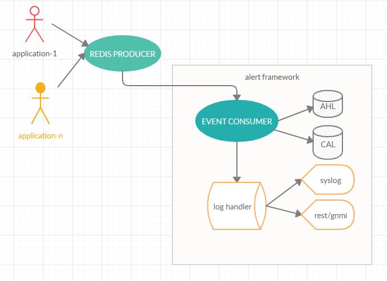
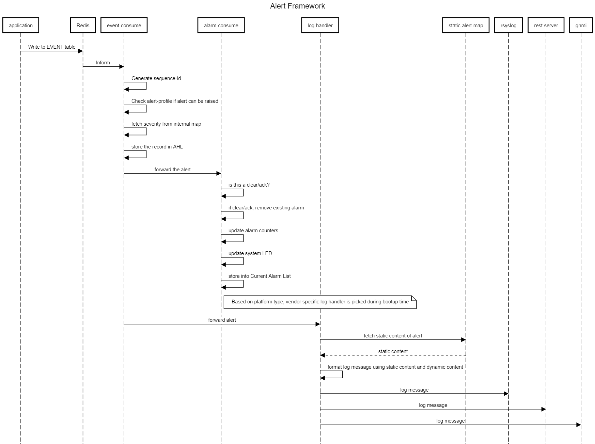

# Feature Name
Alert Management Framework
# High Level Design Document
#### Rev 0.1

# Table of Contents
  * [List of Tables](#list-of-tables)
  * [Revision](#revision)
  * [About This Manual](#about-this-manual)
  * [Scope](#scope)
  * [Definition/Abbreviation](#definitionabbreviation)

# List of Tables
[Table 1: Abbreviations](#table-1-abbreviations)

# Revision
| Rev |     Date    |       Author       | Change Description                |
|:---:|:-----------:|:------------------:|-----------------------------------|
| 0.1 | 04/21/2020  | Srinadh Penugonda  | Initial version                   |
| 0.2 | 05/10/2020  | Srinadh Penugonda  | Updated with review comments      |


# About this Manual
This document provides general information about the Alert Management Framework implementation in SONiC
# Scope
This document describes the high-level design of Alert Management Framework feature. 

# Definition/Abbreviation

### Table 1: Abbreviations
| **Term**                 | **Meaning**                         |
|--------------------------|-------------------------------------|
| AHL                      | Alert History List                  |
| CAL                      | Current Alarm List                  |

# 1 Feature Overview

The Alert Management Framework feature provides a centralized framework for applications in SONiC operating system to raise “alerts”. Alerts are means to indicate a change in the state of the system that operator may be interested in. Another widely used term for Alerts are Events, which can be used interchangeably. 

There are two types of alerts: stateful and stateless. For instance, when admin state of an interface is enabled/disabled, a stateful alert can be sent. Stateless alerts are "one shot" notification to indicate an abnormal situation. 

Both stateful alerts and stateless alerts gets recorded in Alert History List. All current stateful alerts gets recorded in Current Alarm List. 
Alert History List is presisted across system restarts of any kind, restore to factory defaults, and SW upgrades and downgrades.
In short, the framework provides both current and historical alert status of physical entities of the system. 

The framework provides Alert Profiles to customize characteristics of alerts.

In addition to storing in DB, framework forwards log messages corresponding to raised alerts to syslog. Framework is flexible enough to customization of log messages per each vendor. 

## 1.1 Requirements


### 1.1.1 Functional Requirements

Alert Monitoring (Syslog, REST, gNMI) - Phased approach
Request for an Event Framework (EF) responsible for centralizing all events (called alerts) generated in the system for consumption by different subscribers.
The EF has to be flexible to serve vendor specific use cases, but eventually, it can be contributed to the Community. 

A few important characteristics: 
*  Pubs-Subs model at object level with filtering capabilities. Clients should be able to specify what to monitor
*  Pull and Push models, ie., with on-demand retrieval and autonomous notifications
*  User-customizable severities
*  Some sort of plugin architecture to define the native fields that will be generated for each event. However other formats can be used by the Community
*  EF must be decoupled from specific client syntaxes and transmission vehicles, like Syslog, REST, gNMI, SNMP
*  Co-existence with existing mechanisms, like Linux syslog and SNMP.  In particular, the EF's Syslog clients should be configured  independently of the Linux syslog.
*  The information conveyed on each alert must be identical on each interface: Syslog, REST, gNMI.  This is to ensure that if a user or tool wants to use for instance gNMI to operate the switch, gNMI will be 100% equivalent to alerts produced by for example the EF Syslog
*  Support the ability for users to customize the severity of each alert, disable alerts, and to restore the default severity for each event.
*   By default, our severities will be one of: Critical, Warning and Information. However, the code must support Major and Minor for customers using legacy tools. We need a way for customers to override our default severities, even to disable some alerts.
*   The custom severity assignment must be persisted across reboots and firmware upgrades.
*   In particular, our alerts must have one of these severities: Critical, Warning, and Information
*  Every alert with a severity higher than Information should include a concise, meaningful and actionable “Response Action”, which provides users with some instructions to remediate the situation or to gather info for Tech Support.
* Remediation for Information alerts is optional but highly encouraged and particularly valuable for AI tools that can automate some of the steps for self-healing.
*  Support autonomous notifications of alert messages via Syslog.
*  Support the ability to subscribe for alerts at object level (particular instance) and at class level (eg., Vlan)
*  Support the ability to subscribe for alerts per severity
*  Support autonomous notifications of alert messages via REST and gNMI using the same mechanism for streaming telemetry (REST/gNMI).
*  Support the ability to subscribe for alerts at object level (particular instance) and at class level (eg., Vlan)
*  Support the ability to subscribe for alerts per severity
*  There must be an object that manages the current stateful alerts (ie., alarms) and overall health status, called Current Alarm List (CAL) in this document. 
*   The other function of the CAL is to drive the health LED of the switch: Red if any outstanding Critical alarm, else Yellow if any Warning, else Green. 
*   There must be a repository that stores records of all Stateless and Stateful alerts occurred in the system, called Alert History List.
*  Records are generated:
 ```
*   When alerts are raised for stateful or stateless conditions
*   When alarms are cleared for stateful conditions
*   When alarms are acknowledged for stateful conditions
*   When the system clock changes by a user action and is > 5 minutes

 ```
* In addition, records must contain all dynamic vendor specific details of the alert, if any.
*  A good objective for the size of the EHL is to store records for the most recent 30 days at any given time (circular buffer style).
*   Actual storage capacity is an Engineering’s decision, since it can depend on various factors, such as the platform and performance. As a guidance, 86K seems commensurate (1 alert/min) 
*  Every record in the EHL must have a unique Sequence Number. Older records must have lower Sequence Numbers. This Sequence Number can be used by NMS tools to retrieve missing records after they have been disconnected for a while.
*   The EHL and the next Sequence Number to be assigned must be persisted across power cycles, restore to factory defaults, and SW upgrades.
*  Every time that a new record is added to the EHL, a message with the same information as the record must be distributed -after filtering- to the subscribed Syslog clients, as well as CLI if the user is running the “tail -f” command.
* Note: Standard Linux Syslogs generated for tracing and debugging are excluded from this framework, ie., not stored in the EHL

### 1.1.2 Configuration and Management Requirements

*  Privileged users should be able to acknowledge active alarms. ACK’ed alarms will be ignored to calculate the overall health status (eg., the health LED). It will still appear on the CAL. ACK is just a way for the user to indicate they are aware of the situation and prefers not to be reminded.
*  CAL must be accessible via CLI/REST/gNMI. We must have at least the following capabilities:
```
· Display/retrieve a summary of the alarm count per severity and ACK’ed
· Display/retrieve a global health summary: Normal, Warning or Error. Error means at least one Critical or Major present. Else, Warning if Warning or Minor. Else Normal. Acknowledged alarms are ignored in this count
· Display/retrieve the CAL in brief mode
· Display/retrieve details of each alarm
```
*  EHL must be accessible via CLI/REST/gNMI. We must have at least the following capabilities:
```
· Display/retrieve some details of EHL, such as current size, first and last record, next SegNr to be assigned, etc.
· Display/retrieve most recent records (eg., last 5 minutes, one hour, one day)
· Display/retrieve records between two timestamps, one timestamp and end, and beginning and a timestamp
· Display/retrieve all records between two Sequence Numbers. Brief and verbose modes
· Display/retrieve all records for a particular underlying condition or object or class. For example, alerts generated by Fan Modules, Security alerts, etc.
· Display/retrieve records based on Severity (logical AND and OR) and underlying condition or object or class
· (CLI only) Display similar to Linux “tail -f”
```

### 1.1.3 Scalability Requirements

AHL should support 80k/30 day records. Considering the average size of an alert to be 400 bytes, the total memory footprint of alert history is ~4MB. Current active alarms are limited to total instances of unique alarms (which makes Current Alarm List is a finite quantity)

### 1.1.4 Warm Boot Requirements
AHL/CAL should be persisted
Sequence-number should be sequential across reboots.

## 1.2 Design Overview



### 1.2.1 Basic Approach
The feature involves new developlment. 
Openconfig yang for alert table will be one of the deliveries of this feature.
Applications act as producers by writing to redis-db. Redis informs event consumer in eventd whenever there is new record.
Event consumer saves a new entry in alert history table; if the alert is an alarm, record gets added to alarm table and system LED is updated. 
Both EHL and CAL are stored under state DB.
Event consumer then informs log handler(s) to format the log message and send the message to syslog.
 
### 1.2.2 Container
A new container by name, eventd, is created to hold event consumer logic. rsyslog will log messages of alerts to alert.log. 

### 1.2.3 SAI Overview
N/A

# 2 Functionality
## 2.1 Target Deployment Use Cases

The framework provides the following key management services:

- CLI interface for history of alarms and alerts
- Alert/Alarm information to REST/gNMI interfaces
- Alarm monitoring, correlation and notification
- Ability to change severity of known alerts, ability to turn off a particular alert
- Ability to customize log messages

## 2.2 Functional Description
Alert framework allows applications to store "state" of the system for user to query through various north bound interfaces.

# 3 Design
## 3.1 Overview
There are three players in the event framework. Applications, which raises events; 
an Event consumer to receive updates whenever an application raises an event and 
customized log handlers to send log messages to known NBIs for each specific vendor.
A default set of log hanlders will be provided if no specific handling is needed.

Applications act as producers of alerts. Event consumer in eventd container is
informed by redis whenever a new alert is produced. Event consumer manages alarm alerts,
updates alert history table and current alarm list and invokes log handlers.
Log handlers constructs messages and sends it over NBIs (syslog/REST/gNMI).

Operator can chose to change properties of alerts with the help of alert profile. Default
alert profile is stored at /etc/alert.profile. User can download the default alert profile,
modify and upload it back to the switch to apply it. 

Through alert profile, user can change severity of any alert and also can enable/disable a 
alert.

Through CLI, alert history table and current alarm list can be parsed and displayed with various
filters.

### 3.1.1 Applications ( Event Producer )
Application that need to raise an alert, need to use event notifiy API ( SWSS_EVENT / SWSS_ALARM ).
For stateless alert, applications need to provide dynamic message along with alert-id. 
For stateful alerts, applications need to provide alert state ( raise/clear ) along with message and alert-id.
The event producer of swss-common maintains a static map of alert-ids. Developers of alerts need to add alert-id
of new alerts and other characteristics like: severity and static message that gets appended with dynamic message
while sending log messages to syslog/REST/gNMI.
The format of event notify API is:

For stateless alerts: 
definition: 
```
    SWSS_EVENT(name, MSG, ...)
```
Usage:
```
    SWSS_EVENT(PORT_MTU_UPDATE, "Configure  ethernet %s MTU to %s", alias.c_str(), mtu.c_str());
```

For stateful alerts:
definition:
```
    SWSS_ALARM(name, source, action, MSG, ...)
```
Here, action is either RAISE_ALARM or CLEAR_ALARM

Usage:
```
    if (interfaceUp) {
        SWSS_ALARM(PORT_ADMIN_STATUS_CHANGE, std::to_string(id), CLEAR_ALARM, "Set admin status to UP for port pid:%llu", id);
    } else {
        SWSS_ALARM(PORT_ADMIN_STATUS_CHANGE, std::to_string(id), RAISE_ALARM, "Set admin status to DOWN for port pid:%llu", id);
    }
```

The alert-ids in the above usage examples ( PORT_ADMIN_STATUS_CHANGE and PORT_MTU_UPDATE ) need to be added to static_event_table
in addition to severity, turn on/off flag ( true by default ) and static message (if needed).

The static_event_table is declared at include/eventstaticmap.h maintained by sonic-eventd container.

The event notifier takes the alert properties, packs a field value tuple and writes to pubsub table, by name, EVENT as below. 

### 3.1.2 Event Consumer
The event consumer runs from sonic-eventd container. When there is a new record in the pubsub table, redis informs event consumer.
On reading the field value tuble, using the alert-id in the record, event consumer fetches static information from static_event_table.
As mentioned above, static information contains severity, static message part and alert on/off flag. 
If the flag is set to off, event consumer ignores the alert by logging a message.
If the flag is set to on, it continues to process the alert as follows: 
- Generate new sequence-id for the alert
- Write the alert to Alert History List
- It verifies if the alert is stateful. If so, it forwards the alert to alarm consumer for further processing.
- Forward the alert to log handler

#### 3.1.2.1 Severity
Supported alert severities: Critical, Major, Minor, Warning, Informational
The corresponding syslog severties that will be used in log messages are: LOG_ALERT, LOG_CRIT, LOG_ERR, LOG_WARNING, LOG_NOTICE respectively.

#### 3.1.2.2 Sequence-ID
Every new alert should have a sequential ID. The sequence-id is persistent and continues to grow until 2 exp 64 
before wrapping around to start from 1.

### 3.1.3 Alarm Consumer
The alarm consumer on receiving the alert record, verifies the alert state. If it is RAISE_ALARM, it adds the record to Current Alarm List.
If the state is CLEAR_ALARM, it removes the previous record using the key ( source and alert-id ). 
It then updates the system LED. 
The system LED update follows the following rule:
```
    Red if any outstanding Critical alarm, else Yellow if any Warning, else Green.
```
There will be a CLI knob (alarm acknowledge) to acknowledge an alarm. On acknowledging, the system LED updates takes out acknowledged 
alarm into consideration.
The alarm will stil be in the Current Alarm List until the application which raised it clears it after the condition clears up.

### 3.1.4 Log Handler
Log handler per each NBI should contain logic to take the alert record, augment it with vendor specific information, format the message and 
send it to the destination.

Ex: a particular vendor might want to add few fields specific to their platform based on event-id and send with the syslog message. OR the vendor
might want to have a different syslog message format.

Various vendors can add their log handlers at sonic-buildimage/organization_extensions/vendor/ for the build system to overwrite the default log hander in eventd container.

#### 3.1.4.1 syslog
The syslog log handler should augment dynamic information, static information and vendor specific information to this format string.

And invoke syslog() as below:
```
constexpr char LOG_FORMAT[]     = "%s [%s - %s], %s %%%s (%d): %s %s {%s}";    
                                   // Node info
                                   // Log Type
                                   // Log severity
                                   // Vendor Name
                                   // Event Name
                                   // message id
                                   // message category
                                   // Static Desc
                                   // Dynamic Desc
                                   // response Desc

    // raise a syslog message
    syslog(LOG_MAKEPRI(SYSLOG_SEVERITY[ev_sev], SYSLOG_FACILITY),LOG_FORMAT,
        LOG_NODE_INFO, ev_type.c_str(), SYSLOG_SEVERITY_STR[ev_sev].c_str(),
        vender_info.c_str(), ev_id.c_str(), ev_msg.c_str(), ev_static_msg.c_str());
```
#### 3.1.4.2 REST
Traslib does not support streamed RPC responses for framework to send log messages over REST.
So this is not supported.

#### 3.1.4.3 gNMI
Even though gNMI protocol supports streamed RPC responses, translib doesnt have support for it. 
So this is not supported.

### 3.1.5 Alert Profile
The alert profile contains mapping between alert-id and severity of the alert, enable/disable flag.
Through alert profile, operator can change severity of a particular event. And can also enable/disable
a particular alert.

On bootup, event framework would create default alert profile based on static_event_table. 
By default, every alert is enabled.
The severity of alert is decided by designer while adding the event.

The default alert profile is stored at /etc/alert-profile/default.xml

User can upload the default alert profile to a remote host. User can modify characteristics of
certain alerts in the profile and can download it back to the switch.

The updated profile will become custom alert profile.

User can select any of the custom severity profiles under /etc/alert-profile/ using 'alert-profile' command.

The framework will sanity check the user selected alert profile and merges it with static_event_table.

The selected alert profile will be "active" after a reboot.

To "remember" the selected custom profile across reboots, an internal symlink points to the selected custom
profile.

The event consumer will use the static_event_table map to decide whether to raise an alert or not. If alert
is to be raised, static_event_table is again looked into for severity.

Upgrade hooks will be used to persist custom alert profiles.

### 3.1.6 Alert Simulator
To be able to help debugging the framework, a python script will be developed to simulate event notifier.
This script will pack a dummy alert ( either stateless or stateful ) and writes it to EVENT pubsub table.
The tool need to packaged into the image and installed at a known location ( /usr/sbin ? )

The tool should support options to specify type of the alert, source of the alert, dynamic message of 
the alert and action for stateful alerts.

### 3.1.7 CLI
The show CLI require many filters with range specifiers.
This is supported with the help of new operation using RPC.
That is, the event list can be a target resource for normal Get, while CLI can use the customized/RPC Get with a range option.

e.g.
```
rpc getEventBySeqeuenceId{
input {
    from sequence-id;
    to sequence-id;
  }
output {
   list event-table-entries; 
}
```

The rpc callback needs to access DB with the given set of sequence ids.

The gNMI server need to be extended to support the RPC to support similar operations for gNMI.

### 3.1.8 Alert History List 
The Alert History List and Current Alarm List are stored in state db. 
The size of Alert History List is 86k records or 30 days worth of alerts which ever hits earlier.
The manifest file will be updated with parameters to specify the number and number of days limits for
eventd to read and enforce them.

When either of the limit is reached, the framework wraps around the table records by discarding the older records.

Current Alarm List will not have any limits as it only contains the snapshot of the alarms during the current run.

## 3.2 DB Changes
### 3.2.1 CONFIG DB
### 3.2.2 APP DB
### 3.2.3 STATE DB
Two new tables are introduced. 
Alert History List (AHL) and Current Alarm List (CAL).

A pubsub table is used: EVENT between publishers and consumers.
### 3.2.4 ASIC DB
### 3.2.5 COUNTER DB

## 3.3 Switch State Service Design
Macros to raise stateful and stateless alerts are defined in swss-common/.

## 3.5 User Interface
### 3.5.1 Data Models

NOTE: As gNMI is not supposed to use SONiC YANG, OC yang equivalent to SONiC yang will be defined.

```
module sonic-event {
    namespace "http://github.com/Azure/sonic-event";
    prefix ehl;

    import sonic-extension {
        prefix sonic-ext;
    }

    organization
        "SONiC";

    contact
        "SONiC";

    description
        "SONIC Event History Table";

    revision 2020-04-15 {
        description
            "Initial revision.";
    }

    container sonic-event {

        container EHL_TABLE {

            list EHL_TABLE_LIST {
                key "sequence-id";

                leaf sequence-id {
                    type uint64;
                    description "Sequence identifier for events raised";
                }

                leaf event-id {
                    type string;
                    description "Name of the events raised";
                }

                leaf event-timestamp {
                    type string;
                    description "Timestamp at which event is raised";
                }

                leaf event-source {
                    type string;
                    description "Source which raised the event";
                }

                leaf event-action {
                    type enumeration {
                        enum RAISED;
                        enum CLEAR;
                        enum ACK;
                        enum NONE;
                    }

                    description "Event (alarm) action ";
                }

                leaf event-message {
                    type string;
                    description "Dynamic message raised with the event";
                }
				
                leaf event-severity {
                    type enumeration {
                        enum ALERT;
                        enum WARNING;
                        enum ERROR;
                        enum INFORMATIONAL;
			enum CRITICAL;
                    }

                    description "Event (alarm) action ";
                }
            }
        }
    }
}

```
### 3.5.2 CLI
#### 3.5.2.1 Configuration Commands
These are implemented as RPCs.
```
sonic# alarm acknowledge <seq-id>
sonic# alert-profile <profile-name>
```

#### 3.5.2.2 Show Commands
```
sonic# show system health summary
System Health: Normal, Warning or Error

sonic# show alarm summary
Alarm Summary
-------------------------------------------
Total-count:      4
Raised-count:     3
Ack-count:        1
Cleared-count:    1
Stateless-count:  1
-------------------------------------------

sonic# show alarm < brief | all >

sonic# show alert statistics
sonic# show alert history duration <5 minutes | hour | day>
sonic# show alert history sequence-id <from> <to>
sonic# show alert history timestamp <from> <to>
sonic# show alert history severity <severity>
sonic# show alert history source <source>
```

### 3.5.3 REST API Support
/restconf/data/sonic-event:sonic-event/EHL_TABLE/EHL_TABLE_LIST

# 4 Flow Diagrams


# 5 Error Handling
N/A

# 6 Serviceability and Debug
Logging, counters, stats, trace considerations. Please make sure you have incorporated the debugging framework feature. e.g., ensure your code registers with the debugging framework and add your dump routines for any debug info you want to be collected.

# 7 Warm Boot Support
Both EHL and CAL are perisisted.
Custom Alert profiles are persisted.
Sequence-id will be persisted and new alerts will start from old + 1.

# 8 Scalability
N/A

# 9 Unit Test
- Raise an alert 
- Raise an alarm 
- Clear an alarm 
- Ack an alarm 
- Verify wrap around for EHL ( change manifest file to a lower range and trigger that many events )
- Verify sequence-id for alerts is persistent
- Verify counters by raising various alarms with different severities 
- Change severity of an alert through custom alert profile and verify it is logged at specified severity
- Change enable/disable of an alert through custom alert profile and verify it is suppressed
- Verify custom alert profile with an invalid alert-id is rejected 
- Verify custom alert profile with an invalid severity is rejected 
- Verify custom alert profile with an invalid enable/disable flag is rejected 
- Verify custom alert profile with an invalid xml syntax is rejected 
- Verify custom alert profile is persisted after a reboot
- Verify vendor log handler is picked and applied
- Verify various show commands

# 10 Internal Design Information
Each log handler can maintain another mapping table of alert-id and relevant vendor specific static information to be sent in the log messages. 
( TODO: explore any other efficient ways to achieve it )

