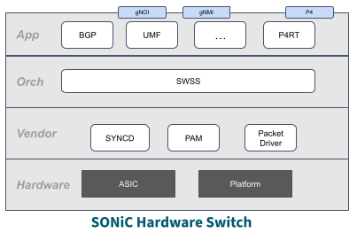

# ALPINE High Level Design

## Table of Content
- [Revision](#revision)
- [Scope](#scope)
- [Definitions/Abbreviations](#definitionsabbreviations)
- [Overview](#overview)
- [Requirements](#requirements)
- [Architecture Design](#architecture-design)
- [High-Level Design](#high-level-design)
  * [Alpine Virtual Switch](#alpine-virtual-switch)
    + [SwitchStack Container](#switchstack-container)
    + [ASIC Simulation Container](#asic-simulation-container)
    + [Ports](#ports)
    + [Why 2-containers?](#why-2-containers)
  * [Alpine KNE Deployment](#alpine-kne-deployment)
    + [Nodes](#nodes)
    + [Links](#links)
- [SAI API](#sai-api)
- [Configuration and management](#configuration-and-management)
- [Warmboot and Fastboot Design Impact](#warmboot-and-fastboot-design-impact)
- [Memory Consumption](#memory-consumption)
- [Restrictions/Limitations](#restrictionslimitations)
- [Testing Requirements/Design](#testing-requirementsdesign)
- [Open/Action items - if any](#openaction-items-if-any)

## Revision
Rev | Rev	Date	| Author	| Change Description
---------|--------------|-----------|-------------------
|v0.1 |05/20/2025  |Google | Initial version

## Scope
This document captures the high-level design of an Alpine Virtual Switch (ALViS). ALViS is part of ALPINE - a switchstack simulation framework which also consists of a deployment model (AKD).

## Definitions/Abbreviations

<table>
  <tr>
   <td><strong>ALViS</strong>
   </td>
   <td>Alpine Virtual Switch
   </td>
  </tr>
  <tr>
   <td><strong>AKD</strong>
   </td>
   <td>Alpine KNE Deployment
   </td>
  </tr>
  <tr>
   <td><strong>KNE</strong>
   </td>
   <td>Kubernetes Network Emulation
   </td>
  </tr>
    <tr>
   <td><strong>UPM</strong>
   </td>
   <td>Userspace Packet Module
   </td>
  </tr>
</table>

## Overview

ALPINE comprises a Virtual Switch (ALViS) and a Deployment Model (AKD). ALViS is a SONiC virtual switch that comes with a virtual ASIC to provide dataplane capabilities in software. ALViS supports plugging in other vendor implementations for virtual ASIC. This document describes the internals of the ALViS design and also discusses the deployment model used for ALViS. 

## Requirements

The current design covers the internals of an Alpine Virtual Switch and its unique features to cater to following requirements:
1. Pluggable software data path
    * For example, software pipeline, high performance pipeline, ASIC simulator
    * Support for forwarding and packet I/O
2. Flexible deployment from a single image
    * Allow users to select the “hardware” SKU at runtime
    * Consistent with SONiC images for hardware switches 
3. Identical application and orchestration software layers 
    * Leverage as much shared code as possible
4. Modest resource requirements
    * Deployable in a developer’s environment
    * Scalable in the cloud

## Architecture Design

SONiC Hardware Switch architecture can be viewed as below layers:



To implement a virtual switch with dataplane, ALViS uses a “Vendor Separation” model where the virtual ASIC pipeline runs independently in a separate container outside of the SONiC Software Stack.


## High-Level Design

In this section, we will go over the internals of ALViS and how vendor simulations can be integrated in Alpine.

### Alpine Virtual Switch


At a high level, the Alpine Virtual Switch (ALViS) is composed of 2 foundational Docker containers:

1. SwitchStack Container which runs a SONiC VM, and
2. ASIC Simulation Container which runs the virtual ASIC.

An ALViS is instantiated with a fixed set of data ports and a management port. The enabling/disabling of these ports is controlled by the SAI. More on ports later.

These containers are deployed as a Kubernetes Pod, and KNE is used to provide connectivity between the data plane ports of multiple ALViS instances.

#### SwitchStack Container

This container hosts the SONiC VM with all the SONiC containers running inside the VM. On startup, the container instantiates a VM using qemu with the necessary port connectivity. This VM is the SONiC VM built with all the SONiC containers. ALViS provides a SAI implementation for syncd to talk to the virtual data plane over gRPC as well as a Userspace Packet Module (UPM) to handle packet in/out from the virtual ASIC’s CPU port and the SONiC VM.

A new platform is introduced to sonic-buildimage to build an ALViS image:

```
PLATFORM=alpinevs make configure
make target/sonic-alpinevs.img.gz
``` 

#### ASIC Simulation Container

This container runs the virtual dataplane for the Alpine Virtual Switch. Alpine comes with a default dataplane called Lucius, which implements a subset of the SAI pipeline today and can easily be extended as needed. Vendors can provide alternative virtual dataplanes, e.g. an ASIC simulator capable of passing traffic. To integrate into ALViS, the vendor needs to provide:

1. ASIC Simulation Container that runs their virtual data plane,
2. SAI implementation that talks to the virtual data plane over a socket, and
3. UPM that sends and receives packets from the virtual data plane’s CPU port.

In the future, there may be opportunities to generalize and standardize the remote SAI and packet interfaces, but for now, these interfaces are implementation specific.

#### Ports

To achieve the connectivity within the ALViS and outside the switch, there are following ports:

1. Data Ports for traffic switching within the pipeline. These are created when an Alpine topology is deployed with links between multiple virtual switches. 
2. Management Port: Used for communication between containers and also to external test runners.
3. HostIFs in the VM provide packets In and Out from the ASIC to the CPU. This is handled by sending and receiving through the linux netdevs. Special ports like genetlink and send to ingress are also supported.

#### Why 2 containers?

The primary reason for deploying ALViS as two containers is to closely model the behavior of real hardware, by keeping the simulation pipeline separate. This separation enables advanced feature simulation, such as warm-reboot, where the VM is restarted while the virtual data plane container maintains traffic forwarding. This capability is crucial for SAI/SDK reconciliation development and testing during warm-reboot scenarios on a virtual ASIC, even before the actual hardware is available.

Additionally, the 2 container design provides other benefits, including:

1. Supporting Dynamic Port Breakout: The virtual switch doesn’t need to know about the lanes during the bringup. The ports are created as per the create_hostif and create_port calls with the desired lanes helping achieve dynamic breakouts.

2. Make the virtual switch look as close to hardware as possible: The number of ports/interfaces visible in the VM (ip addr) is exactly the hostifs been created by SAI. There is no overhead of veths inside the VM.

3. Replaceable Simulation: This is provided in the form of a docker registry location which is pulled at runtime during deployment. For example, to use a Lucius simulation container, Alpine topology adds following in the vendor_data with image path us-west1-docker.pkg.dev/openconfig-lemming/test/lucius:ga 

### Alpine KNE Deployment

Alpine KNE Deployment (AKD) is the default environment for instantiating ALViS. [KNE](https://github.com/openconfig/kne/tree/main) provides the emulated network topology in Kubernetes that connects the data plane ports of different ALViS instances. Topologies for deployment in KNE are defined as protobufs consisting of nodes and links. KNE provides built-in Cloud integration and Ondatra support.

Here is a simple topology diagram where 2 ALViS are connected using KNE links.


#### Nodes

Each node is of type [ALPINE](https://github.com/openconfig/kne/blob/main/topo/node/alpine/alpine.go) which defines the containers and supported services. Each node is the AlpineVS switch which is a KNE Pod.

Following is an example of a node called `alpine-dut`:

```
   name: "alpine-dut"
   vendor: ALPINE
   config: {
       image: "us-west1-docker.pkg.dev/google.com/gpins-268206/gpins-containers/alpine-vs:ga"
       vendor_data {
           [type.googleapis.com/alpine.AlpineConfig] {
               containers: {
                   name: "dataplane"
                   image: "us-west1-docker.pkg.dev/openconfig-lemming/test/lucius:ga"
                   command: "/lucius/lucius"
                   args: "-alsologtostderr"
               } 
           }
       }
   }
```

The `vendor-data` above, defines the configuration for the dataplane container. In the case of Alpine, lucius dataplane is used by default.

Services for each node are defined as follows on specific ports:

```
services:{
       key: 22
       value: {
           name: "ssh"
           inside: 22
       }
   }
   services:{
       key: 9339
       value: {
           names: "gnmi"
           names: "gnoi"
           inside: 9339
       }
   }
   services:{
       key: 9559
       value: {
           name: "p4rt"
           inside: 9559
       }
   }
```

Similarly, another node `alpine-ctl` is also defined.

#### Links

After defining the nodes (eg: `alpine-dut` and `alpine-ctl`), links can be added between the nodes as follows:

```
links: {
   a_node: "alpine-dut"
   a_int: "eth1"
   z_node: "alpine-ctl"
   z_int: "eth1"
}
links: {
   a_node: "alpine-dut"
   a_int: "eth2"
   z_node: "alpine-ctl"
   z_int: "eth2"
}
```

## SAI API

Alpine doesn’t need any SAI changes. It is up to the vendor implementation of the simulation pipeline to provide the connectivity to SAI over sockets.
The default implementation of Alpine with Lucius comes with a libsai-grpc which is an auto-generated gRPC client linked to the Syncd. This client talks to the SAI server running in Lucius. The API can be found here: https://github.com/openconfig/lemming/blob/main/dataplane/docs/protoforsai.md 

## Configuration and management

An ALViS image is built with the capability of deploying as different platform types. This is achieved by passing bootstrap config (`config_db.json`) at runtime and using a service (alpinevs-init) to select the respective platform on init.

1. Runtime Bootstrap config is passed using the topology param as follows (eg: twodut-alpine-brixia.pb.txt):

```
config_path: "/etc/sonic"
config_file: "config_db.json"
file: "config_db_alpine_vs.json"
```

2. Alpinevs-init service is responsible for selection of the intended platform at runtime based upon the bootstrap config passed. Platform files for generic AlpineVS is packaged in the alpinevs image. The selection of the default_sku happens at runtime based upon the config_db’s hwsku parameter (eg: "hwsku": "alpine_vs") in "DEVICE_METADATA". With the above config, the platform on the virtual switch is reported as follows:

```
root@sonic:/home/admin# show platform summary
Platform: x86_64-kvm_x86_64-r0
HwSKU: alpine_vs
ASIC: alpinevs
ASIC Count: 1
Serial Number: Alpine00
Model Number: alpine_vs
Hardware Revision: alpine.v.0
```

If no config is passed, the default_sku remains `Force10-S6000` which is the default setting for sonic_vs.

```
root@sonic:/home/admin# show platform summary
Platform: x86_64-kvm_x86_64-r0
HwSKU: Force10-S6000
ASIC: alpinevs
```

## Warmboot and Fastboot Design Impact

Warmboot and Fastboot Design are unaffected. ALViS offers a useful tool for Warmboot development and testing.

## Memory Consumption

The VM is created with 32GB RAM and 12 vCPUS using qemu parameters: `-m 32768` and `-smp 12`.

Following is an example usage from a running system for the VM and Lucius dataplane:

```
PID USER         PR  NI    VIRT    RES    SHR S  %CPU  %MEM     TIME+ COMMAND                                                                                                              
289481 root      20   0   33.7g   4.2g  21056 S  37.1   3.6  41:10.87 qemu-system-x86
287711 root      20   0   13.6g 235640 156068 S   5.3   0.2   5:07.92 lucius  
```

## Restrictions/Limitations

Following are the known restrictions with Alpine:
1. ALViS currently runs only in AKD
2. Anything else?

## Testing Requirements/Design

Following are the requirements for running ALViS based testing:
1. A KVM-enabled host device. If the host device is a VM, it should have nested-virtualization enabled because ALViS runs a VM.
2. Kubernetes Network Emulation: https://github.com/openconfig/kne/tree/main 

Steps to bring up a topology:

1. Build a topology: Following is an example where an ALViS is connected to a simple ubuntu host container:

```
name: "twodut-alpine"
nodes: {
    name: "alpine"
    vendor: ALPINE
    config: {
        image: "sonic-vs:latest"
        vendor_data {
            [type.googleapis.com/alpine.AlpineConfig] {
                containers: {
                    name: "dataplane"
                    image: "us-west1-docker.pkg.dev/openconfig-lemming/release/lucius:ga"
                    command: "/lucius/lucius"
                    args: "-alsologtostderr"
                }
            }
        }
    }
    services:{
        key: 22
        value: {
            name: "ssh"
            inside: 22
        }
    }
}
nodes: {
    name: "host"
    vendor: HOST
    services:{
        key: 22
        value: {
            name: "ssh"
            inside: 22
        }
    }
}
links: {
<snip>
}
```

Example topology file: https://github.com/openconfig/kne/blob/main/examples/alpine/alpine.pb.txt 

2. Deploy the KNE cluster and the topology:

```
kne deploy deploy/kne/kind-bridge.yaml
kne create examples/alpine/alpine.pb.txt
```

3. SSH to ALViS

```
IPDUT="$(kubectl get svc -n twodut-alpine service-alpine-dut -o jsonpath='{.status.loadBalancer.ingress[0].ip}')"
ssh admin@${IPDUT}
```

## Open/Action items

Following are some suggestions for further exploration:

1. ALViS outside of AKD: Team is exploring ways of deploying an ALViS independent of AKD. This can be a standalone virtual switch or in the well known SONiC topologies like t0/t1.
2. ALViS-lite: Similar to docker-sonic-vs, the team is exploring an alternative ALViS Switch Container, called docker-sonic-alpinevs, that runs apps (and dataplane) directly without running a VM.