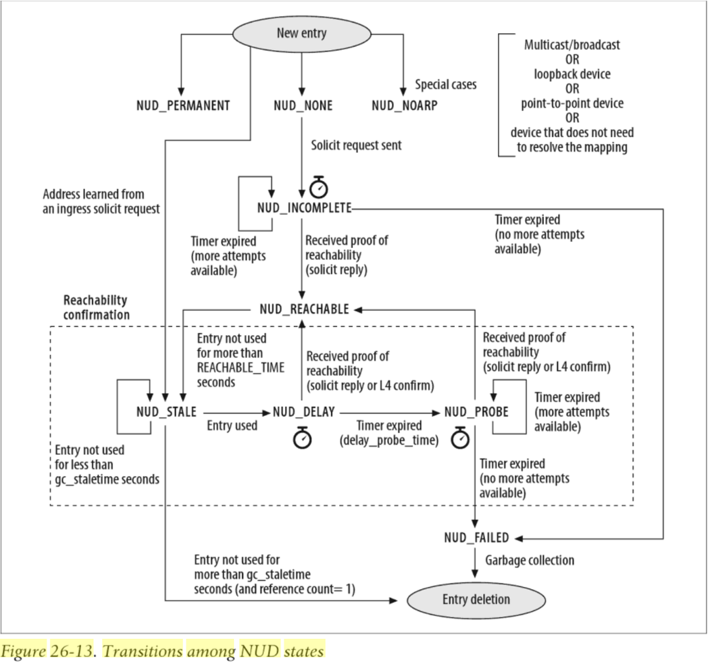
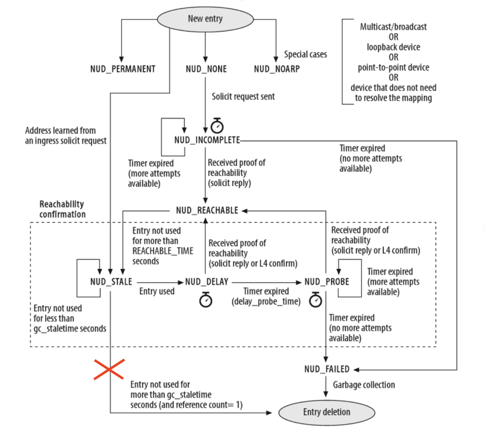
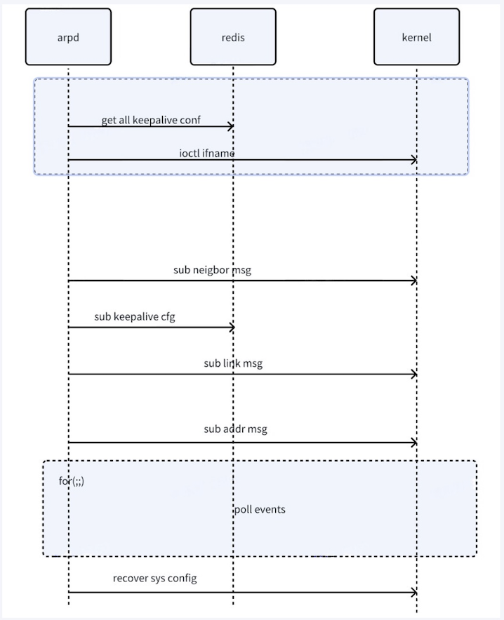

# ARP-KEEPALIVE

## Table of Content

* [1. Revision](#1-revision)

* [2. Scope](#2-scope)

* [3. Definitions/Abbreviations](#3-definitionsabbreviations)

* [4. Overview](#4-overview)

* [5. Requirements](#5-requirements)

* [6. Design](#6-design)

*   [7. Configuration and management](#7-configuration-and-management)
    
    *   [7.1. Config DB data structure](#71-config-db-enhancements)
    *   [7.2. CLI](#72-cli)
    
    

### 1. Revision

| Revision | Date         | Author    | Change Description |
| -------- | ------------ | --------- | ------------------ |
| 1.0      | June 28 2024 | Ethan Nan | Initial proposal   |

### 2. Scope

This document suggests a new feature called neighbor arp-keepalive running in arpd to prevent packet loss caused by the deletion of neighbor entries during the refresh of neighbor entries after the aging time of ARP/NDP entries in the Linux kernel.

### 3. Definitions/Abbreviations

| Definitions/Abbreviation | Description                 |
| ------------------------ | --------------------------- |
| ARP                      | Address Resolution Protocol |
| NDP                      | Neighbor Discovery Protocol |

### 4. Overview

We found problems with packet loss in the case of a large number of ARP table entries.  Specifically, in a test of 12K arp entries, only 4K+ entries left within a short period of time after the aging time is reached, which may result in sudden packet loss.

1. From SONiC view, the kernel's arp/ndp table has an aging time. After the table entries age, soft forwarded packets in linux will trigger the ARP learning process. In sonic, the underlying packets will not be forwarded to the CPU, so it cannot trigger the ARP probe mechanism of the linux kernel, which will result in no table entries in the chip and may cause instantaneous packet loss.
2. From kernel view,  according to the Linux NUD protocol, after the state machine of the neighbor table entry is REACHABLE, the traffic related to the neighbor will be forwarded through the hardware, and the entry will not be hit again in the software. At the same time, according to the NUD protocol state machine, the state of the table entries will be REACHABLE from the STALE, and finally be deleted. Because an entry in the STALE state will be directly changed to the deleted state if no traffic hits the entry.



__Figure 1: NUD State Machine__


### 5. Requirements

Restrictions/Limitations:

*   arpd's code is modified based on iproute2-4.9.0, so it will not work on iproute-5.1.0 which has been updated in branch after 202106.

### 6. Design

So，to solve the above problems, three points need to be solved.

1. Maintain the state of a neighbor entry, that is, the neighbor entries on the maintenance path are not deleted due to aging. At the same time, when neighbor does not exist, the neighbor entry can be deleted normally.
2. Depending on the user configuration or the default configuration, the user has the flexibility to choose whether to keep alive or not.
3. Due to the existence of the first part, in the scenario with a large number of arp entries, there will be a large number of arp request/ns packets sent, and it is necessary to choose to use user mode to take over the sending task to reduce the pressure on the kernel space. So, when the kernel sends ns/arp requests, the action of sending packets is delegated to user space.

Detailly,

1. For point 1, consider using the arpd running in a new container named docker-iproute to monitor the state of the kernel entry. If the current state of the kernel entry is stale, arpd will set the state to delay and pass it back to the kernel to ensure that the state of the entry changes to:`NUD_REACHABLE`-->`NUD_STALE`-->`NUD_DELAY`-->`NUD_PROBE`. In the `NUD_PROBE` state, the kernel sends an arp request/ns packet to detect the presence of a neighbor. If the peer responds with an arp request/ns message, the arp entry will then return to `NUD_REACHABLE` and close the loop; If the peer does not respond, then the neighbor does not exist or there is a problem, and the entry is set to `NUD_FAILED` and reclaimed by the kernel.


__Figure 2: Arp Keepalive NUD State Machine__

2. For point 2, arpd will subscribe to `CONFIG_DB` database and flexibly select the interface based keepalive function according to the user configuration. By default, all l3 interfaces are enabled to keep alive, providing on/off configuration commands.
3. For point 3, arpd modifies the kernel parameters `app_solicit` and `ucast_solicit` corresponding to interface, which config arp neighbor keep active function enable if not, which is used to send packets in user space. If `app_solict>0` and ucast_solicit=0, arpd notifs the user space by RTM_GETNEIGH message when the arp request/ns is about to be sent, where `app_solict` represents the number of packets sent by the user space.

Summarily, The overall implementation framework is shown on Figure 3.

__Figure 3: Arp Overall Implementation Framework__
1. After arpd is up, get all alive configuration to avoid losing configuration when the process is restarted.

2. Subscribe to the kernel neighbor message to receive all neighbor change information, which is convenient for state modification and packet transmission;

3. Subscribe to live configuration and handle the addition, deletion, modification and check of corresponding configuration;

4. Subscribe to the kernel link status (port creation and deletion up/down, etc.) and the change of addr information (ip address creation and deletion, etc.), in order to ensure that the intf index/ip address /mac address and other information is correct when sending packets;

5. When a process exits, do a good job of restoring configuration, especially kernel parameter changes.

### 7. Configuration and management

#### 7.1. Config DB data structure

Configuration schema in ABNF format:

```abnf
; CFG_ARPKEEPALIVE table
key                = "CFG_ARPKEEPALIVE|Ethernet0" ; Interface arp keepalive configuration table
status             = "enabled"/"disabled"       ; IPv4 keepalive feature,  by default this flag is disabled
linklocal_status   = "enabled"/"disabled"       ; IPv6 keepalive feature, by default this flag is disabled
```

Sample of CONFIG DB snippet given below:

```json
{
    "CFG_ARPKEEPALIVE": {
        "Ethernet0": {
            "status": "enabled",
            "linklocal_status": "disabled"
        }
    }
}
```

#### 7.2. CLI

A new CLI command is added to control this feature:

Command to show list of interface neighbor kee-alive configurations:

```
admin@sonic:~$ show interface neighbor keep-alive
interface    status    linklocal
--------------------------------
Ethernet0    enable    disable
Ethernet4    enable    disable
Ethernet20   enable    disable
Ethernet12   enable    disable

```

Command to enable arp-keepalive of IPv4 on Ethernet1:

    admin@sonic:~$ sudo config interface neighbor keep-alive enabled Ethernet1

Command to enable arp-keepalive of IPv6 on Ethernet1:

```
admin@sonic:~$ sudo config interface neighbor keep-alive enabled Ethernet1 --linklocal enabled
```

