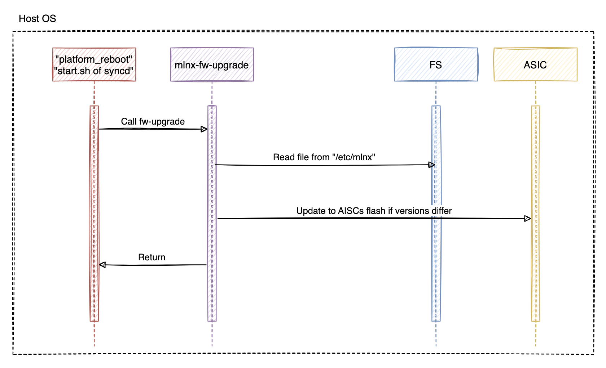
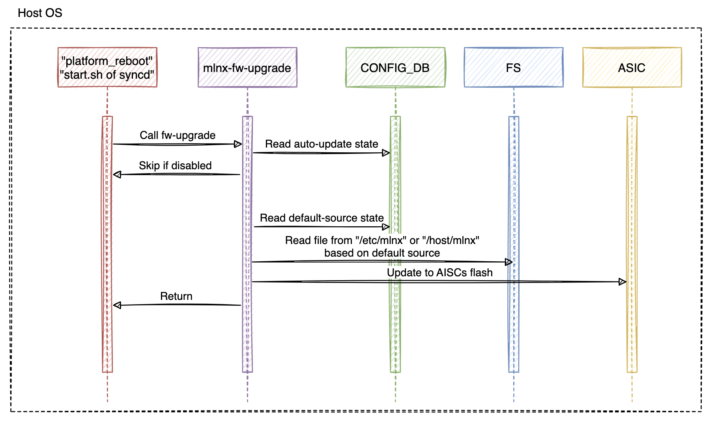

<!-- omit in toc -->
# SONiC ASIC firmware update control HLD

<!-- omit in toc -->
#### Rev 1.0

<!-- omit in toc -->
## Table of Content
- [Revision](#revision)
- [Scope](#scope)
- [Definitions/Abbreviations](#definitionsabbreviations)
- [Overview](#overview)
- [Requirements](#requirements)
- [Architecture Design](#architecture-design)
- [High-Level Design](#high-level-design)
  - [Original ASIC FW update flow (Nvidia)](#original-asic-fw-update-flow-nvidia)
  - [New ASIC FW update flow](#new-asic-fw-update-flow)
- [Configuration and management](#configuration-and-management)
  - [CLI Enhancements](#cli-enhancements)
  - [Config DB Enhancements](#config-db-enhancements)
  - [Feature configuration](#feature-configuration)
- [Multi-DB support](#multi-db-support)
- [Configuration Reload](#configuration-reload)
- [Multi-ASIC](#multi-asic)
- [SAI API](#sai-api)
- [Testing Requirements/Design](#testing-requirementsdesign)

<!-- omit in toc -->
## List of Figures
- [Figure 1. ASIC firmware update original flow
](#figure-1-asic-firmware-update-original-flow)
- [Figure 2. ASIC firmware update controlled flow
](#figure-2-asic-firmware-update-controlled-flow)

### Revision
|  Rev  |  Date   |     Author     | Change Description |
| :---: | :-----: | :------------: | ------------------ |
|  1.0  | 06/2022 | Yevhen Fastiuk | Phase 1 Design     |

### Scope
This document describes the high-level design of SONiC ASIC firmware update
control feature.

### Definitions/Abbreviations
| **Abbreviation** | **Definition**                          |
| ---------------- | --------------------------------------- |
| API              | Application Programming Interface       |
| ASIC             | Application-specific integrated circuit |
| FW               | Firmware                                |
| SONiC            | Software for Open Networking in Cloud   |

### Overview

<!-- omit in toc -->
#### Feature Overview
SONiC ASIC firmware update control feature is a mechanism that helps to better
control and manage update of ASIC firmware.
Feature in this scope is using standard database-oriented SONiC configuration
mechanism. It allows saving configuration in DB for further usage of it.

<!-- omit in toc -->
#### Motivation
The way how SONiC manages ASIC firmware does not flexible. The only way to
update ASIC firmware is to embed it into the image and reinstall it to the
switch. That method is very uncomfortable because you need to build a SONiC
image, even you don't really need to.
So, here where that feature comes in. It allows to better control the process
of updating ASIC firmware.
The feature support two types of configuration: enable/disable automatic
firmware updates, set the source of ASIC firmware image.

### Requirements

<!-- omit in toc -->
#### Functional requirements
This section describes a list of requirements for SONiC firmware update control
feature.

The following list of requirements has to be met for SONiC firmware update
control feature:
- SONiC OS must support the same functionality as before.
- Feature should be configurable using CLI or config_db.json.
- Config should last after image upgrade.
- Firmware images should last after image upgrade.
- Have an ability to control auto-update.
- Have an ability to control firmware source.
- Ability to auto-update when moving between images.

### Architecture Design
This section covers the changes that are required in the SONiC architecture.
In general, it is expected that the current architecture is not changed.
This section should explain how the new feature/enhancement (module/submodule)
fits in the existing architecture.

### High-Level Design
#### Original ASIC FW update flow (Nvidia)
The original flow of ASIC firmware update is very simple. Every time system
reboot causes execution of **platform_reboot** script. This is platform specific
script that prepares system for the reboot. One of the responsibility of that
script is to make sure that ASIC firmware is up-to-date. To perform that check
it calls **mlnx-fw-upgrade** script (for Nvidia platform) which actually
performs checking of the versions (available and installed). In case versions
are different it installs the ASIC firmware embed into system image
(form */etc/mlnx/* folder for Nvidia platform). See [Figure 1. ASIC firmware
update original flow](#figure-1-asic-firmware-update-original-flow).

<!-- omit in toc -->
###### Figure 1. ASIC firmware update original flow (Nvidia)
<p align=center>
  
</p>

When updating through ONIE **start.sh** script of **syncd** container performs
ASIC firmware installation. It calls the same **mlnx-fw-upgrade** script in
order to make sure that ASIC firmware is up-to-date.

#### New ASIC FW update flow
The new ASIC firmware update flow brings a couple of improvements to ASIC
firmware update script. It will read the configuration from the database and
based on it, decide if ASIC FW have to be updated.
In the same manner, the script will know the source of the firmware image:
system image or user defined.
Example: for Nvidia platform system image, ASIC firmware image located in
*/etc/mlnx/* directory. We bring a new user location for ASIC firmware image
*/host/mlnx/asic/*. This location will survive system upgrade, so system will be
able to update ASIC FW even after system upgrade. See the new flow here:
[Figure 2. ASIC firmware update controlled flow
](#figure-2-asic-firmware-update-controlled-flow).

<!-- omit in toc -->
###### Figure 2. ASIC firmware update controlled flow
<p align=center>
  
</p>

### Configuration and management
#### CLI Enhancements
The initial version of that feature brings an ability to configure via
config_db.json, but not a CLI commands.
But based on the current SONiC CLI tree, we can propose the next commands tree.

<!-- omit in toc -->
#### CLI
Currently, we have the next firmware-related CLI tree:
```
config
\-- platform
    \-- firmware
        |-- install
        \-- update
```

Proposed ASIC firmware control CLI is here:
```
config
\-- platform
    \-- firmware
        |-- asic
        |   |-- auto-update [ enable | disable ]
        |   \-- default [ image | user ]
        |-- install
        \-- update
```

CLI helptext:
```
admin@sonic:~$ sudo config platform firmware asic
Usage: config platform firmware asic [OPTIONS] COMMAND [ARGS]...

  ASIC firmware configuration commands

Options:
  -?, -h, --help  Show this message and exit.

Commands:
  auto-update     Control ASIC firmware auto update [ enable | disable ]
  default         Set default firmware source [ image | user ]
```

The CLI should be enabled for the platforms which support the firmware update and control.
It can be done by registering the CLI just for supported platforms.

```python
@click.group()
def firmware_asic():
    pass

# Add all CLIs here ...

def register(cli):
    version_info = device_info.get_sonic_version_info()
    if version_info and version_info.get('asic_type') == 'mellanox':
        cli.commands['platform'].add_command(firmware_asic)
```

<!-- omit in toc -->
##### CLI default options description
* auto-update: Control whether to update ASIC firmware automatically.
  * enable (Default): ASIC firmware will be updated at reboot time.
  * disable: Do not update ASIC firmware at reboot time or when installing new
    system image.
* default: Control the default source for ASIC firmware.
  * image: Use ASIC firmware from system image. Usually, it is located in
    */etc/\<vendor>/* folder. For Nvidia, it is located in */etc/mlnx/* folder.
  * user: User-defined firmware file. Should be located in
    */host/\<vendor>/asic/* folder to be available after installing/loading a
    new system image. For Nvidia, that folder is */host/mlnx/asic/*.

#### Config DB Enhancements
To be able to configure ASIC firmware update flow, we need a new ConfigDB table.
Basically, the table is very simple it will have such structure:
* CONFIG_DB
  * FIRMWARE
    * asic
      * auto_update
      * default

Here is a YANG model of a new table:
```yang
module sonic-firmware {

    yang-version 1.1;

    namespace "http://github.com/Azure/sonic-firmware";
    prefix firmware;

    description "FIRMWARE YANG Module for SONiC-based OS";

    revision 2022-05-05 {
        description "First Revision";
    }

    typedef auto-update {
        description "Configuration to set if firmware is going to be updated
                     automatically";
        type string {
            pattern "enable|disable";
        }
    }

    typedef default-source {
        description "Configuration to set firmware source: system image or 
                     user-defined";
        type string {
            pattern "image|user";
        }
    }

    container sonic-firmware {

        container FIRMWARE {

            description "FIRMWARE part of config_db.json";

            container asic {

                leaf auto_update {
                    type auto-update;
                    default "enable";
                }

                leaf default {
                    type default-source;
                    default "image";
                }

            }

        }
        /* end of container FIRMWARE */
    }
    /* end of top level container */
}
/* end of module nvue */
```

#### Feature configuration
<!-- omit in toc -->
##### Disable FW auto-update
```
sudo config firmware asic auto-update disable
sudo reboot
```
<!-- omit in toc -->
##### Enable auto-update, change source to user-defined
```
sudo config firmware asic auto-update enable
sudo config firmware asic default user
sudo mkdir -p /host/mlnx/asic/
sudo cp /tmp/fw-SPC2-rel-29_2010_2270-EVB.mfa /host/mlnx/asic/fw.mfa
sudo reboot
```

### Multi-DB support
Currently, the support of this feature is for single-ASIC. Multi-ASIC support is
out of scope.

### Configuration Reload
*config reload* & *config load_minigraph* are used to clear current
configuration and import new configuration from the input file
or from /etc/sonic/config_db.json. This command shall stop all services before
clearing the configuration and then restarts those services.
Thus, any service that consumes CONFIG DB data has to be restarted on reload
commands.
This new feature does not subscribe to the changes in ConfigDB, it reaches the
configuration on demand, so it won't be affected by configuration reload.

### Multi-ASIC
As you may notice, there is no ASIC id for the new database table here. The
reason for that is even we will support multi-ASIC platform, we need to make
sure, that firmware version is the same on each ASICs we have on our platform.
If in the future, we decide to use different ASICs on the same platform, we can
extend that table with an appropriate ASIC id field.

### SAI API
No SAI API changes required for this feature.

### Testing Requirements/Design

<!-- omit in toc -->
#### System Test cases
<!-- omit in toc -->
##### Use image firmware
1. Enable auto-update and set default source to image
   ``` 
   sudo config firmware asic auto-update enable
   sudo config firmware asic default image
   ```
2. Install new system firmware on the switch
3. Reboot the switch
   ```
   sudo reboot
   ``` 
4. Make sure ASIC FW was updated

<!-- omit in toc -->
##### Test auto-update
1. Disable auto-update and set default source to image
   ``` 
   sudo config firmware asic auto-update disable
   sudo config firmware asic default image
   ```
2. Install new system firmware on the switch
3. Reboot the switch
   ```
   sudo reboot
   ``` 
4. Make sure ASIC FW was NOT updated

<!-- omit in toc -->
##### Use user-defined firmware
1. Enable auto-update and set default source to image
   ``` 
   sudo config firmware asic auto-update enable
   sudo config firmware asic default user
   sudo mkdir -p /host/mlnx/asic/
   sudo cp /tmp/fw-SPC2-rel-29_2010_2270-EVB.mfa /host/mlnx/asic/fw.mfa
   sudo reboot
   ```
2. Install new system firmware on the switch
3. Reboot the switch
   ```
   sudo reboot
   ``` 
4. Make sure ASIC FW was updated to user-defines firmware

<!-- omit in toc -->
### Cold and Warm boot implications
Cold boot is not affected by this feature, it will work as it did before.
Warm boot is out-of-scope for this feature. But in general, this feature won't
break warm boot. It didn't change the flow of ASIC firmware update it controls
whether to start ASIC firmware update or not and which ASIC firmware file to
use.
