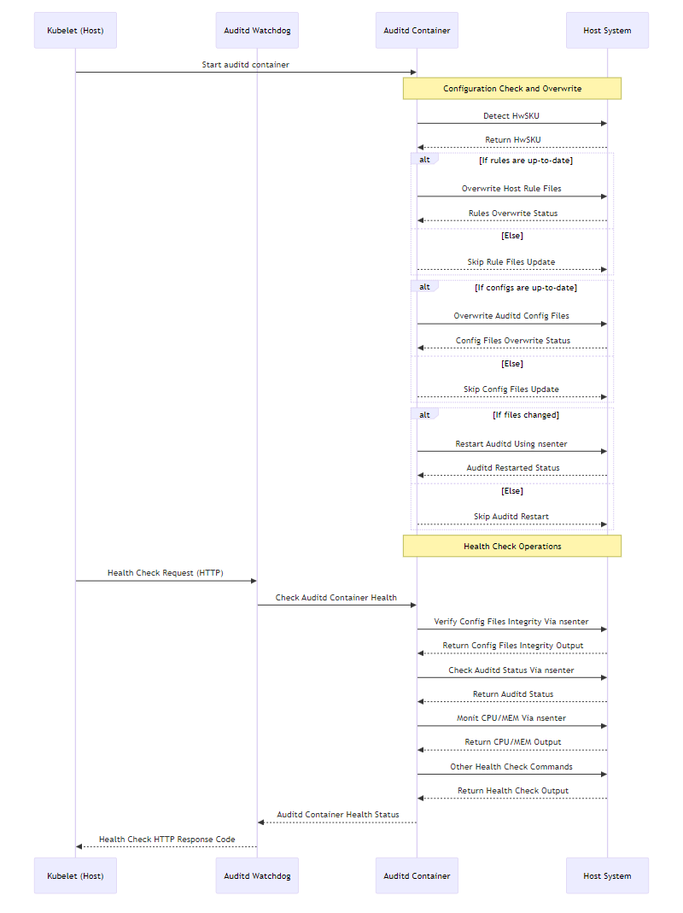

# SONiC Security Auditing

## Table of Content
- [SONiC Security Auditing](#sonic-security-auditing)
  - [Table of Content](#table-of-content)
  - [List of Tables](#list-of-tables)
  - [Revision](#revision)
          - [Table 1: Revision](#table-1-revision)
  - [Scope](#scope)
  - [1. Overview](#1-overview)
  - [2. Requirements](#2-requirements)
  - [3. Current Architecture Design](#3-current-architecture-design)
  - [4. High-level Design](#4-high-level-design)
    - [4.1 Auditd Container Configuration](#41-auditd-container-configuration)
    - [4.2 Auditd Watchdog Container Configuration](#42-auditd-watchdog-container-configuration)
    - [4.3 Host Command Execution via Container](#43-host-command-execution-via-container)
    - [4.4 Configuration Enhancement](#44-configuration-enhancement)
    - [4.5 Audit Rules Review](#45-audit-rules-review)
          - [Table 2: Audit Rules Review](#table-2-audit-rules-review)
      - [4.6 Flow Diagram](#46-flow-diagram)
          - [Figure: Auditd Flow Diagram](#figure-auditd-flow-diagram)
  - [5. Testing Requirements/Design](#5-testing-requirementsdesign)

## List of Tables
* [Table 1: Revision](#table-1-revision)
* [Table 2: Audit Rules Review](#table-2-audit-rules-review)

## Revision
###### Table 1: Revision
| Rev |     Date    |       Author       | Change Description                |
|:---:|:-----------:|:------------------:|-----------------------------------|
| 0.1 | 08/20/2024  | Mai Bui            | Initial version                   |
| 0.2 | 07/03/2025  | Mai Bui            | Containerized auditd design       |

## Scope
This document outlines the high-level design for enhancing security auditing in SONiC. The goal is to strengthen the system’s ability to detect and record critical activities such as configuration changes, user actions, and modifications to key system files. The auditing enhancements focus on monitoring critical files, tracking network and system time changes, and observing Docker-related events.

## 1. Overview
This design introduces a container-based approach to manage auditd configuration in SONiC. While the auditd process continues to run on the host, the auditd container will be responsible for managing configuration files and executing audit-related commands through nsenter.

The design also introduces a separate containerized watchdog component. The watchdog acts as a health monitoring agent that continuously checks the auditd container's operational health. It exposes a Kubernetes-compatible HTTP health endpoint and performs active validation of resource usage, configuration consistency, and rule integrity.

This document also introduces additional auditd rules to improve monitoring of critical system activities, enhancing security and readiness for audits or investigations.

## 2. Requirements

- Host
  - Runs the auditd service and executes all audit logging.
  - Accepts commands from the container to control auditd and apply rule changes.

- auditd container
  - Owns and manages auditd configuration files
    - `/etc/audit/rules.d/` - Audit rule files
    - `/etc/audit/plugins.d/syslog.conf` - Syslog forwarding configuration
    - `/lib/systemd/system/auditd.service` - Service unit file
    - `/etc/audit/auditd.conf` - Main auditd configuration
  - Uses `nsenter` to run commands within the host namespaces (PID, mount, network).
  - Can restart `auditd`, inspect rule status, and update configurations on the host.

- auditd watchdog container
  - Verify auditd process liveness and container settings
  - Validate configuration file integrity
  - Confirm that audit logs are being sent to rsyslog
  - Expose an HTTP server endpoint used by kubelet to check auditd container health
  - Return structured JSON health data and HTTP response codes indicating pass/fail status

## 3. Current Architecture Design
In the existing SONiC setup:
- The audit daemon (`auditd`) is configured using `/etc/audit/auditd.conf`.
- At startup, SONiC compiles all rule files under `/etc/audit/rules.d/` into a single rules file at `/etc/audit/audit.rules`.
- Current rule files include:
  - `audit.rules`
  - `audisp-tacplus.rules`
  
These files are managed directly on the host, and updates typically require root access.

## 4. High-level Design
### 4.1 Auditd Container Configuration

The container will be run with elevated privileges and the necessary host mounts to access audit configurations:
```
--privileged \
--pid=host \
--net=host \
-v /etc/audit:/etc/audit:rw \
-v /etc/audit/rules.d:/etc/audit/rules.d:rw \
-v /etc/audit/plugins.d:/etc/audit/plugins.d:rw \
-v /lib/systemd/system:/lib/systemd/system:rw
```
These settings allow the container to:
- Modify audit rule files and configs on the host
- Interact with the host’s `auditd` process using `nsenter`

### 4.2 Auditd Watchdog Container Configuration
The watchdog container runs independently of the auditd container and performs the following health monitoring logic:
- Run an internal HTTP server that kubelet polls for liveness/readiness.
- Execute host-level checks using nsenter, including:
  - Process availability of auditd
  - Configuration integrity checks (audit rules, auditd.conf, syslog.conf, and service unit files)
  - Audit log validation, confirming logs are reaching rsyslog
  - Resource checks on auditd CPU usage
- Return a JSON health report with key-value pairs for each check and HTTP status codes as per Kubernetes health check conventions

### 4.3 Host Command Execution via Container
The container will control auditd on the host by running commands such as:
| Operation           | Command                                             |
| ------------------- | --------------------------------------------------- |
| Restart auditd      | `nsenter --target 1 --all systemctl restart auditd` |
| Check auditd status | `nsenter --target 1 --all systemctl status auditd`  |
| List audit rules    | `nsenter --target 1 --all auditctl -l`              |

### 4.4 Configuration Enhancement
The following configuration updates will be applied by the container.
- Enable syslog forwarding
  - Set active = yes in /etc/audit/plugins.d/syslog.conf to forward audit logs to syslog.
- Limit auditd service CPU usage.
  - Add CPUQuota=10% to /lib/systemd/system/auditd.service to limit CPU usage by auditd.
- Ensure that critical events (e.g., low disk space, disk full, or errors) are logged to SYSLOG.
  - Change `*_actions` to `SYSLOG` in the audit daemon configuration file (`etc/audit/auditd.conf`)
- A predefined set of rules (detailed in section 4.5) will be automatically enabled as the default configuration.
- Audit rules ordering
  - For best performance, it is recommended that the events that occur the most should be at the top and the exclusions should be at the bottom on the list. 
    Ref: [auditd rules ordering](https://docs.redhat.com/en/documentation/red_hat_enterprise_linux/7/html/security_guide/sec-defining_audit_rules_and_controls#sec-Defining_Audit_Rules_and_Controls_in_the_audit.rules_file)
- Audit Rate Limit
  - Set limit in messages/sec

### 4.5 Audit Rules Review
###### Table 2: Audit Rules Review
These rules will be included in the image and enabled by default.
| Rule name | Details |
|-----------------------------------|--------------------------|
| `network_activity.rules`          | `-a exit,always -F arch=b64 -S connect,accept,sendto,recvfrom -F auid>=1000 -F auid!=4294967295 -F key=network_activity`<br>`-a exit,always -F arch=b32 -S connect,sendto,recvfrom -F auid>=1000 -F auid!=4294967295 -F key=network_activity` |
| `socket_activity.rules`           | `-a always,exit -F arch=b64 -S socket -F auid>=1000 -F auid!=4294967295 -F key=socket_activity`<br>`-a always,exit -F arch=b32 -S socket -F auid>=1000 -F auid!=4294967295 -F key=socket_activity` |
| `file_deletion.rules`             | `-a always,exit -F arch=b64 -S unlink -S unlinkat -F auid>=1000 -F auid!=4294967295 -F key=file_deletion`<br>`-a always,exit -F arch=b32 -S unlink -S unlinkat -F auid>=1000 -F auid!=4294967295 -F key=file_deletion` |
| `process_audit.rules`             | `-a always,exit -F arch=b64 -S execve -F auid>=1000 -F auid!=4294967295 -F key=process_audit`<br>`-a always,exit -F arch=b32 -S execve -F auid>=1000 -F auid!=4294967295 -F key=process_audit` |
| `user_group_management.rules`     | `-a always,exit -F arch=b64 -S setuid,setresuid,setreuid,setfsuid,setgid,setresgid,setregid,setfsgid -F auid>=1000 -F auid!=4294967295 -F key=user_group_management`<br>`-a always,exit -F arch=b32 -S setuid,setresuid,setreuid,setfsuid,setgid,setresgid,setregid,setfsgid -F auid>=1000 -F auid!=4294967295 -F key=user_group_management` |
| `auth_logs.rules`                 | `-w /var/log/auth.log -p wa -F auid>=1000 -F auid!=4294967295 -k auth_logs` |
| `bin_changes.rules`               | `-w /bin -p wa -F auid>=1000 -F auid!=4294967295 -k bin_changes` |
| `cron_changes.rules`              | `-w /etc/crontab -p wa -F auid>=1000 -F auid!=4294967295 -k cron_changes`<br>`-w /etc/cron.d -p wa -F auid>=1000 -F auid!=4294967295 -k cron_changes`<br>`-w /etc/cron.daily -p wa -F auid>=1000 -F auid!=4294967295 -k cron_changes`<br>`-w /etc/cron.hourly -p wa -F auid>=1000 -F auid!=4294967295 -k cron_changes`<br>`-w /etc/cron.weekly -p wa -F auid>=1000 -F auid!=4294967295 -k cron_changes`<br>`-w /etc/cron.monthly -p wa -F auid>=1000 -F auid!=4294967295 -k cron_changes` |
| `dns_changes.rules`               | `-w /etc/resolv.conf -p wa -F auid>=1000 -F auid!=4294967295 -k dns_changes` |
| `docker_commands.rules`           | `-a always,exit -F arch=b64 -S execve -F path=/usr/bin/docker -F auid>=1000 -F auid!=4294967295 -k docker_commands` |
| `docker_config.rules`             | `-w /etc/docker/daemon.json -p wa -F auid>=1000 -F auid!=4294967295 -k docker_config` |
| `docker_daemon.rules`             | `-w /usr/bin/dockerd -p wa -F auid>=1000 -F auid!=4294967295 -k docker_daemon` |
| `docker_service.rules`            | `-w /lib/systemd/system/docker.service -p wa -F auid>=1000 -F auid!=4294967295 -k docker_service` |
| `docker_socket.rules`             | `-w /lib/systemd/system/docker.socket -p wa -F auid>=1000 -F auid!=4294967295 -k docker_socket` |
| `docker_storage.rules`            | `-w /var/lib/docker/ -p wa -F auid>=1000 -F auid!=4294967295 -k docker_storage` |
| `group_changes.rules`             | `-w /etc/group -p wa -F auid>=1000 -F auid!=4294967295 -k group_changes` |
| `hosts_changes.rules`             | `-w /etc/hosts -p wa -F auid>=1000 -F auid!=4294967295 -k hosts_changes` |
| `log_changes.rules`               | `-w /var/log -p wa -F auid>=1000 -F auid!=4294967295 -k log_changes`<br>`-w /var/log.tmpfs -p wa -F auid>=1000 -F auid!=4294967295 -k log_changes` |
| `modules_changes.rules`           | `-w /sbin/insmod -p x -F auid>=1000 -F auid!=4294967295 -k modules_changes`<br>`-w /sbin/rmmod -p x -F auid>=1000 -F auid!=4294967295 -k modules_changes`<br>`-w /sbin/modprobe -p x -F auid>=1000 -F auid!=4294967295 -k modules_changes` |
| `passwd_changes.rules`            | `-w /etc/passwd -p wa -F auid>=1000 -F auid!=4294967295 -k passwd_changes` |
| `sbin_changes.rules`              | `-w /sbin -p wa -F auid>=1000 -F auid!=4294967295 -k sbin_changes` |
| `shadow_changes.rules`            | `-w /etc/shadow -p wa -F auid>=1000 -F auid!=4294967295 -k shadow_changes` |
| `shutdown_reboot.rules`           | `-w /var/log/wtmp -p wa -F auid>=1000 -F auid!=4294967295 -k shutdown_reboot` |
| `sudoers_changes.rules`           | `-w /etc/sudoers -p wa -F auid>=1000 -F auid!=4294967295 -k sudoers_changes` |
| `time_changes.rules`              | `-w /etc/localtime -p wa -F auid>=1000 -F auid!=4294967295 -k time_changes` |
| `usr_bin_changes.rules`           | `-w /usr/bin -p wa -F auid>=1000 -F auid!=4294967295 -k usr_bin_changes` |
| `usr_sbin_changes.rules`          | `-w /usr/sbin -p wa -F auid>=1000 -F auid!=4294967295 -k usr_sbin_changes` |
| `exclusions.rules`                | `-a always,exclude -F msgtype=EOE`<br>`-a always,exclude -F msgtype=EXECVE` |

**a) 32-bit systems**
For 32-bit systems, 64-bit rules are not supported. Any rules containing `-F arch=b64` will be excluded.

**c) Log Examples**
```
<14>May 10 21:18:38 STG01-0101-0111-14T1 audisp-syslog: type=SYSCALL msg=audit(1715375918.777:364628): arch=c000003e syscall=257 success=yes exit=6 a0=ffffff9c a1=565091e7cd40 a2=20902 a3=0 items=1 ppid=3076081 pid=3076082 auid=1003 uid=0 gid=0 euid=0 suid=0 fsuid=0 egid=0 sgid=0 fsgid=0 tty=(none) ses=5666 comm="usermod" exe="/usr/sbin/usermod" subj=unconfined key="passwd_changes" ARCH=x86_64 SYSCALL=openat AUID="anp_dcfx_rw1" UID="root" GID="root" EUID="root" SUID="root" FSUID="root" EGID="root" SGID="root" FSGID="root"

<14>May 10 20:51:01 STG01-0101-0111-14T1 audisp-syslog: type=SYSCALL msg=audit(1715374186.361:364290): arch=c000003e syscall=44 success=yes exit=78 a0=12 a1=563f55111260 a2=4e a3=4000 items=0 ppid=2392 pid=3714 auid=4294967295 uid=0 gid=0 euid=0 suid=0 fsuid=0 egid=0 sgid=0 fsgid=0 tty=pts0 ses=4294967295 comm="portsyncd" exe="/usr/bin/portsyncd" subj=unconfined key="network_activity" ARCH=x86_64 SYSCALL=sendto AUID="unset" UID="root" GID="root" EUID="root" SUID="root" FSUID="root" EGID="root" SGID="root" FSGID="root"

<14>May 10 20:36:45 STG01-0101-0111-14T1 audisp-syslog: type=CONFIG_CHANGE msg=audit(1715373405.824:340331): auid=1011 ses=5656 subj=unconfined op=add_rule key="dns_changes" list=4 res=1 AUID="maibui"

<14>May 10 20:43:04 STG01-0101-0111-14T1 audisp-syslog: type=SYSCALL msg=audit(1715373784.030:344761): arch=c000003e syscall=41 success=yes exit=7 a0=10 a1=3 a2=9 a3=1 items=0 ppid=3054883 pid=3060212 auid=1011 uid=1011 gid=0 euid=0 suid=0 fsuid=0 egid=0 sgid=0 fsgid=0 tty=pts0 ses=5656 comm="sudo" exe="/usr/bin/sudo" subj=unconfined key="socket_activity" ARCH=x86_64 SYSCALL=socket AUID="maibui" UID="maibui" GID="root" EUID="root" SUID="root" FSUID="root" EGID="root" SGID="root" FSGID="root"
```

#### 4.6 Flow Diagram


###### Figure: Auditd Flow Diagram

## 5. Testing Requirements/Design
To be added in a separate test plan document.
