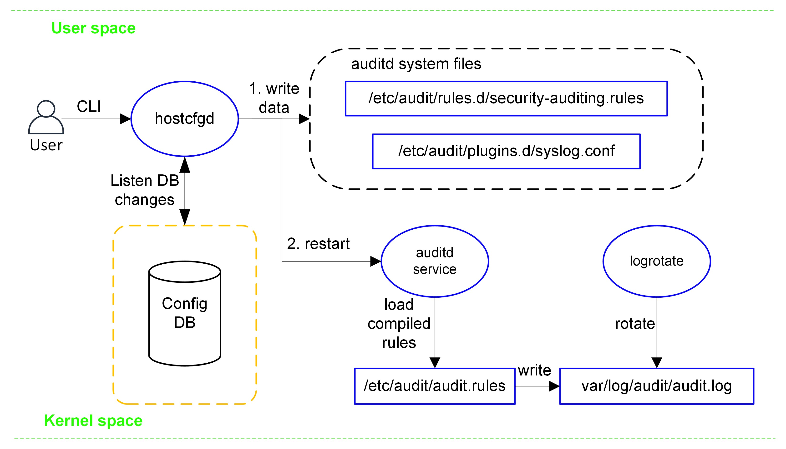
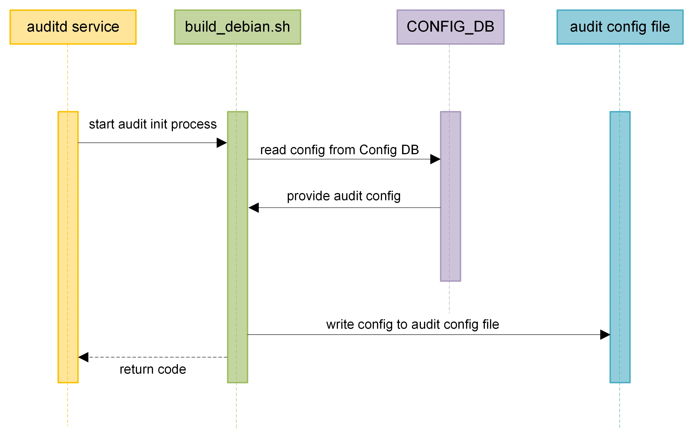
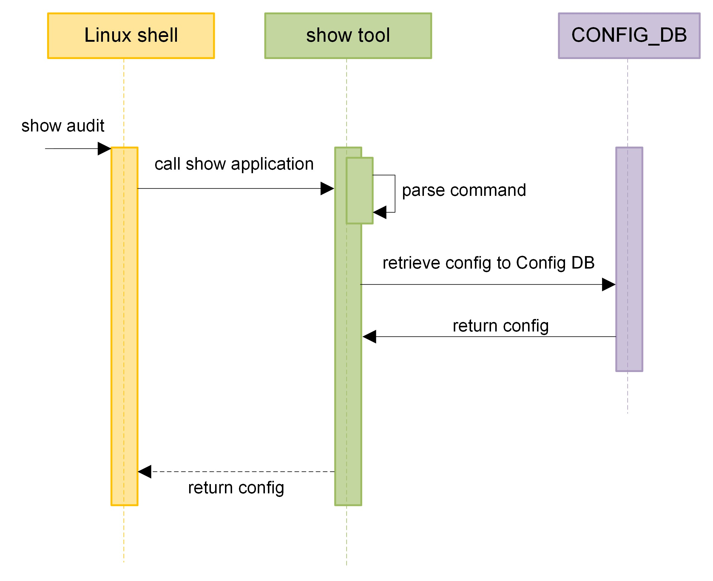

# SONiC Security Auditing

## Table of Content
- [SONiC Security Auditing](#sonic-security-auditing)
  - [Table of Content](#table-of-content)
  - [List of Tables](#list-of-tables)
  - [Revision](#revision)
  - [Scope](#scope)
  - [1. Overview](#1-overview)
  - [2. Current Architecture Design](#2-current-architecture-design)
  - [3. High-level Design](#3-high-level-design)
    - [3.1 Design](#31-design)
    - [3.2 Audit Rules Review](#32-audit-rules-review)
    - [3.3 Configuration design](#33-configuration-design)
      - [3.3.1 ConfigDB schema](#331-configdb-schema)
        - [3.3.1.1 AUDIT TABLE](#3311-audit-table)
        - [3.3.1.2 Config DB JSON Sample](#3312-config-db-json-sample)
        - [3.3.1.3 Redis Entries Sample](#3313-redis-entries-sample)
      - [3.3.2 YANG model](#332-yang-model)
      - [3.3.3 Flows](#333-flows)
        - [3.3.3.1 Audit Init Flow](#3331-audit-init-flow)
        - [3.3.3.2 Audit Config Flow](#3332-audit-config-flow)
        - [3.3.3.3 Audit Show Flow](#3333-audit-show-flow)
      - [3.3.4 CLI design](#334-cli-design)
      - [3.3.5 Logrotate](#335-logrotate)
    - [3.6 Warmboot and Fastboot Design Impact](#36-warmboot-and-fastboot-design-impact)
    - [3.7 Timeline](#37-timeline)
    - [3.8 Performance](#38-performance)
    - [3.9 Audit Rule Order](#39-audit-rule-order)
    - [3.10 Security Compliance](#310-security-compliance)
  - [4. Testing Requirements/Design](#4-testing-requirementsdesign)
    - [4.1 Unit Test cases](#41-unit-test-cases)
    - [4.2 System Test cases](#42-system-test-cases)
  - [5. Q\&A](#5-qa)
  - [6. Future Improvements](#6-future-improvements)

## List of Tables
* [Table 1: Revision](#table-1-revision)
* [Table 2: Audit Rules Review](#table-2-audit-rules-review)
* [Table 3: Unit Test Cases](#table-3-unit-test-cases)
* [Table 4: System Test Cases](#table-4-system-test-cases)

## Revision
###### Table 1: Revision
| Rev |     Date    |       Author       | Change Description                |
|:---:|:-----------:|:------------------:|-----------------------------------|
| 0.1 | 08/20/2024  | Mai Bui            | Initial version                   |

## Scope
This document describes the audit enhancement high-level design in SONiC. The scope of this document focuses on enhancing security auditing in SONiC by monitoring critical system aspects such as configuration changes, user activities, and key system files. This includes auditing files like /etc/passwd, network settings, system time changes, and Docker activities to detect unauthorized modifications.

## 1. Overview
This design aims to enhance the auditing capabilities within SONiC operating system using audit daemon (auditd). Auditing is the process of recording and analyzing the events that occur on the device. Auditing can help to detect unauthorized access, configuration changes, malicious activity, or system errors. Auditing can also provide evidence for forensic investigations, compliance audits, or incident response.

This document outlines the addition of several auditd rules to enhance the auditing capabilities on a SONiC device. These extra rules aim to provide thorough monitoring of important system activities, making the device more secure and better prepared for compliance and incident response.

## 2. Current Architecture Design
In SONiC, audit settings are centrally managed through a configuration file at `/etc/audit/auditd.conf`. Upon system startup, SONiC automatically compiles audit rules from the `/etc/audit/rules.d/` directory into a single file, `/etc/audit/audit.rules`, which auditd then loads. Here is a brief look at the relevant files:
- `/etc/audit/auditd.conf` - Main configuration file.
- `/etc/audit/audit.rules` - Loaded at startup, compiled from the individual rules in the rules.d directory.
- `/etc/audit/rules.d/` - Directory for individual rule files
  - `audisp-tacplus.rules`
  - `audit.rules`

## 3. High-level Design
### 3.1 Design
- The design is intended as a group-level control mechanism.
- A predefined set of rules (detailed in section 3.2) will be automatically enabled as the default configuration.
- Hardcoded default rules files will be stored under the `/usr/share/sonic/auditd/` directory.
  - The hardcoded default rule files include: `critical_files.rules`, `dns_changes.rules`, `time_changes.rules`, `shutdown_reboot.rules`, `cron_changes.rules`, `modules_changes.rules`, `auth_logs.rules`, `bin_changes.rules`, `user_group_management.rules`, `file_deletion.rules`, `log_changes.rules`, `docker_changes.rules`, `process_audit.rules`, `network_activity.rules`, `socket_activity.rules`.
  - Users will NOT have permission to modify these files.
- Users will have the ability to define custom rules for more fine-grained control, but this feature will be disabled by default.
  - An empty custom rules file, `custom_audit.rules`, will be provided under the `/usr/share/sonic/auditd/` directory.
  - Users will have permission to modify this file.
- Modify the `/etc/audit/plugins.d/syslog.conf` file by setting `active = yes` to enable the forwarding of auditd logs to a syslog server.
- ConfigDB schema design, new AUDIT table in Config DB
- YANG model
- CLI commands to enable or disable all rules, with support for group-level fine-grained control:
  - `show audit`
  - `config audit enable [OPTIONS] [--all | --group <group_name>]`
  - `config audit disable [OPTIONS] [--all | --group <group_name>]`
- Logrotate
- Audit rules ordering



###### Figure 1: Audit Proposed Architecture

### 3.2 Audit Rules Review
###### Table 2: Audit Rules Review
These rules will be included in the image and enabled by default.
| Rule name | Details |
|--------------------------|--------------------------|
| `critical_files`         | `-w /etc/passwd -p wa -k critical_files`<br>`-w /etc/shadow -p wa -k critical_files`<br>`-w /etc/group -p wa -k critical_files`<br>`-w /etc/sudoers -p wa -k critical_files`<br>`-w /etc/hosts -p wa -k critical_files` |
| `dns_changes`            | `-w /etc/resolv.conf -p wa -k dns_changes` |
| `time_changes`           | `-w /etc/localtime -p wa -k time_changes` |
| `shutdown_reboot`        | `-w /var/log/wtmp -p wa -k shutdown_reboot` |
| `cron_changes`           | `-w /etc/crontab -p wa -k cron_changes`<br>`-w /etc/cron.d -p wa -k cron_changes`<br>`-w /etc/cron.daily -p wa -k cron_changes`<br>`-w /etc/cron.hourly -p wa -k cron_changes`<br>`-w /etc/cron.weekly -p wa -k cron_changes`<br>`-w /etc/cron.monthly -p wa -k cron_changes` |
| `modules_changes`        | `-w /sbin/insmod -p x -k modules_changes`<br>`-w /sbin/rmmod -p x -k modules_changes`<br>`-w /sbin/modprobe -p x -k modules_changes` |
| `auth_logs`              | `-w /var/log/auth.log -p wa -k auth_logs` |
| `bin_changes`            | `-w /bin -p wa -k bin_changes`<br>`-w /sbin -p wa -k bin_changes`<br>`-w /usr/bin -p wa -k bin_changes`<br>`-w /usr/sbin -p wa -k bin_changes` |
| `user_group_management`  | `-a always,exit -F arch=b64 -S setuid,setresuid,setreuid,setfsuid,setgid,setresgid,setregid,setfsgid -F key=user_group_management`<br>`-a always,exit -F arch=b32 -S setuid,setresuid,setreuid,setfsuid,setgid,setresgid,setregid,setfsgid -F key=user_group_management` |
| `file_deletion`          | `-a exit,always -F arch=b64 -S unlink -S unlinkat -F key=file_deletion`<br>`-a exit,always -F arch=b32 -S unlink -S unlinkat -F key=file_deletion` |
| `log_changes`            | `-w /var/log -p wa -k log_changes` |
| `docker_changes`         | `-w /usr/bin/dockerd -p wa -k docker_changes`<br>`-w /etc/docker/daemon.json -p wa -k docker_changes`<br>`-w /lib/systemd/system/docker.service -p wa -k docker_changes`<br>`-w /lib/systemd/system/docker.socket -p wa -k docker_changes`<br>`-a always,exit -F arch=b64 -S execve -F path=/usr/bin/docker -k docker_changes`<br>`-w /var/lib/docker/ -p wa -k docker_changes`<br>`-a always,exit -F arch=b64 -S setuid,setgid,bind,connect -F comm="/usr/bin/docker" -k docker_changes` |
| `process_audit`          | `-a never,exit -F path=/usr/bin/docker  -F key=process_audit`<br>`-a never,exit -F path=/usr/bin/dockerd  -F key=process_audit`<br>`-a never,exit -F path=/usr/bin/containerd -F key=process_audit`<br>`-a never,exit -F path=/usr/bin/runc -F key=process_audit`<br>`-a never,exit -F path=/usr/bin/python* -F key=process_audit`<br>`-a exit,always -F arch=b64 -S execve -F key=process_audit`<br>`-a exit,always -F arch=b32 -S execve -F key=process_audit` |
| `network_activity`       | `-a exit,always -F arch=b64 -S connect,accept,sendto,recvfrom -F key=network_activity`<br>`-a exit,always -F arch=b32 -S connect,sendto,recvfrom -F key=network_activity` |
| `socket_activity`        | `-a always,exit -F arch=b64 -S socket -F key=socket_activity`<br>`-a always,exit -F arch=b32 -S socket -F key=socket_activity` |

Examples:
```
<14>May 10 21:18:38 STG01-0101-0111-14T1 audisp-syslog: type=SYSCALL msg=audit(1715375918.777:364628): arch=c000003e syscall=257 success=yes exit=6 a0=ffffff9c a1=565091e7cd40 a2=20902 a3=0 items=1 ppid=3076081 pid=3076082 auid=1003 uid=0 gid=0 euid=0 suid=0 fsuid=0 egid=0 sgid=0 fsgid=0 tty=(none) ses=5666 comm="usermod" exe="/usr/sbin/usermod" subj=unconfined key="passwd_changes" ARCH=x86_64 SYSCALL=openat AUID="anp_dcfx_rw1" UID="root" GID="root" EUID="root" SUID="root" FSUID="root" EGID="root" SGID="root" FSGID="root"

<14>May 10 20:51:01 STG01-0101-0111-14T1 audisp-syslog: type=SYSCALL msg=audit(1715374186.361:364290): arch=c000003e syscall=44 success=yes exit=78 a0=12 a1=563f55111260 a2=4e a3=4000 items=0 ppid=2392 pid=3714 auid=4294967295 uid=0 gid=0 euid=0 suid=0 fsuid=0 egid=0 sgid=0 fsgid=0 tty=pts0 ses=4294967295 comm="portsyncd" exe="/usr/bin/portsyncd" subj=unconfined key="network_activity" ARCH=x86_64 SYSCALL=sendto AUID="unset" UID="root" GID="root" EUID="root" SUID="root" FSUID="root" EGID="root" SGID="root" FSGID="root"

<14>May 10 20:36:45 STG01-0101-0111-14T1 audisp-syslog: type=CONFIG_CHANGE msg=audit(1715373405.824:340331): auid=1011 ses=5656 subj=unconfined op=add_rule key="dns_changes" list=4 res=1 AUID="maibui"

<14>May 10 20:43:04 STG01-0101-0111-14T1 audisp-syslog: type=SYSCALL msg=audit(1715373784.030:344761): arch=c000003e syscall=41 success=yes exit=7 a0=10 a1=3 a2=9 a3=1 items=0 ppid=3054883 pid=3060212 auid=1011 uid=1011 gid=0 euid=0 suid=0 fsuid=0 egid=0 sgid=0 fsgid=0 tty=pts0 ses=5656 comm="sudo" exe="/usr/bin/sudo" subj=unconfined key="socket_activity" ARCH=x86_64 SYSCALL=socket AUID="maibui" UID="maibui" GID="root" EUID="root" SUID="root" FSUID="root" EGID="root" SGID="root" FSGID="root"
```

### 3.3 Configuration design
#### 3.3.1 ConfigDB schema
##### 3.3.1.1 AUDIT TABLE
The database to be used is Config DB. A new AUDIT table will be added to the Config DB, which is responsible for storing audit configuration settings. This table allows the system to manage security auditing by defining whether auditing is enabled and specifying the rules to be applied. The structure of the AUDIT table is as follows.
```
; Defines audit configuration information
key                          = AUDIT|config                 ; Audit configuration settings
; field                      = value
groupid                      = 1*255VCHAR                   ; Name of the audit rule group
groupvalue                   = enable / disable           ; Indicates whether the entire audit rule group is enabled or disabled
```

##### 3.3.1.2 Config DB JSON Sample
The predefined list of rules in Section 3.2 will be **enabled** by default, while the custom user-defined group will be **disabled** by default. Below is an example of how the audit rules could be represented in JSON format within the Config DB.
```
{
    "AUDIT": {
        "config": {
            "critical_files": "enable",
            "dns_changes": "enable",
            "time_changes": "enable",
            "shutdown_reboot": "enable",
            "cron_changes": "enable",
            "modules_changes": "enable",
            "auth_logs": "enable",
            "bin_changes": "enable",
            "user_group_management": "enable",
            "file_deletion": "enable",
            "log_changes": "enable",
            "docker_changes": "enable",
            "process_audit": "enable",
            "network_activity": "enable",
            "socket_activity": "enable",
            "custom_audit": "disable"
        }
    }
}
```

##### 3.3.1.3 Redis Entries Sample
Once the AUDIT table is populated in the Config DB, the corresponding entries can be viewed in Redis. Below are complete example Redis commands and outputs
```
127.0.0.1:6379[4]> keys AUDIT|config
1) "AUDIT|config"

127.0.0.1:6379[4]> hgetall AUDIT|config
1) "critical_files"
2) "enable"
3) "dns_changes"
4) "enable"
5) "time_changes"
6) "enable"
7) "shutdown_reboot"
8) "enable"
9) "cron_changes"
10) "enable"
11) "modules_changes"
12) "enable"
13) "auth_logs"
14) "enable"
15) "bin_changes"
16) "enable"
17) "user_group_management"
18) "enable"
19) "file_deletion"
20) "enable"
21) "log_changes"
22) "enable"
23) "docker_changes"
24) "enable"
25) "process_audit"
26) "enable"
27) "network_activity"
28) "enable"
29) "socket_activity"
30) "enable"
31) "custom_audit"
32) "disable"
```

#### 3.3.2 YANG model
New YANG model `sonic-audit.yang` will be added.
```
module sonic-audit {

    yang-version 1.1;

    namespace "http://github.com/sonic-net/sonic-audit";

    prefix sonic-audit;

    import sonic-types {
        prefix stypes;
    }

    description "AUDIT YANG Module for SONiC OS";

    revision 2024-08-12 {
        description "First Revision";
    }

    container sonic-audit {

        container AUDIT {

            description "AUDIT part of config_db";

            list config {
                key "groupid";
                description "List of audit rules";

                leaf groupid {
                    type string {
                        length "1..255";
                    }
                    description "Name of the audit rule group";
                }

                leaf groupvalue {
                    type enumeration {
                        enum "enable" {
                            description "Audit rule is enabled.";
                        }
                        enum "disable" {
                            description "Audit rule is disabled.";
                        }
                    }
                    description "Status of the audit rule group (enable or disable).";
                }
            }
            /* end of list config */
        }
        /* end of container AUDIT */
    }
    /* end of top level container */
}
/* end of module sonic-audit */
```

#### 3.3.3 Flows
##### 3.3.3.1 Audit Init Flow


###### Figure 2: Audit Init Flow

##### 3.3.3.2 Audit Config Flow


###### Figure 3: Audit Config Flow

**Hardcoded default rule group**
Hardcoded default rules files will be stored under the `/usr/share/sonic/auditd/` directory.

The hardcoded default rule files include: `critical_files.rules`, `dns_changes.rules`, `time_changes.rules`, `shutdown_reboot.rules`, `cron_changes.rules`, `modules_changes.rules`, `auth_logs.rules`, `bin_changes.rules`, `user_group_management.rules`, `file_deletion.rules`, `log_changes.rules`, `docker_changes.rules`, `process_audit.rules`, `network_activity.rules`, `socket_activity.rules`.
  
Users will NOT have permission to modify these files.

To enable, users may simply use `sudo config audit enable --group <group-name>`. hostcfgd will copy rule file from `/usr/share/sonic/auditd/` to `/etc/audit/rules.d/` and restart auditd service.

To disable, users may simply use `sudo config audit disable --group <group-name>`. hostcfgd will remove rule file from `/etc/audit/rules.d/` and restart auditd service.

**User-defined custom rule group**
User-defined custom rule files will be stored under the `/usr/share/sonic/auditd/` directory, named `custom_audit.rules`
  
Users will have permission to modify this custom file.

To enable, users may 1) modify `custom_audit.rules` file and 2) execute `sudo config audit enable --group custom_audit`. click CLI will validate input in `custom_audit.rules` file. hostcfgd will copy `custom_audit.rules` file from `/usr/share/sonic/auditd/` to `/etc/audit/rules.d/` and restart auditd service.

To disable, users may 1) empty/remove `custom_audit.rules` file and 2) execute `sudo config audit disable --group custom_audit`. click CLI will validate input in `custom_audit.rules` file. hostcfgd will remove `custom_audit.rules` file from `/etc/audit/rules.d/` and restart auditd service.

##### 3.3.3.3 Audit Show Flow


###### Figure 4: Audit Show Flow

#### 3.3.4 CLI design
**show command**
- `show audit` - show all audit current active rules, including security auditing rules and tacplus accounting rules.
  ```
  admin@vlab-01:~$ show audit
  List of current .rules files in /etc/audit/rules.d/ directory
  audisp-tacplus.rules
  audit.rules
  socket_activity.rules
  file_deletion.rules

  List of all current active audit rules
  -a always,exit -F arch=b32 -S exit,execve,exit_group -F auid>1000 -F auid!=-1 -F key=tacplus
  -a always,exit -F arch=b64 -S execve,exit,exit_group -F auid>1000 -F auid!=-1 -F key=tacplus
  -a always,exit -F arch=b64 -S socket -F key=socket_activity
  -a always,exit -F arch=b32 -S socket -F key=socket_activity
  -a exit,always -F arch=b64 -S unlink -S unlinkat -F key=file_deletion
  -a exit,always -F arch=b32 -S unlink -S unlinkat -F key=file_deletion
  -a always,exclude -F msgtype=CRED_ACQ
  -a always,exclude -F msgtype=CRED_DISP
  -a always,exclude -F msgtype=CRED_REFR
  -a always,exclude -F msgtype=CWD
  -a always,exclude -F msgtype=LOGIN
  -a always,exclude -F msgtype=PATH
  -a always,exclude -F msgtype=PROCTITLE
  -a always,exclude -F msgtype=SERVICE_START
  -a always,exclude -F msgtype=SERVICE_STOP
  -a always,exclude -F msgtype=USER_ACCT
  -a always,exclude -F msgtype=USER_AUTH
  -a always,exclude -F msgtype=USER_CMD
  -a always,exclude -F msgtype=USER_END
  -a always,exclude -F msgtype=USER_START
  ```
  
  If security auditing is disabled, `show audit` will only show tacplus accounting rule.
  ```
  admin@sonic:~$ show audit
  admin@vlab-01:~$ show audit
  List of current .rules files in /etc/audit/rules.d/ directory
  audisp-tacplus.rules
  audit.rules

  List of all current active audit rules
  -a always,exit -F arch=b32 -S exit,execve,exit_group -F auid>1000 -F auid!=-1 -F key=tacplus
  -a always,exit -F arch=b64 -S execve,exit,exit_group -F auid>1000 -F auid!=-1 -F key=tacplus
  -a always,exclude -F msgtype=CRED_ACQ
  -a always,exclude -F msgtype=CRED_DISP
  -a always,exclude -F msgtype=CRED_REFR
  -a always,exclude -F msgtype=CWD
  -a always,exclude -F msgtype=LOGIN
  -a always,exclude -F msgtype=PATH
  -a always,exclude -F msgtype=PROCTITLE
  -a always,exclude -F msgtype=SERVICE_START
  -a always,exclude -F msgtype=SERVICE_STOP
  -a always,exclude -F msgtype=USER_ACCT
  -a always,exclude -F msgtype=USER_AUTH
  -a always,exclude -F msgtype=USER_CMD
  -a always,exclude -F msgtype=USER_END
  -a always,exclude -F msgtype=USER_START
  ```

**config command enable/disable**
- Usage
  ```
  config audit enable [OPTIONS] [--all | --group <group_name>]
  config audit disable [OPTIONS] [--all | --group <group_name>]
  ```

- `config audit enable --all` - This command enables all predefined security audit rule groups.
  ```
  admin@sonic:~$ config audit enable --all
  Default security auditing is enabled.
  ```

- `config audit disable --all` - This command disables or removes all predefined security audit rule groups.
  ```
  admin@sonic:~$ config audit disable --all
  Default security auditing is disabled.
  ```

- `config audit enable --group <group-name>` - This command enables a specific security audit rule group identified by `<group-name>`. For instance, enabling the network_activity group will monitor and log all network-related activities.
  ```
  admin@sonic:~$ config audit enable --group "network_activity"
  network_activity auditing is enabled.
  ```

- `config audit disable --group <group-name>` - This command disables a specific security audit rule group identified by `<group-name>`. The selected group will stop logging the associated activities.
  ```
  admin@sonic:~$ config audit disable --group "network_activity"
  network_activity auditing is disabled.
  ```
 
#### 3.3.5 Logrotate
The following settings in the `/etc/logrotate.d/audit` file set up log rotation for audit logs:
```
/var/log/audit/audit.log {
    rotate 30
    daily
    compress
    delaycompress
    notifempty
    missingok
    postrotate
        /etc/init.d/auditd restart
    endscript
}
```

This will:
- Rotate the logs daily (`daily`).
- Keep 30 days' worth of logs (`rotate 30`).
- Compress the logs after rotation (`compress`).
- Delay the compression of the most recent rotated log until the next rotation cycle (`delaycompress`).
- Skip rotation if the log file is empty (`notifempty`).
- Continue rotation without reporting an error if the log file is missing (`missingok`).
- Restart the auditd service after rotating the logs (`postrotate /etc/init.d/auditd restart endscript`).

### 3.6 Warmboot and Fastboot Design Impact
auditd will be stopped and then restarted as part of the reboot process, resulting in a gap in audit logs

### 3.7 Timeline
- Phase 1
  - Critical files changes
  - DNS changes
  - Time changes
  - Shutdown reboot
  - Cron changes
  - Modules
  - auth.log changes
  - Monitor binary directories
- Phase 2
  - User group management
  - File deletion
  - Log changes
  - Docker related
  - Process audit
  - Network activity
  - Socket activity

### 3.8 Performance
Tested device specs
- SONiC Software Version: SONiC.20230531.22
- Platform: x86_64-arista_7260cx3_64
- HwSKU: Arista-7260CX3-C64

Monitor memory and CPU utilization for auditd and kauditd processes over an hour
| Rule name | Tested Device |
|-----------|---------------|
| %CPU      | 1.0% - 2.0%   |
| %MEM      | 0.0% - 0.1%   |

Number of logs per key
| Audit Key | Count By Key |
|-----------|---------------|
| network_activity | 72021|
| socket_activity | 3312 |
| user_group_management | 801 |
| process_audit | 729 |
| file_deletion | 529 |
| tacplus | 259 |
| log_changes | 199 |
| docker_storage | 156 |
| cron_changes | 6 |
| shutdown_reboot | 4 |
| modules | 3 |
| auth_logs | 1 |
| bin_changes | 1 |
| time_changes | 1 |
| dns_changes | 1 |
| sbin_changes | 1 |
| usr_bin_changes | 1 |
| usr_sbin_changes | 1 |
| docker_socket | 1 |
| docker_commands | 1 |
| docker_service | 1 |
| hosts_changes | 1 |
| sudoers_changes | 1 |
| docker_config | 1 |
| docker_daemon | 1 |

Processes in network_activity key
| Process | Count By Process |
|-----------|---------------|
| /usr/sbin/audisp-syslog | 41896 |
| /usr/sbin/rsyslogd | 11145 |
| /usr/sbin/snmpd | 8000 |
| /usr/bin/python3.9 | 7313 |
| /usr/bin/vtysh | 809 |
| /usr/bin/redis-check-rdb | 485 |
| /usr/bin/docker | 354 |
| /usr/bin/teamd | 322 |
| /usr/sbin/lldpd | 307 |
| /usr/sbin/audisp-tacplus | 276 |
| /usr/bin/sudo | 190 |
| /usr/sbin/sshd | 174 |
| /usr/bin/eventd | 166 |
| /usr/bin/bash | 116 |
| /bin/bash | 114 |
| /usr/sbin/auditctl| 68 |
| /usr/sbin/lldpcli | 55 |
| /usr/lib/frr/bgpd | 44 |
| /usr/sbin/ntpd | 37 |
| /usr/lib/frr/zebra | 35 |
| /usr/bin/monit | 35 |
| /usr/lib/frr/staticd | 29 |
| /usr/sbin/cron | 19 |
| /usr/bin/systemctl | 15 |
| /usr/bin/rsyslog_plugin | 12 |
| /usr/sbin/usermod | 2 |
| /usr/bin/syncd | 2 |

### 3.9 Audit Rule Order
For best performance, it is recommended that the events that occur the most should be at the top and the exclusions should be at the bottom on the list. 

### 3.10 Security Compliance
The new rules will be assessed with the security team to ensure compliance.

## 4. Testing Requirements/Design
### 4.1 Unit Test cases
###### Table 3: Unit Test cases
| Test case | Description                 |
| --------- | --------------------------- |
| 1         | Unit Test for config audit enable  |
| 2         | Unit Test for config audit disable |
| 3         | Unit Test for show audit           |

### 4.2 System Test cases
###### Table 4: System Test cases
| Test case | Description                 |
| --------- | --------------------------- |
| 1         | System Test for config audit enable test |
| 2         | System Test for config audit disable test |
| 3         | System Test for log test - verify that audit accurately send logs to syslog server. |
| 4         | System Test for performance test |
| 5         | System Test for audit rule ordering test for default rules |

## 5. Q&A
1. Q: Who can enable/disable the security auditing feature?
   A: Only privileged users with sudo or root-level access can enable/disable the security auditing feature in SONiC.
2. Q: What if an attacker disables the audit daemon using the config audit disable command and then performs malicious activities, leaving no logs?
   A: The config audit disable command is intended as an enablement feature, allowing users to disable security auditing when needed, such as for performance optimization. However, only users with sudo or root-level access should have the ability to execute this command to prevent misuse.

## 6. Future Improvements
1. Support most recent 5-10 change history list? Like who and when made the changes?
2. Support only trusted user can manage the security auditing feature
