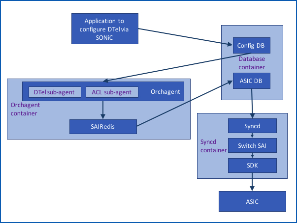
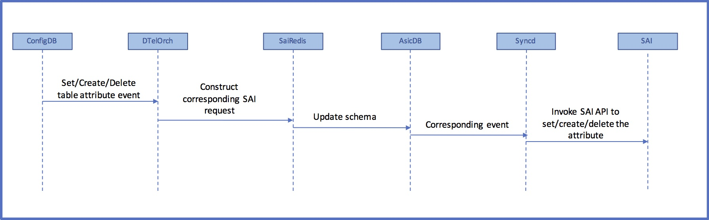
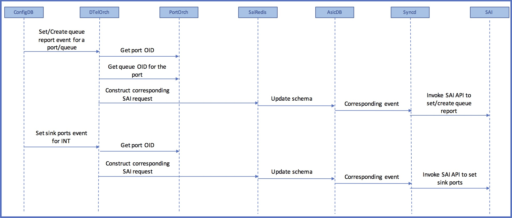
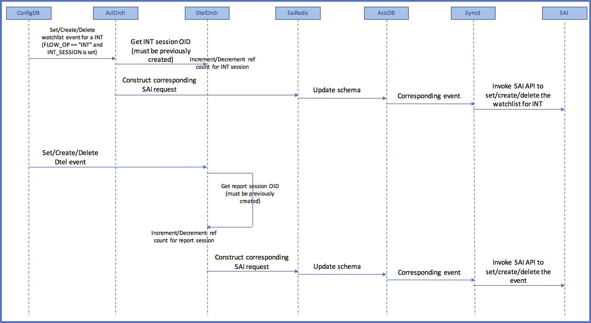

# Dataplane Telemetry in SONiC 
# High Level Design
Revision 0.2

# About this Manual
This document provides general information on the implementation of the Dataplane Telemetry (DTel) feature in SONiC.

# Scope
This document describes the high level design of the Dataplane Telemetry feature in SONiC.

# Definitions/Abbreviation

Definitions/Abbreviation  | Description
------------------------- | -------------
DTEL / DTel	             | Dataplane Telemetry
ACL                       | Access Control List
SAI                       | Switch Abstraction Interface
INT                       | In-band Network Telemetry
DSCP							| Differentiated Services Code Point
OID								| Object IDentifier
PTF			  | Packet Test Framework

# Sub-system Overview 
For more information on Dataplane Telemetry, please refer to 
[Dataplane Telemetry SAI API](https://github.com/opencomputeproject/SAI/blob/master/doc/DTEL/SAI-Proposal-Data-Plane-Telemetry.md).

The following figure depicts the overall architecture of SONiC and where Dataplane Telemetry components fit in:



__Figure 1: Dataplane Telemetry in SONiC__. 


Components of SONiC that will be modified or newly added are discussed in the following sub-sections.

## Config DB 
### New tables in Config DB for Dataplane Telemetry configuration

Table name				     | Description
----------------------------| -------------
DTEL	               | Switch-wide DTel configuration parameters
DTEL\_REPORT\_SESSION| DTel report session specific configuration
DTEL\_INT\_SESSION   | In-band Network Telemetry session specific configuration
DTEL\_QUEUE\_REPORT  | DTel Queue report related configuration
DTEL\_EVENT          | Configuration specific to DTel events that trigger reports 

Please refer to 
[Dataplane Telemetry SAI API](https://github.com/opencomputeproject/SAI/blob/master/doc/DTEL/SAI-Proposal-Data-Plane-Telemetry.md) for more information on the above terminology

#### Schema for DTEL

```
; Switch global Dataplane telemetry configuration
; SAI mapping - saidtel.h

key                     = "DTEL|SWITCH_ID"
;field                  = value
SWITCH_ID               = 1*DIGIT

key                     = "DTEL|FLOW_STATE_CLEAR_CYCLE"
;field                  = value
FLOW_STATE_CLEAR_CYCLE  = 1*DIGIT

key                     = "DTEL|LATENCY_SENSITIVITY"
;field                  = value
LATENCY_SENSITIVITY     = 1*DIGIT

key                     = "DTEL|SINK_PORT_LIST"
;field                  = value
ifName                  = ifName

key                     = "DTEL|INT_ENDPOINT"
;field                  = value
INT_ENDPOINT            = "TRUE" / "FALSE"

key                     = "DTEL|POSTCARD"
;field                  = value
POSTCARD                = "TRUE" / "FALSE"

key                     = "DTEL|DROP_REPORT"
;field                  = value
DROP_REPORT             = "TRUE" / "FALSE"

key                     = "DTEL|QUEUE_REPORT"
;field                  = value
QUEUE_REPORT            = "TRUE" / "FALSE"

key                     = "DTEL|INT_L4_DSCP"
;field                  = value
INT_L4_DSCP_VALUE       = 1*DIGIT
INT_L4_DSCP_MASK        = 1*DIGIT
```

Example configuration using redis-cli

    HSET DTEL|SWITCH_ID SWITCH_ID "1"
    HSET DTEL|FLOW_STATE_CLEAR_CYCLE FLOW_STATE_CLEAR_CYCLE "10"
    HSET DTEL|LATENCY_SENSITIVITY LATENCY_SENSITIVITY "100"
    HMSET DTEL|SINK_PORT_LIST Ethernet8 "Ethernet8" Ethernet76 "Ethernet76" Ethernet84 "Ethernet84"
    HSET DTEL|INT_ENDPOINT INT_ENDPOINT "TRUE"
    HSET DTEL|INT_TRANSIT INT_TRANSIT "TRUE"
    HSET DTEL|POSTCARD POSTCARD "TRUE"
    HSET DTEL|DROP_REPORT DROP_REPORT "TRUE"
    HSET DTEL|QUEUE_REPORT QUEUE_REPORT "TRUE"
    HMSET DTEL|INT_L4_DSCP INT_L4_DSCP_VALUE "128" INT_L4_DSCP_MASK "255"
    
#### Schema for DTEL\_REPORT\_SESSION

```
; Dataplane telemetry report session configuration
; SAI mapping - saidtel.h

key                     = DTEL_REPORT_SESSION|report-session-name ; report-session-name is a 
                                                                  ; unique string representing 
                                                                  ; a report session
;field                  = value
SRC_IP                  = ipv4_addr   ;IP address
DST_IP_LIST             = 1*ipv4_addr ;IP addresses separated by semi-colon
VRF                     = 1*255VCHAR  ;Currently, only default VRF is supported
TRUNCATE_SIZE           = 1*DIGIT
UDP_DEST_PORT           = 1*DIGIT

;value annotations
ipv4_prefix = dec-octet "." dec-octet "." dec-octet "." dec-octet 
dec-octet   = DIGIT                     ; 0-9
                / %x31-39 DIGIT         ; 10-99
                / "1" 2DIGIT            ; 100-199
                / "2" %x30-34 DIGIT     ; 200-249
		/ "25" %x30-35          ; 250-255
```
Example configuration using redis-cli

    HMSET DTEL_REPORT_SESSION|RS-1 SRC_IP 10.10.10.1 DST_IP_LIST 20.20.20.1;20.20.20.2;20.20.20.3 VRF default TRUNCATE_SIZE 256 UDP_DEST_PORT 2000

#### Schema for DTEL\_INT\_SESSION
```
; Dataplane telemetry INT session configuration
; SAI mapping - saidtel.h

key                         = DTEL_INT_SESSION|INT-session-name ; INT-session-name is a 
                                                                ; unique string representing 
                                                                ; a INT session
;field                      = value
MAX_HOP_COUNT               = 1*DIGIT
COLLECT_SWITCH_ID           = "TRUE" / "FALSE"
COLLECT_INGRESS_TIMESTAMP   = "TRUE" / "FALSE"
COLLECT_EGRESS_TIMESTAMP    = "TRUE" / "FALSE"
COLLECT_SWITCH_PORTS        = "TRUE" / "FALSE"
COLLECT_QUEUE_INFO          = "TRUE" / "FALSE"
```
Example configuration using redis-cli

    HMSET DTEL_INT_SESSION|INT-1 MAX_HOP_COUNT 50 COLLECT_SWITCH_ID TRUE COLLECT_INGRESS_TIMESTAMP TRUE COLLECT_EGRESS_TIMESTAMP TRUE COLLECT_SWITCH_PORTS TRUE COLLECT_QUEUE_INFO TRUE

#### Schema for DTEL\_QUEUE\_REPORT
```
; Dataplane telemetry queue report configuration
; SAI mapping - saidtel.h

key                         = DTEL_QUEUE_REPORT|ifName|qnum  ; ifname is the name of the interface
;field                      = value
QUEUE_DEPTH_THRESHOLD       = 1*DIGIT
QUEUE_LATENCY_THRESHOLD     = 1*DIGIT
THRESHOLD_BREACH_QUOTA      = 1*DIGIT
REPORT_TAIL_DROP            = "TRUE" / "FALSE"

;value annotations
qnum = 1*DIGIT ; number between 0 and MAX_QUEUES_PER_PORT for the platform
```
Example configuration using redis-cli

    HMSET DTEL_QUEUE_REPORT|Ethernet8|0 QUEUE_DEPTH_THRESHOLD 1000 QUEUE_LATENCY_THRESHOLD 2000 THRESHOLD_BREACH_QUOTA 3000 REPORT_TAIL_DROP TRUE
    
#### Schema for DTEL\_EVENT
```
; Dataplane telemetry event related configuration
; SAI mapping - saidtel.h

key                         = "DTEL_EVENT|EVENT_TYPE_FLOW_STATE"
;field                      = value
EVENT_REPORT_SESSION        = 1*255VCHAR ; previously configured report-session-name
EVENT_DSCP_VALUE            = 1*DIGIT

key                         = "DTEL_EVENT|EVENT_TYPE_FLOW_REPORT_ALL_PACKETS"
;field                      = value
EVENT_REPORT_SESSION        = 1*255VCHAR ; previously configured report-session-name
EVENT_DSCP_VALUE            = 1*DIGIT

key                         = "DTEL_EVENT|EVENT_TYPE_FLOW_TCPFLAG"
;field                      = value
EVENT_REPORT_SESSION        = 1*255VCHAR ; previously configured report-session-name
EVENT_DSCP_VALUE            = 1*DIGIT

key                         = "DTEL_EVENT|EVENT_TYPE_QUEUE_REPORT_THRESHOLD_BREACH"
;field                      = value
EVENT_REPORT_SESSION        = 1*255VCHAR ; previously configured report-session-name
EVENT_DSCP_VALUE            = 1*DIGIT

key                         = "DTEL_EVENT|EVENT_TYPE_QUEUE_REPORT_TAIL_DROP"
;field                      = value
EVENT_REPORT_SESSION        = 1*255VCHAR ; previously configured report-session-name
EVENT_DSCP_VALUE            = 1*DIGIT

key                         = "DTEL_EVENT|EVENT_TYPE_DROP_REPORT"
;field                      = value
EVENT_REPORT_SESSION        = 1*255VCHAR ; previously configured report-session-name
EVENT_DSCP_VALUE            = 1*DIGIT
```

Example configuration using redis-cli

    HMSET DTEL_EVENT|EVENT_TYPE_FLOW_STATE EVENT_REPORT_SESSION RS-1 EVENT_DSCP_VALUE 65
    HMSET DTEL_EVENT|EVENT_TYPE_FLOW_REPORT_ALL_PACKETS EVENT_REPORT_SESSION RS-1 EVENT_DSCP_VALUE 64
    HMSET DTEL_EVENT|EVENT_TYPE_FLOW_TCPFLAG EVENT_REPORT_SESSION RS-1 EVENT_DSCP_VALUE 63
    HMSET DTEL_EVENT|EVENT_TYPE_QUEUE_REPORT_THRESHOLD_BREACH EVENT_REPORT_SESSION RS-1 EVENT_DSCP_VALUE 62
    HMSET DTEL_EVENT|EVENT_TYPE_QUEUE_REPORT_TAIL_DROP EVENT_REPORT_SESSION RS-1 EVENT_DSCP_VALUE 61
    HMSET DTEL_EVENT|EVENT_TYPE_DROP_REPORT EVENT_REPORT_SESSION RS-1 EVENT_DSCP_VALUE 60
    
#### Changes to ACL\_TABLE for DTel watchlist support
Two new ACL table types are introduced to support DTel watchlists:

    ACL_TABLE_DTEL_FLOW_WATCHLIST
    ACL_TABLE_DTEL_DROP_WATCHLIST
    
The names of these tables are:

    DTEL_FLOW_WATCHLIST
    DTEL_DROP_WATCHLIST
    

#### Changes to ACL\_RULE\_TABLE for DTel watchlist support
New match fields and actions are introduced to support DTel watchlists.

**Only incremental changes are shown here. Please refer to ACL_RULE table schema for other fields**

```
; Dataplane telemetry watchlist related config 
; SAI mapping - saiacl.h

key                         = ACL_RULE:table_name:rule_name   ; rule_name is a unique string.
;field                      = value
TUNNEL_VNI                  = 1*6HEXDIG ; VXLAN Network Identifier
INNER_ETHER_TYPE            = 1*4HEXDIG ; Ethernet type field of the inner header
INNER_IP_PROTOCOL           = 1*2HEXDIG ; IP protocol type of the inner header
INNER_L4_SRC_PORT           = 1*5DIGIT  ; a number between 0 and 65535
INNER_L4_DST_PORT           = 1*5DIGIT  ; a number between 0 and 65535
FLOW_OP                     = "NOP" / "POSTCARD" / "INT" / "IOAM" ; Applicable only when 
                                                                  ; table name is DTEL_FLOW_WATCHLIST
INT_SESSION                 = 1*255VCHAR ; previously configured INT-session-name
                                         ; Applicable only when FLOW_OP = INT or IOAM
DROP_REPORT_ENABLE          = "TRUE" / "FALSE" ; Applicable only when table name is DTEL_DROP_WATCHLIST
                                               ; Note: FLOW_OP is not set when this is set
REPORT_TAIL_DROPS           = "TRUE" / "FALSE" ; Applicable only when table name is DTEL_DROP_WATCHLIST
                                               ; and DROP_REPORT_ENABLE = "TRUE"
FLOW_SAMPLE_PERCENT         = 1*DIGIT ; number between 0 to 100
                                      ; Applicable only when FLOW_OP = INT or IOAM or POSTCARD
REPORT_ALL_PACKETS          = "TRUE" / "FALSE" ; Applicable only when FLOW_OP = INT or IOAM or POSTCARD

;value annotations
table_name  =  "DTEL_FLOW_WATCHLIST" / "DTEL_DROP_WATCHLIST" ; 

```

Example configuration using redis-cli

    HMSET ACL_RULE|DTEL_FLOW_WATCHLIST|FW-1 PRIORITY 10 SRC_IP 10.1.1.1 DST_IP 20.1.1.1 L4_SRC_PORT 1000 L4_DST_PORT 2000 INNER_ETHER_TYPE 55 INNER_L4_SRC_PORT 3000 INNER_L4_DST_PORT 4000 FLOW_OP POSTCARD FLOW_SAMPLE_PERCENT 80 REPORT_ALL_PACKETS TRUE
    HMSET ACL_RULE|DTEL_FLOW_WATCHLIST|FW-2 PRIORITY 10 INT_SESSION INT-1 FLOW_OP INT
    HSET ACL_RULE|DTEL_DROP_WATCHLIST|DW-1 PRIORITY 10 L4_DST_PORT 2000 DROP_REPORT_ENABLE TRUE
    

## DTel orchagent

This is a new Orch agent added to handle DTel events. These events are demuxed based on the ConfigDB table name.

Events handled by DtelOrch agent:

    * Set event
    * Delete event

Most events are handled as shown in the sequence diagram below. Ones which are different are depicted in the following figures.



__Figure 2: Generic control flow for DTel events__. 

Configuring INT sink ports and queue reports requires looking up port OIDs for the interfaces involved. Note that these configurations are currently only applicable to physical ports. If the port object is not initialized yet, DTelOrch agent will set up a callback to receive a notification on port init and perform a deferred config application.



__Figure 3: Control flow for DTel events that depend on other Orch agents__. 


### Ref-counted DTel objects

* INT sessions referenced by INT watchlists
* Report sessions referenced by DTel events

DTel event object creation mandates that the required report-session object is already created. Similarly, INT flow watchlist creation mandates that the required INT session object is already created. When DTel orchagent is restarted and all the ConfigDB events are played back, dependent events played out of order are inherently ordered by the orchagent. This is done by not processing the dependent event until all the pre-requisite events have been processed.

Reference counting is used to control the deletion of report session and INT session objects. When the object is created, initial reference count of these objects are set to 1. Each time a new object reference is added, the count is incremented by 1. When a delete event is received, or when a reference is removed, the count is decremented by 1. The object will be deleted only if the count reaches zero.




__Figure 4: Control flow for DTel events corresponding to ref-counted objects__. 

  
### State maintained by DTelOrch agent

**INT session hashmap**

* Key: INT session id
* Value: 
	* INT session OID
	* Reference count

**Report session hashmap**

* Key: Report session ID
* Value: 
	* Report session OID
	* Reference count

**Port hashmap (ports with atleast one queue on which reporting in enabled)**

* Key: ifName
* Value: 
	* queue list (all queues for a given port on which reporting is enabled)
		* Key: queue id
		* Value:
			* queue report OID

**Event list**

* Key: Event name
* Value:
	* Event OID
		* Report session ID (reference to the Report session)
		
## Acl orchagent
AclOrch agent will be modified to process the new match fields and actions. 
New sub-classes to AclRule will be added:

* AclRuleDTelDropWatchList
* AclRuleDTelFlowWatchList

AclRule objects of the above types are created if ACL table corresponding to the configured rule matches one of:

* ACL_TABLE_DTEL_FLOW_WATCHLIST 
* ACL_TABLE_DTEL_DROP_WATCHLIST

## Minimum configuration
Following is the minimum configuration for each DTel feature to detect intended events and generate reports:

**DTel general:**
1. Switch id
2. Report session with at least source IP, one destination IP and UDP destination port set

**INT specific:**
1. INT L4 DSCP: value and mask
2. At least one INT session (with at least max-hop count set)
3. At least one flow watchlist with flow-op = INT
4. At least one sink port

**Postcard specific:**
1. At least one flow watchlist with flow-op = POSTCARD

**Drop report specific:**
1. At least one drop watchlist with drop report enabled

**Queue report specific:**
1. Reporting enabled on at least one queue with some threshold (latency or depth) set or tail drop enabled.

## Application to configure DTel via SONiC
Since currently there is no SONiC CLI, users can configure DTel by interacting with ConfigDB. This can be done either directly, through the Redis CLI, or through the use of configuration tools, such as the [Python SwSS SDK](https://github.com/Azure/sonic-py-swsssdk).

## euclid

euclid (Euclid Universal Configuration LIbrary for Dataplane telemetry)
is a Python module for configuring telemetry on a switch. Using euclid,
users can write short Python scripts and easily configure one or more switches.

euclid is composed of two submodules.
The first one is dtel, and it abstracts telemetry on a switch to a set of classes.
One of these is the Switch class, which contains switch-wide attributes,
such as telemetry type (INT Endpoint, INT Transit, Postcard),
latency sensitivity, switch ID, etc. After instantiating a switch,
a user can create related objects such as a report session,
a watchlist or an INT session.

The sonic submodule of euclid takes all classes in the dtel submodule
and extends them to contain all SONiC specific aspects of telemetry configuration.
Upon instantiating a SONiCSwitch (which is a subclass of Switch),
the previous telemetry configuration is wiped (by default),
and the switch is re-configured from scratch. euclid connects
to the database container on the switch,
and manipulates ConfigDB by adding, modifying, and deleting keys and values.

All parameters are implemented as Python properties,
so their values are set with simple assignment.
In a typical workflow, a user would start by instantiating a switch:

```python
my_switch = sonic_switch.SONiCSwitch(dtel_switch_id=’123’,
                                     management_ip=’10.10.10.10’,
                                     dtel_monitoring_type='postcard')
```

Then create a report session:

```python
rs = my_switch.create_dtel_report_session(‘192.168.0.1’)
```

Create a watchlist:

```python
wl = my_switch.create_dtel_watchlist('flow')
```

Add entries to the watchlist:

```python
wl.create_entry(priority=10,
                src_ip='10.131.0.0',
                src_ip_mask=11,
                dst_ip='10.131.0.0',
                dst_ip_mask=11,
                dtel_sample_percent=100,
                dtel_report_all=True)
```

etc.

To use euclid, users have to just import the module in their python script.
Our tests for DTel make use of euclid, and more examples can be found there.

Sample configuration in config_db.json after "config save":

```
    "DTEL": {
        "FLOW_STATE_CLEAR_CYCLE": {
            "FLOW_STATE_CLEAR_CYCLE": "0"
        },
        "SINK_PORT_LIST": {
            "Ethernet2": "Ethernet2",
            "Ethernet0": "Ethernet0",
            "Ethernet1": "Ethernet1"
        },
        "INT_ENDPOINT": {
            "INT_ENDPOINT": "TRUE"
        },
        "INT_L4_DSCP": {
            "INT_L4_DSCP_MASK": "1",
            "INT_L4_DSCP_VALUE": "1"
        },
        "SWITCH_ID": {
            "SWITCH_ID": "1"
        },
        "LATENCY_SENSITIVITY": {
            "LATENCY_SENSITIVITY": "30"
        }
    },
    
    "DTEL_INT_SESSION": {
        "INT_SESSION1": {
            "COLLECT_EGRESS_TIMESTAMP": "FALSE",
            "COLLECT_SWITCH_PORTS": "FALSE",
            "COLLECT_INGRESS_TIMESTAMP": "FALSE",
            "COLLECT_SWITCH_ID": "TRUE",
            "MAX_HOP_COUNT": "8",
            "COLLECT_QUEUE_INFO": "FALSE"
        }
    },
    
    "DTEL_REPORT_SESSION": {
        "REPORT_SESSION1": {
            "SRC_IP": "10.12.11.20",
            "TRUNCATE_SIZE": "256",
            "VRF": "default",
            "DST_IP_LIST": "192.168.2.2",
            "UDP_DEST_PORT": "32766"
        }
    },
    
    "ACL_RULE": {
        "DTEL_FLOW_WATCHLIST|RULE1": {
            "FLOW_SAMPLE_PERCENT": "100",
            "PRIORITY": "10",
            "ETHER_TYPE": "2048",
            "REPORT_ALL_PACKETS": "TRUE",
            "SRC_IP": "192.168.4.2/32",
            "INT_SESSION": "INT_SESSION1",
            "FLOW_OP": "INT",
            "DST_IP": "192.168.3.2/32"
        }
    },
```


## Testing

1. A virtual switch test to verify all DTel configuration flow from ConfigDB to AsicDB will be added.
2. Following tests to be run on hardware switch will be added:
	* INT source behavior
	* INT sink behavior
	* INT transit behavior
	* POSTCARD behavior
	* Drop reporting 
	* Queue reporting

Please find all the details in the test plan:
[DTel test plan](Dtel-test-plan.md)

3. All ACL tests will be run to make sure there are no regressions.
