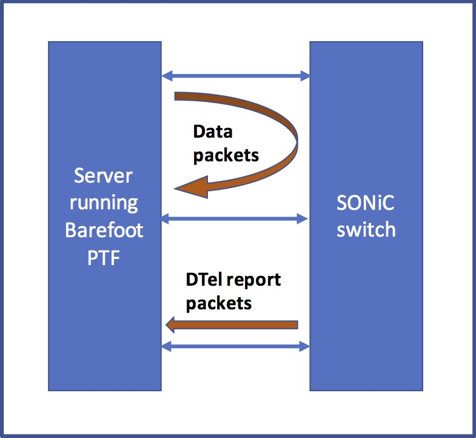

# Dataplane Telemetry test plan 

# Definitions/Abbreviation

Definitions/Abbreviation  | Description
------------------------- | -------------
DTEL / DTel	             | Dataplane Telemetry
ACL                       | Access Control List
INT                       | In-Network Telemetry
DSCP							| Differentiated Services Code Point
PTF								| Packet Test Framework

# Overview
This document provides details on Dataplane telemetry testing on a SONiC switch DUT. Every test performs set up and tear down of all DTel related configuration required for it to execute. Tests are written to verify DTel functionality in the data path, indirectly verifying that configuration from SONiC was propagated correctly.  

# Test structure 
Every test is responsible for installing and clearing all the required configuration. A new Python module that reads and writes DTel-specific configuration into Config DB will be added to sonic-mgmt repo. This module contains two submodules. The first one is called "dtel" and it implements an abstraction of dataplane telemetry and all its associated concepts, such as report sessions, watchlists, etc. It contains the following files:

File name				     | Description
----------------------------| -------------
switch.py	            | Getters, setters and validators for switch global level attributes 
dtel\_report\_session.py| Getters, setters and validators for report session attributes
dtel\_int\_session.py   | Getters, setters and validators for INT session attributes
dtel\_queue\_report.py  | Getters, setters and validators for queue reporting attributes
dtel\_event.py          | Getters, setters and validators for DTel event attributes
dtel\_watchlist.py		  | Getters, setters and validators for DTel flow and drop watchlists 

The second submodule is called "sonic" and it implements the SONiC-specific functionality for dataplane telemetry configuration. All classes within this submodule inherit from the according class of the "dtel" submodule, and extend their properties and methods. "sonic" contains the following files:

File name				     | Description
----------------------------| -------------
sonic\_switch.py	            | Getters, setters and validators for switch global level attributes 
sonic\_dtel\_report\_session.py| Getters, setters and validators for report session attributes
sonic\_dtel\_int\_session.py   | Getters, setters and validators for INT session attributes
sonic\_dtel\_queue\_report.py  | Getters, setters and validators for queue reporting attributes
sonic\_dtel\_event.py          | Getters, setters and validators for DTel event attributes
sonic\_dtel\_watchlist.py		  | Getters, setters and validators for DTel flow and drop watchlists 

As an example, setting/getting DSCP attribute for a DTel event object is done using the following routines defined in sonic\_dtel\_event.py:

```
	@property
    def dscp_value(self):
        value = int(self.switch.redis_read('DTEL_E_EVENT_TABLE', self.hashname, 'EVENT_DSCP_VALUE'))
        dtel_event.DTelEvent.dscp_value.fset(self, value)
        return dtel_event.DTelEvent.dscp_value.fget(self)

    @dscp_value.setter
    def dscp_value(self, value):
        dtel_event.DTelEvent.dscp_value.fset(self, value)
        self.switch.redis_write('DTEL_E_EVENT_TABLE', self.hashname, 'EVENT_DSCP_VALUE', value)
``` 

## Testbed
DTel tests will run on __ptf32__ topology described in:
[SONiC test topologies](https://github.com/Azure/sonic-mgmt/blob/master/ansible/doc/README.testbed.Topology.md)



## Ansible scripts to setup and run test

### dtel.yml
When this yml file is run with tag "dtel", it will execute every DTel test that each do the following:

* Set up configuration needed for the test
* Construct test packet and send it to DUT
* Verify received data packet and telemetry report packet (as it applies to the test)
* Restore original configuration

# PTF Test
All ACL related tests should pass to make sure there were no regressions introduced.

## Test case # 1: INT end-point as INT source
__Test steps__

* INT end-point configuration set up on DUT:
	* Switch ID
	* INT L4 DSCP
	* INT end-point mode enable
	* Latency quantization set
	* INT session with
		* Max hop count = 8
		* collect switch id=True
		* collect switch ports=False
		* collect ingress timestamp=False
		* collect egress timestamp=False
		* collect queue info=False
	* Flow watchlist with following criteria:
		* Source IP of incoming packet
		* Destination IP of incoming packet
		* Ether type = 0x800
		* INT session ID set to previously configured session's ID
		* Sample percent = 100
		* Report all packets = True
* PTF host will generate a UDP packet with SRC and DST IPs matching the ones in the watchlist configured and send it to DUT
* PTF docker should receive a packet from DUT with INT header added in-band
* Repeat with packet not matching flow watchlist entry and PTF docker should receive a packet from DUT without INT header
* Repeat with INT disabled and PTF docker should receive a packet from DUT without INT header

## Test case # 2: INT end-point as INT sink
__Test steps__

* INT end-point configuration set up on DUT:
	* Switch ID
	* INT L4 DSCP
	* Report session created with one of the IPs of PTF docker as report destination
	* INT sink ports list
	* INT end-point mode enable
	* Latency quantization set
	* INT session with
		* Max hop count = 8
		* collect switch id = True
		* collect switch ports = False
		* collect ingress timestamp = False
		* collect egress timestamp = False
		* collect queue info=False
	* Flow watchlist with following criteria:
		* Source IP of incoming packet
		* Destination IP of incoming packet
		* Ether type = 0x800
		* INT session ID set to previously configured session's ID
		* Sample percent = 100
		* Report all packets = True
* PTF host will generate a UDP packet that has an INT header in-band with
	* INT instruction mask = 0x8000 (to collect switch id)
	* Two INT hop information with switch ids
* PTF docker should receive a packet from DUT with INT header removed and an INT report packet with
	* SRC and DST IP and mac addresses matching what is configured for report session
	* Dropped = 0; congested queue = 0; path tracking flow = 1 in report packet
* Repeat with INT disabled and PTF docker should receive a packet from DUT with INT header

## Test case # 3: INT transit
__Test steps__

* INT end-point configuration set up on DUT:
	* Switch ID
	* INT L4 DSCP
	* INT transit mode enable
* PTF host will generate a TCP packet that has an INT header in-band with
	* INT instruction mask = 0x8000 (to collect switch id)
* PTF docker should receive a packet from DUT with INT header followed by INT transit information for the hop	* SRC and DST IP and mac addresses matching what is expected
	* Switch id of the switch added in band
* Repeat with following INT instruction masks:
	* 0xC000 : to collect switch id and ingress/egress port ids
	* 0xA000 : to collect switch id and hop latency
	* 0x9000 : to collect switch id and queue depth
	* 0xDC00 : to collect all of the above
* Repeat with INT packet that already has max-hop number of hop information in-band. PTF docker should receive a packet with INT information intact and "E" (exceeded) bit set

## Test case # 4: Postcard
__Test steps__

* Postcard configuration set up on DUT:
	* Switch ID
	* INT L4 DSCP
	* Report session created with one of the IPs of PTF docker as report destination
	* Postcard mode enable
	* Latency quantization set
* Flow watchlist with following criteria:
	* Source IP of incoming packet
	* Destination IP of incoming packet
	* Ether type = 0x800
	* Sample percent = 100
	* Report all packets = True
* PTF host will generate a TCP packet with SRC and DST IPs matching ones in the watchlist configured and send it to DUT
* PTF docker should receive original packet from DUT 
* PTF docker should receive an INT report packet with
	* SRC and DST IP and mac addresses matching what is configured for report session
	* Dropped = 0; congested queue = 0; path tracking flow = 1 in report packet
* Repeat test with packet not matching flow watchlist entry. There should be no report packet received by PTF docker.
* Repeat test with postcard mode turned off. There should be no report packet received by PTF docker.

## Test case # 4: Drop reporting
__Test steps__

* Drop report configuration set up on DUT:
	* Switch ID
	* Report session created with one of the IPs of PTF docker as report destination
	* Drop report enable
* Drop watchlist with the following criteria:
	* Source IP of incoming packet
	* Destination IP of incoming packet
	* Ether type = 0x800
* PTF host will generate a TCP packet with SRC and DST IPs matching the ones in the watchlist configured and send it to DUT
* PTF docker should receive the original packet from DUT and no drop reports
* PTF host will generate a TCP packet with SRC and DST IPs matching the ones in the watchlist configured, SRC MAC set to all zeros and send it to DUT
* PTF docker should not receive the original packet (dropped due to invalid SRC MAC) from DUT and drop report should be received with
	* SRC and DST IP and mac addresses matching what is configured for the report session
	* Dropped = 1; congested queue = 0; path tracking flow = 0
* Repeat test with packet not matching drop watchlist entry. There should be no report packet received by PTF docker.
* Repeat test with drop report mode turned off. There should be no report packet received by PTF docker.

## Test case # 5: Queue reporting
__Test steps__

* Queue report configuration set up on DUT:
	* Switch ID
	* Report session created with one of the IPs of PTF docker as report destination
	* Queue report enable
		* Queue 0 of port on which incoming packet will be forwarded
		* Depth threshold = 0xfff
		* Latency threshold = 0xffffffff
		* Breach quota = 1024
		* Report tail drops = False
* PTF host will generate a UDP packet and send it to DUT
* PTF docker should receive the original packet from DUT and no queue report
* Set depth threshold and latency threshold = 0
* PTF host will generate a UDP packet and send it to DUT
* PTF docker should receive the original packet from DUT and queue report should be received with
	* SRC and DST IP and mac addresses matching what is configured for the report session
	* Dropped = 0; congested queue = 1; path tracking flow = 0 in the report packet
* Repeat test with queue report mode turned off. There should be no report packet received by PTF docker.

