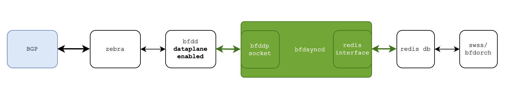

# BFD HW Offload for BGP session

# Table of Content
- [BFD HW Offload for BGP session](#bfd-hw-offload-for-bgp-session)
- [Table of Content](#table-of-content)
          - [Revision](#revision)
- [About this Manual](#about-this-manual)
- [Definitions/Abbreviation](#definitionsabbreviation)
          - [Table 1: Abbreviations](#table-1-abbreviations)
- [1 Requirements Overview](#1-requirements-overview)
  - [1.1 Functional requirements](#11-functional-requirements)
  - [1.2 CLI requirements](#12-cli-requirements)
  - [1.3 Scalability and Default Values](#13-scalability-and-default-values)
  - [1.4 Warm Restart requirements](#14-warm-restart-requirements)
- [2 Modules Design](#2-modules-design)
  - [2.1 bfdsyncd](#21-bfdsyncd)
  - [2.2 BFD DP message format](#22-bfd-dp-message-format)
  - [2.3 bfddp state change format](#23-bfddp-state-change-format)
  - [2.4 Orchestration Agent](#24-orchestration-agent)
    - [BfdOrch](#bfdorch)
      - [Source mac address handling](#source-mac-address-handling)
      - [Remote discriminator and timer handling for frr show bfd peer command](#remote-discriminator-and-timer-handling-for-frr-show-bfd-peer-command)
  - [2.5 BFD state\_db format example](#25-bfd-state_db-format-example)
  - [2.6 Local Discriminator handling](#26-local-discriminator-handling)
  - [2.7 IPv6 link local address support](#27-ipv6-link-local-address-support)
  - [2.8 Control plane BFD](#28-control-plane-bfd)
  - [2.9 CLI](#29-cli)
- [3 start the daemons](#3-start-the-daemons)
  - [3.1 start bfdsyncd](#31-start-bfdsyncd)
  - [3.2 start bfdd](#32-start-bfdd)
  - [3.3 create bfd session from vtysh cli](#33-create-bfd-session-from-vtysh-cli)

###### Revision

| Rev |     Date    |       Author       | Change Description                |
|:---:|:-----------:|:------------------:|-----------------------------------|
| 0.1|  02/04/2024  |     Baorong Liu    | Initial proposal                   |
| 0.2|  06/03/2024  |     Baorong Liu    | Add IPv6 link local address support |


# About this Manual
This document describes a design to use HW offload BFD to monitor BGP neighbor reachability.  The system can be configured to use BFD to monitor BGP neighbor. When BFD detect that the neighbor is not reachable, the bfd session state goes down, then BFD notifies BGP about this event. Usually, BGP resets its state to IDLE after receiving a BFD DOWN event, but the BGP behavior following a BFD state change is outside the scope of this document. HW offloaded BFD can provide a faster failure detection and supports more BFD sessions, comparing to software BFD.

# Definitions/Abbreviation
###### Table 1: Abbreviations

|                          |                                |
|--------------------------|--------------------------------|
| BFD                      | Bidirectional Forwarding Detection       |
| HW                       | Hardware                                |
| SW                       | Software                                |
| BGP                      | Border Gateway Protocol                 |
| FRR                      | Free Range Routing https://frrouting.org/      |
| SWSS                     | Switch state service                    |

# 1 Requirements Overview

## 1.1 Functional requirements

At a high level the following should be supported:

- Create HW offload BFD sessions upon request from frr/BGP
- Notifications on BFD session state change to frr/BGP

## 1.2 CLI requirements
- using existing sonic CLI to show the BFD session and the corresponding status
- use existing frr BFD CLI to show bfd peer 
- bfddp_request_counters/bfddp_session_counters are not supported 


## 1.3 Scalability and Default Values

The BGP BFD HW offload session shares a total number of **4000** with all other features in the SONiC system.

if any BFD session configuration not provided, will rely on frr/bfdd default value when create BFD session.
The default values for BFD configs if not specified explicitly is:

|  Attribute               |  Value                         |
|--------------------------|--------------------------------|
| BFD_SESSION_DEFAULT_TX_INTERVAL | 300 millisecond  |
| BFD_SESSION_DEFAULT_RX_INTERVAL | 300 millisecond  |
| BFD_SESSION_DEFAULT_DETECT_MULTIPLIER | 3 |

## 1.4 Warm Restart requirements
No special handling for Warm restart support for first phase.

# 2 Modules Design

## 2.1 bfdsyncd

SONiC BGP is based on FRR zebra framework. the protocol daemon is running as a zebra client around zebra, including a bfdd daemon to provide BFD service.

The bfdd daemon provides a software based BFD service, it also provides an interface to external bfd dataplane (distributed BFD) through socket, follow a set of message format. 

A new component bfdsyncd will do the synchronization between bfdd and BfdOrch through bfd dataplane message and redis appl_db, to support BFD hardware offload for BGP sessions.

The bfdsyncd listens the socket for the BFD session creation/deletion message from bfdd, and converts the message to BFD transaction, write 
the BFD transaction to redis appl_db to notify orchagent(bfdorch) to create/delete a HW offload BFD session.

The bfdsyncd monitors BFD session state change from redis state_db, sends the BFD state change back to bfdd using bfd dataplane message. The BFD session state will be sent to BGP eventually. If BFD state becomes DOWN, BGP reset it's state to IDLE.



## 2.2 BFD DP message format
```
/** BFD data plane protocol version. */
#define BFD_DP_VERSION 1
 
/** BFD data plane message types. */
enum bfddp_message_type {
    /** Ask for BFD daemon or data plane for echo packet. */
    ECHO_REQUEST = 0,
    /** Answer a ECHO_REQUEST packet. */
    ECHO_REPLY = 1,
    /** Add or update BFD peer session. */
    DP_ADD_SESSION = 2,
    /** Delete BFD peer session. */
    DP_DELETE_SESSION = 3,
    /** Tell BFD daemon state changed: timer expired or session down. */
    BFD_STATE_CHANGE = 4,
 
    /** Ask for BFD session counters. */
    DP_REQUEST_SESSION_COUNTERS = 5,
    /** Tell BFD daemon about counters values. */
    BFD_SESSION_COUNTERS = 6,
};
/**
 * The protocol wire message header structure.
 */
struct bfddp_message_header {
    /** Protocol version format. \see BFD_DP_VERSION. */
    uint8_t version;
    /** Reserved / zero field. */
    uint8_t zero;
    /** Message contents type. \see bfddp_message_type. */
    uint16_t type;
    /**
     * Message identification (to pair request/response).
     *
     * The ID `0` is reserved for asynchronous messages (e.g. unrequested
     * messages).
     */
    uint16_t id;
    /** Message length. */
    uint16_t length;
};
 
/**
 * The protocol wire messages structure.
 */
struct bfddp_message {
    /** Message header. \see bfddp_message_header. */
    struct bfddp_message_header header;
 
    /** Message payload. \see bfddp_message_type. */
    union {
        struct bfddp_echo echo;
        struct bfddp_session session;
        struct bfddp_state_change state;
        struct bfddp_control_packet control;
        struct bfddp_request_counters counters_req;
        struct bfddp_session_counters session_counters;
    } data;
};

/**
 * `DP_ADD_SESSION`/`DP_DELETE_SESSION` data payload.
 *
 * `lid` is unique in BFD daemon so it might be used as key for data
 * structures lookup.
 */
struct bfddp_session {
	/** Important session flags. \see bfddp_session_flag. */
	uint32_t flags;
	struct in6_addr src;
	struct in6_addr dst;

	/** Local discriminator. */
	uint32_t lid;
	uint32_t min_tx;
	uint32_t min_rx;
	uint32_t min_echo_tx;
	uint32_t min_echo_rx;
	/** Amount of milliseconds to wait before starting the session */
	uint32_t hold_time;

	/** Minimum TTL. */
	uint8_t ttl;
	/** Detection multiplier. */
	uint8_t detect_mult;
	/** Reserved / zeroed. */
	uint16_t zero;

	/** Interface index (set to `0` when unavailable). */
	uint32_t ifindex;
	/** Interface name (empty when unavailable). */
	char ifname[64];
};

```
## 2.3 bfddp state change format

```
/**
 * `BFD_STATE_CHANGE` data payload.
 */
struct bfddp_state_change {
	/** Local discriminator. */
	uint32_t lid;
	/** Remote discriminator. */
	uint32_t rid;
	/** Remote configurations/bits set. \see bfd_remote_flags. */
	uint32_t remote_flags;
	/** Remote minimum desired transmission interval. */
	uint32_t desired_tx;
	/** Remote minimum receive interval. */
	uint32_t required_rx;
	/** Remote minimum echo receive interval. */
	uint32_t required_echo_rx;
	/** Remote state. \see bfd_state_values.*/
	uint8_t state;
	/** Remote diagnostics (if any) */
	uint8_t diagnostics;
	/** Remote detection multiplier. */
	uint8_t detection_multiplier;
};
```

## 2.4 Orchestration Agent

### BfdOrch

#### Source mac address handling
If specify interface when creating BFD session (see section 2.7, link local address case), source mac address and destination mac address need to be provided.
Current bfdorch gets source mac address from the port:

        attr.id = SAI_BFD_SESSION_ATTR_SRC_MAC_ADDRESS;
        memcpy(attr.value.mac, port.m_mac.getMac(), sizeof(sai_mac_t));
        attrs.emplace_back(attr);

But in the link local address case, the mac address of the port is empty. So the design here need to be modified, let application provide source mac address.

#### Remote discriminator and timer handling for frr show bfd peer command
The frr 'show bfd peers' CLI needs to show BFD peer information for hardware offloaded BFD sessions:
  - remote discriminator 
  - remote detect multiplier 
  - remote receive interval
  - remote transmission interval

The above information is missing in SONiC database today, it might be available in SDK or hardware side. If SDK support the following attributes, better to add the following attributes in SAI API to get the information for 'show bfd peers' CLI.

  - SAI_BFD_SESSION_ATTR_REMOTE_DISCRIMINATOR
  - SAI_BFD_SESSION_ATTR_REMOTE_MULTIPLIER
  - SAI_BFD_SESSION_ATTR_REMOTE_MIN_RX
  - SAI_BFD_SESSION_ATTR_REMOTE_MIN_TX

Propose to do it in the bfd session state change handling in BfdOrch. When the BFD session state becomes UP, get these attribute values and write it into BFD session state DB. The bfdsyncd monitors BFD session state change and update the values to bfdd, so the values can be shown in 'show bfd peers'.

The get_bfd_session_attribute API need bfd session id, which is available only in BfdOrch. 

In the case of SDK or hardware does not support the above attribute, BfdOrch should not crash when the error returned from the above get attribute SAI API call 

If the above values are not written into BFD session state DB, bfdsyncd will use value 0 when send the information to bfdd.

Examples:
```
sonic@sonic:~$ vtysh

Hello, this is FRRouting (version 8.5.1).
Copyright 1996-2005 Kunihiro Ishiguro, et al.
...
sonic(config-router)#         neighbor FOO peer-group
sonic(config-router)#         neighbor FOO remote-as external
sonic(config-router)#         neighbor FOO disable-connected-check
sonic(config-router)#         neighbor FOO ebgp-multihop 255
sonic(config-router)#         neighbor FOO update-source Loopback27
sonic(config-router)#         neighbor FOO bfd
sonic(config-router)#         neighbor 10.200.200.201 peer-group FOO
...
sonic# show bfd peer
BFD Peers:
	peer 10.200.200.201 multihop local-address 10.200.200.200 vrf default
		ID: 300650336
		Remote ID: 1
		Active mode
		Minimum TTL: 1
		Status: up
		Uptime: 51 second(s)
		Diagnostics: ok
		Remote diagnostics: ok
		Peer Type: dynamic
		RTT min/avg/max: 0/0/0 usec
		Local timers:
			Detect-multiplier: 3
			Receive interval: 300ms
			Transmission interval: 300ms
			Echo receive interval: 50ms
			Echo transmission interval: disabled
		Remote timers:
			Detect-multiplier: 3
			Receive interval: 300ms
			Transmission interval: 300ms
			Echo receive interval: disabled

sonic# exit
sonic@sonic:/var/tmp$ show bfd sum
Total number of BFD sessions: 1
Peer Addr       Interface    Vrf      State    Type          Local Addr        TX Interval    RX Interval    Multiplier  Multihop      Local Discriminator
--------------  -----------  -------  -------  ------------  --------------  -------------  -------------  ------------  ----------  ---------------------
10.200.200.201  default      default  Up       async_active  10.200.200.200            300            300             3  true                            1
sonic@sonic:/var/tmp$ 

from peer system:
sonic(config-router)#         neighbor FOO peer-group
sonic(config-router)#         neighbor FOO remote-as external
sonic(config-router)#         neighbor FOO disable-connected-check
sonic(config-router)#         neighbor FOO ebgp-multihop 255
sonic(config-router)#         neighbor FOO update-source Loopback27
sonic(config-router)#         neighbor FOO bfd
sonic(config-router)#         neighbor 10.200.200.200 peer-group FOO
...
sonic# show bfd peer
BFD Peers:
	peer 10.200.200.200 multihop local-address 10.200.200.201 vrf default
		ID: 2538789519
		Remote ID: 1
		Active mode
		Minimum TTL: 1
		Status: up
		Uptime: 5 second(s)
		Diagnostics: ok
		Remote diagnostics: ok
		Peer Type: dynamic
		RTT min/avg/max: 0/0/0 usec
		Local timers:
			Detect-multiplier: 3
			Receive interval: 300ms
			Transmission interval: 300ms
			Echo receive interval: 50ms
			Echo transmission interval: disabled
		Remote timers:
			Detect-multiplier: 3
			Receive interval: 300ms
			Transmission interval: 300ms
			Echo receive interval: disabled

sonic# exit
sonic@sonic:/var/tmp$ show bfd sum
Total number of BFD sessions: 1
Peer Addr       Interface    Vrf      State    Type          Local Addr        TX Interval    RX Interval    Multiplier  Multihop      Local Discriminator
--------------  -----------  -------  -------  ------------  --------------  -------------  -------------  ------------  ----------  ---------------------
10.200.200.200  default      default  Up       async_active  10.200.200.201            300            300             3  true                            1
sonic@sonic:/var/tmp$ 
```


## 2.5 BFD state_db format example
```
  "BFD_SESSION_TABLE|default|default|192.168.1.29": {
    "expireat": 1705044089.302891,
    "ttl": -0.001,
    "type": "hash",
    "value": {
      "local_addr": "192.168.1.24",
      "local_discriminator": "1",
      "multihop": "false",
      "multiplier": "10",
      "remote_discriminator": "2",
      "remote_min_rx": "300",
      "remote_min_tx": "300",
      "remote_multiplier": "10",
      "rx_interval": "300",
      "state": "Up",
      "tx_interval": "300",
      "type": "async_active"
    }
  },
```

## 2.6 Local Discriminator handling

In SONiC, bfdd and BfdOrch manage the bfd local discriminator separately.
Local discriminator starts from 1 in BfdOrch. 

In bfdd,local discriminator is not less than 0x10000.
```
static uint32_t ptm_bfd_gen_ID(void)
{
	uint32_t session_id;

	/*
	 * RFC 5880, Section 6.8.1. recommends that we should generate
	 * random session identification numbers.
	 */
	do {
		session_id = ((frr_weak_random() << 16) & 0xFFFF0000)
			     | (frr_weak_random() & 0x0000FFFF);
	} while (session_id == 0 || bfd_id_lookup(session_id) != NULL);

	return session_id;
}
struct bfd_session *bs_registrate(struct bfd_session *bfd)
{
	/* Registrate session into data structures. */
	bfd_key_insert(bfd);
	bfd->discrs.my_discr = ptm_bfd_gen_ID();
``` 
so bfdsyncd need to do local discriminator mapping between bfdd and BfdOrch, map the bfd session key to bfdd local discriminator. When bfdsyncd get bfd session state update, so it can lookup the bfdd local discriminator using bfd session key. bfdd use its local discriminator to update the information to correct bfd session.


## 2.7 IPv6 link local address support

It needs special handling to use link local address for bgp bfd hardware offload.

When bgp use link local address to peer with remote system, it needs to specify interface index (and interface name) when create the bfd session. 

because link local address is not a routable ip address, so bfdsyncd has to provide source mac and destination mac address to let bfdorch create a bfd session with inject-down mode (construct layer 2 packet).

SONiC does not set source mac address for a port with link local address only. But the source mac address can be found at /sys/class/net/'interface_name'/address

One way to get destination mac address is to read neighbor table, for example, using cmd ip -6 neighbor.
```
sonic@sonic:/var/tmp$ ip -6 neighbor get fe80::7a6b:17ff:fe5a:7000 dev Ethernet0
fe80::7a6b:17ff:fe5a:7000 dev Ethernet0 lladdr 78:6b:17:5a:70:00 router REACHABLE
sonic@sonic:/var/tmp$ 
```

To make sure the the destination mac address is available before bgp creating bfd session, do not use this bgp configuration: "neighbor xxx disable-connected-check", let bgp check connection first before it try to create bfd session. so peer system mac address will be available if bfdsyncd issue a PING before try to read the neighbor table.

example for bfd session with link local address:
```
bgp configuration:
sonic(config-router)#         neighbor FOO peer-group
sonic(config-router)#         neighbor FOO remote-as external
sonic(config-router)#         neighbor FOO ebgp-multihop 1
sonic(config-router)#         neighbor FOO bfd
sonic(config-router)#         neighbor Ethernet0 interface peer-group FOO

sonic@sonic:/var/tmp$ show bfd sum
Total number of BFD sessions: 1
Peer Addr                  Interface    Vrf      State    Type          Local Addr                   TX Interval    RX Interval    Multiplier  Multihop      Local Discriminator
-------------------------  -----------  -------  -------  ------------  -------------------------  -------------  -------------  ------------  ----------  ---------------------
fe80::7a6b:17ff:fe5a:7000  Ethernet0    default  Up       async_active  fe80::7a3e:86ff:fe14:8400            300            300             3  false                           2
sonic@sonic:/var/tmp$ vtysh -c "show bfd peer"
BFD Peers:
	peer fe80::7a6b:17ff:fe5a:7000 local-address fe80::7a3e:86ff:fe14:8400 vrf default interface Ethernet0
		ID: 2602968139
		Remote ID: 1
		Active mode
		Status: up
		Uptime: 26 second(s)
		Diagnostics: ok
		Remote diagnostics: ok
		Peer Type: dynamic
		RTT min/avg/max: 0/0/0 usec
		Local timers:
			Detect-multiplier: 3
			Receive interval: 300ms
			Transmission interval: 300ms
			Echo receive interval: 50ms
			Echo transmission interval: disabled
		Remote timers:
			Detect-multiplier: 3
			Receive interval: 300ms
			Transmission interval: 300ms
			Echo receive interval: disabled

```

## 2.8 Control plane BFD

A control plane BFD approach is to use FRR SW BFD. If use HW offload BFD for FRR, it is expected that all FRR BFD sessions are offloaded to HW, with a global flag to switch when start bfdd. 

## 2.9 CLI

no new CLI introduced for this feature

# 3 start the daemons

## 3.1 start bfdsyncd
run bfdsyncd inside bgp container, default port number for bfd is 50700
```
sonic@sonic:$ docker exec -it bgp bash
root@sonic# bfdsyncd &
```
## 3.2 start bfdd
run bfdd with option dplaneaddr inside bgp container, it connects to default bfd port.
```
sonic@sonic:$ docker exec -it bgp bash
root@sonic# /usr/lib/frr/bfdd --dplaneaddr ipv4c:127.0.0.1
```
The logic for starting frr/bfdd with different parameters is outside the scope of this document.

## 3.3 create bfd session from vtysh cli
```
sonic@sonic:/var/tmp$ docker exec -it bgp bash
root@sonic:/# bfdsyncd&
[1] 262
root@sonic:/# Waiting for bfd-client connection... v28 port 50700

root@sonic:/# /usr/lib/frr/bfdd --dplaneaddr ipv4c:127.0.0.1 &
[2] 270
root@sonic:/# bfd-client connected

root@sonic:/# vtysh

Hello, this is FRRouting (version 8.2.2).
Copyright 1996-2005 Kunihiro Ishiguro, et al.

sonic# config
sonic(config)# bfd
sonic(config-bfd)# peer 192.168.1.29 local-address 192.168.1.24
sonic(config-bfd-peer)# 

```

```
sonic@sonic:/var/tmp$ show bfd sum
Total number of BFD sessions: 1
Peer Addr     Interface    Vrf      State    Type          Local Addr      TX Interval    RX Interval    Multiplier  Multihop      Local Discriminator
------------  -----------  -------  -------  ------------  ------------  -------------  -------------  ------------  ----------  ---------------------
192.168.1.29  default      default  Down     async_active  192.168.1.24            300            300             3  false                           1
sonic@sonic:/var/tmp$ 
```
