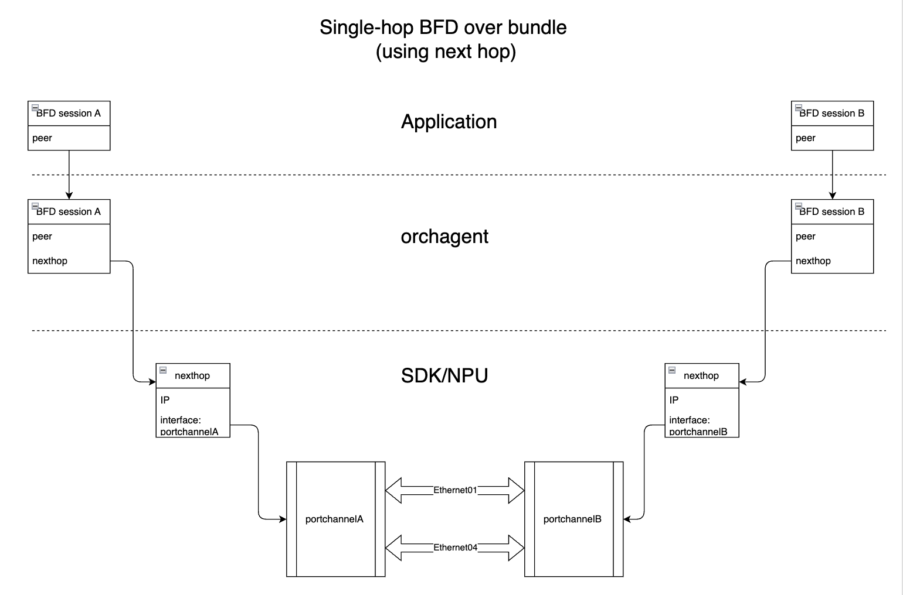

# Creating BFD HW Offload session using next hop

# Table of Content
- [Creating BFD HW Offload session using next hop](#creating-bfd-hw-offload-session-using-next-hop)
- [Table of Content](#table-of-content)
					- [Revision](#revision)
- [Definitions/Abbreviation](#definitionsabbreviation)
					- [Table 1: Abbreviations](#table-1-abbreviations)
- [1 Overview](#1-overview)
- [2. Theory of operation](#2-theory-of-operation)
	- [2.1 application](#21-application)
	- [2.2 orchagent](#22-orchagent)
	- [2.3 SAI](#23-sai)
	- [2.4 Hardware](#24-hardware)
	- [2.5 next hop update](#25-next-hop-update)
- [3 Design Changes](#3-design-changes)
	- [3.1 SAI ATTRIBUTES](#31-sai-attributes)
	- [3.2 orchagent](#32-orchagent)
	- [3.3 SAI implementation](#33-sai-implementation)
- [4 Prototyping](#4-prototyping)

###### Revision

| Rev |     Date    |       Author       | Change Description                |
|:---:|:-----------:|:------------------:|-----------------------------------|
| 0.1|  02/20/2025  |     Baorong Liu    | Initial proposal                  |


# Definitions/Abbreviation
###### Table 1: Abbreviations

|                          |                                |
|--------------------------|--------------------------------|
| BFD                      | Bidirectional Forwarding Detection       |
| HW                       | Hardware                                |
| SWSS                     | Switch state service                    |

# 1 Overview 
This document describes a method to let HW offload single hop BFD session use a next hop directly, to bound the single hop BFD session to an interface.(use term injectdown_to_nexthop in this document)

Single hop BFD session need to be bound to a given interface (logical or physical. RFC5881, section 3).

The current SONiC and SAI provides a way to bypass HW lookup for BFD session by providing destination mac address and source mac address, hardware can construct layer 2 packet and send the BFD packet out thru a given interface directly, without forwarding table lookup.

In the BFD over bundle (PortChannel) use case, the above method has some problems. PortChannel may use hashing to choose which member to send packet. But there is a case that part of PortChannel members are operational UP while other members are still operational UP, and the PortChannel status is operational DOWN. If the UP member is chosen to send packet, the BFD packet can still be sent out to its peer (and BFD packet can also be received through these UP members), cause the BFD session be UP even the PortChannel is operational DOWN.

SONiC removes the corresponding next hop when the interface is operational DOWN. So if a single hop uses next hop, the BFD packet will be dropped after the next hop is removed because of the interface DOWN status. 

By using next hop for single hop BFD session, the configuration become simpler. Application does not need to provide destination and source mac address. And PortChannel and normal interface can have same configuration. The next hop can be configured in the orchagent (use peer IP address to lookup in neighorch), the application does not need to provide nexthop.



# 2. Theory of operation

## 2.1 application
With injectdown_to_nexthop support, application can create bfd session without providing destination and source mac address. It still need to provide interface name to indicate that the BFD session is bonded to that interface.
Example BFD session configuration from application
```
  "BFD_SESSION_TABLE:default:PortChannel01:20.0.1.1": {
      "local_addr": "20.0.1.6",
      "multihop": "false",
      "multiplier": "3",
      "rx_interval": "50",
      "tx_interval": "50"
  }
```

## 2.2 orchagent
bfdorch takes BFD session configuration from redis application db.

  If the destination mac address is provided, bfdorch uses mac address and skip HW lookup to configure BFD session as what it does today, to be backward compatible. 

  If the destination mac address is not provided, bfdorch lookup next_hop_id from neighorch and then pass the next_hop_id to SAI.


## 2.3 SAI
When SAI get a create_bfd_session API call, it uses nexthop directly if the attribute SAI_BFD_SESSION_ATTR_USE_NEXT_HOP is true.

## 2.4 Hardware
When a next hop id is configured in a BFD session, hardware generate bfd packet and forward the packet to that next hop. If the next hop is associate with a portchannel, how the portchannel choose its member to send packet is not controlled by BFD session.


## 2.5 next hop update
If the next hop is not available when creating bfd session, SAI_NULL_OBJECT_ID will be used. It will be updated when neighorh create the next hop.
When interface becomes operational DOWN and neighorch removes next hop, the next hop id will be cleared (replaced with SAI_NULL_OBJECT_ID) in the BFD session 


# 3 Design Changes

## 3.1 SAI ATTRIBUTES
New SAI attributes are required, changes need to be made in saibfd.h

|  Attribute               |  Default Value                         |
|--------------------------|--------------------------------|
| SAI_BFD_SESSION_ATTR_USE_NEXT_HOP | false   |
| SAI_BFD_SESSION_ATTR_NEXT_HOP_ID | SAI_NULL_OBJECT_ID   |

```
diff --git a/inc/saibfd.h b/inc/saibfd.h
index 59ed80cb3..4004df321 100644
--- a/inc/saibfd.h
+++ b/inc/saibfd.h
@@ -164,7 +164,7 @@ typedef enum _sai_bfd_session_attr_t
      * @type sai_object_id_t
      * @flags MANDATORY_ON_CREATE | CREATE_AND_SET
      * @objects SAI_OBJECT_TYPE_VIRTUAL_ROUTER
-     * @condition SAI_BFD_SESSION_ATTR_HW_LOOKUP_VALID == true
+     * @condition SAI_BFD_SESSION_ATTR_HW_LOOKUP_VALID == true and SAI_BFD_SESSION_ATTR_USE_NEXT_HOP == false
      */
     SAI_BFD_SESSION_ATTR_VIRTUAL_ROUTER,
 
@@ -523,6 +523,26 @@ typedef enum _sai_bfd_session_attr_t
      */
     SAI_BFD_SESSION_ATTR_SELECTIVE_COUNTER_LIST,
 
+    /**
+     * @brief Use next hop
+     *
+     * @type bool
+     * @flags CREATE_ONLY
+     * @default false
+     */
+    SAI_BFD_SESSION_ATTR_USE_NEXT_HOP,
+
+    /**
+     * @brief Next Hop ID for single hop BFD session
+     *
+     * @type sai_object_id_t
+     * @flags MANDATORY_ON_CREATE | CREATE_AND_SET
+     * @objects SAI_OBJECT_TYPE_NEXT_HOP
+     * @allownull true
+     * @condition SAI_BFD_SESSION_ATTR_USE_NEXT_HOP == true
+     */
+    SAI_BFD_SESSION_ATTR_NEXT_HOP_ID,
+
     /**
      * @brief End of attributes
      */
```

## 3.2 orchagent
bfdorch changes:

  ```
    if (alias != "default")
    {
        // Get next_hop_id if dst_mac is not provided
        if (!dst_mac_provided)
        {
            attr.id = SAI_BFD_SESSION_ATTR_USE_NEXT_HOP;
            attr.value.booldata = true;
            attrs.emplace_back(attr);

            sai_object_id_t next_hop_id = SAI_NULL_OBJECT_ID;
            attr.id = SAI_BFD_SESSION_ATTR_NEXT_HOP_ID;
            NextHopKey nexthop_key = NextHopKey(peer_address, alias);
            next_hop_id = gNeighOrch->getLocalNextHopId(nexthop_key);
            attr.value.oid = next_hop_id;
            attrs.emplace_back(attr);
        }
    }
    else
    {
        //configure BFD session with port_id and mac address
    }
  ```

neighorch changes:

```
diff --git a/orchagent/neighorch.cpp b/orchagent/neighorch.cpp
index 00318f90..e06e34e6 100644
--- a/orchagent/neighorch.cpp
+++ b/orchagent/neighorch.cpp
@@ -285,6 +285,13 @@ bool NeighOrch::addNextHop(const NextHopKey &nh)
         }
     }
 
+    SWSS_LOG_NOTICE("BFD: update nexthop id, next hop %s on %s, next_hop_id %lu",
+                    nexthop.ip_address.to_string().c_str(), nexthop.alias.c_str(), next_hop_id);
+    if (gBfdOrch)
+    {
+        gBfdOrch->updateNextHopId(nexthop.alias, nexthop.ip_address, next_hop_id);
+    }
+
     SWSS_LOG_NOTICE("Created next hop %s on %s",
                     nexthop.ip_address.to_string().c_str(), nexthop.alias.c_str());
     if (m_neighborToResolve.find(nexthop) != m_neighborToResolve.end())
@@ -568,6 +575,14 @@ bool NeighOrch::removeMplsNextHop(const NextHopKey& nh)
     }
 
     sai_object_id_t next_hop_id = m_syncdNextHops[nexthop].next_hop_id;
+
+    SWSS_LOG_NOTICE("BFD: removeMplsNextHop update nexthop id, next hop %s on %s, next_hop_id %lu",
+                    nexthop.ip_address.to_string().c_str(), nexthop.alias.c_str(), next_hop_id);
+    if (gBfdOrch)
+    {
+        gBfdOrch->updateNextHopId(nexthop.alias, nexthop.ip_address, SAI_NULL_OBJECT_ID);
+    }
+
     sai_status_t status = sai_next_hop_api->remove_next_hop(next_hop_id);
 
     /*
@@ -1157,6 +1172,14 @@ bool NeighOrch::removeNeighbor(NeighborContext& ctx, bool disable)
         copy(neighbor_entry.ip_address, ip_address);
 
         sai_object_id_t next_hop_id = m_syncdNextHops[nexthop].next_hop_id;
+
+        SWSS_LOG_NOTICE("BFD: removeNeighbor, next hop %s on %s, next_hop_id %lu",
+                        nexthop.ip_address.to_string().c_str(), nexthop.alias.c_str(), next_hop_id);
+        if (gBfdOrch) 
+        {
+            gBfdOrch->updateNextHopId(nexthop.alias, nexthop.ip_address, SAI_NULL_OBJECT_ID);
+        }
+
         status = sai_next_hop_api->remove_next_hop(next_hop_id);
         if (status != SAI_STATUS_SUCCESS)
         {
```

## 3.3 SAI implementation
  SAI implementation is vendor dependent, it is out of scope of this document.

# 4 Prototyping 

SAI redis record for BFD session creation and next hop update when shutdown/startup interface.

```
17:24:14.400492|c|SAI_OBJECT_TYPE_BFD_SESSION:oid:0x45000000000680|SAI_BFD_SESSION_ATTR_TYPE=SAI_BFD_SESSION_TYPE_ASYNC_ACTIVE|SAI_BFD_SESSION_ATTR_LOCAL_DISCRIMINATOR=1|SAI_BFD_SESSION_ATTR_UDP_SRC_PORT=49152|SAI_BFD_SESSION_ATTR_REMOTE_DISCRIMINATOR=0|SAI_BFD_SESSION_ATTR_BFD_ENCAPSULATION_TYPE=SAI_BFD_ENCAPSULATION_TYPE_NONE|SAI_BFD_SESSION_ATTR_IPHDR_VERSION=4|SAI_BFD_SESSION_ATTR_SRC_IP_ADDRESS=20.0.1.6|SAI_BFD_SESSION_ATTR_DST_IP_ADDRESS=20.0.1.1|SAI_BFD_SESSION_ATTR_MIN_TX=50000|SAI_BFD_SESSION_ATTR_MIN_RX=50000|SAI_BFD_SESSION_ATTR_MULTIPLIER=3|SAI_BFD_SESSION_ATTR_TOS=192|SAI_BFD_SESSION_ATTR_USE_NEXT_HOP=true|SAI_BFD_SESSION_ATTR_NEXT_HOP_ID=oid:0x0
17:24:14.405572|n|bfd_session_state_change|[{"bfd_session_id":"oid:0x45000000000680","session_state":"SAI_BFD_SESSION_STATE_DOWN"}]|
17:26:24.478784|s|SAI_OBJECT_TYPE_BFD_SESSION:oid:0x45000000000680|SAI_BFD_SESSION_ATTR_NEXT_HOP_ID=oid:0x4000000000920
17:26:25.379457|n|bfd_session_state_change|[{"bfd_session_id":"oid:0x45000000000680","session_state":"SAI_BFD_SESSION_STATE_UP"}]|
19:40:14.290770|n|bfd_session_state_change|[{"bfd_session_id":"oid:0x45000000000680","session_state":"SAI_BFD_SESSION_STATE_DOWN"}]|
19:43:39.413722|n|bfd_session_state_change|[{"bfd_session_id":"oid:0x45000000000680","session_state":"SAI_BFD_SESSION_STATE_UP"}]|
23:46:11.373693|n|bfd_session_state_change|[{"bfd_session_id":"oid:0x45000000000680","session_state":"SAI_BFD_SESSION_STATE_DOWN"}]|
23:46:11.936482|s|SAI_OBJECT_TYPE_BFD_SESSION:oid:0x45000000000680|SAI_BFD_SESSION_ATTR_NEXT_HOP_ID=oid:0x0
23:57:23.253017|s|SAI_OBJECT_TYPE_BFD_SESSION:oid:0x45000000000680|SAI_BFD_SESSION_ATTR_NEXT_HOP_ID=oid:0x400000000132e
23:57:23.400633|n|bfd_session_state_change|[{"bfd_session_id":"oid:0x45000000000680","session_state":"SAI_BFD_SESSION_STATE_UP"}]|
00:02:17.198325|n|bfd_session_state_change|[{"bfd_session_id":"oid:0x45000000000680","session_state":"SAI_BFD_SESSION_STATE_DOWN"}]|
00:02:17.833350|s|SAI_OBJECT_TYPE_BFD_SESSION:oid:0x45000000000680|SAI_BFD_SESSION_ATTR_NEXT_HOP_ID=oid:0x0

```