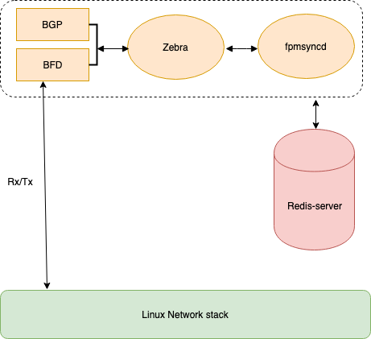

# Feature Name                                                  
Bidirectional Forwarding Detection                             
# High Level Design Document                                   
#### Rev 0.2                                                   

# Table of Contents
  * [List of Tables](#list-of-tables)
  * [Revision](#revision)            
  * [About This Manual](#about-this-manual)
  * [Scope](#scope)                        
  * [Definition/Abbreviation](#definitionabbreviation)
                                                      
# List of Tables                                      
[Table 1: Abbreviations](#table-1-abbreviations)      

# Revision
| Rev |     Date    |       Author       | Change Description                |
|:---:|:-----------:|:------------------:|-----------------------------------|
| 0.1 | 05/15/2019  |   Sumit Agarwal    | Initial version                   |
| 1.0 | 18/06/2019  |   Sumit Agarwal    | Updated community review comments |

# About this Manual
This document provides general information about the BFD feature implementation in SONiC.
# Scope                                                                                  
This document describes the high level design of BFD, with software implementation.In this implementation, the BFD state machines and session termination happens on the Host CPU, specifically in FRR.

# Definition/Abbreviation
### Table 1: Abbreviations
| **Term**                 | **Meaning**                         |
|--------------------------|-------------------------------------|
| BFD                      | Bidirectional Forwarding Detection  |
| BGP                      | Border Gateway Protocol             |
| GR                       | Graceful Restart                    |

# 1 Requirement Overview
## 1.1 Functional Requirements
 1. Support monitoring of forwarding path failure for BGP neighbor. 
 2. Support BFD single hop sessions.                                
 3. Support BFD multi hop sessions.                                 
 4. Support Asynchronous mode of operation.                         
 5. Support Echo mode of operation.                                 
 6. Support IPv4 address family.                                    
 7. Support IPv6 address family.                                    
 8. Support LAG interface.                                          
 9. Support ECMP paths for multi hop session.                       
 10. Support FRR container warm reboot.                             
 11. Support 64 BFD sessions.                                       
 12. Support minimum timeout interval of 300 milliseconds.                                                            
## 1.2 Configuration and Management Requirements                    
BFD will support CLI in FRR vtysh shell.                            
## 1.3 Scalability Requirements                                     
Support 64 BFD session with timer of 100 * 3 milliseconds, i.e. detection time of 300 milliseconds. 
## 1.4 Warm Boot Requirements                                                                       
BFD should support planned/unplanned restart of BGP container.                                      

# 2 Functionality
## 2.1 Target Deployment Use Cases
BFD supports creation of single hop and multi hop session to monitor forwarding path failure.
Single hop session are created for iBGP.                
Multihop session are created usually for protocols like eBGP where the neighbors are multiple hop apart.
## 2.2 Functional Description                                                                           
This document provides functional design and specifications of BFD protocol as defined in RFC 5880, 5881, 5882 and 5883.

Bidirectional Forwarding Detection, (BFD) is a protocol defined by the BFD working group at IETF. The protocol defines a method of rapid detection of the failure of a forwarding path by checking that the next hop router is alive. The protocol will be able to detect the forwarding path failure in milliseconds depending on the actual configuration.  Currently a Routing Protocol takes a few seconds (from 3 seconds to 180 seconds or even more) to detect that the neighbouring router, the next hop router, is not operational causing packet loss due to incorrect routing information. BFD is designed to provide a rapid forwarding path failure detection service to a Routing Protocol in a few milliseconds.                                                                                                                                

# 3 Design




__Figure 1: BFD in SONiC Architecture__


BFD is part of the FRR BGP container in SONiC system. BFD daemon communicates with linux kernel using UDP socket to send and receive BFD packets. BFD relies on Linux kernel for routing of BFD packet to its destination.                                                                                                                       
BFD communicates to applications like BGP through Zebra, BGP sends BFD session create/delete events through Zebra and in case of session timeout BFD informs BGP through Zebra.                                                                                                                                                            
## 3.1 Overview                                                                                                                                                    
### 3.1.1 Packet Tx                                                                                                                                                
In current FRR BFD implementation, for packet Tx BFD packet is constructed every time a packet has to be sent, this is an overhead considering BFD needs to send packet every few milliseconds. A better approach is to store the BFD packet in memory for each session and keep replaying the packet as per the BFD transmission interval.                          

**Stored packets are updated in below circumstances:**

 1. **Local configuration change:**
When BFD timer configuration is changed the packet stored in memory will be flushed and new packet will be constructed until new timer negotiation is complete.

 2. **Received Rx packet with poll bit set:**
When a Rx packet is received with poll bit set, BFD will flush the stored Tx packet and a fresh packet will be sent until the negotiation is complete.

### 3.1.3 LAG support:
When deploying BFD over LAG interface it is expected that BFD session do not flap when a LAG member port flaps. BFD packets are send over a member port in the LAG based on the hashing in the kernel. When the port on which BFD packets are being sent goes down, BFD packets should seamlessly switchover to next available member port in LAG decided by hasing in the kernel.
One BFD session will be created per LAG irrespective of number of member port in the LAG. RFC 7130 does specifies creation of BFD session for each member port of LAG, but this will not be implemented.                                                                                                                                      

Supporting LAG is challenging in BFD due to time it may take for member port down event to reach control plane, in SONiC when a port is DOWN, the down event has to traverse up to ORCH agent and then back to the kernel, this may take considerable time.                                                                           

In current SONiC implementation BFD relies on kernel network stack to switch the BFD packet to next available active port when a member port goes DOWN in LAG. BFD timers in this case is directly proportional to the time it takes for kernel to get the port down event. Faster the kernel learns port down the more aggressive BFD timers can be. In this case it is suggested to configure BFD timer values to have a timeout value of atleast 600 msec.                                                                                                                                                   

### 3.1.4       ECMP Support:
For BFD multihop session there could be multiple nexthop to reach the destination, it is expected that BFD session do not flap when an active nexthop goes down, BFD session should seamlessly switchover to next available nexthop without bringing down the BFD session.                                                            

Supporting ECMP is challenging in BFD due to time it may take for control plane to know that the active nexthop went down. In SONiC this information has to traverse all the way down to kernel after traversing all the DBs this may take considerable time.                                                                         

In current SONiC implementation BFD relies on kernel network stack to switch the BFD packet to next available nexthop when a active nexthop goes down. BFD timers in this case is directly proportional to the time it takes for kernel to get the nexthop down event. Faster the kernel learns active nexthop is down the more aggressive BFD timers can be. In this case it is suggested to configure BFD timer values to have a timeout of atleast 600 msec.                                                                                                                                            

## 3.2 CLI
### 3.2.1 Data Models
NA                   
### 3.2.2 Configuration Commands

Config commands as  in FRR BGP container is described at below link.  
[Config commands](http://docs.frrouting.org/en/latest/bfd.html)
### 3.2.3 Show Commands

Show commands as  in FRR BGP container is described at below link.  
[Show commands](http://docs.frrouting.org/en/latest/bfd.html)  
**show bfd peer <WORD label | <A.B.C.D|X:X::X:X> [{multihop|local-address <A.B.C.D|X:X::X:X>|interface IFNAME ifname|vrf NAME vrfname}]**

This command is enhanced to add detect-multiplier, enhanced show output is as below:
```  
sonic# show bfd peer
    BFD Peers:          
        peer 10.0.0.103 interface Ethernet204
            ID: 2                            
            Remote ID: 5                     
            Status: up                       
            Uptime: 30 second(s)             
            Diagnostics: ok                  
            Remote diagnostics: ok           
            Local timers:  
                Detect-multiplier: 3                  
                Receive interval: 300ms      
                Transmission interval: 300ms 
                Echo transmission interval: disabled
            Remote timers:
                Detect-multiplier: 3 
                Receive interval: 200ms
                Transmission interval: 200ms
                Echo transmission interval: 0ms                                                                                              
```  

A new show command is added as below:

**show bfd peers brief**
Show all the BFD peer in brief, sample output as below:
This command is available in FRR vtysh shell.

``` 
Session count: 1
SessionId      LocalAddr                NeighAddr                        State    
=========      =========                =========                        =====          
1              192.168.0.1              192.168.0.2                       UP    
```
### 3.2.4 Debug Commands
Debug commands as  in FRR BGP container is described at below link.  
[Debug commands](http://docs.frrouting.org/en/latest/bfd.html)

In current FRR implementation of BFD, debug are reported only in error cases. To debug issues it is necessary to have a few debug in positive code flow to trace the code flow. A few debugs is added in the positive code path and a new command is added to enable/disable debugs in positive code flow. These debugs will be reported only when enabled through this new command. Error debugs will continue to be reported always as in the current FRR BFD implementation. 

This new command will be available in FRR vtysh shell.  
Command syntax as below :  
**[no] debug bfd**

### 3.2.5 REST API Support                           
NA                                                   

# 4 Flow Diagrams
NA

# 5 Serviceability and Debug
**Configuring BFD**         
In order to monitor a forwarding path BFD need triggers from the application to create BFD session with the remote peer. Below are the steps to enable BFD in BGP.

```
    sonic# 
    sonic# conf t
    sonic(config)# router bgp
    sonic(config-router)# neighbor 1.1.1.1 remote-as 7
    sonic(config-router)# neighbor 1.1.1.1 bfd        
```                                                   

Different timer values can be configured to achieve the desired failure detection time. Below configurations can be used to configure BFD timers.

```
    sonic(config)# bfd
    sonic(config-bfd)# peer 1.1.1.1 
    sonic(config-bfd-peer)# detect-multiplier 3  
    sonic(config-bfd-peer)# receive-interval 200 
    sonic(config-bfd-peer)# transmit-interval 200
```                                              
**Show Output**                                  
Below output shows BFD session in UP state established for BGP protocol.

```
    sonic# show bfd peer
    BFD Peers:          
        peer 10.0.0.103 interface Ethernet204
            ID: 2                            
            Remote ID: 5                     
            Status: up                       
            Uptime: 30 second(s)             
            Diagnostics: ok                  
            Remote diagnostics: ok           
            Local timers:                    
                Receive interval: 300ms      
                Transmission interval: 300ms 
                Echo transmission interval: disabled
            Remote timers:
                Receive interval: 200ms
                Transmission interval: 200ms
                Echo transmission interval: 0ms
```
**BFD Counters**
Below output shows BFD counter for particular BFD session
```
sonic# show bfd peer 192.168.0.1 counters
     peer 192.168.0.1
             Control packet input: 126 packets
             Control packet output: 247 packets
             Echo packet input: 2409 packets
             Echo packet output: 2410 packets
             Session up events: 1
             Session down events: 0
             Zebra notifications: 4
```
# 6 Warm Boot Support
Planned/unplanned warm-boot of a BGP container can be achieved by running BGP in GR mode.

When BGP container is rebooted, remote BGP neighbour enters GR helper mode when BFD indicate timeout and GR helper mode is enabled. If the flag in BFD control packet indicate that the BFD in remote neighbour is not control plane independent, BFD session down event can be a trigger to BGP to enter helper mode. In GR helper mode remote BGP neighbor should not delete the routes learnt through BGP neighbour and keep the forwarding plane intact until GR timeout.
After warm-boot is completed BGP will re-establish all the sessions and trigger BFD to establish corresponding BFD sessions.

# 7 BFD packet trapping to CPU

 
BFD packets are classified based on packet pattern defined in RFC 5880. Trapping of Single-Hop and Multi-hop BFD packets for IPv4 and IPv6 address family is supported.

  

BFD related control plane QoS can be configured by user via 00-copp.config.json file. User can specify which CPU queue a protocol (e.g. BFD) is trapped to and policing parameters to rate limit the protocol packet. Below is an example of the BFD protocol trapping COPP (Control Plane Policing) configuration in 00-copp.config.json file:

```
{
"COPP_TABLE:trap.group.bfd": {
"trap_ids": "bfd,bfdv6",
"trap_action":"trap",
"trap_priority":"5",
"queue": "5",
"meter_type":"packets",
"mode":"sr_tcm",
"cir":"60000",
"cbs":"60000",
"red_action":"drop"
},
"OP": "SET"
}
```

# 7 Scalability
 - No of sessions: 64
 - Transmit-interval: 100 milliseconds
 - Receive-interval: 100 milliseconds
 - Detect-multiplier: 3

Goal is to support 64 BFD session with timer of 100 * 3 milliseconds, i.e. minimum detection time of 300 milliseconds.
These timer values are subject to revision based on the BFD sessiom stability observed during multi-dimensional scale test.

# 8 Enable/Disable BFD daemon
BFD daemon can be enabled and disabled at compile time as well as in the switch.  

**Enable/Disable at Compile time**  

To enable BFD add the below text in corresponding files as below:  

**../dockers/docker-fpm-frr/supervisord.conf**  
```
[program:bfdd]  
command=/usr/lib/frr/bfdd -A 127.0.0.1  
priority=4  
stopsignal=KILL  
autostart=false  
autorestart=false  
startsecs=0  
stdout_logfile=syslog  
stderr_logfile=syslog
```

**../dockers/docker-fpm-frr/start.sh**  
```
supervisorctl start bfdd
```

**Enable/Disable in the switch**  
BFD daemon can be enabled/disabled in the same way as done during compile time. The file path on the switch are as below. After modifying these files BGP container should be restarted.  

./etc/supervisor/conf.d/supervisord.conf    
./usr/bin/start.sh  

# 9 Unit Test
Unit test cases for this specification are as listed below:

|**Test-Case ID**|**Test Title**|**Test Scenario**|  
|----------------|--------------|-----------------|  
|                | BFD for BGP IPv4 single-hop |
1|  | Verify BFD session establishment.|
2|  | Verify BFD packet transmission as per configured interval|
3|  | Verify BFD state notification to BGP
4|  | Verify BFD session establishment trigger from BGP
5|  | Verify change of BFD transmission configuration at run time.  
6|  | Verify deletion of BFD session by BGP config 
7|  | Verify timeout of BGP session.
8|  | Verify timeout notification to BGP.
9|  | Verify deletion of BFD session after timeout. |
 ||BFD for BGP IPv4 single-hop over LAG |  
10| | Verify BFD session establishment.  
11||Verify session flap on LAG down
12||Verify session flap on LAG member down.
13||Verify session flap on LAG member UP.
 ||BFD for BGP IPv4 multi-hop |
14| | Verify BFD session establishment.
15| |Verify BFD packet transmission as per configured interval
16| |Verify BFD state notification to BGP
17| |Verify BFD session establishment trigger from BGP
18| |Verify change of BFD transmission configuration at run time.
19| |Verify deletion of BFD session by BGP config.
20| |Verify timeout of BGP session.
21| |Verify timeout notification to BGP.
22||Verify deletion of BFD session after timeout.Verify BFD session establishment.
 ||BFD for BGP IPv4 Multi-hop over LAG|
23| |Verify BFD session establishment.
24| |Verify session flap on LAG down
25| |Verify session flap on LAG member down.
26| |Verify session flap on LAG member UP.
 ||BFD for BGP IPv4 Multi-hop with ECMP|
27| | Verify BFD session establishment for BGP neighbour having ECMP paths.
28| |Verify BFD session switch to next available ECMP path on active path DOWN
29| |Verify BFD session timeout on all ECMP path DOWN.
30| |Verify BFD session timeout when an intermediate path is DOWN.
 ||BFD for BGP IPv6 multi-hop|
31| |Verify BFD session establishment with link-local address.
32| |Verify BFD session establishment with global address.
33| |Verify BFD packet transmission as per configured interval
34| |Verify BFD state notification to BGP
35| |Verify BFD session establishment trigger from BGP
36| |Verify change of BFD transmission configuration at run time.
37| |Verify deletion of BFD session by BGP config.
38| |Verify timeout of BGP session.
39| |Verify timeout notification to BGP.
40| |Verify deletion of BFD session after timeout.
 ||BFD for BGP IPv6 Multi-hop over LAG|
41| |Verify BFD session establishment.
42| |Verify session flap on LAG down
43| |Verify session flap on LAG member down.
44| |Verify session flap on LAG member UP.
  ||BFD for BGP IPv6 Multi-hop with ECMP|
45| |Verify BFD session establishment for BGP neighbour having ECMP paths.
46| |Verify BFD session switch to next available ECMP path on active path DOWN
47| |Verify BFD session timeout on all ECMP path DOWN.
48| |Verify BFD session timeout when a intermediate path is DOWN.
  ||BFD CLI|
49| |Verify CLI to cofigure BFD for BGP
50| |Verify CLI to configure transmit interval
51| |Verify CLI to configure receive interval
52| |Verify CLI to configure detection multiplier
53| |Verify CLI to configure echo multiplier
54| |Verify CLI to enable echo mode
55| |Verify CLI to disable echo mode
56| |Verify CLI to shutdown BFD peer.
57| |Verify CLI to configure static IPv4 single hop peer.
58| |Verify CLI to configure static IPv4 multi hop peer.
59| |Verify CLI to configure static IPv4 single hop peer with local address
60| |Verify CLI to configure static IPv4 single hop peer with interface.
61| |Verify CLI to configure static IPv4 single hop peer.
62| |Verify CLI to configure static IPv4 multi hop peer.
63| |Verify CLI to configure static IPv4 single hop peer with local address
64| |Verify CLI to configure static IPv4 single hop peer with interface.
65| |Verify CLI to configure static IPv6 single hop peer.
66| |Verify CLI to configure static IPv6 multi hop peer.
67| |Verify CLI to configure static IPv6 single hop peer with local address
68| |Verify CLI to configure static IPv6 single hop peer with interface.
69| |Verify CLI to configure static IPv6 single hop peer.
70| |Verify CLI to configure static IPv6 multi hop peer.
71| |Verify CLI to configure static IPv6 single hop peer with local address
72| |Verify CLI to configure static IPv6 single hop peer with interface.
73| |Verify CLI to configure static IPv4 single hop peer.
74| |Verify CLI to un-configure static IPv4 multi hop peer.
75| |Verify CLI to un-configure static IPv4 single hop peer with local address
76| |Verify CLI to un-configure static IPv4 single hop peer with interface.
77| |Verify CLI to un-configure static IPv4 single hop peer.
78| |Verify CLI to un-configure static IPv4 multi hop peer.
79| |Verify CLI to un-configure static IPv4 single hop peer with local address
80| |Verify CLI to un-configure static IPv4 single hop peer with interface.
81| |Verify CLI to un-configure static IPv6 single hop peer.
82| |Verify CLI to un-configure static IPv6 multi hop peer.
83| |Verify CLI to un-configure static IPv6 single hop peer with local address
84| |Verify CLI to un-configure static IPv6 single hop peer with interface.
85| |Verify CLI to un-configure static IPv6 single hop peer.
86| |Verify CLI to un-configure static IPv6 multi hop peer.
87| |Verify CLI to un-configure static IPv6 single hop peer with local address
88| |Verify CLI to un-configure static IPv6 single hop peer with interface.
89| |Verify CLI to display IPv4 Peer.
90| |Verify CLI to display IPv4 peer with local address
91| |Verify CLI to display IPv4 peer with interface.
92| |Verify CLI to display IPv6 Peer.
93| |Verify CLI to display IPv6 peer with local address
94| |Verify CLI to display IPv6 peer with interface.
95| |Verify CLI to display IPv4 multihop Peer.
96| |Verify CLI to display IPv6 multihop Peer.
97| |Verify config save and reload of BFD configuration.
98| |Verify unsaved config loss after relaod.
  ||BFD static peer|
99| |Verify BFD static IPv4 single hop peer establishment.
100| |Verify BFD static IPv4 multi hop peer stablishment.
101| |Verify BFD static IPv4 single hop peer stablishment with local address
102| |Verify BFD static IPv4 single hop peer with interface.
103| |Verify BFD static IPv6 single hop peer establishment.
104| |Verify BFD static IPv6 multi hop peer stablishment.
105| |Verify BFD static IPv6 single hop peer stablishment with local address
106| |Verify BFD static IPv6 single hop peer with interface.
 ||BFD echo mode|
107| |Verify BFD session with echo mode.
108| |Verify BFD echo mode packet transmission as per configured interval
109| |Verify echo mode timeout of BGP session.
110| |Verify echo mode timeout notification to BGP.
111| |Verify echo mode deletion of BFD session after timeout.
 ||BFD scale|
112| |Verify 64 BFD IPv4 single hop ession with 100 * 3 msec timer
113| |Verify 64 BFD IPv4 mulit hop ession with 200 * 3 msec timer
114| |Verify 64 BFD IPv6 multi hop ession with 200 * 3 msec timer
115| |Verify 64 BFD IPv6 single hop ession with 100 * 3 msec timer
116| |Verify LAG member down with 64 BFD IPv4 single hop session with 100 * 3 msec timer
117| |Verify LAG member down with 64 BFD IPv4 mulit hop ession with 200 * 3 msec timer
118| |Verify LAG member down with 64 BFD IPv6 multi hop ession with 200 * 3 msec timer
119| |Verify LAG member down with 64 BFD IPv6 single hop ession with 100 * 3 msec timer
120| |Verify active ECMP path down with 64 IPv4 multi hop session.
121| |Verify active ECMP path down with 64 IPv6 multi hop session.
122| |Verify echo mode with 64 IPv4 single hop session.
123| |Verify echo mode with 64 IPv6 single hop session.
124| |Verify 64 IPv4 single-hop static BFD session.
125| |Verify 64 IPv4 multi-hop static BFD session.
126| |Verify 64 IPv6 single-hop static BFD session.
127| |Verify 64 IPv6 multi-hop static BFD session.
 ||BFD LOG|
128| |Verify log generation on BFD session UP.
129| |Verify log generation on B sFDession DOWN.
130| |Verify log generation on BFD session DOWN with DOWN reason ADMIN_DOWN.
131| |Verify log generation on BFD session DOWN with DOWN reason "detection timeout"
132| |Verify log generation on BFD session DOWN with DOWN reason "neighbour signalled session down"
 ||BFD INTEROPERABILITY|
133| |Verify BFD IPv4 single-hop session establishment with third party device.
134| |Verify BFD IPv6 single-hop session establishment with third party device.
135| |Verify BFD IPv4 multi-hop session establishment with third party device.
136| |Verify BFD IPv6 multi-hop session establishment with third party device.
137| |Verify run time timer config change for BFD sessions with third party device.


