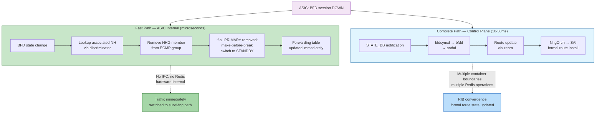
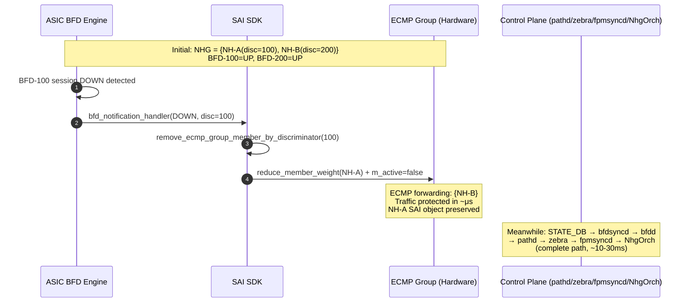
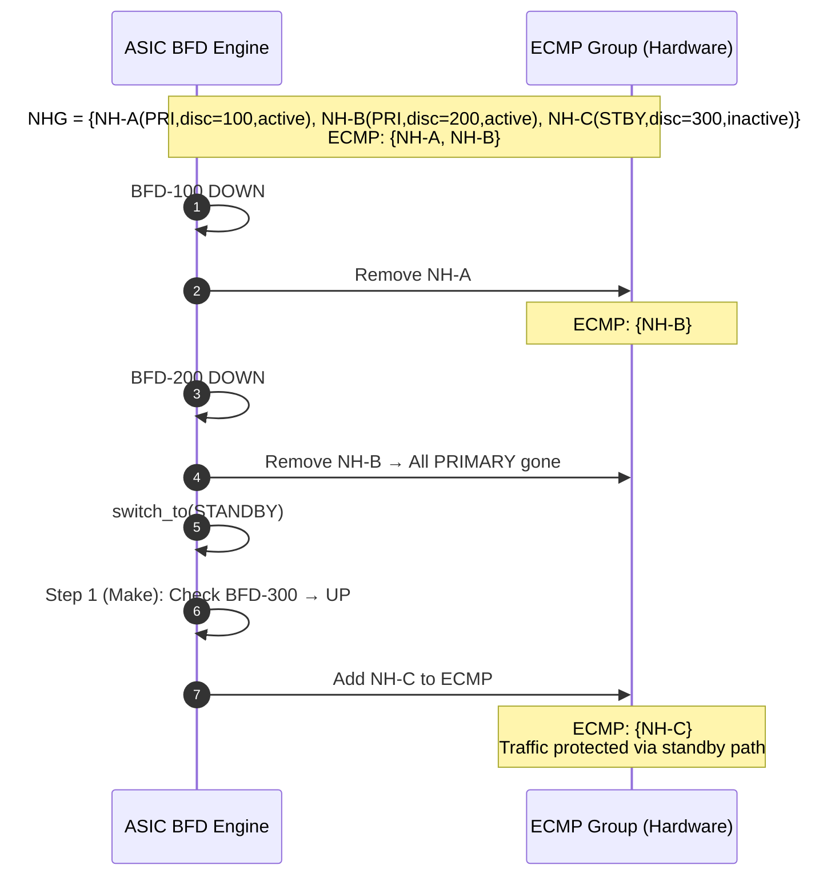
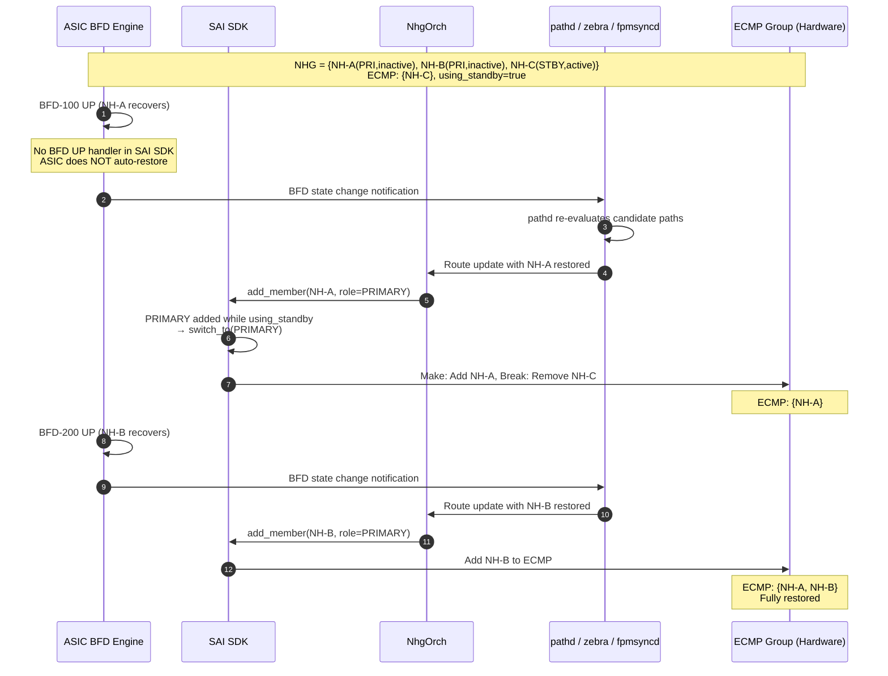

# SAI-Level BFD-Coupled Next Hop Group Fast Switchover
## High Level Design Document
### Rev 0.1

# Table of Contents

  * [Revision](#revision)
  * [About this Manual](#about-this-manual)
  * [Scope](#scope)
  * [Definitions/Abbreviation](#definitionsabbreviation)
  * [1 Motivation](#1-motivation)
    * [1.1 Problem Statement](#11-problem-statement)
    * [1.2 Convergence Bottleneck Analysis](#12-convergence-bottleneck-analysis)
  * [2 Requirements](#2-requirements)
    * [2.1 Functional Requirements](#21-functional-requirements)
    * [2.2 Non-Functional Requirements](#22-non-functional-requirements)
  * [3 Architecture Design](#3-architecture-design)
    * [3.1 Overall Architecture](#31-overall-architecture)
    * [3.2 Dual-Path Convergence Model](#32-dual-path-convergence-model)
  * [4 SAI Attribute Specification](#4-sai-attribute-specification)
    * [4.1 SAI_NEXT_HOP_ATTR_BFD_DISCRIMINATOR](#41-sai_next_hop_attr_bfd_discriminator)
    * [4.2 SAI_NEXT_HOP_GROUP_MEMBER_ATTR_CONFIGURED_ROLE](#42-sai_next_hop_group_member_attr_configured_role)
    * [4.3 ASIC Behavioral Specification](#43-asic-behavioral-specification)
  * [5 SONiC Control Plane Changes](#5-sonic-control-plane-changes)
    * [5.1 Data Flow Overview](#51-data-flow-overview)
    * [5.2 fpmsyncd Changes](#52-fpmsyncd-changes)
    * [5.3 NhgOrch Changes](#53-nhgorch-changes)
    * [5.4 Srv6Orch Changes](#54-srv6orch-changes)
    * [5.5 BfdOrch Interaction](#55-bfdorch-interaction)
  * [6 Database Schema](#6-database-schema)
    * [6.1 APPL_DB](#61-appl_db)
  * [7 SAI SDK Implementation Reference](#7-sai-sdk-implementation-reference)
    * [7.1 Next Hop BFD Discriminator Storage](#71-next-hop-bfd-discriminator-storage)
    * [7.2 BFD DOWN Event Handler](#72-bfd-down-event-handler)
    * [7.3 Primary/Standby Role Switchover](#73-primarystandby-role-switchover)
    * [7.4 NHG Member Add with Role Awareness](#74-nhg-member-add-with-role-awareness)
  * [8 Fast Switchover Flow Examples](#8-fast-switchover-flow-examples)
    * [8.1 Basic ECMP Member Removal](#81-basic-ecmp-member-removal)
    * [8.2 Primary to Standby Switchover](#82-primary-to-standby-switchover)
    * [8.3 Recovery via Control Plane](#83-recovery-via-control-plane)
  * [9 Configuration and Management](#9-configuration-and-management)
    * [9.1 SR-TE Policy Configuration](#91-sr-te-policy-configuration)
    * [9.2 Show Commands](#92-show-commands)
  * [10 Warm Restart](#10-warm-restart)
  * [11 Limitations and Constraints](#11-limitations-and-constraints)
  * [12 Test Requirements](#12-test-requirements)
  * [13 References](#13-references)

# Revision

| Rev | Date       | Author       | Change Description                           |
|:---:|:----------:|:------------:|----------------------------------------------|
| 0.1 | 2026-06-08 | Kang Jiang   | Initial version                              |

# About this Manual

This document describes the design of **SAI-level BFD-coupled Next Hop Group (NHG) fast switchover**, a convergence acceleration mechanism that enables ASIC hardware to autonomously remove ECMP group members when BFD sessions go DOWN — without any control plane involvement in the data-plane switchover path. BFD UP recovery is driven by the control plane to respect routing protocol stability policies.

This feature extends the existing BFD hardware offload infrastructure ([BFD HW Offload HLD](https://github.com/sonic-net/SONiC/blob/master/doc/bfd/BFD%20HW%20Offload%20HLD.md)) and is designed to work with both classic BFD and Seamless BFD (SBFD) sessions.

# Scope

This document covers:
- A new SAI attribute `SAI_NEXT_HOP_ATTR_BFD_DISCRIMINATOR` that couples a next hop with a BFD session
- ASIC behavioral specification for autonomous ECMP member management based on BFD state
- Primary/standby role-based NHG member switchover using `SAI_NEXT_HOP_GROUP_MEMBER_ATTR_CONFIGURED_ROLE`
- SONiC control plane changes (fpmsyncd, NhgOrch, Srv6Orch, BfdOrch) to carry discriminator and role through the routing pipeline
- SAI SDK implementation reference for the fast switchover logic

This document does not cover:
- BFD or SBFD session creation, lifecycle, or hardware offload (see [BFD HW Offload HLD](https://github.com/sonic-net/SONiC/blob/master/doc/bfd/BFD%20HW%20Offload%20HLD.md) and [SBFD HW Offload HLD](SBFD_HW_Offload_HLD.md))
- SR-TE Policy internal design (pathd candidate path selection)
- SRv6 data plane implementation
- Non-SRv6 use cases (though the SAI attribute is generic and applicable to any next hop type)

# Definitions/Abbreviation

| Term            | Definition                                                                                         |
|-----------------|----------------------------------------------------------------------------------------------------|
| BFD             | Bidirectional Forwarding Detection (RFC 5880)                                                     |
| SBFD            | Seamless Bidirectional Forwarding Detection (RFC 7880)                                            |
| NHG             | Next Hop Group — a set of next hops forming an ECMP group                                         |
| ECMP            | Equal-Cost Multi-Path — traffic distribution across multiple equal-cost paths                      |
| Discriminator   | Unique identifier for a BFD/SBFD session endpoint (RFC 5880 §4.1)                                |
| SAI             | Switch Abstraction Interface                                                                       |
| ASIC            | Application Specific Integrated Circuit                                                            |
| SRv6            | Segment Routing over IPv6 (RFC 8986)                                                              |
| SR-TE           | Segment Routing Traffic Engineering                                                                |
| pathd           | FRR daemon managing SR-TE Policies                                                                 |
| fpmsyncd        | FPM (Forwarding Plane Manager) synchronization daemon in SONiC                                     |
| NhgOrch         | Next Hop Group Orchestration agent in SONiC SWSS                                                   |
| Srv6Orch        | SRv6 Orchestration agent in SONiC SWSS                                                             |
| BfdOrch         | BFD Orchestration agent in SONiC SWSS                                                              |
| Make-before-break | Switchover strategy that activates the new path before deactivating the old one                   |

# 1 Motivation

## 1.1 Problem Statement

In networks using SRv6 SR-TE policies with BFD/SBFD-based path monitoring, when a BFD session detects a path failure, traffic must be switched to a surviving path as quickly as possible. The current SONiC architecture requires the failure signal to traverse a lengthy control plane path before the forwarding table is updated:

```
ASIC (BFD DOWN)
  → SAI notification callback
  → BFDOrch (STATE_DB update)
  → bfdsyncd (BFD_STATE_CHANGE)
  → bfdd (session state machine)
  → pathd (candidate path re-evaluation)
  → zebra (route update)
  → fpmsyncd (APPL_DB route update)
  → RouteOrch / NhgOrch (SAI next hop group update)
  → ASIC (forwarding table updated)
```

This path involves multiple Redis operations, container boundary crossings (BGP container ↔ SWSS container), and daemon processing delays. Even with sub-second BFD detection intervals, the end-to-end convergence time can be tens to hundreds of milliseconds — unacceptable for latency-sensitive applications.

## 1.2 Convergence Bottleneck Analysis

| Stage | Typical Latency | Bottleneck |
|-------|----------------|------------|
| BFD detection | 3 × interval (e.g., 300ms @ 100ms interval) | Configurable, not the focus here |
| SAI notification → BFDOrch | < 1ms | Fast (in-process callback) |
| BFDOrch → STATE_DB → bfdsyncd | 1–5ms | Redis publish + subscribe |
| bfdsyncd → bfdd (Unix socket) | < 1ms | Fast |
| bfdd → pathd (ZAPI) | < 1ms | Fast |
| pathd re-evaluation + route update | 1–10ms | Path selection algorithm |
| zebra → fpmsyncd → APPL_DB | 1–5ms | Netlink + Redis |
| NhgOrch → SAI | 1–5ms | Orchagent processing |
| **Total control plane convergence** | **~10–30ms** | **Multiple IPC hops** |

The key insight is that the ASIC already knows the BFD session state (it runs the BFD state machine in hardware) and already has the next hop group membership. If the ASIC could directly map a BFD session DOWN event to the removal of the corresponding ECMP member, the switchover would complete in hardware within microseconds — orders of magnitude faster than the control plane path.

# 2 Requirements

## 2.1 Functional Requirements

| ID   | Requirement                                                                                                   |
|------|---------------------------------------------------------------------------------------------------------------|
| FR-1 | Define a new SAI attribute `SAI_NEXT_HOP_ATTR_BFD_DISCRIMINATOR` to associate a next hop with a BFD session via the BFD local discriminator |
| FR-2 | When a BFD session transitions to DOWN, the ASIC must autonomously remove the associated NHG members from ECMP forwarding without control plane involvement |
| FR-3 | When a BFD session transitions to UP, the control plane (pathd → zebra → fpmsyncd → NhgOrch) drives NHG member restoration; the ASIC does not autonomously restore members |
| FR-4 | Support primary/standby role-based NHG member switchover using make-before-break semantics |
| FR-5 | The control plane must carry the BFD discriminator from pathd through fpmsyncd → NhgOrch → Srv6Orch → SAI |
| FR-6 | The control plane must carry the NHG member role (primary/standby) from pathd through fpmsyncd → NhgOrch → SAI |
| FR-7 | Support dynamic update of `BFD_DISCRIMINATOR` on an existing next hop (CREATE_AND_SET) |
| FR-8 | Support dynamic update of `CONFIGURED_ROLE` on an existing NHG member |
| FR-9 | The fast path (ASIC-internal) and complete path (control plane) must run in parallel and eventually converge |

## 2.2 Non-Functional Requirements

| ID    | Requirement                                                                                   |
|-------|-----------------------------------------------------------------------------------------------|
| NFR-1 | Fast path switchover must complete within the ASIC without any software IPC or Redis operations |
| NFR-2 | The feature must be backward compatible — next hops with `BFD_DISCRIMINATOR = 0` must behave identically to existing next hops |
| NFR-3 | The feature must work with both classic BFD and SBFD sessions |
| NFR-4 | No additional ASIC resources beyond the existing BFD session pool and ECMP group entries |

# 3 Architecture Design

## 3.1 Overall Architecture

```
                            ┌─────────────────────────────────────────────┐
                            │                 ASIC                        │
                            │                                             │
                            │  ┌──────────┐    discriminator    ┌──────┐  │
                            │  │ BFD      │◄═══════════════════►│ ECMP │  │
                            │  │ Engine   │   association via    │Group │  │
                            │  │          │   BFD_DISCRIMINATOR  │      │  │
                            │  └────┬─────┘                     └──┬───┘  │
                            │       │ state change                 │      │
                            │       │ (UP/DOWN)                    │      │
                            │       ▼                              ▼      │
                            │  ┌─────────────────────────────────────┐    │
                            │  │  Hardware Fast Switchover Logic     │    │
                            │  │  - Remove member on BFD DOWN       │    │
                            │  │  - Primary/Standby make-before-    │    │
                            │  │    break switchover                │    │
                            │  └─────────────────────────────────────┘    │
                            └─────────────────────────────────────────────┘
                                          ▲               ▲
                                          │               │
                              SAI BFD API │               │ SAI NHG API
                                          │               │
                            ┌─────────────┴───────────────┴───────────────┐
                            │              SWSS (Orchagent)                │
                            │                                             │
                            │  BfdOrch        NhgOrch ──► Srv6Orch       │
                            │     │              │           │            │
                            │     │ BFD state    │ route     │ create NH  │
                            │     │ notify       │ update    │ with disc  │
                            │     ▼              ▼           ▼            │
                            │  [STATE_DB      [Add/remove  [Set BFD_DISC  │
                            │   update]        members]     on next hop]  │
                            └─────────────────────────────────────────────┘
                                          ▲
                                          │  APPL_DB
                            ┌─────────────┴───────────────────────────────┐
                            │              fpmsyncd                        │
                            │  parse_encap_seg6() extracts:               │
                            │  - discriminator from seg6_iptunnel_encap   │
                            │  - role (primary/standby) from nha_grp      │
                            └─────────────────────────────────────────────┘
                                          ▲
                                          │  Netlink / FPM
                            ┌─────────────┴───────────────────────────────┐
                            │     FRR (pathd / zebra)                      │
                            │  pathd embeds BFD discriminator + role       │
                            │  in route's SRv6 encap attributes            │
                            └──────────────────────────────────────────────┘
```

## 3.2 Dual-Path Convergence Model

When a BFD session goes DOWN, two convergence paths execute in parallel:



Both paths eventually converge: once the control plane route update completes, the SAI-level fast switchover state is overwritten by the formal routing table state. The fast path provides immediate traffic protection; the complete path ensures RIB/FIB consistency.

# 4 SAI Attribute Specification

## 4.1 SAI_NEXT_HOP_ATTR_BFD_DISCRIMINATOR

A new attribute added to the `sai_next_hop_attr_t` enumeration:

```c
/**
 * @brief BFD discriminator for next hop protection
 *
 * Associate a BFD session with this next hop by specifying the BFD
 * session's local discriminator. When non-zero, the ASIC MUST monitor
 * the corresponding BFD session and autonomously update ECMP forwarding
 * when the session state changes (see §4.3 for behavioral requirements).
 *
 * A value of 0 (default) means no BFD monitoring — the next hop behaves
 * identically to a standard next hop with no BFD association.
 *
 * @type sai_uint32_t
 * @flags CREATE_AND_SET
 * @default 0
 */
SAI_NEXT_HOP_ATTR_BFD_DISCRIMINATOR
```

Key design decisions:
- **CREATE_AND_SET**: The discriminator can be set at creation time or updated dynamically. This is necessary because the control plane may learn the BFD discriminator after the next hop has already been created (e.g., when a route is installed before the BFD session is established).
- **Discriminator-based association** (not OID-based): Using the BFD local discriminator rather than the SAI BFD session OID decouples next hop creation from BFD session creation ordering. The ASIC caches the association and activates it when the BFD session is subsequently created.
- **Generic applicability**: While the primary use case is SRv6 next hops, the attribute is defined on all next hop types for future extensibility.

## 4.2 SAI_NEXT_HOP_GROUP_MEMBER_ATTR_CONFIGURED_ROLE

An existing SAI attribute used to mark the protection role of an NHG member:

```c
/**
 * @brief Configured role in the protection group
 *
 * @type sai_next_hop_group_member_configured_role_t
 * @flags CREATE_AND_SET
 * @default SAI_NEXT_HOP_GROUP_MEMBER_CONFIGURED_ROLE_PRIMARY
 */
SAI_NEXT_HOP_GROUP_MEMBER_ATTR_CONFIGURED_ROLE
```

Possible values:
- `SAI_NEXT_HOP_GROUP_MEMBER_CONFIGURED_ROLE_PRIMARY` — Member is in the primary group; actively forwarding when all primary members are healthy.
- `SAI_NEXT_HOP_GROUP_MEMBER_CONFIGURED_ROLE_STANDBY` — Member is in the standby group; only activated when all primary members have failed.

## 4.3 ASIC Behavioral Specification

When a next hop has a non-zero `BFD_DISCRIMINATOR`, the ASIC must implement the following behaviors. The goal is to sink the current SAI SDK-level software fast switchover logic into ASIC hardware/firmware, natively implemented by the chip vendor.

### 4.3.1 Association Establishment

When creating or updating a next hop with a non-zero `BFD_DISCRIMINATOR`, the ASIC looks up the locally existing BFD session (classic BFD or SBFD) via the discriminator value, establishing a monitoring relationship. If the BFD session has not yet been created, the ASIC should cache the association and automatically activate it when the BFD session is subsequently created.

### 4.3.2 BFD DOWN — ECMP Member Removal

When a monitored BFD session transitions to DOWN, the ASIC must execute:

```
For each NHG containing a member whose next-hop references this BFD session:
    Remove the member from the ECMP group's forwarding table
    Mark the member as inactive

    If all PRIMARY members in this NHG have become inactive
       AND STANDBY members exist:
        Execute switch_to(STANDBY)   // §4.3.3
```

This operation must be completed at the ASIC hardware level without any software IPC or Redis operations.

### 4.3.3 Primary/Standby Switchover (Make-Before-Break)

When switching from PRIMARY to STANDBY (or vice versa), the ASIC must follow the **make-before-break** order to ensure no forwarding interruption:

```
switch_to(target_role):
    Step 1 — Make: Add target_role members to ECMP forwarding
        For each member with configured_role == target_role:
            If member has an associated BFD discriminator:
                Check if the corresponding BFD session is UP
                Only add when BFD is UP (avoid activating a failed standby)
            Else:
                Add directly (no BFD protection)

    Step 2 — Break: Remove non-target_role members from ECMP forwarding
        For each member with configured_role != target_role:
            Remove from ECMP forwarding
            Mark as inactive
```

### 4.3.4 BFD UP — Restore Forwarding

When a BFD session transitions to UP, the ASIC does **not** autonomously restore the associated NHG members. Restoration is driven entirely by the control plane:

```
BFD session UP
  → SAI notification → BfdOrch → STATE_DB
  → bfdsyncd → bfdd → pathd (re-evaluates candidate paths)
  → zebra (route update with restored next hops)
  → fpmsyncd → APPL_DB
  → NhgOrch re-adds the NHG members via SAI
```

This design deliberately leaves BFD UP recovery to the control plane so that routing protocol stability policies (e.g., route flap damping, hold-off timers) are respected. The ASIC does not re-add members on BFD UP to avoid blackholing traffic on a flapping link.

### 4.3.5 No Association

When `BFD_DISCRIMINATOR` is 0 or not set, the next hop behaves identically to an existing next hop — it does not participate in any BFD-coupled logic.

### 4.3.6 Complete Fast Switchover Example

```
Initial state:
  NHG = {
    NH-A (PRIMARY, disc=100, active),
    NH-B (PRIMARY, disc=200, active),
    NH-C (STANDBY, disc=300, inactive)
  }
  BFD-100=UP, BFD-200=UP, BFD-300=UP
  ECMP forwarding: {NH-A, NH-B}

Event 1: BFD-100 DOWN
  → ASIC removes NH-A from ECMP
  → NHG = { NH-A(inactive), NH-B(active), NH-C(inactive) }
  → ECMP forwarding: {NH-B}

Event 2: BFD-200 DOWN
  → ASIC removes NH-B from ECMP
  → All PRIMARY removed → switch_to(STANDBY)
    Step 1 (Make): Add NH-C (BFD-300=UP → allowed)
    Step 2 (Break): No non-STANDBY active members to remove
  → NHG = { NH-A(inactive), NH-B(inactive), NH-C(active) }
  → ECMP forwarding: {NH-C}

Event 3: BFD-100 UP
  → ASIC does NOT auto-restore (no BFD UP handler in SAI SDK)
  → Control plane path: pathd re-evaluates → zebra → fpmsyncd → NhgOrch
  → NhgOrch re-adds NH-A as PRIMARY member via SAI
  → SAI SDK add_member() detects PRIMARY added while using_standby
    → Triggers switch_to(PRIMARY) with make-before-break
  → NHG = { NH-A(active), NH-B(inactive), NH-C(inactive) }
  → ECMP forwarding: {NH-A}

Event 4: BFD-200 UP
  → Control plane path: pathd → zebra → fpmsyncd → NhgOrch
  → NhgOrch re-adds NH-B as PRIMARY member via SAI
  → NHG = { NH-A(active), NH-B(active), NH-C(inactive) }
  → ECMP forwarding: {NH-A, NH-B}   // Restored to initial state
```

# 5 SONiC Control Plane Changes

## 5.1 Data Flow Overview

The BFD discriminator and member role flow through the SONiC pipeline as follows:

```
pathd (route encap carries discriminator + role)
  → zebra (ZAPI route update)
  → fpmsyncd: parse_encap_seg6() extracts discriminator
              parse nha_grp[].resvd1 extracts role
  → APPL_DB ROUTE_TABLE / NEXTHOP_GROUP_TABLE:
      "discriminator" field (comma-separated, one per member)
      "role" field (comma-separated, "primary" or "standby" per member)
  → NhgOrch: NextHopGroupKey parses into NextHopKey.srv6_bfd_disc and NextHopKey.primary
  → Srv6Orch: Sets SAI_NEXT_HOP_ATTR_BFD_DISCRIMINATOR on next hop creation
  → NhgOrch: Sets SAI_NEXT_HOP_GROUP_MEMBER_ATTR_CONFIGURED_ROLE on member creation
              Dynamically updates discriminator and role on route changes
```

## 5.2 fpmsyncd Changes

### 5.2.1 Discriminator Extraction

`fpmsyncd/routesync.cpp` is extended to extract the BFD discriminator from the SRv6 tunnel encapsulation attributes received via Netlink/FPM:

```cpp
// routesync.cpp — parse_encap_seg6()
void RouteSync::parse_encap_seg6(struct rtattr *tb,
    struct in6_addr *segs, struct in6_addr *src,
    char *segment_name, uint32_t *discriminator)
{
    // ... existing SRv6 segment list parsing ...

    struct seg6_iptunnel_encap *ipt;
    ipt = (struct seg6_iptunnel_encap *)RTA_DATA(tb);
    *discriminator = ipt->discriminator;
}
```

### 5.2.2 Role Extraction

fpmsyncd extracts the member role from the `nha_grp` structure's reserved field:

```cpp
// routesync.cpp — Netlink next hop group parsing
string role_list;
for (int i = 0; i < grp_count; i++) {
    if (i) role_list += NHG_DELIMITER;
    role_list += nha_grp[i].resvd1 ? "standby" : "primary";
}
fvVector.emplace_back("role", role_list);
```

### 5.2.3 APPL_DB Entry

Both fields are written to APPL_DB as comma-separated strings:

```
ROUTE_TABLE:prefix
    "nexthop": "nh1,nh2,nh3"
    "discriminator": "100,200,300"
    "role": "primary,primary,standby"
```

## 5.3 NhgOrch Changes

### 5.3.1 NextHopKey Extension

`NextHopKey` is extended with two new fields:

```cpp
struct NextHopKey {
    // ... existing fields ...
    uint32_t srv6_bfd_disc;  // BFD discriminator for this next hop
    bool     primary;        // true=PRIMARY, false=STANDBY
};
```

### 5.3.2 NextHopGroupKey Parsing

`NextHopGroupKey` constructor parses the discriminator string:

```cpp
NextHopGroupKey(const string &nexthops, bool overlay_nh, bool srv6_nh,
                const string& weights, const string& discriminators)
{
    auto nhv = tokenize(nexthops, NHG_DELIMITER);
    auto discv = tokenize(discriminators, NHG_DELIMITER);
    bool set_disc = discv.size() == nhv.size();

    for (uint32_t i = 0; i < nhv.size(); i++) {
        auto nh = NextHopKey(nhv[i], overlay_nh, srv6_nh);
        nh.srv6_bfd_disc = set_disc ? to_uint<uint32_t>(discv[i]) : 0;
        m_nexthops.insert(nh);
    }
}
```

### 5.3.3 NHG Member Role Setting

When creating NHG members, NhgOrch sets the `CONFIGURED_ROLE` attribute:

```cpp
// nhgorch.cpp — NHG member creation
if (nhgm.isPrimary()) {
    nhgm_attr.id = SAI_NEXT_HOP_GROUP_MEMBER_ATTR_CONFIGURED_ROLE;
    nhgm_attr.value.u32 = SAI_NEXT_HOP_GROUP_MEMBER_CONFIGURED_ROLE_PRIMARY;
    nhgm_attrs.push_back(nhgm_attr);
} else {
    nhgm_attr.id = SAI_NEXT_HOP_GROUP_MEMBER_ATTR_CONFIGURED_ROLE;
    nhgm_attr.value.u32 = SAI_NEXT_HOP_GROUP_MEMBER_CONFIGURED_ROLE_STANDBY;
    nhgm_attrs.push_back(nhgm_attr);
}
```

### 5.3.4 Dynamic Discriminator Update

When a route update changes the discriminator but the next hop itself remains unchanged (singleton NHG), NhgOrch dynamically updates the SAI attribute:

```cpp
// nhgorch.cpp — NextHopGroup::updateSrv6BfdDisc()
void NextHopGroup::updateSrv6BfdDisc(const NextHopGroupKey& nhg_key)
{
    m_key = nhg_key;
    if (isSynced()) {
        sai_attribute_t attr;
        attr.id = SAI_NEXT_HOP_ATTR_BFD_DISCRIMINATOR;
        attr.value.u32 = m_key.getNextHops().begin()->srv6_bfd_disc;
        sai_next_hop_api->set_next_hop_attribute(getId(), &attr);
    }
}
```

### 5.3.5 Dynamic Role Update

When a route update changes a member's role, NhgOrch dynamically updates via `set_next_hop_group_member_attribute`:

```cpp
// nhgorch.cpp — NextHopGroupMember::updateRole()
bool NextHopGroupMember::updateRole(bool primary)
{
    m_key.primary = primary;
    if (isSynced()) {
        sai_attribute_t nhgm_attr;
        nhgm_attr.id = SAI_NEXT_HOP_GROUP_MEMBER_ATTR_CONFIGURED_ROLE;
        nhgm_attr.value.u32 = primary
            ? SAI_NEXT_HOP_GROUP_MEMBER_CONFIGURED_ROLE_PRIMARY
            : SAI_NEXT_HOP_GROUP_MEMBER_CONFIGURED_ROLE_STANDBY;
        sai_next_hop_group_api->set_next_hop_group_member_attribute(
            m_gm_id, &nhgm_attr);
    }
    return true;
}
```

## 5.4 Srv6Orch Changes

When Srv6Orch creates an SRv6-type next hop, if the `NextHopKey` contains a non-zero `srv6_bfd_disc`, it appends the `SAI_NEXT_HOP_ATTR_BFD_DISCRIMINATOR` attribute:

```cpp
// srv6orch.cpp — createSrv6Nexthop()
if (nh.srv6_bfd_disc) {
    attr.id = SAI_NEXT_HOP_ATTR_BFD_DISCRIMINATOR;
    attr.value.u32 = nh.srv6_bfd_disc;
    nh_attrs.push_back(attr);
}
sai_next_hop_api->create_next_hop(&nexthop_id, gSwitchId,
    nh_attrs.size(), nh_attrs.data());
```

## 5.5 BfdOrch Interaction

BfdOrch does not directly interact with NhgOrch for BFD-coupled fast switchover. On BFD DOWN, BfdOrch handles BFD session teardown and state notification via the existing path:

```cpp
// bfdorch.cpp — BFD DOWN notification handler
if (SAI_BFD_SESSION_STATE_DOWN == status) {
    if (!removeBfdPeer(DBkey)) {
        SWSS_LOG_ERROR("removeBfdPeer key:%s failed in down notify", DBkey.c_str());
    }
}
updateBfdSessionStatus(DBkey, status);
```

The BFD state change propagates through the existing control plane path (STATE_DB → bfdsyncd → bfdd → pathd) to trigger route re-evaluation. NHG member updates are handled by NhgOrch when the updated route arrives via fpmsyncd.

The fast switchover (ECMP member removal on BFD DOWN) is handled entirely within the SAI SDK layer (see §7.2), not by NhgOrch or BfdOrch.

# 6 Database Schema

## 6.1 APPL_DB

### ROUTE_TABLE / NEXTHOP_GROUP_TABLE (extended)

Two new fields are added to carry the BFD discriminator and member role:

```
ROUTE_TABLE:{{prefix}}
    ; existing fields ...
    "discriminator"     : {{uint32_csv}}     ; Comma-separated BFD discriminators, one per next hop
                                             ; "0" means no BFD association for that member
                                             ; e.g., "100,200,300"
    "role"              : {{role_csv}}        ; Comma-separated roles, one per next hop
                                             ; "primary" or "standby"
                                             ; e.g., "primary,primary,standby"
```

# 7 SAI SDK Implementation Reference

This section describes the reference implementation in the SAI SDK layer (vendor SAI adapter), serving as guidance for ASIC vendors who wish to implement the hardware-native fast switchover.

## 7.1 Next Hop BFD Discriminator Storage

The SAI SDK stores the BFD discriminator in the next hop entry:

```cpp
// sai_next_hop.h
struct next_hop_entry {
    // ... existing fields ...
    la_bfd_discriminator m_bfd_discriminator = 0;
};
```

On next hop creation, the discriminator is extracted from attributes:

```cpp
// sai_next_hop.cpp — do_create_next_hop()
get_attrs_value(SAI_NEXT_HOP_ATTR_BFD_DISCRIMINATOR, attrs,
                nh_entry.m_bfd_discriminator, false);
```

Dynamic update is supported via `set_next_hop_attribute`:

```cpp
// sai_next_hop.cpp — attr_set_152()
case SAI_NEXT_HOP_ATTR_BFD_DISCRIMINATOR: {
    next_hop_entry* nh_entry = ...;
    nh_entry->m_bfd_discriminator = new_discriminator_value;
    return SAI_STATUS_SUCCESS;
}
```

## 7.2 BFD DOWN Event Handler

When the BFD engine detects a session DOWN, the notification handler triggers ECMP member removal:

```cpp
// sai_device.cpp — bfd_notification_handler()
if (session_state == SAI_BFD_SESSION_STATE_DOWN) {
    remove_ecmp_group_member_by_discriminator(
        notification_desc.u.bfd.local_discriminator);
}
```

The removal function iterates all NHG members to find those referencing next hops with the matching discriminator:

```cpp
// sai_device.cpp
sai_status_t lsai_device::remove_ecmp_group_member_by_discriminator(
    la_bfd_discriminator discriminator)
{
    if (!discriminator) return SAI_STATUS_SUCCESS;

    // Step 1: Find all next hops with this discriminator
    std::vector<sai_object_id_t> nhs;
    for (auto pair : m_next_hops.map()) {
        if (pair.second.m_bfd_discriminator == discriminator) {
            nhs.push_back(pair.second.m_nexthop_oid);
        }
    }

    // Step 2: For each NHG member referencing these NHs, remove from ECMP
    for (auto& pair : m_next_hop_group_members.map()) {
        if (!pair.second.m_active) continue;

        for (auto nh : nhs) {
            if (pair.second.m_nexthop_oid == nh) {
                auto nhg_ptr = get_nhg(pair.second.m_group_oid);

                // If this is the last active PRIMARY member, switch to STANDBY
                if (!nhg_ptr->using_standby
                    && nhg_ptr->m_valid_members.size() == 1
                    && nhg_ptr->m_valid_members.count(pair.second.m_oid)) {
                    nhg_ptr->switch_to(
                        SAI_NEXT_HOP_GROUP_MEMBER_CONFIGURED_ROLE_STANDBY);
                    break;
                }

                // Otherwise, just remove this member
                nhg_ptr->reduce_member_weight(nh_entry, pair.second.m_weight);
                // Handle SRv6 overlay updates if needed
                if (nhg_ptr->m_is_srv6 && nh_entry->type == SAI_NEXT_HOP_TYPE_SRV6_SIDLIST) {
                    m_srv6_handler->overlay_nhgrp_member_update(
                        ecmp_grp, nh_entry, REMOVE, txn);
                }
                nhg_ptr->m_valid_members.erase(pair.second.m_oid);
                pair.second.m_active = false;
                break;
            }
        }
    }
    return SAI_STATUS_SUCCESS;
}
```

## 7.3 Primary/Standby Role Switchover

The `switch_to()` method implements make-before-break semantics:

```cpp
// sai_next_hop_group_ecmp.cpp
sai_status_t lsai_next_hop_group_ecmp::switch_to(
    sai_next_hop_group_member_configured_role_t role)
{
    using_standby = (role == SAI_NEXT_HOP_GROUP_MEMBER_CONFIGURED_ROLE_STANDBY);

    auto to_be_removed = m_valid_members;  // snapshot current active set

    // Step 1 — Make: Add members of the target role
    for (const auto& nhgm_oid : m_members) {
        auto gm = get_member(nhgm_oid);
        if (gm->m_configured_role != role) continue;
        if (m_valid_members.count(nhgm_oid)) continue;  // already active

        auto nh_entry = get_nh(gm->m_nexthop_oid);

        // Only add if BFD is UP (or no BFD association)
        if (!nh_entry->m_bfd_discriminator
            || m_bfd_handler->is_bfd_session_up(nh_entry->m_bfd_discriminator))
        {
            add_member_weight(nh_entry, gm->m_weight);
            // Handle SRv6 overlay if needed
            m_valid_members.insert(nhgm_oid);
            gm->m_active = true;
        }
    }

    // Step 2 — Break: Remove members of the non-target role
    for (const auto& nhgm_oid : to_be_removed) {
        auto gm = get_member(nhgm_oid);
        if (gm->m_configured_role != role) {
            reduce_member_weight(get_nh(gm->m_nexthop_oid), gm->m_weight);
            // Handle SRv6 overlay if needed
            m_valid_members.erase(nhgm_oid);
            gm->m_active = false;
        }
    }

    return SAI_STATUS_SUCCESS;
}
```

## 7.4 NHG Member Add with Role Awareness

When adding a new member to an ECMP group, the role is considered:

```cpp
// sai_next_hop_group_ecmp.cpp — add_member()
get_attrs_value(SAI_NEXT_HOP_GROUP_MEMBER_ATTR_CONFIGURED_ROLE, attrs,
                gm.m_configured_role, false);

// If active primary members exist and new member is STANDBY, don't add to forwarding
if (!m_valid_members.empty() && !using_standby
    && gm.m_configured_role == SAI_NEXT_HOP_GROUP_MEMBER_CONFIGURED_ROLE_STANDBY)
{
    gm.m_active = false;
}
else
{
    add_member_weight(nh_entry, type, gm.m_weight);
    // Handle SRv6 overlay if needed

    // If currently using standby and a PRIMARY member is added, switch back
    if (using_standby
        && gm.m_configured_role == SAI_NEXT_HOP_GROUP_MEMBER_CONFIGURED_ROLE_PRIMARY)
    {
        switch_to(SAI_NEXT_HOP_GROUP_MEMBER_CONFIGURED_ROLE_PRIMARY);
    }

    m_valid_members.insert(member_oid);
    gm.m_active = true;
}
```

# 8 Fast Switchover Flow Examples

## 8.1 Basic ECMP Member Removal



## 8.2 Primary to Standby Switchover



## 8.3 Recovery via Control Plane



# 9 Configuration and Management

## 9.1 SR-TE Policy Configuration

The BFD discriminator and member role are automatically carried by SR-TE policies. No separate configuration is needed for the fast switchover feature — it is activated whenever a next hop is created with a non-zero BFD discriminator.

**pathd side:** When an SR-TE policy has BFD/SBFD enabled, pathd embeds the BFD session's local discriminator into the route's SRv6 encapsulation attributes. The member role (primary/standby) is determined by the candidate path selection and is carried in the next hop group attributes.

**Example SR-TE policy with SBFD and multiple candidate paths:**

```
segment-routing
 traffic-eng
  policy color 100 endpoint 200::D
   sbfd enable remote 456 3 source-address 200::A

   candidate-path preference 200 name primary-path explicit segment-list sl-primary
   candidate-path preference 100 name backup-path explicit segment-list sl-backup
  !
 !
```

When pathd installs routes for this policy, it will:
1. Set the BFD discriminator on each next hop (from the SBFD session associated with each segment list)
2. Set the role based on candidate path preference (higher preference = PRIMARY, lower = STANDBY)

## 9.2 Show Commands

### Verification via SAI attributes

The BFD discriminator and role associations can be verified through standard SONiC debugging tools:

```bash
# Check next hop BFD discriminator in ASIC_DB
redis-cli -n 1 HGETALL "ASIC_STATE:SAI_OBJECT_TYPE_NEXT_HOP:<oid>"
# Look for SAI_NEXT_HOP_ATTR_BFD_DISCRIMINATOR

# Check NHG member configured role in ASIC_DB
redis-cli -n 1 HGETALL "ASIC_STATE:SAI_OBJECT_TYPE_NEXT_HOP_GROUP_MEMBER:<oid>"
# Look for SAI_NEXT_HOP_GROUP_MEMBER_ATTR_CONFIGURED_ROLE

# Check discriminator in APPL_DB route
redis-cli -n 0 HGETALL "ROUTE_TABLE:<prefix>"
# Look for "discriminator" and "role" fields
```

# 10 Warm Restart

During warm restart:
- SAI next hop objects with `BFD_DISCRIMINATOR` are preserved in the ASIC.
- BFD sessions in hardware continue to run and maintain state.
- The BFD-to-NHG coupling in the ASIC is preserved across warm restart since both the BFD sessions and next hops remain in hardware.
- After warm restart completes, the control plane reconciles the discriminator and role state from APPL_DB, ensuring consistency.

# 11 Limitations and Constraints

| Limitation | Description |
|-----------|-------------|
| ASIC support required | The ASIC must support `SAI_NEXT_HOP_ATTR_BFD_DISCRIMINATOR` and the associated behavioral specification (§4.3). The current SAI SDK layer (§7) provides the fast switchover logic in software; the goal is to sink this logic into ASIC hardware/firmware for native implementation. |
| SRv6 primary use case | While `BFD_DISCRIMINATOR` is defined generically, the current SONiC implementation only carries it for SRv6 next hops. Extension to other next hop types requires additional fpmsyncd/NhgOrch changes. |
| Discriminator uniqueness | The BFD discriminator must be unique per device. If two different BFD sessions on the same device have the same discriminator, the behavior is undefined. |
| BFD session ordering | If the next hop is created before the BFD session, the ASIC must cache the discriminator association and activate it when the BFD session is created. Not all ASIC implementations may support this lazy binding. |
| Standby member BFD check | When switching to standby, the ASIC must check whether the standby member's BFD session is UP before activating it. This prevents switching to a failed standby path. |
| Single standby group | The current design supports one level of protection (PRIMARY → STANDBY). Nested or multi-tier protection groups are not supported. |
| Control plane convergence still required | The fast path provides immediate traffic protection, but the control plane must still converge to install formal routes. The fast path state is eventually overwritten by the control plane. |

# 12 Test Requirements

## 12.1 Basic Functionality

| Test | Description |
|------|-------------|
| TC-1 | Create SRv6 next hop with non-zero BFD discriminator; verify `SAI_NEXT_HOP_ATTR_BFD_DISCRIMINATOR` is set in ASIC_DB |
| TC-2 | Create NHG member with PRIMARY role; verify `SAI_NEXT_HOP_GROUP_MEMBER_ATTR_CONFIGURED_ROLE = PRIMARY` in ASIC_DB |
| TC-3 | Create NHG member with STANDBY role; verify it is not added to ECMP forwarding when PRIMARY members exist |
| TC-4 | Update BFD discriminator on existing next hop via `set_next_hop_attribute`; verify ASIC_DB is updated |
| TC-5 | Update member role from PRIMARY to STANDBY via `set_next_hop_group_member_attribute`; verify role change |

## 12.2 Fast Switchover

| Test | Description |
|------|-------------|
| TC-6 | Bring BFD session DOWN; verify corresponding NHG member is removed from ECMP within 10ms |
| TC-7 | Bring all PRIMARY BFD sessions DOWN; verify automatic switchover to STANDBY members |
| TC-8 | Verify make-before-break: during switchover, standby is added before primary is removed (no traffic loss) |
| TC-9 | Bring BFD session UP after DOWN; verify ASIC does NOT auto-restore; verify control plane (pathd → NhgOrch) restores the NHG member |
| TC-10 | Bring PRIMARY BFD session UP while using STANDBY; verify control plane triggers revertive switchover via SAI add_member with switch_to(PRIMARY) |

## 12.3 SAI SDK Fast Path

| Test | Description |
|------|-------------|
| TC-11 | Verify SAI SDK `bfd_notification_handler` calls `remove_ecmp_group_member_by_discriminator()` on BFD DOWN |
| TC-12 | Verify SAI SDK uses `reduce_member_weight()` + `m_active=false` (preserves SAI member objects, does not delete them) |
| TC-13 | Verify SAI SDK fast path completes before the full control plane convergence loop |

## 12.4 Edge Cases

| Test | Description |
|------|-------------|
| TC-14 | Create next hop with BFD discriminator before BFD session exists; verify association activates when BFD session is created |
| TC-15 | Delete BFD session while next hops reference it; verify graceful handling |
| TC-16 | All NHG members (PRIMARY and STANDBY) have BFD DOWN; verify no crash or undefined behavior |
| TC-17 | Warm restart with active BFD-coupled NHG; verify state is preserved and no traffic disruption |
| TC-18 | `BFD_DISCRIMINATOR = 0` next hop mixed with non-zero discriminator next hops in same NHG; verify independent behavior |

## 12.5 Scale

| Test | Description |
|------|-------------|
| TC-19 | Maximum NHG members (ASIC limit) all with BFD discriminators; verify all associations are created |
| TC-20 | Rapid BFD DOWN/UP cycling; verify no resource leaks or state inconsistencies |
| TC-21 | Multiple NHGs referencing the same BFD discriminator; verify all are updated on state change |

# 13 References

- [RFC 5880](https://datatracker.ietf.org/doc/html/rfc5880) — Bidirectional Forwarding Detection (BFD)
- [RFC 7880](https://datatracker.ietf.org/doc/html/rfc7880) — Seamless Bidirectional Forwarding Detection (S-BFD)
- [BFD HW Offload HLD](https://github.com/sonic-net/SONiC/blob/master/doc/bfd/BFD%20HW%20Offload%20HLD.md) — SONiC BFD hardware offload design
- [SAI Next Hop API](https://github.com/opencomputeproject/SAI/blob/master/inc/sainexthop.h) — SAI next hop specification
- [SAI Next Hop Group API](https://github.com/opencomputeproject/SAI/blob/master/inc/sainexthopgroup.h) — SAI next hop group specification
- [SAI BFD API](https://github.com/opencomputeproject/SAI/blob/master/inc/saibfd.h) — SAI BFD session specification
