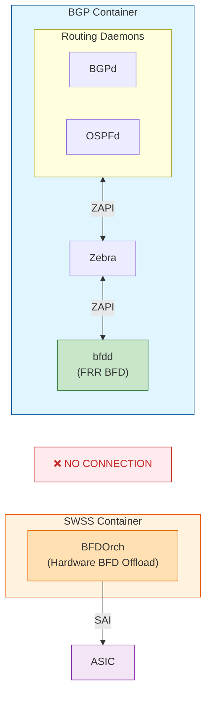
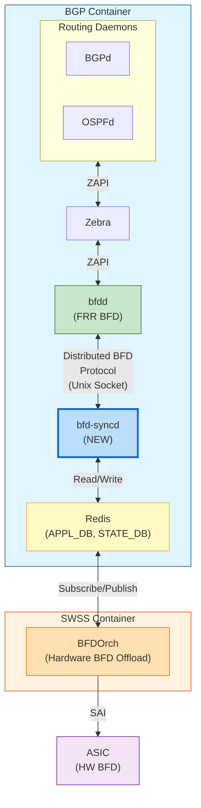
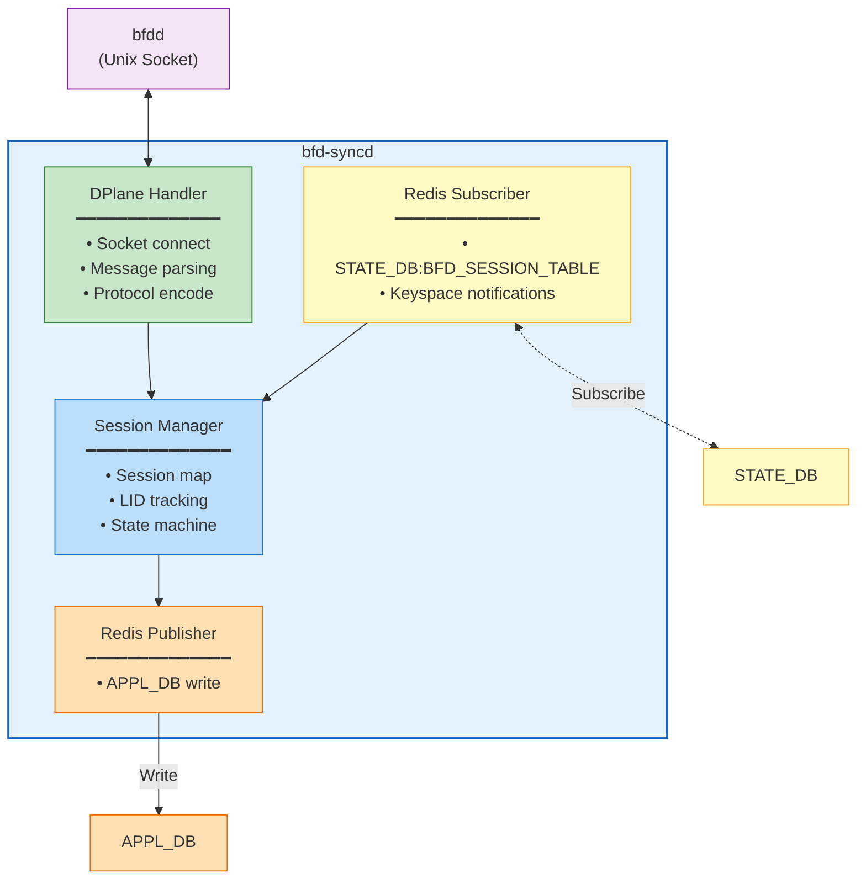
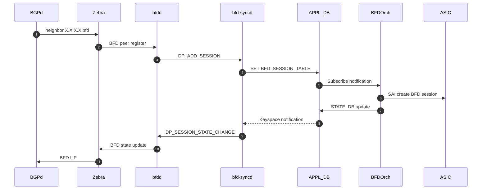
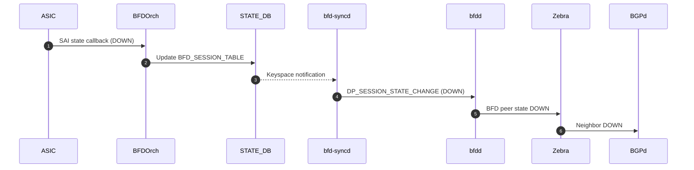
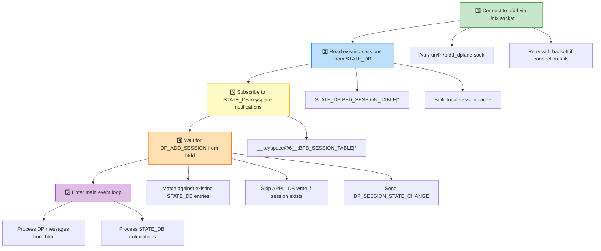

# BFD-Syncd: FRR and Hardware BFD Integration
## High Level Design Document
### Rev 1.0

# Table of Contents

  * [Revision](#revision)
  * [About this Manual](#about-this-manual)
  * [Scope](#scope)
  * [Definitions/Abbreviations](#definitionsabbreviations)
  * [1 Requirements Overview](#1-requirements-overview)
  * [2 Architecture Design](#2-architecture-design)
  * [3 Design Details](#3-design-details)
  * [4 Database Schema](#4-database-schema)
  * [5 SAI API](#5-sai-api)
  * [6 Configuration and Management](#6-configuration-and-management)
  * [7 Warm Restart](#7-warm-restart)
  * [8 Restrictions and Limitations](#8-restrictions-and-limitations)
  * [9 Implementation](#9-implementation)
  * [10 Testing Requirements](#10-testing-requirements)
  * [11 References](#11-references)

# Revision

| Rev  | Date       | Author             | Change Description                          |
|:----:|:----------:|:------------------:|---------------------------------------------|
| 0.1  | 2026-02-23 | Rajshekhar Biradar | Initial version                             |

# About this Manual

This document provides the high-level design for **bfd-syncd**, a new daemon that bridges FRR's BFD daemon (bfdd) with SONiC's hardware-offloaded BFD (BFDOrch). This enables routing protocols running in FRR to leverage hardware-accelerated BFD for fast failure detection.

# Scope

This document covers:
- Integration of FRR bfdd with SONiC BFDOrch via the Distributed BFD protocol
- Synchronization of BFD sessions between FRR and SONiC databases
- State propagation from hardware BFD to routing protocols

This document does not cover:
- Modifications to BFDOrch or SAI BFD APIs (uses existing implementation per [BFD HW Offload HLD](https://github.com/sonic-net/SONiC/blob/master/doc/bfd/BFD%20HW%20Offload%20HLD.md))
- FRR bfdd internals (see [FRR BFD Documentation](https://docs.frrouting.org/en/latest/bfd.html))
- Software BFD coexistence (CPU-based BFD and hardware BFD are mutually exclusive)
- Micro BFD (RFC 7130)
- CLI/show commands (uses existing FRR and SONiC BFD commands)
- VRF-specific behavior (follows existing BFDOrch VRF handling)

# Definitions/Abbreviations

| Term       | Definition                                                    |
|------------|---------------------------------------------------------------|
| BFD        | Bidirectional Forwarding Detection (RFC 5880)                 |
| bfdd       | FRR's BFD daemon                                              |
| bfd-syncd  | New daemon bridging FRR bfdd and SONiC BFDOrch                |
| BFDOrch    | SONiC orchestration agent for hardware BFD                    |
| Distributed BFD | FRR protocol for offloading BFD to external data planes (see `bfdd/bfddp_packet.h`) |
| LID        | Local Discriminator - unique identifier for a BFD session     |

# 1 Requirements Overview

## 1.1 Functional Requirements

| ID   | Requirement                                                                    |
|------|--------------------------------------------------------------------------------|
| FR-1 | Bridge FRR bfdd with SONiC BFDOrch via Distributed BFD protocol                |
| FR-2 | Synchronize BFD sessions from FRR to APPL_DB for hardware offload              |
| FR-3 | Propagate hardware BFD state changes back to FRR routing protocols             |
| FR-4 | Support IPv4 and IPv6 single-hop and multi-hop BFD sessions                    |

## 1.2 Scalability Requirements

| Parameter                    | Value         | Notes                                      |
|------------------------------|---------------|--------------------------------------------|
| Maximum HW BFD sessions      | 4000          | Per [BFD HW Offload HLD](https://github.com/sonic-net/SONiC/blob/master/doc/bfd/BFD%20HW%20Offload%20HLD.md) |
| Minimum TX/RX interval       | 10ms          | FRR minimum; HW may support 3.3ms          |
| Detection multiplier range   | 1-255         | Default: 3                                 |

# 2 Architecture Design

## 2.1 Current State

SONiC currently has two disconnected BFD implementations:



**Problems with Current State:**
1. FRR routing protocols cannot leverage hardware BFD for fast failure detection
2. Hardware BFD state changes are not visible to BGP/OSPF
3. While StaticRouteBFD offers limited HW BFD integration, BGP and OSPF remain disconnected from hardware offload.
4. Two separate configuration paths with no synchronization
5. CPU-based BFD has jitter and consumes CPU cycles

## 2.2 High-Level Architecture

The bfd-syncd daemon bridges these two worlds using FRR's Distributed BFD protocol:


The new bfd-syncd design acts as a unified, protocol-agnostic bridge to solve this, introducing no disruption to the existing implementation and offering a path for future static route consolidation.

## 2.3 Container Placement

**bfd-syncd runs inside the BGP container** for the following reasons:

| Reason                    | Description                                                 |
|---------------------------|-------------------------------------------------------------|
| Unix Socket Access        | Direct access to bfdd's dplane socket without network config |
| Existing Infrastructure   | BGP container already has libswsscommon for Redis access     |
| Lifecycle Management      | Restarts together with FRR, simpler supervision              |
| Established Pattern       | Similar to fpmsyncd which runs in BGP container for routes   |

# 3 Design Details

## 3.1 FRR Distributed BFD Protocol

FRR's bfdd supports a "Distributed BFD" mode where BFD packet processing is offloaded to an external data plane. Communication occurs via a Unix socket using a binary protocol defined in `bfdd/bfddp_packet.h`.

### 3.1.1 Protocol Messages

| Message Type              | Direction           | Description                              |
|---------------------------|---------------------|------------------------------------------|
| `DP_ADD_SESSION`          | bfdd → bfd-syncd    | Request to create a new BFD session      |
| `DP_DELETE_SESSION`       | bfdd → bfd-syncd    | Request to delete a BFD session          |
| `DP_SESSION_STATE_CHANGE` | bfd-syncd → bfdd    | Notify bfdd of hardware state change     |
| `DP_REQUEST_COUNTERS`     | bfdd → bfd-syncd    | Request session counter values           |
| `DP_COUNTERS_REPLY`       | bfd-syncd → bfdd    | Return counter values to bfdd            |

### 3.1.2 Enabling Distributed BFD

bfdd must be started with the `--dplaneaddr` option:

```bash
bfdd --dplaneaddr unix:/var/run/frr/bfdd_dplane.sock
```

See [FRR BFD Documentation](https://docs.frrouting.org/en/latest/bfd.html#distributed-bfd) for all supported address formats (unix, ipv4, ipv6, ipv4c, ipv6c).

## 3.2 bfd-syncd Component Design



### 3.2.1 Key Components

| Component          | Responsibility                                                    |
|--------------------|-------------------------------------------------------------------|
| DPlane Handler     | Manages Unix socket connection to bfdd, handles protocol messages |
| Session Manager    | Maintains session state, maps between LID and Redis keys          |
| Redis Subscriber   | Monitors STATE_DB for hardware BFD state changes                  |
| Redis Publisher    | Writes session requests to APPL_DB                                |

### 3.2.2 Error Handling

| Error Condition                | bfd-syncd Behavior                                           |
|--------------------------------|--------------------------------------------------------------|
| bfdd socket connection failed  | Retry connection with exponential backoff (1s, 2s, 4s, max 30s) |
| bfdd socket disconnected       | Log error, attempt reconnection, re-sync sessions on reconnect |
| APPL_DB write failed           | Log error, retry write; session remains pending              |
| Invalid DP_ADD_SESSION params  | Log error, ignore message (do not write to APPL_DB)          |
| STATE_DB session not found     | Log warning (session may have been deleted)                  |

bfd-syncd logs errors to syslog with facility `LOG_LOCAL4` (standard SONiC logging).

## 3.3 Data Flow

### 3.3.1 Session Creation (BGP with BFD)

When a BGP neighbor is configured with BFD enabled (via CONFIG_DB), frrcfgd translates this to FRR configuration. BGPd then requests BFD monitoring from bfdd:



### 3.3.2 State Update from Hardware

When the ASIC detects a BFD state change (e.g., peer timeout):



# 4 Database Schema

bfd-syncd uses the existing BFD database schema defined in [BFD HW Offload HLD](https://github.com/sonic-net/SONiC/blob/master/doc/bfd/BFD%20HW%20Offload%20HLD.md).

## 4.1 APPL_DB (bfd-syncd writes)

bfd-syncd writes to `BFD_SESSION_TABLE` when it receives `DP_ADD_SESSION` from bfdd:

```
BFD_SESSION_TABLE:{{vrf}}:{{ifname}}:{{ipaddr}}
    "local_addr"    : {{ipv4/v6}}           ; Local source IP address
    "type"          : "async_active"        ; BFD session type
    "tx_interval"   : {{interval}}          ; Desired TX interval in microseconds
    "rx_interval"   : {{interval}}          ; Required RX interval in microseconds
    "multiplier"    : {{multiplier}}        ; Detection multiplier (1-255)
    "multihop"      : "true"|"false"        ; Multi-hop session
```

**Note:** bfd-syncd converts FRR's millisecond intervals to microseconds for APPL_DB (BFDOrch/SAI uses microseconds).

Key format follows [BFD HW Offload HLD](https://github.com/sonic-net/SONiC/blob/master/doc/bfd/BFD%20HW%20Offload%20HLD.md):
- `vrf`: VRF name ("default" if not specified)
- `ifname`: Interface name ("default" for multi-hop sessions)
- `ipaddr`: Peer IP address (IPv4 or IPv6)

## 4.2 STATE_DB (bfd-syncd reads)

bfd-syncd subscribes to `BFD_SESSION_TABLE` state changes and sends `DP_SESSION_STATE_CHANGE` to bfdd:

```
BFD_SESSION_TABLE:{{vrf}}:{{ifname}}:{{ipaddr}}
    "state"                 : {{state}}     ; Admin_Down|Down|Init|Up
    "local_discriminator"   : {{lid}}       ; Local discriminator (assigned by BFDOrch)
    "remote_discriminator"  : {{rid}}       ; Peer's discriminator (learned from peer)
```

## 4.3 Discriminator Management

Local discriminators are assigned by BFDOrch when creating hardware BFD sessions. bfd-syncd:
1. Receives the discriminator from STATE_DB after BFDOrch creates the session
2. Reports the discriminator to bfdd via `DP_SESSION_STATE_CHANGE`
3. Maintains a mapping between FRR's session LID and the hardware discriminator

# 5 SAI API

bfd-syncd does not interact with SAI directly. See [BFD HW Offload HLD](https://github.com/sonic-net/SONiC/blob/master/doc/bfd/BFD%20HW%20Offload%20HLD.md) for SAI BFD API details.

# 6 Configuration and Management

## 6.1 CONFIG_DB Configuration

BFD sessions are configured via CONFIG_DB, which provides persistent configuration across reboots.

**BGP neighbor with BFD:**
```
BGP_NEIGHBOR|default|10.0.0.2
    "asn": "65001"
    "bfd": "true"
```

frrcfgd translates these CONFIG_DB entries to FRR configuration, which triggers bfdd to request BFD sessions via the Distributed BFD protocol.

## 6.2 bfd-syncd Startup

bfd-syncd is started via supervisord in the BGP container:

```ini
[program:bfdd]
command=/usr/lib/frr/bfdd -A 127.0.0.1 --dplaneaddr unix:/var/run/frr/bfdd_dplane.sock
priority=4

[program:bfd-syncd]
command=/usr/bin/bfd-syncd
priority=5
```

**Note:** bfd-syncd must start after bfdd (priority=5 > priority=4).

# 7 Warm Restart

## 7.1 Startup Sequence



## 7.2 Restart Scenarios

| Scenario                    | Behavior                                              |
|-----------------------------|-------------------------------------------------------|
| bfd-syncd restart           | Sessions preserved in HW; state reconciled on startup |
| bfdd restart                | bfdd re-sends DP_ADD_SESSION; bfd-syncd skips existing sessions |
| BGP container restart       | HW sessions maintained; FRR re-registers BFD peers    |
| SWSS container restart      | HW sessions recreated by BFDOrch; bfd-syncd syncs state to bfdd |

**Note:** Full warm restart support (hitless restart with no session flap) depends on BFDOrch warm restart capability. bfd-syncd itself is stateless and reconciles from STATE_DB on startup.

# 8 Restrictions and Limitations

| Limitation                           | Description                                         |
|--------------------------------------|-----------------------------------------------------|
| Software BFD coexistence             | Hardware BFD and software BFD are mutually exclusive |
| Micro BFD                            | Not supported in initial implementation             |
| BFD over LAG member links            | Not supported; use LAG interface directly           |
| Echo mode                            | Hardware dependent                                  |
| Demand mode                          | Not supported with hardware offload                 |
| Maximum sessions                     | Limited by ASIC capability (typically 4000)         |
| Minimum timer                        | Hardware dependent (typically 3.3ms minimum)        |

# 9 Implementation

## 9.1 Repository and Language

| Item              | Value                                                       |
|-------------------|-------------------------------------------------------------|
| Repository        | sonic-buildimage (src/sonic-frr-bfd-syncd)                  |
| Language          | C++ (consistent with fpmsyncd)                              |
| Container         | BGP container                                               |
| Dependencies      | libswsscommon                                               |

## 9.2 Build Integration

bfd-syncd is built as part of the sonic-frr package and installed in the BGP container.

# 10 Testing Requirements

## 10.1 Unit Tests

- Verify DP_ADD_SESSION creates APPL_DB entry with correct fields
- Verify DP_DELETE_SESSION removes APPL_DB entry
- Verify STATE_DB changes trigger DP_SESSION_STATE_CHANGE to bfdd
- Verify startup reconciliation with existing sessions
- Verify error handling (socket disconnect, invalid messages)

## 10.2 Integration Tests

- Verify BGP neighbor BFD triggers HW session creation
- Verify BGP receives BFD state changes from hardware
- Verify BGP neighbor goes down on BFD timeout
- Verify no session flap during bfd-syncd restart
- Verify scale to maximum supported BFD sessions

# 11 References

- [RFC 5880](https://datatracker.ietf.org/doc/html/rfc5880) - Bidirectional Forwarding Detection (BFD)
- [RFC 5881](https://datatracker.ietf.org/doc/html/rfc5881) - BFD for IPv4 and IPv6 (Single Hop)
- [RFC 5883](https://datatracker.ietf.org/doc/html/rfc5883) - BFD for Multihop Paths
- [BFD HW Offload HLD](https://github.com/sonic-net/SONiC/blob/master/doc/bfd/BFD%20HW%20Offload%20HLD.md) - SONiC hardware BFD offload design
- [FRR BFD Documentation](https://docs.frrouting.org/en/latest/bfd.html) - FRR BFD daemon documentation
- [FRR Distributed BFD](https://docs.frrouting.org/en/latest/bfd.html#distributed-bfd) - FRR data plane offload protocol
- [BFDOrch Implementation](https://github.com/sonic-net/sonic-swss/blob/master/orchagent/bfdorch.cpp) - SONiC BFD orchestration agent
- [Static Route BFD HLD](https://github.com/sonic-net/SONiC/pull/1216) - Static Route BFD HLD
