# BFD-Syncd: FRR and Hardware BFD Integration
## High Level Design Document
### Rev 0.2

# Table of Contents

  * [Revision](#revision)
  * [About this Manual](#about-this-manual)
  * [Scope](#scope)
  * [Definitions/Abbreviations](#definitionsabbreviations)
  * [1 Requirements Overview](#1-requirements-overview)
  * [2 Architecture Design](#2-architecture-design)
    * [2.1 Current State](#21-current-state)
      * [2.1.1 Prior Work — PR #1599](#211-prior-work--pr-1599)
    * [2.2 High-Level Architecture](#22-high-level-architecture)
    * [2.3 Container Placement](#23-container-placement)
    * [2.4 Protocol Coverage](#24-protocol-coverage)
  * [3 Design Details](#3-design-details)
    * [3.1 FRR Distributed BFD Protocol](#31-frr-distributed-bfd-protocol)
    * [3.2 bfd-syncd Component Design](#32-bfd-syncd-component-design)
    * [3.3 Data Flow](#33-data-flow)
      * [3.3.1 Session Creation](#331-session-creation)
      * [3.3.2 State Update from Hardware](#332-state-update-from-hardware)
      * [3.3.3 Admin_Down State Propagation](#333-admin_down-state-propagation)
    * [3.4 IPv6 Link-Local Address Support](#34-ipv6-link-local-address-support)
    * [3.5 Convergence Acceleration](#35-convergence-acceleration)
    * [3.6 Unified BFD Architecture and StaticRouteBFD Elimination](#36-unified-bfd-architecture-and-staticroutebfd-elimination)
    * [3.7 Multi-Owner BFD Session Management](#37-multi-owner-bfd-session-management)
    * [3.9 Partial BFD Offload](#39-partial-bfd-offload)
      * [3.9.1 Problem Statement](#391-problem-statement)
      * [3.9.2 Hybrid Mode in bfdd](#392-hybrid-mode-in-bfdd)
      * [3.9.3 Session Lifecycle](#393-session-lifecycle)
      * [3.9.4 Takeover Window](#394-takeover-window)
      * [3.9.5 Hardware DOWN Handling](#395-hardware-down-handling)
      * [3.9.6 DP_ADD_SESSION Message Extension](#396-dp_add_session-message-extension)
      * [3.9.7 bfd-syncd Changes](#397-bfd-syncd-changes)
      * [3.9.8 BFDOrch / SAI Changes](#398-bfdorch--sai-changes)
      * [3.9.9 Configuration](#399-configuration)
      * [3.9.10 Edge Cases](#3910-edge-cases)
      * [3.9.11 Implementation Scope](#3911-implementation-scope)
      * [3.9.12 Open Questions](#3912-open-questions)
  * [4 Database Schema](#4-database-schema)
    * [4.1 APPL_DB (bfd-syncd writes)](#41-appl_db-bfd-syncd-writes)
    * [4.2 STATE_DB (bfd-syncd reads)](#42-state_db-bfd-syncd-reads)
    * [4.3 Discriminator Management](#43-discriminator-management)
    * [4.4 APPL_DB — Link-Local Session Additional Fields](#44-appl_db--link-local-session-additional-fields)
    * [4.5 Counter Schema](#45-counter-schema-state_db)
    * [4.6 bfd-syncd Internal Session State](#46-bfd-syncd-internal-session-state-state_db-diagnostic)
  * [5 SAI API](#5-sai-api)
  * [6 Configuration and Management](#6-configuration-and-management)
    * [6.1 Hardware vs Software BFD Switch](#61-hardware-vs-software-bfd-switch)
    * [6.2 BFD Session Configuration](#62-bfd-session-configuration)
    * [6.3 YANG Model Changes](#63-yang-model-changes)
  * [7 Warm Restart](#7-warm-restart)
  * [8 Restrictions and Limitations](#8-restrictions-and-limitations)
  * [9 Implementation](#9-implementation)
  * [10 Testing Requirements](#10-testing-requirements)
    * [10.1 Unit Tests](#101-unit-tests)
    * [10.2 Integration Tests](#102-integration-tests)
    * [10.3 IPv6 Link-Local Integration Tests](#103-ipv6-link-local-integration-tests)
    * [10.4 Convergence Acceleration Tests](#104-convergence-acceleration-tests)
    * [10.5 Unified Architecture and StaticRouteBFD Elimination Tests](#105-unified-architecture-and-staticroutebfd-elimination-tests)
    * [10.6 sonic-mgmt Test Plan](#106-sonic-mgmt-test-plan)
    * [10.7 Multi-Owner and BFDOrch Reference Counting Tests](#107-multi-owner-and-bfdorch-reference-counting-tests)
    * [10.8 Observability and Operational Tests](#108-observability-and-operational-tests)
    * [10.9 Partial BFD Offload Tests](#109-partial-bfd-offload-tests)
  * [11 References](#11-references)

# Revision

| Rev  | Date       | Author             | Change Description                          |
|:----:|:----------:|:------------------:|---------------------------------------------|
| 0.1  | 2026-02-23 | Rajshekhar Biradar | Initial version                             |
| 0.2  | 2026-03-05 | Rajshekhar Biradar, Bao Liu, Selvamani Ramasamy, Kalash Nainwal, Kang Jiang | Link-local, convergence, unified/partial offload and warm-restart related updates |

# About this Manual

This document provides the high-level design for **bfd-syncd**, a new daemon that bridges FRR's BFD daemon (bfdd) with SONiC's hardware-offloaded BFD (BFDOrch). This enables routing protocols running in FRR to leverage hardware-accelerated BFD for fast failure detection.

# Scope

This document covers:
- Integration of FRR bfdd with SONiC BFDOrch via the Distributed BFD protocol
- Synchronization of BFD sessions between FRR and SONiC databases
- State propagation from hardware BFD to routing protocols
- IPv6 link-local address support for single-hop BFD sessions via inject-down mode and persistent netlink-based MAC resolution
- Hardware BFD convergence acceleration for single-hop sessions via NeighOrch direct observer integration
- Unified BFD architecture covering all FRR routing protocols (BGP, OSPF, IS-IS) and static routes via frrcfgd relay
- Complete elimination of StaticRouteBFD as a consequence of the unified architecture
- Partial BFD offload: software handshake with hardware keepalive for ASICs that cannot perform the initial BFD 3-way handshake

This document does not cover:
- SAI BFD API changes (uses existing SAI BFD specification)
- FRR bfdd internals (see [FRR BFD Documentation](https://docs.frrouting.org/en/latest/bfd.html))
- Micro BFD (RFC 7130)
- CLI/show commands (uses existing FRR and SONiC BFD commands)
- VRF-specific behavior (follows existing BFDOrch VRF handling)
- Multi-hop BFD convergence acceleration via NeighOrch (see §3.5.4; BGP PIC is the recommended solution)
- StaticRouteBFD route management internals (covered in [Static Route BFD HLD](https://github.com/sonic-net/SONiC/pull/1216))
- frrcfgd internal design (CONFIG_DB to FRR translation for static routes is tracked separately — see §3.6.3 for the required interface)

**Note on BFDOrch changes:** This document requires BFDOrch modifications in two areas — (1) plain reference counting to prevent session deletion collisions (§3.7), and (2) reading new link-local APPL_DB fields `encap_type`, `src_mac`, `dst_mac` (§4.4, §5.1). These changes are described at the interface level here; BFDOrch implementation is tracked in a companion PR to sonic-swss.

# Definitions/Abbreviations

| Term            | Definition                                                                                         |
|-----------------|----------------------------------------------------------------------------------------------------|
| BFD             | Bidirectional Forwarding Detection (RFC 5880)                                                      |
| bfdd            | FRR's BFD daemon                                                                                   |
| bfd-syncd       | New daemon bridging FRR bfdd and SONiC BFDOrch                                                     |
| BFDOrch         | SONiC orchestration agent for hardware BFD                                                         |
| Distributed BFD | FRR protocol for offloading BFD to external data planes (see `bfdd/bfddp_packet.h`)               |
| LID             | Local Discriminator — unique identifier for a BFD session                                          |
| NDP             | Neighbor Discovery Protocol (RFC 4861) — IPv6 equivalent of ARP                                   |
| inject-down     | SAI BFD encapsulation mode where software provides explicit src/dst MAC, bypassing the IP forwarding pipeline |
| NeighOrch       | SONiC neighbor orchestration agent managing the `m_syncdNextHops` directly-connected neighbor table |
| BGP PIC         | BGP Prefix Independent Convergence — hardware nexthop group invalidation enabling O(1) convergence |
| RTNLGRP_NEIGH   | Linux netlink multicast group for neighbor table change events (RTM_NEWNEIGH, RTM_DELNEIGH)        |
| FIB             | Forwarding Information Base — the hardware forwarding table programmed by RouteOrch                |
| RTM_GETNEIGH    | Linux netlink request to probe a neighbor entry and trigger NDP Neighbor Solicitation on the wire  |
| RTM_NEWNEIGH    | Linux netlink notification that a neighbor table entry has been added or updated                   |
| NUD_REACHABLE   | Neighbor Unreachability Detection state: neighbor confirmed reachable within REACHABLE_TIME (~30s) |
| NUD_FAILED      | NUD state: neighbor resolution failed after exhausting probe retries                               |
| frrcfgd         | SONiC daemon that translates CONFIG_DB entries to FRR configuration via vtysh                      |
| StaticRouteBFD  | Existing SONiC component managing BFD sessions and route lifecycle for static route nexthops       |
| fpmsyncd        | SONiC daemon that translates FRR RIB updates from the FPM socket to APPL_DB ROUTE_TABLE           |
| NHFLAGS_IFDOWN  | NeighOrch per-nexthop flag marking a nexthop as unavailable in hardware ECMP groups               |

# 1 Requirements Overview

## 1.1 Functional Requirements

| ID   | Requirement                                                                                                   |
|------|---------------------------------------------------------------------------------------------------------------|
| FR-1 | Bridge FRR bfdd with SONiC BFDOrch via Distributed BFD protocol over Unix domain socket                      |
| FR-2 | Synchronize BFD sessions from FRR to APPL_DB for hardware offload                                            |
| FR-3 | Propagate hardware BFD state changes back to FRR routing protocols                                            |
| FR-4 | Support IPv4 and IPv6 single-hop and multi-hop BFD sessions                                                   |
| FR-5 | Support IPv6 link-local address BFD sessions via inject-down mode with persistent netlink MAC resolution      |
| FR-6 | Provide hardware BFD convergence acceleration for single-hop sessions via NeighOrch direct observer           |
| FR-7 | Serve as unified BFD bridge for all FRR routing protocols and static routes via frrcfgd relay to FRR staticd  |

## 1.2 Scalability Requirements

| Parameter                    | Value         | Notes                                      |
|------------------------------|---------------|--------------------------------------------|
| Maximum HW BFD sessions      | 4000          | Per [BFD HW Offload HLD](https://github.com/sonic-net/SONiC/blob/master/doc/bfd/BFD%20HW%20Offload%20HLD.md) |
| Minimum TX/RX interval       | 10ms          | FRR minimum; HW may support 3.3ms          |
| Detection multiplier range   | 1-255         | Default: 3                                 |

# 2 Architecture Design

## 2.1 Current State

SONiC currently has two disconnected BFD implementations:

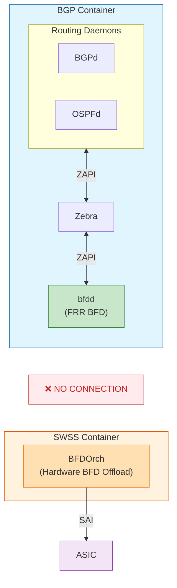
```mermaid
flowchart TB
    subgraph BGP["BGP Container"]
        direction TB
        subgraph routing["Routing Daemons"]
            BGPd["BGPd"]
            OSPFd["OSPFd"]
        end
        Zebra["Zebra"]
        bfdd["bfdd\n(FRR BFD)"]

        routing <-->|"ZAPI"| Zebra
        Zebra <-->|"ZAPI"| bfdd
    end

    subgraph SWSS["SWSS Container"]
        BFDOrch["BFDOrch\n(Hardware BFD Offload)"]
    end

    BFDOrch -->|"SAI"| ASIC["ASIC"]

    BGP ~~~ gap["❌ NO CONNECTION"] ~~~ SWSS

    style BGP fill:#e1f5fe,stroke:#01579b
    style SWSS fill:#fff3e0,stroke:#e65100
    style ASIC fill:#f3e5f5,stroke:#7b1fa2
    style gap fill:#ffebee,stroke:#c62828,color:#c62828
    style bfdd fill:#c8e6c9,stroke:#2e7d32
    style BFDOrch fill:#ffe0b2,stroke:#ef6c00
```

**Problems with Current State:**
1. FRR routing protocols cannot leverage hardware BFD for fast failure detection
2. Hardware BFD state changes are not visible to BGP/OSPF
3. While StaticRouteBFD offers limited HW BFD integration, BGP and OSPF remain disconnected from hardware offload
4. Two separate configuration paths with no synchronization
5. CPU-based BFD has jitter and consumes CPU cycles

### 2.1.1 Prior Work — PR #1599

PR #1599 (authored by Bao Liu) is an open proposal that addresses hardware BFD offload for BGP sessions using a bfdsyncd daemon. It establishes the core architectural pattern that this document builds upon: a dedicated daemon in the BGP container bridging FRR bfdd and SONiC BFDOrch via the FRR Distributed BFD protocol. The fundamental approach — using `DP_ADD_SESSION` / `DP_DELETE_SESSION` / `BFD_STATE_CHANGE` messages over a dplane socket — is sound and is preserved in this design.

This document extends and generalizes that work in the following areas:

| Area | PR #1599 | This proposal (bfd-syncd) |
|------|----------|---------------------------|
| Protocol scope | BGP only | All FRR protocols — BGP, OSPF, IS-IS, static routes |
| Transport | TCP socket (`ipv4c:127.0.0.1`) | Unix domain socket (standard SONiC IPC pattern) |
| IPv6 link-local | PING-based one-shot MAC resolution | Persistent netlink neighbor subscription (§3.4) |
| Warm restart | Not supported (explicitly deferred) | Full startup reconciliation from STATE_DB (§7) |
| Error handling | Not specified | Specified per-failure-mode policy (§3.2.2) |
| Counter support | Not supported | DP_REQUEST_SESSION_COUNTERS / BFD_SESSION_COUNTERS handled |
| Static routes | Not covered | Unified via frrcfgd relay; StaticRouteBFD eliminated (§3.6) |
| Convergence acceleration | Not covered | NeighOrch direct observer for single-hop (§3.5) |
| Multi-owner sessions | Not covered | Plain reference counting at BFDOrch prevents silent deletion on key collision (§3.7) |
| Mass flap handling   | Not covered | Handled via NeighOrch hardware fast path (§3.5); no additional bfd-syncd coalescing logic |
| BFD Sustenance Mode | Not covered | BFD Partial mode support (§3.9) |


## 2.2 High-Level Architecture

bfd-syncd bridges FRR bfdd and SONiC BFDOrch using FRR's Distributed BFD protocol. It is protocol-agnostic — it handles BFD sessions for BGP, OSPF, IS-IS, and static routes through the same code path. Static routes reach bfd-syncd via frrcfgd relaying CONFIG_DB configuration to FRR staticd, which registers BFD peers with bfdd identically to all other routing protocols.

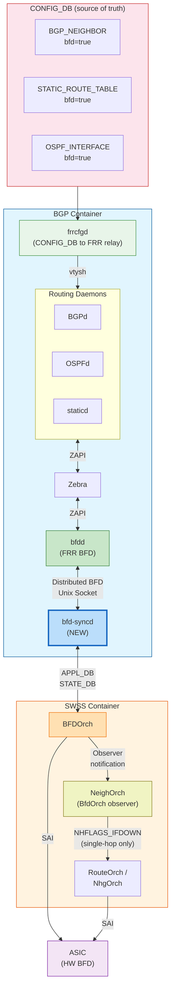
```mermaid
flowchart TB
    subgraph CFGDB["CONFIG_DB (source of truth)"]
        BGPCFG["BGP_NEIGHBOR\nbfd=true"]
        SRCFG["STATIC_ROUTE_TABLE\nbfd=true"]
        OSPFCFG["OSPF_INTERFACE\nbfd=true"]
    end

    subgraph BGP["BGP Container"]
        direction TB
        frrcfgd["frrcfgd\n(CONFIG_DB to FRR relay)"]
        subgraph routing["Routing Daemons"]
            BGPd["BGPd"]
            OSPFd["OSPFd"]
            staticd["staticd"]
        end
        Zebra["Zebra"]
        bfdd["bfdd\n(FRR BFD)"]
        bfdsyncd["bfd-syncd\n(NEW)"]

        frrcfgd -->|"vtysh"| routing
        routing <-->|"ZAPI"| Zebra
        Zebra <-->|"ZAPI"| bfdd
        bfdd <-->|"Distributed BFD\nUnix Socket"| bfdsyncd
    end

    subgraph SWSS["SWSS Container"]
        BFDOrch["BFDOrch"]
        NeighOrch["NeighOrch\n(BfdOrch observer)"]
        RouteOrch["RouteOrch /\nNhgOrch"]
    end

    CFGDB --> frrcfgd
    bfdsyncd <-->|"APPL_DB\nSTATE_DB"| BFDOrch
    BFDOrch -->|"SAI"| ASIC["ASIC\n(HW BFD)"]
    BFDOrch -->|"Observer\nnotification"| NeighOrch
    NeighOrch -->|"NHFLAGS_IFDOWN\n(single-hop only)"| RouteOrch
    RouteOrch -->|"SAI"| ASIC

    style BGP fill:#e1f5fe,stroke:#01579b
    style SWSS fill:#fff3e0,stroke:#e65100
    style ASIC fill:#f3e5f5,stroke:#7b1fa2
    style bfdd fill:#c8e6c9,stroke:#2e7d32
    style bfdsyncd fill:#bbdefb,stroke:#1565c0,stroke-width:3px
    style BFDOrch fill:#ffe0b2,stroke:#ef6c00
    style NeighOrch fill:#f0f4c3,stroke:#827717
    style frrcfgd fill:#e8f5e9,stroke:#388e3c
    style CFGDB fill:#fce4ec,stroke:#c62828
```

## 2.3 Container Placement

**bfd-syncd runs inside the BGP container** for the following reasons:

| Reason                    | Description                                                  |
|---------------------------|--------------------------------------------------------------|
| Unix Socket Access        | Direct access to bfdd's dplane socket without network config |
| Existing Infrastructure   | BGP container already has libswsscommon for Redis access     |
| Lifecycle Management      | Restarts together with FRR, simpler supervision              |
| Established Pattern       | Mirrors fpmsyncd which runs in the BGP container for routes  |

## 2.4 Protocol Coverage

bfd-syncd provides hardware BFD offload for all FRR protocols through the same code path. No bfd-syncd code changes are needed when a new FRR protocol adopts BFD — only the protocol-specific frrcfgd or FRR configuration change is required.

| Protocol      | BFD Session Source           | Configuration path                                              |
|---------------|------------------------------|-----------------------------------------------------------------|
| BGP           | BGPd registers with bfdd     | CONFIG_DB `BGP_NEIGHBOR` → frrcfgd → FRR (exists)              |
| OSPF          | OSPFd registers with bfdd    | CONFIG_DB `OSPF_INTERFACE` → frrcfgd → `ip ospf bfd` (new)     |
| IS-IS         | IS-ISd registers with bfdd   | CONFIG_DB `ISIS_INTERFACE` → frrcfgd → `isis bfd` (new)        |
| Static routes | staticd registers with bfdd  | CONFIG_DB `STATIC_ROUTE` → frrcfgd → FRR (new — §3.6)         |

CONFIG_DB is the single source of truth for all BFD configuration. Each protocol's BFD enablement flows through frrcfgd, which translates CONFIG_DB entries to the corresponding FRR CLI commands. OSPF and IS-IS require new `bfd` fields in their respective CONFIG_DB interface tables and corresponding frrcfgd translation logic. bfd-syncd is protocol-agnostic and handles all `DP_ADD_SESSION` messages identically regardless of the originating protocol.

# 3 Design Details

## 3.1 FRR Distributed BFD Protocol

FRR's bfdd supports a "Distributed BFD" mode where BFD packet processing is offloaded to an external data plane. Communication occurs via a Unix socket using a binary protocol defined in `bfdd/bfddp_packet.h`.

### 3.1.1 Protocol Messages

Message type names are taken verbatim from the `bfddp_message_type` enum in `bfdd/bfddp_packet.h`:

| Message Type                    | Enum | Direction           | bfd-syncd handling                                          |
|---------------------------------|------|---------------------|-------------------------------------------------------------|
| `ECHO_REQUEST`                  | 0    | bfdd ↔ bfd-syncd    | Not supported; received messages logged and discarded       |
| `ECHO_REPLY`                    | 1    | bfdd ↔ bfd-syncd    | Not supported; received messages logged and discarded       |
| `DP_ADD_SESSION`                | 2    | bfdd → bfd-syncd    | Create BFD session in APPL_DB — see §3.2.2 for flag handling|
| `DP_DELETE_SESSION`             | 3    | bfdd → bfd-syncd    | Delete BFD session from APPL_DB; see §3.2.2 for edge cases |
| `BFD_STATE_CHANGE`              | 4    | bfd-syncd → bfdd    | Notify bfdd of hardware state change from STATE_DB          |
| `DP_REQUEST_SESSION_COUNTERS`   | 5    | bfdd → bfd-syncd    | Request session counter values from STATE_DB                |
| `BFD_SESSION_COUNTERS`          | 6    | bfd-syncd → bfdd    | Return counter values to bfdd (see §4.5)                    |

### 3.1.2 Enabling Distributed BFD

bfdd must be started with the `--dplaneaddr` option pointing to a Unix domain socket:

```bash
bfdd --dplaneaddr unix:/var/run/frr/bfdd_dplane.sock
```

A Unix domain socket is used rather than a TCP socket (`ipv4c:`) because bfdd and bfd-syncd run in the same container. A Unix socket avoids port conflicts, has lower latency (no TCP/IP stack overhead), and follows the established SONiC pattern for co-located IPC (mirroring fpmsyncd's `/var/run/frr/zserv.api`). The `ipv4c:` option is intended for deployments where the data plane runs on a separate physical device.

See [FRR BFD Documentation](https://docs.frrouting.org/en/latest/bfd.html#distributed-bfd) for all supported address formats.

## 3.2 bfd-syncd Component Design

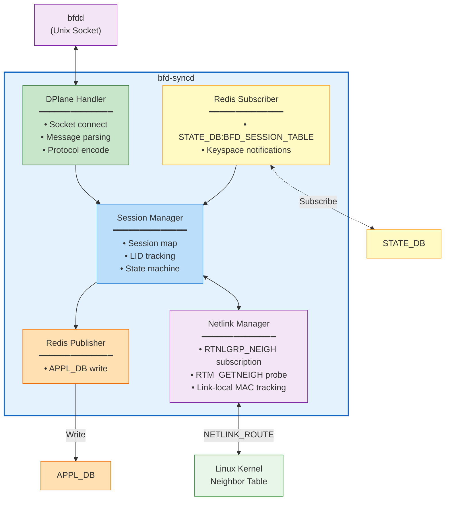
```mermaid
flowchart TB
    subgraph bfdsyncd["bfd-syncd"]
        direction TB
        DPlane["DPlane Handler\n━━━━━━━━━━━━━━\n• Socket connect\n• Message parsing\n• Protocol encode"]
        RedisSub["Redis Subscriber\n━━━━━━━━━━━━━━\n• STATE_DB:BFD_SESSION_TABLE\n• Keyspace notifications"]
        SessionMgr["Session Manager\n━━━━━━━━━━━━━━\n• Session map\n• LID tracking\n• State machine"]
        RedisPub["Redis Publisher\n━━━━━━━━━━━━━━\n• APPL_DB write"]
        NetlinkMgr["Netlink Manager\n━━━━━━━━━━━━━━\n• RTNLGRP_NEIGH subscription\n• RTM_GETNEIGH probe\n• Link-local MAC tracking"]

        DPlane --> SessionMgr
        RedisSub --> SessionMgr
        SessionMgr --> RedisPub
        SessionMgr <--> NetlinkMgr
    end

    bfdd["bfdd\n(Unix Socket)"] <--> DPlane
    RedisSub <-.->|"Subscribe"| STATEDB["STATE_DB"]
    RedisPub -->|"Write"| APPLDB["APPL_DB"]
    NetlinkMgr <-->|"NETLINK_ROUTE"| Kernel["Linux Kernel\nNeighbor Table"]

    style bfdsyncd fill:#e3f2fd,stroke:#1565c0,stroke-width:2px
    style DPlane fill:#c8e6c9,stroke:#2e7d32
    style RedisSub fill:#fff9c4,stroke:#f9a825
    style SessionMgr fill:#bbdefb,stroke:#1976d2
    style RedisPub fill:#ffe0b2,stroke:#ef6c00
    style NetlinkMgr fill:#f3e5f5,stroke:#7b1fa2
    style bfdd fill:#f3e5f5,stroke:#7b1fa2
    style STATEDB fill:#fff9c4,stroke:#f9a825
    style APPLDB fill:#ffe0b2,stroke:#ef6c00
    style Kernel fill:#e8f5e9,stroke:#388e3c
```

### 3.2.1 Key Components

| Component        | Responsibility                                                                            |
|------------------|-------------------------------------------------------------------------------------------|
| DPlane Handler   | Manages Unix socket connection to bfdd; handles Distributed BFD protocol messages        |
| Session Manager  | Maintains session state machine; maps FRR LID to APPL_DB keys; routes events to handlers |
| Redis Subscriber | Monitors STATE_DB for hardware BFD state changes via keyspace notifications               |
| Redis Publisher  | Writes session creation and deletion requests to APPL_DB                                  |
| Netlink Manager  | Manages Linux kernel neighbor table subscription for IPv6 link-local MAC resolution (§3.4)|

### 3.2.2 Error Handling

| Error Condition                          | bfd-syncd Behavior                                                                              |
|------------------------------------------|-------------------------------------------------------------------------------------------------|
| bfdd socket connection failed            | Retry with exponential backoff (1s → 2s → 4s → 8s → 16s → 30s cap)                            |
| bfdd socket disconnected                 | Log error; attempt reconnection with backoff; re-sync sessions on reconnect                     |
| APPL_DB write failed                     | Log error; retry 3 times with 100ms delay; session marked PENDING                              |
| Invalid DP_ADD_SESSION params            | Log warning with message contents; discard — do not write to APPL_DB                           |
| STATE_DB session not found               | Log debug (session may have been deleted between event and processing)                          |
| Netlink socket error                     | Log error; re-open socket; re-subscribe RTNLGRP_NEIGH; re-resolve all tracked link-local sessions |
| DP_ADD_SESSION with echo mode flag set   | Strip echo mode flag before writing to APPL_DB; log warning. Hardware echo mode support is ASIC-dependent and not guaranteed (see §8) |
| DP_ADD_SESSION with demand mode flag set | Reject session; do not write to APPL_DB; log LOG_ERR; send BFD_STATE_CHANGE with Admin_Down state to bfdd so bfdd does not wait indefinitely |
| DP_ADD_SESSION with passive mode flag    | Strip passive flag; hardware BFD always operates in async_active mode; log warning             |
| DP_ADD_SESSION when session capacity full| Log LOG_ERR with peer address and VRF; do not write to APPL_DB; send BFD_STATE_CHANGE Down to bfdd. Operator signal: LOG_ERR message "BFD HW session limit reached" observable in syslog |
| STATE_DB transitions to Init state       | Do not forward Init to bfdd via BFD_STATE_CHANGE. Init is a hardware-internal 3-way handshake state managed by the ASIC; it has no equivalent in the FRR distributed BFD protocol. Log at LOG_DEBUG |
| DP_DELETE_SESSION in RESOLVING state     | Cancel pending RTM_GETNEIGH probes; remove session from internal map; do not write to APPL_DB (no entry exists yet) |
| Duplicate DP_ADD_SESSION (session exists in STATE_DB) | Skip APPL_DB write; send BFD_STATE_CHANGE with current STATE_DB state to bfdd; log LOG_INFO  |

bfd-syncd logs to syslog with facility `LOG_LOCAL4` (standard SONiC logging) using levels:
- `LOG_ERR`: unrecoverable errors requiring operator attention
- `LOG_WARNING`: unexpected but recoverable events
- `LOG_INFO`: normal lifecycle events (session created, state changed, connected)
- `LOG_DEBUG`: detailed trace (raw messages, STATE_DB notifications, discriminator mappings)

### 3.2.3 Graceful Shutdown

bfd-syncd registers a SIGTERM handler for clean shutdown. On SIGTERM:

1. Check `WARM_RESTART_TABLE` in STATE_DB for warm restart flag
2. If warm restart is **not** in progress:
   - Iterate session map and DEL each `BFD_SESSION_TABLE` entry from APPL_DB
   - BFDOrch destroys the corresponding hardware sessions (ref_count decremented)
   - Close Unix socket to bfdd
   - Exit
3. If warm restart **is** in progress:
   - Skip APPL_DB cleanup — hardware sessions must survive until bfd-syncd restarts and reconciles (§7)
   - Close Unix socket to bfdd
   - Exit

Without APPL_DB cleanup on normal shutdown, stale entries persist and BFDOrch keeps hardware sessions alive with no daemon managing them. This is consistent with fpmsyncd, which cleans up its `APPL_DB ROUTE_TABLE` entries on shutdown.

## 3.3 Data Flow

### 3.3.1 Session Creation

When a routing protocol is configured with BFD, frrcfgd translates the CONFIG_DB entry to FRR configuration. The routing daemon (BGPd, OSPFd, staticd) requests BFD monitoring from bfdd. The flow is identical for all protocols. State propagation back to the routing daemon once the session is established is covered in §3.3.2.

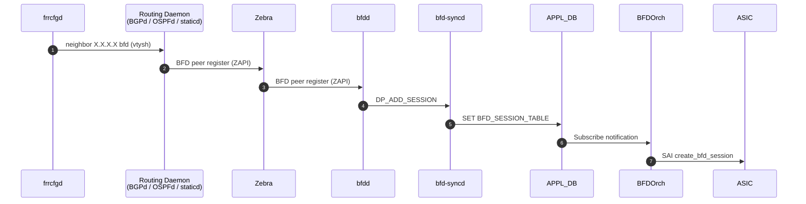
```mermaid
sequenceDiagram
    autonumber
    participant frrcfgd
    participant RoutingDaemon as Routing Daemon<br/>(BGPd / OSPFd / staticd)
    participant Zebra
    participant bfdd
    participant bfd-syncd
    participant APPL_DB
    participant BFDOrch
    participant ASIC

    frrcfgd->>RoutingDaemon: neighbor X.X.X.X bfd (vtysh)
    RoutingDaemon->>Zebra: BFD peer register (ZAPI)
    Zebra->>bfdd: BFD peer register (ZAPI)
    bfdd->>bfd-syncd: DP_ADD_SESSION
    bfd-syncd->>APPL_DB: SET BFD_SESSION_TABLE
    APPL_DB->>BFDOrch: Subscribe notification
    BFDOrch->>ASIC: SAI create_bfd_session
```

### 3.3.2 State Update from Hardware

When the ASIC detects a BFD state change (e.g., peer timeout):

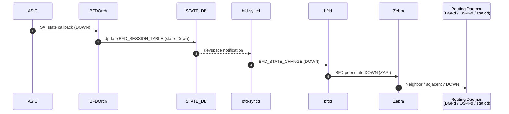
```mermaid
sequenceDiagram
    autonumber
    participant ASIC
    participant BFDOrch
    participant STATE_DB
    participant bfd-syncd
    participant bfdd
    participant Zebra
    participant RoutingDaemon as Routing Daemon<br/>(BGPd / OSPFd / staticd)

    ASIC->>BFDOrch: SAI state callback (DOWN)
    BFDOrch->>STATE_DB: Update BFD_SESSION_TABLE (state=Down)
    STATE_DB-->>bfd-syncd: Keyspace notification
    bfd-syncd->>bfdd: BFD_STATE_CHANGE (DOWN)
    bfdd->>Zebra: BFD peer state DOWN (ZAPI)
    Zebra->>RoutingDaemon: Neighbor / adjacency DOWN
```

### 3.3.3 Admin_Down State Propagation

Admin_Down (RFC 5880) signals to the remote peer that a session is intentionally going down, enabling graceful recovery (e.g., BGP GR helper mode) rather than hard failure handling.

**Known gap:** The FRR Distributed BFD protocol has no message to transition a hardware session to Admin_Down before deletion — only `DP_DELETE_SESSION` exists. In hardware offload mode, bfdd is not doing software TX, so it cannot send a software Admin_Down packet either. The remote peer sees a timeout (Down), not Admin_Down, and cannot distinguish planned shutdown from failure. A future protocol extension is needed to address this.

**bfd-syncd behavior on STATE_DB Admin_Down:** If BFDOrch sets a session to `Admin_Down` in STATE_DB (e.g., during graceful SWSS shutdown), bfd-syncd forwards `BFD_STATE_CHANGE` with Admin_Down state to bfdd. This handles locally-detected Admin_Down (SWSS-side), not operator-initiated Admin_Down (bfdd-side).

## 3.4 IPv6 Link-Local Address Support

### 3.4.1 Why Link-Local Requires Special Handling

IPv6 link-local addresses (`fe80::/10`) are non-routable by definition (RFC 4291). They are scoped to a single physical link and are not forwarded by any router. This creates a fundamental problem for hardware BFD session creation.

The hardware BFD engine resolves the destination MAC address for a BFD session through the normal IP forwarding pipeline:

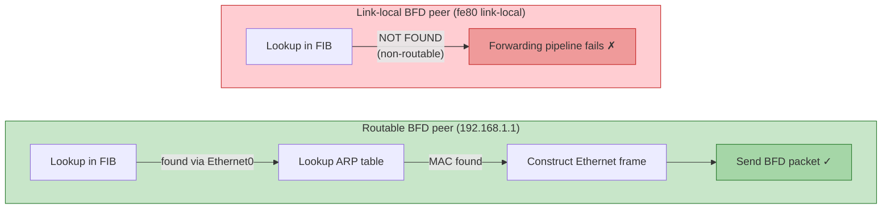
```mermaid
flowchart LR
    subgraph routable["Routable BFD peer (192.168.1.1)"]
        direction LR
        R1["Lookup in FIB"] -->|"found via Ethernet0"| R2["Lookup ARP table"]
        R2 -->|"MAC found"| R3["Construct Ethernet frame"]
        R3 --> R4["Send BFD packet ✓"]
    end

    subgraph linklocal["Link-local BFD peer (fe80 link-local)"]
        direction LR
        L1["Lookup in FIB"] -->|"NOT FOUND\n(non-routable)"| L2["Forwarding pipeline fails ✗"]
    end

    style routable fill:#c8e6c9,stroke:#2e7d32
    style linklocal fill:#ffcdd2,stroke:#c62828
    style R4 fill:#a5d6a7,stroke:#2e7d32
    style L2 fill:#ef9a9a,stroke:#c62828
```

This is a Layer 2 resolution problem, not a topological one. Link-local BFD is always **single-hop** (RFC 5881) — the peer is directly connected on the same physical link. The problem is solely that the IP forwarding pipeline depends on FIB reachability, which link-local addresses do not have.

To address this, BFDOrch creates the session in **inject-down mode** (`SAI_BFD_ENCAPSULATION_TYPE_L2`), where software provides both source and destination MAC addresses explicitly, bypassing the IP forwarding pipeline.

### 3.4.2 Comparison with Multi-Hop BFD

It is important to distinguish link-local from multi-hop BFD. Both scenarios require attention to MAC resolution, but for entirely different reasons:

| Property               | Link-local single-hop                     | Multi-hop                                         |
|------------------------|-------------------------------------------|---------------------------------------------------|
| Hop count              | 1 — directly connected peer               | >1 — remote peer                                  |
| BFD peer in FIB        | No — non-routable                         | Yes — IGP-learned route exists                    |
| MAC resolution         | Fails in HW forwarding pipeline           | Succeeds — ASIC uses FIB → ARP for immediate nexthop |
| inject-down required   | Yes                                       | No                                                |
| Root problem           | L2 resolution for non-routable addresses  | None — hardware handles it automatically          |

For multi-hop BFD, the BFD packet is a regular routed UDP/IP packet. The ASIC looks up the remote peer address in the FIB, finds the immediate next-hop, resolves that next-hop's MAC from the ARP table, and constructs the Ethernet frame with the next-hop's MAC. No software MAC intervention is needed. The destination MAC in the Ethernet frame is that of the immediate next-hop router, not the final BFD peer.

### 3.4.3 Limitations of the PING-Based Approach

PR #1599 proposes resolving the destination MAC for link-local sessions by sending an ICMPv6 echo request (PING) to the peer to populate the NDP neighbor table, then reading the MAC address from that table. This approach correctly identifies the core problem — that the ASIC cannot resolve the MAC for a non-routable address — and provides a working solution for straightforward deployments. However, it has limitations in environments where robustness and long-running stability are required:

**NDP expiry race condition:** RFC 4861 defines `REACHABLE_TIME` as approximately 30 seconds (randomised 15–45s). After expiry, entries transition `REACHABLE → STALE → DELAY → PROBE → (removed)`. A STALE entry still has a MAC address but it has not been recently confirmed. In a data center with LAG failover or path changes, a STALE MAC may direct BFD packets to a dead physical path, silently breaking liveness detection.

**ICMP dependency:** The approach requires ICMPv6 echo reply from the peer. Data center environments commonly rate-limit or completely block ICMPv6 echo on fabric interfaces via ACLs. If the PING is dropped, no MAC is available and session creation fails with no defined recovery path.

**MAC changes not detected:** If the peer MAC changes after session creation (LAG failover, NIC replacement), the hardware BFD session retains the old destination MAC indefinitely. There is no mechanism to detect or react to the change.

**BGP configuration constrained:** The proposal requires that `disable-connected-check` not be configured for BGP, because the design relies on BGP establishing a TCP session first to populate the NDP table as a side effect. This is an incorrect inversion of layering — a BFD implementation detail constraining BGP operator configuration.

### 3.4.4 Proposed Approach — Persistent Netlink Neighbor Subscription

One approach to address the limitations described in §3.4.3 is to resolve and track the destination MAC using Linux netlink `RTNLGRP_NEIGH` events rather than a one-shot read. This approach avoids ICMP dependency and monitors for MAC changes throughout the session lifetime. The key difference from the PING-based approach is that the netlink socket remains open after initial resolution, allowing bfd-syncd to react to neighbor table changes without any polling or re-initialization.

**Initial MAC resolution:**

When bfd-syncd receives `DP_ADD_SESSION` with a link-local destination address, it triggers NDP resolution directly through the kernel:

```
1. Open NETLINK_ROUTE socket, bind to RTNLGRP_NEIGH (subscribe before probing)
2. Send RTM_GETNEIGH with NLM_F_REQUEST | NLM_F_CREATE for the link-local address
      Kernel sends NDP Neighbor Solicitation (ICMPv6 type 135) on the wire.
      NS is required for IPv6 to function and is not filtered by data center ACLs.
3. Wait for RTM_NEWNEIGH event with NUD_REACHABLE state
4. Extract nda_lladdr (destination MAC) and nda_ifindex (interface index)
5. Read source MAC from /sys/class/net/<ifname>/address
6. Write APPL_DB entry with encap_type=l2, src_mac, dst_mac (see §4.4)
7. Keep netlink socket OPEN — monitor all subsequent neighbor table events
```

The NDP exchange triggered by RTM_GETNEIGH:

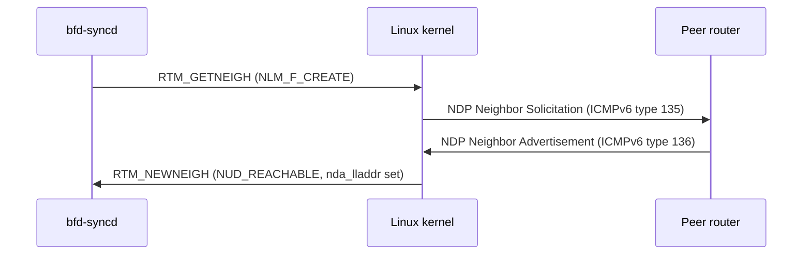
```mermaid
sequenceDiagram
    participant B as bfd-syncd
    participant K as Linux kernel
    participant P as Peer router

    B->>K: RTM_GETNEIGH (NLM_F_CREATE)
    K->>P: NDP Neighbor Solicitation (ICMPv6 type 135)
    P->>K: NDP Neighbor Advertisement (ICMPv6 type 136)
    K->>B: RTM_NEWNEIGH (NUD_REACHABLE, nda_lladdr set)
```

If no `RTM_NEWNEIGH` arrives within 3 seconds, bfd-syncd retries `RTM_GETNEIGH` with exponential backoff: 3s, 6s, 12s, up to a maximum of 5 retries. If all retries fail, the session enters FAILED state and the failure is logged at `LOG_ERR`.

**Periodic re-resolution for FAILED sessions:** Sessions in FAILED state are not abandoned permanently. bfd-syncd retries `RTM_GETNEIGH` every 60 seconds for FAILED sessions, up to a maximum of 30 attempts (total ~30 minutes). After 30 attempts, the session is marked FAILED_PERMANENT and no further probes are sent. The session can be re-activated by a new `DP_DELETE_SESSION` followed by `DP_ADD_SESSION` from bfdd, or by operator intervention. This prevents unbounded memory and log growth from sessions that can never resolve (e.g., misconfigured peer address).

**Interface-down during RESOLVING:** If the interface goes down while a session is in RESOLVING state, the kernel will not generate `RTM_NEWNEIGH` — the NDP NS cannot be sent on a down interface. bfd-syncd will exhaust retries and enter FAILED state. When the interface comes back up, the kernel generates a `RTM_NEWLINK` event; bfd-syncd listens for interface-up events on tracked interfaces and automatically re-issues `RTM_GETNEIGH` to restart the resolution cycle. This requires the Netlink Manager to also subscribe to `RTNLGRP_LINK` in addition to `RTNLGRP_NEIGH`.

**MAC change detection (post-creation):**

Because the netlink socket remains open and subscribed to `RTNLGRP_NEIGH`, bfd-syncd is notified of every subsequent neighbor table change for tracked link-local peers:

| Netlink Event                        | bfd-syncd Action                                               |
|--------------------------------------|----------------------------------------------------------------|
| `RTM_NEWNEIGH` with new `nda_lladdr` | Delete existing APPL_DB entry; re-create with updated dst_mac  |
| `RTM_NEWNEIGH` with `NUD_FAILED`     | Transition session to FAILED; begin RTM_GETNEIGH probe cycle   |
| `RTM_DELNEIGH`                       | Delete APPL_DB entry; begin RTM_GETNEIGH probe cycle           |
| `RTM_NEWNEIGH` with `NUD_REACHABLE`  | If session in FAILED or RESOLVING state: create APPL_DB entry  |

Deleting and re-creating the APPL_DB entry on MAC change is the correct behavior. A MAC change indicates a physical path change; a brief BFD DOWN event is expected and appropriate. BfdOrch destroys the hardware session with the stale MAC and creates a new one with the updated MAC.

### 3.4.5 Link-Local Session State Machine

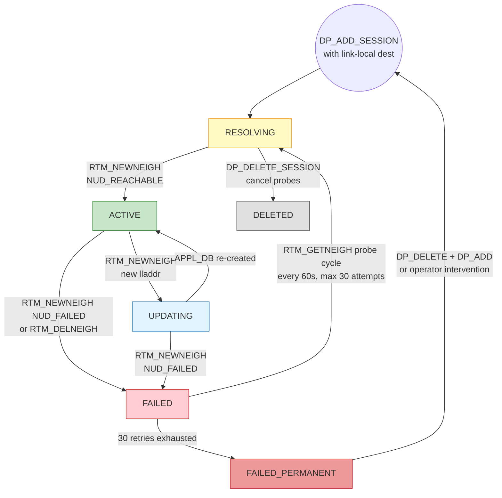
```mermaid
flowchart TD
    Start(("DP_ADD_SESSION<br/>with link-local dest")) --> RESOLVING

    RESOLVING["RESOLVING"] -->|"RTM_NEWNEIGH<br/>NUD_REACHABLE"| ACTIVE["ACTIVE"]
    RESOLVING -->|"DP_DELETE_SESSION<br/>cancel probes"| DELETED["DELETED"]

    ACTIVE -->|"RTM_NEWNEIGH<br/>new lladdr"| UPDATING["UPDATING"]
    ACTIVE -->|"RTM_NEWNEIGH NUD_FAILED<br/>or RTM_DELNEIGH"| FAILED["FAILED"]

    UPDATING -->|"APPL_DB re-created"| ACTIVE
    UPDATING -->|"RTM_NEWNEIGH<br/>NUD_FAILED"| FAILED

    FAILED -->|"RTM_GETNEIGH probe cycle<br/>every 60s, max 30 attempts"| RESOLVING
    FAILED -->|"30 retries exhausted"| FAILED_PERMANENT["FAILED_PERMANENT"]

    FAILED_PERMANENT -->|"DP_DELETE + DP_ADD<br/>or operator intervention"| Start

    style ACTIVE fill:#c8e6c9,stroke:#2e7d32
    style FAILED fill:#ffcdd2,stroke:#c62828
    style RESOLVING fill:#fff9c4,stroke:#f9a825
    style FAILED_PERMANENT fill:#ef9a9a,stroke:#b71c1c
    style UPDATING fill:#e1f5fe,stroke:#01579b
    style DELETED fill:#e0e0e0,stroke:#616161
```

### 3.4.6 Source MAC Acquisition

The source MAC (local interface MAC address) is read from the Linux sysfs filesystem:

```
/sys/class/net/<ifname>/address
```

This is preferred over reading from the BfdOrch port table because the port table entry may be absent for interfaces that carry only link-local addresses with no routable IP assigned. The sysfs path is populated for any active network interface.

### 3.4.7 NeighOrch Convergence Acceleration for Link-Local

IPv6 link-local BFD sessions are single-hop by definition. The BFD peer's link-local address (e.g., `fe80::bbb`) **is present in `m_syncdNextHops`** because it is a directly resolved, directly connected neighbor — NeighOrch populates it when the NDP entry is established. The NeighOrch convergence acceleration described in §3.5 therefore applies to link-local BFD sessions identically to routable single-hop sessions. No special handling is required in NeighOrch for link-local addresses.

This is particularly significant because BGP unnumbered (RFC 7938 — BGP peering over link-local addresses without numbered interfaces) is the dominant fabric design in modern data centers. Hardware BFD convergence acceleration applies to all such deployments.

## 3.5 Convergence Acceleration

### 3.5.1 Problem: FRR Reconvergence Latency

When hardware BFD detects a peer failure, the standard path to update forwarding is:

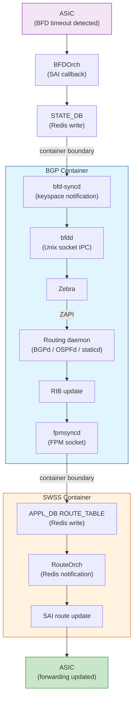
```mermaid
flowchart TD
    ASIC1["ASIC\n(BFD timeout detected)"] --> BFDOrch["BFDOrch\n(SAI callback)"]
    BFDOrch --> STATE["STATE_DB\n(Redis write)"]

    STATE -->|"container boundary"| bfdsync["bfd-syncd\n(keyspace notification)"]

    subgraph BGP["BGP Container"]
        bfdsync --> bfdd["bfdd\n(Unix socket IPC)"]
        bfdd --> Zebra
        Zebra -->|"ZAPI"| Routing["Routing daemon\n(BGPd / OSPFd / staticd)"]
        Routing --> RIB["RIB update"]
        RIB --> fpm["fpmsyncd\n(FPM socket)"]
    end

    fpm -->|"container boundary"| APPL["APPL_DB ROUTE_TABLE\n(Redis write)"]

    subgraph SWSS["SWSS Container"]
        APPL --> RouteOrch["RouteOrch\n(Redis notification)"]
        RouteOrch --> SAI["SAI route update"]
    end

    SAI --> ASIC2["ASIC\n(forwarding updated)"]

    style ASIC1 fill:#f3e5f5,stroke:#7b1fa2
    style ASIC2 fill:#c8e6c9,stroke:#2e7d32
    style BGP fill:#e1f5fe,stroke:#01579b
    style SWSS fill:#fff3e0,stroke:#e65100
```

This path crosses the container boundary twice, involves multiple Redis reads and writes, and traverses the full FRR routing daemon stack. The total latency is a function of system load, session count, and routing table size. For deployments using aggressive BFD timers, there can be a significant gap between the BFD detection time and the point at which forwarding is actually updated — traffic continues to be sent to the failed path throughout that window.

### 3.5.2 NeighOrch Direct Observer — Single-Hop Acceleration

NeighOrch already implements a mechanism for marking nexthops as invalid in hardware ECMP groups in response to interface down events, via the `NHFLAGS_IFDOWN` flag. The functions `invalidnexthopinNextHopGroup()` and `validnexthopinNextHopGroup()` directly update SAI nexthop group objects without going through the route table or FRR.

This mechanism is extended to BFD state changes. BFDOrch notifies NeighOrch as a direct observer for all BFD session state changes. NeighOrch looks up the BFD peer address in `m_syncdNextHops`:

- **If found** (single-hop — peer is a directly connected neighbor): apply `NHFLAGS_IFDOWN` on DOWN, clear it on UP
- **If not found** (multi-hop — peer is not a directly connected neighbor): silently skip; FRR handles it via the standard path

The observer call is an **in-process function call within orchagent** — no IPC, no Redis operation, no container boundary crossing. This eliminates the dominant latency contributors of the standard FRR path: two container boundary crossings, multiple Redis round trips, and full traversal of the FRR routing daemon stack.

**NeighOrch observer registration:**

NeighOrch registers itself as a BfdOrch observer in its own constructor. This registration is generic and protocol-agnostic — it is not tied to any specific application or routing protocol.

**Required initialization order change in orchdaemon.cpp (P1-3):** NeighOrch's constructor calls `gBfdOrch->attach(this)`, which requires `gBfdOrch` to be non-null at NeighOrch construction time. In the current orchdaemon.cpp, NeighOrch is initialized before BfdOrch — `gBfdOrch` is null when NeighOrch is constructed, causing a null pointer dereference. This HLD requires the initialization order in orchdaemon.cpp to be changed so BfdOrch is initialized before NeighOrch. Alternatively, NeighOrch may use a lazy registration pattern, deferring `gBfdOrch->attach(this)` to a post-initialization callback after all Orch objects are constructed.

**NHFLAGS_IFDOWN clearing — interaction with interface-up events (P1-4):** NeighOrch sets `NHFLAGS_IFDOWN` via two independent code paths: (1) interface-down events, and (2) BFD DOWN events (this HLD). The clearing paths must be coordinated. The interface-up handler must not clear `NHFLAGS_IFDOWN` if BFD state is still DOWN for that nexthop, and the BFD UP handler must not clear `NHFLAGS_IFDOWN` if the interface is still down. Both conditions must be satisfied before the flag is cleared. Without this coordination, a nexthop can be re-enabled in hardware ECMP while its liveness is still unconfirmed by one of the two conditions.

```cpp
// NeighOrch constructor — registers for all BFD state events generically
NeighOrch::NeighOrch(DBConnector *appDb, string tableName,
                     IntfsOrch *intfsOrch, FdbOrch *fdbOrch,
                     PortsOrch *portsOrch, DBConnector *chassisAppDb)
{
    // ... existing initialization ...
    gBfdOrch->attach(this);
}

void NeighOrch::update(SubjectType type, void *cntx)
{
    switch (type) {
    case SUBJECT_TYPE_BFD_SESSION_STATE_CHANGE:
    {
        BfdUpdate *update = static_cast<BfdUpdate *>(cntx);
        updateNextHop(*update);
        break;
    }
    // ... other cases ...
    }
}

bool NeighOrch::updateNextHop(const BfdUpdate& update)
{
    IpAddress peer_address = extractPeerAddress(update.peer);

    auto nhop = m_syncdNextHops.find(peer_address);
    if (nhop == m_syncdNextHops.end()) {
        // Not a directly-connected neighbor (multi-hop case) -- skip silently
        return true;
    }

    if (update.state == SAI_BFD_SESSION_STATE_UP) {
        return clearNextHopFlag(nhop->first, NHFLAGS_IFDOWN);
    } else {
        return setNextHopFlag(nhop->first, NHFLAGS_IFDOWN);
    }
}
```

### 3.5.3 Protocol Applicability

| Protocol / Scenario         | BFD peer in m_syncdNextHops | Acceleration applies | Notes                                                            |
|-----------------------------|-----------------------------|----------------------|------------------------------------------------------------------|
| eBGP single-hop IPv4        | Yes — direct peer           | Yes                  | Invalidates only this peer's ECMP slot; other peers unaffected   |
| eBGP single-hop IPv6        | Yes — direct peer           | Yes                  | Same as IPv4                                                     |
| BGP unnumbered (link-local) | Yes — fe80:: neighbor       | Yes                  | fe80:: address is in m_syncdNextHops; see §3.4.7                 |
| OSPF single-hop             | Yes — adjacency neighbor    | Yes                  | OSPF neighbor address is the direct nexthop for routes           |
| IS-IS single-hop            | Yes — adjacency neighbor    | Yes                  | Same as OSPF                                                     |
| Static route (direct nexthop)| Yes — if directly connected | Yes                  | Nexthop is a directly connected neighbor                         |
| iBGP                        | No — loopback address       | No                   | See §3.5.4                                                       |
| eBGP multihop               | No — remote peer            | No                   | See §3.5.4                                                       |

### 3.5.4 Multi-Hop BFD — Why NeighOrch Acceleration Does Not Apply

For multi-hop BFD, the BFD peer address is a remote loopback or far-end IP not present in `m_syncdNextHops`. The NeighOrch lookup finds nothing and silently skips, which is the correct behavior.

More critically, applying `NHFLAGS_IFDOWN` to the immediate next-hop that routes toward the multi-hop BFD peer would be incorrect. The immediate next-hop (e.g., `10.0.0.2` on `Ethernet0`) is a shared physical path that may carry traffic for many other sessions and routes. Invalidating it because one iBGP peer's BFD session went down would cause a much wider traffic disruption than the actual failure.

A reverse-index approach (RouteOrch mapping nexthop → prefixes, issuing per-prefix SAI operations on BFD DOWN) is also not recommended. For a full iBGP table (800,000+ prefixes), iterating and issuing SAI operations for all affected prefixes in a single event handler would stall OrchAgent for seconds — a control plane outage more severe than the original failure.

**The correct solution for multi-hop BFD convergence acceleration is BGP PIC (Prefix Independent Convergence).** BGP PIC maintains a dedicated SAI Next Hop Group object per BGP peer. All routes from that peer share the same NHG object. When BFD DOWN is received, invalidating that one NHG object atomically covers all prefixes in O(1) SAI operations regardless of prefix count. bfd-syncd's role in this path is unchanged: it delivers `BFD_STATE_CHANGE` to bfdd, which triggers FRR's PIC-aware route update. BGP PIC implementation is a separate work item outside the scope of this document.

### 3.5.5 Dual-Path Operation

The NeighOrch acceleration path and the FRR reconvergence path operate **in parallel** for the same BFD DOWN event. They are not mutually exclusive:

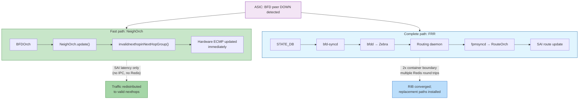
```mermaid
flowchart TD
    ASIC["ASIC: BFD peer DOWN detected"] --> Fast
    ASIC --> Complete

    subgraph Fast["Fast path: NeighOrch"]
        direction LR
        F1["BFDOrch"] --> F2["NeighOrch.update()"]
        F2 --> F3["invalidnexthopinNextHopGroup()"]
        F3 --> F4["Hardware ECMP updated\nimmediately"]
    end

    subgraph Complete["Complete path: FRR"]
        direction LR
        C1["STATE_DB"] --> C2["bfd-syncd"]
        C2 --> C3["bfdd → Zebra"]
        C3 --> C4["Routing daemon"]
        C4 --> C5["fpmsyncd → RouteOrch"]
        C5 --> C6["SAI route update"]
    end

    Fast -.->|"SAI latency only\n(no IPC, no Redis)"| Effect1["Traffic redistributed\nto valid nexthops"]
    Complete -.->|"2x container boundary\nmultiple Redis round trips"| Effect2["RIB converged;\nreplacement paths installed"]

    style Fast fill:#c8e6c9,stroke:#2e7d32
    style Complete fill:#e1f5fe,stroke:#01579b
    style Effect1 fill:#a5d6a7,stroke:#2e7d32
    style Effect2 fill:#bbdefb,stroke:#1565c0
    style ASIC fill:#f3e5f5,stroke:#7b1fa2
```

The fast path protects traffic immediately within the BFD detection window. The complete path installs any replacement routes (e.g., alternate BGP paths, OSPF SPF result) that the fast path cannot anticipate. For the case where the failed nexthop is the only path, the fast path removes it from the ECMP group and the FRR path installs any available alternate routes from other sources.

## 3.6 Unified BFD Architecture and StaticRouteBFD Elimination

### 3.6.1 Current StaticRouteBFD Architecture

StaticRouteBFD (PR #1216) provides hardware BFD offload for static route nexthops. It operates within SWSS and bypasses FRR entirely:

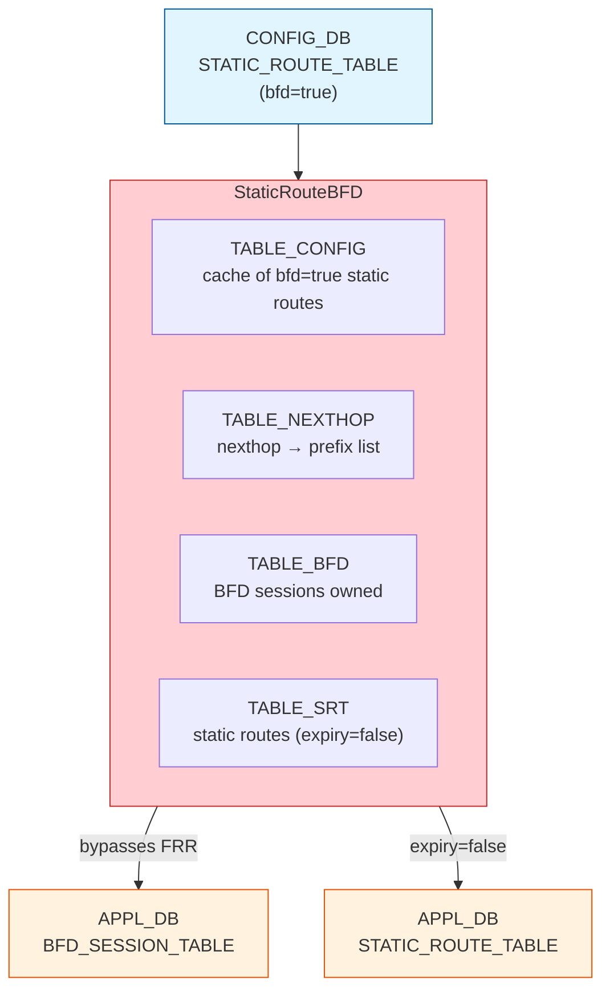
```mermaid
flowchart TD
    CONFIG["CONFIG_DB\nSTATIC_ROUTE_TABLE\n(bfd=true)"] --> SRB

    subgraph SRB["StaticRouteBFD"]
        T1["TABLE_CONFIG\ncache of bfd=true static routes"]
        T2["TABLE_NEXTHOP\nnexthop → prefix list"]
        T3["TABLE_BFD\nBFD sessions owned"]
        T4["TABLE_SRT\nstatic routes (expiry=false)"]
    end

    SRB -->|"bypasses FRR"| BFD_APPL["APPL_DB\nBFD_SESSION_TABLE"]
    SRB -->|"expiry=false"| RT_APPL["APPL_DB\nSTATIC_ROUTE_TABLE"]

    style CONFIG fill:#e1f5fe,stroke:#01579b
    style SRB fill:#ffcdd2,stroke:#c62828
    style BFD_APPL fill:#fff3e0,stroke:#e65100
    style RT_APPL fill:#fff3e0,stroke:#e65100
```

This design has the following problems:

**Duplication of FRR functionality:** StaticRouteBFD re-implements partial ECMP nexthop management (adding and removing individual nexthops based on BFD state), nexthop sharing across prefixes, and restart reconciliation. FRR staticd already handles all of this natively.

**`expiry=false` workaround:** StaticRouteBFD writes routes to `APPL_DB STATIC_ROUTE_TABLE` with `expiry=false` to prevent `StaticRouteTimer` from expiring them. This coordination mechanism exists solely because StaticRouteBFD operates outside FRR's route management.

**Dual ownership complexity:** When the `bfd` field changes at runtime (`true→false` or `false→true`), StaticRouteMgr and StaticRouteBFD must execute a carefully orchestrated ownership handoff. This complexity exists solely because two components write to the same APPL_DB table.

**FRR visibility gap:** Routes managed by StaticRouteBFD are not visible in FRR's RIB. `show ip route` in vtysh does not reflect BFD-managed static routes.

**No extensibility:** The StaticRouteBFD architecture cannot be extended to other routing protocols. Each protocol would require a similar dedicated component.

### 3.6.2 Unified Architecture via frrcfgd and bfd-syncd

The unified architecture eliminates StaticRouteBFD by routing static route BFD configuration through FRR, consistent with all other routing protocols:

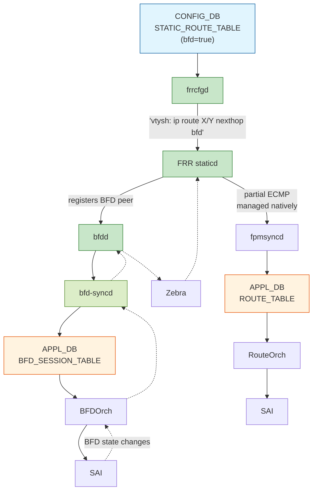
```mermaid
flowchart TD
    CONFIG["CONFIG_DB\nSTATIC_ROUTE_TABLE\n(bfd=true)"] --> frrcfgd

    frrcfgd -->|'vtysh: ip route X/Y nexthop bfd'| staticd["FRR staticd"]

    staticd -->|"registers BFD peer"| bfdd
    bfdd --> bfdsync["bfd-syncd"]
    bfdsync --> APPL_BFD["APPL_DB\nBFD_SESSION_TABLE"]
    APPL_BFD --> BFDOrch --> SAI1["SAI"]

    SAI1 -.->|"BFD state changes"| BFDOrch
    BFDOrch -.-> bfdsync
    bfdsync -.-> bfdd
    bfdd -.-> Zebra
    Zebra -.-> staticd

    staticd -->|"partial ECMP\nmanaged natively"| fpm["fpmsyncd"]
    fpm --> APPL_RT["APPL_DB\nROUTE_TABLE"]
    APPL_RT --> RouteOrch --> SAI2["SAI"]

    style CONFIG fill:#e1f5fe,stroke:#01579b
    style frrcfgd fill:#c8e6c9,stroke:#2e7d32
    style staticd fill:#c8e6c9,stroke:#2e7d32
    style bfdd fill:#c8e6c9,stroke:#2e7d32
    style bfdsync fill:#dcedc8,stroke:#558b2f
    style APPL_BFD fill:#fff3e0,stroke:#e65100
    style APPL_RT fill:#fff3e0,stroke:#e65100
```

CONFIG_DB remains the operator-facing source of truth. frrcfgd is the only new piece of work required to enable this path.

### 3.6.3 frrcfgd Extension for Static Routes

frrcfgd subscribes to `CONFIG_DB STATIC_ROUTE_TABLE` and translates entries with `bfd=true` to FRR staticd configuration via vtysh. This follows the same translation pattern already used for BGP neighbor BFD.

**Field translation:**

| CONFIG_DB field       | FRR staticd equivalent   | Notes                                               |
|-----------------------|--------------------------|-----------------------------------------------------|
| prefix (key)          | route destination        | IPv4 or IPv6 prefix                                 |
| nexthop               | next-hop address         | Comma-separated — one FRR command per nexthop       |
| ifname                | interface name           | Required for link-local nexthops                    |
| distance              | `distance N`             | Maps directly; default 0 if unset                   |
| nexthop-vrf           | `nexthop-vrf NAME`       | For route leaking across VRFs                       |
| blackhole             | `blackhole`              | Generates blackhole route when true                 |
| bfd=true              | `bfd` keyword appended   | Triggers BFD peer registration via staticd → bfdd   |
| bfd=false (or absent) | bfd keyword omitted      | frrcfgd removes bfd keyword; staticd deregisters    |

**Example translation:**

```
CONFIG_DB:
  STATIC_ROUTE|default|10.0.0.0/8
    nexthop:  192.168.1.1,192.168.1.2
    distance: 10
    bfd:      true

frrcfgd generates:
  ip route 10.0.0.0/8 192.168.1.1 distance 10 bfd
  ip route 10.0.0.0/8 192.168.1.2 distance 10 bfd
```

**Runtime bfd field change (false→true):** frrcfgd adds the `bfd` keyword to the existing FRR route command. FRR staticd registers BFD peers with bfdd without withdrawing the route — the nexthop remains installed until BFD explicitly reports it DOWN. No transient outage occurs.

**Runtime bfd field change (true→false):** frrcfgd removes the `bfd` keyword. FRR staticd deregisters BFD peers. The route continues to be installed based on routing table reachability alone.

### 3.6.4 StaticRouteBFD Elimination

With frrcfgd relaying static routes to FRR staticd and bfd-syncd handling all hardware BFD plumbing, every responsibility of StaticRouteBFD is handled by another component:

| StaticRouteBFD responsibility         | Replacement in unified architecture                               | Action    |
|---------------------------------------|-------------------------------------------------------------------|-----------|
| Read CONFIG_DB bfd=true static routes | frrcfgd subscribes to STATIC_ROUTE_TABLE                         | Eliminated|
| Write BFD sessions to APPL_DB         | bfd-syncd receives DP_ADD_SESSION from bfdd via staticd           | Eliminated|
| TABLE_NEXTHOP (nexthop sharing)        | bfdd tracks one BFD session per (peer, ifname, vrf) tuple        | Eliminated|
| TABLE_CONFIG / TABLE_BFD / TABLE_SRT  | Replaced by FRR RIB and bfd-syncd session map                    | Eliminated|
| Partial ECMP nexthop management       | FRR staticd adds/removes nexthops from RIB based on bfdd state   | Eliminated|
| Restart reconciliation (4-table)      | bfd-syncd reconciles from STATE_DB; FRR manages its own state    | Eliminated|
| expiry=false coordination             | Routes via fpmsyncd → ROUTE_TABLE; StaticRouteTimer not involved  | Eliminated|
| bfd flag ownership handoff            | frrcfgd is single owner; FRR staticd is single route manager     | Eliminated|
| NeighOrch BFD observer registration   | NeighOrch registers itself in its own constructor (§3.5.2)       | Moved     |
| **StaticRouteBFD component**          | **Not required**                                                  | **Deleted**|

The NeighOrch BFD observer — previously wired via StaticRouteBFD — moves to NeighOrch's own constructor. This makes convergence acceleration generic and protocol-agnostic: it activates for BGP, OSPF, IS-IS, and static routes without any protocol-specific wiring.

Routes in the unified architecture flow via `fpmsyncd → APPL_DB ROUTE_TABLE → RouteOrch`. `StaticRouteTimer` never sees these routes; the `expiry=false` mechanism is unnecessary and is removed from `StaticRouteTimer` as part of this cleanup.

### 3.6.5 Migration Sequence

StaticRouteBFD cannot be removed until frrcfgd is extended to relay `bfd=true` static routes to FRR staticd. The following sequence ensures no traffic impact:

| Phase | Work item                                                                            |
|-------|--------------------------------------------------------------------------------------|
| 1     | Implement and deploy bfd-syncd (this document)                                       |
| 2     | Extend frrcfgd to subscribe to STATIC_ROUTE_TABLE and relay to FRR staticd           |
| 3     | Validate end-to-end static route BFD via the new path (test cases §10.5)             |
| 4     | Remove StaticRouteBFD; move NeighOrch observer registration to NeighOrch constructor  |
| 5     | Remove expiry=false handling from StaticRouteTimer                                    |

StaticRouteBFD remains fully functional and unchanged until Phase 4. Both paths can coexist during transition with no conflict, as frrcfgd routes only `bfd=true` entries — StaticRouteMgr continues handling all other static routes exactly as today.

## 3.7 Multi-Owner BFD Session Management

Multiple SONiC components write to `APPL_DB:BFD_SESSION_TABLE` independently: bfd-syncd (this HLD), VnetOrch (VXLAN tunnel liveness monitoring), and StaticRouteBFD (until eliminated per §3.6). All use the same key format `vrf:ifname:ipaddr`. Without an ownership model, the second writer silently overwrites the first, and the first deleter destroys the session even if other owners still need it.

### 3.7.1 Problem: Key Collision and Silent Deletion

**Collision scenario:** A BGP peer and a VXLAN VTEP share the same underlay IP (common in BGP-EVPN deployments). bfd-syncd writes `BFD_SESSION_TABLE:default:default:10.1.1.1`. VnetOrch writes the same key, possibly with different timer values. The second write overwrites the first.

**Silent deletion scenario:** When the BGP neighbor is removed, bfd-syncd sends `DP_DELETE_SESSION` and deletes the key. VnetOrch receives a BFD DOWN event for a VTEP it still needs to monitor. It has no way to distinguish "peer is dead" from "another component deleted my session." Overlay traffic may be incorrectly dropped.

**Multi-hop key collision:** For multi-hop sessions, `ifname` is set to "default" (§4.1). Two components monitoring the same remote IP via multi-hop BFD produce identical keys `default:default:<ip>`, compounding the collision problem.

### 3.7.2 Resolution: Plain Reference Counting at BFDOrch

BFDOrch maintains a simple reference count per session key. No owner identity tracking, no per-owner timer merging, no schema changes.

```cpp
// BFDOrch internal state — one counter per session key
unordered_map<string, int> m_sessionRefCount;
```

**Session creation (SET to APPL_DB):**
- Increment `m_sessionRefCount[key]`
- If ref_count == 1 (new session): create SAI session using the provided timer values
- If ref_count > 1 (session exists): do not create a duplicate SAI session; last-write-wins for timer values (existing behavior)

**Session deletion (DEL from APPL_DB):**
- Decrement `m_sessionRefCount[key]`
- If ref_count > 0: hardware session remains; other writers unaffected
- If ref_count == 0: destroy SAI session; remove STATE_DB entry; erase map entry

**State change notification:**
- BFDOrch notifies all subscribers via STATE_DB (existing behavior — all consumers subscribe to STATE_DB independently, so this requires no change)

This is the minimum change required to prevent the silent deletion problem described in §3.7.1. It requires ~10 lines of code in BFDOrch and no APPL_DB schema changes. Per-owner timer conflict resolution (minimum timer policy) and owner identity tracking are deferred to a future HLD if operational need arises.

**Operator note (timer consistency):** Because BFDOrch stores only one set of timers per `BFD_SESSION_TABLE` key and uses last‑write‑wins semantics when multiple writers configure the same session, all consumers of a shared BFD session (e.g., BGP, staticd, VnetOrch) should be configured with consistent BFD timer values for that peer. Conflicting per‑owner timer settings are not rejected and may result in one application unintentionally overriding another’s timers.

## 3.9 Partial BFD Offload

Some ASICs cannot perform the full BFD session lifecycle in hardware. Partial offload allows software (FRR bfdd) to handle the initial handshake, then hand the established session to hardware for steady-state keepalive.

### 3.9.1 Problem Statement

The BFD-Syncd design (§3.1–§3.3) assumes hardware handles the full BFD session lifecycle — 3-way handshake, steady-state keepalive, and failure detection. However, some ASICs cannot perform the initial BFD handshake:

- The ASIC needs the **remote discriminator** before it can match incoming BFD packets — this is only learned during the handshake.
- **Timer negotiation** happens during session establishment — hardware needs the final negotiated values, not the configured values.
- Some ASICs only support a "canned" BFD state machine: TX at a configured rate, check RX at a configured rate, match a known discriminator. No Init→Up transition logic.

### 3.9.2 Hybrid Mode in bfdd

A new bfdd mode (`--dplane-after-up`) where bfdd performs the software BFD handshake first, learns the remote discriminator and negotiated timers, then offloads the established session to hardware via the existing Distributed BFD protocol. In SONiC this mode is implemented as a small, SONiC‑local patch carried in the `sonic-frr` package; upstreaming to the FRR project is a best‑effort, non‑blocking follow‑up.

### 3.9.3 Session Lifecycle

```
Phase 1: Software Handshake
  1. Routing daemon (BGPd / OSPFd / staticd) registers BFD peer with bfdd
  2. bfdd runs software BFD — sends/receives BFD control packets via CPU
  3. Software 3-way handshake: Down → Init → Up
  4. bfdd learns:
     - Remote discriminator (from peer's BFD control packets)
     - Negotiated TX interval (max of local desired, remote required)
     - Negotiated RX interval (max of local required, remote desired)

Phase 2: Handover to Hardware
  5. bfdd sends DP_ADD_SESSION to bfd-syncd with extra fields:
     - remote_discriminator: learned from peer
     - negotiated_tx_interval: final negotiated value (microseconds)
     - negotiated_rx_interval: final negotiated value (microseconds)
     - initial_state: UP
  6. bfd-syncd writes APPL_DB entry with these values
  7. BFDOrch creates SAI BFD session in UP state with pre-populated remote discriminator
  8. Hardware starts TX/RX

Phase 3: Software TX Overlap and Cutover
  9. bfdd continues software TX until bfd-syncd confirms hardware is active
     (BFD_STATE_CHANGE UP received)
  10. bfdd stops software TX for this session
  11. Hardware is now sole owner of BFD packet processing

Phase 4: Steady State
  12. Hardware handles all BFD TX/RX
  13. State changes reported back to bfdd via bfd-syncd (BFD_STATE_CHANGE)
  14. Standard path as described in §3.3.2
```

### 3.9.4 Takeover Window

The critical moment is the handover from software to hardware. If hardware hasn't started TX before software stops, the remote peer's detection timer could expire, causing a false BFD DOWN.

The solution is an **overlap window** where both software and hardware are transmitting simultaneously:

```
Timeline:

bfdd software TX:     |========================|----stop----|
                                               ^            ^
                                          HW session     BFD_STATE_CHANGE UP
                                          created        received from bfd-syncd

hardware TX:                              |===============================>

overlap window:                           |=============|
                                          (duplicate BFD packets — harmless,
                                           RFC 5880 handles gracefully)
```

**Overlap safety:** During the overlap, the remote peer receives BFD packets from both software and hardware. Both carry the same local discriminator and session parameters. The remote peer processes whichever arrives first and ignores duplicates — this is standard BFD behavior per RFC 5880. The overlap duration is bounded by bfd-syncd processing time (APPL_DB write → BFDOrch → SAI → first hardware TX → STATE_DB UP → bfd-syncd notification → bfdd stops software TX). Typical: 50–200ms.

**bfdd must NOT stop software TX until it receives BFD_STATE_CHANGE UP from bfd-syncd.** This is the invariant that prevents the takeover gap.

### 3.9.5 Hardware DOWN Handling

If the hardware session goes DOWN — whether due to genuine peer failure, ASIC reload, SAI error, or SWSS restart — bfd-syncd reports `BFD_STATE_CHANGE DOWN` to bfdd, which notifies upper layers (BGP/OSPF/staticd) via the standard path. No software fallback is attempted.

**Rationale:** Hardware BFD DOWN means the forwarding path is impaired. If the ASIC is restarting or in error state, the data plane cannot forward traffic either — reporting DOWN is the correct signal. Silently switching to software BFD would mask the failure from upper layers and operators. Warm restart scenarios are handled separately by the existing reconciliation path (§7), not by bfdd software fallback.

### 3.9.6 DP_ADD_SESSION Message Extension

Three optional fields are added to the `DP_ADD_SESSION` message in the Distributed BFD protocol (`bfdd/bfddp_packet.h`):

| Field | Type | Description |
|-------|------|-------------|
| `remote_discriminator` | uint32 | Peer's local discriminator, learned during software handshake. 0 means not pre-negotiated (full offload mode). |
| `negotiated_tx_interval` | uint32 | Final negotiated TX interval in microseconds. 0 means use configured value (full offload mode). |
| `negotiated_rx_interval` | uint32 | Final negotiated RX interval in microseconds. 0 means use configured value (full offload mode). |

These fields are **backward compatible** — existing data plane implementations that do not understand them will ignore the zero/absent values and perform full handshake in hardware (current behavior). Data plane implementations that support partial offload use these values to create the session directly in UP state.

### 3.9.7 bfd-syncd Changes

Minimal changes to bfd-syncd:

1. Pass `remote_discriminator` to APPL_DB if present and non-zero
2. Pass `negotiated_tx_interval` / `negotiated_rx_interval` to APPL_DB if present and non-zero
3. No state machine changes — bfd-syncd remains a stateless bridge

New APPL_DB fields:

```
BFD_SESSION_TABLE:{{vrf}}:{{ifname}}:{{ipaddr}}
    ...existing fields from §4.1...
    "remote_discriminator" : {{uint32}}        ; Optional. Pre-negotiated remote discriminator.
    "negotiated_tx_interval" : {{interval}}    ; Optional. Final negotiated TX (microseconds).
    "negotiated_rx_interval" : {{interval}}    ; Optional. Final negotiated RX (microseconds).
```

### 3.9.8 BFDOrch / SAI Changes

BFDOrch must support creating a session with a pre-populated remote discriminator:

| SAI Attribute | Full Offload (current) | Partial Offload |
|---------------|----------------------|-----------------|
| `SAI_BFD_SESSION_ATTR_REMOTE_DISCRIMINATOR` | 0 (learned by ASIC) | Pre-populated from APPL_DB |
| `SAI_BFD_SESSION_ATTR_BFD_ENCAPSULATION_TYPE` | Unchanged | Unchanged |
| `SAI_BFD_SESSION_ATTR_MIN_TX` | Configured value | Negotiated value |
| `SAI_BFD_SESSION_ATTR_MIN_RX` | Configured value | Negotiated value |

**SAI prerequisite:** The ASIC must support `sai_create_bfd_session` with a non-zero `SAI_BFD_SESSION_ATTR_REMOTE_DISCRIMINATOR` and be able to start sending BFD packets immediately in UP state without performing its own handshake. This is ASIC-dependent — verify with your vendor before implementing.

### 3.9.9 Configuration

**bfdd CLI flag:**

```bash
# Full offload (current behavior — ASIC handles handshake)
bfdd --dplaneaddr unix:/var/run/frr/bfdd_dplane.sock

# Partial offload (software handshake, then hardware keepalive)
bfdd --dplaneaddr unix:/var/run/frr/bfdd_dplane.sock --dplane-after-up
```

**supervisord template update:**

```jinja


[program:bfdd]
command=/usr/lib/frr/bfdd -A 127.0.0.1 --dplaneaddr unix:/var/run/frr/bfdd_dplane.sock {{ dplane_flag }}

```

**New CONFIG_DB field:**

```
FEATURE|bgp
    "bfd_hw_offload": "true"
    "bfd_partial_offload": "true"    ; Optional. Default: "false".
                                     ; When true, bfdd performs software handshake
                                     ; before offloading to hardware.
```

### 3.9.10 Edge Cases

#### Timer Renegotiation

If the remote peer requests a timer change after hardware takeover (RFC 5880 §6.8.3), bfdd cannot process it — hardware is handling packets. Two options:

1. **Ignore renegotiation in hardware** — hardware continues with original timers. The remote peer adapts (RFC 5880 requires the sender to use the slower of its desired and the peer's required interval). This is the simpler approach and is acceptable for data center deployments where timers are configured symmetrically.

2. **Fall back to software for renegotiation** — hardware reports a parameter mismatch, bfd-syncd signals bfdd, bfdd resumes software BFD, renegotiates, then re-offloads. This is more correct but adds complexity.

Recommendation: Option 1 for initial implementation. Option 2 as future enhancement if needed.

#### Session Flap During Handover

If the remote peer flaps during the overlap window (between hardware session creation and bfdd stopping software TX), both software and hardware detect the flap. bfdd receives the DOWN event twice — once from its own software detection and once from bfd-syncd. bfdd must deduplicate: once hardware is confirmed active (BFD_STATE_CHANGE received), bfdd should only act on bfd-syncd notifications and ignore its own software detection for that session.

#### Link-Local Sessions

Partial offload for IPv6 link-local sessions follows the same flow, with the additional MAC resolution step from §3.4 occurring between steps 6 and 7 (after bfd-syncd receives DP_ADD_SESSION but before writing to APPL_DB). The software handshake in steps 2–4 uses the CPU and kernel networking stack, which resolves link-local MACs via NDP automatically — no special handling needed during the software phase.

### 3.9.11 Implementation Scope

| Component | Change Required | Complexity |
|-----------|----------------|------------|
| FRR bfdd | New `--dplane-after-up` mode: delay DP_ADD_SESSION until software UP, add fields, overlap logic | Medium — core change |
| bfd-syncd | Pass through 3 new optional APPL_DB fields | Low |
| BFDOrch | Support pre-populated remote discriminator in `sai_create_bfd_session` | Low |
| SAI/ASIC | Create session with known remote discriminator, start in UP state | Vendor-dependent |
| CONFIG_DB | New `bfd_partial_offload` field in FEATURE table | Low |
| YANG | New leaf for `bfd_partial_offload` | Low |

### 3.9.12 Open Questions

1. **SAI support:** Does `sai_create_bfd_session` with non-zero `SAI_BFD_SESSION_ATTR_REMOTE_DISCRIMINATOR` work on the target ASIC? Does the ASIC start TX immediately or still require its own Init→Up transition?

2. **FRR upstream appetite:** The `--dplane-after-up` mode is initially carried as a SONiC‑local patch in `sonic-frr`. Upstream acceptance by the FRR community is desirable but not required for SONiC to ship this feature; the main risk is additional maintenance of the local delta if the upstream design diverges.

3. **Overlap duration bound:** What is the worst-case latency from APPL_DB write to first hardware BFD TX? If this exceeds the remote peer's detection timeout (e.g., 3 × 100ms = 300ms), the overlap window may not be sufficient, and bfdd may need to temporarily increase its software TX rate during handover.

# 4 Database Schema

bfd-syncd uses the existing BFD database schema defined in [BFD HW Offload HLD](https://github.com/sonic-net/SONiC/blob/master/doc/bfd/BFD%20HW%20Offload%20HLD.md).

## 4.1 APPL_DB (bfd-syncd writes)

bfd-syncd writes to `BFD_SESSION_TABLE` when it receives `DP_ADD_SESSION` from bfdd:

```
BFD_SESSION_TABLE:{{vrf}}:{{ifname}}:{{ipaddr}}
    "local_addr"    : {{ipv4/v6}}           ; Local source IP address
    "type"          : "async_active"        ; BFD session type
    "tx_interval"   : {{interval}}          ; Desired TX interval in microseconds
    "rx_interval"   : {{interval}}          ; Required RX interval in microseconds
    "multiplier"    : {{multiplier}}        ; Detection multiplier (1-255)
    "multihop"      : "true"|"false"        ; Multi-hop session flag
```

**Note:** bfd-syncd converts FRR's millisecond intervals to microseconds for APPL_DB (BFDOrch/SAI uses microseconds).

**`type: async_active` is always set by bfd-syncd** regardless of the mode flags in `DP_ADD_SESSION`. Hardware BFD always operates in asynchronous active mode — it does not support passive mode (waiting for the remote side to initiate). Passive mode flags are stripped before writing to APPL_DB (see §3.2.2).

Key format follows [BFD HW Offload HLD](https://github.com/sonic-net/SONiC/blob/master/doc/bfd/BFD%20HW%20Offload%20HLD.md):
- `vrf`: VRF name ("default" if not specified)
- `ifname`: Interface name ("default" for multi-hop sessions)
- `ipaddr`: Peer IP address (IPv4 or IPv6, including link-local)

## 4.2 STATE_DB (bfd-syncd reads)

bfd-syncd subscribes to `BFD_SESSION_TABLE` state changes and sends `BFD_STATE_CHANGE` to bfdd:

```
BFD_SESSION_TABLE:{{vrf}}:{{ifname}}:{{ipaddr}}
    "state"                 : {{state}}     ; Admin_Down|Down|Init|Up
    "local_discriminator"   : {{lid}}       ; Local discriminator (assigned by BFDOrch)
    "remote_discriminator"  : {{rid}}       ; Peer's discriminator (learned from peer)
```

## 4.3 Discriminator Management

Local discriminators are assigned by BFDOrch when creating hardware BFD sessions. bfd-syncd:
1. Receives the discriminator from STATE_DB after BFDOrch creates the session
2. Reports the discriminator to bfdd via `BFD_STATE_CHANGE`
3. Maintains an in-memory mapping between FRR's session LID and the hardware discriminator
4. Rebuilds this mapping from STATE_DB at every startup — no external state persistence required

**SWSS container restart — discriminator remapping (P2-8):** After a SWSS container restart, BFDOrch recreates hardware sessions from APPL_DB and may assign different local discriminators than before the restart. bfd-syncd rebuilds its in‑memory LID↔key↔discriminator map by re‑reading `STATE_DB:BFD_SESSION_TABLE` and continues sending `BFD_STATE_CHANGE` notifications with the updated discriminators. SWSS restarts may cause transient BFD Down/Up events for affected sessions; this is acceptable because a SWSS restart already disrupts data‑plane programming.

**Discriminator map observability (P4-4):** The current discriminator map is not directly queryable. For debugging, bfd-syncd logs the full LID↔key↔discriminator mapping at `LOG_DEBUG` level on startup and on every map entry change. Operators can inspect the mapping via `docker exec bgp grep "discriminator" /var/log/syslog`.

## 4.4 APPL_DB — Link-Local Session Additional Fields

For IPv6 link-local BFD sessions, bfd-syncd writes additional fields to instruct BfdOrch to use inject-down encapsulation mode:

```
BFD_SESSION_TABLE:{{vrf}}:{{ifname}}:{{ipaddr}}
    ; all standard fields from §4.1, plus:
    "encap_type"    : "l2"                  ; Present only for link-local sessions
    "src_mac"       : {{mac_address}}       ; Source MAC from /sys/class/net/<ifname>/address
    "dst_mac"       : {{mac_address}}       ; Destination MAC from netlink RTM_NEWNEIGH
```

These additional fields are absent for routable (non-link-local) BFD sessions. BfdOrch uses `SAI_BFD_ENCAPSULATION_TYPE_NONE` when the fields are absent and `SAI_BFD_ENCAPSULATION_TYPE_L2` when present.

When bfd-syncd detects a MAC address change for a tracked link-local session (§3.4.4), it deletes the existing `APPL_DB BFD_SESSION_TABLE` entry and re-creates it with the updated `dst_mac`. BfdOrch destroys the old hardware session and creates a new one.

## 4.5 Counter Schema (STATE_DB)

When bfd-syncd receives `DP_REQUEST_SESSION_COUNTERS` from bfdd, it reads the following fields from `STATE_DB:BFD_SESSION_TABLE` and returns them to bfdd via `BFD_SESSION_COUNTERS`:

```
STATE_DB:BFD_SESSION_TABLE:{{vrf}}:{{ifname}}:{{ipaddr}}
    "tx_count"           : {{uint64}}   ; Total BFD control packets transmitted by ASIC
    "rx_count"           : {{uint64}}   ; Total BFD control packets received by ASIC
    "up_count"           : {{uint32}}   ; Number of times session transitioned to Up state
    "down_count"         : {{uint32}}   ; Number of times session transitioned to Down state
    "last_state_change"  : {{timestamp}}; Timestamp of most recent state transition (ISO 8601)
```

These fields are written by BFDOrch from SAI counter responses. If BFDOrch does not support a counter field, the field is absent from STATE_DB; bfd-syncd returns zero for absent fields in the `BFD_SESSION_COUNTERS` response.

## 4.6 bfd-syncd Internal Session State (STATE_DB diagnostic)

Link-local sessions in `RESOLVING` or `FAILED` state exist only in bfd-syncd's in-memory state — no APPL_DB entry exists yet. Without an observable representation, these sessions are invisible to operators and indistinguishable from unconfigured sessions.

bfd-syncd writes an internal diagnostic entry to STATE_DB for sessions not yet in APPL_DB:

```
STATE_DB:BFDSYNCD_SESSION_TABLE:{{vrf}}:{{ifname}}:{{ipaddr}}
    "internal_state"  : "RESOLVING" | "FAILED" | "FAILED_PERMANENT"  ; bfd-syncd internal state
    "reason"          : {{string}}               ; e.g., "Awaiting NDP resolution", "RTM_GETNEIGH failed after 3 retries",
                                                 ;       "Retry limit exceeded (30 attempts over 30 minutes)"
    "retry_count"     : {{uint32}}               ; Number of RTM_GETNEIGH probes attempted
    "last_updated"    : {{timestamp}}            ; ISO 8601
```

- `RESOLVING`: Initial MAC resolution in progress (RTM_GETNEIGH probes active)
- `FAILED`: MAC resolution failed; periodic re-resolution active (every 60s, up to 30 attempts)
- `FAILED_PERMANENT`: All retry attempts exhausted; no further probes. Requires new `DP_ADD_SESSION` or operator intervention to restart resolution

This entry is written on transition to RESOLVING state and deleted when the session transitions to ACTIVE (APPL_DB entry created) or is deleted. It provides operators with visibility into sessions stuck in MAC resolution without requiring log inspection.

# 5 SAI API

bfd-syncd does not interact with SAI directly. It communicates only with BfdOrch via APPL_DB and STATE_DB. BfdOrch is responsible for all SAI BFD API calls.

See [BFD HW Offload HLD](https://github.com/sonic-net/SONiC/blob/master/doc/bfd/BFD%20HW%20Offload%20HLD.md) for full SAI BFD API details.

## 5.1 SAI Attributes for Link-Local Sessions

For link-local BFD sessions, BfdOrch sets the following additional SAI attributes based on the `encap_type`, `src_mac`, and `dst_mac` fields written by bfd-syncd:

| SAI Attribute                          | Link-local sessions                         | Routable sessions                   |
|----------------------------------------|---------------------------------------------|-------------------------------------|
| `SAI_BFD_SESSION_ATTR_MULTIHOP`        | false                                       | false (single-hop) or true          |
| `SAI_BFD_ENCAPSULATION_TYPE`           | `SAI_BFD_ENCAPSULATION_TYPE_L2`             | `SAI_BFD_ENCAPSULATION_TYPE_NONE`   |
| `SAI_BFD_SESSION_ATTR_SRC_MAC_ADDRESS` | Source MAC from APPL_DB `src_mac` field     | Not set                             |
| `SAI_BFD_SESSION_ATTR_DST_MAC_ADDRESS` | Destination MAC from APPL_DB `dst_mac` field| Not set                             |

BfdOrch detects link-local sessions by the presence of `encap_type=l2` in the APPL_DB entry. No changes to the SAI BFD API specification are required; these attributes are defined in the existing SAI BFD specification.

# 6 Configuration and Management

## 6.1 Hardware vs Software BFD Switch

The switch between hardware-offloaded BFD and software (CPU-based) BFD is **system-wide and startup-time**. It is not a per-session toggle. When hardware offload is enabled, all FRR BFD sessions are offloaded to hardware via bfd-syncd. There is no mode where some sessions run in hardware and others run in software simultaneously.

This design follows the approach established in PR #1599.

### 6.1.1 CONFIG_DB Feature Flag

The operator controls the BFD mode via a feature flag in CONFIG_DB:

```
FEATURE|bgp
    "bfd_hw_offload": "true"    ; Enable hardware BFD offload via bfd-syncd
                                ; Default: "false" (software BFD)
```

| `bfd_hw_offload` | bfdd mode | bfd-syncd | BFD processing |
|------------------|-----------|-----------|----------------|
| `false` (default)| Software BFD only (`bfdd -A 127.0.0.1`) | Not started | CPU |
| `true`           | Distributed BFD (`bfdd --dplaneaddr ...`) | Started | ASIC |

### 6.1.2 supervisord Template

The feature flag drives a Jinja2 template in `supervisord.conf.j2` that conditionally starts bfdd and bfd-syncd:

```jinja

[program:bfd-syncd]
command=/usr/bin/bfd-syncd
priority=4
autostart=false
autorestart=false
startsecs=0
stdout_logfile=syslog
stderr_logfile=syslog
dependent_startup=true
dependent_startup_wait_for=zebra:running

[program:bfdd]
command=/usr/lib/frr/bfdd -A 127.0.0.1 --dplaneaddr unix:/var/run/frr/bfdd_dplane.sock
priority=5
autostart=false
autorestart=false
startsecs=0
stdout_logfile=syslog
stderr_logfile=syslog
dependent_startup=true
dependent_startup_wait_for=bfd-syncd:running


[program:bfdd]
command=/usr/lib/frr/bfdd -A 127.0.0.1
priority=4
autostart=false
autorestart=false
startsecs=0
stdout_logfile=syslog
stderr_logfile=syslog
dependent_startup=true
dependent_startup_wait_for=zebra:running

```

**Startup ordering:** bfd-syncd starts first (priority=4), then bfdd (priority=5) with `dependent_startup_wait_for=bfd-syncd:running`. This ensures bfd-syncd is ready to accept the dplane socket connection before bfdd attempts to connect.

### 6.1.3 Switching Between Modes

Switching between software BFD and hardware BFD requires:

1. Update `FEATURE|bgp.bfd_hw_offload` in CONFIG_DB
2. Restart the BGP container (`sudo systemctl restart bgp`)

A BGP container restart causes a brief BFD session flap for all active sessions — this is expected behavior. Hardware BFD sessions are re-established after the container restarts and bfd-syncd reconciles with STATE_DB (§7).

There is no hitless switch between software and hardware BFD modes.

**Config migration on upgrade:** The `bfd_hw_offload` field is absent from existing deployments that upgrade to a SONiC release containing this feature. An absent field is treated as `false` (software BFD) — this is the safe default, ensuring no behavioral change on upgrade. Operators who wish to enable hardware BFD offload must explicitly set the field after upgrade and restart the BGP container. No automated migration script is required because the default-false behavior is correct for all pre-existing deployments.

### 6.1.4 Cross-Client Session Migration

When hardware BFD offload is enabled (`bfd_hw_offload=true`), the impact on existing BFD session owners varies by client:

| Client | Container | Impact of enabling `bfd_hw_offload` | Action required |
|--------|-----------|--------------------------------------|-----------------|
| bfdd (software BFD) | BGP | Software sessions are replaced by hardware sessions via bfd-syncd. bfdd restarts in distributed mode (`--dplaneaddr`), re-registers all peers via `DP_ADD_SESSION`, and bfd-syncd creates hardware sessions. Brief session flap during BGP container restart. | None — automatic |
| StaticRouteBFD | SWSS | **Unaffected.** StaticRouteBFD writes directly to `APPL_DB:BFD_SESSION_TABLE` from SWSS. It does not interact with bfdd or the BGP container. Its sessions continue to exist in hardware as before. | None — coexists |
| VnetOrch | SWSS | **Unaffected.** VnetOrch writes directly to `APPL_DB:BFD_SESSION_TABLE` from SWSS for VXLAN tunnel liveness monitoring. It does not interact with bfdd or the BGP container. | None — coexists |

**Key collision during coexistence:** When `bfd_hw_offload=true` and StaticRouteBFD is still active (before Phase 4 of §3.6.5), both bfd-syncd and StaticRouteBFD may write to the same `BFD_SESSION_TABLE` key for a static route nexthop that also has a BGP peer. BFDOrch's reference counting (§3.7.2) prevents silent deletion — both writers' sessions are protected. The session uses last-write-wins for timer values during this coexistence period.

**Disabling hardware offload (`bfd_hw_offload` true→false):** When the operator disables hardware offload:
1. BGP container restarts; bfdd starts in software mode
2. bfd-syncd is not started; no `DP_ADD_SESSION` messages are sent
3. APPL_DB entries previously written by bfd-syncd become orphaned — BFDOrch continues to maintain the hardware sessions until they are explicitly deleted
4. bfd-syncd should delete all its APPL_DB entries during a clean shutdown (SIGTERM handler) before the BGP container stops. This ensures BFDOrch's refcount is decremented and hardware sessions are cleaned up (or remain if other owners like VnetOrch still hold references)

StaticRouteBFD and VnetOrch sessions are unaffected by the mode toggle — they are in SWSS and bypass the BGP container entirely.

## 6.2 BFD Session Configuration

BFD sessions are configured via CONFIG_DB, which provides persistent configuration across reboots and is the operator-facing source of truth for all BFD session configuration.

**BGP neighbor with BFD:**
```
BGP_NEIGHBOR|default|10.0.0.2
    "asn": "65001"
    "bfd": "true"
```

**Static route with BFD (relayed to FRR staticd via frrcfgd — see §3.6.3):**
```
STATIC_ROUTE|default|10.0.0.0/8
    "nexthop":  "192.168.1.1,192.168.1.2"
    "distance": "10"
    "bfd":      "true"
```

frrcfgd translates these CONFIG_DB entries to FRR configuration via vtysh. The resulting FRR configuration triggers bfdd to request BFD sessions via the Distributed BFD protocol, which bfd-syncd then processes.

## 6.3 YANG Model Changes

SONiC upstream requires YANG model coverage for all new CONFIG_DB keys and APPL_DB schema additions.

### 6.3.1 FEATURE table — bfd_hw_offload

The `bfd_hw_offload` field added to the `FEATURE` table (§6.1.1) requires a new leaf in the SONiC FEATURE YANG model (`sonic-feature.yang`):

```yang
container sonic-feature {
  container FEATURE {
    list FEATURE_LIST {
      /* existing leaves */
      leaf bfd_hw_offload {
        when "../name = 'bgp'";
        type boolean;
        default false;
        description "Enable hardware BFD offload via bfd-syncd.
                     When true, bfdd starts in distributed BFD mode and
                     bfd-syncd is started to bridge bfdd with BFDOrch.
                     Requires BGP container restart to take effect.
                     Only applicable to the bgp feature.";
      }
    }
  }
}
```

**Note:** The `when` constraint restricts this leaf to the `bgp` feature entry only. Without it, the leaf would be syntactically valid for any feature (e.g., `FEATURE|swss`), which is meaningless.

### 6.3.2 BFD_SESSION_TABLE — new link-local fields

The `encap_type`, `src_mac`, and `dst_mac` fields added to `APPL_DB:BFD_SESSION_TABLE` (§4.4) extend the existing BFD session YANG model (`sonic-bfd.yang`):

```yang
/* In the BFD_SESSION_TABLE list, add: */
leaf encap_type {
  type enumeration {
    enum "l2" {
      description "Layer 2 encapsulation for link-local BFD sessions (inject-down mode)";
    }
  }
  description "Present only for IPv6 link-local BFD sessions. Absence implies standard IP encapsulation.";
}
leaf src_mac {
  type yang:mac-address;
  description "Source MAC for inject-down mode. Required when encap_type=l2.";
}
leaf dst_mac {
  type yang:mac-address;
  description "Destination MAC for inject-down mode. Required when encap_type=l2.";
}
```

### 6.3.3 BFDSYNCD_SESSION_TABLE — new diagnostic table

The new `STATE_DB:BFDSYNCD_SESSION_TABLE` (§4.6) requires a new YANG container. This is a read-only operational state table and does not require config YANG coverage, but must be covered in the operational state YANG model.

# 7 Warm Restart

## 7.1 Startup Sequence

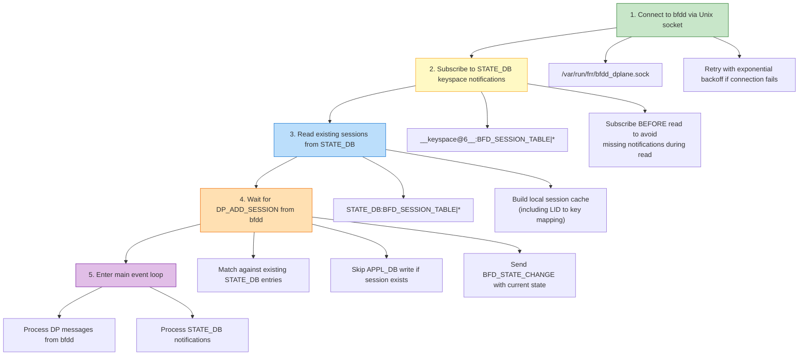
```mermaid
flowchart TD
    A["1. Connect to bfdd via Unix socket"] --> B["2. Subscribe to STATE_DB keyspace notifications"]
    B --> C["3. Read existing sessions from STATE_DB"]
    C --> D["4. Wait for DP_ADD_SESSION from bfdd"]
    D --> E["5. Enter main event loop"]

    A --> A1["/var/run/frr/bfdd_dplane.sock"]
    A --> A2["Retry with exponential backoff if connection fails"]

    B --> B1["__keyspace@6__:BFD_SESSION_TABLE|*"]
    B --> B2["Subscribe BEFORE read to avoid\nmissing notifications during read"]

    C --> C1["STATE_DB:BFD_SESSION_TABLE|*"]
    C --> C2["Build local session cache\n(including LID to key mapping)"]

    D --> D1["Match against existing STATE_DB entries"]
    D --> D2["Skip APPL_DB write if session exists"]
    D --> D3["Send BFD_STATE_CHANGE with current state"]

    E --> E1["Process DP messages from bfdd"]
    E --> E2["Process STATE_DB notifications"]

    style A fill:#c8e6c9,stroke:#2e7d32
    style B fill:#fff9c4,stroke:#f9a825
    style C fill:#bbdefb,stroke:#1976d2
    style D fill:#ffe0b2,stroke:#ef6c00
    style E fill:#e1bee7,stroke:#7b1fa2
```

**Note on ordering:** The subscription (step 2) must happen before the read (step 3) to avoid a race condition. If STATE_DB changes between read and subscribe, bfd-syncd would miss the notification. By subscribing first, any changes during the read are queued and processed after step 3 completes. Duplicate notifications (for entries already captured by the read) are harmless — bfd-syncd's event handler is idempotent.

## 7.2 Restart Scenarios

| Scenario                    | Behavior                                                                                   |
|-----------------------------|--------------------------------------------------------------------------------------------|
| bfd-syncd restart           | Sessions preserved in HW; LID↔key map rebuilt from STATE_DB; state reconciled — no session flap |
| bfdd restart                | bfdd re-sends DP_ADD_SESSION for all peers; bfd-syncd matches each against STATE_DB. Sessions already in STATE_DB: skip APPL_DB write, send BFD_STATE_CHANGE with current state. Sessions with APPL_DB write pending (not yet in STATE_DB): treated as new — APPL_DB SET is idempotent, BFDOrch handles duplicate SET gracefully |
| BGP container restart       | HW sessions continue uninterrupted; FRR re-registers BFD peers; bfd-syncd reconciles on startup |
| SWSS container restart      | BfdOrch recreates HW sessions from APPL_DB and may assign new local discriminators. bfd-syncd rebuilds its LID↔key map from STATE_DB and continues sending `BFD_STATE_CHANGE` notifications with the updated discriminators. BFD sessions may flap during the restart window; this is acceptable given that a SWSS restart already disrupts hardware forwarding. |

**Note:** Full warm restart (hitless restart with zero session flap) depends on BFDOrch warm restart capability. bfd-syncd is stateless and always reconciles from STATE_DB on startup.

# 8 Restrictions and Limitations

| Limitation                               | Description                                                                              |
|------------------------------------------|------------------------------------------------------------------------------------------|
| Software BFD coexistence                 | Hardware BFD and software BFD are mutually exclusive system-wide. Switching modes requires a BGP container restart — see §6.1 |
| Micro BFD                                | Not supported in this implementation (RFC 7130)                                          |
| BFD over LAG member links                | Not supported; configure BFD on the LAG interface directly                               |
| Echo mode                                | Hardware dependent; not guaranteed across all ASIC vendors. bfd-syncd strips the echo mode flag and logs a warning if set in DP_ADD_SESSION (§3.2.2) |
| Demand mode                              | Not supported with hardware offload. bfd-syncd rejects DP_ADD_SESSION with demand mode flag and sends BFD_STATE_CHANGE Admin_Down to bfdd (§3.2.2) |
| Passive mode                             | Not supported with hardware offload. Hardware BFD always operates in async_active mode. bfd-syncd strips passive mode flag silently (§3.2.2) |
| BFD authentication                       | Not supported in this implementation. RFC 5880 §6.7 defines MD5/SHA1 authentication. If bfdd sends DP_ADD_SESSION with authentication parameters, bfd-syncd logs a warning and creates the session without authentication. Future work |
| Maximum sessions                         | Limited by ASIC capability (typically 4000 per BFD HW Offload HLD). When limit is reached, bfd-syncd logs LOG_ERR "BFD HW session limit reached" and sends BFD_STATE_CHANGE Down to bfdd for the rejected session (§3.2.2) |
| Minimum timer                            | Hardware dependent (typically 3.3ms minimum)                                             |
| Multi-hop BFD convergence acceleration   | Not supported via NeighOrch (§3.5.4); BGP PIC is the recommended solution               |
| StaticRouteBFD elimination prerequisite  | StaticRouteBFD can be removed only after frrcfgd is extended to relay static routes to FRR staticd (§3.6.5) |
| Mass BFD session flap                    | In large Clos fabrics, a spine failure can cause hundreds to thousands of simultaneous BFD DOWN events. Traffic protection relies on the NeighOrch hardware fast path (§3.5) to quickly remove failed nexthops from ECMP groups; control‑plane reconvergence time is still bounded by FRR capacity. No additional bfd-syncd‑level coalescing is implemented. |
| Link-local MAC change transient          | When the peer MAC changes (§3.4.4 UPDATING state), bfd-syncd deletes and recreates the APPL_DB entry. The window between DELETE and SET causes a brief hardware BFD session interruption. If the remote peer's detection timeout is shorter than BFDOrch's processing latency for this window, a spurious BFD DOWN may propagate to the routing protocol. This is a known transient; the duration is bounded by BFDOrch processing latency |
| NHFLAGS_IFDOWN clearing coordination     | NeighOrch sets NHFLAGS_IFDOWN from both interface-down and BFD DOWN events. Both conditions must be clear before the nexthop is re-enabled in hardware ECMP (§3.5.2). If this coordination is not implemented correctly, a nexthop may be re-enabled while one liveness condition is still unconfirmed |
| Admin_Down not signaled to remote peers  | The Distributed BFD protocol lacks a message to transition hardware sessions to Admin_Down before deletion. When an operator shuts down a BFD peer or during planned events, the remote peer sees a timeout (Down) rather than Admin_Down and cannot enter GR helper mode (§3.3.3). Future protocol extension needed |

# 9 Implementation

## 9.1 Repository and Language

This HLD requires changes across multiple repositories:

| Change | Repository | Path | Section |
|--------|-----------|------|---------|
| bfd-syncd daemon (new) | sonic-buildimage | src/sonic-frr/bfd-syncd/ | This HLD |
| supervisord Jinja2 template | sonic-buildimage | dockers/docker-fpm-frr/frr/supervisord/supervisord.conf.j2 | §6.1.2 |
| frrcfgd static route extension | sonic-buildimage | src/sonic-frr/frrcfgd/ | §3.6.3 |
| NeighOrch: BfdOrch observer registration + init order | sonic-swss | orchagent/neighorch.cpp, orchagent/orchdaemon.cpp | §3.5.2 |
| BFDOrch: plain reference counting per session key | sonic-swss | orchagent/bfdorch.cpp | §3.7 |
| BFDOrch: link-local encap_type/src_mac/dst_mac field handling | sonic-swss | orchagent/bfdorch.cpp | §4.4, §5.1 |
| YANG model: FEATURE bfd_hw_offload leaf | sonic-buildimage | src/sonic-yang-models/ | §6.3.1 |
| YANG model: BFD_SESSION_TABLE link-local fields | sonic-buildimage | src/sonic-yang-models/ | §6.3.2 |
| sonic-mgmt test plan | sonic-mgmt | tests/bfd/ | §10 |

**Language:** C++ (consistent with fpmsyncd and orchagent)
**Container:** BGP container (bfd-syncd daemon); SWSS container (BFDOrch, NeighOrch changes)

## 9.2 Build Integration

bfd-syncd is built as part of the sonic-frr package (`src/sonic-frr/bfd-syncd/`) and installed in the BGP container. It shares the sonic-frr build infrastructure and Debian packaging.

## 9.3 New Dependencies

| Library          | Purpose                                                                   | Already in BGP container |
|------------------|---------------------------------------------------------------------------|--------------------------|
| libswsscommon    | Redis APPL_DB / STATE_DB access                                           | Yes                      |
| libmnl or libnl  | Linux netlink socket API for RTNLGRP_NEIGH subscription (§3.4.4)         | No — must be added       |

# 10 Testing Requirements

## 10.1 Unit Tests

- Verify `DP_ADD_SESSION` creates APPL_DB entry with correct fields for IPv4 single-hop
- Verify `DP_ADD_SESSION` creates APPL_DB entry with correct fields for IPv6 single-hop
- Verify `DP_ADD_SESSION` creates APPL_DB entry with correct fields for multi-hop
- Verify `DP_DELETE_SESSION` removes APPL_DB entry
- Verify STATE_DB changes trigger `BFD_STATE_CHANGE` to bfdd
- Verify startup reconciliation: existing STATE_DB sessions skip APPL_DB write
- Verify startup reconciliation: LID↔key mapping rebuilt correctly from STATE_DB
- Verify error handling: socket disconnect triggers reconnection with exponential backoff
- Verify error handling: invalid DP_ADD_SESSION parameters are discarded without APPL_DB write
- Verify link-local: `RTM_NEWNEIGH NUD_REACHABLE` creates APPL_DB entry with `encap_type=l2`, correct `src_mac` and `dst_mac`
- Verify link-local: `RTM_NEWNEIGH` with changed `nda_lladdr` triggers APPL_DB delete and re-create with new MAC
- Verify link-local: `NUD_FAILED` transitions session to FAILED state; RTM_GETNEIGH probe cycle initiated
- Verify link-local: `RTM_DELNEIGH` removes APPL_DB entry and begins probe cycle
- Verify link-local: source MAC read correctly from `/sys/class/net/<ifname>/address`
- Verify counter handling: `DP_REQUEST_SESSION_COUNTERS` generates `BFD_SESSION_COUNTERS` with STATE_DB counter values

## 10.2 Integration Tests

- Verify BGP neighbor with BFD triggers HW session creation via bfd-syncd
- Verify BGP receives BFD state changes from hardware
- Verify BGP neighbor goes down on BFD timeout
- Verify no session flap during bfd-syncd restart
- Verify no session flap during bfdd restart
- Verify scale to maximum supported BFD sessions
- Verify OSPF adjacency uses HW BFD via bfd-syncd
- Verify IS-IS adjacency uses HW BFD via bfd-syncd
- Verify bfd-syncd graceful shutdown (SIGTERM) removes all APPL_DB BFD_SESSION_TABLE entries; BFDOrch destroys hardware sessions
- Verify bfd-syncd shutdown during warm restart does NOT remove APPL_DB entries; hardware sessions survive for reconciliation

## 10.3 IPv6 Link-Local Integration Tests

- BGP unnumbered (link-local peer) with HW BFD: verify session creation with correct `src_mac` and `dst_mac` in APPL_DB
- Verify BFD session state transitions UP and DOWN for link-local BGP peer
- Simulate LAG failover causing peer MAC change: verify APPL_DB entry is deleted and re-created with updated MAC
- Verify `NUD_FAILED` (peer disappears from NDP table) results in BFD session deletion and probe retry
- Verify `disable-connected-check` BGP configuration works correctly with link-local HW BFD — no dependency on BGP session state
- Verify source MAC is read from sysfs for an interface with no routable IP address assigned
- Verify NDP Neighbor Solicitation (not ICMP echo) is used for initial MAC resolution by capturing packets on the wire
- Verify session creation succeeds when ICMPv6 echo is blocked by ACL (NDP NS must not be blocked)

## 10.4 Convergence Acceleration Tests

- Measure and document time from ASIC BFD DOWN event to hardware ECMP group update via NeighOrch path; record result as baseline for regression tracking
- Measure and document time from ASIC BFD DOWN event to RIB update completion via FRR path; record as baseline for comparison with NeighOrch path
- Verify eBGP single-hop: only the failed peer's nexthop is invalidated in the ECMP group; other peers continue forwarding without interruption
- Verify OSPF single-hop: NeighOrch path fires and updates hardware before OSPF SPF completes
- Verify IS-IS single-hop: NeighOrch path fires and updates hardware before IS-IS SPF completes
- Verify multi-hop (iBGP): NeighOrch performs no action (peer not in m_syncdNextHops); FRR handles convergence correctly; no incorrect nexthop invalidation
- Verify dual-path operation: NeighOrch hardware update and FRR RIB update are both applied; no conflict between the two paths
- Verify link-local (BGP unnumbered): NeighOrch convergence acceleration applies correctly (fe80:: address is in m_syncdNextHops)
- Verify NeighOrch BFD observer activates for all protocols generically without any StaticRouteBFD involvement

## 10.5 Unified Architecture and StaticRouteBFD Elimination Tests

The following tests verify the end-to-end static route BFD path via frrcfgd → FRR staticd → bfd-syncd, replacing the StaticRouteBFD path:

- Configure `STATIC_ROUTE_TABLE` with `bfd=true`; verify frrcfgd generates correct FRR staticd vtysh commands
- Verify BFD session is created via bfd-syncd and not via StaticRouteBFD
- Verify static route is installed via fpmsyncd → APPL_DB ROUTE_TABLE and not via APPL_DB STATIC_ROUTE_TABLE with expiry=false
- Verify partial ECMP: one of two nexthops goes DOWN; route is updated with the remaining nexthop; traffic on surviving nexthop is unaffected
- Verify all nexthops DOWN: static route is withdrawn from APPL_DB ROUTE_TABLE
- Verify nexthop recovery: BFD state UP → nexthop re-added to route
- Verify nexthop sharing: two static routes share a nexthop; one BFD session serves both; DOWN event removes the nexthop from both routes
- Verify bfd field change false→true at runtime: existing route not withdrawn during BFD session initialization
- Verify bfd field change true→false at runtime: BFD sessions removed; route continues to be installed via routing table reachability alone
- Verify StaticRouteTimer does not interact with routes installed via the ROUTE_TABLE path
- Verify static route with `nexthop-vrf` (VRF route leak) with `bfd=true`
- Verify IPv6 static route with link-local nexthop with `bfd=true`
- Verify bfd-syncd restart with active static route BFD sessions: no route flap
- Regression: verify static routes without `bfd` field are unaffected and continue to be handled by StaticRouteMgr

## 10.6 sonic-mgmt Test Plan

A PTF/pytest test plan covering all scenarios in §10.1–§10.5 is required for upstream merge. Test plan location: `sonic-mgmt/tests/bfd/test_bfd_hw_offload.py`. The test plan must be submitted and reviewed alongside this HLD PR.

## 10.7 Multi-Owner and BFDOrch Reference Counting Tests

- Verify two components (e.g., bfd-syncd and VnetOrch) can both SET the same BFD session key; hardware session persists until both DEL it
- Verify first DEL does not destroy hardware session when ref_count > 1
- Verify second DEL (ref_count reaches 0) destroys hardware session and removes STATE_DB entry
- Verify STATE_DB BFD DOWN event is delivered correctly when peer genuinely fails (not when one component releases its reference)
- Verify multi-hop key collision: two components create multi-hop BFD to same peer in same VRF; single hardware session created with ref_count=2
- Verify session capacity exhaustion: attempt to create 4001st session; bfd-syncd logs LOG_ERR "BFD HW session limit reached"; bfdd receives BFD_STATE_CHANGE Down; existing 4000 sessions unaffected

## 10.8 Observability and Operational Tests

- Verify BFDSYNCD_SESSION_TABLE entry appears in STATE_DB when link-local session is in RESOLVING state
- Verify BFDSYNCD_SESSION_TABLE entry is removed when session transitions to ACTIVE
- Verify BFDSYNCD_SESSION_TABLE entry shows FAILED state and retry_count after RTM_GETNEIGH exhaustion
- Verify counter fields (tx_count, rx_count, up_count, down_count, last_state_change) are populated in STATE_DB and returned correctly in BFD_SESSION_COUNTERS
- Verify bfd-syncd LOG_ERR is emitted when session limit is reached (searchable in syslog)

## 10.9 Partial BFD Offload Tests

- Verify software handshake completes: bfdd in `--dplane-after-up` mode performs 3-way BFD handshake via CPU before sending DP_ADD_SESSION to bfd-syncd
- Verify DP_ADD_SESSION includes negotiated parameters: `remote_discriminator`, `negotiated_tx_interval`, `negotiated_rx_interval` are non-zero when partial offload is enabled
- Verify APPL_DB fields: bfd-syncd writes `remote_discriminator`, `negotiated_tx_interval`, `negotiated_rx_interval` to BFD_SESSION_TABLE
- Verify BFDOrch creates session with pre-populated remote discriminator: SAI session created with non-zero `SAI_BFD_SESSION_ATTR_REMOTE_DISCRIMINATOR`
- Verify overlap window: bfdd continues software TX until BFD_STATE_CHANGE UP is received from bfd-syncd; no BFD session flap during handover
- Verify hardware DOWN propagation: hardware BFD DOWN event is reported to upper layers (BGP/OSPF); no software fallback attempted
- Verify backward compatibility: when `bfd_partial_offload` is false (default), system behaves as full offload — no partial offload fields in DP_ADD_SESSION
- Verify CONFIG_DB integration: `bfd_partial_offload` field in FEATURE|bgp controls `--dplane-after-up` flag in supervisord template

# 11 References

- [RFC 4291](https://datatracker.ietf.org/doc/html/rfc4291) - IP Version 6 Addressing Architecture (link-local address scope)
- [RFC 4861](https://datatracker.ietf.org/doc/html/rfc4861) - IPv6 Neighbor Discovery (NDP, REACHABLE_TIME, Neighbor Solicitation and Advertisement)
- [RFC 5880](https://datatracker.ietf.org/doc/html/rfc5880) - Bidirectional Forwarding Detection (BFD)
- [RFC 5881](https://datatracker.ietf.org/doc/html/rfc5881) - BFD for IPv4 and IPv6 (Single Hop)
- [RFC 5883](https://datatracker.ietf.org/doc/html/rfc5883) - BFD for Multihop Paths
- [RFC 7938](https://datatracker.ietf.org/doc/html/rfc7938) - Use of BGP for Routing in Large-Scale Data Centers (BGP unnumbered / link-local peering)
- [BFD HW Offload HLD](https://github.com/sonic-net/SONiC/blob/master/doc/bfd/BFD%20HW%20Offload%20HLD.md) - SONiC hardware BFD offload design
- [FRR BFD Documentation](https://docs.frrouting.org/en/latest/bfd.html) - FRR BFD daemon documentation
- [FRR Distributed BFD](https://docs.frrouting.org/en/latest/bfd.html#distributed-bfd) - FRR data plane offload protocol specification
- [BFDOrch Implementation](https://github.com/sonic-net/sonic-swss/blob/master/orchagent/bfdorch.cpp) - SONiC BFD orchestration agent
- [NeighOrch Implementation](https://github.com/sonic-net/sonic-swss/blob/master/orchagent/neighorch.cpp) - SONiC neighbor orchestration agent
- [fpmsyncd Implementation](https://github.com/sonic-net/sonic-swss/blob/master/fpmsyncd/fpmsyncd.cpp) - FPM route synchronization daemon (architectural reference for BGP container IPC pattern)
- [Static Route BFD HLD](https://github.com/sonic-net/SONiC/pull/1216) - Existing static route BFD design (StaticRouteBFD — to be eliminated per §3.6)
- [BFD HW Offload Proposal PR #1599](https://github.com/sonic-net/SONiC/pull/1599) - Open proposal for BGP hardware BFD offload (parallel proposal; architectural comparison in §2.1 and §3.4.3)
