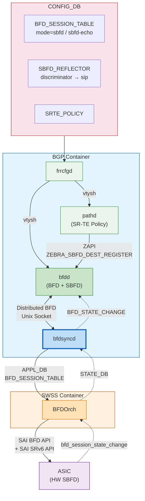
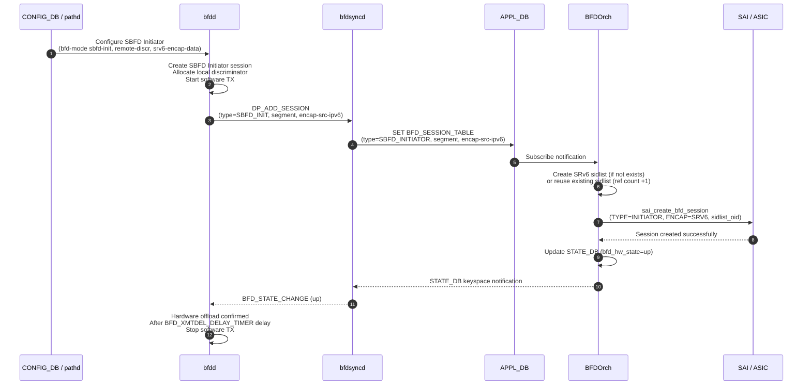
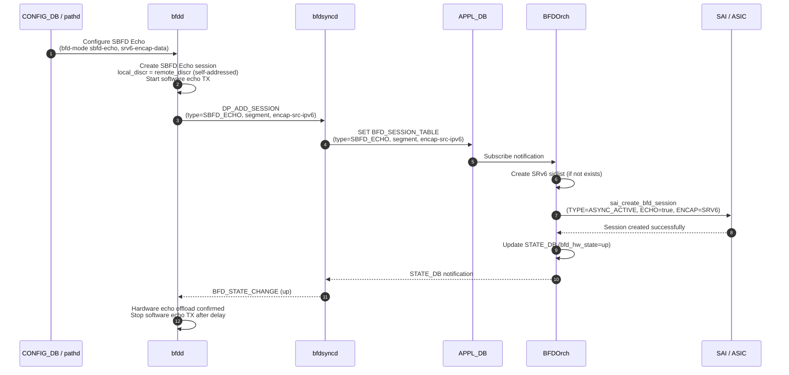
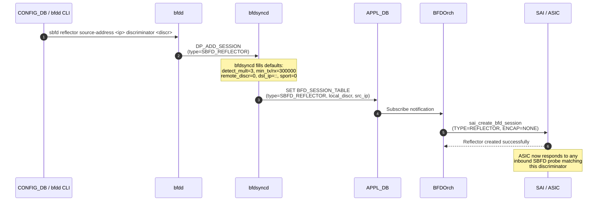
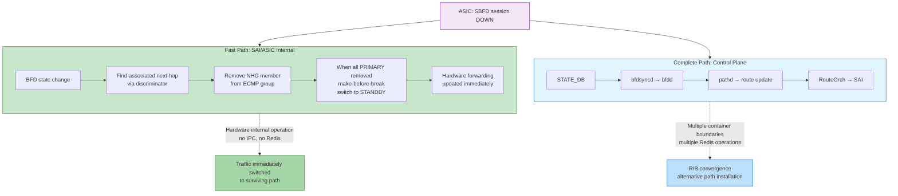
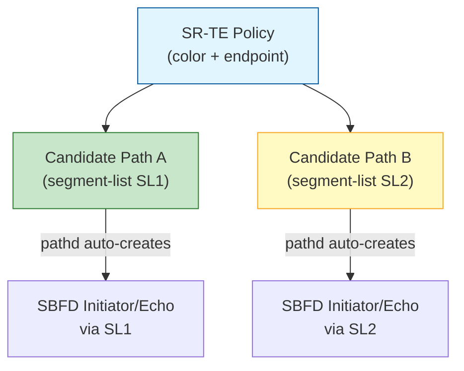
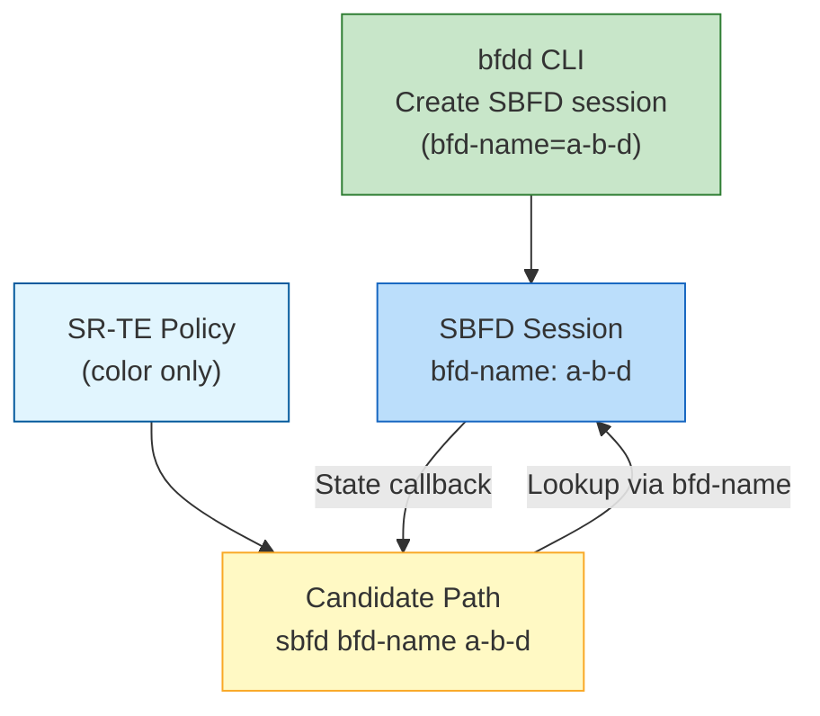

# Seamless BFD (SBFD) Hardware Offload — BFD-Syncd Extension
## High Level Design Document
### Rev 0.1

# Table of Contents

  * [Revision](#revision)
  * [About this Manual](#about-this-manual)
  * [Scope](#scope)
  * [Definitions/Abbreviation](#definitionsabbreviation)
  * [1 SBFD Overview](#1-sbfd-overview)
    * [1.1 What is SBFD](#11-what-is-sbfd)
    * [1.2 SBFD Session Types](#12-sbfd-session-types)
    * [1.3 Role of SRv6 Encapsulation](#13-role-of-srv6-encapsulation)
  * [2 Requirements](#2-requirements)
    * [2.1 Functional Requirements](#21-functional-requirements)
    * [2.2 Scalability Requirements](#22-scalability-requirements)
  * [3 Architecture Design](#3-architecture-design)
    * [3.1 Relationship with BFD-Syncd](#31-relationship-with-bfd-syncd)
    * [3.2 Overall Architecture](#32-overall-architecture)
    * [3.3 Configuration Sources](#33-configuration-sources)
  * [4 Design Details](#4-design-details)
    * [4.1 SBFD Initiator](#41-sbfd-initiator)
    * [4.2 SBFD Echo](#42-sbfd-echo)
    * [4.3 SBFD Reflector](#43-sbfd-reflector)
  * [5 Component Changes](#5-component-changes)
    * [5.1 bfdd SBFD Extension](#51-bfdd-sbfd-extension)
    * [5.2 bfdsyncd SBFD Extension](#52-bfdsyncd-sbfd-extension)
    * [5.3 BFDOrch SBFD Extension](#53-bfdorch-sbfd-extension)
    * [5.4 Convergence Acceleration — SAI-level BFD-coupled NHG Fast Switchover](#54-convergence-acceleration--sai-level-bfd-coupled-nhg-fast-switchover)
  * [6 SR-TE Policy Integration](#6-sr-te-policy-integration)
    * [6.1 pathd SBFD Session Management](#61-pathd-sbfd-session-management)
    * [6.2 Segment-List Liveness Detection](#62-segment-list-liveness-detection)
    * [6.3 Policy State Propagation](#63-policy-state-propagation)
  * [7 Database Schema](#7-database-schema)
    * [7.1 CONFIG_DB](#71-config_db)
    * [7.2 APPL_DB](#72-appl_db)
    * [7.3 STATE_DB](#73-state_db)
  * [8 SAI API](#8-sai-api)
  * [9 Configuration and Management](#9-configuration-and-management)
    * [9.1 FRR CLI Commands](#91-frr-cli-commands)
    * [9.2 CONFIG_DB Configuration Examples](#92-config_db-configuration-examples)
    * [9.3 Show Commands](#93-show-commands)
    * [9.4 YANG Models](#94-yang-models)
  * [10 Warm Restart](#10-warm-restart)
  * [11 Limitations and Constraints](#11-limitations-and-constraints)
  * [12 Test Requirements](#12-test-requirements)
  * [13 References](#13-references)

# Revision

| Rev | Date       | Author       | Change Description                           |
|:---:|:----------:|:------------:|----------------------------------------------|
| 0.1 | 2026-05-12 | Kang Jiang   | Initial version                              |

# About this Manual

This document is an **SBFD extension document** for the [BFD-Syncd HLD](BFD_Syncd_HLD.md). Readers should first read the BFD-Syncd HLD to understand the overall architecture of classic BFD hardware offload (bfdd → bfdsyncd → APPL_DB → BFDOrch → SAI → ASIC data path). This document only describes the design additions for SBFD and does not repeat content already covered by classic BFD.

# Scope

This document covers:
- Hardware offload design for three SBFD session types: Initiator, Echo, and Reflector
- SRv6 encapsulation for path-level liveness detection
- Two configuration paths: SR-TE Policy (pathd) auto-trigger and bfdd CLI manual configuration
- SBFD extensions for bfdd, bfdsyncd, and BFDOrch components
- SR-TE Policy integration (segment-list level liveness detection)
- CONFIG_DB, APPL_DB, STATE_DB schema extensions
- SBFD usage of SAI BFD API

This document does not cover:
- Classic BFD hardware offload (see [BFD-Syncd HLD](BFD_Syncd_HLD.md))
- Non-SRv6 SBFD (e.g., MPLS SBFD)
- Not-yet-implemented features: IPv4-only SBFD, ADMIN DOWN logic, Echo functionality within Initiator session
- SRv6 data plane internal implementation
- SR-TE Policy pathd internal design (candidate path selection algorithm)

# Definitions/Abbreviation

| Term            | Definition                                                                                         |
|-----------------|----------------------------------------------------------------------------------------------------|
| SBFD            | Seamless Bidirectional Forwarding Detection (RFC 7880)                                            |
| BFD             | Bidirectional Forwarding Detection (RFC 5880)                                                     |
| Initiator       | SBFD endpoint that sends BFD control packets to a Reflector to detect path liveness                |
| Reflector       | SBFD endpoint that reflects received SBFD probe packets back to the Initiator, without maintaining per-session state |
| Echo            | SBFD mode where the Initiator sends packets that traverse an SRv6 path and loop back to itself     |
| bfdd            | BFD daemon running in the BGP container, extended to support SBFD                                  |
| bfdsyncd        | Daemon bridging bfdd and BFDOrch via APPL_DB                                                      |
| BFDOrch         | SONiC orchestration agent responsible for hardware BFD/SBFD sessions                               |
| SRv6            | Segment Routing over IPv6 (RFC 8986)                                                              |
| Sidlist         | SRv6 Segment Identifier List — an ordered list of IPv6 addresses defining an SRv6 path             |
| SRH             | Segment Routing Header — IPv6 extension header carrying the segment list                          |
| SR-TE           | Segment Routing Traffic Engineering                                                                |
| pathd           | FRR daemon managing SR-TE Policies                                                                 |
| Discriminator   | Unique identifier for a BFD/SBFD session endpoint (RFC 5880 §4.1)                                |
| bfd-name        | Named identifier for an SBFD session, used as a key field in APPL_DB/STATE_DB keys and notification messages |
| SAI             | Switch Abstraction Interface                                                                       |
| ASIC            | Application Specific Integrated Circuit                                                            |
| Distributed BFD | FRR protocol for offloading BFD to external data planes; bfdd and bfdsyncd communicate via Unix domain socket (see `bfdd/bfddp_packet.h`) |

# 1 SBFD Overview

## 1.1 What is SBFD

SBFD (Seamless BFD, RFC 7880) is a simplified version of BFD that eliminates most of the negotiation process, providing rapid deployment and flexible path monitoring capabilities.

**Core differences from classic BFD:**

| Feature | Classic BFD (RFC 5880) | SBFD (RFC 7880) |
|---------|------------------------|-----------------|
| Session establishment | Three-way handshake (Down → Init → Up) | No handshake, Initiator sends probes directly |
| Discriminator exchange | Negotiated during handshake | Initiator must know the Reflector's discriminator in advance |
| Peer state | Both sides maintain session state | Only Initiator has state, Reflector is stateless |
| Timer negotiation | Bidirectional negotiation taking maximum | No negotiation, Initiator unilaterally decides |

**SBFD Initiator State Machine (RFC 7880):**

```
                     +--+
        ADMIN DOWN,  |  |
        TIMER        |  V
                   +------+   UP                +------+
                   |      |-------------------->|      |----+
                   | DOWN |                     |  UP  |    | UP
                   |      |<--------------------|      |<---+
                   +------+   ADMIN DOWN,       +------+
                              TIMER
```

- If the Initiator does not receive a response within the detection time, the session transitions to DOWN
- If a response is received: if the response state is ADMINDOWN, the session transitions to DOWN; if the response state is UP, the session transitions to UP

The Reflector is stateless: it only replies with a response packet when it receives a valid SBFD probe packet (Your Discriminator field matches).

## 1.2 SBFD Session Types

| Type | RFC | Direction | Purpose | SRv6 Encap | UDP Dst Port | remote_discr |
|------|-----|-----------|---------|-------------|--------------|--------------|
| Initiator | RFC 7880 | Initiator → Reflector | Detect reachability of remote Reflector via a specific SRv6 path | Yes | 7784 | Reflector's discriminator (pre-configured) |
| Echo | RFC 7880 §4 | Self → Self (via SRv6 path) | Detect SRv6 path liveness via loopback | Yes | 3785 | = local_discr (self-addressed) |
| Reflector | RFC 7880 §4 | Passive response | Reflect received SBFD probe packets back to Initiator | No | 3784 | 0 (don't care) |

**Key difference between Initiator and Echo:**

- **Initiator mode**: The probe packet reaches the remote Reflector, which actively responds. This tests **end-to-end reachability**, including the Reflector's ability to process and respond. The remote end must be configured with an SBFD Reflector.
- **Echo mode**: The probe packet's destination address is the local device's own IP. After traversing the SRv6 path to the remote end, the remote end forwards it back via normal IP routing. The remote end requires no SBFD configuration — it only needs SRv6 End decapsulation and IP forwarding capability. This tests **path liveness only**.

## 1.3 Role of SRv6 Encapsulation

SBFD itself verifies node reachability. To extend to **path-level verification**, SBFD packets are encapsulated in SRv6 tunnels, causing packets to be forwarded hop-by-hop along the specified segment list. This enables detection of forwarding capability at each hop along a specific SRv6 path.

The following example shows how an SBFD Initiator uses SRv6 encapsulation to detect the A→B→D path (all nodes support SRv6):

```
                    +------------C-----------+
                   /                           \
                 A---------------B---------------D
                 ^               ^               ^
                 |               |               |
           End: 100::A       End: 100::B        End: 100::D
      Loopback: 200::A                     Loopback: 200::D
   BFD Discrim: 123                     BFD Discrim: 456
```

A is the SBFD Initiator, D is the SBFD Reflector.

**Step 1: A sends SBFD probe packet to B**

```
IPv6(src="200::A", dst="100::B", nh=43)
  /IPv6ExtHdrSegmentRouting(addresses=["100::D"], nh=41, segleft=1)
  /IPv6(src="200::A", dst="200::D")
  /UDP(dport=7784)
  /BFD(my_dis=123, your_disc=456, state=UP)
```

**Step 2: B performs SRv6 End action**

B's dst is 100::B (its own End address), performs SRv6 End action, switches dst to the next hop in the segment list, 100::D:

```
IPv6(src="200::A", dst="100::D", nh=41)
  /IPv6(src="200::A", dst="200::D")
  /UDP(dport=7784)
  /BFD(my_dis=123, your_disc=456, state=UP)
```

**Step 3: D decapsulates and processes**

D's dst is 100::D (its own End address), performs SRv6 End decapsulation, remaining inner packet:

```
IPv6(src="200::A", dst="200::D")
  /UDP(dport=7784)
  /BFD(my_dis=123, your_disc=456, state=UP)
```

This packet's destination address is D's loopback 200::D, which is delivered to the kernel protocol stack. The SBFD Reflector service processes it and replies:

```
IPv6(src="200::D", dst="200::A")
  /UDP(sport=7784)
  /BFD(my_dis=456, your_disc=123, state=UP)
```

The response packet is routed back to A via normal IP routing (possibly via D→B→A or D→C→A).

**Echo mode packet format difference:**

In Echo mode, the inner IPv6 destination address is **the local device itself** (200::A), the UDP port is 3785, and `your_disc` = `my_disc`:

```
IPv6(src="200::A", dst="100::B", nh=43)
  /IPv6ExtHdrSegmentRouting(addresses=["100::D"], nh=41, segleft=1)
  /IPv6(src="200::A", dst="200::A")        ← destination address is self
  /UDP(dport=3785)                          ← BFD Echo port
  /BFD(my_dis=123, your_disc=123, state=UP) ← self-addressed
```

After the packet reaches D via the A→B→D path, D decapsulates the inner packet, and the destination address 200::A is forwarded back to A via normal routing. The remote end D requires no SBFD configuration.

# 2 Requirements

## 2.1 Functional Requirements

| ID   | Requirement                                                                                                   |
|------|---------------------------------------------------------------------------------------------------------------|
| FR-1 | Support SBFD Initiator sessions with SRv6 encapsulation for path-level reachability detection                  |
| FR-2 | Support SBFD Echo sessions with SRv6 encapsulation for path-level loopback liveness detection                  |
| FR-3 | Support SBFD Reflector sessions that respond to SBFD probes from remote Initiators                             |
| FR-4 | Offload all three SBFD session types to ASIC hardware for fast failure detection                               |
| FR-5 | Support SR-TE Policy (pathd) triggered SBFD sessions for automatic segment-list liveness detection             |
| FR-6 | Support bfdd CLI direct configuration of SBFD sessions                                                         |
| FR-7 | Support IPv4 and IPv6 inner-layer addresses for SBFD Initiator and Echo sessions                               |
| FR-8 | Support SRv6 sidlist sharing (reference counting) among multiple SBFD sessions using the same segment list      |
| FR-9 | Propagate SBFD state changes from hardware back to bfdd and SR-TE Policy for path selection decisions          |

## 2.2 Scalability Requirements

| Parameter                    | Value         | Notes                                       |
|------------------------------|---------------|--------------------------------------------|
| Maximum SBFD sessions        | Shared with BFD HW session pool (typically 4000) | SBFD sessions consume the same ASIC BFD resources as classic BFD |
| Maximum SBFD Reflectors      | ASIC-dependent | Each Reflector consumes one SAI BFD session object |
| Minimum TX/RX interval       | 100ms (Initiator/Echo), N/A (Reflector) | Reflector is passive, no TX timer |
| Maximum segment list length  | ASIC-dependent | Typically uses uSID to reduce packet length overhead |

# 3 Architecture Design

## 3.1 Relationship with BFD-Syncd

SBFD hardware offload builds on the existing infrastructure defined by the BFD-Syncd HLD. The data path — bfdd → bfdsyncd → APPL_DB → BFDOrch → SAI → ASIC — is fully shared with classic BFD. SBFD introduces four extension points on this path:

| Extension Point | Content |
|-----------------|---------|
| bfdd ↔ bfdsyncd protocol | Distributed BFD protocol extension: `DP_ADD_SESSION` message adds SBFD session type, segment list, encap source IPv6, bfd-name fields |
| APPL_DB | `BFD_SESSION_TABLE` adds `type` (SBFD_INITIATOR/SBFD_ECHO/SBFD_REFLECTOR), `segment`, `encap-src-ipv6` fields |
| BFDOrch | New SRv6 sidlist reference counting management; new INITIATOR/REFLECTOR SAI session type handling |
| CONFIG_DB | New `SBFD_REFLECTOR` table; `BFD_SESSION_TABLE` table adds `mode` (sbfd/sbfd-echo) field |

## 3.2 Overall Architecture



## 3.3 Configuration Sources

SBFD sessions have two configuration paths, both converging at bfdd, which notifies bfdsyncd via the Distributed BFD protocol. Which path to use depends on the SR-TE Policy type:

| SR-TE Policy Type | SBFD Configuration Path | Description |
|-------------------|------------------------|-------------|
| color + endpoint | Path A (pathd triggered) | pathd knows the endpoint and can automatically manage the SBFD session lifecycle |
| color only | Path B (bfdd CLI) | pathd does not know the remote address; SBFD sessions with bfd-name must be created via CLI and then bound to the candidate path |

### 3.3.1 Path A — SR-TE Policy (pathd) Triggered (color + endpoint)

When an SR-TE Policy is configured with color and endpoint, SBFD is enabled directly under the policy:

```
! SBFD Echo mode
segment-routing
 traffic-eng
  policy color 100 endpoint 200::D
   sbfd echo 3 source-address 200::A
  !
 !

! SBFD Initiator mode (requires remote Reflector discriminator)
segment-routing
 traffic-eng
  policy color 100 endpoint 200::D
   sbfd enable remote 456 3 source-address 200::A
  !
 !
```

Configuration chain:

```
CONFIG_DB SRTE_POLICY → frrcfgd → pathd (vtysh)
  → pathd internal sr_config_sbfd_apply()
  → ZAPI ZEBRA_SBFD_DEST_REGISTER
  → zebra → bfdd
  → bfdd creates SBFD session
  → bfdd Distributed BFD → bfdsyncd
```

pathd manages SBFD sessions at **segment-list granularity**. Each segment-list can be bound to one SBFD Initiator or Echo session. When a segment-list is added, modified, or deleted, pathd correspondingly creates, updates, or deletes the associated SBFD session.

### 3.3.2 Path B — bfdd CLI Direct Configuration (color only)

When an SR-TE Policy is configured with color only (no endpoint), pathd does not know the remote address and cannot automatically create SBFD sessions. In this case, SBFD sessions must be created manually via the bfdd CLI and bound to the candidate path via `bfd-name`:

**Step 1 — Create an SBFD session with bfd-name:**

```
bfd
 peer 200::D bfd-mode sbfd-init bfd-name a-b-d multihop local-address 200::A \
     remote-discr 456 srv6-source-ipv6 200::A srv6-encap-data 100::B 100::D
```

**Step 2 — Bind bfd-name to the candidate path:**

```
segment-routing
 traffic-eng
  policy color 100
   candidate-path preference 100 name cpath1 explicit segment-list sl1
    sbfd bfd-name a-b-d
   !
  !
 !
```

`bfd-name` is the key identifier connecting the SBFD session and the SR-TE candidate path. pathd uses `bfd-name` to look up the created SBFD session to obtain path liveness status.

SBFD sessions can also be created through the CONFIG_DB `BFD_SESSION_TABLE` table, translated by frrcfgd into FRR CLI commands sent to bfdd.

### 3.3.3 SBFD Reflector Configuration

The Reflector is configured via a dedicated CLI command:

```
sbfd reflector source-address 200::D discriminator 456
```

It can also be configured via the CONFIG_DB `SBFD_REFLECTOR` table. After the Reflector is created, bfdd sends `DP_ADD_SESSION` (carrying the SBFD Reflector type) via the Distributed BFD protocol to notify bfdsyncd.

# 4 Design Details

## 4.1 SBFD Initiator

### 4.1.1 Session Lifecycle



**Software-to-hardware switchover:** bfdd initially sends SBFD packets (with SRv6 encapsulation) via raw socket. Upon receiving `BFD_STATE_CHANGE(up)` from bfdsyncd, bfdd continues software TX for a `BFD_XMTDEL_DELAY_TIMER` delay period to ensure overlap, then stops software TX. During the overlap window, the remote end may receive duplicate packets, which is harmless per RFC 7880.

### 4.1.2 SRv6 Encapsulation

SBFD Initiator packets are encapsulated in an SRv6 tunnel. The packet structure is as follows:

```
+---------------------------+
| Outer IPv6 Header         |
|   src = srv6-source-ipv6  |
|   dst = srv6-encap-data[0]|  ← segment list first hop
|   nh  = 43 (Routing)      |
+---------------------------+
| SRv6 SRH                  |
|   addresses = srv6-encap-data[1..N]
|   segleft = N              |
+---------------------------+
| Inner IPv6/IPv4 Header    |
|   src = local-address     |
|   dst = peer               |  ← Reflector address
+---------------------------+
| UDP (dst_port=7784)       |
+---------------------------+
| BFD Control Packet        |
|   my_discr = local_discr  |
|   your_discr = remote_discr|
+---------------------------+
```

The SRv6 sidlist is created in BFDOrch via `sai_srv6_api->create_srv6_sidlist()` with type `SAI_SRV6_SIDLIST_TYPE_ENCAPS`, and associated with the BFD session via `SAI_BFD_SESSION_ATTR_SRV6_SIDLIST_ID`. Multiple SBFD sessions using the same segment list share a single SAI sidlist object (reference counting management, see §5.3.2).

### 4.1.3 Remote Discriminator Management

Unlike classic BFD which exchanges discriminators during the three-way handshake, SBFD requires the Initiator to know the Reflector's discriminator **before** creating the session. Sources include:

1. **bfdd CLI**: `remote-discr <value>` parameter, obtained by the operator from the remote device configuration
2. **SR-TE Policy (pathd)**: pathd parses the Reflector discriminator from SRTE_POLICY configuration and passes it to bfdd via ZAPI

The remote discriminator is carried in the bfdd→bfdsyncd `DP_ADD_SESSION` message, written to the APPL_DB `remote-discriminator` field, and ultimately programmed to hardware via `SAI_BFD_SESSION_ATTR_REMOTE_DISCRIMINATOR`.

## 4.2 SBFD Echo

### 4.2.1 Session Lifecycle



### 4.2.2 Echo Path Detection

Core characteristics of Echo mode:
- **Destination address is self**: Inner IPv6 dst = src = local loopback address
- **Discriminator self-addressed**: `remote_discriminator` = `local_discriminator`
- **UDP port**: dst_port = 3785 (BFD Echo port)
- **No remote configuration required**: Remote node only needs SRv6 End decapsulation and IP routing forwarding capability, no SBFD configuration needed

Packet structure:

```
+---------------------------+
| Outer IPv6 Header         |
|   src = srv6-source-ipv6  |
|   dst = srv6-encap-data[0]|
+---------------------------+
| SRv6 SRH                  |
|   addresses = srv6-encap-data[1..N]
+---------------------------+
| Inner IPv6/IPv4 Header    |
|   src = local-address     |
|   dst = local-address     |  ← same as src (loopback)
+---------------------------+
| UDP (dst_port=3785)       |  ← BFD Echo port
+---------------------------+
| BFD Control Packet        |
|   my_discr = local_discr  |
|   your_discr = local_discr|  ← self-addressed
+---------------------------+
```

FRR CLI configuration example:

```
peer 200::A bfd-mode sbfd-echo bfd-name a-b-d local-address 200::A \
    srv6-source-ipv6 200::A srv6-encap-data 100::B 100::D
```

### 4.2.3 Hardware Offload and Software Overlap Window

When bfdd receives `BFD_STATE_CHANGE(up)` confirming successful hardware echo offload:

1. Set the echo TX interval to the configured value
2. Recalculate echo detection timeout: `detect_mult × echo_xmt_TO`
3. Start `BFD_XMTDEL_DELAY_TIMER` delay timer; stop software echo TX after the delay expires

During the delay window, both software and hardware send echo packets simultaneously. Remote transit nodes will forward both; duplication is harmless.

## 4.3 SBFD Reflector

### 4.3.1 Session Lifecycle

The Reflector is fundamentally different from Initiator/Echo: it is a **passive** endpoint that does not maintain per-peer session state. A single Reflector configuration can respond to probes from any Initiator that knows its discriminator.



**Reflector key behaviors:**
- After session creation, the ASIC handles all Reflector packet reception and transmission without software involvement
- No SRv6 encapsulation required (`SAI_BFD_ENCAPSULATION_TYPE_NONE`); replies use the inbound packet's source address as the destination address
- `remote_discriminator` = 0 (the Reflector does not know the Initiator's discriminator in advance)
- `dst_ip` = `::` (IPv6) or `0.0.0.0` (IPv4); the ASIC uses the inbound packet's source address as the reply destination
- bfdsyncd is responsible for filling default timer values (`detect_mult=3`, `min_tx=300000us`, `min_rx=300000us`) since the Reflector does not perform active timing

### 4.3.2 Reflector Discriminator Space

SBFD Reflector uses a discriminator space independent from classic BFD sessions (RFC 7880 §4). The Reflector discriminator is administratively allocated by the operator and must be globally unique on the device. It is the value that remote Initiators use as `remote_discr` to locate this Reflector.

The ASIC matches the `Your Discriminator` field in BFD control packets against the Reflector's `local_discriminator`. Upon a successful match, the ASIC constructs a response packet:
- `My Discriminator` = Reflector's local discriminator
- `Your Discriminator` = received packet's `My Discriminator`
- State = UP
- Destination IP = received packet's source IP

# 5 Component Changes

## 5.1 bfdd SBFD Extension

The bfdd SBFD implementation (session management, state machine, SRv6 packet construction, software TX) falls within the FRR community scope; see [FRR BFD Documentation](https://docs.frrouting.org/en/latest/bfd.html). This document only describes the interface protocol between bfdd and bfdsyncd.

### 5.1.1 bfdd→bfdsyncd Protocol (Distributed BFD)

bfdd and bfdsyncd communicate using the FRR Distributed BFD protocol over a Unix domain socket connection (`/var/run/frr/bfdd_dplane.sock`). The protocol definition is in FRR source code `bfdd/bfddp_packet.h`.

bfdd must be started with the `--dplaneaddr unix:/var/run/frr/bfdd_dplane.sock` option to enable data plane offload mode.

**Message Types:**

| Message Type | Enum | Direction | Description |
|--------------|------|-----------|-------------|
| `DP_ADD_SESSION` | 2 | bfdd → bfdsyncd | Create BFD/SBFD session |
| `DP_DELETE_SESSION` | 3 | bfdd → bfdsyncd | Delete BFD/SBFD session |
| `BFD_STATE_CHANGE` | 4 | bfdsyncd → bfdd | Hardware session state change |

**Existing `DP_ADD_SESSION` fields (`struct bfddp_session`):**

The current FRR Distributed BFD protocol `DP_ADD_SESSION` message payload already contains the following base fields:

| Field | Type | Description |
|-------|------|-------------|
| `flags` | uint32 | Session flags (multihop, echo, IPv6, etc.) |
| `src` | in6_addr | Source address |
| `dst` | in6_addr | Destination address |
| `lid` | uint32 | Local discriminator |
| `min_tx` | uint32 | Minimum transmit interval (microseconds) |
| `min_rx` | uint32 | Minimum receive interval (microseconds) |
| `min_echo_tx` | uint32 | Minimum echo transmit interval (microseconds) |
| `min_echo_rx` | uint32 | Minimum echo receive interval (microseconds) |
| `detect_mult` | uint8 | Detection multiplier |
| `ttl` | uint8 | Minimum TTL |
| `ifindex` / `ifname` | - | Interface information |

**SBFD extension fields:**

The existing `bfddp_session` does not contain fields required for SBFD; extension is needed:

| Extension Field | Description | SBFD Initiator | SBFD Echo | SBFD Reflector |
|-----------------|-------------|----------------|-----------|----------------|
| session_type | SBFD session type | SBFD_INIT | SBFD_ECHO | SBFD_REFLECTOR |
| remote_discr | Peer discriminator | Reflector discriminator | = lid (self) | 0 |
| segment | SRv6 segment list (comma-separated) | SRv6 segment list | SRv6 segment list | — |
| encap_src_ipv6 | Outer IPv6 source address | Outer IPv6 source address | Outer IPv6 source address | — |
| bfd_name | Session name identifier | Session name | Session name | — |
| dst_port | Destination port | 7784 | 3785 | 3784 |

## 5.2 bfdsyncd SBFD Extension

### 5.2.1 Message Reception and Parsing

bfdsyncd acts as the data-plane side of Distributed BFD, connecting to bfdd's Unix domain socket (`/var/run/frr/bfdd_dplane.sock`).

Message parsing flow:

1. Read `bfddp_message` from Unix socket
2. Dispatch by message type: `DP_ADD_SESSION` → create session, `DP_DELETE_SESSION` → delete session
3. For SBFD sessions, branch processing based on session_type:

**SBFD Reflector:** bfdsyncd is responsible for filling default values since bfdd only passes the discriminator and source IP:
- `detect_multiplier` = 3
- `min_tx` = 300000
- `min_rx` = 300000
- `remote_discriminator` = 0
- `dst_ip` = `::` or `0.0.0.0`
- `src_port` = 0
- `dst_port` = 3784

**SBFD Initiator / Echo:** Set `sbfd` flag to 1, extract `segment` and `encap_src_ipv6` fields. Other fields (timers, discriminator, ports, etc.) are read directly from the `DP_ADD_SESSION` message.

### 5.2.2 APPL_DB Entry Construction

`BfdSync::onBfdMsg()` generates the APPL_DB key and writes to `BFD_SESSION_TABLE`.

**Key format:**
```
BFD_SESSION_TABLE:{{dst_ip}}|{{local_discr}}|{{bfd_name}}|{{sequence_id}}
```

- `dst_ip`: `::` or `0.0.0.0` for Reflector; peer address for Initiator; local address for Echo
- `local_discr`: Local discriminator
- `bfd_name`: Named identifier for the SBFD session (provided by FRR CLI `bfd-name` parameter or pathd; "none" when no name)
- `sequence_id`: Monotonically increasing sequence number for deduplication and ordering

**type field mapping:**

| session_type | APPL_DB `type` value |
|--------------|----------------------|
| SBFD_INIT | `"SBFD_INITIATOR"` |
| SBFD_REFLECTOR | `"SBFD_REFLECTOR"` |
| SBFD_ECHO | `"SBFD_ECHO"` |

**SBFD-specific fields:** When the `sbfd` flag is 1, additionally write `segment` and `encap-src-ipv6` fields.

### 5.2.3 STATE_DB Notification Handling

bfdsyncd's `BfdSyncLink` class also inherits `Orch`, subscribing to STATE_DB's `BFD_SESSION_TABLE`. When BFDOrch updates the `bfd_hw_state` field in STATE_DB:

1. `doTask()` receives keyspace notification
2. Parse STATE_DB key (format: `dst_ip|local_discr|bfd_name`)
3. Construct `BFD_STATE_CHANGE` message:
   - `local_discr` = `local_discr` from key
   - `dst_ip` = `dst_ip` from key
   - `bfd_name` = `bfd_name` from key
   - `state` = up or down (based on `bfd_hw_state` field)
4. Send `BFD_STATE_CHANGE` to bfdd via Unix socket

### 5.2.4 Distributed BFD Protocol SBFD Extension

The FRR native Distributed BFD protocol (`bfddp_packet.h`) does not include SBFD support. To implement SBFD hardware offload, the protocol needs to be extended:

**Extension content:**
- Add SBFD session type field (session_type) to `DP_ADD_SESSION` / `DP_DELETE_SESSION` messages
- Add SRv6 encapsulation fields: `segment` (segment list), `encap_src_ipv6` (outer source address)
- Add `bfd_name` field as SBFD session named identifier
- BFDOrch and APPL_DB side are not affected (APPL_DB Schema remains unchanged)

## 5.3 BFDOrch SBFD Extension

### 5.3.1 Session Type Mapping

BFDOrch maps the type string in APPL_DB to SAI session type:

```cpp
static bfd_type_map_t bfd_param_type_map = {
    { "SBFD_INITIATOR", SAI_BFD_SESSION_TYPE_INITIATOR },
    { "SBFD_REFLECTOR",  SAI_BFD_SESSION_TYPE_REFLECTOR },
    { "SBFD_ECHO",       SAI_BFD_SESSION_TYPE_ASYNC_ACTIVE },
};
```

SBFD Echo maps to `SAI_BFD_SESSION_TYPE_ASYNC_ACTIVE` with additional `SAI_BFD_SESSION_ATTR_ECHO_ENABLE = true`.

When type is `SBFD_INITIATOR` or `SBFD_ECHO`, BFDOrch sets `entry.isSbfd = true`.

### 5.3.2 SRv6 Sidlist Management

BFDOrch creates SRv6 sidlist objects for SBFD Initiator and Echo sessions. Multiple sessions using the same segment list share a single SAI sidlist object.

**Data structures:**

```cpp
struct SidlistTableEntry {
    sai_object_id_t sidlist_oid;    // SAI sidlist OID
    set<string> bfds;               // Set of SBFD sessions referencing this sidlist
};
map<string, SidlistTableEntry> m_bfdSidlist;  // key = segment string
```

**Create logic (`createBfdSidList()`):**

1. If the segment already exists in `m_bfdSidlist` → reuse existing `sidlist_oid`, add current session to `bfds` reference set
2. If not exists → parse segment string (comma-separated IPv6 addresses), call `sai_srv6_api->create_srv6_sidlist()` with type `SAI_SRV6_SIDLIST_TYPE_ENCAPS`, save OID and reference

**Delete logic (`deleteSidList()`):**

1. Remove current session from `bfds` reference set
2. If reference set is still non-empty → retain sidlist, no action
3. If reference set is empty → call `sai_srv6_api->remove_srv6_sidlist()` to delete SAI object, erase from `m_bfdSidlist`

### 5.3.3 SAI Session Creation

`BfdOrch::encapPeerData()` constructs the SAI attribute list. For SBFD sessions, the key attribute setting logic:

1. **SRv6 encapsulation**: When `entry.isSbfd && entry.segmentOid != SAI_NULL_OBJECT_ID`:
   - `SAI_BFD_SESSION_ATTR_BFD_ENCAPSULATION_TYPE` = `SAI_BFD_ENCAPSULATION_TYPE_SRV6`
   - `SAI_BFD_SESSION_ATTR_SRV6_SIDLIST_ID` = sidlist OID
   - `SAI_BFD_SESSION_ATTR_TUNNEL_SRC_IP_ADDRESS` = `encap-src-ipv6`

2. **Echo mode**: When `dst_port == 3785`, set `SAI_BFD_SESSION_ATTR_ECHO_ENABLE = true`

3. **Reflector/Initiator validation exemption**: For `SAI_BFD_SESSION_TYPE_REFLECTOR` and `SAI_BFD_SESSION_TYPE_INITIATOR`, skip `validate()` check (do not require both src/dst IP pairs to be valid, since Reflector's dst_ip is `::`)

4. **Common attribute**: All SBFD sessions set `SAI_BFD_SESSION_ATTR_OFFLOAD_TYPE = SAI_BFD_SESSION_OFFLOAD_TYPE_SUSTENANCE`

### 5.3.4 Session State Notification and DOWN Handling

BFDOrch receives ASIC `bfd_session_state_change` events via SAI notification callback:

1. Look up APPL_DB key from `m_bfdSAIIdToDB` mapping via SAI OID
2. If state is **DOWN**:
   - Call `removeBfdPeer()` to delete SAI session
   - If `isSbfd == true`, call `deleteSidList()` to decrement sidlist reference count
   - Clear records from `m_bfdPeers` and `m_bfdSAIIdToDB`
3. Update `bfd_hw_state` in STATE_DB (updated for both UP and DOWN)

The design of deleting the SAI session on DOWN allows bfdd to rebuild the hardware session by resending `DP_ADD_SESSION` when needed.

## 5.4 Convergence Acceleration — SAI-level BFD-coupled NHG Fast Switchover

### 5.4.1 Problem: Control Plane Convergence Delay

When SBFD detects a path failure, the standard path (STATE_DB → bfdsyncd → bfdd → pathd → route update → APPL_DB → RouteOrch → SAI) requires multiple Redis operations and container boundary crossings, resulting in high latency.

### 5.4.2 New SAI Attribute Definition

This proposal adds a new SAI attribute `SAI_NEXT_HOP_ATTR_BFD_DISCRIMINATOR`, and leverages the existing `SAI_NEXT_HOP_GROUP_MEMBER_ATTR_CONFIGURED_ROLE` to implement BFD-coupled NHG fast switchover.

#### SAI_NEXT_HOP_ATTR_BFD_DISCRIMINATOR (new)

```c
/**
 * @brief BFD discriminator for next hop protection
 *
 * Associate a BFD session with this next hop by specifying the BFD
 * session's local discriminator. When non-zero, the ASIC MUST monitor
 * the corresponding BFD session and autonomously update ECMP forwarding
 * when the session state changes (see behavioral requirements below).
 *
 * A value of 0 (default) means no BFD monitoring — the next hop behaves
 * identically to a standard next hop with no BFD association.
 *
 * @type sai_uint32_t
 * @flags CREATE_AND_SET
 * @default 0
 */
SAI_NEXT_HOP_ATTR_BFD_DISCRIMINATOR
```

#### SAI_NEXT_HOP_GROUP_MEMBER_ATTR_CONFIGURED_ROLE (existing)

An existing attribute in the SAI specification used to mark the protection role (`PRIMARY` / `STANDBY`) of an NHG member, working with `BFD_DISCRIMINATOR` to implement primary/backup switchover.

### 5.4.3 Upper Layer Invocation

The discriminator and role are carried from the route's SRv6 encap attributes, flowing through the following data path to SAI:

```
pathd (route carries SRv6 encap + discriminator + role)
  → zebra
  → fpmsyncd: parse_encap_seg6() extracts discriminator from seg6_iptunnel_encap
  → APPL_DB NEXTHOP_GROUP_TABLE: discriminator field (comma-separated, one value per member)
  → NhgOrch: NextHopGroupKey construction parses into NextHopKey.srv6_bfd_disc and NextHopKey.primary
  → Srv6Orch / NhgOrch: Set attributes when creating SAI objects
```

**Phase 1 — Set discriminator when creating Next Hop (Srv6Orch):**

When Srv6Orch creates an SRv6-type next-hop, if `NextHopKey.srv6_bfd_disc` is non-zero, append `SAI_NEXT_HOP_ATTR_BFD_DISCRIMINATOR` attribute:

```cpp
// srv6orch.cpp — Create SRv6 next-hop
if (nh.srv6_bfd_disc)
{
    attr.id = SAI_NEXT_HOP_ATTR_BFD_DISCRIMINATOR;
    attr.value.u32 = nh.srv6_bfd_disc;
    nh_attrs.push_back(attr);
}
sai_next_hop_api->create_next_hop(&nexthop_id, gSwitchId, nh_attrs.size(), nh_attrs.data());
```

**Phase 2 — Update discriminator of existing Next Hop (NhgOrch):**

When a route update causes the discriminator to change but the next-hop itself remains unchanged (singleton NHG), NhgOrch dynamically updates via `set_next_hop_attribute`:

```cpp
// nhgorch.cpp — NextHopGroup::updateSrv6BfdDisc()
sai_attribute_t attr;
attr.id = SAI_NEXT_HOP_ATTR_BFD_DISCRIMINATOR;
attr.value.u32 = m_key.getNextHops().begin()->srv6_bfd_disc;
sai_next_hop_api->set_next_hop_attribute(getId(), &attr);
```

**Phase 3 — Set role when creating NHG Member (NhgOrch):**

When NhgOrch creates an NHG member, it sets `CONFIGURED_ROLE` based on `NextHopKey.primary`:

```cpp
// nhgorch.cpp — NHG member creation
nhgm_attr.id = SAI_NEXT_HOP_GROUP_MEMBER_ATTR_CONFIGURED_ROLE;
nhgm_attr.value.u32 = nhgm.isPrimary()
    ? SAI_NEXT_HOP_GROUP_MEMBER_CONFIGURED_ROLE_PRIMARY
    : SAI_NEXT_HOP_GROUP_MEMBER_CONFIGURED_ROLE_STANDBY;
nhgm_attrs.push_back(nhgm_attr);
```

**Phase 4 — Dynamically update role (NhgOrch):**

When a route update causes a member role change, update via `set_next_hop_group_member_attribute`:

```cpp
// nhgorch.cpp — NextHopGroupMember::updateRole()
nhgm_attr.id = SAI_NEXT_HOP_GROUP_MEMBER_ATTR_CONFIGURED_ROLE;
nhgm_attr.value.u32 = primary
    ? SAI_NEXT_HOP_GROUP_MEMBER_CONFIGURED_ROLE_PRIMARY
    : SAI_NEXT_HOP_GROUP_MEMBER_CONFIGURED_ROLE_STANDBY;
sai_next_hop_group_api->set_next_hop_group_member_attribute(m_gm_id, &nhgm_attr);
```

At this point, the SAI layer has complete BFD discriminator and role information. The next section defines the behavior that the ASIC must implement upon receiving these attributes.

### 5.4.4 SAI_NEXT_HOP_ATTR_BFD_DISCRIMINATOR ASIC Behavioral Specification

When a next-hop has a non-zero `BFD_DISCRIMINATOR`, the ASIC must implement the following behaviors. The goal of this specification is to sink the current vendor SAI SDK-level software fast switchover logic into ASIC hardware/firmware, natively implemented by the chip vendor.

**ASIC behavioral requirements:**

#### 1. Association Establishment

When creating or updating a next-hop with a non-zero `BFD_DISCRIMINATOR`, the ASIC looks up the locally existing BFD session (classic BFD or SBFD) via the discriminator, establishing a monitoring relationship. If the BFD session has not yet been created, the ASIC should cache the association and automatically activate it when the BFD session is subsequently created.

#### 2. BFD DOWN — ECMP Member Removal

When a monitored BFD session transitions to DOWN, the ASIC must execute:

```
For each NHG member referencing this next-hop:
    if member.active:
        Remove the member from the ECMP group's forwarding table
        Mark member.active = false
    if all PRIMARY members in the ECMP group have been removed AND STANDBY members exist:
        Execute switch_to(STANDBY)  // See primary/backup switchover logic below
```

This operation must be completed at the ASIC hardware level without any software IPC or Redis operations.

#### 3. Primary/Backup Switchover (make-before-break)

When switching from PRIMARY to STANDBY (or vice versa), the ASIC must follow the **make-before-break** order:

```
switch_to(target_role):
    Step 1 — Make: Add target_role members to ECMP forwarding
        For each member with configured_role == target_role:
            if member has an associated BFD discriminator:
                Check if the corresponding BFD session is UP
                Only add when BFD is UP (avoid activating a failed STANDBY member)
            else:
                Add directly
    Step 2 — Break: Remove non-target_role members from ECMP forwarding
```

Add first, then remove, ensuring no forwarding interruption during switchover.

#### 4. BFD UP — Restore Forwarding

When a monitored BFD session transitions to UP, the ASIC must execute:

```
For each NHG member referencing this next-hop:
    if member.configured_role == PRIMARY AND the NHG is currently using STANDBY:
        Execute switch_to(PRIMARY)  // make-before-break switch back to PRIMARY
    else if member.configured_role == PRIMARY AND the NHG is currently using PRIMARY:
        Re-add the member to ECMP forwarding
```

#### 5. No Association

When `BFD_DISCRIMINATOR` is 0 or not set, the behavior is identical to an existing next-hop, not participating in any BFD-coupled logic.

**Complete fast switchover flow example:**

```
Initial state:
  NHG = { NH-A(PRIMARY, disc=100, active), NH-B(PRIMARY, disc=200, active), NH-C(STANDBY, disc=300, inactive) }
  BFD-100=UP, BFD-200=UP, BFD-300=UP
  ECMP forwarding: NH-A, NH-B

Event 1: BFD-100 DOWN
  → ASIC removes NH-A
  → NHG = { NH-A(inactive), NH-B(active), NH-C(inactive) }
  → ECMP forwarding: NH-B

Event 2: BFD-200 DOWN
  → ASIC removes NH-B
  → All PRIMARY removed → switch_to(STANDBY)
  → Add NH-C first (BFD-300=UP, allowed to add)
  → NHG = { NH-A(inactive), NH-B(inactive), NH-C(active) }
  → ECMP forwarding: NH-C

Event 3: BFD-100 UP
  → NH-A is PRIMARY, currently using STANDBY → switch_to(PRIMARY)
  → Add NH-A first (BFD-100=UP, allowed), then remove NH-C
  → NHG = { NH-A(active), NH-B(inactive), NH-C(inactive) }
  → ECMP forwarding: NH-A

Event 4: BFD-200 UP
  → NH-B is PRIMARY, currently using PRIMARY → add directly
  → NHG = { NH-A(active), NH-B(active), NH-C(inactive) }
  → ECMP forwarding: NH-A, NH-B  // Restored to initial state
```



The fast path and complete path run in parallel. The fast path immediately protects traffic within the BFD detection window; the complete path installs alternative routes. Both paths eventually converge — once the control plane route update completes, the SAI-level fast switchover state is overwritten by the formal routing table state.


# 6 SR-TE Policy Integration

## 6.1 pathd SBFD Session Management

pathd manages SBFD sessions using an RB-tree (`srte_sbfd_session_head`). Each session is represented by an `srte_sbfd_session` structure containing session configuration (`sbfd_session_config`):

```c
struct sbfd_session_config {
    bool is_echo;                    // Echo mode or Initiator mode
    uint32_t remote_discr;           // Reflector discriminator (Initiator mode)
    uint8_t detect_multiplier;       // Detection multiplier
    uint32_t min_rx;                 // Minimum receive interval
    uint32_t min_tx;                 // Minimum transmit interval
    struct in_addr source_address;   // Source address
    // ...
};
```

pathd defines four SBFD operation types:
- `CANDIDATE_SBFD_NEW`: Create new SBFD session (when segment-list is added)
- `CANDIDATE_SBFD_MODIFIED`: Modify SBFD session (when configuration changes)
- `CANDIDATE_SBFD_DELETED`: Delete SBFD session (when segment-list is removed)
- `CANDIDATE_SBFD_DELADD`: Delete then add (when segment-list is replaced)

## 6.2 Segment-List Liveness Detection

### 6.2.1 color + endpoint (pathd auto-managed)

When an SR-TE Policy is configured with color and endpoint, pathd automatically creates SBFD sessions for each segment list in the policy's candidate paths:



pathd creates SBFD sessions via `sr_config_sbfd_apply()`, setting BFD timers, segment list, echo mode, and SRv6 encapsulation source address. The SBFD session lifecycle is fully managed by pathd (create/modify/delete SBFD sessions correspondingly when segment-lists are added/modified/deleted).

### 6.2.2 color only (bfd-name bound to candidate path)

When an SR-TE Policy is configured with color only (no endpoint), pathd does not know the remote address and cannot automatically create SBFD sessions. In this case, externally created SBFD sessions are bound to candidate paths via bfd-name.



**Binding flow:**

1. Create an SBFD session with `bfd-name` via bfdd CLI (or CONFIG_DB `BFD_SESSION_TABLE` table)
2. Configure `sbfd bfd-name <name>` under the SR-TE Policy's candidate path
3. pathd registers state monitoring with bfdd via `bfd-name` (ZAPI)
4. bfdd notifies pathd via ZAPI when the SBFD session state changes

**pathd-side bfd-name lookup:**

pathd maintains a mapping from bfd-name to SBFD session state. When a candidate path has `sbfd bfd-name` configured:
- pathd looks up the corresponding SBFD session state via the name
- If SBFD session is UP → candidate path is available
- If SBFD session is DOWN → candidate path is unavailable, trigger path reselection
- If the SBFD session for the bfd-name has not yet been created → candidate path is considered unavailable

**Difference from color+endpoint mode:**

| Dimension | color + endpoint | color only |
|-----------|-----------------|------------|
| SBFD session creation | pathd auto-creates | bfdd CLI manual creation |
| SBFD session binding | pathd binds at segment-list granularity | Bind to candidate path via bfd-name |
| SBFD session lifecycle | pathd managed (follows segment-list add/delete) | User managed (manual create/delete) |
| pathd state acquisition | Direct management, internal callbacks | Register ZAPI monitoring via bfd-name |

## 6.3 Policy State Propagation

When an SBFD session state changes, the event propagates to pathd via `sbfd_state_change_hook` callback:

1. **SBFD DOWN** → `segment_list_down_handle()` → segment-list marked as DOWN → candidate path re-evaluation
2. **SBFD UP** → `segment_list_up_handle()` → segment-list marked as UP → `sbfd_refresh_policy_state()` re-evaluates policy state
3. If all candidate paths are DOWN → policy is marked DOWN
4. pathd selects the best active candidate path and installs the corresponding route, achieving sub-second path switchover

# 7 Database Schema

## 7.1 CONFIG_DB

### BFD_SESSION_TABLE Table (extended for SBFD)

```
BFD_SESSION_TABLE|{{name}}
    "enabled"       : "true"|"false"
    "mode"          : "bfd"|"sbfd"|"sbfd-echo"    ; Session mode
    "peer"          : {{ipv4/v6}}                 ; Reflector IP for sbfd; local IP for sbfd-echo
    "local_address" : {{ipv4/v6}}                 ; Local source IP
    "multihop"      : "true"|"false"
    "interface"     : {{ifname}}                  ; Interface name (optional)
    "vrf"           : {{vrf_name}}                ; VRF name (default "Default")
    "detect_multiplier" : {{uint8}}               ; Detection multiplier (optional)
    "min_tx_interval"   : {{uint32}}              ; Minimum TX interval, milliseconds (optional)
    "min_rx_interval"   : {{uint32}}              ; Minimum RX interval, milliseconds (optional)
    ; SBFD-specific fields (when mode=sbfd or mode=sbfd-echo):
    "remote_discr"  : {{uint32}}                  ; Remote Reflector discriminator (mode=sbfd only)
    "segment_list"  : {{ipv6_csv}}                ; SRv6 segment list (comma-separated IPv6 addresses)
    "source_ipv6"   : {{ipv6}}                    ; SRv6 encapsulation outer IPv6 source address
```

### SBFD_REFLECTOR Table (new)

```
SBFD_REFLECTOR|{{discriminator}}
    "sip"           : {{ipv4/v6}}                 ; Reflector source IP address
```

Key is the discriminator value (uint32), which is the identifier used by remote Initiators as `remote_discr` to locate this Reflector.

## 7.2 APPL_DB

### BFD_SESSION_TABLE (extended for SBFD)

bfdsyncd writes SBFD sessions to the same `BFD_SESSION_TABLE` as classic BFD.

**Key format:**
```
BFD_SESSION_TABLE:{{dst_ip}}|{{local_discr}}|{{bfd_name}}|{{sequence_id}}
```

**Fields:**
```
    ; Common fields (same as classic BFD):
    "type"              : "ASYNC_ACTIVE"|"SBFD_INITIATOR"|"SBFD_REFLECTOR"|"SBFD_ECHO"
    "local-discriminator"  : {{uint32}}
    "remote-discriminator" : {{uint32}}     ; 0 for Reflector
    "src-ip"            : {{ipv4/v6}}
    "dst-ip"            : {{ipv4/v6}}       ; :: or 0.0.0.0 for Reflector
    "udp-src-port"      : {{uint16}}
    "udp-dst-port"      : {{uint16}}        ; 7784(Initiator) / 3785(Echo) / 3784(Reflector)
    "iphdr"             : "4"|"6"
    "ttl"               : {{uint8}}
    "detection-multiplier" : {{uint8}}
    "local-multiplier"  : {{uint8}}
    "min-tx-interval"   : {{uint32}}        ; microseconds
    "min-rx-interval"   : {{uint32}}        ; microseconds
    "min-desired-tx-interval" : {{uint32}}  ; microseconds
    "min-desired-rx-interval" : {{uint32}}  ; microseconds
    "vrf"               : {{vrf_name}}
    "interface"         : {{ifname}}
    ; SBFD-specific fields (SBFD_INITIATOR and SBFD_ECHO):
    "segment"           : {{ipv6_csv}}      ; SRv6 segment list (comma-separated)
    "encap-src-ipv6"    : {{ipv6}}          ; SRv6 encapsulation outer IPv6 source address
```

**SBFD Reflector special values in APPL_DB:**

| Field | Value | Reason |
|-------|-------|--------|
| `dst-ip` | `::` or `0.0.0.0` | Reply destination is dynamic (from inbound packet) |
| `remote-discriminator` | 0 | Does not know Initiator's discriminator |
| `detection-multiplier` | 3 | Default value; passive role |
| `min-tx-interval` | 300000 | Default value; does not actively transmit |
| `min-rx-interval` | 300000 | Default value |
| `udp-src-port` | 0 | Does not initiate packets |
| `udp-dst-port` | 3784 | Standard BFD control port |

## 7.3 STATE_DB

### BFD_SESSION_TABLE

BFDOrch updates SBFD session state:

```
BFD_SESSION_TABLE:{{dst_ip}}|{{local_discr}}|{{bfd_name}}
    "bfd_hw_state"  : "admin_down"|"down"|"init"|"up"
```

bfdsyncd subscribes to this table and sends `BFD_STATE_CHANGE` to bfdd via Unix socket on state changes.

# 8 SAI API

bfdsyncd does not directly interact with SAI; it only communicates with BFDOrch via APPL_DB and STATE_DB. BFDOrch is responsible for all SAI BFD API calls.

For detailed SAI BFD API specifications, see [BFD HW Offload HLD](https://github.com/sonic-net/SONiC/blob/master/doc/bfd/BFD%20HW%20Offload%20HLD.md).

## 8.1 SAI Attribute Differences for SBFD Sessions

Compared to classic BFD, SBFD sessions have the following additional or different attribute settings when BFDOrch creates SAI sessions:

| SAI Attribute | SBFD Initiator | SBFD Echo | SBFD Reflector |
|--------------|----------------|-----------|----------------|
| `SAI_BFD_SESSION_ATTR_TYPE` | `INITIATOR` | `ASYNC_ACTIVE` | `REFLECTOR` |
| `SAI_BFD_SESSION_ATTR_ECHO_ENABLE` | — | true | — |
| `SAI_BFD_SESSION_ATTR_BFD_ENCAPSULATION_TYPE` | `SRV6` | `SRV6` | `NONE` |
| `SAI_BFD_SESSION_ATTR_SRV6_SIDLIST_ID` | sidlist OID | sidlist OID | — |
| `SAI_BFD_SESSION_ATTR_TUNNEL_SRC_IP_ADDRESS` | encap_src_ipv6 | encap_src_ipv6 | — |

All other attributes (discriminator, IP, timers, multiplier, etc.) are the same as classic BFD, mapped directly from APPL_DB fields.

## 8.2 SRv6 Sidlist

BFDOrch creates sidlist objects for SBFD Initiator/Echo via the SAI SRv6 API:

| SAI Attribute | Value |
|--------------|-------|
| `SAI_SRV6_SIDLIST_ATTR_SEGMENT_LIST` | Array of IPv6 addresses from APPL_DB `segment` field |
| `SAI_SRV6_SIDLIST_ATTR_TYPE` | `SAI_SRV6_SIDLIST_TYPE_ENCAPS` |

# 9 Configuration and Management

## 9.1 FRR CLI Commands

### pathd — Enable SBFD under Policy (color + endpoint)

**SBFD Initiator (requires remote Reflector discriminator):**
```
segment-routing
 traffic-eng
  policy color <color> endpoint <endpoint_ip>
   sbfd enable remote <remote_discr> [<detect_mult>] [source-address <src_ipv6>]
   ! source-address: SRv6 encapsulation outer IPv6 source address, typically the local device loopback address
  !
 !
```

**SBFD Echo:**
```
segment-routing
 traffic-eng
  policy color <color> endpoint <endpoint_ip>
   sbfd echo [<detect_mult>] [source-address <src_ipv6>]
   ! source-address: SRv6 encapsulation outer IPv6 source address, typically the local device loopback address
  !
 !
```

### bfdd — SBFD Initiator (color only or standalone)

```
bfd
 peer <peer_ip> bfd-mode sbfd-init bfd-name <name> [multihop] local-address <local_ip> \
     remote-discr <discr> srv6-source-ipv6 <src_ipv6> srv6-encap-data <sid1> [sid2] [...]
```

Example:
```
peer 200::D bfd-mode sbfd-init bfd-name a-b-d multihop local-address 200::A \
    remote-discr 456 srv6-source-ipv6 200::A srv6-encap-data 100::B 100::D
```

### bfdd — SBFD Echo (color only or standalone)

```
bfd
 peer <local_ip> bfd-mode sbfd-echo bfd-name <name> local-address <local_ip> \
     srv6-source-ipv6 <src_ipv6> srv6-encap-data <sid1> [sid2] [...]
```

Note: In Echo mode, `peer` is set to the local device's own IP address.

Example:
```
peer 200::A bfd-mode sbfd-echo bfd-name a-b-d local-address 200::A \
    srv6-source-ipv6 200::A srv6-encap-data 100::B 100::D
```

### pathd — Bind bfd-name to candidate path (color only)

```
segment-routing
 traffic-eng
  policy color <color>
   candidate-path preference <pref> name <cpath_name> explicit segment-list <sl_name>
    sbfd bfd-name <name>
   !
  !
 !
```

### SBFD Reflector

```
sbfd reflector source-address <ip> discriminator <discr>
```

Example:
```
sbfd reflector source-address 200::D discriminator 456
```

## 9.2 CONFIG_DB Configuration Examples

### SBFD Initiator

```json
{
    "BFD_SESSION_TABLE": {
        "SBFD_INIT_V4_DEFAULT": {
            "enabled": "true",
            "local_address": "20.20.20.58",
            "mode": "sbfd",
            "multihop": "false",
            "peer": "20.20.20.59",
            "remote_discr": "10086",
            "segment_list": "fd00:303:2022:fff1:eee::",
            "source_ipv6": "2000::58"
        }
    }
}
```

### SBFD Echo

```json
{
    "BFD_SESSION_TABLE": {
        "SBFD_ECHO_V4_DEFAULT": {
            "enabled": "true",
            "local_address": "20.20.20.58",
            "mode": "sbfd-echo",
            "multihop": "false",
            "peer": "20.20.20.58",
            "segment_list": "fd00:303:2022:fff1:eee::",
            "source_ipv6": "2000::58"
        }
    }
}
```

Note: In Echo mode, `peer` is set to the local device's own IP address.

### SR-TE Policy with SBFD Enabled

Enable SBFD under an SR-TE Policy via the `SRV6_POLICY` table (Path A, pathd auto-managed):

**SBFD Echo mode:**

```json
{
    "SRV6_POLICY": {
        "1|::": {
            "sbfd_type": "echo"
        }
    }
}
```

**SBFD Initiator mode:**

```json
{
    "SRV6_POLICY": {
        "2|::": {
            "sbfd_remote": "123",
            "sbfd_source_address": "1:1::1:1",
            "sbfd_type": "enable"
        }
    }
}
```

The `SRV6_POLICY` key format is `{{color}}|{{endpoint}}`. When `sbfd_type` is `echo`, Echo mode is used; when `enable`, Initiator mode is used (requires `sbfd_remote` to specify the remote Reflector discriminator). `sbfd_source_address` is the SRv6 encapsulation outer IPv6 source address.

### SBFD Reflector

```json
{
    "SBFD_REFLECTOR": {
        "10086": {
            "sip": "20.20.20.59"
        },
        "10087": {
            "sip": "2000::59"
        }
    }
}
```

## 9.3 Show Commands

### show bfd peers

```
BFD Peers:
    peer 200::D bfd-mode sbfd-init bfd-name a-d multihop local-address 200::A vrf default remote-discr 456
            ID: 1421669725
            Remote ID: 456
            Active mode
            Minimum TTL: 254
            Status: up
            Uptime: 5 hour(s), 48 minute(s), 39 second(s)
            Diagnostics: ok
            Remote diagnostics: ok
            Peer Type: sbfd initiator
            Local timers:
                    Detect-multiplier: 3
                    Receive interval: 300ms
                    Transmission interval: 1000ms
                    Echo receive interval: 50ms
                    Echo transmission interval: disabled
            Remote timers:
                    Detect-multiplier: -
                    Receive interval: -
                    Transmission interval: -
                    Echo receive interval: -
```

### show bfd bfd-name \<name\>

Query a specific SBFD session by bfd-name:

```
BFD Peers:
    peer 200::A bfd-mode sbfd-echo bfd-name a-b-d local-address 200::A vrf default \
        srv6-source-ipv6 200::A srv6-encap-data 100::B 100::D
            ID: 123
            Remote ID: 123
            Active mode
            Status: up
            Uptime: 5 hour(s), 39 minute(s), 34 second(s)
            Diagnostics: ok
            Remote diagnostics: ok
            Peer Type: echo
            Local timers:
                    Detect-multiplier: 3
                    Receive interval: 300ms
                    Transmission interval: 300ms
                    Echo receive interval: 300ms
                    Echo transmission interval: 1000ms
            Remote timers:
                    Detect-multiplier: -
                    Receive interval: -
                    Transmission interval: -
                    Echo receive interval: -
```

### show bfd peers counters

```
BFD Peers:
    peer 200::A bfd-mode sbfd-echo bfd-name a-b-d local-address 200::A vrf default \
        srv6-source-ipv6 200::A srv6-encap-data 100::B 100::D
            Control packet input: 0 packets
            Control packet output: 0 packets
            Echo packet input: 23807 packets
            Echo packet output: 23807 packets
            Session up events: 1
            Session down events: 0
            Zebra notifications: 1
            Tx fail packet: 0
```

### show sbfd reflector

```
sbfd reflector discriminator:
 SBFD-Discr   SourceIP      State    CreateType
 -------------------------------------------------
 10086        20.20.20.59   Active   Hardware
 10087        2000::59      Active   Hardware
```

## 9.4 YANG Models

SONiC community requires all new CONFIG_DB tables and fields to be covered by YANG models.

SBFD requires the following new YANG coverage:

| YANG Model | Changes |
|------------|--------|
| `sonic-bfd.yang` | Add `mode`, `remote_discr`, `segment_list`, `source_ipv6` leaf nodes to `BFD_SESSION_TABLE` table |
| New `sonic-sbfd-reflector.yang` | `SBFD_REFLECTOR` table (key=discriminator, field sip) |

FRR-side YANG changes (bfdd SBFD extension, pathd sbfd list) fall within the FRR community scope and are not described in this document.

# 10 Warm Restart

SBFD sessions follow the same warm restart behavior as classic BFD hardware offload sessions. See [BFD-Syncd HLD §Warm Restart](BFD_Syncd_HLD.md) for details.

# 11 Limitations and Constraints

| Limitation | Description |
|-----------|-------------|
| SRv6 only | SBFD in this implementation requires SRv6 encapsulation. MPLS-based SBFD is not supported. |
| IPv4-only SBFD not yet implemented | Currently only IPv6 scenarios are supported for SBFD. Pure IPv4 packets (without SRv6) SBFD is not yet implemented. |
| ADMIN DOWN logic not yet implemented | SBFD administrative shutdown (ADMIN DOWN) state handling is not yet complete. |
| Echo within Initiator session not yet implemented | The ability to enable Echo functionality within an Initiator session is not yet implemented. |
| ASIC dependency | SBFD Initiator and Reflector SAI session types (`SAI_BFD_SESSION_TYPE_INITIATOR`, `SAI_BFD_SESSION_TYPE_REFLECTOR`) must be supported by the target ASIC. |
| Shared session pool | SBFD sessions share the same ASIC BFD session pool with classic BFD. The total number of BFD + SBFD sessions must not exceed the ASIC limit. |
| Segment list length | Maximum SRv6 segment list length depends on ASIC (typically 4–6 SIDs). |
| Reflector is passive | The SBFD Reflector does not detect Initiator failures. If all Initiators stop probing, the Reflector has no awareness. |
| Reflector has no per-peer state | The Reflector responds to any Initiator that knows its discriminator. There is no ACL- or authentication-based per-Initiator control. |
| Echo mode remote nodes | Remote transit nodes in Echo mode must support SRv6 End decapsulation and IP forwarding back to the originator. Transit nodes require no SBFD configuration. |

# 12 Test Requirements

## 12.1 SBFD Initiator Tests

- Configure SBFD Initiator with SRv6; verify hardware session created using `SAI_BFD_SESSION_TYPE_INITIATOR`
- Verify SRv6 sidlist created with correct segment list
- Verify `remote_discr` programmed to SAI as `SAI_BFD_SESSION_ATTR_REMOTE_DISCRIMINATOR`
- Verify `encap_src_ipv6` programmed as `SAI_BFD_SESSION_ATTR_TUNNEL_SRC_IP_ADDRESS`
- Verify software-to-hardware switchover: bfdd stops software TX after receiving `BFD_STATE_CHANGE(up)`
- Verify Initiator session UP when remote Reflector responds
- Verify Initiator session DOWN when Reflector stops responding; bfdd receives `BFD_STATE_CHANGE(down)`
- Verify session deletion: APPL_DB entry removed, sidlist reference decremented
- Verify Initiator with VRF: correct VRF OID programmed to SAI
- Verify bfd-name correctly passed in APPL_DB key and STATE_DB key

## 12.2 SBFD Echo Tests

- Configure SBFD Echo with SRv6; verify hardware session with `ECHO_ENABLE=true`
- Verify `remote_discriminator` equals `local_discriminator` in APPL_DB and SAI
- Verify `dst_ip` equals `src_ip` in APPL_DB (loopback)
- Verify UDP destination port is 3785 (BFD Echo port)
- Verify SRv6 sidlist creation and reference counting
- Verify echo detection: session transitions to DOWN when SRv6 path is broken
- Verify echo recovery: session transitions back to UP when SRv6 path is restored
- Verify hardware offload overlap window: no session flap during switchover

## 12.3 SBFD Reflector Tests

- Configure SBFD Reflector; verify creation of `SAI_BFD_SESSION_TYPE_REFLECTOR`
- Verify default values: `dst_ip=::`, `remote_discr=0`, `detect_mult=3`, `min_tx/rx=300000`
- Verify Reflector has no SRv6 encapsulation (`SAI_BFD_ENCAPSULATION_TYPE_NONE`)
- Verify Reflector responds to remote Initiator probes (end-to-end joint test)
- Verify multiple Reflectors with different discriminators on the same device
- Verify Reflector deletion: SAI session removed, STATE_DB entry cleaned up

## 12.4 SR-TE Integration Tests

- Configure SR-TE Policy with SBFD-enabled segment list; verify SBFD session creation
- Verify segment-list DOWN → candidate path DOWN → policy switches to alternative path
- Verify segment-list UP → candidate path UP → policy re-selects best path
- Verify all segment lists DOWN → policy marked DOWN
- Verify SBFD session cleanup when SR-TE Policy is deleted
- Verify SBFD session creation when adding new segment list to existing policy

## 12.5 Scale and Stress Tests

- Create maximum number of SBFD sessions (up to ASIC BFD session limit); verify all sessions created successfully
- Verify sidlist sharing: N sessions using the same segment list use 1 sidlist object
- Verify rapid create/delete cycles: no resource leaks (sidlists, SAI objects)
- Verify bfdsyncd restart with active SBFD sessions: no session flap
- Verify bfdd restart with active SBFD sessions: hardware sessions preserved, state reconciliation

# 13 References

- [RFC 7880](https://datatracker.ietf.org/doc/html/rfc7880) — Seamless Bidirectional Forwarding Detection (S-BFD)
- [RFC 7881](https://datatracker.ietf.org/doc/html/rfc7881) — Seamless Bidirectional Forwarding Detection (S-BFD) for IPv4, IPv6, and MPLS
- [RFC 5880](https://datatracker.ietf.org/doc/html/rfc5880) — Bidirectional Forwarding Detection (BFD)
- [RFC 8986](https://datatracker.ietf.org/doc/html/rfc8986) — Segment Routing over IPv6 (SRv6) Network Programming
- [BFD-Syncd HLD](BFD_Syncd_HLD.md) — BFD-Syncd design (classic BFD hardware offload)
- [BFD HW Offload HLD](https://github.com/sonic-net/SONiC/blob/master/doc/bfd/BFD%20HW%20Offload%20HLD.md) — SONiC hardware BFD offload design
- [SAI BFD API](https://github.com/opencomputeproject/SAI/blob/master/inc/saibfd.h) — SAI BFD session API specification
- [SAI SRv6 API](https://github.com/opencomputeproject/SAI/blob/master/inc/saisrv6.h) — SAI SRv6 sidlist API specification
