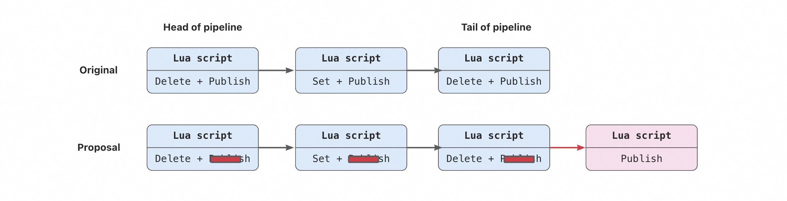
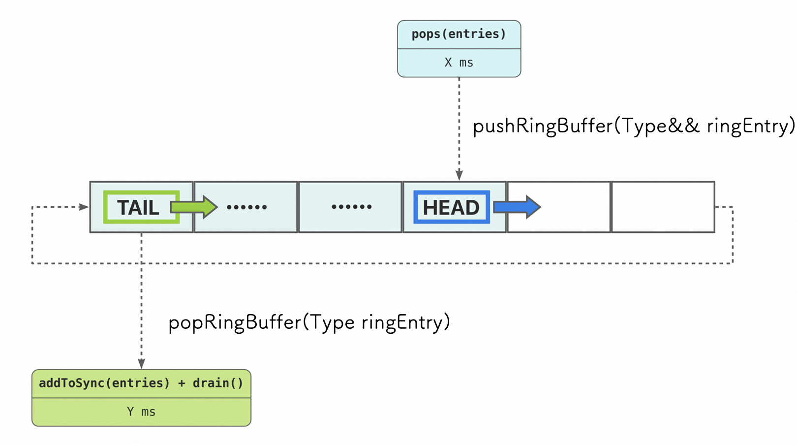

<!-- omit in toc -->
# BGP Loading Optimization for SONiC

<!-- omit in toc -->
## Revision

| Rev |     Date    |       Author       | Change Description                |
|:---:|:-----------:|:------------------:|-----------------------------|
| 0.1 | Aug 16 2023 |   FengSheng Yang   | poc draft idea              |
| 0.2 | Sep  5 2023 |   Nikhil Kelapure  | async sairedis part         |
| 1.0 | Feb  1 2024 |   Yijiao Qin       | final design                 |

<!-- omit in toc -->
## Table of Contents

- [Goal](#goal)
- [Terminology](#terminology)
- [Problems](#problems)
  - [1. fpmsyncd generates too much traffic](#1-fpmsyncd-generates-too-much-traffic)
    - [producer notifies consumers of every routes-related event](#producer-notifies-consumers-of-every-routes-related-event)
    - [fpmsyncd flushes the pipeline too frequently](#fpmsyncd-flushes-the-pipeline-too-frequently)
    - [fpmsyncd pipeline size is too small](#fpmsyncd-pipeline-size-is-too-small)
  - [2. orchagent is single-threaded](#2-orchagent-is-single-threaded)
  - [3. sairedis API is synchronous](#3-sairedis-api-is-synchronous)
- [\[fpmsyncd\] Changes on pipeline flush behavior](#fpmsyncd-changes-on-pipeline-flush-behavior)
  - [Only make one notification for a single flush](#only-make-one-notification-for-a-single-flush)
    - [Remove _PUBLISH_  command in the lua script](#remove-publish--command-in-the-lua-script)
  - [Reduce pipeline flush frequency](#reduce-pipeline-flush-frequency)
    - [Increase pipeline size](#increase-pipeline-size)
    - [Add a timer to help delay the flush](#add-a-timer-to-help-delay-the-flush)
- [\[orchagent\] Changes on execution workflow](#orchagent-changes-on-execution-workflow)
  - [Add an assistant thread to the orchdaemon](#add-an-assistant-thread-to-the-orchdaemon)
  - [Implement a ring buffer for thread communication](#implement-a-ring-buffer-for-thread-communication)
    - [Ensure the correct time sequence](#ensure-the-correct-time-sequence)
    - [Save overhead for locking](#save-overhead-for-locking)
    - [Take the singleton pattern](#take-the-singleton-pattern)
    - [Lambda functions](#lambda-functions)
      - [Not only data but also actions on data](#not-only-data-but-also-actions-on-data)
      - [Example](#example)
- [\[sairedis\] Asynchronous API usage](#sairedis-asynchronous-api-usage)
  - [Add the ResponseThread in orchagent](#add-the-responsethread-in-orchagent)
- [Future optimization](#future-optimization)
- [WarmRestart scenario](#warmrestart-scenario)
- [Testing](#testing)
  - [Requirements](#requirements)
  - [Implement PerformanceTimer for measurements](#implement-performancetimer-for-measurements)
    - [How to analyze the performance-related logs](#how-to-analyze-the-performance-related-logs)
  - [Performance measurements with 2M routes](#performance-measurements-with-2m-routes)

## Goal

This HLD talks about how to increase SONiC end-to-end bgp routes loading speed by 50%.
  
We optimized several engaging submodules accordingly, but SAI / ASIC optimaztion is out of scope.

## Terminology

| Abbreviation             | Description                             |
| ------------------------ | --------------------------------------- |
| ASIC                     | Application Specific Integrated Circuit  |
| BGP                      | Border Gateway Protocol                 |
| SWSS                     | Switch State Service                    |
| SYNCD                    | ASIC Synchronization Service            |
| FPM                      | Forwarding Plane Manager                |
| SAI                      | Switch Abstraction Interface            |

## Problems

The routes loading workflow consists of steps illustrated in the [figure](https://github.com/SONiC-net/SONiC/wiki/Architecture#routing-state-interactions) below.


This HLD focuses on the following steps:

Step 5: `fpmsyncd` processes netlink messages, flushes them to redis-server `APPL_DB`. \
Step 6: `orchagent` is subscribed to `APPL_DB`, consumes it once new data arrive. \
Step 7: `orchagent` invokes `sairedis` APIs to inject route information into `ASIC_DB`. \
Step 8: `syncd`, since subscribed to `ASIC_DB`, consumes `ASIC_DB` once there are new data. \
Step 9: `syncd` invokes `SAI` APIs to inject routing states into the asic driver.

### 1. fpmsyncd generates too much traffic

#### producer notifies consumers of every routes-related event

When there are routes-related events happening, for example, a new route insertion or a route deletion event, fpmsyncd would program these events into lua scripts and store these scripts in its pipeline buffer to batch them.

Once fpmsyncd flushes the pipeline, these accumulated lua scripts get executed one by one and the routing states in redis `ROUTE_TABLE` get changed accordingly.

Every time a lua script gets executed, it sends out a notification to all the consumers subscribed to `ROUTE_TABLE`.

#### fpmsyncd flushes the pipeline too frequently

The pipeline would flush itself when it's full, but fpmsyncd would also proactively flush it when its `select` logic detects new events.

#### fpmsyncd pipeline size is too small

The pipeline currently has the default size of 128, but the downstream modules prefer larger batch for performance.

- fpmsyncd serves as a producer for the `ROUTE_TABLE` in `APPL_DB` redis-server.
- fpmsyncd is responsible to notify consumers of events happening
- fpmsyncd determines the pipeline size and how it flushes the pipeline
- The optimization focuses on how to adjust the flush frequency and reduce the number of notifications but still ensures all changes in `ROUTE_TABLE` are detected by the subscribers.

### 2. orchagent is single-threaded

orchagent has a dedicated consumer for `ROUTE_TABLE`. When the consumer receives the notification sent by fpmsyncd, it then get selected to start its execution workflow to handle the new routing states.

And the whole process consists of 3 steps:

1. `pops()` - get routing states from `ROUTE_TABLE`
    - pop keys from redis `ROUTE_TABLE_KEY_SET`, which differentiates which keys contain modified values
    - traverse these keys, move its corresponding values from temporary table `_ROUTE_TABLE` to stable table `ROUTE_TABLE`
    - delete temporary table `_ROUTE_TABLE`
    - save these new routing states in the form of a deque of tuples into its per-thread variable `entries`
2. `addToSync()` - transfer data to `m_toSync`
    - process each entry in `entries`, do the logging and save it to the consumer's per-consumer variable `m_toSync`
3. `drain()` - actually process the tasks in `m_toSync`
    - invoke sairedis API to transfer routing states to `ASIC_DB` for downstream modules to read

We have found potential for parallel work among the three steps:

- order of the three steps in a single job should be maintained
- overlapping between two jobs is acceptable

step 1 and step 2 don't access the same memory, they could be performed at the same time.

- The optimization focuses on how to use two threads to support the parallel running of step 1 and step 2&3.

### 3. sairedis API is synchronous

The interaction between `orchagent` and `syncd` is using synchronous `sairedis` API.
Once `orchagent` `doTask` writes data to ASIC_DB, it waits for response from `syncd` and the processing of other routing messages would be blocked.

<figure align=center>
    
    <figcaption>Sync sairedis workflow<figcaption>
</figure>

## [fpmsyncd] Changes on pipeline flush behavior

### Only make one notification for a single flush

fpmsyncd pipeline buffers a queue of lua scripts, the contents of each lua script have two sections:

- the first section has redis commands that modify the routing states in the routes-related redis table
  - for example: set, delete
  - it also records all modified keys in a set `ROUTE_TABLE_KEY_SET`
- the second section contains the redis command `PUBLISH`
  - which notifies the consumers who subscribe to the updates of this routes-related redis table

Once the consumer receives the notification, it starts reading updates from the table and it only pays attention to the modified keys. The consumer distinguishes modified keys with the help of `ROUTE_TABLE_KEY_SET`, this set helps ensure that no updated routing states get ignored.

<figure align=center>
    
</figure>  

Although a dedicated `publish` command for each lua script makes sure all changes are aware by consumers. It's unnecessary with the help of `ROUTE_TABLE_KEY_SET`. Since all modified keys are recorded, they can share a single notification and achieve the same effect.

#### Remove _PUBLISH_  command in the lua script

We can attach a lua script which only contains `PUBLISH` command at the end of the pipeline once it flushes `n` entries, then the whole batch could share this single `PUBLISH` following them and we reduce `PUBLISH` traffic from O(n) to O(1).

### Reduce pipeline flush frequency

> redis pipeline flushes itself when it's full, otherwise it temporarily holds data in its buffer. \
> fpmsyncd would also flush the pipeline in an event-triggered manner.

Once a pipeline flushes data, there is large I/O traffic due to syscalls. In the case of large-scale traffic, the frequent flush would incur even more TCP overhead.

#### Increase pipeline size

we increase pipeline size from the default 125 to 50k, which would decrease the frequency of the pipeline flushing itself

#### Add a timer to help delay the flush

Current implementation let fpmsyncd flush the pipeline on every monitered event, then the downstream orchagent is always fed with data in a small batch. But from a performance perspective, orchagent would prefer those small data batch to come as a whole.

So we choose to skip some of the event-triggered flush.

To avoid data lingering in the pipeline due to the skip, we activate a 500-millisecond timer after a skip to make sure that these commands are eventually flushed.

If there is a batch of fewer than 500 routes coming to the pipeline, they would be directly flushed. We only apply the skip optimization on scaled traffic.

## [orchagent] Changes on execution workflow

orchdaemon has a while loop to keep monitoring events and selecting corresponding consumers to execute their specific tasks to handle those monitored events, this 3-step `execute` workflow

- `pops`: read data from redis server to local variable
- `addToSync`: move data from local variable to consumer instance variable
- `drain`: process the contents in the consumer instance variable

is single-threaded as we have analyzed in the previous section.

When _pops_ finishes, even if there are already new batch of data ready to be read, the second _pops_ is blocked until the first _addToSync_ and _drain_ finish.

### Add an assistant thread to the orchdaemon

<figure align=center>
    
</figure>  

The proposed design decouples _pops_ from _addToSync_ and _drain_.

We add an assistant thread, while the main thread only performs the step 1, which pops data from the redis server. It then offloads the data to the assistant thread and let the assistant thread to perform the step 2 and step 3 on the data instead.

<figure align=center>
    
</figure>  

### Implement a ring buffer for thread communication

We implement the ring buffer as a vector of entries with two indexes `head` and `tail` initialized to 0.
<figure align=center>

</figure>

#### Ensure the correct time sequence

Here are its two basic client APIs:

- `push()` - write data to its head index and increment the head index
  - head index turns into 0 when it increments to the vector size
- `pop()` - read data from its tail index and increment the tail index
  - tail index turns into 0 when it increments to the vector size

By comparing `head` and `tail`, we could check whether the ring is empty or full.

And the two indexes maintain the order of incoming data.

#### Save overhead for locking

Two threads communicate via the ring buffer:

- main thread produces the data to be processed via `pops(entries)`
- main thread calls API `pushRingBuffer(Type&& ringEntry)`
  - pushes the data to the ring buffer via ring buffer client API `push()`
  - wait and retry if the ring is full
- assistant thread  calls API `popRingBuffer(Type ringEntry)`
  - pops the data from the ring buffer if there is any via ring buffer client API `pop()`
- assistant thread consumes the data from the ring via `addToSync(entries) + drain()`

<figure align=center>
    
</figure>

Since main thread deals with `head` and assistant thead deals with `tail`, we save the lock overhead.

#### Take the singleton pattern

The ring buffer should be unique and global for the orchagent.

- unique: we implement the ring buffer class in the singleton pattern, which means
  - this class can only have one instance
  - and this instance can't be copied or assigned, etc

- global: we add a static class field `gRingBuffer` for both _Orch_ and _Executor_ class
  - If the ring buffer feature is enabled, orchdaemon would initialize a unique ring buffer instance
  - orchdaemon stores the ring buffer address in `gRingBuffer` field of both _Orch_ and _Executor_
  - by verifying whether `gRingBuffer` is empty, we can know whether ring buffer feature is enabled
  - everyone shares the same ring buffer created by orchdaemon

#### Lambda functions

To implement a ring buffer, we need to define the format of a ring entry. \
For the purpose of being general and flexible, a lambda function would be a perfect choice in our use case to represent `AnyTask`.

```c++
using AnyTask = std::function<void()>;
```

So we define the ring entry type as a function object which takes no argument and returns void.

##### Not only data but also actions on data

The main thread could wrap up any code snippet into a lambda function conforming to the format above and pass it to the assistant thread to execute. Variables in the main thread would be either copied or referenced into the lambda functions body. And the code snippets themselves instruct the assistant thread how to process the variables.

##### Example

Instead of storing in the ring buffer `entries`

```c
std::deque<KeyOpFieldsValuesTuple> entries;
```

we can save such a lambda function

- not only `entries` but also actions on it: `addToSync` + `drain`

```c++
[=] () {
  addToSync(entries);
  drain();
}
```

The benefit is to simplify and generalize the workflow of the assistant thread.

It treats different tasks the same, just pops the lambda function from the ring buffer and execute. Otherwise, if we only store data in the ring buffer, since different data need different processing, the assistant thread would need to apply different logic on different types of data, that would complicate the workflow.

## [sairedis] Asynchronous API usage

Asynchronous `sairedis` API is used and a list of context of response pending messages is maintained in `orchagent` to process the response when received

<figure align=center>
    
</figure>

### Add the ResponseThread in orchagent

`orchagent` currently uses synchronous `sairedis` API to send message to `syncd`.

We add a new `ResponseThread` in `orchagent` to process the response when it's received so that the other threads can continue processing new routing messages.

**Orchagent**

- RouteOrch sends bulk route add/update/del message as usual
- For each bulk message sent, list of {prefix, Vrf} is preserved in a AckBuffer.
- AckBuffer is added to pending-ACK queue
- AckBuffer has prefixes in the same order as in the bulk message
- OA can push at max N outstanding bulk messages to SAIRedis without waiting for ACK
- Once pending-queue size reaches N, routes are held in m_toSync.
- The CRM Used count will be incremented for each route processed by RouteOrch

**Syncd**

- Processes route bulk message one by one as usual
- Makes bulk SAI api call for each bulk-route message
- SAI api returns bulk status with ack/nack for each prefix
- Response is sent back to OA using NotificationProducer.

**ResponseThread**

New pthread in orchagent

- Tasks performed
  - Listen to bulk-ack messages from syncd using NotificationConsumer
  - Match bulk-ack with bulk-route request message
  
- Shared data-structures protected using mutex
  - Pending-ACK queue
  
- On each mutex lock
  - Pending queue with bulk-route entries is moved to the ResponseThread context.
  - New queue is initialized for main thread to add new entries
  
- ACK/NACK are processed in parallel to orchagent main thread
  - ACK/NACK are added to APP_STATE_DB
  - For NACK case the CRM ERR count will be incremented
  
- CRM resources is calculated by subtracting ERR count from Used count in CRM

  <figure align=center>
      
  </figure>

## Future optimization

- Apply ring buffer multi-threading optimization on syncd.
- Let fpmsyncd flush directly to stable table, instead of firstly to the temporary table with a _ prefix and then to the stable table.

## WarmRestart scenario

orchagent would be frozen for warm restart, and it would flush sairedis's redispipeline before it is frozen. Since we add a new thread here, we need to make sure that the ring buffer gets totally consumed and is empty when the main thread begins to flush the pipeline.

## Testing

### Requirements

- All modules should maintain the time sequence of routes loading.
- All modules should support WarmRestart.
- No routes should remain in redis pipeline longer than configured interval.
- No data should remain in ring buffer when system finishes routing loading.
- System should be able to install/remove/set routes (faster than before).
- This optimization could be turned off by flag in the startup script

### Implement PerformanceTimer for measurements

We implemented a C++ class PerformanceTimer in libswsscommon.

This timer evaluates the performance of a function by measuring

- the gap between two calls
- the execution time for a single call
- how many tasks a single call finishes

#### How to analyze the performance-related logs

Here is an example line extracted from the syslog file which measures `drain()` function:

```json
swss#orchagent: inc:87:
{"API":"DRAIN","RPS[k]":32.1,"Tasks":30000,"Total[ms]":934,"busy[ms]":591,"idle[ms]":343,"m_gaps":[343],"m_incs":[30000],"m_intervals":[591]}
```

30k routes are processed in this call, which takes 934 milliseconds.

Hence the rps is 32.1k (30k/0.934).

The total time is the sum of the busy time 591 ms and the idle time 343 milliseconds. The idle time is the gap between the end of last call and the start of this call, which indicates the workflow is blocked and waiting.

Our workflow optimization aims to decrease `busy` time, while the parameter tuning aims to decrease the `idle` time, and together eventually we could improve RPS.

### Performance measurements with 2M routes

The table below compares the loading speed of fpmsyncd and orchagent before and after optimization, tested with loading 2M routes on the Alibaba SONiC based eSR platform.

<!-- <style>
table{
  margin:auto;
}
</style> -->
| Module                   |  Original Speed(routes/s)    | Optimized Speed (routes/s) |
| ------------------------ | -----------------------------| -----------------------------|
| Fpmsyncd                 |  <center>17K                 | <center>25.4K                 |
| Orchagent                |  <center>9.7K               | <center>13.9K            |

<!-- omit in toc -->
### Similar works

Recently, JNPR team has raised BGP loading time to 47K routes per second. <https://community.juniper.net/blogs/suneesh-babu/2023/11/20/mx304-fib-install-rate>
This is an excellent achievement and we would kudo JNPR team to raise this racing bar higher. This JNPR's achievement gives us a new aiming point for the next round optimization.
