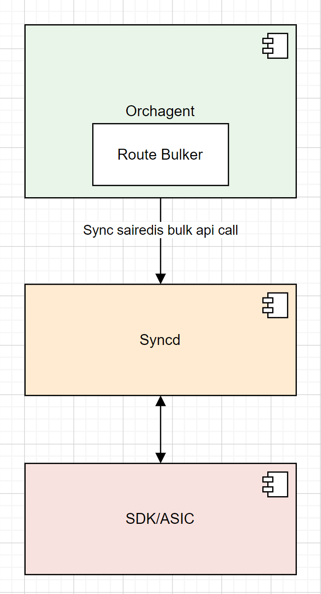
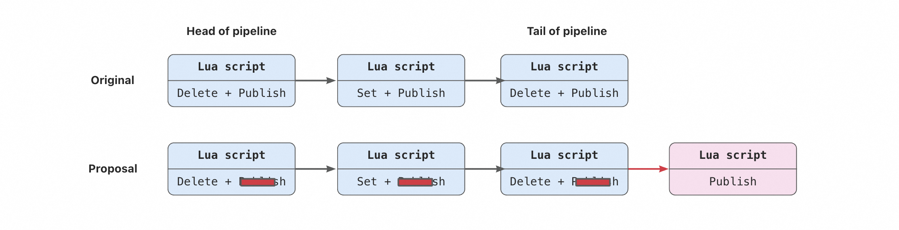
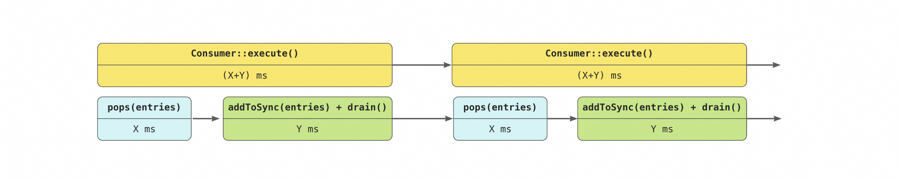
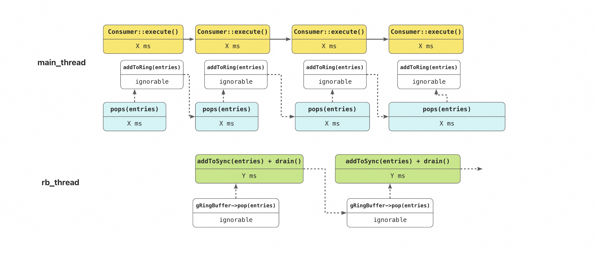
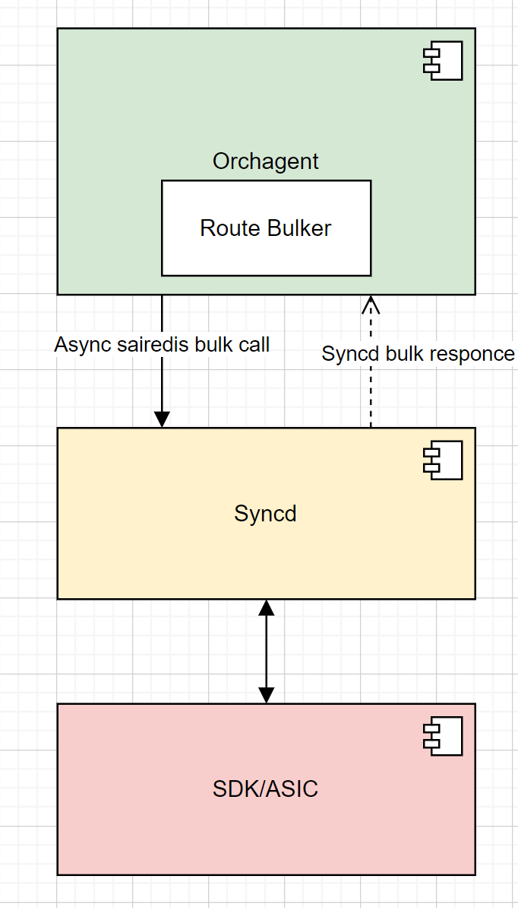
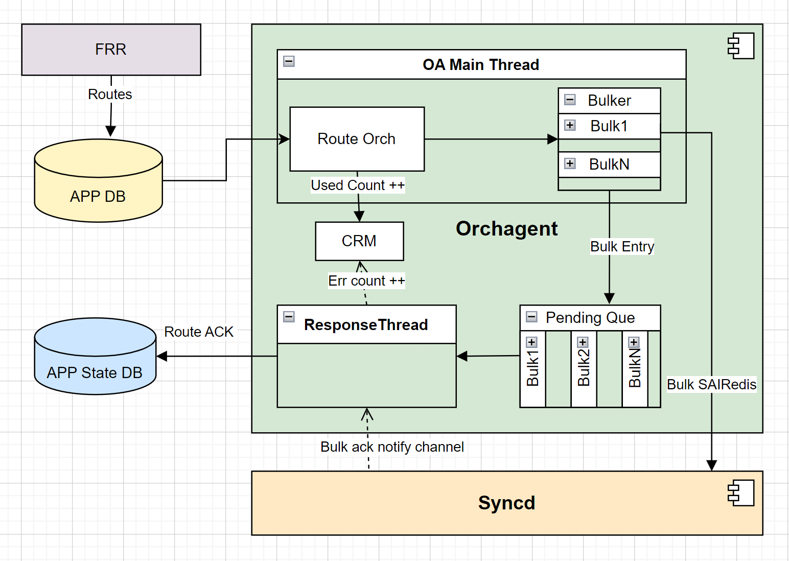

<!-- omit in toc -->
# BGP Loading Optimization for SONiC

<!-- omit in toc -->
### Revision

| Rev |     Date    |       Author       | Change Description                |
|:---:|:-----------:|:------------------:|-----------------------------------|
| 0.1 | Aug 16 2023 |   FengSheng Yang   | redis i/o optimization                   |
| 0.2 | Aug 29 2023 |   Yijiao Qin       | singleton global ring buffer             |
| 0.3 | Sep  5 2023 |   Nikhil Kelapure  | asynchronous sai                         |
| 1.0 | Feb  1 2024 |   Yijiao Qin       | only delegate route table to ring thread |

<!-- omit in toc -->
## Table of Contents

- [Goal \& Scope](#goal--scope)
- [Definitions \& Abbreviations](#definitions--abbreviations)
- [Problem Overview](#problem-overview)
  - [1. FpmSyncD has Redundant I/O traffic](#1-fpmsyncd-has-redundant-io-traffic)
    - [producerstatetable publishes every command](#producerstatetable-publishes-every-command)
    - [fpmsyncd flushes on every select event](#fpmsyncd-flushes-on-every-select-event)
  - [2. Orchagent consumer execute workflow is single-threaded](#2-orchagent-consumer-execute-workflow-is-single-threaded)
  - [Syncd is too strictly locked](#syncd-is-too-strictly-locked)
  - [Synchronous sairedis API usage](#synchronous-sairedis-api-usage)
- [Requirements](#requirements)
- [Solution](#solution)
  - [1. Reduce Redis I/O traffic between Fpmsyncd and Orchagent](#1-reduce-redis-io-traffic-between-fpmsyncd-and-orchagent)
    - [1.1 Remove _PUBLISH_  in the lua script](#11-remove-publish--in-the-lua-script)
    - [1.2 Reduce pipeline flush frequency](#12-reduce-pipeline-flush-frequency)
    - [1.3 Discard the state table with prefix \_](#13-discard-the-state-table-with-prefix-_)
  - [2. Add an assistant thread to the monolithic Orchagent/Syncd main event loop workflow](#2-add-an-assistant-thread-to-the-monolithic-orchagentsyncd-main-event-loop-workflow)
  - [3. Asynchronous sairedis API usage](#3-asynchronous-sairedis-api-usage)
    - [New ResponseThread in OA](#new-responsethread-in-oa)
- [WarmRestart scenario](#warmrestart-scenario)
- [Testing](#testing)
  - [Requirements](#requirements-1)
  - [PerformanceTimer](#performancetimer)

## Goal & Scope

This project aims to accelerate the end-to-end BGP routes loading workflow.
  
We analyzed the performance bottleneck for the engaging submodules, then optimized them accordingly.

The table below compares the loading speed of related submodules before and after optimization, tested with loading 1M routes on the Alibaba SONiC based eSR platform.

<!-- <style>
table{
  margin:auto;
}
</style> -->
| Module                   |  Original Speed(routes/s)    | Optimized Speed (routes/s) |
| ------------------------ | -----------------------------| -----------------------------|
| Fpmsyncd                 |  <center>17K                 | <center>25.4K                 |
| Orchagent                |  <center>10.5K               | <center>23.5K                 |
| Syncd                    |  <center>10.5K               | <center>19.6K                 |

This HLD only discusses the optimization in terms of redis traffic, `fpmsyncd`, `orchagent` and `syncd`. SAI / ASIC optimaztion is out of scope.

<!-- omit in toc -->
### Similar works

Recently, JNPR team has raised BGP loading time to 47K routes per second. <https://community.juniper.net/blogs/suneesh-babu/2023/11/20/mx304-fib-install-rate>
This is an excellent achievement and we would kudo JNPR team to raise this racing bar higher. This JNPR's achievement gives us a new aiming point for the next round optimization.

## Definitions & Abbreviations

| Definitions/Abbreviation | Description                             |
| ------------------------ | --------------------------------------- |
| ASIC                     | Application specific integrated circuit |
| BGP                      | Border Gateway Protocol                 |
| SWSS                     | Switch state service                    |
| SYNCD                    | ASIC synchronization service            |
| FPM                      | Forwarding Plane Manager                |
| SAI                      | Switch Abstraction Interface            |

## Problem Overview

SONiC BGP loading workflow consists of steps shown in the figure, cited from [the wiki](https://github.com/SONiC-net/SONiC/wiki/Architecture#routing-state-interactions).
 But we only focus on the following steps, which are discussed in this HLD.

Step 5: `fpmsyncd` processes netlink messages, flushes them to redis-server `APPL_DB`. \
Step 6: `orchagent` is subscribed to `APPL_DB`, consumes it once new data arrive. \
Step 7: `orchagent` invokes `sairedis` APIs to inject route information into `ASIC_DB`. \
Step 8: `syncd`, since subscribed to `ASIC_DB`, consumes `ASIC_DB` once there are new data. \
Step 9: `syncd` invokes `SAI` APIs to inject routing states into the asic driver.


### 1. FpmSyncD has Redundant I/O traffic

#### producerstatetable publishes every command

FpmSyncD instantiates a C++ class `producerstatetable` to serve as a data producer for the `ROUTE_TABLE` in `APPL_DB` redis-server, while `producerstatetable` utilizes redis pipeline technique, which accumulates redis operations in a buffer, and flushes the buffer as a whole. To make sure that every redis operation is published and thus is aware by subscribers, each redis operation is followed by a redis PUBLISH operation. To guarantee atomicity, a Lua script is used to bind the redis r/w operation and its corresponding PUBLISH command.

However, a single `PUBLISH` command at the tail of the pipeline can serve for all of the commands in the buffer. Hence, we remove  `PUBLISH` from the lua script and attach a single `PUBLISH` command at the end of the pipeline when we flush it.

#### fpmsyncd flushes on every select event

Apart from redis pipeline flushing itself when it's full, FpmSyncD also flushes the pipeline every time a SELECT event happens, which leads to the pipeline flushing too frequently, and the data being loosely batched.

On one hand, the downstream modules like data in bigger batch, on the other hand, each flush transfers data from fpmsyncd to orchagent, which incurs  `syscall` and context switching, and there is also round-trip-time between two modules. By reducing the flush frequency, we save on the overhead per flush.

### 2. Orchagent consumer execute workflow is single-threaded

Let's look into the consumer for `APP_ROUTE_TABLE`. In Orchagent's event-triggered main loop, Consumer would be selected to run its `execute()` method which contains three steps.

1. `pops()`
    - pop keys from redis `ROUTE_TABLE_KEY_SET`, which stores all modified keys
    - traverse these modified keys, move its corresponding values from temporary table `_ROUTE_TABLE` to `ROUTE_TABLE`
    - delete temporary table `_ROUTE_TABLE`
    - save these modified information, from redis table, to the local variable `std::deque<KeyOpFieldsValuesTuple> entries`
2. `addToSync()`
    - transfer the data from the local variable `entries` to the consumer instance's internal data structure `m_toSync`
3. `drain()`
    - consumes its `m_toSync`, invokes sairedis API and write these modified data to asic_db

We have found potential for parallel work among the three tasks. While the order of these three tasks within a single `execute()` job should be maintained, there could have some overlap among each `execute()` call. For example, when the first `execute()` call enters step 2, the second `execute()` could begin its step 1 instead of waiting for the step 3 of first `execute()` to be finished. To enable this overlap, we can add an assistant thread to the main thread and make them work together with proper inter-thread communication.

### Syncd is too strictly locked

`syncd` shares the similar issue with `orchagent`. It also has a single-threaded workflow to pop data from the upstream redis tables, then invoke asic SDK APIs to inject data into its downstream hardware. We also want to explore its potential for parallel work, and separate its communication with the upstream redis and the downstream hardware into two threads. However, this workflow needs careful locks since both communication with its upstream and downstream share the same redis context and the order between processing and notification should be well-reserved by locks.


### Synchronous sairedis API usage

The interaction between `orchagent` and `syncd` is using synchronous `sairedis` API.
Once `orchagent` `doTask` writes data to ASIC_DB, it waits for response from `syncd` and the processing of other routing messages would be blocked.

<figure align=center>
    
    <figcaption>Sync sairedis workflow<figcaption>
</figure>

## Requirements

- All modifications should maintain the time sequence of route loading
- All modules should support the warm restart operations after modified
- This optimization could be turned off by flag in the startup script

## Solution

### 1. Reduce Redis I/O traffic between Fpmsyncd and Orchagent

#### 1.1 Remove _PUBLISH_  in the lua script
>
> Fpmsyncd uses _ProducerStateTable_ to send data out and Orchagent uses _ConsumerStateTable_ to read data in.  
While the producer has APIs associated with lua scripts for Redis operations, each script ends with a _PUBLISH_ command to notify the downstream consumers.

Since we have employed Redis pipeline to queue commands up and flush them in a batch, it's unnecessary to _PUBLISH_ for each command. We can attach a _PUBLISH_ at the end of the command queue when the pipeline flushes, then the whole batch could share this single _PUBLISH_ and we reduce traffic for O(n) _PUBLISH_ to O(1).
<figure align=center>
    
</figure>  

#### 1.2 Reduce pipeline flush frequency

> Redis pipeline flushes itself when it's full, otherwise it temporarily holds the redis commands in its buffer.  
The commands would not get stuck in the pipeline since Fpmsyncd would also flush the pipeline, and this behavior is event-triggered with _select_ method.

Firstly, we could increase pipeline buffer size from the default 125 to 10k, which would decrease the frequency of the pipeline flushing itself.  
Secondly, we could skip Fpmsyncd flushes when it's not that long since the last flush and set a _flush timeout_ to determine the threshold.  
To avoid commands lingering in the pipeline due to skip, we change the _select timeout_ of Fpmsyncd from _infinity_ to _flush timeout_ after a successful skip to make sure that these commands are eventually flushed. And after flushing the lingered commands, the _select timeout_ of Fpmsyncd would change back to _infinity_ again.  
To make sure that consumers are able to get all the modified data when the number of _PUBLISH_ is equal to the number of flushes, while still keep the consumer pop size as 125, consumer needs to do multiple pops for a single _PUBLISH_.  
If there is a batch of fewer than 10 routes coming to the pipeline, they would be directly flushed, in case they are important routes.

#### 1.3 Discard the state table with prefix _
>
> Pipeline flushes data into the state table and use the data structure _KeySet_ to mark modified keys.  
When Orchagent is notified of new data coming, it recognized modified keys by _KeySet_, then transfers data from the state table to the stable table, then deletes the state table.

We propose to discard state tables, directly flush data to stable tables, while keep the data structure _KeySet_ to track modified keys.

### 2. Add an assistant thread to the monolithic Orchagent/Syncd main event loop workflow

Take Orchagent for example, there is a while loop in OrchDaemon monitoring events and selecting corresponding consumers.  
Once a consumer gets selected, it calls its execute() method, which consists of three steps, _pops(entries)_ , _addToSync_(entries) and _drain()_.

```c++
void Consumer::execute() 
{
    std::deque<KeyOpFieldsValuesTuple> entries;
    getConsumerTable()->pops(entries);
    addToSync(entries);
    drain();
}
```

When _pops(entries)_ finishes, even if there are already new data ready to be read, the second _pops(entries)_ is blocked until the first _addToSync_(entries) and _drain()_ finish.

<figure align=center>
    
</figure>  

The proposed design decouples _pops(entries)_ from _addToSync_(entries) and _drain()_. In our proposal,  _addToSync_(entries) and _drain()_ are removed from execute(), hence execute() is now more lightweight. While it only needs to pop entries from Redis table and push them into the ring buffer, we assign a new thread _rb_thread_ dedicating to pop data out of the ring buffer and then _addToSync_(entries) and _drain()_.

<figure align=center>
    
</figure>  

For Syncd, we also need to decouple _consumer.pop(kco, isInitViewMode())_ from _processSingleEvent(kco)_.

### 3. Asynchronous sairedis API usage

Asynchronous mode `sairedis` API is used and a list of context of response pending messages is maintained on `orchagent` to process the response when its received

<figure align=center>
    
    <figcaption>Figure: Async sairedis workflow<figcaption>
</figure>

#### New ResponseThread in OA

A new `ResponseThread` is used in `orchagent` to process the response when its received so that the other threads can continue processing new routing messages

`orchagent` now uses synchronous `sairedis` API to send message to `syncd`

**Orchagent**

- RouteOrch sends bulk route add/update/del message as usual
- For each bulk message sent, list of {prefix, Vrf} is preserved in a AckBuffer.
- AckBuffer is added to pending-ACK queue
- AckBuffer has prefixes in the same order as in the bulk message
- OA can push at max N outstanding bulk messages to SAIRedis without waiting for ACK
- Once pending-queue size reaches N, routes are held in m_toSync.
- The CRM Used count will be incremented for each route processed by RouteOrch

**Syncd**

- Processes route bulk message one by one as usual
- Makes bulk SAI api call for each bulk-route message
- SAI api returns bulk status with ack/nack for each prefix
- Response is sent back to OA using NotificationProducer.

**ResponseThread**
New pthread in orchagent

- Tasks performed
  - Listen to bulk-ack messages from syncd using NotificationConsumer
  - Match bulk-ack with bulk-route request message
  
- Shared data-structures protected using mutex
  - Pending-ACK queue
  
- On each mutex lock
  - Pending queue with bulk-route entries is moved to the ResponseThread context.
  - New queue is initialized for main thread to add new entries
  
- ACK/NACK are processed in parallel to orchagent main thread
  - ACK/NACK are added to APP_STATE_DB
  - For NACK case the CRM ERR count will be incremented
  
- CRM resources is calculated by subtracting ERR count from Used count in CRM

  <figure align=center>
      
      <figcaption>Async sairedis workflow<figcaption>
  </figure>

## WarmRestart scenario

This proposal considers the compatibility with SONiC `WarmRestart` feature. For example, when a user updates the config, a warm restart may be needed for the config update to be reflected. SONiC's main thread would call `dumpPendingTasks()` function to save the current system states and restore the states after the warm restart. Since this HLD introduces a new thread and a new structure `ring buffer` which stores some data, then we have to ensure that the data in `ring buffer` all gets processed before warm restart. During warm start, the main thread would modify the variable `m_toSync`, which the new thread also have access to. Therefore we should block the new thread during warm restart to avoid conflict.

Take orchagent for example, we need to make sure ring buffer is empty and the ring buffer thread is in idle before we call ```dumpPendingTasks()```.

## Testing

### Requirements

- All modules should maintain the time sequence of route loading.
- All modules should support WarmRestart.
- No routes should remain in redis pipeline longer than configured interval.
- No data should remain in ring buffer when system finishes routing loading.
- System should be able to install/remove/set routes (faster than before).

### Measurements using PerformanceTimer

We implemented c++ class PerformanceTimer in swsscommon library sonic-swss-common/common, this timer measures the gap in milliseconds between each function call, the execution time for a single call and how much tasks the single call handles.

Here is an example from syslog, which measures the performance of API POPS in the orchagent module:

```c++
INFO swss#orchagent: inc:72: 
{"API":"POPS","RPS[k]":31.6,"Tasks":11864,"Total[ms]":376,"busy[ms]":340,"idle[ms]":36,"m_gaps":[36],"m_incs":[11864],"m_intervals":[340]}
```

Analysis:

There is a 36 ms gap between the end of the last `POPS` API call and the start of this `POPS` API call.

It takes 340 ms to execute this `POPS` API call, which pops 11864 routes. Since the total time cost is 376 ms, the RPS is 31.6 kilo routes per second.

Another example:

```json
"API":"Syncd::processBulkRemoveEntry(route_entry)",
"RPS[k]":10.8,
"Tasks":21532,
"Total[ms]":2000,"busy[ms]":522,"idle[ms]":1478,
"m_gaps":[6,1472],"m_incs":[1532,20000],"m_intervals":[43,479]
```

Analysis:

This output indicates the overall performance of two `processBulkRemoveEntry` calls to be 10.8 kRPS.

The first call removes 1532 routes, and the second removes 20k routes. The performance data for each call are listed in the array.

Our workflow optimization aims to decrease `busy` time, while the parameter tuning aims to decrease the `idle` time, and together eventually we could improve throughput.
