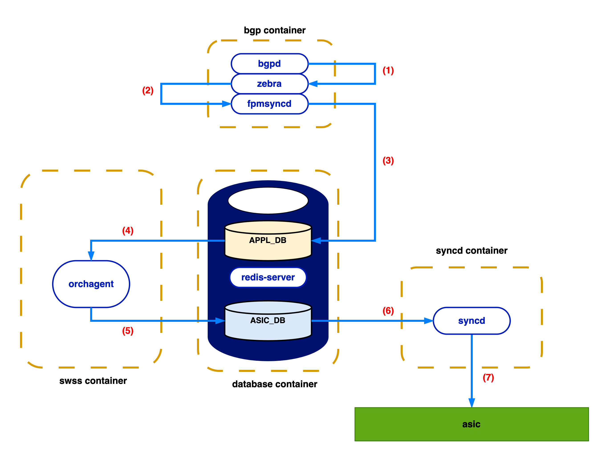
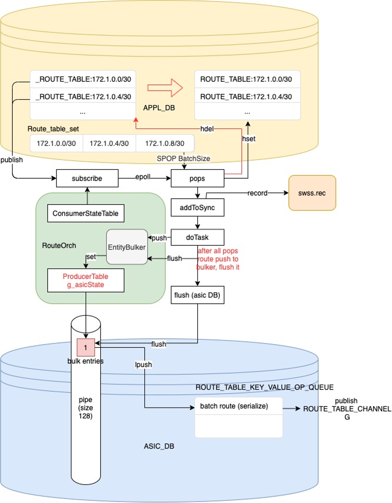
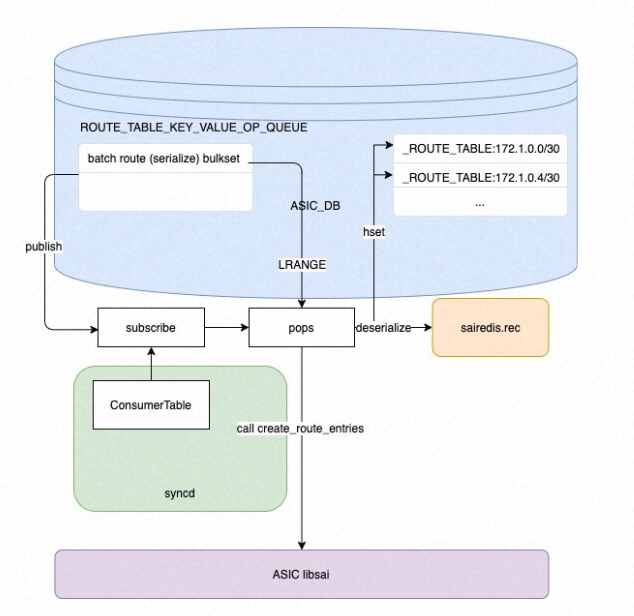
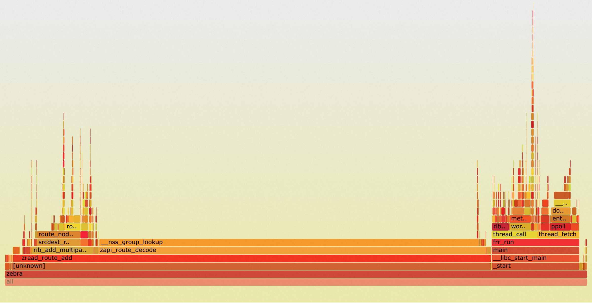
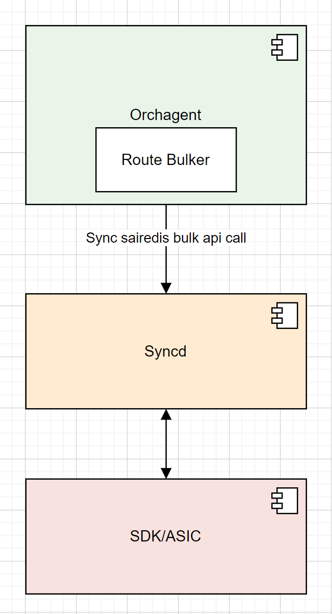
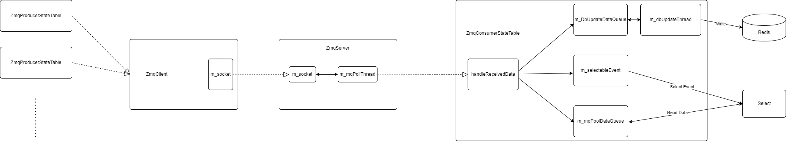
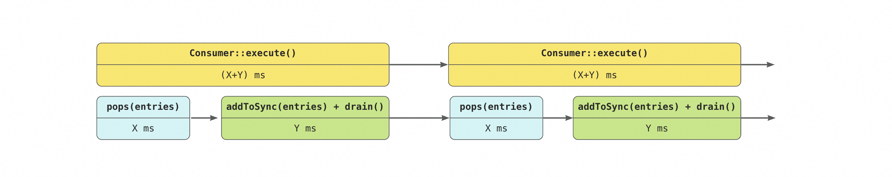
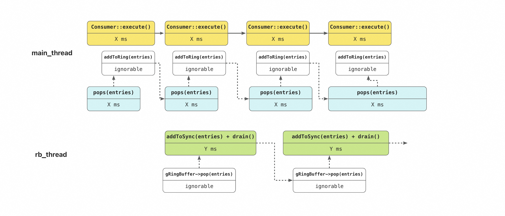
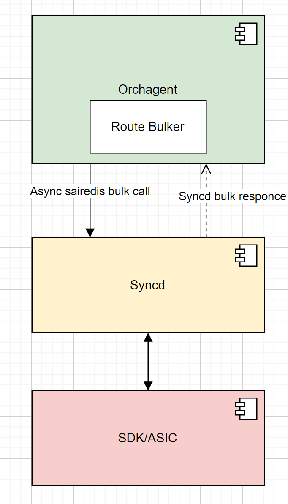
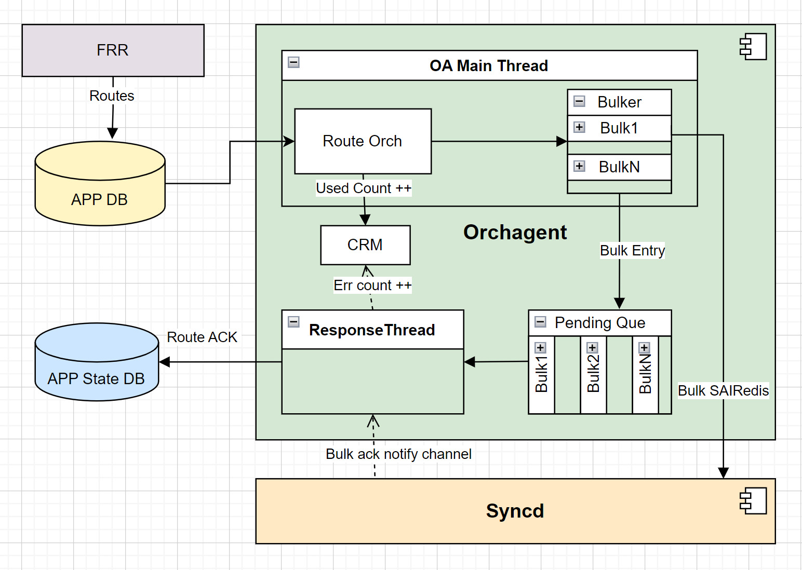

<!-- omit in toc -->
# BGP Route Optimization for SONiC

<!-- omit in toc -->
### Revision

| Rev |     Date    |       Author       | Change Description                |
|:---:|:-----------:|:------------------:|-----------------------------------|
| 0.1 | Aug 16 2023 |   FengSheng Yang   | Initial Draft                     |
| 0.2 | Aug 29 2023 |   Yijiao Qin       | Second Draft                      |
| 0.3 | Sep  5 2023 |   Nikhil Kelapure  | Supplement of Async SAI Part      |
| 1.0 | Feb  1 2024 |   Yijiao Qin       | Update test strategy              |
| 1.1 | Mar  4 2024 |   Hua Liu          | Improve Orchagent with ZMQ        |

<!-- omit in toc -->
## Table of Contents

- [Goal \& Scope](#goal--scope)
  - [Similar works](#similar-works)
- [Definitions \& Abbreviations](#definitions--abbreviations)
- [Overview](#overview)
  - [Orchagent consumer workflow is single-threaded](#orchagent-consumer-workflow-is-single-threaded)
  - [Syncd is too strictly locked](#syncd-is-too-strictly-locked)
  - [Redundant APPL\_DB I/O traffic](#redundant-appl_db-io-traffic)
    - [fpmsyncd flushes on every incoming route](#fpmsyncd-flushes-on-every-incoming-route)
    - [APPL\_DB does redundant housekeeping](#appl_db-does-redundant-housekeeping)
  - [Slow Routes decode and kernel thread overhead in zebra](#slow-routes-decode-and-kernel-thread-overhead-in-zebra)
  - [Synchronous sairedis API usage](#synchronous-sairedis-api-usage)
- [Requirements](#requirements)
- [High-Level Proposal](#high-level-proposal)
  - [1. Improve I/O performance between Fpmsyncd and Orchagent with ZMQ](#1-improve-io-performance-between-fpmsyncd-and-orchagent-with-zmq)
  - [2. Add an assistant thread to the monolithic Orchagent/Syncd main event loop workflow](#2-add-an-assistant-thread-to-the-monolithic-orchagentsyncd-main-event-loop-workflow)
  - [3. Asynchronous sairedis API usage](#3-asynchronous-sairedis-api-usage)
    - [New ResponseThread in OA](#new-responsethread-in-oa)
- [Low-Level Implementation](#low-level-implementation)
  - [Fpmsyncd](#fpmsyncd)
  - [Orchagent](#orchagent)
  - [Syncd](#syncd)
  - [Asynchronous sairedis API usage and new  ResponseThread in orchagent](#asynchronous-sairedis-api-usage-and-new--responsethread-in-orchagent)
- [WarmRestart scenario](#warmrestart-scenario)
- [Testing and measurements](#testing-and-measurements)
  - [Requirements](#requirements-1)
  - [PerformanceTimer](#performancetimer)
  - [Performance measurements with 1M routes](#performance-measurements-with-1m-routes)

## Goal & Scope

This project aims to accelerate the BGP routes end-to-end loading/withdrawing workflow.
  
We analyzed the performance bottleneck for each related submodule and optimized them accordingly.

The table below compares the loading/withdrawing speed of related submodules before and after optimization, tested on the Cisco Silicon One Q200.

<!-- <style>
table{
  margin:auto;
}
</style> -->
| Module                   |  Original Speed(routes/s)    | Optimized Speed (routes/s) |
| ------------------------ | -----------------------------| -----------------------------|
| Zebra / Fpmsyncd         |  <center>17K                 | <center>25.4K                 |
| Orchagent                |  <center>10.5K               | <center>30.7K                 |
| Syncd                    |  <center>10.5K               | <center>19.6K                 |

This HLD only covers the optimization in `fpmsyncd`, `orchagent`, `syncd` and `zebra` and Redis I/O. SAI/ASIC optimaztion is out of the scope.

### Similar works

Recently, JNPR team has raised BGP loading time to 47K routes per second. <https://community.juniper.net/blogs/suneesh-babu/2023/11/20/mx304-fib-install-rate>
This is an excellent achievement and we would kudo JNPR team to raise this racing bar higher. This JNPR's achievement gives us a new aiming point for the next round optimization.

## Definitions & Abbreviations

| Definitions/Abbreviation | Description                             |
| ------------------------ | --------------------------------------- |
| ASIC                     | Application specific integrated circuit |
| BGP                      | Border Gateway Protocol                 |
| SWSS                     | Switch state service                    |
| SYNCD                    | ASIC synchronization service            |
| FPM                      | Forwarding Plane Manager                |
| SAI                      | Switch Abstraction Interface            |
| ZMQ                      | ZeroMQ                                  |

## Overview

SONiC BGP loading/withdrawing workflow is shown in the figure below:
<figure align="center">
    
    <figcaption>SONiC BGP loading/withdrawing workflow</figcaption>
</figure>

1. `bgpd` parses the packets received on the socket, notifies `zebra`
2. `zebra` delivers this route to `fpmsyncd`
3. `fpmsyncd` uses redis pipeline to flush routes to `APPL_DB`
4. `orchagent` consumes `APPL_DB`
5. `orchagent` calls `sairedis` APIs to write into `ASIC_DB`
6. `syncd` consumes `ASIC_DB`
7. `syncd` invokes `SAI` SDK APIs to inject routing data to the hardware asic.

**NOTE**: [Linux kernel](https://github.com/SONiC-net/SONiC/wiki/Architecture#routing-state-interactions) part is ignored here.

### Orchagent consumer execute workflow is single-threaded

Let's take the consumer for `ROUTE_TABLE` for example. In Orchagent's event-triggered main loop, Consumer would be selected to run its `execute()` method which contains three steps.

1. `pops()`
    - pop keys from redis `ROUTE_TABLE_KEY_SET`, which stores all modified keys
    - traverse these modified keys, move its corresponding values from temporary table `_ROUTE_TABLE` to `ROUTE_TABLE`
    - delete temporary table `_ROUTE_TABLE`
    - save these modified information, from redis table, to the local variable `std::deque<KeyOpFieldsValuesTuple> entries`
2. `addToSync()`
    - transfer the data from the local variable `entries` to the consumer instance's internal data structure `m_toSync`
3. `drain()`
    - consumes its `m_toSync`, invokes sairedis API and write these modified data to asic_db

We observe that, the 3 tasks do not share the same redis context, hence have potential for parallel. While the order of these three tasks within a single `execute()` job should be maintained, there could have some overlaps among each `execute()` call. For example, when the first `execute()` call enters step 2, the second `execute()` could begin its step 1 instead of waiting for the step 3 of first `execute()` to be finished. To enable this overlapping among `execute()` calls, we can add a thread to orchagent.

<figure align=center>
    
    <figcaption>Orchagent workflow<figcaption>
</figure>  

### Syncd is too strictly locked

`syncd` shares the similar issue with `orchagent`. It also has a single-threaded workflow to pop data from the upstream redis tables, then invoke asic SDK APIs to inject data into its downstream hardware. We also want to explore its potential for parallel, and separate its communication with the upstream redis and the downstream hardware into two threads. However, this workflow needs careful locks since both communication with its upstream and downstream includes using the same redis context. As we can see in the original codebase, the whole `processEvent()` is locked. While SDK API calls tend to be time-consuming, we should unlock the thread to utilize the idle time here when syncd is waiting for the downstream hardware's responses.

<br>

<figure align=center>
    
    <figcaption>Syncd workflow<figcaption>
</figure>

### Redundant APPL_DB I/O traffic

There is much Redis I/O traffic during the BGP loading process, from which we find two sources of unnecessary traffic.

#### producerstatetable publishes every command and fpmsyncd flushes on every select event

In the original design, SONiC producers use lua scripts to implement its APIs such as set, delete, etc. We observe that, each lua script here ends with a redis `PUBLISH`. However, since we have already uses the pipeline, even if only the last command in the pipeline contains a redis `PUBLISH`, all the information in the pipeline can be published to the subsribed consumers. Hence, we want to decouple the redis `PUBLISH` from the producers' lua scripts and use a single `PUBLISH` command for a single pipeline flush.

In the original design, apart from redis pipeline flushing itself when it's full, `fpmsyncd` also invokes the redis pipeline `flush()` method every time a select event happens. Since the downstream handling of pipeline flushed data is not that fast, we can slow down the flush while batching more data in a single flush. Since each time a pipeline flushes, we transfer data from two modules via network, which includes `syscall` and context switching, and there is also round-trip-time between two modules. By reducing the flush frequency, we save on the overhead per flush.

#### APPL_DB does redundant housekeeping

When `orchagent` consumes `APPL_DB` with `pops()`, `pops` needs to transfer data from  `_ROUTE_TABLE` to  `ROUTE_TABLE`, we propose to let upstream producers directly write into `ROUTE_TABLE`, which saves `pops` from doing these redis write and delete operations.

### Slow Routes decode and kernel thread overhead in zebra

`zebra` receives routes from `bgpd`. To understand the routing data sent by `bgpd`, it has to decode the received data with `zapi_route_decode` function, which consumes the most computing resources, as the flame graph indicates. This function causes the slow start for `zebra`, since decode only happens at the very beginning of receiving new routes from `bgpd`.

The main thread of `zebra` not only needs to send routes to `fpmsyncd`, but also needs to process the returned results of the child thread which indicate whether data are successfully delivered to `kernel`. Hence when `zebra` is busy dealing with the `kernel` side, the performance of talking to `fpmsyncd` would be affected.

<br>

<figure align=center>
    
    <figcaption>Zebra flame graph<figcaption>
</figure>  

### Synchronous sairedis API usage

The interaction between `orchagent` and `syncd` is using synchronous `sairedis` API.
Once `orchagent` `doTask` writes data to ASIC_DB, it waits for response from `syncd`. And since there is only single thread in `orchagent` it cannot process other routing messages until the response is received and processed.

<figure align=center>
    
    <figcaption>Sync sairedis workflow<figcaption>
</figure>

## Requirements

- All modifications should maintain the time sequence of route loading
- All modules should support the warm restart operations after modified
- With the optimization of this HLD implemented, the end-to-end BGP loading performance should be improved at least by 95%
- The new optimization codes would be turn off by default. It could be turned on via configuration

## High-Level Proposal

### 1. Improve I/O performance between Fpmsyncd and Orchagent with ZMQ

Orchagent subscribe data with redis based ConsumerStateTable, sonic-swss-common has ZMQ based ZmqProducerStateTable/ZmqConsumerStateTable, here are compare with redis based tables:
1. 200+ times faster than redis based table, ZMQ table can transfer 800K route entry per-second, redis table can only transfer 3.7K route entry per-second.
2. Fully compatible with ProducerStateTable/ConsumerStateTable.
3. Asynchronous update redis DB with background thread.

<figure align=center>
    
</figure>

### 2. Add an assistant thread to the monolithic Orchagent/Syncd main event loop workflow

Take Orchagent for example, there is a while loop in OrchDaemon monitoring events and selecting corresponding consumers.  
Once a consumer gets selected, it calls its execute() method, which consists of three steps, _pops(entries)_ , _addToSync_(entries) and _drain()_.

```c++
void Consumer::execute() 
{
    std::deque<KeyOpFieldsValuesTuple> entries;
    getConsumerTable()->pops(entries);
    addToSync(entries);
    drain();
}
```

When _pops(entries)_ finishes, even if there are already new data ready to be read, the second _pops(entries)_ is blocked until the first _addToSync_(entries) and _drain()_ finish.

<figure align=center>
    
</figure>  

The proposed design decouples _pops(entries)_ from _addToSync_(entries) and _drain()_. In our proposal,  _addToSync_(entries) and _drain()_ are removed from execute(), hence execute() is now more lightweight. While it only needs to pop entries from Redis table and push them into the ring buffer, we assign a new thread _rb_thread_ dedicating to pop data out of the ring buffer and then _addToSync_(entries) and _drain()_.

<figure align=center>
    
</figure>  

For Syncd, we also need to decouple _consumer.pop(kco, isInitViewMode())_ from _processSingleEvent(kco)_.

### 3. Asynchronous sairedis API usage

Asynchronous mode `sairedis` API is used and a list of context of response pending messages is maintained on `orchagent` to process the response when its received

<figure align=center>
    
    <figcaption>Figure: Async sairedis workflow<figcaption>
</figure>

#### New ResponseThread in OA

A new `ResponseThread` is used in `orchagent` to process the response when its received so that the other threads can continue processing new routing messages

## Low-Level Implementation

### Fpmsyncd

Change from ProducerStateTable to ZmqProducerStateTable:

```c++

class RouteSync : public NetMsg
{
...
private:
    /* regular route table */
    unique_ptr<ProducerStateTable> m_routeTable;
    /* label route table */
    unique_ptr<ProducerStateTable> m_label_routeTable;
...

RouteSync::RouteSync(RedisPipeline *pipeline, ZmqClient *zmqClient) :
    m_vnet_routeTable(pipeline, APP_VNET_RT_TABLE_NAME, true),
    m_vnet_tunnelTable(pipeline, APP_VNET_RT_TUNNEL_TABLE_NAME, true),
    m_nl_sock(NULL), m_link_cache(NULL)
{
    if (zmqClient != nullptr) {
        m_routeTable = unique_ptr<ProducerStateTable>(new ZmqProducerStateTable(pipeline, APP_ROUTE_TABLE_NAME, *zmqClient, true));
        m_label_routeTable = unique_ptr<ProducerStateTable>(new ZmqProducerStateTable(pipeline, APP_LABEL_ROUTE_TABLE_NAME, *zmqClient, true));
    }
    else {
        m_routeTable = make_unique<ProducerStateTable>(pipeline, APP_ROUTE_TABLE_NAME, true);
        m_label_routeTable = make_unique<ProducerStateTable>(pipeline, APP_LABEL_ROUTE_TABLE_NAME, true);
    }
    
...
}
```

### Orchagent

Change RouteOrch inherit from ZmqOrch:

```c++
class RouteOrch : public ZmqOrch, public Subject
{
public:
    RouteOrch(DBConnector *db, vector<table_name_with_pri_t> &tableNames, SwitchOrch *switchOrch, NeighOrch *neighOrch, IntfsOrch *intfsOrch, VRFOrch *vrfOrch, FgNhgOrch *fgNhgOrch, Srv6Orch *srv6Orch, swss::ZmqServer *zmqServer = nullptr);

...
```

- ZmqOrch class inherit from Orch class.
- When zmqServer is not nullptr, ZmqOrch will create consumer with ZmqConsumerStateTable
- ZmqConsumerStateTable will create background thread for async APPL_DB update

ZmqOrch and ZmqConsumer provide ZMQ support:
```c++
class ZmqOrch : public Orch
{
public:
    ZmqOrch(swss::DBConnector *db, const std::vector<std::string> &tableNames, swss::ZmqServer *zmqServer);
    ZmqOrch(swss::DBConnector *db, const std::vector<table_name_with_pri_t> &tableNames_with_pri, swss::ZmqServer *zmqServer);

    virtual void doTask(ConsumerBase &consumer) { };
    void doTask(Consumer &consumer) override;

private:
    void addConsumer(swss::DBConnector *db, std::string tableName, int pri, swss::ZmqServer *zmqServer);
};

class ZmqConsumer : public ConsumerBase {
public:
    ZmqConsumer(swss::ZmqConsumerStateTable *select, Orch *orch, const std::string &name)
        : ConsumerBase(select, orch, name)
    {
    }

    swss::TableBase *getConsumerTable() const override
    {
        // ZmqConsumerStateTable is a subclass of TableBase
        return static_cast<swss::ZmqConsumerStateTable *>(getSelectable());
    }

    void execute() override;
    void drain() override;
};
```

### Syncd

Similar case for syncd with orchagent. In our proposal, consumer.pop and processSingleEvent(kco) is decoupled.

### Asynchronous sairedis API usage and new  ResponseThread in orchagent

`orchagent` now uses synchronous `sairedis` API to send message to `syncd`

**Orchagent**

- RouteOrch sends bulk route add/update/del message as usual
- For each bulk message sent, list of {prefix, Vrf} is preserved in a AckBuffer.
- AckBuffer is added to pending-ACK queue
- AckBuffer has prefixes in the same order as in the bulk message
- OA can push at max N outstanding bulk messages to SAIRedis without waiting for ACK
- Once pending-queue size reaches N, routes are held in m_toSync.
- The CRM Used count will be incremented for each route processed by RouteOrch

**Syncd**

- Processes route bulk message one by one as usual
- Makes bulk SAI api call for each bulk-route message
- SAI api returns bulk status with ack/nack for each prefix
- Response is sent back to OA using NotificationProducer.

**ResponseThread**
New pthread in orchagent

- Tasks performed
  - Listen to bulk-ack messages from syncd using NotificationConsumer
  - Match bulk-ack with bulk-route request message
  
- Shared data-structures protected using mutex
  - Pending-ACK queue
  
- On each mutex lock
  - Pending queue with bulk-route entries is moved to the ResponseThread context.
  - New queue is initialized for main thread to add new entries
  
- ACK/NACK are processed in parallel to orchagent main thread
  - ACK/NACK are added to APP_STATE_DB
  - For NACK case the CRM ERR count will be incremented
  
- CRM resources is calculated by subtracting ERR count from Used count in CRM

  <figure align=center>
      
      <figcaption>Async sairedis workflow<figcaption>
  </figure>


## WarmRestart scenario

This proposal considers the compatibility with SONiC `WarmRestart` feature. For example, when a user updates the config, a warm restart may be needed for the config update to be reflected. SONiC's main thread would call `dumpPendingTasks()` function to save the current system states and restore the states after the warm restart. Since this HLD introduces a new thread and a new structure `ring buffer` which stores some data, then we have to ensure that the data in `ring buffer` all gets processed before warm restart. During warm start, the main thread would modify the variable `m_toSync`, which the new thread also have access to. Therefore we should block the new thread during warm restart to avoid conflict.

Take orchagent for example, we need to make sure ring buffer is empty and the ring buffer thread is in idle before we call ```dumpPendingTasks()```.

## Testing and measurements

### Requirements

- All modules should maintain the time sequence of route loading.
- All modules should support WarmRestart.
- No routes should remain in redis pipeline longer than configured interval.
- No data should remain in ring buffer when system finishes routing loading.
- System should be able to install/remove/set routes (faster than before).

### PerformanceTimer
We implemented c++ class PerformanceTimer in swsscommon library sonic-swss-common/common, this timer helps us measure the performance of a specific function or a module, it outputs interval(milliseconds) between each call, the execution time for a single call and how much entries this single call handles in the following format:

`[interval]<num_of_handled_entries>execution_time`.

Here is an example extracted from syslog:
```c++
NOTICE syncd#syncd: inc:88: 10000 (calls 5 : [13ms]<4315>102ms [10ms]<2635>64ms [7ms]<1577>52ms [3ms]<933>20ms [1ms]<540>22ms) Syncd::processBulkCreateEntry(route_entry) CREATE op took: 262 ms
```
We have a timer that measures performance of `processBulkCreateEntry(route_entry)` method, it takes 5 calls to create 10000 entries.

1st call created 4315 entries in 102 ms, started 13 ms after last call ends\
2nd call created 2635 entries in 64 ms, started 10 ms after last call ends\
3rd call created 1577 entries in 52 ms, started 7 ms after last call ends\
4th call created 933 entries in 20 ms, started 3 ms after last call ends\
5th call created 540 entries in 22 ms, started 1 ms after last call ends

Our optimization aims to reduce the interval (idle time) and improve the overall throughput.

### Performance measurements with 1M routes
