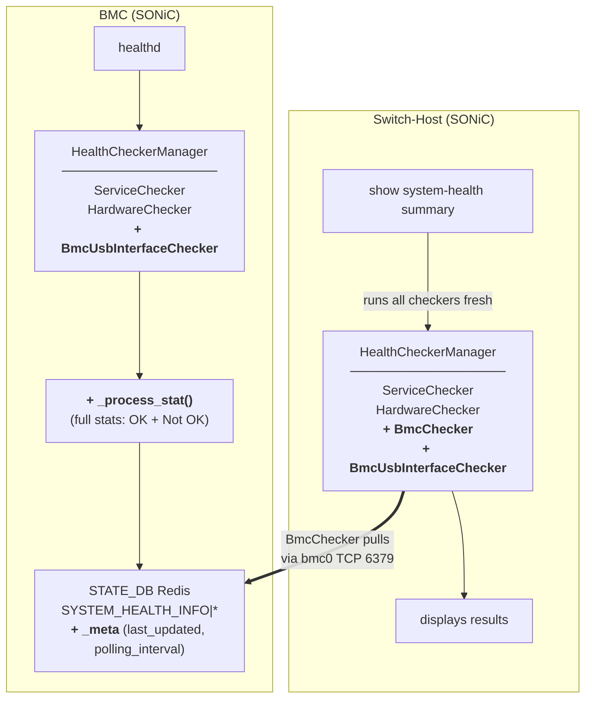

# BMC Health Monitoring on Switch-Host

## Table of Content

- [1. Revision](#1-revision)
- [2. Definitions/Abbreviations](#2-definitionsabbreviations)
- [3. Scope](#3-scope)
- [4. Overview](#4-overview)
- [5. Requirements](#5-requirements)
- [6. Architecture Design](#6-architecture-design)
- [7. High-Level Design](#7-high-level-design)
  - [7.1. healthd — Full Stats Publishing to STATE_DB](#71-healthd--full-stats-publishing-to-state_db)
  - [7.2. BmcChecker — Switch-Host Pulls from BMC Redis](#72-bmcchecker--switch-host-pulls-from-bmc-redis)
  - [7.3. STATE_DB Schema](#73-state_db-schema)
  - [7.4. BmcUsbInterfaceChecker — USB Link Health](#74-bmcusbinterfacechecker--usb-link-health)
  - [7.5. CLI Display Update](#75-cli-display-update)
  - [7.6. Non-BMC Platform Safety](#76-non-bmc-platform-safety)
- [8. Future Enhancements](#8-future-enhancements)
- [9. References](#9-references)

---

## 1. Revision

| Rev | Date | Author | Change Description |
| --- | --- | --- | --- |
| 0.1 | 2026-09-15 | Prajjwal Singh | Initial version (push model) |
| 0.2 | 2026-09-30 | Prajjwal Singh | Revised to pull model; added BmcUsbInterfaceChecker; healthd writes full stats |

---

## 2. Definitions/Abbreviations

| Term | Definition |
| --- | --- |
| BMC | Board Management Controller — specialized microcontroller managing platform power and hardware |
| healthd | SONiC system health monitor daemon, runs as `system-health.service` |
| bmc0/usb0 | USB ethernet interface connecting BMC and switch-host (point-to-point /30 link) |
| STATE_DB | SONiC Redis database (id 6) for runtime state |
| BmcChecker | New health checker on the switch-host that pulls BMC health data from BMC's Redis |
| BmcUsbInterfaceChecker | New health checker on both sides that monitors the bmc0 USB link |

---

## 3. Scope

Currently the switch-host has no visibility into BMC's health status (services, hardware).

This HLD adds BMC health monitoring to the switch-host's `show system-health summary` output using a
**pull model** where the switch-host reads health data from the BMC's Redis over the USB ethernet
link. 
The HLD also adds bmc-usb-interface health checking feature on both BMC, and SWITCH-HOST Side.

- Pull model: switch-host reads BMC's SYSTEM_HEALTH_INFO table
- healthd writes full stats (OK + Not OK) to local STATE_DB
- New `BmcChecker` on switch-host 
- New `BmcUsbInterfaceChecker` on both , Switch-Host and BMC side.
- CLI shows BMC section with Last Updated + Refresh Interval 


## 4. Overview

### 4.1 SWITCH-HOST monitoring BMC health stats
The BMC runs SONiC with its own `healthd` instance that performs periodic health checks (services,
hardware) using the `HealthCheckerManager` framework. Today, `healthd` only writes Not OK entries
to the local `SYSTEM_HEALTH_INFO` table, and these results are not visible from the switch-host.

This design uses a **pull model**: the BMC's `healthd` writes full health stats to its own
STATE_DB, and the switch-host's health checker framework connects to the BMC's Redis to read that
data. 
The switch-host CLI command `show system-health summary` subscribe to new bmc_checkers in the health checker framework,
and initiates the fetching of BMC's health stats from its STATE_DB.

The BMC's Redis is already bound to the bmc0 interface IP by the existing
`docker-database-init.sh` logic (when `switch_bmc=1` is set in `platform_env.conf`).
No new
Redis binding configuration is needed on either side.

The health checks performed on the BMC are platform-specific and vendor-configurable via the
existing `system_health_monitoring_config.json` (`services_to_ignore`, `devices_to_ignore`,
`user_defined_checkers`, `polling_interval`).

### 4.2 BMC SWITCH-HOST USB Interface (bmc0) link monitoring
New checkers are added to both BMC and SWITCH-HOST side in their Health Checker
Framework to periodically check the BMC SWITCH-HOST USB Interface (bmc0) link
health by pinging the peer.

---

## 5. Requirements

1. The switch-host's `show system-health summary` must display BMC health status as an independent
   section ("BMC"), separate from the existing "Services" and "Hardware" sections.
2. BMC health data must be pulled by the switch-host from the BMC's Redis (pull model).
3. The design must reuse the existing health checker framework — no new daemon or timer.
4. Per-object health results (type, status, message) must be available on the switch-host, so that
   individual failure reasons are visible (e.g., a specific process not running on the BMC).
5. The switch-host must display the `last_updated` timestamp and BMC's `polling_interval` so the
   operator can assess data freshness.
6. A new USB interface health checker must run on both BMC and switch-host to monitor the bmc0
   link state and peer reachability.
7. The design must be vendor-agnostic — different platforms may check different services and
   hardware devices, at different intervals.
8. On platforms without a BMC, there must be no impact — no new sections in CLI output, no new
   checkers registered, no additional resource usage.
9. The switch-host must handle BMC being unreachable gracefully — connection timeout, clear error
   message, no blocking of other health checks.

---

## 6. Architecture Design

### 6.1. Data Flow



### 6.2. Components

`+` marks new or modified components.

| # | Component | Location | Runs On | Change Type |
|---|-----------|----------|---------|-------------|
| 1 | + `_process_stat()` (full stats) | `system-health/scripts/healthd` | Both | Modified — writes OK + Not OK |
| 2 | + `BmcChecker` | `system-health/health_checker/bmc_checker.py` | Switch-Host | New checker class |
| 3 | + `BmcUsbInterfaceChecker` | `system-health/health_checker/bmc_usb_interface_checker.py` | Both | New checker class |
| 4 | + `HealthCheckerManager` | `system-health/health_checker/manager.py` | Both | Modified — registers new checkers |
| 5 | + `display_system_health_summary()` | `sonic-utilities/show/system_health.py` | Switch-Host | Modified — renders BMC section |
| 6 | Redis binding on bmc0 | `docker-database-init.sh` | BMC | Existing — no change needed |

---

## 7. High-Level Design

### 7.1. healthd — Full Stats Publishing to STATE_DB

**File:** `src/system-health/scripts/healthd`

The existing `_process_stat()` method is modified to write **all** health check results (both OK
and Not OK) to the `SYSTEM_HEALTH_INFO` table in STATE_DB. Previously, only Not OK entries were
written.

Each health check object is written with pipe-separated keys containing its category, type,
status, and message. A `_meta` entry is added containing `last_updated` (UTC ISO 8601 timestamp),
`summary` (aggregate OK/Not OK), and `polling_interval`.

Before writing, all existing `SYSTEM_HEALTH_INFO|*` keys are cleared to prevent stale entries
from persisting across polling cycles.

This change applies to **both BMC and switch-host** — both sides write full stats to their own
local STATE_DB.

### 7.2. BmcChecker — Switch-Host Pulls from BMC Redis

**File:** `src/system-health/health_checker/bmc_checker.py` (new)

A new `BmcChecker` class extending `HealthChecker`, registered only on switch-host
(`device_info.is_switch_host()`). It connects to the BMC's Redis and reads the
`SYSTEM_HEALTH_INFO` table.

**Behavior:**

- Reports under the `"BMC"` category.
- Reads the BMC address from `device_info.get_bmc_address()` (sourced from `/etc/sonic/bmc.json`).
- On each `check()` call, creates a fresh `swsscommon.DBConnector` to BMC's STATE_DB with a
  5-second connection timeout. No persistent connection to manage.
- Reads all keys via `getKeys()` and iterates with `get()` to read field-value pairs.
- The `_meta` key is processed to extract `last_updated` and `polling_interval`, surfaced as
  informational entries for CLI display.
- All other keys are reported via `set_object_ok()` / `set_object_not_ok()` under the "BMC"
  category, preserving the original object names and messages from the BMC.

### 7.3. STATE_DB Schema

The existing `SYSTEM_HEALTH_INFO` table is extended to write all objects with pipe-separated keys.

**Per-object entries:**

```
Key:    SYSTEM_HEALTH_INFO|{category}|{object_name}
Fields: category, type, status, message
```

**Meta entry:**

```
Key:    SYSTEM_HEALTH_INFO|_meta
Fields: last_updated, summary, polling_interval
```

The set of entries is dynamic and platform-dependent. The BMC does not own PSU, fan, or ASIC
devices — those are managed by the switch-host. BMC entries typically include services (pmon,
database, lldp, gnmi, etc.) and hardware sensors (bmc0, liquid cooling leak detection, etc.).

**Example entries on BMC's STATE_DB:**

| Key | status | message |
| --- | --- | --- |
| `SYSTEM_HEALTH_INFO\|Services\|sonic` | OK | |
| `SYSTEM_HEALTH_INFO\|Services\|rsyslog` | OK | |
| `SYSTEM_HEALTH_INFO\|Services\|database:redis` | OK | |
| `SYSTEM_HEALTH_INFO\|Services\|pmon:bmcctld` | OK | |
| `SYSTEM_HEALTH_INFO\|Services\|lldp:lldpd` | Not OK | Process 'lldpd' in container 'lldp' is not running |
| `SYSTEM_HEALTH_INFO\|Hardware\|bmc0` | OK | |
| `SYSTEM_HEALTH_INFO\|_meta` | — | last_updated=2026-09-30T06:41:35Z, summary=Not OK, polling_interval=300 |

**Example entries on Switch-Host's STATE_DB:**

| Key | status | message |
| --- | --- | --- |
| `SYSTEM_HEALTH_INFO\|Services\|sonic` | OK | |
| `SYSTEM_HEALTH_INFO\|Services\|rsyslog` | OK | |
| `SYSTEM_HEALTH_INFO\|Services\|swss:orchagent` | OK | |
| `SYSTEM_HEALTH_INFO\|Hardware\|PSU 1` | OK | |
| `SYSTEM_HEALTH_INFO\|Hardware\|fan1` | OK | |
| `SYSTEM_HEALTH_INFO\|Hardware\|bmc0` | OK | |
| `SYSTEM_HEALTH_INFO\|BMC\|Services\|pmon:bmcctld` | OK | |
| `SYSTEM_HEALTH_INFO\|BMC\|Services\|lldp:lldpd` | Not OK | Process 'lldpd' in container 'lldp' is not running |
| `SYSTEM_HEALTH_INFO\|BMC\|BMC-LastUpdate` | OK | Last updated: 2026-09-30T06:41:35Z |
| `SYSTEM_HEALTH_INFO\|BMC\|BMC-RefreshInterval` | OK | BMC Refresh Interval: 300s |
| `SYSTEM_HEALTH_INFO\|BMC\|_meta` | — | last_updated=2026-09-30T06:41:35Z, summary=Not OK, polling_interval=300 |
| `SYSTEM_HEALTH_INFO\|_meta` | — | last_updated=2026-09-30T06:41:40Z, summary=Not OK, polling_interval=180 |

### 7.4. BmcUsbInterfaceChecker — USB Link Health

**File:** `src/system-health/health_checker/bmc_usb_interface_checker.py` (new)

A new `BmcUsbInterfaceChecker` class extending `HealthChecker`, registered on **both** BMC and
switch-host when `device_info.is_switch_host()` or `device_info.is_switch_bmc()` returns `True`.

**Behavior:**

- Reports under the `"Hardware"` category — bmc0 is a hardware interface.
- Reads BMC configuration from `device_info.get_bmc_data()` to determine the interface name
  (`bmc_if_name`, typically `bmc0`) and the peer IP to ping.
- Peer IP varies by role: on the switch-host the peer is the BMC (`bmc_addr`), on the BMC the
  peer is the switch-host (`bmc_if_addr`).
- Checks link state via `ip -br link show`, then pings the peer with `-I` to bind to the bmc0
  interface.
- On platforms without bmc0 configured, the checker silently returns with no output.

**Example STATE_DB entries written by BmcUsbInterfaceChecker:**

On switch-host (peer is BMC at 169.254.100.1):

| Key | status | message |
| --- | --- | --- |
| `SYSTEM_HEALTH_INFO\|Hardware\|bmc0` | OK | |
| `SYSTEM_HEALTH_INFO\|Hardware\|bmc0` | Not OK | bmc0 link is down |
| `SYSTEM_HEALTH_INFO\|Hardware\|bmc0` | Not OK | bmc0 peer 169.254.100.1 unreachable |

On BMC (peer is switch-host at 169.254.100.2):

| Key | status | message |
| --- | --- | --- |
| `SYSTEM_HEALTH_INFO\|Hardware\|bmc0` | OK | |
| `SYSTEM_HEALTH_INFO\|Hardware\|bmc0` | Not OK | bmc0 link is down |
| `SYSTEM_HEALTH_INFO\|Hardware\|bmc0` | Not OK | bmc0 peer 169.254.100.2 unreachable |

### 7.5. CLI Display Update

**File:** `src/sonic-utilities/show/system_health.py`

`display_system_health_summary()` is modified to render a "BMC" section when the `stat` dict
contains a `"BMC"` category. On non-BMC platforms, the output is unchanged.

The `BMC-LastUpdate` and `BMC-RefreshInterval` entries are informational metadata — they are
extracted and displayed as metadata lines, excluded from the reasons list.

When `Last Updated` and `BMC Refresh Interval` are available (successful pull), they are shown.
When the pull fails (BMC unreachable), no timestamp is shown — only the error.

**1. All healthy — BMC and bmc0 link OK:**

```
System status summary

  System status LED  green
  Services:
    Status: OK
  Hardware:
    Status: OK
  BMC:
    Status: OK
    Last Updated: 2026-09-30T06:41:35Z
    BMC Refresh Interval: 300s
```

**2. bmc0 link down — both Hardware and BMC report failure:**

```
System status summary

  System status LED  red
  Services:
    Status: OK
  Hardware:
    Status: Not OK
    Reasons: bmc0 link is down
  BMC:
    Status: Not OK
    Reasons: BMC-Connectivity: Cannot connect to BMC Redis: Connection timed out
```

Note: `BmcUsbInterfaceChecker` (under Hardware) and `BmcChecker` (under BMC) independently
detect the failure. No `Last Updated` is shown because no data was received.

**3. bmc0 peer unreachable — link UP but ping fails:**

```
System status summary

  System status LED  red
  Services:
    Status: OK
  Hardware:
    Status: Not OK
    Reasons: bmc0 peer 169.254.100.1 unreachable
  BMC:
    Status: Not OK
    Reasons: BMC-Connectivity: Cannot connect to BMC Redis: Connection timed out
```

**4. BMC service failure — bmc0 link OK, BMC service down:**

```
System status summary

  System status LED  red
  Services:
    Status: OK
  Hardware:
    Status: OK
  BMC:
    Status: Not OK
    Last Updated: 2026-09-30T07:59:24Z
    BMC Refresh Interval: 300s
    Reasons: Services|lldp:lldpd: Process 'lldpd' in container 'lldp' is not running
```

### 7.6. Non-BMC Platform Safety

On platforms without a BMC:

- `device_info.is_switch_host()` and `device_info.is_switch_bmc()` return `False`.
- `BmcChecker` and `BmcUsbInterfaceChecker` are never instantiated.
- No "BMC" section appears in `show system-health summary`.
- No connections are attempted to any BMC Redis.
- No additional resource usage beyond module imports.

---

## 8. Future Enhancements

Future enhancement as recommended by the community to make the bmc_checker on
switch-host side not use BMC's STATE_DB to pull data from, instead use redfish APIs.
This is also to make the system compatible with BMC running OpenBMC as well. 

---

## 9. References

| # | Description | Link |
| --- | --- | --- |
| 1 | healthd — system health monitor daemon | [sonic-buildimage/src/system-health/scripts/healthd](https://github.com/sonic-net/sonic-buildimage/blob/master/src/system-health/scripts/healthd) |
| 2 | HealthCheckerManager | [sonic-buildimage/src/system-health/health_checker/manager.py](https://github.com/sonic-net/sonic-buildimage/blob/master/src/system-health/health_checker/manager.py) |
| 3 | HardwareChecker | [sonic-buildimage/src/system-health/health_checker/hardware_checker.py](https://github.com/sonic-net/sonic-buildimage/blob/master/src/system-health/health_checker/hardware_checker.py) |
| 4 | ServiceChecker | [sonic-buildimage/src/system-health/health_checker/service_checker.py](https://github.com/sonic-net/sonic-buildimage/blob/master/src/system-health/health_checker/service_checker.py) |
| 5 | `show system-health` CLI | [sonic-utilities/show/system_health.py](https://github.com/sonic-net/sonic-utilities/blob/master/show/system_health.py) |
| 6 | docker-database-init.sh (BMC Redis binding) | [sonic-buildimage/dockers/docker-database/docker-database-init.sh](https://github.com/sonic-net/sonic-buildimage/blob/master/dockers/docker-database/docker-database-init.sh) |
| 7 | `device_info.is_switch_bmc()` / `get_bmc_data()` | [sonic-platform-common/sonic_py_common/device_info.py](https://github.com/sonic-net/sonic-platform-common/blob/master/sonic_py_common/device_info.py) |

