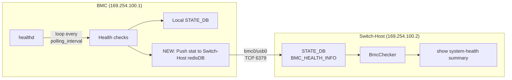

# BMC Health State Publishing to Switch-Host

## Table of Content

- [1. Revision](#1-revision)
- [2. Definitions/Abbreviations](#2-definitionsabbreviations)
- [3. Scope](#3-scope)
- [4. Overview](#4-overview)
- [5. Requirements](#5-requirements)
- [6. Architecture Design](#6-architecture-design)
- [7. High-Level Design](#7-high-level-design)
  - [7.1. Publisher — healthd extension](#71-publisher--healthd-extension)
  - [7.2. Redis binding on switch-host](#72-redis-binding-on-switch-host)
  - [7.3. STATE_DB schema](#73-state_db-schema)
  - [7.4. BmcChecker on switch-host](#74-bmcchecker-on-switch-host)
  - [7.5. CLI display update](#75-cli-display-update)
- [8. References](#8-references)

### 1. Revision

| Rev | Date | Author | Change Description |
| --- | --- | --- | --- |
| 0.1 | 2026-09-17 | Prajjwal Singh | Initial version |

### 2. Definitions/Abbreviations

| Term | Definition |
| --- | --- |
| BMC | Board Management Controller — specialized microcontroller managing platform power and hardware |
| healthd | SONiC system health monitor daemon (`/usr/local/bin/healthd`), runs as `system-health.service` |
| bmc0/usb0 | USB ethernet interface connecting BMC and switch-host |
| STATE_DB | SONiC Redis database for runtime state, accessed via `sonic-db-cli STATE_DB` |
| BmcChecker | New health checker class on the switch-host that reads BMC health data from STATE_DB |

### 3. Scope

Currently the switch-host has no visibility into BMC's health status (including services/hardware status).
Having this will enhance the diagnostics from switch-host side in case of failures are seen on BMC.
This HLD discusses the enhancement of `show system-health summary` CLI command output on switch-host 
to display a periodically updated health status summary of the services and hardware of the BMC.

This design adds:

- a periodic health publisher in the BMC's `healthd` daemon that pushes pre-evaluated health check
  results to the switch-host's STATE_DB over the USB ethernet link (bmc0/usb0);
- a new `BMC_HEALTH_INFO` table in STATE_DB on the switch-host to store the published data;
- a new `BmcChecker` in the system-health checker framework on the switch-host that reads the
  published data and surfaces it as an independent "BMC" category;
- an update to `show system-health summary` to render the "BMC" section.

### 4. Overview

The BMC runs SONiC with its own `healthd` instance that already performs periodic health checks
(services, hardware) using the same `HealthCheckerManager` framework as the switch-host. Today, these
results are only stored locally on the BMC and are not visible to the switch-host.

This design extends `healthd` on the BMC to also push its full health check results to the
switch-host's Redis STATE_DB over the existing USB ethernet link. On the switch-host side, a new
`BmcChecker` reads this pre-evaluated data and presents it under a new "BMC" category in
`show system-health summary`.

The health checks performed on the BMC are platform-specific and vendor-configurable via the existing
`system_health_monitoring_config.json`. This means:

- Vendors control which services and hardware devices are checked via `services_to_ignore` and
  `devices_to_ignore`.
- The polling interval is configurable via `polling_interval` (default 300 seconds).
- Custom checks can be added via `user_defined_checkers`.
- No new checker logic is introduced — the publisher reuses everything `healthd` already computes.

### 5. Requirements

1. The switch-host's `show system-health summary` must display BMC health status as an independent
   section ("BMC"), separate from the existing "Services" and "Hardware" sections.
2. BMC health data must be pushed from the BMC to the switch-host (push model, not pull).
3. The publisher must reuse the existing health checker framework — no new checker logic on the BMC.
4. Per-object health results (type, status, message) must be available on the switch-host, so that
   individual failure reasons are visible (e.g., "Container 'pmon' is not running").
5. The solution must support staleness detection — the switch-host must be able to determine if BMC
   health data is outdated or if the BMC has become unreachable.
6. The design must be vendor-agnostic — different platforms may check different services and hardware
   devices, at different intervals.
7. The switch-host's Redis must accept connections from the BMC over the bmc0 interface, following
   the same pattern already used for linecard-to-supervisor and BMC-to-switch-host communication.
8. On platforms without a BMC, there must be no impact — no new sections in CLI output, no new
   daemons, no additional resource usage.

### 6. Architecture Design



### 7. High-Level Design

#### 7.1. Publisher — healthd extension

The publisher is implemented as an extension to the existing `healthd` daemon on the BMC
(`system-health/scripts/healthd`).

`HealthCheckerManager.check()` already produces a `stat` dict containing all checked objects
organized by category (Services, Hardware), each with type, status, and message fields. The exact
set of objects is vendor-configurable via `system_health_monitoring_config.json` (`devices_to_ignore`,
`services_to_ignore`, `user_defined_checkers`, `polling_interval`).

**Changes to healthd:**


- A new method `_push_to_switch_host(stat)` is added to `HealthDaemon` Class, which takes the BMC health stats and writes to the remote switch-hosts redis STATE_DB.
- `_process_stat()` calls `_push_to_switch_host()` after its existing local STATE_DB writes (only on BMC devices)
- A `_meta` entry is appended to the final sent stats which has the `last_updated` timestamp, aggregate `summary`, and the BMC's
  `polling_interval`.
- Errors are caught and logged — healthd continues its normal local operation if the switch-host
  is unreachable.
- No additional timer or thread — runs at the existing `polling_interval`.

#### 7.2. Redis binding on switch-host

For the BMC to push data to the switch-host's Redis, the switch-host's Redis must be bound to the
bmc0 interface address (`169.254.100.2`) and have `protected-mode` disabled for that binding.

This is the exact same mechanism already implemented for:

- **BMC-side Redis** : when `switch_bmc=1`, the BMC's Redis binds to `169.254.100.1` with
  `protected-mode no`, allowing the switch-host to connect.
- **Linecard Redis**  all Redis instances on linecards get
  `protected-mode no` to expose them to the midplane network for supervisor access.

**Change:** In `docker-database-init.sh`, add a block for `switch_host=1` that mirrors the existing
`switch_bmc=1` block:

```bash
# Existing (BMC side):
# When switch_bmc=1 → bind BMC Redis to bmc_addr (169.254.100.1)

# New (switch-host side):
# When switch_host=1 → bind switch-host Redis to bmc_if_addr (169.254.100.2)
```

The existing `supervisord.conf.j2` template and `redis_bmc_bind` wait-loop handle the binding
generically — no changes needed in the template. The wait-loop ensures Redis binding is deferred
until the bmc0 interface IP is configured, avoiding startup races.

#### 7.3. STATE_DB schema

New table `BMC_HEALTH_INFO` in STATE_DB on the switch-host:

**Per-object entries:**

```
Key:    BMC_HEALTH_INFO|{category}|{object_name}
Fields:
    category    : string — "Services" or "Hardware"
    type        : string — "System", "Process", "Program", "Filesystem",
                           "Service", "Liquid Cooling", etc.
    status      : string — "OK" or "Not OK"
    message     : string — empty when OK; failure reason when Not OK
```

**Meta entry:**

```
Key:    BMC_HEALTH_INFO|_meta
Fields:
    last_updated     : string — ISO 8601 timestamp (e.g., "2026-09-17T09:16:49Z")
    summary          : string — "OK" or "Not OK" (aggregate BMC health)
    polling_interval : string — BMC's polling interval in seconds (e.g., "300")
```

**Example entries:**

| Key | category | type | status | message |
| --- | --- | --- | --- | --- |
| `BMC_HEALTH_INFO\|Services\|sonic` | Services | System | OK | |
| `BMC_HEALTH_INFO\|Services\|rsyslog` | Services | Process | OK | |
| `BMC_HEALTH_INFO\|Services\|pmon` | Services | Service | Not OK | Container 'pmon' is not running |
| `BMC_HEALTH_INFO\|Services\|lldp:lldpd` | Services | Process | OK | |
| `BMC_HEALTH_INFO\|Services\|redfish:bmcweb` | Services | Process | OK | |
| `BMC_HEALTH_INFO\|Hardware\|smallLeak` | Hardware | Liquid Cooling | OK | |
| `BMC_HEALTH_INFO\|Hardware\|trayLeak` | Hardware | Liquid Cooling | Not OK | Leakage sensor trayLeak is leaking |
| `BMC_HEALTH_INFO\|_meta` | | | | last_updated=2026-09-18T04:07:15Z, summary=Not OK, polling_interval=300 |

Note: The BMC does not own PSU, fan, or ASIC devices — those are managed by the switch-host.
BMC hardware checks are limited to sensors such as liquid cooling leak detection.
The set of entries is dynamic and platform-dependent — determined by the BMC's
`system_health_monitoring_config.json` and the platform's hardware.

#### 7.4. BmcChecker on switch-host

A new `BmcChecker` class (extending `HealthChecker`) is added to the system-health checker framework
on the switch-host (`system-health/health_checker/bmc_checker.py`). It reads the `BMC_HEALTH_INFO` table from local
STATE_DB and reports each object's health status under a new `"BMC"` category.

**Behavior:**

- `get_category()` returns `"BMC"`.
- `check()` reads the `BMC_HEALTH_INFO|_meta` entry from STATE_DB.
  - If `_meta` does not exist (no data ever published, or USB link never came up), reports
    "No BMC health data in STATE_DB".
  - If `_meta` exists, reads `polling_interval` and computes a staleness threshold of
    `3 * polling_interval` (falls back to 300s if the field is missing). If `last_updated` is
    older than the threshold, reports "BMC health data stale".
  - Otherwise, iterates all `BMC_HEALTH_INFO|*` keys and reports each object's status using
    `set_object_ok()` / `set_object_not_ok()`.

**Registration:** `HealthCheckerManager.initialize()` in `manager.py` conditionally registers
`BmcChecker` when `device_info.is_switch_host()` returns true. On non-BMC platforms, the checker
is not registered — no "BMC" section appears in CLI output, and no STATE_DB reads are attempted.

#### 7.5. CLI display update

`display_system_health_summary()` in `sonic-utils/show/system_health.py` is updated to render a third "BMC"
section when `BmcChecker` is registered. On non-BMC platforms, the output is unchanged.

**BMC healthy:**

```
System health summary

  System status LED: green
  Services:
    Status: OK
  Hardware:
    Status: OK
  BMC:
    Status: OK
```

**BMC has failures:**

```
System health summary

  System status LED: green
  Services:
    Status: OK
  Hardware:
    Status: OK
  BMC:
    Status: Not OK
    Reasons:
      Services|pmon: Container 'pmon' is not running
      Services|lldp: Container 'lldp' is not running
      Hardware|trayLeak: Leakage sensor trayLeak is leaking
```

### 8. References

| # | Description | Link |
| --- | --- | --- |
| 1 | healthd — system health monitor daemon | [sonic-buildimage/src/system-health/scripts/healthd](https://github.com/sonic-net/sonic-buildimage/blob/master/src/system-health/scripts/healthd) |
| 2 | HealthCheckerManager | [sonic-buildimage/src/system-health/health_checker/manager.py](https://github.com/sonic-net/sonic-buildimage/blob/master/src/system-health/health_checker/manager.py) |
| 3 | HardwareChecker | [sonic-buildimage/src/system-health/health_checker/hardware_checker.py](https://github.com/sonic-net/sonic-buildimage/blob/master/src/system-health/health_checker/hardware_checker.py) |
| 4 | ServiceChecker | [sonic-buildimage/src/system-health/health_checker/service_checker.py](https://github.com/sonic-net/sonic-buildimage/blob/master/src/system-health/health_checker/service_checker.py) |
| 5 | `show system-health` CLI | [sonic-utilities/show/system_health.py](https://github.com/sonic-net/sonic-utilities/blob/master/show/system_health.py) |
| 6 | docker-database-init.sh (Redis binding) | [sonic-buildimage/dockers/docker-database/docker-database-init.sh](https://github.com/sonic-net/sonic-buildimage/blob/master/dockers/docker-database/docker-database-init.sh) |
| 7 | `db_connect_remote()` in daemon_base | [sonic-platform-common/sonic_py_common/daemon_base.py](https://github.com/sonic-net/sonic-platform-common/blob/master/sonic_py_common/daemon_base.py) |
| 8 | `device_info.is_switch_bmc()` / `get_bmc_data()` | [sonic-platform-common/sonic_py_common/device_info.py](https://github.com/sonic-net/sonic-platform-common/blob/master/sonic_py_common/device_info.py) |
