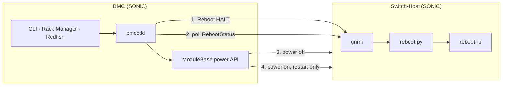
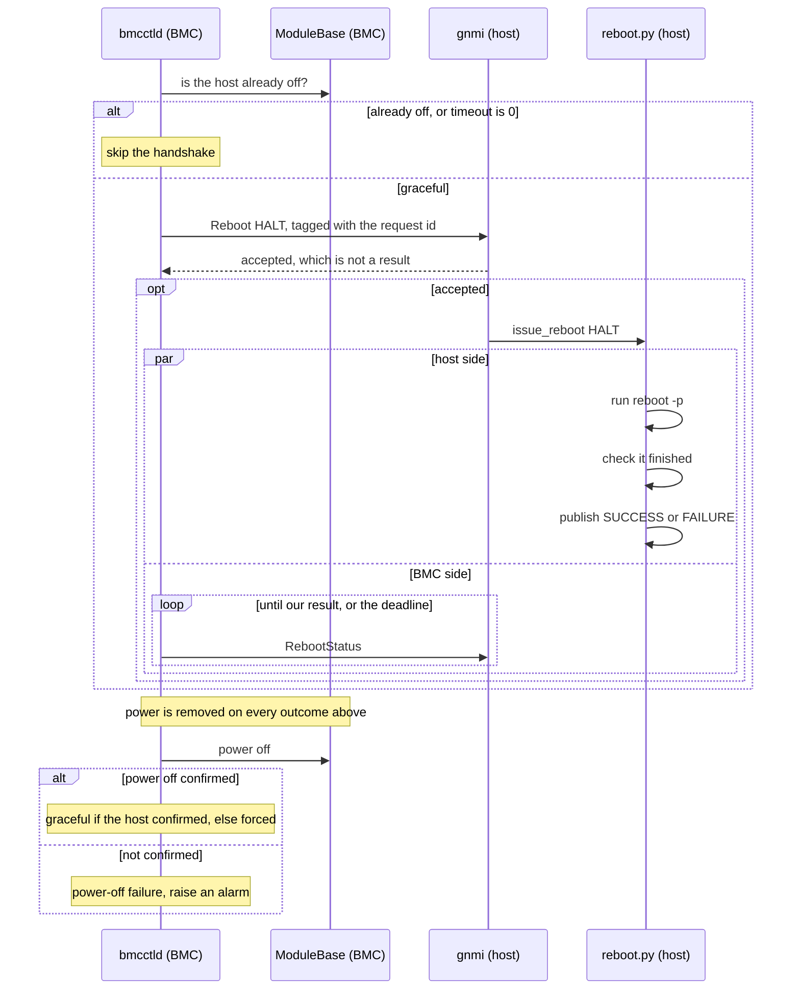
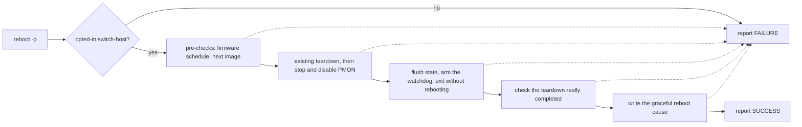
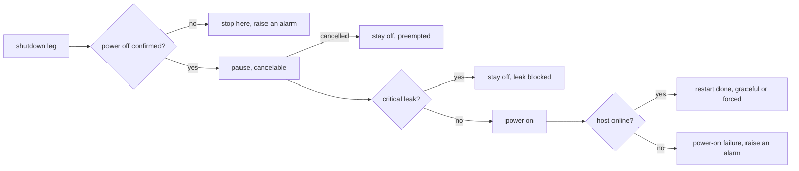
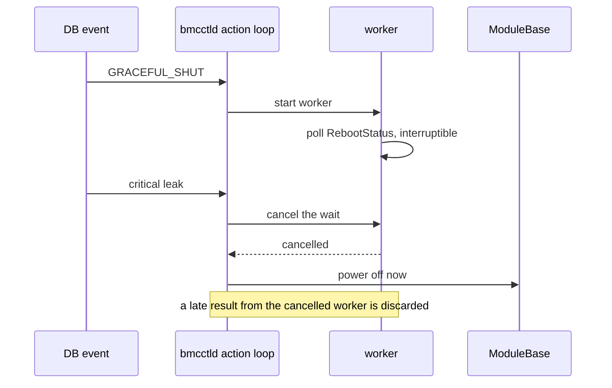

# Graceful Shutdown and Restart of the Switch-Host from BMC

## Table of Content

- [1. Revision](#1-revision)
- [2. Scope](#2-scope)
- [3. Definitions/Abbreviations](#3-definitionsabbreviations)
- [4. Overview](#4-overview)
- [5. Requirements](#5-requirements)
- [6. Architecture Design](#6-architecture-design)
- [7. High-Level Design](#7-high-level-design)
  - [7.1. Shutdown flow](#71-shutdown-flow)
  - [7.2. Host side: `reboot -p`](#72-host-side-reboot--p)
  - [7.3. Knowing the host finished](#73-knowing-the-host-finished)
  - [7.4. Timing](#74-timing)
  - [7.5. Graceful restart](#75-graceful-restart)
  - [7.6. Concurrency and preemption](#76-concurrency-and-preemption)
  - [7.7. Reboot cause](#77-reboot-cause)
  - [7.8. Failure handling](#78-failure-handling)
  - [7.9. Platform requirements](#79-platform-requirements)
  - [7.10. Security](#710-security)
  - [7.11. Serviceability](#711-serviceability)
  - [7.12. Compatibility](#712-compatibility)
  - [7.13. Considered alternatives](#713-considered-alternatives)
- [8. SAI API](#8-sai-api)
- [9. Configuration and management](#9-configuration-and-management)
  - [9.1. Manifest](#91-manifest)
  - [9.2. CLI/YANG model Enhancements](#92-cliyang-model-enhancements)
  - [9.3. Config DB Enhancements](#93-config-db-enhancements)
  - [9.4. State DB Enhancements](#94-state-db-enhancements)
- [10. Warmboot and Fastboot Design Impact](#10-warmboot-and-fastboot-design-impact)
  - [Warmboot and Fastboot Performance Impact](#warmboot-and-fastboot-performance-impact)
- [11. Memory Consumption](#11-memory-consumption)
- [12. Restrictions/Limitations](#12-restrictionslimitations)
- [13. Testing Requirements/Design](#13-testing-requirementsdesign)
  - [13.1. Unit Test cases](#131-unit-test-cases)
  - [13.2. System Test cases](#132-system-test-cases)
- [14. Open/Action items](#14-openaction-items)
- [15. References](#15-references)

### 1. Revision

| Rev | Date | Author | Change Description |
| --- | --- | --- | --- |
| 0.1 | 2026-08-12 | William Tsai | Initial version |

### 2. Scope

On a chassis where SONiC runs on both the BMC and the switch-host, the BMC owns switch-host power. It
removes that power without telling the host, so the host cannot flush state, run any platform ordering
it needs, or record why it went down.

This design lets the BMC ask the host to prepare first, wait a bounded time, and then remove power. It
adds:

- a graceful leg to the existing `GRACEFUL_SHUT` command — ask, wait, then remove power;
- a new `GRACEFUL_RESTART` command — the same shutdown, a short pause, then power on;
- an extension of the existing critical-leak check to `POWER_CYCLE`, which is ungated today, and a
  re-read of that state under the power lock. `POWER_ON` is gated on its three other entry points already;
  the startup power-on on a non-liquid-cooled chassis is not. The re-read reaches that call site, but there
  power is raised at daemon start with no delay, so it can run before any leak publisher has written anything.
  The gap is not vacuous — the leak gate is cooling-agnostic and includes a rack-level trigger, so an
  air-cooled host in a liquid-cooled rack is the case — which is why requirement 7 is scoped to published
  state rather than claimed absolutely. Closing that window means changing when startup raises power, and that
  is not this design's change.

It is assembled from parts SONiC already ships: gNOI `System.Reboot` and `System.RebootStatus` on the
host, `reboot -p` and its existing teardown, and `bmcctld`, the BMC daemon that already owns
switch-host power. `POWER_OFF`, `POWER_ON` and `POWER_CYCLE` keep their existing semantics; what changes
around them is the leak check above, and that their oper-status verification becomes interruptible
([§7.4](#74-timing) rule 3).

**Out of scope.** Abort or cancel of a request once the host has accepted it; more than one power
operation at a time per BMC; resuming an operation across a `bmcctld` restart; BMC power-loss
resilience; traffic draining and route withdrawal, which belong to the requester; WARM and COLD host
reboots driven by the BMC; multi-ASIC and modular chassis. Leak-triggered graceful shutdown is deferred
**on a critical trigger only**, and on both fields that carry one: with `system_critical_leak_action` or
`rack_mgr_critical_alert_action` set to `graceful_shutdown`, a critical event waits the configured timeout
before power is removed. That configuration is reachable today and this design does not rely on it being
absent — the `0` timeout default is seeded only when no entry exists, and an operator value survives a
reboot — so the guarantee is structural instead: a critical trigger ranks highest on its severity rather
than on its action ([§7.6](#76-concurrency-and-preemption)). That ranking guarantees the action is neither
refused as busy nor suppressed by the guard — it does not shorten the action, so it does not make such a
configuration meet the platform's leak bound; that is rule 3 of [§7.4](#74-timing), and making both those
actions a direct power off remains the cleaner end state, in open item 1
([§14](#14-openaction-items)). Below critical the restriction does not apply at all: those severities have
their own fields, and an event too small to justify an *immediate* cut — power is still removed at the end of
the graceful leg — is precisely what this feature is for
([§9.3](#93-config-db-enhancements)).

### 3. Definitions/Abbreviations

| Term | Meaning |
| --- | --- |
| BMC | Baseboard Management Controller |
| Switch-Host | The main board that hosts the ASIC and the CPU |
| PMON | Platform Monitor container |
| gNMI / gNOI | gRPC Network Management / Operations Interface |
| mTLS | Mutual TLS — both sides present and verify a certificate |
| HALT | gNOI `RebootMethod = HALT(3)`. Prepare for an external power action. It does not mean Linux reaches halt or ACPI S5 |
| Pre-shutdown | What `reboot -p` does: the reboot teardown, without the reboot. The term and the flag are already in `scripts/reboot` |

### 4. Overview

The BMC asks the host to get ready, waits, and removes power either way.

The request is a gNOI `System.Reboot` with method `HALT`, sent over mTLS on the BMC-host link. On the
host, `reboot.py` maps `HALT` to `reboot -p`, which runs the normal reboot teardown and then **exits
instead of rebooting**. That is the property the design rests on: the OS is still running afterwards,
so the host publishes its own result on `System.RebootStatus` and the BMC reads it in band. No
hardware readiness signal and no new platform API are needed.

The BMC waits for that result up to `graceful_shutdown_timeout`, then removes power. Power removal is not
conditional on the result: it runs on the normal path, on a timeout, on an RPC failure, and when a
higher-priority request preempts the wait. The one execution it does not survive is the daemon's own
death, which abandons the operation rather than completing it ([§7.8](#78-failure-handling)). What the
result changes is only how the operation is recorded — as graceful when the host confirmed it finished, as
forced otherwise.

SONiC already uses the same pair of RPCs between an NPU and its DPUs, so the host side of this is
proven. The BMC takes the requester role, and adds what that path does not have: mTLS instead of
plaintext, and a check that the report it reads answers its own request ([§7.3](#73-knowing-the-host-finished)).

### 5. Requirements

| # | Requirement |
| --- | --- |
| 1 | Graceful shutdown from CLI `config chassis modules shutdown` and from the Rack-Manager `GRACEFUL_SHUT` command; graceful restart from a new `GRACEFUL_RESTART` command |
| 2 | The wait is bounded by the existing `graceful_shutdown_timeout`, and power is removed when it expires. `0` means remove power immediately |
| 3 | Power removal is attempted on every outcome `bmcctld` handles — timeout, RPC failure, preemption. The daemon's own death abandons the operation instead ([§12](#12-restrictionslimitations)) |
| 4 | An operation is recorded as graceful only when the host confirmed it finished. Anything unproved is recorded as forced |
| 5 | A graceful reboot cause is written only after that confirmation |
| 6 | The BMC-to-host gNOI channel uses mTLS with mutual verification. A device without certificates stays forced-only |
| 7 | When the configured leak action is a power action, a critical leak preempts a wait in progress; power-raising commands are refused while a critical leak is **present in published state**. The scope matters at daemon start, where power can be raised before any leak publisher has written anything ([§2](#2-scope)) |
| 8 | The DPU `HALT` path keeps its behavior. The existing force paths keep their semantics, with their oper-status verification made interruptible so a leak is not held behind it |

### 6. Architecture Design

The SONiC architecture does not change. The feature adds no daemon, container, database table, CLI
command or gNOI method, and no persistent state on the BMC.



*Figure 1 — The BMC asks, the host prepares and reports, the BMC removes power. A restart then powers
the host back on.*

The only new traffic on the BMC-host link is gNOI over mTLS.

| Component | Repository | Change |
| --- | --- | --- |
| `bmcctld` | sonic-platform-daemons | Send `HALT`, poll `RebootStatus`, remove power on every outcome it handles, add `GRACEFUL_RESTART`, add the priority handling of [§7.6](#76-concurrency-and-preemption) |
| `scripts/reboot` | sonic-utilities | Accept `-p` on a switch-host. Today the option is DPU-only |
| `host_modules/reboot.py` | sonic-host-services | Report failure when a completion check cannot be answered, carry the requester's tag on every terminal report, read `switch_host_halt_services_timeout`, and write the graceful reboot cause after the check |
| `show chassis modules status` | sonic-utilities | New status columns |
| `determine-reboot-cause` | sonic-host-services | The one display rule of [§7.7](#77-reboot-cause) |
| mTLS material | sonic-buildimage | Certificate seeding on opted-in platforms |
| Redfish bridge | sonic-redfish | Map `GracefulShutdown` and `GracefulRestart`. Optional — the release can ship without it |

No platform code changes. Opting in does add per-platform content — the `platform.json` keys of
[§9.3](#93-config-db-enhancements), and a bounded `pre_reboot_hook` for any platform that needs one.

### 7. High-Level Design

#### 7.1. Shutdown flow



*Figure 2 — The host produces its result on its own schedule; the BMC polls on its own.*

#### 7.2. Host side: `reboot -p`

`reboot.py` maps `HALT` to `sudo reboot -p`. The `-p` option already exists and already means
pre-shutdown; it is currently rejected on anything that is not a DPU, and this design allows it on an
opted-in switch-host. Nothing in the teardown itself changes.

Relaxing that rejection is not by itself enough on a switch-host that is also a SmartSwitch NPU: the same
entry point otherwise continues into the path that reboots the NPU's DPUs, whose own status wait reads the
same `platform.json` key. On an opted-in switch-host it returns to the pre-shutdown body instead, and the
DPU legs are not driven from here.



*Figure 3 — Any step that cannot be proved produces the same FAILURE result, and the BMC removes
power anyway. The dotted edges show which step failed, not how quickly it is reported: one pre-check
branch is detected only by the completion check afterwards ([§12](#12-restrictionslimitations)).*

**A failed pre-shutdown is not repaired.** There is no rollback and no retry. PMON is not restarted,
whatever was already flushed stays flushed, and the host is not returned to a serving state — it
reports `FAILURE` and stops where it is. The BMC then does exactly what it does on a timeout: remove
power, and record the operation as forced. This is deliberate. Once a teardown has begun the only two
useful end states are powered off, which the BMC brings about on every outcome it handles
([§7.8](#78-failure-handling)), or rebooted by the watchdog; trying to
nurse a half-torn-down host back into service would add failure modes to the one path that has to stay
simple. In the case where a pre-check refuses before the teardown starts, the host is untouched and
the cut is simply no gentler than today's — that is the floor this feature never goes below, not a
regression.

**PMON must stop** because its daemons keep reading and writing platform devices — sensors, I2C and
CPLD, fans, transceivers. Leaving them active while an external power sequence runs is what this
feature has to avoid.

**What the teardown does is platform-dependent.** On most platforms it asks the ASIC to shut down
with `syncd_request_shutdown --cold`; some ASIC types skip that step entirely. The design does not
change any of it, and does not depend on which branch a platform takes — but a platform can only opt
in if its teardown leaves the ASIC safe to lose power ([§7.9](#79-platform-requirements)).

**The reporting path survives the teardown.** `database`, `gnmi`, `sysmgr` and `sonic-hostservice` keep
running, which is what lets the host answer the BMC's poll after its own teardown is done. The path is
longer than the RPC suggests: `gnmi` terminates the RPC, `sysmgr` carries it inward, and
`sonic-hostservice` holds the published report — so the last of the four is the one that actually owns
the answer, and losing it is what makes an operation unattributable.

Nothing on that path is coupled to `syncd` today: no unit declares a dependency that would carry a `syncd`
stop into it, and `gnmi`'s only relation is an `After=`, which orders and nothing more. That is a reading of
the current tree rather than a guarantee, which is why the platform assertion is a property of the rendered
image and the test exercises it on hardware ([§7.9](#79-platform-requirements),
[§13.2](#132-system-test-cases)).

`swss` is why inspecting the unit files would not settle it. It declares nothing about `syncd.service`, yet
its `ExecStart` waits on a container watch over `syncd`, so a `syncd` container that goes away can end
`swss` too — coupling that no unit file shows. The teardown does not take that container away, so `swss`
runs on to the cut, with or without an ASIC beneath it depending on whether the platform's teardown shut one
down. Neither costs anything while power is about to go.

**The host never removes its own power.** `reboot -p` asks the watchdog to arm before it exits, so a
host left powered is meant to reboot itself back into service. Today that is an intent, not a proof:
the script does not check the result and `watchdogutil arm` reports failure without a non-zero exit,
so the effective timeout has to be read back before this can be relied on ([§14](#14-openaction-items)).

A platform that needs ordering of its own already has a place for it: `scripts/reboot` runs
`<platform>/pre_reboot_hook` on every reboot if it is executable. Today its failure is logged and
ignored and it has no time limit, which is not good enough to build a guarantee on, so **on the
switch-host pre-shutdown path only** this design bounds it and treats a non-zero exit or a timeout as a
failed pre-shutdown. Other reboot paths keep today's best-effort behaviour. A hook that touches a
device another daemon also drives has to stop that daemon itself; the host stops only PMON.

**Where vendor differences belong.** `scripts/reboot` already branches on platform attributes — it
stops an extra container on one subtype, and skips the ASIC request on some ASIC types — and the
switch-host pre-shutdown runs that same body. A vendor that has to stop a service the common path
leaves running, or sequence something differently, adds its branch there rather than anywhere in this
design; nothing here needs to change to accommodate it. Two constraints apply to such a branch: it
must not stop anything on the reporting path above, `sonic-hostservice` included, and it must be
bounded, because it spends the BMC's timeout. Logic that is better expressed as an executable than as
a change to the script belongs in `pre_reboot_hook` instead.

#### 7.3. Knowing the host finished

Power removal never waits on this. The only question is how the operation is recorded.

`RebootStatus` reports the host's most recent reboot request, whoever made it and with no per-requester
state, so the BMC has to establish that the report answers its own request. It does that positively,
with a tag, and not by inference.

The BMC puts the operation's request id in the request's `message`. The host already echoes that message
back while the reboot is active; this design also carries it on **every terminal report**, appended to
the existing result string rather than replacing it. Appending is what keeps today's DPU requesters
working: one matches `reboot complete` as a substring of the whole client output, the other reads only
the active flag. `reason` is a free-form string, so no proto change is needed — and adding a field would
be worse, because the gNOI server unmarshals the response strictly.

**The id is a freshly generated UUID**, and that is what makes a stale report unmatchable. A counter would
not: the acceptance the BMC holds is the reboot backend's, returned as soon as it has spawned its worker,
while the host replaces its report later inside the call that worker makes — so a poll can land in between
and read the previous operation's report, and a per-run counter repeats an id after a restart
([§7.8](#78-failure-handling) keeps no state).

Graceful is recorded only on the conjunction of **five** conditions: the tag extracts exactly and equals this
operation's, the report is terminal, the method is `HALT`, the status is `SUCCESS`, **and the status message
is empty**. Everything else is forced. The tag is delimited so that extraction is exact: it is appended to a
free-form string, and a bare match could take a shorter id out of a longer one.

The fifth condition exists because a report can come from the reboot backend rather than the host, and still
carry the tag: the backend seeds its own state from the request and its failure paths replace only the status
message. Those answers say nothing about the host — in several of them the host never received the request —
so without that condition they would be filed as `check_failed`. The status enum cannot tell them apart,
because the host publishes the same failure status on its own paths; the message can, because the host always
leaves it empty and the backend fills it in on the paths that matter. That premise is a platform assertion
rather than an observation ([§7.9](#79-platform-requirements)).

Three events end the wait and nothing else does: a terminal report carrying our tag, an RPC failure, or the
deadline. An untagged terminal report does not end it — acting on one is the inference this design discarded,
and it let a report from an earlier operation finish a wait early.

Anything unattributable is forced, and the two refusals arrive differently. The backend refusing a second
request while one is in flight is synchronous, so it reaches the BMC as an RPC error. The host's own
*"Previous reboot is ongoing"* is not: the outer `Reboot` has already succeeded, so it comes back as the
status message of a terminal tagged report and is classified by origin like any other backend answer. Either
way the BMC stops trying to prove gracefulness and removes power. A restart of `sonic-hostservice`, which owns
the report, has the same effect.

Liveness of that service is necessary but not sufficient: the report also has to be *forwarded*. The backend
forwards `RebootStatus` to the host only while it treats the halt as in progress, and gives up after a fixed
wait for a platform that never halts — which on this path is every platform. After that the host's report is
unreachable however healthy the host is, which is the 260 s ceiling in rule 1 of [§7.4](#74-timing).

Three outcomes are distinguished, and the exact result strings are an implementation detail:

| Outcome | Meaning |
| --- | --- |
| Graceful | The host confirmed it finished before power was removed |
| Forced | Power was removed without that confirmation. Expected and safe, not an error |
| Power-off failure | The power command itself was never acknowledged. This is the one outcome that needs attention |

Each is written to `HOST_STATE|switch-host` and to the BMC event log, together with the reason a
graceful shutdown ended up forced ([§7.11](#711-serviceability)).

A confirmed pre-shutdown means the teardown ran to the end and PMON is stopped. It does not mean
Linux stopped, and it is only as strong as the checks the host performs — today the script ignores the
result of the ASIC request, of the flush and of the platform hook, so those become checks this design
adds rather than guarantees it inherits. The host is ready to lose power, not shut down.

#### 7.4. Timing

| Parameter | Value | Source |
| --- | --- | --- |
| `graceful_shutdown_timeout` | `bmcctld` uses `0`, which means forced; the parent design documents 120 s | Existing field, but the two disagree — see below. It is the binding bound: the whole pre-shutdown is spent inside it |
| Pre-shutdown duration | To be measured | New measurement. It decides whether 120 s is enough |
| Reboot-backend halt wait | `260 s` | Existing `sonic-sysmgr` constant, compiled into the *host* image. After it the host's report is unreachable — the ceiling in rule 1 |
| Residual completion check | 0 s when its window opens satisfied; otherwise up to `switch_host_halt_services_timeout`, rounded up to its 5 s poll, plus one probe. When that key is absent the existing `dpu_halt_services_timeout` applies, and only then a `60 s` default — so on a platform that sets the DPU key this term is that value, not 60 s ([§9.3](#93-config-db-enhancements)) | Existing mechanism, read on any `HALT`. It starts only after `reboot -p` exits, so it bounds the residual check and not the teardown — a conditional worst-case term in rule 1 |
| Watchdog | Requested 180 s; the effective value is whatever the platform returns | Existing `watchdogutil arm` |
| `RebootStatus` poll interval | 1 s, proposed | New constant. It bounds how late a result is noticed, and it spends the timeout |
| Restart pause | 3 s, proposed | New constant |
| Leak response bound | Per platform | It preempts any wait, but not a call already running (rule 3) |

Three rules have to hold, and measurement on real hardware settles all three:

1. **The BMC's timeout is the binding one, and it serves two different requirements.** Only the first of
   them gates the feature working at all:

   ```
   (a) success reportable    request + pre-shutdown + poll allowance + polling  <  graceful_shutdown_timeout
   (b) failure reportable    request + pre-shutdown + residual bound + polling  <  graceful_shutdown_timeout
   and in both cases                                                               graceful_shutdown_timeout  <  260 s
   ```

   The host runs `reboot -p` to completion in a blocking call and fetches its own completion-check timeout
   only after that call returns, so the teardown is spent while the BMC polls and nothing has been reported
   yet. An unbounded platform hook therefore spends the BMC's timeout, which is where
   [§7.2](#72-host-side-reboot--p) already puts it.

   **(a)** is the precondition. It carries a poll allowance rather than the residual bound, because on a
   completed teardown the host's check normally passes on its first pass; the allowance covers the case where
   PMON's container is not yet observably stopped when the window opens. It is small and unmeasured — a term
   to size, not one to assume away. **(b)** is a goal. One teardown branch reports success without having achieved
   it ([§12](#12-restrictionslimitations)), and there the host spends the whole residual bound before
   publishing `FAILURE`. Missing (b) does not break the feature — those branches record forced either
   way — it costs the *reason*, since a report arriving after the deadline is recorded `deadline` rather than
   what the host said.

   The ceiling is not ours: it is the reboot backend's fixed halt wait
   ([§7.3](#73-knowing-the-host-finished)). The two clocks share no origin and neither side can order them, so
   **the BMC establishes its deadline before it sends `Reboot`** and charges the request and every poll to that
   one deadline, capping each RPC by what remains; without a pre-send origin the ceiling is not enforceable.
   **The two BMC-side defaults disagree:** `bmcctld` seeds `0` when no entry exists, while the parent design
   and the CLI say 120 s. Picking one, against measurement and inside this bracket, is open item 1
   ([§14](#14-openaction-items)).
2. **Power has to be removed before the watchdog fires.** Otherwise the host reboots in the middle of
   the power sequence. The watchdog is armed near the end of the pre-shutdown, not when the operation
   starts, so the quantity that has to hold is:

   ```
   accepted timeout + polling + power-off latency + margin  <  effective watchdog timeout
   ```

   Neither side can evaluate that alone — the BMC owns the left, the host reads the right — which is why
   the two local checks of [§9.2](#92-cliyang-model-enhancements) and open item 2 exist, and why a
   platform whose watchdog cannot satisfy it cannot be enabled. Only the value the platform actually
   returns counts as evidence.
3. **A critical leak present in published state has to reach the power domain within the platform's leak
   bound**, when the
   configured leak action is a power action at all — `syslog_only` is a valid setting and takes none.
   The graceful wait becomes interruptible, and so must the oper-status polls that already follow every
   power call today: up to 60 s after `set_admin_state`, and up to 120 s after `do_power_cycle()`.
   `do_power_cycle()` itself is a single platform call that cannot be interrupted, so a leak arriving
   during it is served only when it returns — which is why graceful restart does not use it
   ([§7.5](#75-graceful-restart)). One configuration cannot satisfy this rule at all: a *critical* trigger whose own
   configured action is `graceful_shutdown` reaches the power domain no sooner than the timeout, which is why
   open item 1 turns that action into a direct power off.

`graceful_shutdown_timeout` also bounds the shutdown leg of a graceful restart; no second timeout is
added. Neither the CLI request nor the Rack-Manager command row carries a per-request timeout — the
value is per-device configuration ([§9.3](#93-config-db-enhancements)).

#### 7.5. Graceful restart



*Figure 4 — Power off, pause, then power on, with the leak checked immediately before powering on.*

`GRACEFUL_RESTART` powers off and powers on as two separate steps rather than calling the existing
`do_power_cycle()`. `do_power_cycle()` cannot be interrupted, so a leak or a `POWER_OFF` arriving
during it can be neither preempted nor honoured in time. Doing it in two steps leaves a point in
between where the BMC re-reads the leak state, under the same lock that serialises the power calls, so no
*published* critical leak already present is missed. It does not make the raise itself
interruptible: a leak arriving after the
check waits for `set_admin_state()` to return — a shorter window than `do_power_cycle()`'s, but not an
absent one ([§12](#12-restrictionslimitations)). `POWER_CYCLE` keeps using `do_power_cycle()` unchanged.

A restart does not modify `admin_status`.

#### 7.6. Concurrency and preemption

Priority belongs to the operation, not to where the request came from, so a CLI request and a
Rack-Manager request of the same kind rank the same.

| Priority | Operation |
| --- | --- |
| Highest | Anything triggered by a **critical** leak, whatever action is configured for it |
| | `POWER_OFF` |
| | `GRACEFUL_SHUT` |
| | `GRACEFUL_RESTART`, `POWER_CYCLE` |
| Lowest | `POWER_ON` |

The top row ranks on the **trigger's severity**, not on the configured action, so that a critical leak set to
`graceful_shutdown` ([§9.3](#93-config-db-enhancements)) still outranks a shutdown in flight instead of being
refused as busy. Within that row the action decides: a direct power off displaces a critical leak's graceful
wait, since the two critical policies are independent and either may fire first. Below it, nothing ranks on
its trigger.

A higher-priority operation displaces the one in flight. An equal or lower one is refused as busy,
except a repeat of the same request against the same module, which joins the operation already running
and returns its id — a Rack-Manager retry must not become a second operation. Displacement has a third
outcome: when the operation in flight is inside a call that cannot be cancelled, the higher-priority one
is deferred until that call returns rather than taking effect at once.

The wait already exists today and it blocks. `GracefulShutdownHandler.execute()` polls the host's
oper-status with a plain sleep, inside
[`_run_action_loop()`](https://github.com/sonic-net/sonic-platform-daemons/blob/630677528db95b20ada0cb94bbb198a2929428bc/sonic-bmcctld/scripts/bmcctld#L1294-L1306) —
the single sequential consumer of the action queue — so nothing else queued runs until it returns, a
leak-triggered power off included. Events are safe meanwhile: they arrive on a separate thread that keeps
enqueuing.

So the operation body moves to a worker thread and the sleep becomes a wait that ends **on demand rather than
at the next poll**. It ends on exactly the three events [§7.3](#73-knowing-the-host-finished) names, plus a
cancellation from the action loop, which the caller treats as a preemption and still removes power on. Nothing
about the wait is on the queue's consumer any more, which is the whole point of moving it.



*Figure 5 — How a higher-priority request stops a wait already in progress.*

Two rules keep this safe. The action loop alone acts on priority and records the outcome, so a worker
that was already displaced cannot write over its successor's result. And every power call takes one
lock, held only for the platform call itself, so power calls never overlap; a call that raises power
re-checks the leak state after taking that lock.

Priority is *derived* where the request is admitted and *carried*, not re-derived where it runs. It has to
be: the queued item records the action and a free-form description, and while that description does name the
trigger today, a log string is not a contract — an executor branching on the action alone cannot tell a
critical leak's shutdown from an ordinary one, and nothing stops the wording
changing. So an admitted request carries an immutable priority, computed from the trigger while the
severity is still in hand, and that one value decides both displacement and the guard exemption below. The
severity itself need not survive the queue; the bit derived from it must. It is derived from **either**
critical trigger — a critical system leak and a critical rack-manager alert already gate the existing power
commands identically, and the exemption must not turn on which of the two a leak arrived through.

One existing guard has to give way to this. Today a queued shutdown is skipped — and reported successful —
on three conditions: the host reads `OFFLINE` live, or the recorded power state is `POWERING_OFF`, or it is
`GRACEFUL_SHUTTING_DOWN`, which is exactly the state a graceful shutdown writes before it starts waiting.
The guard covers the graceful action as well as the power off, so exempting only a power off would not be
enough. And preemption is the wrong test: the guard exists to swallow a **redundant repeat**, and a
critical-leak action is never one *while power is still on*. The guard's three conditions split exactly along
that line — one reads the live oper-status, two read a recorded transition — so the rule is: **a critical-leak
action is exempt from the two recorded conditions and not from the live one.** A direct power off arriving
against a graceful shutdown's transitional state is therefore exempt and displaces it; a second critical action
arriving once the host actually reads offline is the redundant repeat the guard exists for, and is absorbed.
Nothing here needs to count actions or track an episode.

The exemption belongs **at the guard**, not in the action loop, because the guard has a second caller: the
drain loop that keeps serving the queue during the boot delay, which on a liquid-cooled host runs *before* the
action loop starts and is the only consumer for as long as that delay lasts. Displacement has to reach that
window too — the delay is long enough for a shutdown to start a wait inside it — so the drain loop shares the
action loop's priority handling rather than only its execution.

Preemption stops the BMC's own waiting, and that is its whole scope. **A call already running is not
displaceable** — there is no cancellation point inside one, and a cancellation is observed only between
calls. Three such calls sit on these paths: `do_power_cycle()`, the `set_admin_state()` that raises power
on a restart, and the gNOI RPC itself, which runs under its own deadline. Each bounds how late a
higher-priority request can take effect, each has to fit the platform's leak bound
([§12](#12-restrictionslimitations)), and for the two power calls the lock deliberately keeps a second
call off the same rail until the first returns. Preemption also does not undo the host's pre-shutdown,
because there is no way to undo one, and it never sends `CancelReboot`. Since `POWER_ON` is the lowest
priority, it cannot displace a shutdown; an operator powers a host back on after the shutdown reports its
result.

#### 7.7. Reboot cause

The host writes the software reboot cause, from a fixed set of strings, only after its own completion
check passes. The platform records the hardware cause on the next boot.

The guarantee is one-way: a graceful cause means the pre-shutdown really completed. If the write fails
the host reports failure, and the BMC removes power and records the operation as forced.

The hardware cause takes precedence when both are present, which would hide the graceful string. So
`determine-reboot-cause` gains one narrow rule: a graceful software cause together with the
BMC-power-down hardware cause displays the graceful cause. The rule keys on that cause by name, and for
it to be separable the cause has to be a distinct *major* cause rather than a minor under
`REBOOT_CAUSE_POWER_LOSS` — `determine-reboot-cause` flattens major and minor into one string and matches
substrings, so a minor would make a generic power loss indistinguishable. Naming the constant is part of
landing Reference 9.

#### 7.8. Failure handling

No operation state survives a `bmcctld` restart, and nothing is resumed. A transitional state left
behind by a killed daemon is overwritten and logged.

Almost every failure still ends with the host either off or back online: the requester re-issues, a
leak that is still present fires again, and a host left after a pre-shutdown is rebooted by its
watchdog — once the arm is actually verified, which is open item 2. Re-issuing is not immediate, though:
a second `Reboot` is refused for the whole of the reboot backend's halt wait, so within that window a
retried graceful attempt records `rpc_failure` ([§7.11](#711-serviceability)) and the operator meets the
260 s ceiling from the other side. Two cases need an operator, and they differ in what is left. One is
the daemon's own death: nothing
removes power, and the watchdog is the only remaining path — absent by construction if the host hung before
the arm. The other is narrower than it looks — the arm sits near the end of the pre-shutdown, and at least one
existing exit path leaves `reboot -p` after the teardown but before the arm, so a single orderly failure can
leave a torn-down host with no watchdog; there the BMC does remove power, and what does not hold is the
automatic return to service.

A power-off failure leaves `device_power_state` transitional on purpose: the real power state is
unknown, so claiming either stable state would be wrong.

#### 7.9. Platform requirements

A platform opts in by setting `bmc_pairing` in `platform.json`, which asserts that:

- `set_admin_state(down)` removes power from exactly this host;
- the teardown `reboot -p` performs on this platform leaves the ASIC safe to lose power;
- on the rendered image, `syncd` ending leaves the reporting path — `database`, `gnmi`, `sysmgr`,
  `sonic-hostservice` — serving. What has to hold is the effective graph, drop-ins and scripted container
  watches included, not a list of unit-file directives;
- no platform hook or vendor branch stops one of those four, `database` among them, since `gnmi` and
  `sysmgr` require it and it carries the path with them;
- the BMC covers thermal and leak protection for the whole interval where PMON is stopped. On a
  liquid-cooled chassis its leak publishers are also producing state before power is raised; on an air-cooled
  one that window is accepted rather than covered (requirement 7's scope, [§2](#2-scope));
- the watchdog's effective timeout can be read back and outlasts the remaining timeout (rule 2 of
  [§7.4](#74-timing));
- it ships no `platform_reboot_pre_check`, or one whose failure the fixed script propagates
  ([§12](#12-restrictionslimitations));
- its host image leaves the reboot report's status message empty, which is what distinguishes a host answer
  from a backend one ([§7.3](#73-knowing-the-host-finished));
- its `switch_host_halt_services_timeout` is sized for this host rather than inherited from a DPU setting
  ([§9.3](#93-config-db-enhancements)). Rule 1(b) is *not* asserted here: it decides whether a failed
  pre-shutdown is diagnosable, not whether the feature is safe to enable, so reason accuracy is best-effort
  where a platform cannot meet it;
- the pre-shutdown duration, the power-off latency and the leak bound have been measured.

Without it the platform stays forced-only, exactly as it behaves today. These properties vary between
platforms of the same vendor, so the assertion is per platform.

The power operations use `set_admin_state()`, `get_oper_status()` and `do_power_cycle()`; on top of
those `bmcctld` already needs `get_all_modules()`, `get_type()`, `is_liquid_cooled()`,
`get_description()` and `get_serial()` to find and describe the switch-host at all. Where
`get_oper_status()` reports the last command rather than sensed power, "confirmed" means the command
was accepted — this design cannot detect a rail that ignored it.

#### 7.10. Security

The BMC already owns host power physically. What is new is the network path that carries the request.
No new RPC is added: the existing gNOI `System` service becomes reachable with client authentication
on opted-in platforms, protected by mTLS with mutual verification, CN-to-role authorization on the
gNMI server, and a CACL rule that limits the gNMI port to the BMC-link address.

One gap gates enablement, and it is wider than per-module. Authorization is not per module: nearly every call
site authorizes against a **single `gnoi` target** with the role matched by prefix and a read-only,
read-write or no-access postfix. So one role spans the whole gNOI surface — including `OS`, `File`,
`Containerz` and FactoryReset — and most of gNSI with it, certificate and authorization policy included; only
Credentialz sits behind a target of its own. This design needs two RPCs out of all that.

Two parts of that surface are not gated by the role at all. A certificate whose roles include none matching
the `gnoi` target is refused only on calls classified as *writes* — and the read-classified set is not
read-only work: it includes file put and remove, OS install, factory reset and all three gNSI rotations. So
what the gap admits is unauthorized **mutation**, not read breadth. Separately, one `Healthz` handler performs
no authorization at all, reached under mTLS and the CACL alone. This design's
own two RPCs are both write-classified, so it is not a beneficiary of either gap — the point is what a role
issued for it would also unlock.

Either a security review accepts that breadth for the BMC-link CA, or per-RPC authorization lands in
`sonic-gnmi` — a larger change than "per module" would have implied, because the granularity has to be
introduced rather than narrowed. Until then, devices stay forced-only.

#### 7.11. Serviceability

No new counters. Every operation is recorded in `HOST_STATE|switch-host` and in the BMC event log with
its request id, trigger, outcome, and — when a graceful shutdown ended up forced — why:

The reason is decided by taking the **first** row that matches, so the codes cannot overlap:

| # | Reason | Condition |
| --- | --- | --- |
| 1 | `not_qualified` | The platform is not opted in, or has no certificates. No request sent |
| 2 | `timeout_zero` | `graceful_shutdown_timeout` is `0`. No request sent |
| 3 | `already_off` | The host already reads offline, or a shutdown is already recorded in progress, so the guard skips this one as a redundant repeat ([§7.6](#76-concurrency-and-preemption)). No request sent |
| 4 | `preempted` | A higher-priority operation displaced this one |
| 5 | `rpc_failure` | The `Reboot` or a poll returned an error rather than a response — gNOI unreachable, TLS failure, the reboot backend's synchronous refusal of a second request, or an RPC that never resolved |
| 6 | `backend_answered` | A terminal report whose *status message is non-empty*, so the reboot backend answered from its own state rather than forwarding. This is also where the host's own *"Previous reboot is ongoing"* lands, because that refusal comes back as a status message and not as an RPC error ([§7.3](#73-knowing-the-host-finished)) |
| 7 | `check_failed` | A terminal report from the host — empty status message — that is not a success. It covers both a pre-shutdown that ran and could not be proved complete and one that never started, since a refused `reboot -p` reports the same way |
| 8 | `deadline` | No terminal report *carrying our tag* before the deadline. This is where an untagged report lands, including one from a host image that does not carry the tag, and where a report left permanently active lands — neither ends the wait, so neither is classified on its own ([§7.3](#73-knowing-the-host-finished)) |
| 9 | `unclassified` | Anything else. The rows above are not provably total, so the table has a floor rather than an implied one; a record landing here is a defect to investigate |

Rows 6 and 7 are evaluated against the report that ended the wait, and their order is the part that matters:
origin before verdict, so a backend answer is never read as a statement about the host. There is no
attribution row above them because there cannot be one — only a report carrying our tag ends a wait, so
everything unattributable reaches the deadline instead.

Collecting those records off the device answers how often graceful ended up forced, and why. A counter
would give the rate without the reason.

#### 7.12. Compatibility

A device does the graceful leg only when its platform is opted in and its certificates are
provisioned. `graceful_shutdown_timeout` is the second gate: `bmcctld` reads it as `0` when there is
no `CHASSIS_MODULE|SWITCH-HOST` entry, so an unconfigured device stays forced-only until an operator
sets it.

| Combination | Behavior |
| --- | --- |
| New BMC, old host image | The host rejects `-p` within seconds, but its failure report carries no tag, so the BMC cannot attribute it and waits out the timeout before removing power |
| New BMC, new host image, pre-shutdown refuses early | The failure report carries the tag, so the BMC acts on it in seconds ([§12](#12-restrictionslimitations) item 3) |
| Old BMC, new host image | The BMC never sends `HALT`, so the switch-host path never runs. `reboot.py`'s tag change is shared with the DPU path, which is asserted unchanged ([§13.2](#132-system-test-cases)) |
| Either side unprovisioned | Forced-only, which is today's behavior |

No merge order is required across the repositories; every mixed combination falls back to forced.

#### 7.13. Considered alternatives

| Alternative | Why not |
| --- | --- |
| ACPI soft-off, or asserting the power button | No new security surface, which is attractive. But the host ends up powered off and silent, so the BMC learns that power dropped and nothing else. It also cannot carry the reboot-cause tag or bound a platform hook. Worth revisiting if the platform gains an out-of-band readiness signal carrying the same evidence |
| The host removes its own power once ready | Kills the reporting path, which then has to be replaced by vendor hardware evidence and new platform APIs |
| A separate daemon to hold the wait | `bmcctld` already owns switch-host power; a second process would exist only to hold a timer |
| `do_power_cycle()` for graceful restart | [§7.5](#75-graceful-restart) |
| A dedicated thread that powers off for a leak, outside the action loop | It either takes the power lock, and then waits for `do_power_cycle()` exactly as the queued action does, or it bypasses the lock — which is worse than waiting. Some platforms implement the cycle as power off, sleep, power on in the driver, so its second half would raise power again *after* the leak's power off. Others issue a single firmware trigger and return at once, so there was never anything to race |

### 8. SAI API

No SAI change. This feature adds and uses no SAI API and no SAI object, and it does not touch the data
plane.

### 9. Configuration and management

#### 9.1. Manifest

Not applicable. This is a built-in feature, not an Application Extension.

#### 9.2. CLI/YANG model Enhancements

No new command. `config chassis modules shutdown|startup` is already the entry point and
`config chassis modules shutdown-timeout` already sets the timeout, which gains an upper limit here —
today any non-negative value is accepted, so nothing stops a timeout longer than the platform's
watchdog. That limit can only be a coarse sanity bound, for both of rule 1's and rule 2's ceilings and for the
same reason: the command runs on the BMC and neither value is readable from there ([§7.4](#74-timing)). Rule
2's binding check is the host's own readback (open item 2); rule 1's ceiling has no run-time check at all
([§12](#12-restrictionslimitations)), so it is a release-time contract like the rest of §7.4. The CLI's job is
to reject absurd values. `show chassis modules status` on the BMC gains `RESULT` and `REQUEST-ID` columns;
existing columns and their order do not change.

```
bmc$ config chassis modules shutdown SWITCH-HOST
bmc$ show chassis modules status
  Name         Description  Oper-Status  Admin-Status  Serial   Power-On-Delay (sec)  Shutdown-Timeout (sec)  Result            Request-Id
  SWITCH-HOST  Switch Host  Online       down          SN12345  0                     120                     -                 3f2b1c8a-...-9d41
  SWITCH-HOST  Switch Host  Offline      down          SN12345  0                     120                     SUCCESS_GRACEFUL  3f2b1c8a-...-9d41
host (next boot)$ show reboot-cause
  graceful shutdown from BMC
```

`GRACEFUL_RESTART` has no CLI verb in this release; it arrives as a Rack-Manager command or over
Redfish. From the CLI the same result is `shutdown`, then `startup`.

No new YANG model. `sonic-utilities` `doc/Command-Reference.md` is updated with the new columns and
the limit.

#### 9.3. Config DB Enhancements

No new table, and no new mandatory field. The BMC side uses existing fields only:

```
CHASSIS_MODULE|SWITCH-HOST
    admin_status              = up|down     ; existing
    graceful_shutdown_timeout = <secs>|0    ; existing. 0 = forced. Upper limit added here
LEAK_CONTROL_POLICY|policy
    ; No field added and no default changed. The fields, their value sets and their
    ; defaults are defined in sonic-leak-control.yang and are not restated here —
    ; note bmcctld keeps its own fallback constants for an absent row, tracking
    ; those defaults, so both copies have to agree.
    ; What matters to this design is which of them can select 'graceful_shutdown':
    ;
    ;   on a CRITICAL trigger  — system_critical_leak_action, rack_mgr_critical_alert_action
    ;                            deferred on both, see open item 1
    ;   otherwise              — system_minor_leak_action, rack_mgr_minor_alert_action
    ;                            (the latter also serves MAJOR); the intended home for it
```

Why the critical rows are deferred and the others are not is in [§2](#2-scope). The one fact that belongs here
rather than there: **their defaults differ**, and this design changes neither — only
`system_critical_leak_action` defaults to a power action, so an unconfigured critical rack-manager alert takes
none.

`platform.json` gains **two** new keys, both optional. Without them the platform behaves as it does today:

```
bmc_pairing                       = true      ; this platform passed the checks in 7.9
switch_host_halt_services_timeout = <secs>    ; bounds the host's residual completion check for a
                                              ; switch-host HALT. Falls back to the existing
                                              ; dpu_halt_services_timeout, then to its own 60 s default
```

The second key exists because the switch-host's residual bound has to be sized for this host, and the shared
DPU-named one cannot be. The only platform that sets it uses 180 s for its DPUs, which charged as rule 1's
residual term leaves under 75 s of the ceiling for everything else; lowering it is not the alternative, because
the same value bounds an NPU's wait for its DPUs, the `halt_services` module transition and the requester
daemon's poll, so lowering it retimes the DPU legs instead. Only the *value* is open, in open item 1. Whether
any BMC-paired platform is also a smart switch is not established here.

On the host, the existing `GNMI` tables gain the certificate material and `client_auth`, seeded at
runtime on opted-in platforms only — never from build-time `init_cfg.json`, which cannot be per
platform.

#### 9.4. State DB Enhancements

No new table. `HOST_STATE|switch-host` gains `op_result`, `op_reason`, `op_trigger` and `op_request_id` —
the four fields [§7.11](#711-serviceability) records — and reuses the existing
`device_power_state` values: a graceful shutdown goes `GRACEFUL_SHUTTING_DOWN`, `POWERING_OFF`,
`POWERED_OFF`, and a restart continues to `POWERING_ON`, `POWERED_ON`.
`RACK_MANAGER_COMMAND|CMD_<id>` gains `GRACEFUL_RESTART` as a `command` value.

No APP_DB, ASIC_DB, COUNTERS_DB or LOGLEVEL_DB change.

### 10. Warmboot and Fastboot Design Impact

This is a shutdown path. It is never on the warm-boot or fast-boot code path and changes neither.

One interaction is deliberate: like any `reboot`, a graceful shutdown clears staged warm-boot state,
because the host will be cold-booted after power is removed. A staged warm reboot and a BMC graceful
shutdown are opposite intents, and the operator sequences them.

#### Warmboot and Fastboot Performance Impact

Almost nothing is added to the boot path: the host-side code runs inside `reboot -p`, and the BMC-side
code only while an operation is in flight. The one exception is the `determine-reboot-cause` rule of
[§7.7](#77-reboot-cause), which runs once per boot and adds a comparison of two strings. No new service starts at boot, no templates are rendered,
and no third-party dependency is added. Control-plane and data-plane downtime are unchanged.

### 11. Memory Consumption

No new process, container or daemon. The BMC adds one worker thread that exists only while an
operation is in flight. Nothing accumulates across operations, and no state persists after an
operation finishes. When the feature is unused, memory consumption is unchanged.

### 12. Restrictions/Limitations

1. `HALT` only, with no delay. One operation at a time, and once the host has accepted, its pre-shutdown
   cannot be aborted — the BMC's own pause on a restart is cancelable, the host's work is not.
2. The timing rules in [§7.4](#74-timing) are release-time contracts confirmed by measurement. Nothing
   verifies them at run time today; the watchdog readback of open item 2 is the only run-time check the
   design adds.
3. Two existing `-p` behaviours make the pre-shutdown fail rather than run: a pending image upgrade or
   firmware-schedule conflict, and a kdump capture kernel, where `-p` reboots instead. Both are safe —
   the BMC removes power either way — but they consume part of the timeout.
   A third refuses and reports *slowly*, because of an upstream defect rather than a design choice: the
   platform pre-check's failure is tested such that the script exits **zero** having done no teardown, so the
   host reports `FAILURE` only after the residual timeout (rule 1 of [§7.4](#74-timing)). An in-tree platform
   ships such a hook and fails it on real storage conditions, so the defect turns a refusal into a silent
   success. Fixing it belongs to `sonic-utilities`; here it means this design does not count that branch among
   the fast ones, and opting in carries an assertion about the hook
   ([§7.9](#79-platform-requirements)).
4. The system-leak handler does not suppress an unchanged severity, so a republished row enqueues another
   action. Below critical the skip guard absorbs those while the host is down. At critical the guard is exempted only
   against a recorded transition ([§7.6](#76-concurrency-and-preemption)) and still absorbs a repeat once the
   host reads offline, so the residue either way is log noise and a repeat after any power-on while the leak is
   still present.
5. **A `bmcctld` death abandons an operation rather than completing it.** Nothing removes power, and no state
   is resumed on the next start — a transitional state is overwritten from the live rail. A host that had
   accepted the pre-shutdown returns via its watchdog; one that had not is untouched. Persisting an accepted
   intent across a restart is out of scope ([§2](#2-scope)).
6. Certificate provisioning policy is defined elsewhere and gates enablement.
7. Each BMC serialises one operation at a time, and `graceful_shutdown_timeout` bounds only the host
   handshake inside it: the oper-status verification that follows a power call adds to it (rule 3 of
   [§7.4](#74-timing)), and a restart adds its pause and its power-on leg. Fan-out across a rack is the
   requester's problem.
8. A rail that ignores the power command cannot be detected on platforms where `get_oper_status()`
   reports the last command ([§7.9](#79-platform-requirements)).
9. A critical leak has the highest priority, but priority displaces a wait, not a call already running, and
   [§7.6](#76-concurrency-and-preemption) names the calls that bound how late it takes effect. Two
   consequences belong here. The oper-status verification that follows a power call *is* a wait and is
   preempted (rule 3 of [§7.4](#74-timing)), so the residual window is those calls themselves and not the
   verification they precede. And `GRACEFUL_RESTART`'s window is the shortest of them, because it re-reads
   the leak immediately before raising power ([§7.5](#75-graceful-restart)) — so it is the command to use
   where a leak has to be honoured mid-restart.

### 13. Testing Requirements/Design

#### 13.1. Unit Test cases

Against injected fakes, asserting the outcome, the state sequence and the power calls:

- **Happy paths** — graceful shutdown; graceful restart; host already off.
- **No graceful leg** — `timeout = 0`; platform not opted in; no certificates.
- **Degraded to forced** — host rejects `-p`; host never answers or answers late; RPC fails; a reboot
  already in flight; a completion check that cannot be answered. Every one of these must end forced,
  never graceful.
- **Near-matches on the attribution predicate**, one case each, all forced. Same tag, exact reason asserted:
  an *active* report; a terminal `FAILURE` with an *empty* status message, which is `check_failed`, against
  the same report with a *non-empty* one, which is `backend_answered`; a terminal `SUCCESS` with a *non-empty*
  status message, which is forced and not graceful. Not our tag — another operation's, a substring of ours, or
  none at all — and a report left permanently active: each of these must **run to the deadline and assert
  `deadline`**, not merely end forced, because an implementation that ends the wait early on one of them would
  satisfy "forced" while doing the thing [§7.3](#73-knowing-the-host-finished) forbids.
- **Conflicts** — a second identical request joins; an equal or lower priority one is refused; a
  higher one preempts; a critical leak during the wait, and one appearing between a restart's power off and its
  power on; a critical-leak action arriving against a transitional recorded state with an **empty** queue,
  which displaces nothing and must still not be suppressed by the guard; and the four critical-tier arrivals
  across both sources — direct off second displaces a graceful wait, graceful second is refused behind it, and
  each same-action pair is refused as busy with the second absorbed by the guard.
- **Power failures** — power off not confirmed, which also stops a restart before it powers on.
- **Daemon death**, at three points, each asserting that nothing resumes and no power call is implied: before
  the host accepts, after acceptance but before the watchdog arm, and after the arm — only the last returns the
  host to service on its own.
- **The accepted startup window** — with no critical row published, a startup power-on proceeds; with one
  already published, it is refused; and a row published after the check waits for the raise to return.

#### 13.2. System Test cases

On hardware: a graceful shutdown with the reboot cause checked on the next boot; a `timeout = 0` run
compared against today's power sequence; an old host image; a graceful restart; a `POWER_CYCLE`
regression; leak preemption with the response time measured; and fault injection over bad
certificates, a stopped `gnmi` container, a hung RPC, and `syncd` ending both ways — a clean process exit,
injected where the teardown does not produce one, and the unit stopped outright — with the reporting path
asserted alive through both.

Two release gates sit on top. The **DPU path** shares `reboot.py` and `scripts/reboot`, so its call
sequences are asserted unchanged. **Measurement** settles the timing parameters before they are
frozen.

### 14. Open/Action items

| # | Item |
| --- | --- |
| 1 | **The timeout values, and their owner.** `bmcctld` seeds `0` while the parent design documents 120 s; the `0` is a placeholder for a feature that does not exist yet, and today the request is not merely unimplemented but absent — the shutdown path returns success without sending anything, and its stub names `COLD`. Unresolved: the value of `graceful_shutdown_timeout`, the value of `switch_host_halt_services_timeout`, and the CLI's upper limit, all sized against measurement inside rule 1's bracket. Coupled: freezing a non-zero timeout turns a critical `graceful_shutdown` into a real delay, so [§2](#2-scope)'s change belongs in the same commit. **Needs an owner** — this carries a safety-relevant coupled change, not only a constant |
| 2 | **Proving the watchdog is armed, and against what.** Today nothing checks the arm: `scripts/reboot` ignores its result and `watchdogutil arm` reports failure without a non-zero exit, so the value read back at arm time is the only usable evidence. The host can read it but the BMC owns the timeout, and neither side has both values. The simplest answer is to give the host a required minimum and let it fail the pre-shutdown when the readback is below it, which needs no proto change |
| 3 | **gNOI authorization granularity** ([§7.10](#710-security)). Either a security review accepts the current role for the BMC-link CA, or per-RPC authorization lands in `sonic-gnmi`. This gates enablement and needs an owner |

### 15. References

| # | Reference | Content |
| --- | --- | --- |
| 1 | [`doc/bmc/sonicBMC/pmon-bmc-design.md`](../sonicBMC/pmon-bmc-design.md) | SONiC BMC parent design: chassis model, `bmcctld`, DB tables, leak policy |
| 2 | [`doc/smart-switch/graceful-shutdown/graceful-shutdown.md`](../../smart-switch/graceful-shutdown/graceful-shutdown.md) | The same `HALT` exchange, in its first user |
| 3 | [`doc/sonic-redfish/HLD.md`](../../sonic-redfish/HLD.md) | Where the Redfish mapping lands |
| 4 | sonic-utilities `scripts/reboot` | The `-p` pre-shutdown path and its teardown |
| 5 | [sonic-host-services `host_modules/reboot.py`](https://github.com/sonic-net/sonic-host-services/blob/master/host_modules/reboot.py) | `HALT` dispatch, completion check, `RebootStatus` |
| 6 | [sonic-host-services `scripts/gnoi_shutdown_daemon.py`](https://github.com/sonic-net/sonic-host-services/blob/master/scripts/gnoi_shutdown_daemon.py) | The requester-side algorithm this design mirrors |
| 7 | [sonic-platform-daemons `bmcctld`](https://github.com/sonic-net/sonic-platform-daemons/blob/master/sonic-bmcctld/scripts/bmcctld) | The daemon being extended |
| 8 | OpenConfig gNOI `system.proto`; `sonic-gnmi` | RPC semantics, CN-to-role authorization |
| 9 | [sonic-platform-common #727](https://github.com/sonic-net/sonic-platform-common/pull/727) | The hardware reboot cause for a BMC-initiated power down (merged) |
