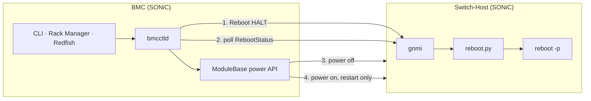
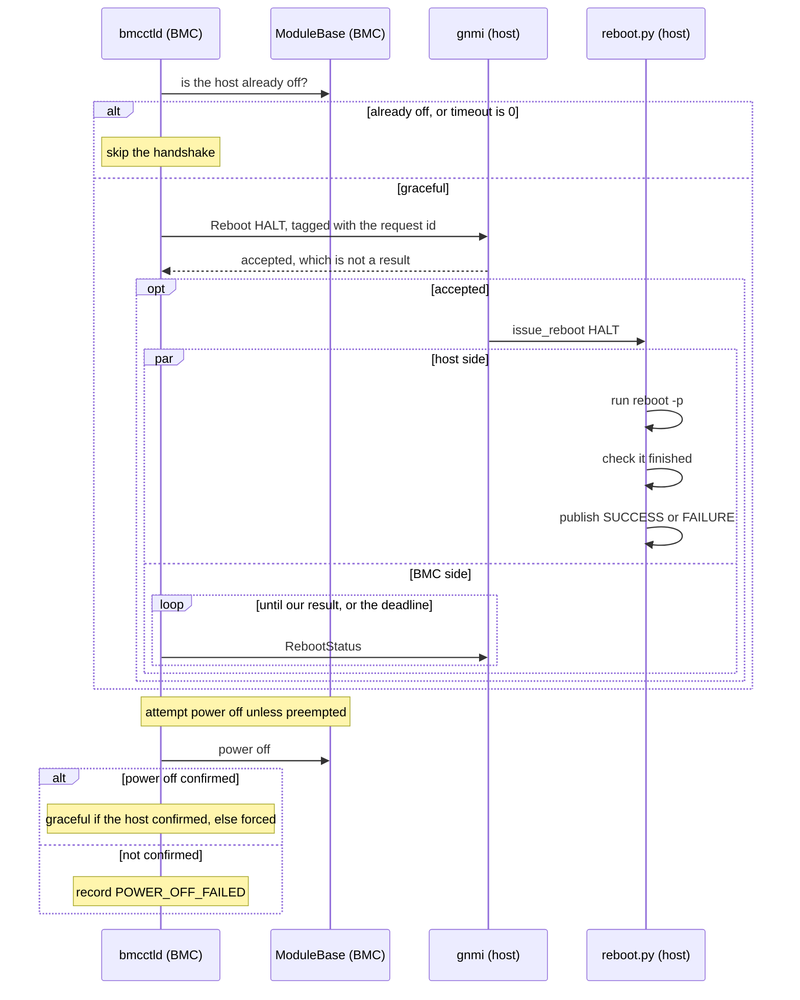
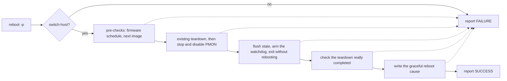
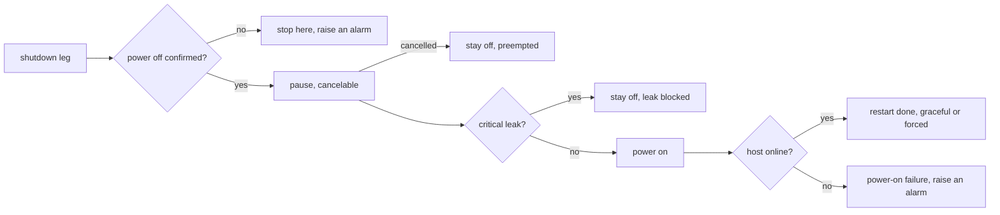
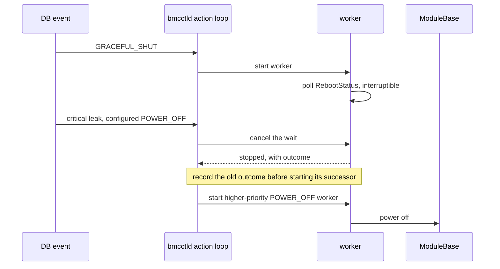

# Graceful Shutdown and Restart of the Switch-Host from BMC

## Table of Content

- [1. Revision](#1-revision)
- [2. Scope](#2-scope)
- [3. Definitions/Abbreviations](#3-definitionsabbreviations)
- [4. Overview](#4-overview)
- [5. Requirements](#5-requirements)
- [6. Architecture Design](#6-architecture-design)
- [7. High-Level Design](#7-high-level-design)
  - [7.1. Shutdown flow](#71-shutdown-flow)
  - [7.2. Host side: `reboot -p`](#72-host-side-reboot--p)
  - [7.3. Knowing the host finished](#73-knowing-the-host-finished)
  - [7.4. Timing](#74-timing)
  - [7.5. Graceful restart](#75-graceful-restart)
  - [7.6. Concurrency and preemption](#76-concurrency-and-preemption)
  - [7.7. Reboot cause](#77-reboot-cause)
  - [7.8. Failure handling](#78-failure-handling)
  - [7.9. Platform requirements](#79-platform-requirements)
  - [7.10. Security](#710-security)
  - [7.11. Serviceability](#711-serviceability)
  - [7.12. Compatibility](#712-compatibility)
  - [7.13. Considered alternatives](#713-considered-alternatives)
- [8. SAI API](#8-sai-api)
- [9. Configuration and management](#9-configuration-and-management)
  - [9.1. Manifest](#91-manifest)
  - [9.2. CLI/YANG model Enhancements](#92-cliyang-model-enhancements)
  - [9.3. Config DB Enhancements](#93-config-db-enhancements)
  - [9.4. State DB Enhancements](#94-state-db-enhancements)
- [10. Warmboot and Fastboot Design Impact](#10-warmboot-and-fastboot-design-impact)
  - [Warmboot and Fastboot Performance Impact](#warmboot-and-fastboot-performance-impact)
- [11. Memory Consumption](#11-memory-consumption)
- [12. Restrictions/Limitations](#12-restrictionslimitations)
- [13. Testing Requirements/Design](#13-testing-requirementsdesign)
  - [13.1. Unit Test cases](#131-unit-test-cases)
  - [13.2. System Test cases](#132-system-test-cases)
- [14. Open/Action items](#14-openaction-items)
- [15. References](#15-references)

### 1. Revision

| Rev | Date | Author | Change Description |
| --- | --- | --- | --- |
| 0.1 | 2026-08-12 | William Tsai | Initial version |
| 0.2 | 2026-10-01 | William Tsai | Align provisioning, timing and operation handling with the implementation |
| 0.3 | 2026-10-08 | William Tsai | Document that the switch-host pre-shutdown path does not run the platform pre-reboot hook |

### 2. Scope

On a chassis where SONiC runs on both the BMC and the switch-host, the BMC owns switch-host power. It
removes that power without telling the host, so the host cannot flush state, run any platform ordering
it needs, or record why it went down.

This design lets the BMC ask the host to prepare first, wait a bounded time, and then remove power. It
adds:

- a graceful leg to the existing `GRACEFUL_SHUT` command — ask, wait, then remove power;
- a new `GRACEFUL_RESTART` command — the same shutdown, a short pause, then power on;
- an extension of the existing critical-leak check to `POWER_CYCLE`, which is ungated today, and a
  re-read of that state under the power lock. `POWER_ON` is gated on its three other entry points already;
  the startup power-on on a non-liquid-cooled chassis is not. The re-read reaches that call site, but there
  power is raised at daemon start with no delay, so it can run before any leak publisher has written anything.
  The gap is not vacuous — the leak gate is cooling-agnostic and includes a rack-level trigger, so an
  air-cooled host in a liquid-cooled rack is the case — which is why requirement 7 is scoped to published
  state rather than claimed absolutely. Closing that window means changing when startup raises power, and that
  is not this design's change.

It is assembled from parts SONiC already ships: gNOI `System.Reboot` and `System.RebootStatus` on the
host, `reboot -p` and its existing teardown, and `bmcctld`, the BMC daemon that already owns
switch-host power. `POWER_OFF`, `POWER_ON` and `POWER_CYCLE` keep their existing semantics; what changes
around them is the leak check above, and that their oper-status verification becomes interruptible
([§7.4](#74-timing) rule 3).

**Out of scope.** Abort or cancel of a request once the host has accepted it; more than one power
operation at a time per BMC; resuming an operation across a `bmcctld` restart; BMC power-loss
resilience; traffic draining and route withdrawal, which belong to the requester; WARM and COLD host
reboots driven by the BMC; multi-ASIC and modular chassis. Existing leak-policy actions and defaults
remain unchanged. A critical trigger configured as `graceful_shutdown` still performs the graceful wait;
priority does not turn it into an immediate cut. Deployments requiring immediate power removal must
configure `power_off` for the corresponding system-leak and rack-manager policies
([§9.3](#93-config-db-enhancements)). Both critical power actions outrank ordinary requests, and
critical power-off outranks critical graceful shutdown ([§7.6](#76-concurrency-and-preemption)).

### 3. Definitions/Abbreviations

| Term | Meaning |
| --- | --- |
| BMC | Baseboard Management Controller |
| Switch-Host | The main board that hosts the ASIC and the CPU |
| PMON | Platform Monitor container |
| gNMI / gNOI | gRPC Network Management / Operations Interface |
| mTLS | Mutual TLS — both sides present and verify a certificate |
| HALT | gNOI `RebootMethod = HALT(3)`. Prepare for an external power action. It does not mean Linux reaches halt or ACPI S5 |
| Pre-shutdown | What `reboot -p` does: the reboot teardown, without the reboot. The term and the flag are already in `scripts/reboot` |

### 4. Overview

The BMC asks the host to get ready, waits, and removes power either way.

The request is a gNOI `System.Reboot` with method `HALT`, sent over mTLS on the BMC-host link. On the
host, `reboot.py` maps `HALT` to `reboot -p`, which runs the normal reboot teardown and then **exits
instead of rebooting**. That is the property the design rests on: the OS is still running afterwards,
so the host publishes its own result on `System.RebootStatus` and the BMC reads it in band. No
hardware readiness signal and no new platform API are needed.

The BMC waits for that result up to `graceful_shutdown_timeout`, then removes power. Power removal is not
conditional on the result: it runs on the normal path, on a timeout and on an RPC failure. On
preemption, the higher-priority operation owns the power action; the displaced worker does not issue
another one. A redundant shutdown already confirmed offline needs no power call. The daemon's own
death abandons the operation rather than completing it ([§7.8](#78-failure-handling)). What the
result changes is only how the operation is recorded — as graceful when the host confirmed it finished, as
forced otherwise.

SONiC already uses the same pair of RPCs between an NPU and its DPUs, so the host side of this is
proven. The BMC takes the requester role, and adds what that path does not have: mTLS instead of
plaintext, and a check that the report it reads answers its own request ([§7.3](#73-knowing-the-host-finished)).

### 5. Requirements

| # | Requirement |
| --- | --- |
| 1 | Graceful shutdown from CLI `config chassis modules shutdown` and from the Rack-Manager `GRACEFUL_SHUT` command; graceful restart from a new `GRACEFUL_RESTART` command |
| 2 | The wait is bounded by the existing `graceful_shutdown_timeout`, and power is removed when it expires. `0` means remove power immediately |
| 3 | Power removal is attempted after timeout or RPC failure. A preempting operation owns the subsequent power action; an already-off shutdown needs none. Daemon death abandons the operation ([§12](#12-restrictionslimitations)) |
| 4 | An operation is recorded as graceful only when the host confirmed it finished. Anything unproved is recorded as forced |
| 5 | A graceful reboot cause is written only after that confirmation |
| 6 | The BMC-to-host gNOI channel uses mTLS with mutual verification. A device without certificates stays forced-only |
| 7 | When the configured leak action is a power action, a critical leak preempts a wait in progress; power-raising commands are refused while a critical leak is **present in published state**. The scope matters at daemon start, where power can be raised before any leak publisher has written anything ([§2](#2-scope)) |
| 8 | The DPU `HALT` path retains its call order and timeout key, apart from the shared pre-check fixes and result-message suffix. The existing force paths keep their semantics, with interruptible oper-status verification |

### 6. Architecture Design

The SONiC architecture does not change. The feature adds no daemon, container, CLI command or gNOI
method. It adds one optional CONFIG_DB table for BMC client certificate paths; operation execution
is not persisted or resumed across daemon restarts.


```mermaid
flowchart LR
    subgraph BMC["BMC (SONiC)"]
        TRG["CLI · Rack Manager · Redfish"] --> BD["bmcctld"] --> PA["ModuleBase power API"]
    end
    subgraph HOST["Switch-Host (SONiC)"]
        GN["gnmi"] --> RP["reboot.py"] --> RB["reboot -p"]
    end
    BD -- "1. Reboot HALT" --> GN
    BD -- "2. poll RebootStatus" --> GN
    PA -- "3. power off" --> HOST
    PA -- "4. power on, restart only" --> HOST
```

*Figure 1 — The BMC asks, the host prepares and reports, the BMC removes power. A restart then powers
the host back on.*

The only new traffic on the BMC-host link is gNOI over mTLS.

| Component | Repository | Change |
| --- | --- | --- |
| `bmcctld` | sonic-platform-daemons | Send `HALT`, poll `RebootStatus`, own the power sequence, add `GRACEFUL_RESTART` and the priority handling of [§7.6](#76-concurrency-and-preemption) |
| `scripts/reboot` | sonic-utilities | Accept `-p` on a switch-host. Today the option is DPU-only |
| `host_modules/reboot.py` | sonic-host-services | Report failure when a completion check cannot be answered, carry the requester's tag on every terminal report, select the HALT timeout by device identity, and write the graceful reboot cause after the check |
| `show chassis modules status` | sonic-utilities | New status columns |
| `determine-reboot-cause` | sonic-host-services | The one display rule of [§7.7](#77-reboot-cause) |
| Certificate-path schema | sonic-buildimage | Add the optional BMC client-path model |
| mTLS material, gNMI configuration and CACL | deployment tooling | Provision credentials, authorization and management-access policy; not image boot-time DB writers |
| Redfish bridge | sonic-redfish | Map `GracefulShutdown` and `GracefulRestart`. Optional — the release can ship without it |

No new platform API is needed. Supported platforms may set the host timeout in
[§9.3](#93-config-db-enhancements). Certificate and network-policy provisioning remain outside the
image.

### 7. High-Level Design

#### 7.1. Shutdown flow

An already-off shutdown is completed by the admission guard without gNOI or another power call.
This shortcut is not used when a previous power transition has an uncertain outcome. The diagram
below describes the worker flow; a host found offline after admission still receives the power-off call.


```mermaid
sequenceDiagram
    participant B as bmcctld (BMC)
    participant M as ModuleBase (BMC)
    participant G as gnmi (host)
    participant R as reboot.py (host)
    B->>M: is the host already off?
    alt already off, or timeout is 0
        Note over B: skip the handshake
    else graceful
        B->>G: Reboot HALT, tagged with the request id
        G-->>B: accepted, which is not a result
        opt accepted
            G->>R: issue_reboot HALT
            par host side
                R->>R: run reboot -p
                R->>R: check it finished
                R->>R: publish SUCCESS or FAILURE
            and BMC side
                loop until our result, or the deadline
                    B->>G: RebootStatus
                end
            end
        end
    end
    Note over B,M: attempt power off unless preempted
    B->>M: power off
    alt power off confirmed
        Note over B: graceful if the host confirmed, else forced
    else not confirmed
        Note over B: record POWER_OFF_FAILED
    end
```

*Figure 2 — The host produces its result on its own schedule; the BMC polls on its own.*

#### 7.2. Host side: `reboot -p`

`reboot.py` maps `HALT` to `sudo reboot -p`. The `-p` option already exists and already means
pre-shutdown; it is currently rejected on anything that is not a DPU, and this design allows it on an
identified switch-host. The existing teardown order and vendor branches are retained; the switch-host
pre-shutdown path adds failure checks and does not run the platform pre-reboot hook.

The switch-host `-p` path bypasses the SmartSwitch helper's DPU reboot legs. The existing DPU path
keeps its call order and `dpu_halt_services_timeout`; the switch-host completion check uses its own
timeout key ([§9.3](#93-config-db-enhancements)).


```mermaid
flowchart LR
    S["reboot -p"] --> G{"switch-host?"}
    G -- "no" --> F["report FAILURE"]
    G -- "yes" --> P1["pre-checks: firmware schedule, next image"]
    P1 --> P2["existing teardown, then stop and disable PMON"]
    P2 --> P3["flush state, arm the watchdog, exit without rebooting"]
    P3 --> P4["check the teardown really completed"]
    P4 --> P5["write the graceful reboot cause"]
    P5 --> OK["report SUCCESS"]
    P1 -.-> F
    P2 -.-> F
    P3 -.-> F
    P4 -.-> F
    P5 -.-> F
```

*Figure 3 — A failed required step produces FAILURE, and the BMC removes power anyway.
Platform pre-check and next-image verification failures propagate immediately.*

**A failed pre-shutdown is not repaired.** There is no rollback and no retry. PMON is not restarted,
whatever was already flushed stays flushed, and the host is not returned to a serving state — it
reports `FAILURE` and stops where it is. The BMC then does exactly what it does on a timeout: remove
power, and record the operation as forced. This is deliberate. Once a teardown has begun the only two
useful end states are powered off, which the BMC brings about on every outcome it handles
([§7.8](#78-failure-handling)), or rebooted by the watchdog; trying to
nurse a half-torn-down host back into service would add failure modes to the one path that has to stay
simple. In the case where a pre-check refuses before the teardown starts, the host is untouched and
the cut is simply no gentler than today's — that is the floor this feature never goes below, not a
regression.

**PMON must stop** because its daemons keep reading and writing platform devices — sensors, I2C and
CPLD, fans, transceivers. Leaving them active while an external power sequence runs is what this
feature has to avoid.

**What the teardown does is platform-dependent.** On most platforms it asks the ASIC to shut down
with `syncd_request_shutdown --cold`; some ASIC types skip that step entirely. The design does not
change any of it, and does not depend on which branch a platform takes — but a platform is qualified
only if its teardown leaves the ASIC safe to lose power ([§7.9](#79-platform-requirements)).

**The reporting path survives the teardown.** `database`, `gnmi`, `sysmgr` and `sonic-hostservice` keep
running, which is what lets the host answer the BMC's poll after its own teardown is done. The path is
longer than the RPC suggests: `gnmi` terminates the RPC, `sysmgr` carries it inward, and
`sonic-hostservice` holds the published report — so the last of the four is the one that actually owns
the answer, and losing it is what makes an operation unattributable.

Nothing on that path is coupled to `syncd` today: no unit declares a dependency that would carry a `syncd`
stop into it, and `gnmi`'s only relation is an `After=`, which orders and nothing more. That is a reading of
the current tree rather than a guarantee, which is why the platform assertion is a property of the rendered
image and the test exercises it on hardware ([§7.9](#79-platform-requirements),
[§13.2](#132-system-test-cases)).

`swss` is why inspecting the unit files would not settle it. It declares nothing about `syncd.service`, yet
its `ExecStart` waits on a container watch over `syncd`, so a `syncd` container that goes away can end
`swss` too — coupling that no unit file shows. The teardown does not take that container away, so `swss`
runs on to the cut, with or without an ASIC beneath it depending on whether the platform's teardown shut one
down. Neither costs anything while power is about to go.

**The host never removes its own power.** On the switch-host pre-shutdown path, `reboot -p` requests
a 180-second watchdog and requires a successful readback of at least 180 seconds. It cannot rely on
the utility's exit status alone. Once armed, the watchdog can reboot a host left powered; a failure
before the arm has no such recovery guarantee. Rejecting a short readback fails pre-shutdown;
it does not disarm an already-running watchdog.

`scripts/reboot` runs `<platform>/pre_reboot_hook` on every reboot if it is executable. The hook
prepares the device for the reboot that follows — on some platforms it programs firmware — and its
failure is logged and ignored. **On the switch-host pre-shutdown path only**, the hook is not run:
the path ends in external power removal rather than a reboot, and firmware programming must not
start when power is about to be removed. Other reboot paths keep today's behaviour. A vendor step
that touches a device another daemon also drives has to stop that daemon itself; the host stops
only PMON.

**Where vendor differences belong.** `scripts/reboot` already branches on platform attributes — it
stops an extra container on one subtype, and skips the ASIC request on some ASIC types — and the
switch-host pre-shutdown runs that same body. A vendor that has to stop a service the common path
leaves running, or sequence something differently, adds its branch there rather than anywhere in this
design; nothing here needs to change to accommodate it. Two constraints apply to such a branch: it
must not stop anything on the reporting path above, `sonic-hostservice` included, and it must be
bounded, because it spends the BMC's timeout.

#### 7.3. Knowing the host finished

Power removal never waits on this. The only question is how the operation is recorded.

`RebootStatus` reports the host's most recent reboot request, whoever made it and with no per-requester
state, so the BMC has to establish that the report answers its own request. It does that positively,
with a tag, and not by inference.

The BMC puts the operation's request id in the request's `message`. The host already echoes that message
back while the reboot is active; this design also carries it on **every terminal report**, appended to
the existing result string rather than replacing it. Appending is what keeps today's DPU requesters
working: one matches `reboot complete` as a substring of the whole client output, the other reads only
the active flag. `reason` is a free-form string, so no proto change is needed — and adding a field would
be worse, because the gNOI server unmarshals the response strictly.

**The id is a freshly generated UUID**, providing collision-resistant correlation without persistent
state. A per-run counter is insufficient: the acceptance the BMC holds is the reboot backend's,
returned as soon as it has spawned its worker, while the host replaces its report later inside that
worker's call — so a poll can land in between and read the previous operation's report, and a
per-run counter repeats an id after a restart
([§7.8](#78-failure-handling) does not persist an id counter).

Graceful is recorded only on the conjunction of **five** conditions: the tag extracts exactly and equals this
operation's, the report is terminal, the method is `HALT`, the status is `SUCCESS`, **and the status message
is empty**. Everything else is forced. The tag is delimited so that extraction is exact: it is appended to a
free-form string, and a bare match could take a shorter id out of a longer one.

The fifth condition exists because a report can come from the reboot backend rather than the host, and still
carry the tag: the backend seeds its own state from the request and its failure paths replace only the status
message. Those answers say nothing about the host — in several of them the host never received the request —
so without that condition they would be filed as `check_failed`. The status enum cannot tell them apart,
because the host publishes the same failure status on its own paths; the message can, because the host always
leaves it empty and the backend fills it in on the paths that matter. That premise is a platform assertion
rather than an observation ([§7.9](#79-platform-requirements)).

Three events end the wait and nothing else does: a terminal report carrying our tag, an RPC failure, or the
deadline. An untagged terminal report does not end it — acting on one is the inference this design discarded,
and it let a report from an earlier operation finish a wait early.

Anything unattributable is forced, and the two refusals arrive differently. The backend refusing a second
request while one is in flight is synchronous, so it reaches the BMC as an RPC error. The host's own
*"Previous reboot is ongoing"* is not: the outer `Reboot` has already succeeded, so it comes back as the
status message of a terminal tagged report and is classified by origin like any other backend answer. Either
way the BMC stops trying to prove gracefulness and removes power. A restart of `sonic-hostservice`, which owns
the report, has the same effect.

Liveness of that service is necessary but not sufficient: the report also has to be *forwarded*. The backend
forwards `RebootStatus` to the host only while it treats the halt as in progress, and gives up after a fixed
wait for a platform that never halts — which on this path is every platform. After that the host's report is
unreachable however healthy the host is, which is the 260 s ceiling in rule 1 of [§7.4](#74-timing).

`HOST_STATE|switch-host.op_result` distinguishes the following terminal outcomes:

| Result | Meaning |
| --- | --- |
| `SUCCESS_GRACEFUL` | The host confirmed pre-shutdown, and the requested power sequence completed |
| `SUCCESS_FORCED` | The requested power sequence completed without host confirmation, or a shutdown was already satisfied |
| `SUCCESS` | A plain power operation completed or was already satisfied |
| `POWER_OFF_FAILED` | The power-off call failed or offline status was not confirmed |
| `POWER_ON_FAILED` | The restart, power-on or power-cycle operation did not complete its power-raise leg |
| `OFF_LEAK_BLOCKED` | Published critical leak state blocked a power raise |
| `PREEMPTED` | A higher-priority operation displaced this operation |
| `ABANDONED` | The operation ended without a result, including daemon restart recovery |

Each is written to `HOST_STATE|switch-host` and to the BMC event log, together with the reason a
graceful shutdown ended up forced ([§7.11](#711-serviceability)).

A confirmed pre-shutdown means the teardown ran to the end and PMON is stopped. It does not mean
Linux stopped, and it is only as strong as the checks the host performs — today the script ignores the
result of the ASIC request and of the flush, so those become checks this design adds rather than
guarantees it inherits. The host is ready to lose power, not shut down.

#### 7.4. Timing

| Parameter | Value | Source |
| --- | --- | --- |
| `graceful_shutdown_timeout` | Default and missing/unparseable-value fallback: 120 s; explicit 0 means forced-only | Existing BMC CONFIG_DB field; operator values are preserved. Bounds the handshake, not the complete power operation |
| Pre-shutdown duration | Per-platform measurement | Must fit the selected graceful timeout |
| Reboot-backend halt wait | `260 s` | Existing `sonic-sysmgr` constant, compiled into the *host* image. After it the host's report is unreachable — the ceiling in rule 1 |
| Residual completion check | `switch_host_halt_services_timeout`, default 60 s; no fallback to the DPU key. Completes immediately when satisfied, otherwise polls every 5 s | Host `platform.json`; the window starts after `reboot -p` succeeds, not before teardown |
| Watchdog | Request 180 s; require a successful readback of at least 180 s | Fixed for switch-host pre-shutdown only |
| `RebootStatus` poll interval | 1 s | Fixed; each RPC is also bounded by the remaining handshake time |
| Restart pause | 10 s | Fixed, cancelable power-off pause |
| Leak response bound | Per platform | It preempts any wait, but not a call already running (rule 3) |

Three rules have to hold, and measurement on real hardware settles all three:

1. **The BMC's timeout is the binding one, and it serves two different requirements.** Only the first of
   them gates the feature working at all:

   ```
   (a) success reportable    request + pre-shutdown + poll allowance + polling  <  graceful_shutdown_timeout
   (b) failure reportable    request + pre-shutdown + residual bound + polling  <  graceful_shutdown_timeout
   and in both cases                                                               graceful_shutdown_timeout  <  260 s
   ```

   The host runs `reboot -p` to completion in a blocking call and fetches its own completion-check timeout
   only after that call returns, so the teardown is spent while the BMC polls and nothing has been reported
   yet. Anything unbounded in the teardown therefore spends the BMC's timeout, which is why
   [§7.2](#72-host-side-reboot--p) requires a vendor branch on this path to be bounded.

   **(a)** is the precondition. It carries a poll allowance rather than the residual bound, because on a
   completed teardown the host's check normally passes on its first pass; the allowance covers the case where
   PMON's container is not yet observably stopped when the window opens. It is small and unmeasured — a term
   to size, not one to assume away. **(b)** is a goal. If completion cannot be confirmed after the script
   returns, the host can spend the residual bound before publishing `FAILURE`.
   Missing (b) does not break the feature — those branches record forced either
   way — it costs the *reason*, since a report arriving after the deadline is recorded `deadline` rather than
   what the host said.

   The ceiling is not ours: it is the reboot backend's fixed halt wait
   ([§7.3](#73-knowing-the-host-finished)). The two clocks share no origin and neither side can order them, so
   **the BMC establishes its deadline before it sends `Reboot`** and charges the request and every poll to that
   one deadline, capping each RPC by what remains; without a pre-send origin the ceiling is not enforceable.
   The daemon and CLI default to **120 seconds**. Existing values, including 0, are preserved.
   The CLI accepts nonnegative integers without an upper bound; these inequalities qualify a
   deployment's selected value, not every value the CLI accepts.
2. **Power has to be removed before the watchdog fires.** Otherwise the host reboots in the middle of
   the power sequence. The watchdog is armed near the end of the pre-shutdown, not when the operation
   starts, so the quantity that has to hold is:

   ```
   accepted timeout + polling + power-off latency + margin  <  effective watchdog timeout
   ```

   Neither side can evaluate that alone — the BMC owns the left, the host reads the right — which is why
   the host verifies an effective watchdog value of at least 180 seconds and deployment qualification
   checks this inequality. The watchdog minimum is not a platform.json knob.
   Only the value the platform actually returns counts as evidence.
3. **A critical leak present in published state has to reach the power domain within the platform's leak
   bound**, when the
   configured leak action is a power action at all — `syslog_only` is a valid setting and takes none.
   The graceful wait becomes interruptible, and so must the oper-status polls that already follow every
   power call today: up to 60 s after `set_admin_state`, and up to 120 s after `do_power_cycle()`.
   `do_power_cycle()` itself is a single platform call that cannot be interrupted, so a leak arriving
   during it is served only when it returns — which is why graceful restart does not use it
   ([§7.5](#75-graceful-restart)). A critical trigger configured as `graceful_shutdown` can wait for
   the full timeout. Deployments requiring an immediate cut must select `power_off`; this feature
   does not remap the configured action.

`graceful_shutdown_timeout` also bounds the shutdown leg of a graceful restart; no second timeout is
added. Neither the CLI request nor the Rack-Manager command row carries a per-request timeout — the
value is per-device configuration ([§9.3](#93-config-db-enhancements)).

#### 7.5. Graceful restart


```mermaid
flowchart LR
    Q["shutdown leg"] --> CC{"power off confirmed?"}
    CC -- "no" --> PF["stop here, raise an alarm"]
    CC -- "yes" --> DW["pause, cancelable"]
    DW -- "cancelled" --> ST["stay off, preempted"]
    LK{"critical leak?"}
    DW --> LK
    LK -- "yes" --> SY["stay off, leak blocked"]
    LK -- "no" --> ON["power on"]
    ON --> V{"host online?"}
    V -- "yes" --> OKR["restart done, graceful or forced"]
    V -- "no" --> FL["power-on failure, raise an alarm"]
```

*Figure 4 — Power off, pause, then power on, with the leak checked immediately before powering on.*

`GRACEFUL_RESTART` powers off and powers on as two separate steps rather than calling the existing
`do_power_cycle()`. `do_power_cycle()` cannot be interrupted, so a leak or a `POWER_OFF` arriving
during it can be neither preempted nor honoured in time. Doing it in two steps leaves a point in
between where the BMC re-reads the leak state, under the same lock that serialises the power calls, so no
*published* critical leak already present is missed. It does not make the raise itself
interruptible: a leak arriving after the
check waits for `set_admin_state()` to return — a shorter window than `do_power_cycle()`'s, but not an
absent one ([§12](#12-restrictionslimitations)). `POWER_CYCLE` keeps using `do_power_cycle()` unchanged.

A restart does not modify `admin_status`. Its success uses the platform's `ONLINE` indication;
this is not a separate check that the OS and management services have finished booting.

#### 7.6. Concurrency and preemption

Priority belongs to the operation, not to where the request came from, so a CLI request and a
Rack-Manager request of the same kind rank the same.

| Priority | Operation |
| --- | --- |
| Highest | Anything triggered by a **critical** leak, whatever action is configured for it |
| | `POWER_OFF` |
| | `GRACEFUL_SHUT` |
| | `GRACEFUL_RESTART`, `POWER_CYCLE` |
| Lowest | `POWER_ON` |

The top row ranks on the **trigger's severity**, not on the configured action, so that a critical leak set to
`graceful_shutdown` ([§9.3](#93-config-db-enhancements)) still outranks a shutdown in flight instead of being
refused as busy. Within that row the action decides: a direct power off displaces a critical leak's graceful
wait, since the two critical policies are independent and either may fire first. Below it, nothing ranks on
its trigger.

A higher-priority operation displaces the one in flight. Otherwise, an identical action joins the
operation already running and shares its id and result, including duplicate critical actions from
different event sources. A conflicting equal- or lower-priority action is refused as `BUSY`, not
retained for later execution or retried automatically. Displacement has a third
outcome: when the operation in flight is inside a call that cannot be cancelled, the higher-priority one
is deferred until that call returns rather than taking effect at once.

The wait already exists today and it blocks. `GracefulShutdownHandler.execute()` polls the host's
oper-status with a plain sleep, inside
[`_run_action_loop()`](https://github.com/sonic-net/sonic-platform-daemons/blob/630677528db95b20ada0cb94bbb198a2929428bc/sonic-bmcctld/scripts/bmcctld#L1294-L1306) —
the single sequential consumer of the action queue — so nothing else queued runs until it returns, a
leak-triggered power off included. Events are safe meanwhile: they arrive on a separate thread that keeps
enqueuing.

So the operation body moves to a worker thread and the sleep becomes a wait that ends **on demand rather than
at the next poll**. It ends on exactly the three events [§7.3](#73-knowing-the-host-finished) names, plus a
cancellation from the action loop. The displaced worker stops, and the higher-priority operation owns
the next power action. The graceful polling wait no longer blocks the queue's consumer.


```mermaid
sequenceDiagram
    participant S as DB event
    participant D as bmcctld action loop
    participant W as worker
    participant M as ModuleBase
    S->>D: GRACEFUL_SHUT
    D->>W: start worker
    W->>W: poll RebootStatus, interruptible
    S->>D: critical leak, configured POWER_OFF
    D->>W: cancel the wait
    W-->>D: stopped, with outcome
    Note over D,W: record the old outcome before starting its successor
    D->>W: start higher-priority POWER_OFF worker
    W->>M: power off
```

*Figure 5 — How a higher-priority request stops a wait already in progress.*

Two rules keep this safe. The action loop alone acts on priority and records the outcome, so a worker
that was already displaced cannot write over its successor's result. And every power call takes one
lock, held only for the platform call itself, so power calls never overlap; a call that raises power
re-checks the leak state after taking that lock.

Priority is *derived* where the request is admitted and *carried*, not re-derived where it runs. It has to
be: the queued item records the action and a free-form description, and while that description does name the
trigger today, a log string is not a contract — an executor branching on the action alone cannot tell a
critical leak's shutdown from an ordinary one, and nothing stops the wording
changing. So an admitted request carries an immutable priority, computed from the trigger while the
severity is still in hand, and that one value decides both displacement and the guard exemption below. The
severity itself need not survive the queue; the bit derived from it must. It is derived from **either**
critical trigger — a critical system leak and a critical rack-manager alert already gate the existing power
commands identically, and the exemption must not turn on which of the two a leak arrived through.

One existing guard has to give way to this. Today a queued shutdown is skipped — and reported successful —
on three conditions: the host reads `OFFLINE` live, or the recorded power state is `POWERING_OFF`, or it is
`GRACEFUL_SHUTTING_DOWN`, which is exactly the state a graceful shutdown writes before it starts waiting.
The recorded-state conditions apply only while the writing operation has no terminal result.
The guard covers the graceful action as well as the power off, so exempting only a power off would not be
enough. And preemption is the wrong test: the guard exists to swallow a **redundant repeat**, and a
critical-leak action is never one *while power is still on*. The guard's three conditions split exactly along
that line — one reads the live oper-status, two read a recorded transition — so the rule is: **a critical-leak
action is exempt from the two recorded conditions and not from the live one.** A direct power off arriving
against a graceful shutdown's transitional state is therefore exempt and displaces it; a second critical action
arriving once the host actually reads offline is the redundant repeat the guard exists for, and is absorbed.
Live `OFFLINE` is not sufficient after an unconfirmed power-off or a preempted power-on/power-cycle:
those transitions leave power uncertain, so an admitted shutdown still makes its power-off call.
Nothing here needs to count actions or track an episode.

The exemption belongs **at the guard**, not in the action loop, because the guard has a second caller: the
drain loop that keeps serving the queue during the boot delay, which on a liquid-cooled host runs *before* the
action loop starts and is the only consumer for as long as that delay lasts. Displacement has to reach that
window too — the delay is long enough for a shutdown to start a wait inside it — so the drain loop shares the
action loop's priority handling rather than only its execution.

Preemption stops the BMC's own waiting, and that is its whole scope. **A call already running is not
displaceable** — there is no cancellation point inside one, and a cancellation is observed only between
calls. Three such calls sit on these paths: `do_power_cycle()`, the `set_admin_state()` that raises power
on a restart, and the gNOI RPC itself, which runs under its own deadline. Each bounds how late a
higher-priority request can take effect, each has to fit the platform's leak bound
([§12](#12-restrictionslimitations)), and for the two power calls the lock deliberately keeps a second
call off the same rail until the first returns. Preemption also does not undo the host's pre-shutdown,
because there is no way to undo one, and it never sends `CancelReboot`. Since `POWER_ON` is the lowest
priority, it cannot displace a shutdown; an operator powers a host back on after the shutdown reports its
result.

#### 7.7. Reboot cause

The host writes the software reboot cause, from a fixed set of strings, only after its own completion
check passes. The platform records the hardware cause on the next boot.

The guarantee is one-way: a graceful cause means the pre-shutdown really completed. If the write fails
the host reports failure, and the BMC removes power and records the operation as forced.

The hardware cause takes precedence when both are present, which would hide the graceful string. So
`determine-reboot-cause` gains one narrow rule: a graceful software cause together with the
BMC-power-down hardware cause displays the graceful cause. The rule keys on that cause by name, and for
it to be separable the cause has to be a distinct *major* cause rather than a minor under
`REBOOT_CAUSE_POWER_LOSS` — `determine-reboot-cause` flattens major and minor into one string and matches
substrings, so a minor would make a generic power loss indistinguishable. Naming the constant is part of
landing Reference 9.

#### 7.8. Failure handling

An unfinished operation is marked `ABANDONED` at `bmcctld` startup, not resumed. The recorded power
state is refreshed from the live platform status; the last operation record remains for diagnosis.
If `device_status` is unavailable, the startup power-state label is not proof that power is off.

Recovery can come from a requester re-issuing, a newly published leak event, or the host's verified
watchdog. A persistent leak does not guarantee another event; sensor publication is not an automatic
retry mechanism. Re-issuing is not immediate, though:
a second `Reboot` is refused for the whole of the reboot backend's halt wait, so within that window a
retried graceful attempt records `rpc_failure` ([§7.11](#711-serviceability)) and the operator meets the
260 s ceiling from the other side. Two cases need an operator, and they differ in what is left. One is
the daemon's own death: nothing
removes power, and the watchdog is the only remaining path — absent by construction if the host hung before
the arm. The other is narrower than it looks — the arm sits near the end of the pre-shutdown, and at least one
existing exit path leaves `reboot -p` after the teardown but before the arm, so a single orderly failure can
leave a torn-down host with no watchdog; there the BMC does remove power, and what does not hold is the
automatic return to service.

A power-off failure leaves `device_power_state` transitional on purpose: the real power state is
unknown, so claiming either stable state would be wrong. It is recorded as `POWER_OFF_FAILED`,
without automatically retrying the power call. A graceful restart stops before its power-on leg.

An unexpected worker error during the graceful handshake still leads to one power-off attempt unless
preempted. Recovery never repeats an issued power call or continues a restart's power-on leg.

#### 7.9. Platform requirements

A supported pair is identified by the existing `is_switch_bmc()` and `is_switch_host()` helpers;
there is no additional `bmc_pairing` flag. Platform qualification must confirm that:

- `set_admin_state(down)` removes power from exactly this host;
- the teardown `reboot -p` performs on this platform leaves the ASIC safe to lose power;
- nothing on this path starts firmware programming; the platform pre-reboot hook is not run there
  ([§7.2](#72-host-side-reboot--p));
- on the rendered image, `syncd` ending leaves the reporting path — `database`, `gnmi`, `sysmgr`,
  `sonic-hostservice` — serving. What has to hold is the effective graph, drop-ins and scripted container
  watches included, not a list of unit-file directives;
- no vendor branch stops one of those four, `database` among them, since `gnmi` and
  `sysmgr` require it and it carries the path with them;
- the BMC covers thermal and leak protection for the whole interval where PMON is stopped. On a
  liquid-cooled chassis its leak publishers are also producing state before power is raised; on an air-cooled
  one that window is accepted rather than covered (requirement 7's scope, [§2](#2-scope));
- the watchdog's effective timeout can be read back and outlasts the remaining timeout (rule 2 of
  [§7.4](#74-timing));
- it ships no `platform_reboot_pre_check`, or one whose failure the fixed script propagates
  ([§12](#12-restrictionslimitations));
- its host image leaves the reboot report's status message empty, which is what distinguishes a host answer
  from a backend one ([§7.3](#73-knowing-the-host-finished));
- its `switch_host_halt_services_timeout` is sized for this host rather than inherited from a DPU setting
  ([§9.3](#93-config-db-enhancements)). Rule 1(b) is *not* asserted here: it decides whether a failed
  pre-shutdown is diagnosable, not whether the feature is safe to enable, so reason accuracy is best-effort
  where a platform cannot meet it;
- the pre-shutdown duration, the power-off latency and the leak bound have been measured.

These properties vary between platforms of the same vendor, so qualification is per platform.
Provisioning explicitly sets the graceful timeout to 0 until qualification and transport setup are
complete; the daemon's 120-second default is not an enablement approval.

The power operations use `set_admin_state()`, `get_oper_status()` and `do_power_cycle()`; on top of
those `bmcctld` already needs `get_all_modules()`, `get_type()`, `is_liquid_cooled()`,
`get_description()` and `get_serial()` to find and describe the switch-host at all. Where
`get_oper_status()` reports the last command rather than sensed power, "confirmed" means the command
was accepted — this design cannot detect a rail that ignored it.

#### 7.10. Security

The BMC already owns host power physically. What is new is the network path that carries the request.
No new RPC is added: the existing gNOI `System` service becomes reachable with client authentication
on supported deployments, protected by mTLS with mutual verification, CN-to-role authorization on the
gNMI server, and a CACL rule that limits the gNMI port to the BMC-link address.

Deployment installs the certificate files, gNMI authorization and complete CACL policy. The image
does not seed these DB rows or ship private keys. BMC client paths are configurable in
`BMC_GNOI|certs`; switch-host server paths use the existing `GNMI|certs` configuration (§9.3).

One gap gates enablement, and it is wider than per-module. Authorization is not per module: nearly every call
site authorizes against a **single `gnoi` target** with the role matched by prefix and a read-only,
read-write or no-access postfix. So one role spans the whole gNOI surface — including `OS`, `File`,
`Containerz` and FactoryReset — and most of gNSI with it, certificate and authorization policy included; only
Credentialz sits behind a target of its own. This design needs two RPCs out of all that.

Two parts of that surface are not gated by the role at all. A certificate whose roles include none matching
the `gnoi` target is refused only on calls classified as *writes* — and the read-classified set is not
read-only work: it includes file put and remove, OS install, factory reset and all three gNSI rotations. So
what the gap admits is unauthorized **mutation**, not read breadth. Separately, one `Healthz` handler performs
no authorization at all, reached under mTLS and the CACL alone. This design's
own two RPCs are both write-classified, so it is not a beneficiary of either gap — the point is what a role
issued for it would also unlock.

Either a security review accepts that breadth for the BMC-link CA, or per-RPC authorization lands in
`sonic-gnmi` — a larger change than "per module" would have implied, because the granularity has to be
introduced rather than narrowed. Until then, deployment must explicitly keep the graceful timeout at 0.

#### 7.11. Serviceability

No new counters. Every operation is recorded in `HOST_STATE|switch-host` and in the BMC event log with
its request id, trigger, outcome, and — when a graceful shutdown ended up forced — why:

The admission guard can complete an already-off shutdown before the handshake starts. Within the
handshake, qualification and timeout checks precede the RPC; reports are classified as follows:

| # | Reason | Condition |
| --- | --- | --- |
| 1 | `not_qualified` | Switch-BMC identity is absent, a client path is invalid, or selected certificate files are missing/empty. No request sent |
| 2 | `timeout_zero` | `graceful_shutdown_timeout` is `0`. No request sent |
| 3 | `already_off` | The guard skips a redundant shutdown, or an admitted worker finds the host offline. Neither sends gNOI; only the latter still attempts power-off ([§7.1](#71-shutdown-flow)) |
| 4 | `preempted` | A higher-priority operation displaced this one |
| 5 | `rpc_failure` | The `Reboot` or a poll returned an error rather than a response — gNOI unreachable, TLS failure, the reboot backend's synchronous refusal of a second request, or an RPC that never resolved |
| 6 | `backend_answered` | A terminal report whose *status message is non-empty*, so the reboot backend answered from its own state rather than forwarding. This is also where the host's own *"Previous reboot is ongoing"* lands, because that refusal comes back as a status message and not as an RPC error ([§7.3](#73-knowing-the-host-finished)) |
| 7 | `check_failed` | A terminal report from the host — empty status message — that is not a success. It covers both a pre-shutdown that ran and could not be proved complete and one that never started, since a refused `reboot -p` reports the same way |
| 8 | `deadline` | No terminal report *carrying our tag* before the deadline. Untagged, mismatched and permanently active reports do not end the wait ([§7.3](#73-knowing-the-host-finished)) |
| 9 | `unclassified` | Anything else. The rows above are not provably total, so the table has a floor rather than an implied one; a record landing here is a defect to investigate |

Rows 6 and 7 are evaluated against the report that ended the wait, and their order is the part that matters:
origin before verdict, so a backend answer is never read as a statement about the host. There is no
attribution row above them because there cannot be one — only a report carrying our tag ends a wait, so
everything unattributable reaches the deadline instead.

Collecting those records off the device answers how often graceful ended up forced, and why. A counter
would give the rate without the reason.

#### 7.12. Compatibility

Both BMC and switch-host images must implement this design. Old or mixed pairs are not supported;
no compatibility probe or feature-enable flag is added. The BMC image must supply the gRPC/gNOI
client dependencies.

On a supported pair, missing credentials or an explicit timeout of 0 skips the handshake and uses
forced power-off. Runtime TLS/RPC failures and a tagged host failure also take the forced path.

#### 7.13. Considered alternatives

| Alternative | Why not |
| --- | --- |
| ACPI soft-off, or asserting the power button | No new security surface, which is attractive. But the host ends up powered off and silent, so the BMC learns that power dropped and nothing else. It also cannot carry the reboot-cause tag. Worth revisiting if the platform gains an out-of-band readiness signal carrying the same evidence |
| The host removes its own power once ready | Kills the reporting path, which then has to be replaced by vendor hardware evidence and new platform APIs |
| A separate daemon to hold the wait | `bmcctld` already owns switch-host power; a second process would exist only to hold a timer |
| `do_power_cycle()` for graceful restart | [§7.5](#75-graceful-restart) |
| A dedicated thread that powers off for a leak, outside the action loop | It either takes the power lock, and then waits for `do_power_cycle()` exactly as the queued action does, or it bypasses the lock — which is worse than waiting. Some platforms implement the cycle as power off, sleep, power on in the driver, so its second half would raise power again *after* the leak's power off. Others issue a single firmware trigger and return at once, so there was never anything to race |

### 8. SAI API

No SAI change. This feature adds and uses no SAI API and no SAI object, and it does not touch the data
plane.

### 9. Configuration and management

#### 9.1. Manifest

Not applicable. This is a built-in feature, not an Application Extension.

#### 9.2. CLI/YANG model Enhancements

No new command. `config chassis modules shutdown|startup` is already the entry point and
`config chassis modules shutdown-timeout` keeps accepting nonnegative integers without an upper bound.
The default is 120 seconds; 0 requests forced-only behavior. Accepting a value does not establish that
it meets the platform's watchdog and backend timing budgets ([§7.4](#74-timing)).
`show chassis modules status` on the BMC gains `RESULT` and `REQUEST-ID` columns;
existing columns and their order do not change.

```
bmc$ config chassis modules shutdown SWITCH-HOST
bmc$ show chassis modules status
  Name         Description  Oper-Status  Admin-Status  Serial   Power-On-Delay (sec)  Shutdown-Timeout (sec)  Result            Request-Id
  SWITCH-HOST  Switch Host  Online       down          SN12345  0                     120                     -                 3f2b1c8a-...-9d41
  SWITCH-HOST  Switch Host  Offline      down          SN12345  0                     120                     SUCCESS_GRACEFUL  3f2b1c8a-...-9d41
host (next boot)$ show reboot-cause
  graceful shutdown from BMC
```

`GRACEFUL_RESTART` has no CLI verb in this release; it arrives as a Rack-Manager command or over
Redfish. From the CLI the same result is `shutdown`, then `startup`.

`sonic-bmc-gnoi.yang` models the optional BMC certificate paths. `sonic-utilities`
`doc/Command-Reference.md` documents the new columns and timeout behavior.

#### 9.3. Config DB Enhancements

No new mandatory field. Existing BMC power-policy fields are retained:

```
CHASSIS_MODULE|SWITCH-HOST
    admin_status              = up|down     ; existing
    graceful_shutdown_timeout = <secs>|0    ; default 120; 0 = forced; no upper bound
LEAK_CONTROL_POLICY|policy
    ; No field added and no default changed. The fields, their value sets and their
    ; defaults are defined in sonic-leak-control.yang and are not restated here —
    ; note bmcctld keeps its own fallback constants for an absent row, tracking
    ; those defaults, so both copies have to agree.
    ; What matters to this design is which of them can select 'graceful_shutdown':
    ;
    ;   on a CRITICAL trigger  — system_critical_leak_action, rack_mgr_critical_alert_action
    ;                            waits when graceful; use power_off for an immediate cut
    ;   otherwise              — system_minor_leak_action, rack_mgr_minor_alert_action
    ;                            (the latter also serves MAJOR); the intended home for it
```

The action policy is described in [§2](#2-scope). **The defaults differ**, and this design changes neither — only
`system_critical_leak_action` defaults to a power action, so an unconfigured critical rack-manager alert takes
none.

The BMC adds one optional CONFIG_DB singleton, `BMC_GNOI|certs`:

| Field | Default when absent |
| --- | --- |
| `ca_crt` | `/etc/sonic/bmc-link/ca.crt` |
| `client_crt` | `/etc/sonic/bmc-link/client.crt` |
| `client_key` | `/etc/sonic/bmc-link/client.key` |

These are absolute paths, not certificate contents; files must be visible inside PMON. Each absent
field uses its default; an explicitly invalid path or a missing/empty file causes forced-only operation, without
trying another credential. Paths are read once per operation, so changes apply to the next operation
without a daemon restart. Deployment installs the files and persists any configured paths.

The switch-host `platform.json` gains one optional key:

```
switch_host_halt_services_timeout = <secs>    ; positive integer; default 60 seconds
```

Timeout selection follows device identity: switch-host first, then SmartSwitch or DPU. A switch-host
reads only `switch_host_halt_services_timeout`; SmartSwitch and DPU retain `dpu_halt_services_timeout`.
A missing or invalid selected value uses 60 seconds, never the other role's key. This timeout bounds
the completion check after `reboot -p`, not the teardown itself.

On the switch-host, deployment configures the existing `GNMI|certs`, `GNMI|gnmi` and
`GNMI_CLIENT_CERT` rows for server certificate paths, client authentication and authorization.
Certificate files and CACL policy are provisioned at deployment, not through image-side DB seeding.
The BMC's optional `bmc.json` key `switch_host_gnmi_port` defaults to 8080 and must match
the host's gNMI listening port and deployment CACL policy.

#### 9.4. State DB Enhancements

No new table. `HOST_STATE|switch-host` gains `op_result`, `op_reason`, `op_trigger` and `op_request_id` —
the four fields [§7.11](#711-serviceability) records — and reuses the existing
`device_power_state` values: a graceful shutdown goes `GRACEFUL_SHUTTING_DOWN`, `POWERING_OFF`,
`POWERED_OFF`, and a restart continues to `POWERING_ON`, `POWERED_ON`.
`RACK_MANAGER_COMMAND|CMD_<id>` gains `GRACEFUL_RESTART` as a `command` value and a `request_id`
field linking an admitted command to its operation. A joined command shares the running operation's id.

No APP_DB, ASIC_DB, COUNTERS_DB or LOGLEVEL_DB change.

### 10. Warmboot and Fastboot Design Impact

This is a shutdown path. It is never on the warm-boot or fast-boot code path and changes neither.

One interaction is deliberate: like any `reboot`, a graceful shutdown clears staged warm-boot state,
because the host will be cold-booted after power is removed. A staged warm reboot and a BMC graceful
shutdown are opposite intents, and the operator sequences them.

#### Warmboot and Fastboot Performance Impact

Almost nothing is added to the boot path: the host-side code runs inside `reboot -p`, and the BMC-side
code only while an operation is in flight. The one exception is the `determine-reboot-cause` rule of
[§7.7](#77-reboot-cause), which runs once per boot and adds a comparison of two strings. No new service starts at boot, no templates are rendered,
and no third-party dependency is added. Control-plane and data-plane downtime are unchanged.

### 11. Memory Consumption

No new process, container or daemon. The BMC adds one worker thread that exists only while an
operation is in flight. The last operation record remains in STATE_DB; no execution history or
resumable work is retained. When the feature is unused, memory consumption is unchanged.

### 12. Restrictions/Limitations

1. `HALT` only, with no delay. One operation at a time, and once the host has accepted, its pre-shutdown
   cannot be aborted — the BMC's own pause on a restart is cancelable, the host's work is not.
2. The timing rules in [§7.4](#74-timing) are release-time contracts confirmed by measurement. Nothing
   jointly verifies them at run time; the host checks its watchdog readback, but cannot check the
   BMC's configured timeout.
3. Two existing `-p` behaviours make the pre-shutdown fail rather than run: a pending image upgrade or
   firmware-schedule conflict, and a kdump capture kernel, where `-p` reboots instead. Both are safe —
   the BMC removes power either way — but they consume part of the timeout.
   Platform pre-check and next-image verification failures now propagate as nonzero exits, rather
   than being masked. These two error-propagation fixes apply to ordinary reboot and DPU callers
   too; the additional teardown and watchdog checks, and the skipped pre-reboot hook, remain
   switch-host-only. Firmware installs scheduled for the next reboot are not performed on this path.
4. The system-leak handler does not suppress an unchanged severity, so a republished row enqueues another
   action. Below critical the skip guard absorbs those while the host is down. At critical the guard is exempted only
   against a recorded transition ([§7.6](#76-concurrency-and-preemption)) and still absorbs a repeat once the
   host reads offline. A row republished after power-on can request another shutdown, but an unchanged
   leak alone does not guarantee another publication.
5. **A `bmcctld` death abandons an operation rather than completing it.** Nothing removes power, and no state
   is resumed on the next start — a transitional state is overwritten from the live rail. A host that had
   armed its watchdog can return through it; acceptance alone does not guarantee recovery. Persisting an accepted
   intent across a restart is out of scope ([§2](#2-scope)).
6. Certificate provisioning policy is defined elsewhere and gates enablement.
7. Each BMC serialises one operation at a time, and `graceful_shutdown_timeout` bounds only the host
   handshake inside it: the oper-status verification that follows a power call adds to it (rule 3 of
   [§7.4](#74-timing)), and a restart adds its pause and its power-on leg. Fan-out across a rack is the
   requester's problem.
8. A rail that ignores the power command cannot be detected on platforms where `get_oper_status()`
   reports the last command ([§7.9](#79-platform-requirements)).
9. A critical leak has the highest priority, but priority displaces a wait, not a call already running, and
   [§7.6](#76-concurrency-and-preemption) names the calls that bound how late it takes effect. Two
   consequences belong here. The oper-status verification that follows a power call *is* a wait and is
   preempted (rule 3 of [§7.4](#74-timing)), so the residual window is those calls themselves and not the
   verification they precede. And `GRACEFUL_RESTART`'s window is the shortest of them, because it re-reads
   the leak immediately before raising power ([§7.5](#75-graceful-restart)) — so it is the command to use
   where a leak has to be honoured mid-restart.

### 13. Testing Requirements/Design

#### 13.1. Unit Test cases

Against injected fakes, asserting the outcome, the state sequence and the power calls:

- **Happy paths** — graceful shutdown; graceful restart; host already off.
- **No graceful leg** — `timeout = 0`; non-switch-BMC identity; missing or invalid credentials.
- **Configuration** — default 120-second BMC timeout, preserved explicit 0, role-specific host timeout
  without cross-role fallback, and custom certificate paths applied on the next operation.
- **Host safeguards** — pre-check error propagation, the pre-reboot hook not run, watchdog readback
  and failure when completion cannot be checked.
- **Degraded to forced** — host rejects `-p`; host never answers or answers late; RPC fails; a reboot
  already in flight; a completion check that cannot be answered. Every one of these must end forced,
  never graceful.
- **Near-matches on the attribution predicate**, one case each, all forced. Same tag, exact reason asserted:
  an *active* report; a terminal `FAILURE` with an *empty* status message, which is `check_failed`, against
  the same report with a *non-empty* one, which is `backend_answered`; a terminal `SUCCESS` with a *non-empty*
  status message, which is forced and not graceful. Not our tag — another operation's, a substring of ours, or
  none at all — and a report left permanently active: each of these must **run to the deadline and assert
  `deadline`**, not merely end forced, because an implementation that ends the wait early on one of them would
  satisfy "forced" while doing the thing [§7.3](#73-knowing-the-host-finished) forbids.
- **Conflicts** — a second identical request joins; an equal or lower priority one is refused; a
  higher one preempts; a critical leak during the wait, and one appearing between a restart's power off and its
  power on; a critical-leak action arriving against a transitional recorded state with an **empty** queue,
  which displaces nothing and must still not be suppressed by the guard; and the four critical-tier arrivals
  across both sources — direct off second displaces a graceful wait, graceful second is refused behind it, and
  each same-action pair joins the running operation. A later repeat after completion is absorbed by
  the live-OFFLINE guard unless a prior power transition remains uncertain.
- **Power failures** — power off not confirmed, which also stops a restart before it powers on;
  worker exceptions must not duplicate a power call or start a restart's power-on leg.
- **Daemon death**, at three points, each asserting that nothing resumes and no power call is implied: before
  the host accepts, after acceptance but before the watchdog arm, and after the arm — only the last returns the
  host to service on its own.
- **The accepted startup window** — with no critical row published, a startup power-on proceeds; with one
  already published, it is refused; and a row published after the check waits for the raise to return.

#### 13.2. System Test cases

On hardware: a graceful shutdown with the reboot cause checked on the next boot; a `timeout = 0` run
compared against today's power sequence; a graceful restart; a `POWER_CYCLE`
regression; leak preemption with the response time measured; and fault injection over bad
certificates, a stopped `gnmi` container, a hung RPC, and `syncd` ending both ways — a clean process exit,
injected where the teardown does not produce one, and the unit stopped outright — with the reporting path
asserted alive through both.

Also verify the default timeout on a platform whose pre-reboot hook programs firmware, custom BMC
certificate paths, invalid-path forced fallback without using default credentials, and OS/management
recovery after restart. Restore deployment configuration and test fixtures after fault injection.

Two release gates sit on top. The **DPU path** shares `reboot.py` and `scripts/reboot`, so its call
sequences remain unchanged apart from the documented pre-check fixes and result-message suffix.
**Measurement** qualifies the selected timing values for each supported platform.

### 14. Open/Action items

| # | Item |
| --- | --- |
| 1 | **Timing decisions closed.** BMC default/fallback 120 s; explicit 0 preserved; no CLI upper bound. Host residual timeout defaults to 60 s. Restart pause 10 s. Per-platform timing qualification remains required |
| 2 | **Watchdog decision closed.** Request and verify at least 180 s on switch-host pre-shutdown. No additional platform setting or protocol field |
| 3 | **gNOI authorization granularity** ([§7.10](#710-security)). Either a security review accepts the current role for the BMC-link CA, or per-RPC authorization lands in `sonic-gnmi`. This gates enablement and needs an owner |

### 15. References

| # | Reference | Content |
| --- | --- | --- |
| 1 | [`doc/bmc/sonicBMC/pmon-bmc-design.md`](../sonicBMC/pmon-bmc-design.md) | SONiC BMC parent design: chassis model, `bmcctld`, DB tables, leak policy |
| 2 | [`doc/smart-switch/graceful-shutdown/graceful-shutdown.md`](../../smart-switch/graceful-shutdown/graceful-shutdown.md) | The same `HALT` exchange, in its first user |
| 3 | [`doc/sonic-redfish/HLD.md`](../../sonic-redfish/HLD.md) | Where the Redfish mapping lands |
| 4 | sonic-utilities `scripts/reboot` | The `-p` pre-shutdown path and its teardown |
| 5 | [sonic-host-services `host_modules/reboot.py`](https://github.com/sonic-net/sonic-host-services/blob/master/host_modules/reboot.py) | `HALT` dispatch, completion check, `RebootStatus` |
| 6 | [sonic-host-services `scripts/gnoi_shutdown_daemon.py`](https://github.com/sonic-net/sonic-host-services/blob/master/scripts/gnoi_shutdown_daemon.py) | The requester-side algorithm this design mirrors |
| 7 | [sonic-platform-daemons `bmcctld`](https://github.com/sonic-net/sonic-platform-daemons/blob/master/sonic-bmcctld/scripts/bmcctld) | The daemon being extended |
| 8 | OpenConfig gNOI `system.proto`; `sonic-gnmi` | RPC semantics, CN-to-role authorization |
| 9 | [sonic-platform-common #727](https://github.com/sonic-net/sonic-platform-common/pull/727) | The hardware reboot cause for a BMC-initiated power down (merged) |
