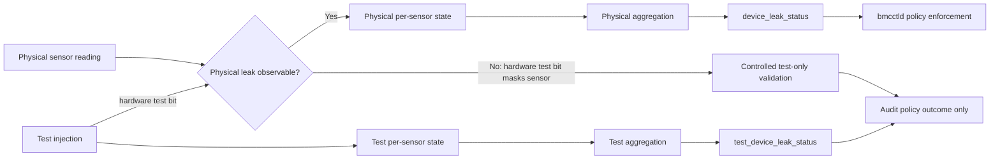

# Liquid Cooling leakage detection in SONiC

## 1. Overview

Due to the excessive heat generated by the equipment, traditional air-cooling methods are no longer sufficient for effective heat dissipation. Therefore, liquid cooling technology has become a necessary choice for more efficiently cooling the equipment and ensuring its proper operation. Given the potential fatality of liquid cooling leakage, implementing a mechanism to monitor and instantly alert the system when such an event occurs is crucial.

## 2. Requirements
1. Monitoring the liquid colling leakge detection sensor, and alarm accordingly.
2. For platform that doesn't support liquid cooling at all, there should be no further performance overheading.
3. Support controlled per-sensor leak-test injection for platform validation without allowing a test-only leak to trigger host power control.

## 3. Detection and alarm flow
The leak alarm process is straightforward. The platform API first acquires the status of the leak detection sensors. Then, thermalctld has a thread that calling the API and in turn notifies system health monitor, who ultimately sends out a gNMI event.


### Test and physical leak flow



`device_leak_status` is derived only from observable physical state. `test_device_leak_status` never dispatches host control. When a hardware test bit masks physical state, PMON does not infer a physical-leak result.

## 4. Platform API
A new object `LiquidCollingBase` will be added to the `sonic-platform-common` to reflect the new liquid cooling device

```
Class LiquidcollingBase(ojbect):
    leakge_sensors_num = 0
    leakage_sensors = {}

    def get_leak_sensor_num(self):
        """
        Retrieves the number of leakage sensors

        Returns:
            int: The number of leakage sensors
        """
        return self.leakge_sensors_num

    def get_leak_sensor_list(self):
        """
        Retrieves the list of leakage sensors

        Returns:
            list: A list of leakage sensor names
        """
        return self.leakage_sensors

    def get_leak_sensor_status(self):
        """
        Retrieves the leak status of the sensors

        Returns:
            list: A list of leakage sensor names that are leaking, empty list if no leakage
        """
        leaking_sensors = []
        for sensor in self.leakage_sensors:
            if sensor.is_leak():
                leaking_sensors.add(sensors)
        return leaking_sensors

Class LeakageSensor(sensor_base):
    "" there might be mutiple leakge detection sensors, to let user better find the location, 
    name = ""
    leaking = 0

    "" string return to get the sensor's name
    def get_name():

    "" boolean returen to indicate whether there is a leak detected
    def is_leak():
    
```

### Leak severity capabilities

`LeakageSensorBase.get_supported_leak_severities()` returns the non-clear severities a sensor can report during normal operation. For example, a fixed-critical binary sensor returns `{CRITICAL}`, while an analogue sensor with two thresholds returns `{MINOR, CRITICAL}`.

`get_leak_severity()` returns the severity of the currently asserted leak, or `None` when no leak is asserted or the severity is unavailable. Callers use `is_leak_sensor_ok()` to distinguish a clear sensor from an unavailable severity caused by a sensor fault.

### Leak-test API

Platforms that support controlled leak simulation shall expose an optional `LeakageSensorTestBase` instance from `LiquidCoolingBase.get_leak_sensor_test()`. Platforms that do not support it return `None`.

| Method | Description |
|--------|-------------|
| `is_leak_test_supported()` | Return whether controlled leak-test injection is supported |
| `get_test_capabilities(sensor_name)` | Return the supported test capabilities for one sensor: `LEAK_INJECTION`, `SEVERITY_INJECTION`, and `FAULT_INJECTION` |
| `set_test_leak(sensor_name, enable, expected_severity=None)` | Enable or disable test injection and return the resulting test severity |
| `is_test_leak_enabled(sensor_name)` | Return whether test injection is enabled for one sensor |
| `set_test_sensor_fault(sensor_name, enable)` | Enable or disable test fault injection for one sensor |
| `clear_test_leaks()` | Clear test injection on every sensor |

`LEAK_INJECTION` permits the platform to inject a leak. `SEVERITY_INJECTION` permits it to select among multiple test severities. `FAULT_INJECTION` permits it to inject a sensor fault. A fixed-severity binary sensor can expose only `LEAK_INJECTION`; its single supported severity is reported by `get_supported_leak_severities()`.

When `enable` is `True`, `expected_severity` is an optional requirement on the generated test state. If it is supplied, it must be in `get_supported_leak_severities()`. A sensor with multiple supported severities must also advertise `SEVERITY_INJECTION` to accept an explicit requested severity. A fixed-severity sensor accepts its matching `expected_severity` with `LEAK_INJECTION` alone. Unsupported requests fail explicitly and must not silently substitute another severity. When `enable` is `False`, `expected_severity` must be `None` and the call returns no severity.

`sonic-mgmt` obtains this interface through a privileged test helper on the DUT; it is not exposed through the normal production CLI. Test code uses `get_supported_leak_severities()` and test capabilities to choose the nth sensor suitable for a requested severity. Test state must be cleared at boot and test-interface use must be audited.

On platforms with hardware test bits, enabling a test may cause `is_leak()` to return `True` because the hardware leak indication is forced. `thermalctld` uses `is_test_leak_enabled()` to classify that indication as test-injected and excludes it from the physical result used for policy enforcement. If the underlying physical state is not independently observable while a hardware test bit is enabled, test injection is restricted to controlled validation where a concurrent real leak can be ruled out.

## 5. Thermal control daemon
A new object `LiquidCoolingUpdater` will be added to the Thermal Control daemon that dedicated monitoring the liquid device status.

During initialization, a separate thread will be launched to periodically call the `get_leak_sensor_status` API. The reason for separating this thread from the main thermal control daemon process is that the main process has a period of 1 minute, which is reasonable for normal thermal device updates but not suitable for leak events. Leak events are critical and need to be reported as soon as possible. However, these events are also abnormal and rare, so we don't need to involve them in the main thread and increase the main thread period to 1 second, which would be overkill and lower performance.

New configuration will be added to pmon_daemon_control.json, to indicate whether the system has liquid cooling system, if not, the object and thread will not be created in the initialization of thermalctld at all to avoid performance overheading.
```
# to enable the seperate thread for liquid cooling monitor
enable_liquid_cooling: true,
# set the interval to update the leakage status, default 0.5
liquid_cooling_update_interval: 0.5
```

The thread records physical leak state and optional test-injection state separately. It aggregates physical leaks for policy enforcement and test injections for validation visibility. When the underlying physical state remains observable, a test injection must not increase, suppress, or otherwise change the physical aggregate used for enforcement.

Once the leakage event has been detected, the thread will write it to state db to notify the system health monitor. Meanwhile, the syslog error message will be printed out.
"Liquid cooling leakge has been detected on sensor{}"

```
class LiquidCoolingUpdater():

    def update():
        _refresh_leak_status_update
        _refresh_other_status_update
    def _refresh_leak_status_update():
        liquidCoolingOjbect = chassis.get_liquid_cooling_device
        liquidCoolingOjbect.get_leak_sensor_status is not None
            update the state db accordingly
```

### stat_db data schema 
the `LIQUID_COOLING_DEVICE` table stores all the date gathered by thermal control deamon, currtenly, it will have only `leakage_sensors`

```
Defines a logical structure for liquid cooling devices, with keys for various sensors.

key                       = LIQUID_COOLING_DEVICE|leakage_sensors{X}
 ; field                  = value
name                      = STR     ; sensor name
leaking                   = STR     ; 1 or 0 to indicate leakage status
leak_status               = STR     ; Covert leaking 1/0 to yes/no, default as N/A to prevent sensor not readable
test_leak                 = STR     ; Enabled or Disabled
test_leak_severity        = STR     ; MINOR, CRITICAL, or None
leak_source               = STR     ; physical, test, mixed, or none
physical_leak_observable  = STR     ; Yes or No
test_sensor_fault         = STR     ; Enabled or Disabled
physical_sensor_health_observable = STR ; Yes or No

key                       = SYSTEM_LEAK_STATUS|system
 ; field                  = value
device_leak_status        = STR     ; physical aggregate used for policy enforcement
test_device_leak_status   = STR     ; test-injection aggregate; validation only
```

### Test-leak policy boundary

`test_device_leak_status` is never evaluated for policy enforcement. Test infrastructure must not change `LEAK_CONTROL_POLICY`, `system_leak_policy`, or a configured leak action to make test injection safe: those settings are neither required nor sufficient to prevent a test-only leak from reaching host power control. For a test-only event, `bmcctld` records the policy outcome that would apply to an equivalent physical leak, including either the configured action or a policy-disabled skip, and does not dispatch it.

For each sensor, `test_leak_severity` records the severity generated by test injection, or `None` while test injection is disabled. `leak_source` describes the effective leak indication: `physical`, `test`, `mixed`, or `none`. `physical_leak_observable` is `No` only when a hardware test bit masks the underlying physical leak indication. During that interval, the existing `leaking` and `leak_severity` fields report the effective observable indication, but `device_leak_status` is derived only from observable physical leaks and must not be inferred from the test indication.

| Leak source | Aggregate field | `bmcctld` behavior |
|-------------|-----------------|--------------------|
| Physical | `device_leak_status` | Applies the configured policy only when `system_leak_policy` is enabled |
| Test injection | `test_device_leak_status` | Audits the outcome that would apply; never dispatches a host-control action |
| Physical + hardware test injection | Hardware-dependent | A hardware test bit may hide the underlying physical leak. Treat the interval as test-only controlled validation; do not infer physical-leak state or dispatch host control from it |

### Test-fault semantics

When `test_sensor_fault=Enabled`, `thermalctld` publishes the effective `leak_sensor_status` as `Fault`, sets `leaking` and `leak_status` to `N/A`, and sets `leak_severity` to `None`, matching the representation of a physical sensor fault. A test-injected fault does not contribute to `device_leak_status` or `test_device_leak_status`, and never causes host control. Clearing the test fault restores reporting from the physical sensor.

`physical_sensor_health_observable` is `No` only when the platform's fault-injection mechanism masks the underlying physical sensor-health result. In that case, test injection is restricted to controlled validation where a concurrent physical sensor fault can be ruled out; otherwise the field is `Yes`.

## 6. system health monitor
A new function named `_check_liquid_cooling_status(self, config)` will be added to the system health monitor hardware_chekcer.py, used to monitoring the leakage detection state db value, and once it is detected, a gnmi event will be sent out.
It worth to note that both change from NOTleak to leak and leak to NOTleak will trigger an event.

```
def publish_events(self, leakge_sensor_list):
    params = swsscommon.FieldValueMap()
    for leakage_sensor in leakge_sensor_list:
        swsscommon.event_publish(self.events_handle, EVENTS_PUBLISHER_TAG, params)
```

### the GNMI event model
EVENTS_PUBLISHER_SOURCE = "sonic-events-host"

EVENTS_PUBLISHER_TAG = "liquid-cooling-leak"

## 7. CLI management
A new command `show platform leakage status` will be added to let user know current leak sensor status, the data will come from the state db
```
Name       Leak  
-----------------
leak_sensors1    NO   
leak_sensors2    NO   
...
leak_sensorsX    Yes   
```

As the new functionality will be added to system health monitor, the relevant command `show system-health detail` will be updated.
```
System services and devices monitor list
Name                     Status    Type
-----------------------  --------  ----------
...
leak_sensors1            OK        LiquidCooling
leak_sensors2            OK        LiquidCooling
...
leak_sensors3            Not OK    LiquidCooling
```

## 8. Performance
Seperate thread will be lunched in thermal contorl daemon keep monitoring entire liquid cooling device status within 0.5s interval

## 9. Testing
A mock testing should be created to demonstrate the functionality of this implementation. Once simulated a leaking event, these things need to be checked:
1. correct sensors number had been indicated in the syslog messge
2. state db is rightly updated 
3. GNMI event had been sent out
4. `show platform leakage status` command output is correct
5. Test injection is available only when `LiquidCoolingBase.get_leak_sensor_test()` returns a supported test interface.
6. A test-only critical aggregate is recorded and audited but never invokes graceful shutdown, power-off, power-cycle, GNOI, or a platform power-control API.
7. A physical critical leak still invokes the configured policy action.
8. Test injection does not require changes to `LEAK_CONTROL_POLICY`; the test verifies the audit record identifies the policy outcome that would apply to an equivalent physical leak.
9. A requested `expected_severity` succeeds only when it is supported by `get_supported_leak_severities()` and the required test capability is available; unsupported requests fail explicitly.
10. A test-injected sensor fault produces `Fault` and `N/A` per-sensor state, does not affect either aggregate leak status, and never invokes host control.
11. Test injection publishes the expected `test_leak_severity`, `leak_source`, and physical-observability state without contributing to `device_leak_status`.
