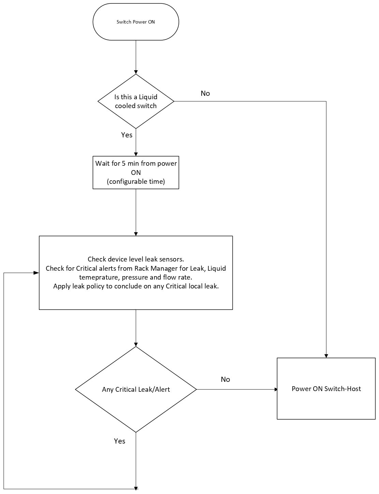
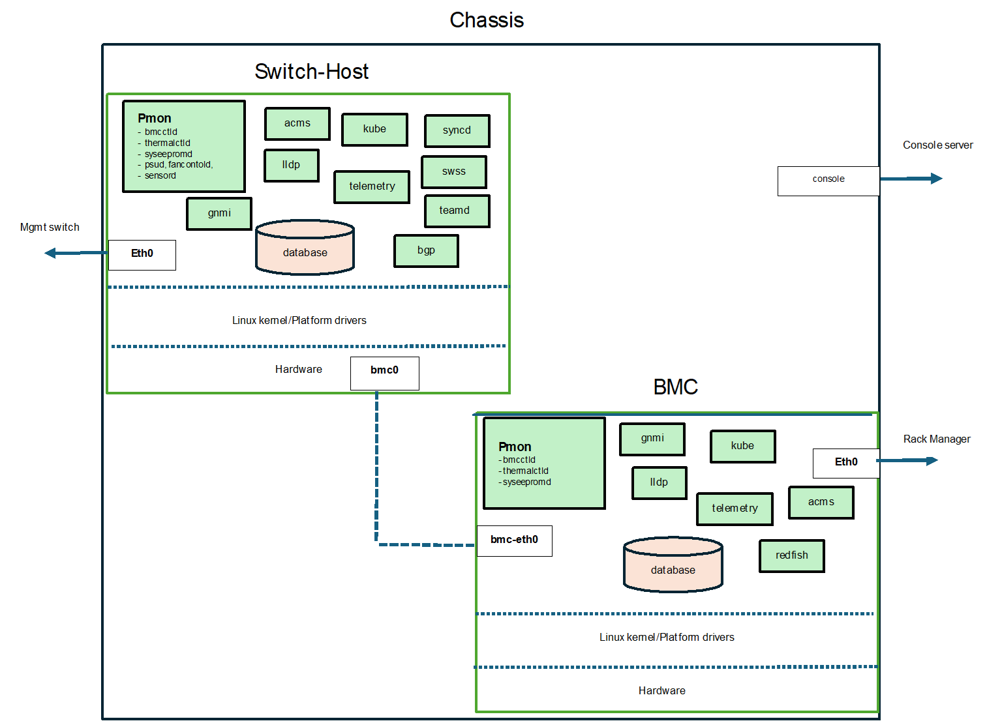

# SONiC BMC Platform Management & Monitoring #

# Table of Contents

  * [Revision](#revision)
  * [Scope](#scope)
  * [Acronyms](#acronyms)
  * [1. SONiC Platform Management and Monitoring](#1-sonic-platform-management-and-monitoring)
    * [1.1 Functional Requirements](#11-functional-requirements)
    * [1.2 BMC Platform Stack](#12-bmc-platform-stack)
  * [2. Detailed Architecture and Workflows](#2-detailed-architecture-and-workflows)
    * [2.1 BMC Platform](#21-bmc-platform)
      * [2.1.1 BMC platform power up](#211-bmc-platform-power-up) 
      * [2.1.2 BMC Rack Manager Interaction](#212-bmc-rack-manager-interaction)
        * [2.1.2.1 DB schema](#2121-db-schema)
      * [2.1.3 Host-Bmc-link](#213-host-bmc-link)
      * [2.1.4 BMC-Switch Host Interaction](#214-bmc-switch-host-interaction)
      * [2.1.5 BMC leak_detection_and_thermal policy](#215-bmc-leak-detection-and-thermal-policy)
      * [2.1.6 BMC event logging](#216-bmc-event-logging)
    * [2.2 BMC Platform Management](#22-bmc-platform-management)
      * [2.2.1 BMC controller-bmcctld](#221-bmc-controller---bmcctld)
        * [2.2.1.1 bmcctld on bmc](#2211-bmcctld-on-bmc)
      * [2.2.2 Thermalctld](#222-thermalctld)
        * [2.2.2.1 DB schema](#2221-db-schema)        
      * [2.2.3 Hw watchdog](#223-hw-watchdog)
      * [2.2.4 Platform APIs](#224-platform-apis)
    * [2.3 BMC CLI Commands](#22-bmc-cli-commands)
  * [3 Future Items](#3-future-items)

      
### Revision ###

 | Rev |     Date    |       Author                                                            | Change Description                |
 |:---:|:-----------:|:-----------------------------------------------------------------------:|-----------------------------------|
 | 1.0 |             |                                                                         | Initial version                   |

# Scope
This document provides design requirements and interactions between platform drivers and PMON for SONiC on BMC 

# Acronyms  
**BMC**          - Baseboard Management Controller.  
**Switch-Host** - Main board in network device which hosts the ASIC and CPU.  
**Chassis**   - Switch-Host & BMC as a unit called chassis.  
**Rack Manager** - Manager module for rack where switch is mounted.  
**Redfish**   - standard REST API for managing hardware.  
**PMON**    - Platform Monitor. Used in the context of Platform monitoring docker/processes.  

## 1. SONiC Platform Management and Monitoring
### 1.1. Functional Requirements
This section captures the functional requirements for platform monitoring and management in sonic BMC 

* BMC can be accessed in three ways (i) shared console (ii) via the external mgmt interface (ii) from the Switch-Host via the internal Host-Bmc-Link
* BMC can access Switch-Host redis DB over this internal Host-Bmc-Link and viceversa.
* BMC will manage the Switch Host to support operations like soft reboot, power up/down, get operational status.  
* BMC will read local leak sensors, its severity and take appropriate actions based on policy.
* BMC will get inputs from external Rack Manager on Inlet Liquid temperature, Inlet Liquid flow rate, Inlet Liquid Pressure and Rack level Leak. It takes action based on policy.  
* BMC and Switch-Host shall each enable an independent Hw watchdog timer.
* BMC and Switch-Host can be power ON and OFF independently.
* Switch-Host will manage its thermal sensors and automatically power down when any thermal sensor temperature exceeds the policy-defined thresholds.
    
### 1.2. BMC Platform Stack



## 2. Detailed Architecture and workflows
### 2.1 BMC platform
Presence of the file bmc.json in the vendor/platform directory tells this platform has BMC. The contents of bmc.json in Switch-Host and BMC are as below.
```
Switch_Host=1
Liquid_cooled=true
```
```
Switch_BMC=1
Liquid_cooled=true
```

"Liquid_cooled" flag is set to true on a liquid cooled switch."Switch_Host" flag is set to 1 on the switch host, "Switch_BMC" flag is set to 1 on the switch BMC.  

In Air cooled switches this flag will not be present

#### 2.1.1 BMC platform power up
When device is powered ON, the BMC powers first, boots up the sonic BMC which starts the various cointainers   

If it is Air cooled switch the Switch-Host is powered on immediately.

If it is liquid cooled, the following actions are done before the Switch-Host is powered on.
* Check local leaks and external Leaks if any reported by Rack Manager
* Send a POWER_ON command to Switch-host if all clear. 




#### 2.1.2 BMC Rack Manager Interaction
The new docker container "redfish" in sonicBMC will have openbmc/bmcweb service which terminates the redfish calls from the rack Manager.

**Note: Redish docker to be enabled only on Liquid cooling platform.**

Few of the URIs which needs to be supported in BMC are below, (Note: there would be some change in the naming of OEM URI paths)

    1. GET /redfish/v1   
             -- Rack Manager to get switchBMC type eg: "SONiCBMC"
    2. GET /redfish/v1/UpdateService/FirmwareInventory  
             -- Rack Manager to get switch firmware details
    3. POST /redfish/v1/Systems/System/Actions/ComputerSystem.Reset  
             -- Rack Manager to power off/on Main_cpu_switch_board
    4. POST /redfish/v1/Managers/Bmc/Actions/Oem/SONiC.RackManagerAlert  
             -- Rack manager to post a critical alert to BMC
    5. POST /redfish/v1/Managers/Bmc/Actions/Oem/SONiC.RackManagerTelemetry  
             -- Rack manager send periodic telemetry data of Inlet Liquid temperature, Inlet Liquid flow rate,
                Inlet Liquid Pressure, Leak information
    6. POST /redfish/v1/EventService/Subscriptions  
             -- Rack manager to subscribe for events like Leak from switchBMC.  

**TODO** Add reference to the redfish design doc here

#### 2.1.2.1 DB schema

Redis DB will be used to store the command/data send from external Rack manager for the platform daemons to act upon.

```
key                       = RACK_MANAGER_COMMAND|CMD_<command_id>         ; Commands from Rack Manager in STATE_DB in BMC
; field                   = value                                         ; e.g. ComputerSystem.Reset
command                   = POWER_ON | POWER_OFF | POWER_CYCLE
status                    = PENDING | DONE | FAILED                       ; result after command is executed.
timestamp                 = STR


key                       = RACK_MANAGER_STATE|rack-manager               ; STATE_DB on BMC to store state of RackManager
; field                   = value
reachability              = REACHABLE | UNREACHABLE
last_change_timestamp     = STR

key                       = RACK_MANAGER_ALERT|Inlet_liquid_temperature    ; Alert data from Rack Manager in STATE_DB
; field                   = value
severity                  = status                                         ;CRITICAL/MINOR
timestamp                 = STR

key                       = RACK_MANAGER_ALERT|Inlet_liquid_flow_rate      ; Alert data from Rack Manager in STATE_DB
; field                   = value
severity                  = status                                         ;CRITICAL/MINOR
timestamp                 = STR

key                       = RACK_MANAGER_ALERT|Inlet_liquid_pressure       ; Alert data from Rack Manager in STATE_DB
; field                   = value
severity                  = status                                         ;CRITICAL/MINOR
timestamp                 = STR

key                       = RACK_MANAGER_ALERT|Rack_level_leak             ; Alert data from Rack Manager in STATE_DB
; field                   = value
severity                  = status                                         ;CRITICAL/MINOR
timestamp                 = STR
```  

#### 2.1.3 Host-Bmc-Link
There is ethernet link between the Switch-Host and Switch-BMC ( eg: Ethernet over USB )

The Switch-Host will intialize the usb netdev dring the inital platform bringup and name it as bmc0.
Similarly the BMC will intialize the usb netdev dring the inital platform bringup and name it as bmc-eth0

IP address to be configured on the Switch-Host end and Switch-Bmc end can be defined sonic wide unique in file "files/image_config/constants/bmc_ip_address.json" as below
```
Switch_Host=169.254.100.1
Switch_BMC=169.254.100.2
```
A platform could override this ip-address/subnet by defining it in the file bmc.json in the vendor/platform directory.


#### 2.1.4 BMC-Switch Host Interaction
The Switch-Host and BMC communicate over the Host-Bmc-Link for accessing redis DB.
 
Defining the various states, events and final state below

|| Switch Host (Current) | Event | Action | Switch Host (Final) 
|--|---|---|---|---|
|1| POWERED_UP  | LOCAL_LEAK_CRITICAL_EVENT | Syslog, DB update, graceful-shutdown/Power OFF Switch Host | POWERED_DOWN 
|2| POWERED_UP  | RACK_MGR_CRITICAL_EVENT | Syslog, graceful-shutdown/Power OFF Switch Host | POWERED_DOWN 
|3| POWERED_UP  | POWER OFF request | Syslog, graceful-shutdown/Power OFF Switch Host | POWERED_DOWN 
|4| POWERED_UP  | LOCAL_LEAK_MINOR_EVENT | Syslog, external monitoring tool isolate Switch-Host | POWERED_UP
|4| POWERED_UP  | RACK_MGR_MINOR_EVENT | Syslog, <To conclude on the action> | POWERED_UP
|5| POWERED_DOWN  | POWER ON request | Power ON Switch Host, Syslog | POWERED_UP


#### 2.1.5 BMC Leak detection and thermal policy

The Leak detection is applicable only to Liquid cooling platform. The action is based on alerts from two different sources 

(i) Local leak detection uses the leak status in LIQUID_COOLING_DEVICE|leakage_sensors{X}.
    The result ( whether it is critical/minor ) will be updated in LEAK_STATUS table defined in [2.2.2.1 DB schema](#2221-db-schema)
        
(ii) External Rack manager alert status is updated by redfish/bmcweb in RACK_MANAGER_ALERT table defined in [2.1.2.1 DB schema](#2121-db-schema).
    
        
#### 2.1.6 BMC event logging

The general syslogs will be placed in /var/log/syslog where /var/log directory will be mounted on **tmpfs **. Syslogs will be sent to remote server as well.
The Leak, Switch-Host state and interactions, Rack-manager interactions will be persistently stored on disk/eMMC in "/host/bmc.log" (Note: yet to conclude on exact location )


### 2.2 BMC Platform Management

The daemons present in pmon would be thermalctld, syseepromd, stormond.
In **Liquid cooled platforms** a new daemon **"bmcctld"** will be introduced in pmon container on BMC

#### 2.2.1 BMC controller - bmcctld

##### 2.2.1.1 bmcctld on BMC

The bmc controller daemon "bmcctld" is started first in BMC pmon container. It acts on the commands/leak-alert from External rack manager and local leaks reported by 'thermalctld'.

Switch-Host could be modeled as a "Module" using "ModuleBase" (https://github.com/sonic-net/sonic-platform-common/blob/0a6acf9c6ead70d75fbbd792651865316063a3cd/sonic_platform_base/module_base.py#L22C7-L22C17)

The following logic is applied

```
if it is First Boot ( not a pmon docker restart, or BMC restart )
{
  Sleep for (5min - bootup time) ( this is configurable value in config_db)
  This is to make sure Rack Manager comms is up and Liquid flow rate is good. 
}

Check for any CIRITICAL alert/leak in RACK_MANAGER_ALERT* tables and SYSTEM_LEAK_STATUS table in STATE_DB

if NO
{
  - Call the platform API to power ON the Switch-Host.
  - update the HOST_STATE|switch-host with the device_power_state.
}

Subscribe to RACK_MANAGER_COMMAND table, RACK_MANAGER_ALERT* tables and SYSTEM_LEAK_STATUS table in STATE_DB 
On an Event 
  - if POWER_DOWN request
      - JUMP to REBOOT|POWER_DOWN_SWITCH_HOST:
      - update the HOST_STATE|switch-host with the device_power_state.
      - update RACK_MANAGER_COMMAND|CMD_<command_id> status to DONE or FAILED.

  - if POWER_ON request
      - Call the platform API to power ON the Switch-Host
      - update the HOST_STATE|switch-host with the device_power_state.

  - if CRITICAL Local OR External leak
      - JUMP to REBOOT|POWER_DOWN_SWITCH_HOST:
      - update the HOST_STATE|switch-host with the device_power_state.

  - if MINOR Local OR External leak
      - Syslog, let the external monitoring Tool isolate the device.

  - if CLEAR of MINOR/CRITICAL Local AND External leak
      - Assume there will be an external fix and powercycle of device as needed which willclear leak state ? **Question**


REBOOT|POWER_DOWN_SWITCH_HOST:
  - use GNOI framework to issue remote reboot/shutdown command. The gnmi and sysmgr docker needs to be running on Switch-Host
    REF: https://github.com/sonic-net/SONiC/blob/master/doc/mgmt/gnmi/gnoi_system_hld.md, https://github.com/sonic-net/SONiC/pull/1489
  - if it was a shutdown command
    {
      - start a timer based on shutdown_delay configured in SWITCH_HOST_SHUTDOWN_TIMEOUT|default table.
      - Timer expiry Handler, check the Switch-Host state using platform API.
      - if still POWERED_ON, do a hard POWER_DOWN with platform API.
      - update the HOST_STATE|switch-host with the device_power_state.
    }
  

```

**Note:** To add more details and flow diagrams to this section.


###### DB schema
This section covers the various tables which this daemon creates/uses in Redis DB on BMC

```
key                       = BMC_BOOTUP_TIMEOUT|default         ; Config DB on BMC
; field                   = value
boot_delay                = float                              ; Time in secs after power on the device, switch BMC can power on the Switch-Host. ( default = 5 min ).   
                                                               ; If BMC receive POWER ON from Rack manager before this timeout + ther are no critical events - Switch-Host will be powered on

key                       = HOST_STATE|switch-host             ; STATE_DB on BMC to store state of Switch-Host
; field                   = value
device_power_state        = POWERED_ON | POWERED_OFF | REBOOT  ; What was the last action done on Switch-Host
last_change_timestamp     = STR


key                       = SWITCH_HOST_SHUTDOWN_TIMEOUT|default ; Config DB on BMC
; field                   = value
shutdown_delay            = float                                ; Time in secs the BMC will wait after REBOOT command issued to Switch-Host. ( default = 2 min ).
                                                                 ; if this timer expires, BMC will go ahead and POWER OFF switch-host

```

**Question :** Is there a use case to have bmcctld kind daemon on Switch-Host ?


#### 2.2.2 thermalctld
In Liquid cooled platform, thermalctld will skip the PSU, FAN, SFP thermals but have additional responsibilities to check leak sensors and apply leak policy.

```
Loop on this logic 
  (i) Check local leak sensors using platform API
         -- store the result in LIQUID_COOLING_DEVICE table
         -- Leak severity can either be CRITICAL or MINOR

  (ii) Apply the thermal policy based on the number and severity of leak sensors with leak
       
       +--------------------------------------+-----------------------+
       | Leak conditions                      | System Leak Severity  |
       +--------------------------------------+-----------------------+
       | 1 or more (Critical) leaks           |        CRITICAL       |
       | 2 or more leaks with any Severity    |        CRITICAL       |
       | 1 (Minor) leak stay leaking for MAX-T|        CRITICAL       |
       | 1 (Minor) leak detected              |        MINOR          |
       +--------------------------------------+-----------------------+

       Additional considerations, the timers can be implemented per platform.
         - MAX-T mins defined before which a MINOR leak can be considered CRITICAL.
         - Need to apply debounce timers
            (i) debounce_assert_sec : A leak must remain continuously detected for this much time to be treated as real leak.
            (ii) debounce_clear_sec : Once a leak clears, it must remain clear for this much time before the system considers it resolved.

   (iii) Update the local SYSTEM_LEAK_STATUS table with the severity of leak. This will be used in bmcctld process.

```
 
#### 2.2.2.1 DB schema

This LIQUID_COOLING_DEVICE table is already populated by thermalctld. New field **severity ** is introduced.
```
key                       = LIQUID_COOLING_DEVICE|leakage_sensors{X}  ; leak data in STATE_DB per sensor
 ; field                  = value
name                      = STR                                       ; sensor name
leaking                   = STR                                       ; Yes or No to indicate leakage status
severity                  = "status"                                  ;CRITICAL/MINOR

key                       = SYSTEM_LEAK_STATUS|local                  ; local bmc leak status in STATE DB
; field                   = value
device_leak_status        = "status"                                  ;CRITICAL/MINOR
```     

#### 2.2.3 Hw watchdog
Hw watchdog timers will be enabled on both Switch-Host and BMC. 
This will do a CPU reset when OS hangs or becomes unresponsive and fails to service the watchdog

#### 2.2.4 Platform APIs

# Platform APIs Used

Listing down the platform common APIs planned for sonic bmc support. 

The following docs already present define many platform API's for bmc, leak and liquidCooling

* https://github.com/sonic-net/SONiC/blob/master/doc/bmc/bmc_hld.md                                                                                                       
* https://github.com/sonic-net/SONiC/blob/master/doc/bmc/leakage_detection_hld.md 


####  LeakageSensorBase
This base class is already defined in sonic-platform-common. 
 - Adding a new API get_severity() which retuns back the severity of a particular leak

| Method | Present | Action |
|---------|---------|----------|
| get_name() | Y | Get leak sensor name |
| is_leak() | Y | Is there a leak detected? |
| get_severity() | New | Get the severity based on the criticality of the zone |

---

#### LiquidCoolingBase
This base class is already defined in sonic-platform-common. 

| Method | Present | Action |
|---------|---------|----------|
| get_num_leak_sensors() | Y | Get number of leak sensors |
| get_leak_sensor(index) | Y | Get per-leak-sensor status |
| get_leak_sensor_status() | Y | Get all leak sensor status |
| get_all_leak_sensors() | Y | Get list of all leak sensors |

---

####  BmcBase
This base class is already defined in sonic-platform-common. 

It contains API's for Switch-Host to control the switch BMC, In the current implementation Calls from Switch-Host --> BMC uses redfish.

**This class should be updated to use either Redis DB or Redfish to access this data from BMC**

| Method | Present | Action |
|---------|---------|----------|
| get_version() | Y | Get BMC firmware version |
| get_eeprom() | Y | Get BMC EEPROM information |
| get_status() | Y | Get BMC status |
| get_model() | Y | Get BMC model |
| get_serial() | Y | Get BMC serial number |

---

####  ModuleBase
This base class is already defined in sonic-platform-common.
 - Adding a new API get_power_state() which retuns back the power ON status of Module


| Method | Present | Action |
|---------|---------|----------|
| set_admin_state(UP) | Y | Power on Switch Host from standby/off |
| set_admin_state(DOWN) | Y | Power OFF Switch Host |
| reboot() | Y | Graceful shutdown of Switch Host|
| get_power_state() | New | Fetch the power state of Switch-Host|


We can model Switch-Host as a Module. Sample Implementaion as below 

```

device/<vendor>/<platform>/sonic_platform/
  __init__.py
  chassis.py
  switch_host_module.py


switch_host_module.py:

  from sonic_platform_base.module_base import ModuleBase
  class SwitchHostModule(ModuleBase):
    def __init__(self, index):
        super().__init__()
        self._index = index


chassis.py:

  from sonic_platform_base.chassis_base import ChassisBase
  from .switch_host_module import SwitchHostModule
  class Chassis(ChassisBase):
    def __init__(self):
        super().__init__()

        # Create Switch Host module object
        self._switch_host_module = SwitchHostModule(index=0)

    def get_all_modules(self):
        return [self._switch_host_module]


Use it in sonic_platform_daemons:

  from sonic_platform import chassis
  platform_chassis = chassis.Chassis()
  modules = platform_chassis.get_all_modules() // Check for SWITCH_HOST type 

```

---

####  ChassisBase
This base class is already defined in sonic-platform-common.

| Method | Present | Action |
|---------|---------|----------|
| get_bmc() | Y | In the Switch-Host, to get the BMC object |
| get_all_modules() | Y | In the BMC, to get the Switch-Host Module object |


### 2.2 BMC CLI Commands

The following docs already present define CLI's for bmc/leak show commands.

* https://github.com/sonic-net/SONiC/blob/master/doc/bmc/bmc_hld.md                                                                                                       
* https://github.com/sonic-net/SONiC/blob/master/doc/bmc/leakage_detection_hld.md


Additional commands enhanced to support BMC operation are below

#### Config commands

1. CLI to enable user to powercycle/reboot the Switch-Host
```
config chassis modules startup <Switch-Host>
config chassis modules shutdown <Switch-Host>
config chassis modules reboot <Switch-Host>
```

#### Show commands 

```
admin@bmc-host:~$ show chassis module status
        Name             Description   Power status       Serial
------------  ----------------------  -------------  -----------
BMC            Board Management Card         up          <>
Switch-Host    <Device sku details>          down        <>


```

## 3 Future Items
