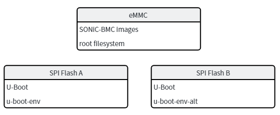
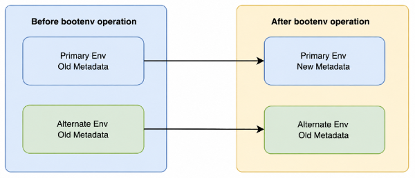
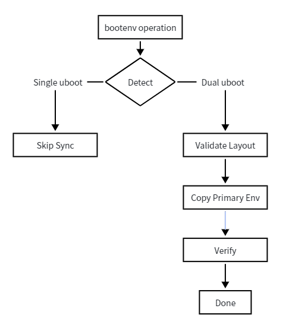

# Aspeed SONiC-BMC Dual U-Boot HLD

## Table of Contents

- [Aspeed SONiC-BMC Dual U-Boot HLD](#aspeed-sonic-bmc-dual-u-boot-hld)
  - [Table of Contents](#table-of-contents)
  - [Revision](#revision)
- [Scope](#scope)
  - [1. Overview](#1-overview)
    - [1.1 Background](#11-background)
    - [1.2 Functional Requirements](#12-functional-requirements)
  - [2. Detailed Design](#2-detailed-design)
    - [2.1 Current Design](#21-current-design)
    - [2.2 Problem Statement](#22-problem-statement)
      - [Image Install or Upgrade](#image-install-or-upgrade)
      - [Image Remove](#image-remove)
      - [Next Boot or Boot Once Selection](#next-boot-or-boot-once-selection)
    - [2.3 Proposed Design](#23-proposed-design)
      - [2.3.1 Dual Environment Detection](#231-dual-environment-detection)
      - [2.3.2 Synchronization Flow](#232-synchronization-flow)
      - [2.3.3 Integration Points in Aspeed Framework](#233-integration-points-in-aspeed-framework)
      - [2.3.4 Failure Handling](#234-failure-handling)
  - [3. Testing Plan](#3-testing-plan)
    - [Test 1: Single U-Boot Environment](#test-1-single-u-boot-environment)
    - [Test 2: Dual U-Boot Environment Init](#test-2-dual-u-boot-environment-init)
    - [Test 3: Dual U-Boot Environment Install](#test-3-dual-u-boot-environment-install)
    - [Test 4: Dual U-Boot Environment Remove](#test-4-dual-u-boot-environment-remove)
    - [Test 5: Dual U-Boot Environment Next Boot](#test-5-dual-u-boot-environment-next-boot)
    - [Test 6: Error Handling](#test-6-error-handling)

## Revision

| Rev | Date | Author | Change Description |
|:---:|:-----------:|:------:|--------------------|
| 0.1 | 2026-06-23 | Micas | Initial version |


# Scope

This document defines the design for synchronizing dual U-Boot environment partitions in the Aspeed SONiC-BMC framework under:

```text
sonic-buildimage/platform/aspeed
```

This HLD is limited to Aspeed SONiC-BMC platforms where:

- SONiC-BMC image content is stored on eMMC
- U-Boot and U-Boot environment are stored on SPI flash
- a dual SPI flash layout may expose both primary and alternate U-Boot environment partitions

This document does not define a generic solution for all SONiC platforms outside the Aspeed SONiC-BMC framework.

## 1. Overview

### 1.1 Background

On Aspeed SONiC-BMC platforms, SONiC-BMC runs from eMMC while U-Boot bootloader components are stored on SPI flash.

Some platforms use a dual SPI flash architecture.

The high-level storage relationship is shown below:



The Aspeed SONiC-BMC framework updates U-Boot environment variables through `fw_setenv` during image install, image removal, boot target changes, and initial U-Boot environment programming.

Today only the primary environment is updated. The alternate environment is not synchronized automatically.

As a result, `u-boot-env` and `u-boot-env-alt` may diverge over time.

### 1.2 Functional Requirements

General requirements

- The Aspeed SONiC-BMC common framework shall detect whether both `u-boot-env` and `u-boot-env-alt` are present.
- If both environment partitions are present, the framework shall keep them synchronized.
- The synchronization shall happen at the completion of a framework-managed bootenv update operation.
- The design shall cover Aspeed framework flows that update bootenv through `fw_setenv`.
- The design shall not add a new systemd service.
- The design shall not add periodic synchronization logic.
- The design shall not change behavior for single-flash platforms.
- The design shall not require changes to U-Boot, `fw_setenv`, or `fw_printenv`.

## 2. Detailed Design

### 2.1 Current Design

In the current framework, multiple common paths update U-Boot environment directly through `fw_setenv`.

Representative paths include:

- `platform/aspeed/platform_arm64.conf`
- `platform/aspeed/aspeed-platform-services/scripts/sonic-uboot-env-init.sh`
- `platform/aspeed/aspeed-platform-services/scripts/sonic-program-uboot-env.sh`

These flows update variables such as:

- `boot_next`
- `boot_once`
- `image_dir`
- `fit_name`
- `sonic_version_1`
- `sonic_version_2`
- `linuxargs`
- `bootcmd`

Current behavior on sonic-bmc is:



### 2.2 Problem Statement

When only the primary environment is updated, the alternate environment may retain stale boot metadata.

Examples:

#### Image Install or Upgrade

```text
Install or upgrade image
        ↓
Primary env updated
        ↓
Alternate env still contains old image metadata
        ↓
Switch to alternate SPI flash
        ↓
Boot may use stale image state
```

#### Image Remove

```text
Remove image
      ↓
boot_next / sonic_version_x updated in primary env
      ↓
Alternate env still references removed image
```

#### Next Boot or Boot Once Selection

```text
Set next boot target
       ↓
Primary env updated
       ↓
Alternate env still carries previous boot selection
```

This inconsistency becomes visible after flash switchover or recovery scenarios.

### 2.3 Proposed Design

The proposed design introduces a common Aspeed-side bootenv synchronization helper.

Framework-managed bootenv operations continue to update the primary environment through existing `fw_setenv` calls.

At operation completion, the helper will:

1. detect whether an alternate environment exists
2. if dual environment is present, copy the updated primary environment content to the alternate environment partition
3. verify that both copies are identical

This keeps the primary environment as the source of truth and eliminates the need for platform-private post-boot sync services.

In this design, an operation is a logically complete bootenv update action whose resulting state is intended to be consumed by a future boot flow.

Representative operations include:

- image install
- image remove
- set default image
- set next boot image
- first boot environment programming
- boot menu preparation as part of install or upgrade flow

#### 2.3.1 Dual Environment Detection

The framework shall detect dual environment support by parsing `/proc/mtd`.

Expected partition labels:

- `u-boot-env`
- `u-boot-env-alt`

Example:

```text
mtd1: 00020000 00010000 "u-boot-env"
mtd6: 00020000 00010000 "u-boot-env-alt"
```

Detection behavior:

- If both labels exist, dual-env synchronization is enabled.
- If only `u-boot-env` exists, the framework keeps current behavior.
- Absence of `u-boot-env-alt` is not treated as an error.
- Failure to access the primary environment remains an update failure.

#### 2.3.2 Synchronization Flow

The synchronization model is copy-after-update, once per completed framework-managed operation.



The synchronization is performed on raw environment partition content rather than reconstructing variables one by one. This preserves the exact serialized state produced by `fw_setenv`, including CRC and on-flash environment layout, without requiring variable-by-variable replay.

Before copy, the helper validates that the primary and alternate environment partitions have the same partition size and erase size.

After copy, the helper performs byte-to-byte verification between the two environment partitions.

The helper serializes synchronization with a file lock so concurrent framework-managed operations do not interleave alternate environment copy and verification.

#### 2.3.3 Integration Points in Aspeed Framework

The synchronization helper is intended for Aspeed common paths that currently update bootenv.

The current integration points are:

- `platform/aspeed/aspeed-platform-services/scripts/sonic-program-uboot-env.sh`
- `platform/aspeed/install-sonic-to-emmc.sh`
- `platform/aspeed/platform_arm64.conf`
- `src/sonic-utilities/sonic_installer/bootloader/uboot.py`
- `platform/aspeed/aspeed-platform-services/scripts/sonic-sync-uboot-env.sh`

These integration points cover:

- bootenv programming during install and upgrade
- first-boot environment programming
- image slot metadata updates
- default boot target updates
- next-boot and boot-once updates

The design goal is:

```text
Any Aspeed common framework-managed operation that successfully updates
the primary U-Boot environment shall synchronize the alternate
environment when dual-env layout is present.
```

#### 2.3.4 Failure Handling

The current helper behavior is as follows:

- If `u-boot-env` cannot be found in `/proc/mtd`, synchronization returns failure.
- If `u-boot-env-alt` is not present, synchronization is skipped and the helper returns success.
- If primary and alternate environment partitions do not have the same partition size or erase size, synchronization returns failure.
- If `flashcp` is unavailable, synchronization returns failure.
- If raw copy to the alternate environment fails, synchronization returns failure.
- If byte-to-byte verification fails, synchronization returns failure.
- If synchronization completes successfully, the helper returns success.

Framework-managed shell paths treat synchronization failure as operation failure.

In the current `uboot.py` implementation, synchronization is attempted only when `sonic-sync-uboot-env.sh` exists on the target system. If the helper is absent, the generic U-Boot path continues without synchronization.

This design is not transactional. If primary environment updates succeed and alternate synchronization later fails, the primary environment result is kept and the operation reports failure in the framework-managed shell paths.

## 3. Testing Plan

### Test 1: Single U-Boot Environment

Description: Verify that bootenv update behavior remains unchanged when only the primary U-Boot environment exists.

Check:

- synchronization is skipped when `u-boot-env-alt` is absent
- primary environment update remains successful

### Test 2: Dual U-Boot Environment Init

Description: Verify that first-time framework-managed environment initialization synchronizes the alternate U-Boot environment.

Check:

- init operation completes successfully
- alternate environment is synchronized

### Test 3: Dual U-Boot Environment Install

Description: Verify that install flow synchronizes the alternate U-Boot environment at operation completion.

Check:

- install operation completes successfully
- alternate environment is synchronized

### Test 4: Dual U-Boot Environment Remove

Description: Verify that remove flow synchronizes bootenv updates to the alternate U-Boot environment.

Check:

- remove operation completes successfully
- alternate environment is synchronized

### Test 5: Dual U-Boot Environment Next Boot

Description: Verify that next-boot update synchronizes the alternate U-Boot environment.

Check:

- next-boot operation completes successfully
- alternate environment is synchronized

### Test 6: Error Handling

Description: Verify that synchronization failure is reported when the alternate environment update path encounters an error.

Check:

- operation reports synchronization failure
- failure is logged
