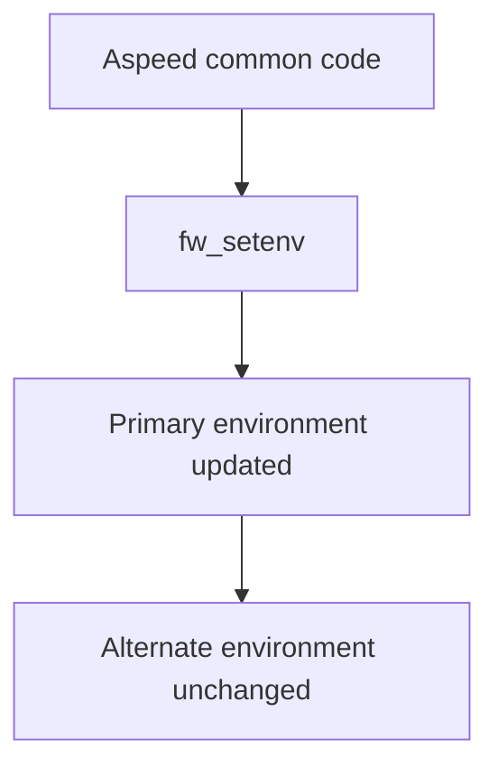
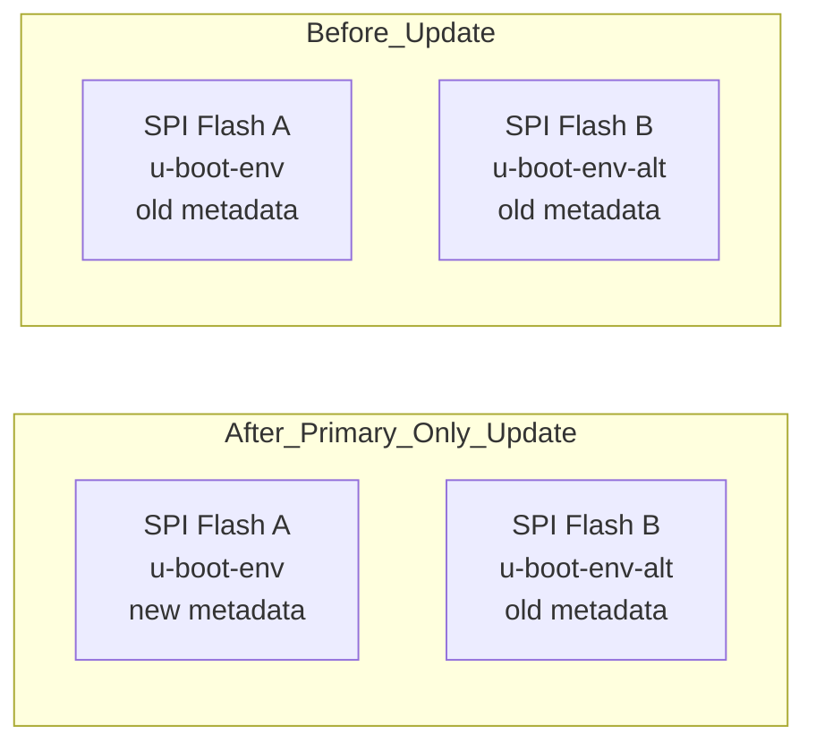
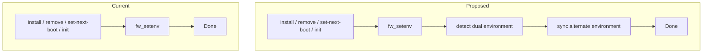
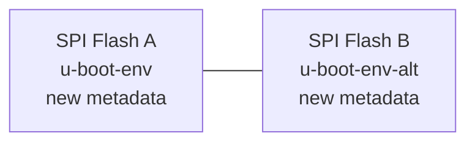
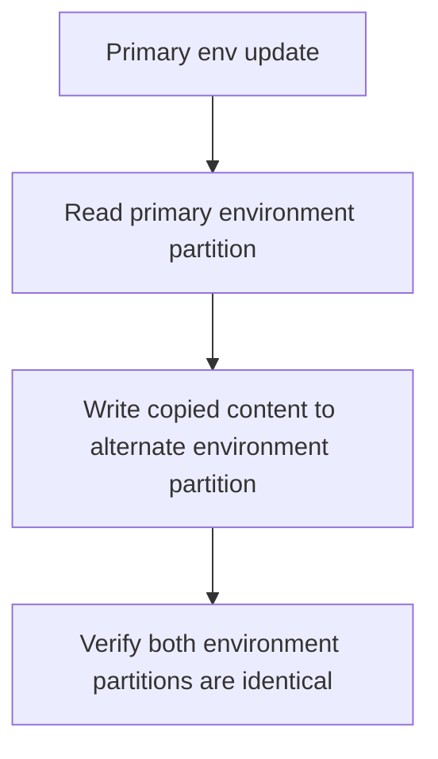
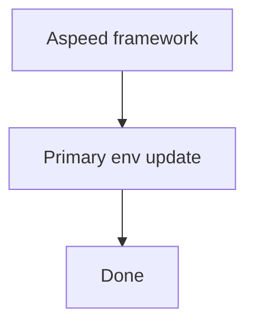
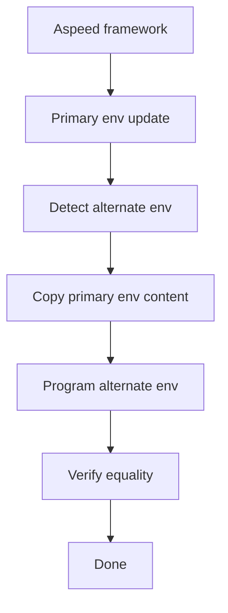

# Aspeed SONiC-BMC Dual U-Boot HLD

## Table of Contents

- [Revision](#revision)
- [Scope](#scope)
- [Acronyms](#acronyms)
- [1. Overview](#1-overview)
  - [1.1 Background](#11-background)
  - [1.2 Functional Requirements](#12-functional-requirements)
- [2. Detailed Design](#2-detailed-design)
  - [2.1 Current Design](#21-current-design)
  - [2.2 Problem Statement](#22-problem-statement)
  - [2.3 Proposed Design](#23-proposed-design)
    - [2.3.1 Dual Environment Detection](#231-dual-environment-detection)
    - [2.3.2 Synchronization Flow](#232-synchronization-flow)
    - [2.3.3 Integration Points in Aspeed Framework](#233-integration-points-in-aspeed-framework)
    - [2.3.4 Failure Handling](#234-failure-handling)
    - [2.3.5 Unchanged Components](#235-unchanged-components)
  - [2.4 Workflow](#24-workflow)
    - [2.4.1 Single Flash Platform](#241-single-flash-platform)
    - [2.4.2 Dual Flash Platform](#242-dual-flash-platform)
  - [2.5 System Impact](#25-system-impact)
- [3. Testing Plan](#3-testing-plan)

## Revision

| Rev | Date | Author | Change Description |
|:---:|:-----------:|:------:|--------------------|
| 0.1 | 2026-06-23 | Micas | Initial version |

# Scope

This document defines the design for synchronizing dual U-Boot environment partitions in the Aspeed SONiC-BMC framework under:

```text
sonic-buildimage/platform/aspeed
```

This HLD is limited to Aspeed SONiC-BMC platforms where:

- SONiC-BMC image content is stored on eMMC
- U-Boot and U-Boot environment are stored on SPI flash
- a dual SPI flash layout may expose both primary and alternate U-Boot environment partitions

This document does not define a generic solution for all SONiC platforms outside the Aspeed SONiC-BMC framework.

## 1. Overview

### 1.1 Background

On Aspeed SONiC-BMC platforms, SONiC-BMC runs from eMMC while U-Boot bootloader components are stored on SPI flash.

Some platforms use a dual SPI flash architecture.

The high-level storage relationship is shown below:

```text
                 +----------------------+
                 |        eMMC          |
                 |----------------------|
                 | SONiC-BMC images     |
                 | root filesystem      |
                 +----------------------+

      +----------------------+    +----------------------+
      |     SPI Flash A      |    |     SPI Flash B      |
      |----------------------|    |----------------------|
      | U-Boot               |    | U-Boot               |
      | u-boot-env           |    | u-boot-env-alt       |
      +----------------------+    +----------------------+
```

The Aspeed SONiC-BMC framework updates U-Boot environment variables through `fw_setenv` during image install, image removal, boot target changes, and initial U-Boot environment programming.

Today only the primary environment is updated. The alternate environment is not synchronized automatically.

As a result, `u-boot-env` and `u-boot-env-alt` may diverge over time.

### 1.2 Functional Requirements

General requirements

- The Aspeed SONiC-BMC common framework shall detect whether both `u-boot-env` and `u-boot-env-alt` are present.
- If both environment partitions are present, the framework shall keep them synchronized.
- The synchronization shall happen as part of the bootenv update path itself.
- The design shall cover Aspeed framework flows that update bootenv through `fw_setenv`.
- The design shall not add a new systemd service.
- The design shall not add periodic synchronization logic.
- The design shall not change behavior for single-flash platforms.
- The design shall not require changes to U-Boot, `fw_setenv`, or `fw_printenv`.

## 2. Detailed Design

### 2.1 Current Design

In the current framework, multiple common paths update U-Boot environment directly through `fw_setenv`.

Representative paths include:

- `platform/aspeed/platform_arm64.conf`
- `platform/aspeed/aspeed-platform-services/scripts/sonic-uboot-env-init.sh`
- `platform/aspeed/aspeed-platform-services/scripts/sonic-program-uboot-env.sh`

These flows update variables such as:

- `boot_next`
- `boot_once`
- `image_dir`
- `fit_name`
- `sonic_version_1`
- `sonic_version_2`
- `linuxargs`
- `bootcmd`

Current behavior on a dual-flash platform is:



An existing downstream workaround uses a platform-specific post-boot synchronization service. This is not desirable as a framework solution because it is platform-private and operates after the actual update already happened.

### 2.2 Problem Statement

When only the primary environment is updated, the alternate environment may retain stale boot metadata.

This is the core inconsistency introduced by the current flow:



Examples:

#### Image Install or Upgrade

```text
Install or upgrade image
        ↓
Primary env updated
        ↓
Alternate env still contains old image metadata
        ↓
Switch to alternate SPI flash
        ↓
Boot may use stale image state
```

#### Image Remove

```text
Remove image
      ↓
boot_next / sonic_version_x updated in primary env
      ↓
Alternate env still references removed image
```

#### Next Boot or Boot Once Selection

```text
Set next boot target
       ↓
Primary env updated
       ↓
Alternate env still carries previous boot selection
```

This inconsistency becomes visible after flash switchover or recovery scenarios.

### 2.3 Proposed Design

The proposed design introduces a common Aspeed-side bootenv synchronization helper and routes bootenv update flows through it.

The helper will:

1. perform the normal update to the primary environment
2. detect whether an alternate environment exists
3. if dual environment is present, copy the updated primary environment content to the alternate environment partition
4. verify that both copies are identical

This keeps the primary environment as the source of truth and eliminates the need for platform-private post-boot sync services.

The core change is a single synchronization step inserted after the existing primary environment update:



The result after synchronization is:



#### 2.3.1 Dual Environment Detection

The framework shall detect dual environment support by parsing `/proc/mtd`.

Expected partition labels:

- `u-boot-env`
- `u-boot-env-alt`

Example:

```text
mtd1: 00020000 00010000 "u-boot-env"
mtd6: 00020000 00010000 "u-boot-env-alt"
```

Detection behavior:

- If both labels exist, dual-env synchronization is enabled.
- If only `u-boot-env` exists, the framework keeps current behavior.
- Absence of `u-boot-env-alt` is not treated as an error.
- Failure to access the primary environment remains an update failure.

#### 2.3.2 Synchronization Flow

The synchronization model is copy-after-update.



The synchronization is performed on raw environment partition content rather than reconstructing variables one by one. This preserves the exact serialized state produced by the primary environment update path.

#### 2.3.3 Integration Points in Aspeed Framework

The synchronization helper is intended for Aspeed common paths that currently update bootenv.

The main integration points are expected to be:

- bootenv programming during install and upgrade
- first-boot environment initialization
- image slot metadata updates
- default boot target updates
- next-boot and boot-once updates
- boot menu preparation paths

The design goal is:

```text
Any Aspeed common framework path that successfully updates the primary U-Boot environment
shall synchronize the alternate environment when dual-env layout is present.
```

#### 2.3.4 Failure Handling

Failure handling rules are as follows:

- If the primary environment update fails, alternate synchronization is not attempted.
- If the primary update succeeds but alternate synchronization fails, the overall operation reports failure.
- If alternate environment is absent, the operation succeeds with existing single-env behavior.
- If copy verification fails, the operation reports failure.
- Logs shall clearly distinguish:
  - primary update failure
  - alternate environment not present
  - alternate synchronization failure
  - verification failure

#### 2.3.5 Unchanged Components

The following components remain unchanged:

- U-Boot implementation
- `fw_setenv`
- `fw_printenv`
- boot flow semantics
- SONiC-BMC image placement on eMMC
- flash layout definition itself

### 2.4 Workflow

#### 2.4.1 Single Flash Platform

For platforms without `u-boot-env-alt`, behavior remains unchanged.



#### 2.4.2 Dual Flash Platform

For platforms with both `u-boot-env` and `u-boot-env-alt`:



### 2.5 System Impact

Modified components are expected to include:

- `platform/aspeed/platform_arm64.conf`
- `platform/aspeed/aspeed-platform-services/scripts/sonic-uboot-env-init.sh`
- `platform/aspeed/aspeed-platform-services/scripts/sonic-program-uboot-env.sh`
- a new common bootenv synchronization helper under `platform/aspeed`

The existing platform-private post-boot synchronization workaround becomes unnecessary once the common Aspeed framework path owns synchronization.

## 3. Testing Plan

### Test 1: Single Flash Platform

Verify that:

- bootenv update behavior remains unchanged
- no alternate sync is attempted
- no regression is introduced

### Test 2: Dual Flash Image Install

Install a new SONiC-BMC image.

Verify that:

- primary environment is updated
- alternate environment is synchronized
- both partitions contain identical content after update

### Test 3: Dual Flash Image Remove

Remove an image.

Verify that variables such as:

- `boot_next`
- `sonic_version_1`
- `sonic_version_2`

remain consistent across both environment copies.

### Test 4: Default and Next Boot Selection

Run boot target changes through framework-managed paths.

Verify that:

- `boot_next`
- `boot_once`

are synchronized across both environment copies.

### Test 5: First-Boot Environment Programming

Validate first-time U-Boot environment programming through Aspeed common scripts.

Verify that:

- `u-boot-env`
- `u-boot-env-alt`

are identical after initialization.

### Test 6: Install or Upgrade Flow in Aspeed Framework

Run the Aspeed install or upgrade flow that programs boot variables such as:

- `image_dir`
- `fit_name`
- `sonic_version_1`
- `linuxargs`
- `bootcmd`

Verify that the alternate environment is synchronized immediately after the primary update flow succeeds.

### Test 7: Flash Switchover

After a successful update, switch to the alternate SPI flash.

Verify that:

- boot succeeds
- the expected image metadata is used
- no stale image state is observed

### Test 8: Negative Test

Inject alternate synchronization failure.

Verify that:

- failure is reported
- failure is logged
- no false success is returned
