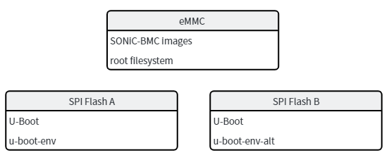
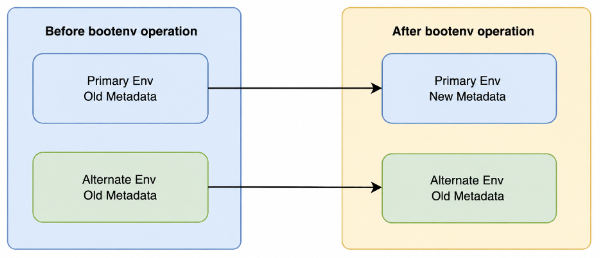
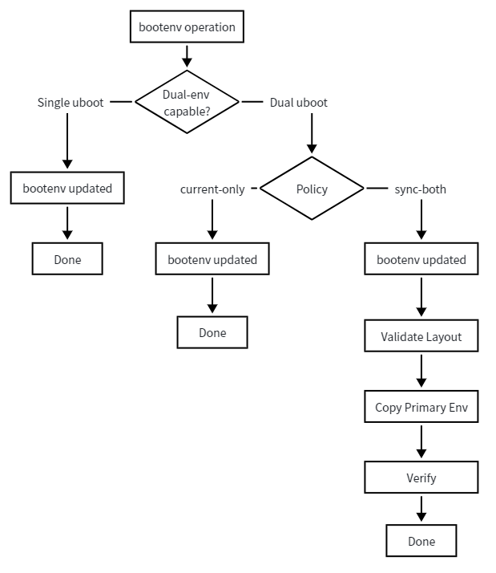

# Aspeed SONiC-BMC Dual U-Boot HLD

## Table of Contents

- [Aspeed SONiC-BMC Dual U-Boot HLD](#aspeed-sonic-bmc-dual-u-boot-hld)
  - [Table of Contents](#table-of-contents)
  - [Revision](#revision)
- [Scope](#scope)
  - [Definitions/Abbreviations](#definitionsabbreviations)
  - [1. Overview](#1-overview)
    - [1.1 Background](#11-background)
  - [2. Requirements](#2-requirements)
  - [3. Detailed Design](#3-detailed-design)
    - [3.1 Current Design](#31-current-design)
    - [3.2 Problem Statement](#32-problem-statement)
      - [Image Install or Upgrade](#image-install-or-upgrade)
      - [Image Remove](#image-remove)
      - [Next Boot or Boot Once Selection](#next-boot-or-boot-once-selection)
    - [3.3 Proposed Design](#33-proposed-design)
      - [3.3.1 Dual Environment Detection](#331-dual-environment-detection)
      - [3.3.2 Synchronization Flow](#332-synchronization-flow)
      - [3.3.3 Integration Points in Aspeed Framework](#333-integration-points-in-aspeed-framework)
      - [3.3.4 Failure Handling](#334-failure-handling)
  - [4. Configuration and Management](#4-configuration-and-management)
  - [5. Warmboot and Fastboot Design Impact](#5-warmboot-and-fastboot-design-impact)
  - [6. Memory Consumption](#6-memory-consumption)
  - [7. Restrictions/Limitations](#7-restrictionslimitations)
  - [8. Testing Requirements/Design](#8-testing-requirementsdesign)
    - [Test 1: Single U-Boot Environment](#test-1-single-u-boot-environment)
    - [Test 2: Dual U-Boot Environment Init](#test-2-dual-u-boot-environment-init)
    - [Test 3: Dual U-Boot Environment Install](#test-3-dual-u-boot-environment-install)
    - [Test 4: Dual U-Boot Environment Remove](#test-4-dual-u-boot-environment-remove)
    - [Test 5: Dual U-Boot Environment Next Boot](#test-5-dual-u-boot-environment-next-boot)
    - [Test 6: Error Handling](#test-6-error-handling)
  - [9. Open/Action Items](#9-openaction-items)

## Revision

| Rev | Date | Author | Change Description |
|:---:|:-----------:|:------:|--------------------|
| 0.1 | 2026-06-23 | Micas | Initial version |


# Scope

This document defines the design for synchronizing dual U-Boot environment partitions in the Aspeed SONiC-BMC framework under:

```text
sonic-buildimage/platform/aspeed
```

This HLD is limited to Aspeed SONiC-BMC platforms where:

- SONiC-BMC image content is stored on eMMC
- U-Boot and U-Boot environment are stored on SPI flash
- a dual SPI flash layout may expose both primary and alternate U-Boot environment partitions
- bootenv updates are performed through framework-managed community installation and management flows

This document does not define a generic solution for all SONiC platforms outside the Aspeed SONiC-BMC framework.

This document does not define factory production flashing or manufacturing burn flows unless those flows explicitly adopt the same framework-managed bootenv update mechanism.

## Definitions/Abbreviations

- `dual-env capable`: a platform where `/proc/mtd` contains both `u-boot-env` and `u-boot-env-alt`
- `current-only`: policy that updates only the current U-Boot environment
- `sync-both`: policy that updates the current U-Boot environment and synchronizes the alternate U-Boot environment
- `framework-managed operation`: a community installation or management flow within the Aspeed SONiC-BMC framework that updates bootenv

## 1. Overview

### 1.1 Background

On Aspeed SONiC-BMC platforms, SONiC-BMC runs from eMMC while U-Boot bootloader components are stored on SPI flash.

Some platforms use a dual SPI flash architecture.

The high-level storage relationship is shown below:



In this layout, `u-boot-env` stores persistent U-Boot environment variables that are consumed by the boot flow. Typical content includes:

- boot target selection, such as `boot_next` and `boot_once`
- image metadata, such as `image_dir`, `fit_name`, `sonic_version_1`, and `sonic_version_2`
- boot arguments, such as `linuxargs` and `bootcmd`

These variables determine which SONiC-BMC image is selected for boot and how the kernel boot parameters are constructed.

The Aspeed SONiC-BMC framework updates U-Boot environment variables through `fw_setenv` during image install, image removal, boot target changes, and initial U-Boot environment programming.

Today only the primary environment is updated. The alternate environment is not synchronized automatically.

As a result, bootenv-changing operations update only the active flash copy, while the alternate flash copy retains old boot metadata. This becomes a functional issue when the platform later boots from the alternate SPI flash, for example after watchdog-triggered switchover. This HLD focuses on the synchronization requirement for such dual-flash switchover scenarios.

As a result, `u-boot-env` and `u-boot-env-alt` may diverge over time.

On platforms with dual SPI flash, active boot source switchover is performed by the SoC watchdog mechanism. This HLD does not change the watchdog-based switchover mechanism itself. The purpose of this design is to keep bootenv metadata consistent across both flash copies so that switchover does not consume stale environment state.

## 2. Requirements

General requirements

- The Aspeed SONiC-BMC common framework shall detect whether both `u-boot-env` and `u-boot-env-alt` are present.
- The framework shall support a configurable bootenv synchronization policy with the values `current-only` and `sync-both`.
- If both environment partitions are present and the synchronization policy is `sync-both`, the framework shall synchronize the alternate environment.
- The synchronization shall happen at the completion of a framework-managed bootenv update operation.
- The design shall cover Aspeed framework flows that update bootenv through `fw_setenv`.
- The design shall not add a new systemd service.
- The design shall not add periodic synchronization logic.
- The design shall not change behavior for single-flash platforms.
- The design shall not require changes to U-Boot, `fw_setenv`, or `fw_printenv`.
- If the synchronization policy is not specified, the default behavior shall be `current-only`.

## 3. Detailed Design

### 3.1 Current Design

In the current framework, multiple common paths update U-Boot environment directly through `fw_setenv`.

Representative paths include:

- `platform/aspeed/platform_arm64.conf`
- `platform/aspeed/aspeed-platform-services/scripts/sonic-uboot-env-init.sh`
- `platform/aspeed/aspeed-platform-services/scripts/sonic-program-uboot-env.sh`

These flows update variables such as:

- `boot_next`
- `boot_once`
- `image_dir`
- `fit_name`
- `sonic_version_1`
- `sonic_version_2`
- `linuxargs`
- `bootcmd`

Current behavior on sonic-bmc is:



### 3.2 Problem Statement

When only the primary environment is updated, the alternate environment remains unchanged and retains stale boot metadata.

Representative inconsistency scenarios include:

#### Image Install or Upgrade

- Operation: install or upgrade image
- Updated variables: `image_dir`, `fit_name`, `sonic_version_1`, `linuxargs`
- Alternate env state: the alternate environment remains unchanged and still contains old image metadata
- Result: after switchover to the alternate SPI flash, boot uses stale image state

#### Image Remove

- Operation: remove image
- Updated variables: `boot_next`, `sonic_version_x`
- Alternate env state: the alternate environment remains unchanged and still references the removed image
- Result: after switchover to the alternate SPI flash, bootenv still contains invalid image metadata

#### Next Boot or Boot Once Selection

- Operation: set next boot target or boot once target
- Updated variables: `boot_next`, `boot_once`
- Alternate env state: the alternate environment remains unchanged and still carries the previous boot selection
- Result: after switchover to the alternate SPI flash, the boot target differs from the expected selection

This inconsistency becomes visible after flash switchover or recovery scenarios.

### 3.3 Proposed Design

The proposed design introduces a common Aspeed-side bootenv synchronization helper.

Framework-managed bootenv operations continue to update the primary environment through existing `fw_setenv` calls.

The design distinguishes hardware capability from synchronization policy:

- A platform is considered dual-env capable when both `u-boot-env` and `u-boot-env-alt` are present.
- A framework-managed operation selects a bootenv synchronization policy:
  - `current-only`
  - `sync-both`

If the platform is not dual-env capable, or if the policy is `current-only`, the operation follows `current-only` behavior.

At operation completion, the helper will:

1. detect whether an alternate environment exists
2. if dual environment is present and the policy is `sync-both`, copy the updated primary environment content to the alternate environment partition
3. verify that both copies are identical

In this design, an operation is a logically complete bootenv update action whose resulting state is intended to be consumed by a future boot flow.

Representative operations include:

- image install
- image remove
- set default image
- set next boot image
- first boot environment programming
- boot menu preparation as part of install or upgrade flow

#### 3.3.1 Dual Environment Detection

The framework shall detect dual environment support by parsing `/proc/mtd`.

Expected partition labels:

- `u-boot-env`
- `u-boot-env-alt`

Example:

```text
mtd1: 00020000 00010000 "u-boot-env"
mtd6: 00020000 00010000 "u-boot-env-alt"
```

For the scope of this HLD, `u-boot-env` and `u-boot-env-alt` are required layout labels for the primary and alternate U-Boot environment partitions. The dual-env detection mechanism relies on these exact labels. Platforms using different label definitions are outside the current auto-detection scope of this design.

Detection behavior:

- If both labels exist, the platform is treated as dual-env capable.
- If only `u-boot-env` exists, the framework keeps current behavior.
- Absence of `u-boot-env-alt` is not treated as an error.
- Failure to access the primary environment remains an update failure.

Synchronization enablement is determined separately from hardware capability:

- If the platform is dual-env capable and the policy is `sync-both`, alternate environment synchronization is enabled.
- If the platform is dual-env capable and the policy is `current-only`, the operation follows `current-only` behavior.
- If the policy is not specified, the default is `current-only`.

#### 3.3.2 Synchronization Flow

The synchronization model is copy-after-update, once per completed framework-managed operation.



The synchronization is performed on raw environment partition content rather than reconstructing variables one by one. This preserves the exact serialized state produced by `fw_setenv`, including CRC and on-flash environment layout, without requiring variable-by-variable replay.

Before copy, the helper validates that the primary and alternate environment partitions have the same partition size and erase size.

After copy, the helper performs byte-to-byte verification between the two environment partitions.

The helper serializes synchronization with a file lock so concurrent framework-managed operations do not interleave alternate environment copy and verification.

#### 3.3.3 Integration Points in Aspeed Framework

The synchronization helper shall be used by framework-managed bootenv update paths.

Representative integration points include:

- `platform/aspeed/aspeed-platform-services/scripts/sonic-program-uboot-env.sh`
- `platform/aspeed/install-sonic-to-emmc.sh`
- `platform/aspeed/platform_arm64.conf`
- `src/sonic-utilities/sonic_installer/bootloader/uboot.py`
- `platform/aspeed/aspeed-platform-services/scripts/sonic-sync-uboot-env.sh`

These integration points cover:

- bootenv programming during install and upgrade
- first-boot environment programming
- image slot metadata updates
- default boot target updates
- next-boot and boot-once updates

Factory production flashing and manufacturing burn flows are outside the current integration scope.

The design goal is:

```text
Any Aspeed common framework-managed operation that successfully updates
the primary U-Boot environment shall synchronize the alternate
environment only when the platform is dual-env capable and the
synchronization policy is set to `sync-both`.
```

#### 3.3.4 Failure Handling

The current helper behavior is as follows:

- If `u-boot-env` cannot be found in `/proc/mtd`, synchronization returns failure.
- If `u-boot-env-alt` is not present, synchronization is skipped and the helper returns success.
- If primary and alternate environment partitions do not have the same partition size or erase size, synchronization returns failure.
- If raw environment copy cannot be completed, synchronization returns failure.
- If byte-to-byte verification fails, synchronization returns failure.
- If synchronization completes successfully, the helper returns success.

Framework-managed shell paths treat synchronization failure as operation failure.

Python-based framework integration may invoke synchronization only when the synchronization helper is available.

This design is not transactional. If primary environment updates succeed and alternate synchronization later fails, the primary environment result is kept and the operation reports failure in the framework-managed shell paths.

## 4. Configuration and Management

This design introduces a configurable bootenv synchronization policy. The current HLD does not define a new CLI or management interface.

## 5. Warmboot and Fastboot Design Impact

No specific warmboot or fastboot design change is introduced by this HLD.

## 6. Memory Consumption

No notable steady-state memory consumption impact is introduced by this HLD.

## 7. Restrictions/Limitations

- This design applies only to framework-managed Aspeed SONiC-BMC bootenv update paths.
- Auto-detection relies on the exact partition labels `u-boot-env` and `u-boot-env-alt`.
- Factory production flashing and manufacturing burn flows are outside the current scope unless they explicitly adopt the same mechanism.

## 8. Testing Requirements/Design

### Test 1: Single U-Boot Environment

Description: Verify that bootenv update behavior remains unchanged when only the primary U-Boot environment exists.

Check:

- synchronization is skipped when `u-boot-env-alt` is absent
- primary environment update remains successful

### Test 2: Dual U-Boot Environment Init

Description: Verify that first-time framework-managed environment initialization synchronizes the alternate U-Boot environment when policy is `sync-both`.

Check:

- init operation completes successfully
- alternate environment is synchronized

### Test 3: Dual U-Boot Environment Install

Description: Verify that install flow synchronizes the alternate U-Boot environment at operation completion when policy is `sync-both`.

Check:

- install operation completes successfully
- alternate environment is synchronized

### Test 4: Dual U-Boot Environment Remove

Description: Verify that remove flow synchronizes bootenv updates to the alternate U-Boot environment when policy is `sync-both`.

Check:

- remove operation completes successfully
- alternate environment is synchronized

### Test 5: Dual U-Boot Environment Next Boot

Description: Verify that next-boot update synchronizes the alternate U-Boot environment when policy is `sync-both`.

Check:

- next-boot operation completes successfully
- alternate environment is synchronized

### Test 6: Error Handling

Description: Verify that synchronization failure is reported when the alternate environment update path encounters an error.

Check:

- operation reports synchronization failure
- failure is logged

## 9. Open/Action Items

None at this stage.
