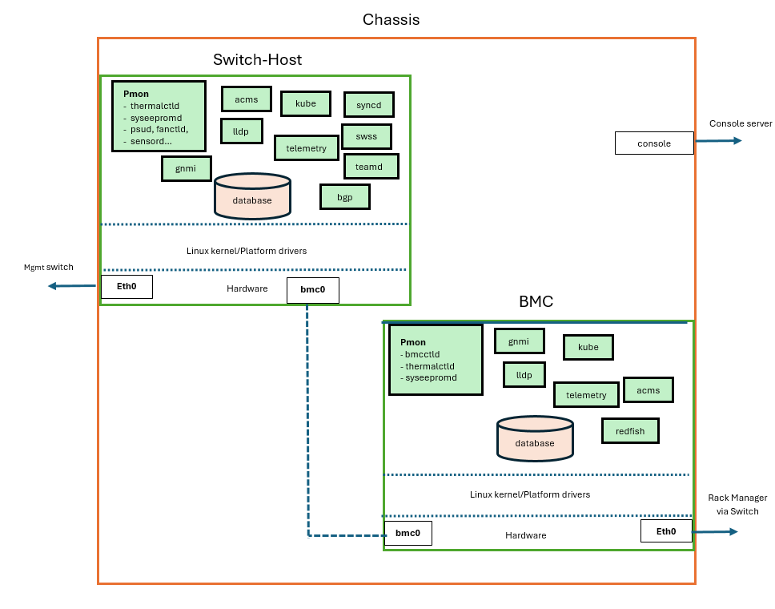
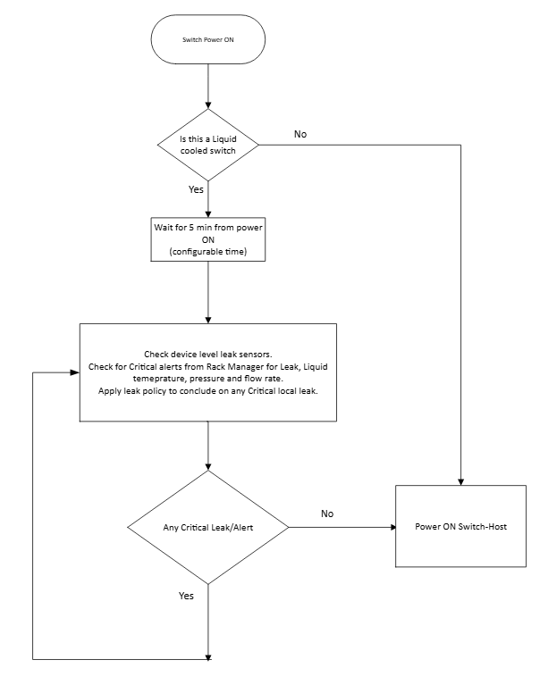
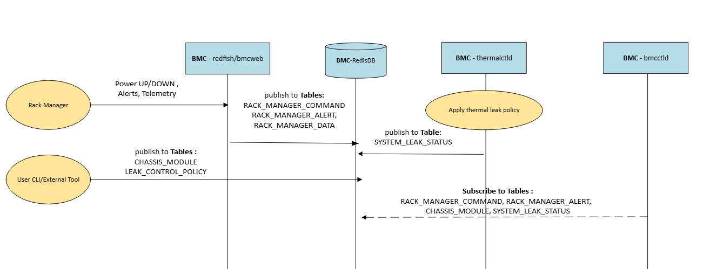
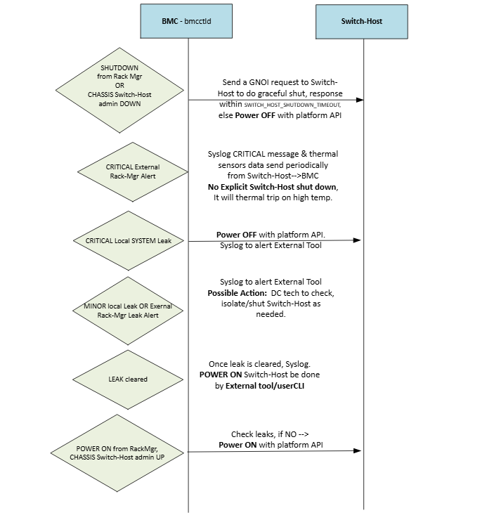
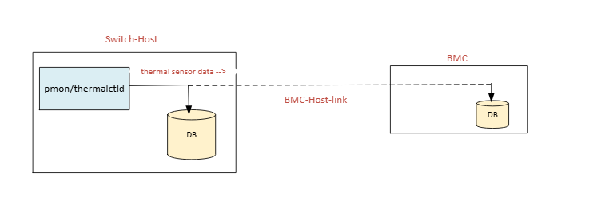

# SONiC BMC Platform Management & Monitoring #

# Table of Contents

  * [Revision](#revision)
  * [Scope](#scope)
  * [Acronyms](#acronyms)
  * [1. SONiC Platform Management and Monitoring](#1-sonic-platform-management-and-monitoring)
    * [1.1 Functional Requirements](#11-functional-requirements)
    * [1.2 BMC Platform Stack](#12-bmc-platform-stack)
  * [2. Detailed Architecture and Workflows](#2-detailed-architecture-and-workflows)
    * [2.1 BMC Platform](#21-bmc-platform)
      * [2.1.1 BMC platform power up](#211-bmc-platform-power-up) 
      * [2.1.2 BMC Rack Manager Interaction](#212-bmc-rack-manager-interaction)
        * [2.1.2.1 DB schema](#2121-db-schema)
      * [2.1.3 Host-Bmc-link](#213-host-bmc-link)
      * [2.1.4 BMC-Switch Host Interaction](#214-bmc-switch-host-interaction)
      * [2.1.5 BMC leak_detection_and_thermal policy](#215-bmc-leak-detection-and-thermal-policy)
      * [2.1.6 BMC event logging](#216-bmc-event-logging)
    * [2.2 BMC Platform Management](#22-bmc-platform-management)
      * [2.2.1 BMC controller-bmcctld](#221-bmc-controller---bmcctld)
        * [2.2.1.1 bmcctld on bmc](#2211-bmcctld-on-bmc)
      * [2.2.2 Thermalctld](#222-thermalctld)
        * [2.2.2.1 DB schema](#2221-db-schema)        
      * [2.2.3 Hw watchdog](#223-hw-watchdog)
      * [2.2.4 Platform APIs](#224-platform-apis)
    * [2.3 BMC CLI Commands](#23-bmc-cli-commands)
      * [2.3.1 Config commands](#231-config-commands)
      * [2.3.2 Show commands](#232-show-commands)
    * [2.4 Switch-Host and BMC platform management interaction](#24-switch-host-and-bmc-platform-management-interaction)
      * [2.4.1 pmon/thermalctld](#241-pmonthermalctld)
      * [2.4.2 CLI commands](#242-cli-commands)
    * [2.5 Firmware upgrade](#25-firmware-upgrade)
  * [3 Future Items](#3-future-items)

      
### Revision ###

 | Rev |     Date    |       Author                                                         | Change Description                |
 |:---:|:-----------:|:--------------------------------------------------------------------:|-----------------------------------|
 | 1.0 |             |       Judy Joseph                                                    | Initial version                   |


# Scope
This document provides design requirements and interactions between platform drivers and PMON for SONiC on BMC 

# Acronyms  
**BMC**          - Baseboard Management Controller.  
**Switch-Host** - Main board in network device which hosts the ASIC and CPU.  
**Chassis**   - Switch-Host & BMC as a unit called chassis.  
**Rack Manager** - Manager module for rack where switch is mounted.  
**Redfish**   - standard REST API for managing hardware.  
**PMON**    - Platform Monitor. Used in the context of Platform monitoring docker/processes.  

## 1. SONiC Platform Management and Monitoring
### 1.1. Functional Requirements
This section captures the functional requirements for platform capabilities in sonic BMC

General requirements
* BMC has a SONiC instance running independently of SONiC running in Switch-Host
* BMC can access Switch-Host redis DB over this internal Host-Bmc-Link and viceversa.
* BMC will manage the Switch Host to support operations like soft reboot, power up/down, power-cycle, get operational status.
* BMC and Switch-Host shall enable an independent Hw watchdog timer.
* BMC and Switch-Host can be power ON and OFF independently.
* BMC shall remain operational (UP) during system leak events, power or voltage faults affecting the host system, provided standby power rail remains available
* Firmware upgrade of components is done on Switch-Host or BMC based on who owns the component and what needs a reboot.

Liquid cooled sku requirements
* BMC will manage leak detection, read local leak sensors, its severity and enforces mitigation actions according to system-wide SONiC policy.
* BMC will get inputs from external Rack Manager on Inlet Liquid temperature, Inlet Liquid flow rate, Inlet Liquid Pressure and Rack level Leak. It takes action based on policy.  
* Switch-Host has thermalctld managing its thermal sensors and automatically power down when any sensor temperature exceeds the critical thresholds.

Air cooled sku requirements
* Switch-Host has thermalctld managing its thermal sensors and control the fan/cooling as done today.
    
### 1.2. BMC Platform Stack
The SONiC in BMC interoperate with the SONiC in Switch-Host as in below diagram.
 


## 2. Detailed Architecture and workflows
### 2.1 BMC platform
Update the vendor/platform/platform_env.conf with the following flags,
```
Switch_Host=1
Liquid_cooled=true
```
```
Switch_BMC=1
Liquid_cooled=true
```

"Liquid_cooled" flag is set to true on a liquid cooled switch.
"Switch_Host" flag is set to 1 on the switch host, "Switch_BMC" flag is set to 1 on the switch BMC.


#### 2.1.1 BMC platform power up
When device is powered ON, the BMC powers first, boots up the sonic BMC which starts the various cointainers   

If it is Air cooled switch the Switch-Host is powered on immediately.

If it is liquid cooled, the following actions are done before the Switch-Host is powered on.
* Check local system leaks and external Leaks if any reported by Rack Manager
* Send a POWER_ON command to Switch-host if all clear. 




#### 2.1.2 BMC - External Rack Manager Interaction
The new docker container "redfish" in sonicBMC will have openbmc/bmcweb service which terminates the redfish calls from the external Rack Manager Node.

**Note: Redish docker to be enabled only on Liquid cooling platform.**

Few of the URIs which needs to be supported in BMC are below,

    1. GET /redfish/v1   
             -- Rack Manager to get switchBMC type eg: "SONiCBMC"
    2. GET /redfish/v1/UpdateService/FirmwareInventory  
             -- Rack Manager to get switch firmware details
    3. POST /redfish/v1/Systems/System/Actions/ComputerSystem.Reset  
             -- Rack Manager to power off/on Main_cpu_switch_board
    4. POST /redfish/v1/Managers/Bmc/Oem/SONiC/RackManagerInterface/Actions/SONiC.SubmitAlert
             -- Rack manager to post a critical alert to BMC
    5. POST /redfish/v1/Managers/Bmc/Oem/SONiC/RackManagerInterface/Actions/SONiC.SubmitTelemetry
             -- Rack manager send periodic telemetry data of Inlet Liquid temperature, Inlet Liquid flow rate,
                Inlet Liquid Pressure, Leak information
    6. POST /redfish/v1/EventService/Subscriptions  
             -- Rack manager to subscribe for events like Leak from switchBMC.
             -- Leak sensor can be modelled under /redfish/v1/Chassis/BMC/ThermalSubsystem/LeakDetection/LeakDetectors/<ID>
             -- redfish server in BMC response back to https://<rack-mgr-ip>:<port>/Events or which ever "destination"
                Rack Manager sends in the event subscription request

#### 2.1.2.1 DB schema

Redis DB will be used to store the command/data send from external Rack manager for the platform daemons to act upon.

Rack Manager command and state
```
key                       = RACK_MANAGER_COMMAND|CMD_<command_id>         ; Commands from Rack Manager in STATE_DB in BMC
; field                   = value                                         ; e.g. ComputerSystem.Reset
command                   = POWER_ON | POWER_OFF
status                    = PENDING | IN_PROGRESS | DONE | FAILED         ; status of the command
result                    = SUCCESS | ERROR_CODE | STRING                 ; was the command successfull
timestamp                 = STR


key                       = RACK_MANAGER_STATE|rack-manager               ; STATE_DB on BMC to store rechability of RackManager
; field                   = value
reachability              = REACHABLE | UNREACHABLE
last_change_timestamp     = STR

```

Rack Manager alerts, it is triggered when there is a CRITICAL/MAJOR/MINOR event in Rack
```
key                       = RACK_MANAGER_ALERT|Inlet_liquid_temperature    ; Alert data from Rack Manager in STATE_DB
; field                   = value
severity                  = status                                         ;CRITICAL/MAJOR/MINOR
timestamp                 = STR

key                       = RACK_MANAGER_ALERT|Inlet_liquid_flow_rate      ; Alert data from Rack Manager in STATE_DB
; field                   = value
severity                  = status                                         ;CRITICAL/MAJOR/MINOR
timestamp                 = STR

key                       = RACK_MANAGER_ALERT|Inlet_liquid_pressure       ; Alert data from Rack Manager in STATE_DB
; field                   = value
severity                  = status                                         ;CRITICAL/MAJOR/MINOR
timestamp                 = STR

key                       = RACK_MANAGER_ALERT|Rack_level_leak             ; Alert data from Rack Manager in STATE_DB
; field                   = value
leak                      = status                                         ;CRITICAL/MAJOR/MINOR
leak_rope_break           = status                                         ;CRITICAL/MAJOR/MINOR
timestamp                 = STR
```

Rack Manager Telemetry data, it is pushed by Rack manager at regular intervals (eg: 60sec). 
* The usecase for this is to identify when the Critical alert is cleared. 
* This telemetry data will not be streamed out.

```
key                       = RACK_MANAGER_DATA|Inlet_liquid_temperature    ; Telemetry data from Rack Manager in STATE_DB
; field                   = value
InletTemperature          = float
unit                      = C
severity                  = status                                         ;CRITICAL/MAJOR/MINOR/NORMAL
timestamp                 = STR

key                       = RACK_MANAGER_DATA|Inlet_liquid_flow_rate      ; Telemetry data from Rack Manager in STATE_DB
; field                   = value
value                     = FLOAT
unit                      = gallons_per_min
severity                  = status                                         ;CRITICAL/MAJOR/MINOR/NORMAL
timestamp                 = STR

key                       = RACK_MANAGER_DATA|Inlet_liquid_pressure       ; Telemetry data from Rack Manager in STATE_DB
; field                   = value
value                     = FLOAT
unit                      = psi
severity                  = status                                         ;CRITICAL/MAJOR/MINOR/NORMAL
timestamp                 = STR

key                       = RACK_MANAGER_DATA|Rack_level_leak             ; Telemetry data from Rack Manager in STATE_DB
; field                   = value
leak                      = status                                         ;CRITICAL/MAJOR/MINOR/NORMAL
leak_rope_break           = status                                         ;CRITICAL/MAJOR/MINOR/NORMAL
timestamp                 = STR
```  

#### 2.1.3 Host-Bmc-Link
There is ethernet link between the Switch-Host and Switch-BMC ( eg: Ethernet over USB )

The BMC and Switch-Host will intialize the usb netdev dring the inital platform bringup and name it as bmc0.

IP address to be configured on the Switch-Host end and Switch-Bmc end can be defined sonic wide unique in file "files/image_config/constants/bmc.json" as below
```
{
    "bmc_if_name": "bmc0",
    "bmc_if_addr": "169.254.100.2",    #Address on Switch-Host end
    "bmc_addr": "169.254.100.1",       # Address on the BMC end
    "bmc_net_mask": "255.255.255.252"
}
```
A platform could override this ip-address/netmask by defining similar details in the file bmc.json in the vendor/platform directory.


#### 2.1.4 BMC-Switch Host Interaction
The Switch-Host and BMC communicate over the Host-Bmc-Link for accessing redis DB.

BMC controls the State of the Switch-Host based on various factors/events. Defining the various events, the start, final states of Switch-Host here,

|| Switch Host State (Start) | Event | Action | Switch Host State (Final) 
|--|---|---|---|---|
|1| ONLINE  | LOCAL_LEAK_CRITICAL_EVENT | Syslog, Power OFF Switch Host | OFFLINE 
|2| ONLINE  | RACK_MGR_CRITICAL_EVENT | Syslog this event + Syslog the thermal sensor data | ONLINE
|3| ONLINE  | RACK_MGR SHUTDOWN command | Syslog, graceful-shutdown Switch Host | OFFLINE
|4| ONLINE  | CHASSIS_MODULE admin_down user request | Syslog, graceful-shutdown Switch Host | OFFLINE 
|5| ONLINE  | LOCAL_LEAK_MINOR_EVENT | Syslog, External monitoring tool take action | ONLINE
|6| ONLINE  | RACK_MGR_MINOR_EVENT | Syslog, External monitoring tool to take action | ONLINE
|7| OFFLINE  | POWER ON request | Power ON Switch Host, Syslog | ONLINE

The BMC remains POWERED ON in all above scenarios.

#### 2.1.5 BMC Leak detection and thermal policy

The Leak detection is applicable only to Liquid cooling platform. The action is based on alerts from two different sources 

(i) Local leak detection uses the leak status in LIQUID_COOLING_DEVICE|leakage_sensors{X}.
    The result ( whether it is critical/minor ) will be updated in LEAK_STATUS table defined in [2.2.2.1 DB schema](#2221-db-schema)
        
(ii) External Rack manager alert status is updated by redfish/bmcweb in RACK_MANAGER_ALERT table defined in [2.1.2.1 DB schema](#2121-db-schema).
    
        
#### 2.1.6 BMC event logging

The general syslogs will be placed in /var/log/syslog where /var/log directory will be mounted on **tmpfs**. Syslogs will be sent to remote server as well.
The Leak, Switch-Host state and interactions, Rack-manager interactions will be persistently stored on disk/eMMC in "/host/bmc/event.log" with log rotation enabled.


### 2.2 BMC Platform Management

Switch-Host and BMC could be modeled as a "Module" using "ModuleBase" (https://github.com/sonic-net/sonic-platform-common/blob/master/sonic_platform_base/module_base.py)

**Pmon** is a critical container, it has the following daemons viz. thermalctld, syseepropmd, stormond. 

A new daemon **"bmcctld"** will be introduced to do power-control actions on Switch-Host based on either local system leaks, external rack-manager leak events/commands or admin-user power off/on commands.


#### 2.2.1 BMC controller - bmcctld

##### 2.2.1.1 bmcctld on BMC

The bmc controller daemon "bmcctld" is started first in BMC pmon container. It acts on the commands/alerts from External rack manager and local system leaks reported by 'thermalctld'.



Detailed workflow below

```
Sleep for BMC_BOOTUP_TIMEOUT (this is configurable value in config_db)
This is to make sure the Rack Manager is up and Liquid flow rate is good. 

Check for any CIRITICAL alert/leak in RACK_MANAGER_ALERT* tables or local SYSTEM_LEAK_STATUS table in STATE_DB
NO External/Local_System LEAK present
{
  - Check the oper_status of Switch-Host
    - if Switch-Host is Offline, Call the platform API to power ON the Switch-Host.
  - update the HOST_STATE|switch-host with the device_power_state.
}

Subscribe to RACK_MANAGER_COMMAND table, CHASSIS_MODULE table, RACK_MANAGER_ALERT* tables and SYSTEM_LEAK_STATUS table in STATE_DB 
On an Event 
  - if SHUTDOWN command from Rack manager
      - JUMP to --> **GRACEFUL_SHUT_DOWN_SWITCH_HOST:
      - update the HOST_STATE|switch-host with the device_power_state.
      - update RACK_MANAGER_COMMAND|CMD_<command_id> status to DONE or FAILED.

  - if POWER_ON request
      - Check for any CIRITICAL alert/leak in RACK_MANAGER_ALERT* tables or local SYSTEM_LEAK_STATUS table in STATE_DB
      - if NO LEAK, Call the platform API module->set_admin_state(UP) to power ON the Switch-Host
      - update the HOST_STATE|switch-host with the device_power_state.
      - update RACK_MANAGER_COMMAND|CMD_<command_id> status to DONE or FAILED.

  - if CHASSIS_MODULE admin_down request
      - JUMP to --> **GRACEFUL_SHUT_DOWN_SWITCH_HOST:
      - update the HOST_STATE|switch-host with the device_power_state.

  - if CRITICAL Local SYSTEM_LEAK event
      - SKIP if disabled in LEAK_CONTROL_POLICY table [2.3.1 Config commands](#231-config-commands)
      - Call the platform API module->set_admin_state(DOWN) to power OFF the Switch-Host
      - update the HOST_STATE|switch-host with the device_power_state.

  - if MINOR Local OR External-Rack-Mgr leak event
      - SKIP if disabled in LEAK_CONTROL_POLICY table [2.3.1 Config commands](#231-config-commands)
      - Syslog, and let the external monitoring Tool isolate the device.

  - if CLEAR of MINOR/CRITICAL Local AND External-Rack-Mgr leak
      - No Local action on BMC
      - POWER_ON to be controlled by an External tool/user CLI.


**GRACEFUL_SHUT_DOWN_SWITCH_HOST:
  - use GNOI framework to issue remote SOFT shutdown. The gnmi and sysmgr docker needs to be running on Switch-Host
    REF: https://github.com/sonic-net/SONiC/blob/master/doc/mgmt/gnmi/gnoi_system_hld.md, https://github.com/sonic-net/SONiC/pull/1489
  - start a timer based on shutdown_delay configured in SWITCH_HOST_SHUTDOWN_TIMEOUT|default table.
    - Timer expiry Handler, check the Switch-Host state using platform API.
  - if no response for GNOI request, call platform API module->set_admin_state(DOWN) to power down the Switch-Host
  - update the HOST_STATE|switch-host with the device_power_state.
  

```



###### DB schema
This section covers the various tables which this daemon creates/uses in Redis DB on BMC

```
key                       = BMC_BOOTUP_TIMEOUT|default   ; Config DB on BMC
; field                   = value
boot_delay                = float                        ; Time in secs after power on the device, switch BMC can power on the Switch-Host. ( default = 5 min ).   
                                                         ; If BMC receive POWER ON from Rack manager before this timeout + ther are no critical events, Switch-Host will be powered on

key                       = HOST_STATE|switch-host       ; STATE_DB on BMC to store state of Switch-Host
; field                   = value
device_power_state        = POWER_ON | POWER_OFF         ; What was the last action done on Switch-Host
device_status             = ONLINE | OFFLINE             ; current oper status of device, can use the platform API module->get_oper_state()
last_change_timestamp     = STR


key                       = SWITCH_HOST_SHUTDOWN_TIMEOUT|default ; Config DB on BMC
; field                   = value
shutdown_delay            = float                                ; Time in secs the BMC will wait after SHUTDOWN command send to Switch-Host. ( default = 2 min ).
                                                                 ; if this timer expires, BMC will go ahead and POWER OFF switch-host

```

#### 2.2.2 thermalctld
In Liquid cooled platform, thermalctld will skip the PSU, FAN, SFP thermals but have additional responsibilities to check leak sensors and apply leak policy.

There is a thread to check the leak sensors and store it in the LIQUID_COOLING_DEVICE table

```
Loop on this logic 
  (i) Check local leak sensors using platform API
         -- store the result in LIQUID_COOLING_DEVICE table
         -- Leak severity can either be CRITICAL or MINOR

```

The main thermalctld daemon will run the sonic thermal policy based on the number and severity of leak sensors with leak

```
    - Subscribe to LIQUID_COOLING_DEVICE to check if there is any change in leak sensor status 
    - Apply the System leak severity detection algorithm as below
       
       +--------------------------------------+-----------------------------+
       | Leak sensor data                     | System Local Leak Severity  |
       +--------------------------------------+-----------------------------+
       | 1 Critical leak                      |        CRITICAL             |
       | 2 or more leaks with any Severity    |        CRITICAL             |
       | 1 Minor leak stay leaking for MAX-T  |        CRITICAL             |
       | 1 Minor leak detected                |        MINOR                |
       +--------------------------------------+-----------------------------+

    - Additional considerations, the timers can be configured per leak sensor profile.
       - MAX-T mins defined before which a MINOR leak can be considered CRITICAL.

    - Update the local SYSTEM_LEAK_STATUS table with the severity of leak. This will be used in bmcctld process.

```
 
#### 2.2.2.1 DB schema

This LIQUID_COOLING_DEVICE table is already populated by thermalctld. New field **severity ** is introduced.
```
key                       = LIQUID_COOLING_DEVICE|leakage_sensors{X}  ; leak data in STATE_DB per sensor
 ; field                  = value
name                      = STR                                       ; sensor name
leaking                   = STR                                       ; Yes or No to indicate leak status
leak_sensor_status        = STR                                       ; Is Leak sensor good or faulty.
type                      = STR                                       ; leak sensor type
location                  = STR                                       ; leak sensor location
severity                  = "status"                                  ;CRITICAL/MINOR

key                       = LEAK_PROFILE|<sensor_type>                ; LEAK profile per leak sensor type in CONFIG_DB
; field                   = value
leak_type                 = STR                                       ; Leak sensor type
max_minor_duration_sec    = float                                     ; MAX-T mins defined before which a MINOR leak can be considered CRITICAL


key                       = SYSTEM_LEAK_STATUS|local                  ; local bmc leak status in STATE DB
; field                   = value
device_leak_status        = "status"                                  ;CRITICAL/MINOR
timestamp                 = STR                                       ; timestamp when this status is recorded.
```     

#### 2.2.3 Hw watchdog
Hw watchdog timers will be enabled on both Switch-Host and BMC. 
This will do a CPU reset when OS hangs or becomes unresponsive and fails to service the watchdog

#### 2.2.4 Platform APIs

# Platform APIs Used

Listing down the platform APIs both already defined and newly planned for sonic bmc support. 

Reference doc:
* https://github.com/sonic-net/SONiC/blob/master/doc/bmc/leakage_detection_hld.md 


####  LeakageSensorBase
This base class is already defined in sonic-platform-common. Additional new platform APIs defined.

| Method | Present | Action |
|---------|---------|----------|
| get_name() | Y | Get leak sensor name |
| is_leak() | Y | Is there a leak detected? **Applies debounce logic before reporting or clearing a leak** |
| is_leak_sensor_ok() | New | Is the leak sensor OK or faulty ? |
| get_leak_sensor_type() | New | What type of leak sensor is this rope, flex, spot etc |
| get_leak_sensor_location() | New | Location of leak sensor |
| get_leak_severity() | New | Get the severity based on the criticality of the zone |
| get_leak_profile() | New | Returns the leak sensor profile associated with this sensor |


#### LeakSensorProfileBase
This base class is for getting the platform specific leak sensor profile

| Method | Present | Action |
|---------|---------|----------|
| get_leak_max_minor_duration_sec() | New | Get MAX time before which a minor leak can be marked CRITICAL |


#### LiquidCoolingBase
This base class is already defined in sonic-platform-common. 

| Method | Present | Action |
|---------|---------|----------|
| get_num_leak_sensors() | Y | Get number of leak sensors |
| get_leak_sensor(index) | Y | Get per-leak-sensor status |
| get_leak_sensor_status() | Y | Get all leak sensor status |
| get_all_leak_sensors() | Y | Get list of all leak sensors |


####  ModuleBase
This base class is already defined in sonic-platform-common.
Switch-Host can be modelled as a Module object and the APIs to control power on/off/cycle the Switch-Host are as below,

| Method | Present | Action |
|---------|---------|----------|
| set_admin_state(up=True) | Y | Power ON Switch Host from standby/off |
| set_admin_state(up=False) | Y | Power OFF Switch Host |
| get_oper_state() | Y | Fetch the operational state of Switch-Host|
| do_power_cycle() | New | Power cycle Switch Host|


Sample Implementation for BMC


```

device/<vendor>/<platform>/sonic_platform/
  __init__.py
  chassis.py
  switch_host_module.py


switch_host_module.py:

  from sonic_platform_base.module_base import ModuleBase
  class SwitchHostModule(ModuleBase):
    def __init__(self, index):
        super().__init__()
        self._index = index


chassis.py:

  from sonic_platform_base.chassis_base import ChassisBase
  from .switch_host_module import SwitchHostModule
  class Chassis(ChassisBase):
    def __init__(self):
        super().__init__()

        # Create Switch Host module object
        self._switch_host_module = SwitchHostModule(index=0)

    def get_all_modules(self):
        return [self._switch_host_module]


Use it in sonic_platform_daemons:

  from sonic_platform import chassis
  platform_chassis = chassis.Chassis()
  modules = platform_chassis.get_all_modules() // In sonic BMC, this API should return two modules (i) BMC module itself. (ii) Switch-Host module.

```

---

####  ChassisBase
This base class is already defined in sonic-platform-common.

| Method | Present | Action |
|---------|---------|----------|
| get_all_modules() | Y | Fetch managed modules [BMC module object, Switch-Host Module object] |


### 2.3 BMC CLI Commands

Following is the config and show CLI commands which are either newly added or needs a change to support BMC.
The keywords LC:Liquid Cooled , AC:Air Cooled is used to denote which sku these CLIs are applicable.

#### 2.3.1 Config commands

* config chassis modules startup/shutdown <Switch-Host>

CLI to enable user to graceful power on/off the Switch-Host. 
Applicable to (LC, AC)

```
config chassis modules startup <Switch-Host>
   - This command is to POWER ON the Switch Host from BMC

config chassis modules shutdown <Switch-Host>
   - This command is to graceful POWER OFF the Switch Host from BMC

```


##### DB schema

```
    "CHASSIS_MODULE": {
        "SWITCH-HOST": {
            "admin_status": "up"
        }
    }    
```

* config liquidcool leak-control

CLI to control the Local leak, Rack-Manager leak policy enforcement
Applicable to (LC)

```
config liquidcool leak-control [local|rack_mgr] [enabled|disabled]
   - This command helps user to enable and disable local/rack-mgr-external leak policy application in BMC
   - Default is enabled.
```

##### DB schema

```
  "LEAK_CONTROL_POLICY": {
      "local_system_leak_policy": "enabled"
      "rack_mgr_leak_policy": "enabled"
  }

```

##### 2.3.2 Show commands 

* show version 

This command to display the Serial number of both BMC and Switch-Host. 
There is a new field named "Switch-Host Serial Number" which will show the Switch serial number

```
show version 

.....
ASIC Count: 1
Serial Number: <BMC serial number>
Switch-Host Serial Number: <Switch serial number>
Model Number: <>
...

```

* show chassis module status
 
Command to show the status of BMC and Switch-Host(using the platform API module->get_oper_state())
 
Applicable to (LC, AC)

```
show chassis module status
        Name             Description   oper status       Serial
------------  ----------------------  -------------  -----------
         BMC   Board Management Card         Online           <>
 Switch-Host      Switch Host System        Offline           <>


```

* show platform leak control_policy

Command to show leak control policy configuration
Applicable to (LC)

```

show platform leak control_policy
 local_system_leak_policy : enabled
 rack_mgr_leak_policy : enabled

```

* show platform leak rack-manager alerts

Command to show leak rack-manager alerts
Applicable to (LC)

```
show platform leak rack-manager alerts
 - Display the RACK_MANAGER_ALERT table contents

```

* show platform leak profiles

Command to show the leak profiles in system
Applicable to (LC)

```
show platform leak profiles
 - Display the LEAK_PROFILE table contents

```

* show platform leak status

Command to display leak will be enhanced with more fields
Applicable to (LC)

```
show platform leak status
Name             Leak  Leak-sensor-status leak-sensor-type leak-severity
---------      ------- ------------------- ---------------- -------------
leak_sensors1    NO           OK                 rope           NA
leak_sensors2    NO           FAULTY             rope           NA
...
leak_sensorsX    Yes          OK                 flex           CRITICAL

```

* show platform temperature

Command to display thermals on the Switch-Host in BMC
Applicable to (LC, AC)

```
show platform temperature
             Sensor    Temperature    High TH    Low TH    Crit High TH    Crit Low TH    Warning          Timestamp
-------------------  -------------  ---------  --------  --------------  -------------  ---------  -----------------
 Thermal sensor1         26.375         90         0             100             -15      False       20260319 22:46:58
 Thermal sensor2         23.5           90         0             100             -15      False       20260319 22:46:58
 Thermal sensor3         35.125         90         0             100             -15      False       20260319 22:46:58
```


#### 2.4 Switch-Host and BMC platform management interaction

There are following enhancements planned in pmon running on SONiC in Switch-Host

##### 2.4.1 pmon/thermalctld

The thermalctld daemon will sent the thermal sensors polled and stored locally in redis-DB to redis-DB in the BMC also.

BMC would use this thermal data to record the critical thermal deviation which can be used to either
   (i) syslog which could be used for alert 
   (ii) take action like shut the Switch-Host proactively before Switch-Host will be shutdown by hardware thermal trip.

**Note:** In first phase we will just syslog the thermel sensor deviation in BMC event log and not trigger any action.




##### 2.4.2 CLI commands

All SONiC commands are supported on Switch-Host. The following command needs enhancement.

* show reboot-cause history

Enhance the reboot reason to include the shutdown/powercycle commands from BMC 
Applicable to (LC, AC)

```
show reboot-cause history 
Name                 Cause                                                                 Time                             User    Comment
-------------------  --------------------------------------------------------------------  -------------------------------  ------  ---------
2026_03_18_04_38_17  reboot                                                                Wed Mar 18 04:37:21 AM UTC 2026  admin   N/A
2026_03_18_02_06_06  shutdown from BMC                                                     Wed Mar 18 02:05:12 AM UTC 2026  admin   N/A
2026_03_18_02_06_06  powercycle from BMC                                                   Wed Mar 18 02:05:12 AM UTC 2026  admin   N/A
....

```


#### 2.5 Firmware upgrade

Firmware upgrade of components is done on Switch-Host or BMC (based on who owns the component, eg: Leak CPLD could be owned and upgraded from BMC).
The upgrade process could be either during sonicimage-install or using fwutil cli.

Below is a sample reference,

| Firmware upgrade   |      Switch-Host reboot    |     BMC reboot     | Who does FW upgrade |
|--------------------|----------------------------|--------------------|---------------------|
| BMC Uboot          |         No                 |         Yes        |    BMC              |
| CPU CPLD           |         Yes                |         Yes        |    Switch-Host      |
| Leak CPLD FW       |         No                 |         Yes        |    BMC              |
| Switch FPGA/CPLD   |         Yes                |         No         |    Switch-Host      |

In case of a firmware upgrade which needs reboot of both Switch-Host and BMC, will do a FW upgrade on Switch-Host during a maintenance window. 


## 3 Future Items
