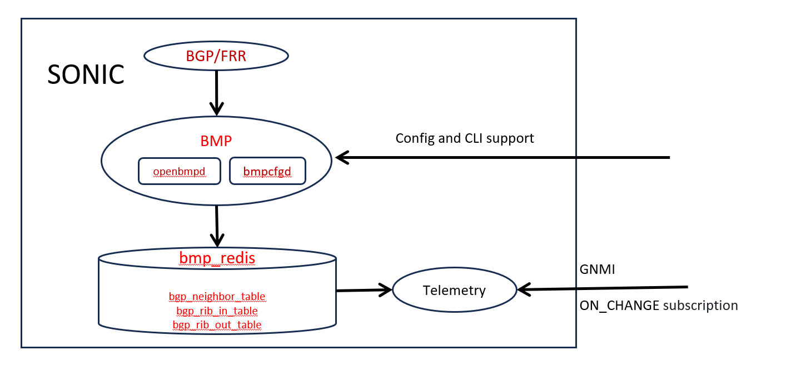
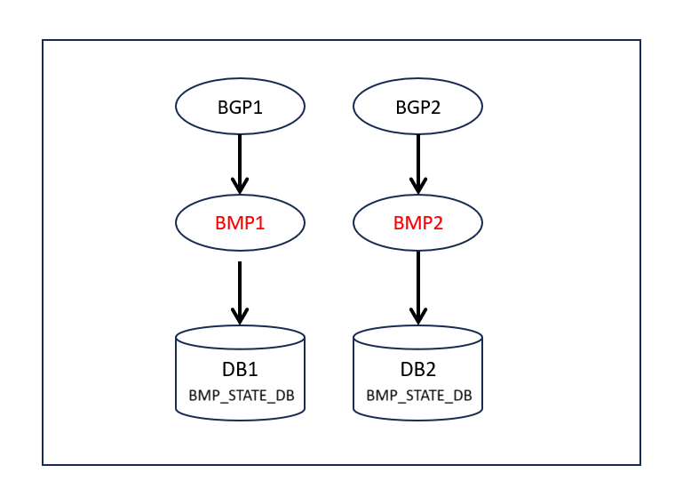
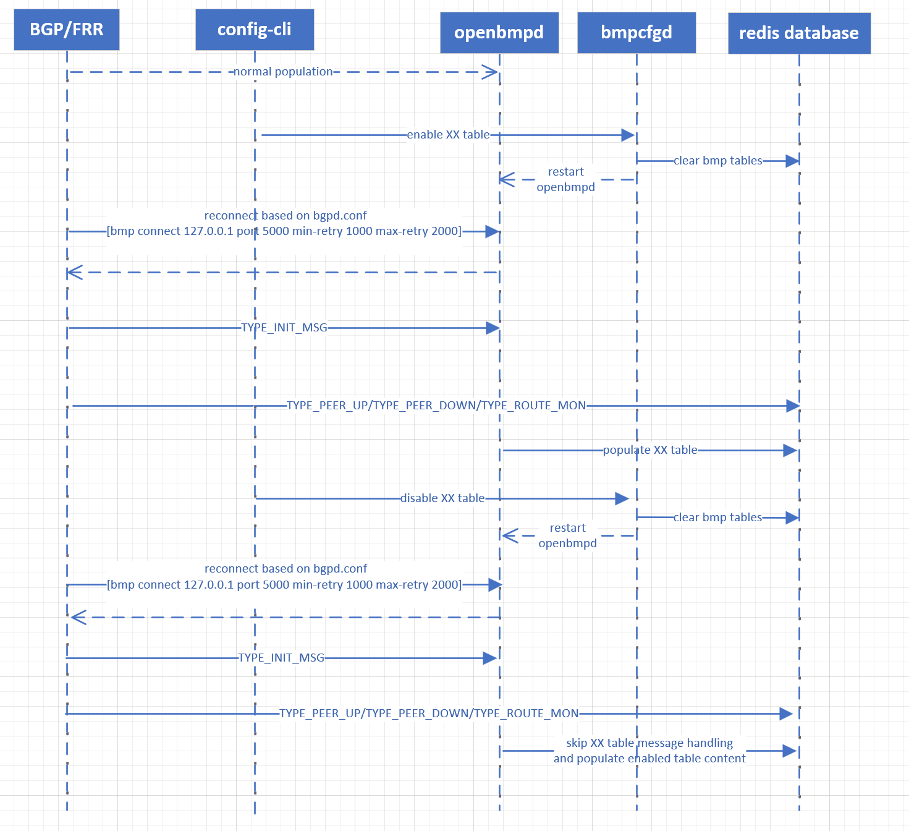

# BMP for monitoring SONiC BGP info
## High Level Design Document
### Rev 0.1

# Table of Contents

  * [Revision](#revision)

  * [About this Manual](#about-this-manual)

  * [Definitions/Abbreviation](#definitionsabbreviation)
 
  * [1 Requirements Overview](#1-requirements-overview)
    * [1.1 Functional requirements](#11-functional-requirements)
    * [1.2 CLI requirements](#12-cli-requirements)
    * [1.3 Scalability and Default Values](#13-scalability-and-default-values)
    * [1.4 Warm Restart requirements ](#14-warm-restart-requirements)
  * [2 Architecture Design](#2-architecture-design)
    * [2.1 High-Level Architecture](#21-high-level-architecture)
    * [2.2 OpenBMP](#22-openbmp)
    * [2.3 BGP/FRR Update](#23-bgp/frr-update) 
    * [2.4 Database Design](#24-database-design)
    * [2.5 BMP Agent](#25-bmp-agent)
    * [2.6 GNMI support](#26-gnmi-support)
  * [3 CLI](#3-cli)
  * [4 Resource usage and Test plan](#4-resource-usage-and-test-plan)

###### Revision

| Rev |     Date    |       Author       | Change Description                |
|:---:|:-----------:|:------------------:|-----------------------------------|
| 0.1|  02/20/2024  |     Feng Pan       | Initial version                   |


# About this Manual
This document will propose to bring up BMP container on SONiC, which is forked from openbmp project with some code changes, by that we could improve the SONiC debuggability and BGP service monitoring efficiency.

# Definitions/Abbreviation

| **Term**                 | **Meaning**                         | **Link**                         |
|--------------------------|-------------------------------------|--------------------------|
| BMP                      | BGP Monitor Protocol                |https://datatracker.ietf.org/doc/html/rfc7854 |
| OpenBMP                  | Open Source BGP Monitoring Protocol (OpenBMP) Collection Framework    |https://github.com/SNAS/openbmp|
| BGP/FRR                  | SONiC BGP container and bgpd daemon which will collborate with BMP here   |https://github.com/sonic-net/sonic-frr|
| GNMI                     | gRPC Network Management Interface   |https://github.com/openconfig/gnmi|


# 1 Requirements Overview

## 1.1 Functional requirements

Now SONiC supports standard BGP session established with BGP neighbors, but there's only limited BGP info readable in database, which makes some cases difficult to debug, we need to dump more BGP data, meanwhile we're also expecting some live debug option which could dump BGP related info on demand and improve the debuggability.

At a high level the following data should be supported:

- BGP neighbor table, especially capability like MPBGP support, graceful_restart support, etc
- BGP in and out RIB table, now only ifname and nexthop are available in ROUTE_TABLE, more data like as_path/asn/origin... and in/out rib info need to be added.
- Number of prefixes received and sent.

Moreover, now if we want to monitor BGP session data of SONiC, now we need to create standard BGP session with SONiC device, the restriction is that the data monitored is not identical with the data which SONiC converses with neighbors. With BMP data being available on SONiC, we should be able to monitor more BGP live data. 

As a result of this implementation, BGP listeners should be able to use StreamingTelemetry "on change" subscription channel, which is state based monitoring and more efficient than operation based monitoring as BGP standard session.


## 1.2 CLI requirements
- Use Config cli to enable bmp table population as granularity of table
- Use show to query specific bmp table data

## 1.3 Scalability and Default Values

As a phase #1 scalability requirement, the proposed support is to have bgp neighbor table enabled by default, considering the device set like 7050qx (4G RAM), but it should be based on final evaluation, more details will be discussed in [4 Resource usage and Test plan](#4-resource-usage-and-test-plan)


## 1.4 Warm Restart requirements
No special handling for Warm restart support.

# 2 Architecture Design

The following are the architecture changes. 

## 2.1 High-Level Architecture
As above context mentioned, we need to bring up new container as bmp on SONiC, after change the relevant component architecture is as below:
  

- Add new bmp container, it has two daemons: bmpcfgd to monitor config db change and control corresponding table that openbmpd populates; openbmpd to accept connection from FRR and do bgp related table specific population.

- Update existing frr/bgpd daemon and enable bmp feature to collect bgp data.

- BMP will support both config and CLI, which can enable database population per table type population by default and in runtime.

- User could use StreamingTelemetry path to monitor bgp table via [The GNMI protobuf](#https://github.com/openconfig/gnmi/blob/5473f2ef722ee45c3f26eee3f4a44a7d827e3575/proto/gnmi/gnmi.proto#L309 )

## 2.2 OpenBMP
[OpenBMP](#https://www.openbmp.org/) is open source BGP monitor framework, which supports bgp collecting, aggregating, data persistence, as well as dashboard/monitor/alert, etc. For this project, we will fork this project with some internal code changes which populates the required data into Redis for our usage.

## 2.3 BGP/FRR update
Current BGP container in SONiC uses an implementation [sonic-frr](#https://github.com/sonic-net/sonic-frr/) forked from [FRR](#https://github.com/FRRouting/frr/), which supports BMP protocol from version frr/7.2


### Config file update
Below section needs to be added into /etc/frr/bgpd.conf, so that FRR could be able to find assigned collector endpoint and report bgp data via bmp channel.

```
!
  bmp mirror buffer-limit 4294967214
!
  bmp targets sonic-bmp
  bmp stats interval 1000
  bmp monitor ipv4 unicast pre-policy
  bmp monitor ipv6 unicast pre-policy
  bmp connect 127.0.0.1 port 5000 min-retry 1000 max-retry 2000
!
```

### Daemon parameter
From version frr/7.2, bgpd daemon supports parameter to enable bmp functionality, we need to adjust BGP docker init relevant script and turn on bmp collection option.

```
/usr/lib/frr/bgpd -A 127.0.0.1 -M bmp 
```

## 2.4 Database Design

BMP will create new redis instance and populate new table as BMP_STATE_DB, so that existing database population will not be impacted by BMP redis I/O operation, in some cases rib table will be large potentially.

Like below, please note that multiple ASIC will also be supported in this feature. since multiple ASIC uses multiple database instances according to ASIC index, the same logic is still applied in this project.
There will be multiple BMP container instance according to BGP container instance, and populate the BGP data received from its paired BGP container.


|DB name    |   DB No. |     Description|
|  ----     |:----:| ----|
|BMP_STATE_DB    |  specific ASIC indexed DB per BGP container |   BMP neighbor running data |

  

### BGP Neighbor table schema

This table will capture BGP Neighbor attributes supported on BGP neighbor, including capability it support.

```
admin@bjw-can-3800-1:~$ redis-cli -n 20 -p 6400 HGETALL "BGP_NEIGHBOR_TABLE|10.0.0.23"
 1) "sent_cap"
 2) "MPBGP (1) : afi=1 safi=1 : Unicast IPv4, Route Refresh Old (128), Route Refresh (2), Route Refresh Enhanced (70), 4 Octet ASN (65), 6, ADD Path (69) : afi=1 safi=1 send/receive=1 : Unicast IPv4 Receive, 73, Graceful Restart (64), 71"
 3) "local_asn"
 4) "65100"
 5) "peer_addr"
 6) "10.0.0.23"
 7) "recv_cap"
 8) "MPBGP (1) : afi=1 safi=1 : Unicast IPv4, Route Refresh (2), Graceful Restart (64), 4 Octet ASN (65), ADD Path (69) : afi=1 safi=1 send/receive=1 : Unicast IPv4 Receive"
 9) "local_ip"
10) "10.0.0.22"
11) "remote_port"
12) "179"
13) "peer_asn"
14) "65200"
15) "peer_rd"
16) "0:0"
17) "local_port"
18) "40760"
```

### Rib table schema
Rib table will capture all BGP rib-in and rib-out data per neighbor and per nlri.

BGP rib-in data for neighbor 10.0.0.13 and nlri 192.172.80.128/25
```
admin@bjw-can-3800-1:~$ redis-cli -n 20 -p 6400 HGETALL "BGP_RIB_IN_TABLE|192.172.80.128/25|10.0.0.13"
 1) "origin"
 2) "igp"
 3) "as_path"
 4) "65100 64600 65534"
 5) "as_path_count"
 6) "3"
 7) "origin_as"
 8) "65534"
 9) "next_hop"
10) ""
11) "local_pref"
12) "0"
13) "community_list"
14) ""
15) "ext_community_list"
16) ""
17) "large_community_list"
18) ""
19) "originator_id"
20) ""
```

BGP rib-out data for neighbor 10.0.0.13 and nlri 192.172.80.128/25
```
admin@bjw-can-3800-1:~$ redis-cli -n 20 -p 6400 HGETALL "BGP_RIB_OUT_TABLE|192.172.80.128/25|10.0.0.13"
 1) "origin"
 2) "igp"
 3) "as_path"
 4) "65100 64600 65534"
 5) "as_path_count"
 6) "3"
 7) "origin_as"
 8) "65534"
 9) "next_hop"
10) ""
11) "local_pref"
12) "0"
13) "community_list"
14) ""
15) "ext_community_list"
16) ""
17) "large_community_list"
18) ""
19) "originator_id"
20) ""
```


## 2.5 BMP Agent
As [2.2 OpenBMP](#22-openbmp) shown, We need to fork and update code in [OpenBMPd](#https://github.com/SNAS/openbmp/tree/master/Server/). OpenBMP supports BMP protocol collecting by openbmpd agent. Thus in this project we will only need openbmpd agent role, and add redis population when monitoring BGP data from BGP container.

Below picture is referenced from [OpenBMPFlow](#https://www.openbmp.org/#openbmp-flow/), refer the part in <span style="color: red;">red</span> circle, which is the daemon we need to update in this porject.

  


### BMP message handling workflow
With source code of openbmpd, we need to update code in message parser and populate redis with specific table required, this should be controlled in runtime by CLI (as more details in below section). Here following the straightforward option, whenever FRR launches TYPE_INIT_MSG to BMP, BMP will just clear redis relevant table to keep the data consistency, since following the TYPE_INIT_MSG, all BGP relevant data will be reSynced from FRR.

  

### BMP cli handling workflow
(TBD) Currently FRR just post data to BMP following standard BGP protocol, thus neighbor table will be sent in BGP_MSG_OPEN message (#https://datatracker.ietf.org/doc/html/rfc4271#page-13) and all other tables including rib/ls_state... will be sent in BGP_MSG_UPDATE. In below diagram, once we disable some table we just skip the message handling in BMP Agent, but ideally the data should not be sent from FRR side. A better option is to update in FRR side and controlled by the cli together, so that no extra data is transmitted between FRR and BMP.



### Delay-removal
There will be data flapping if BGP/FRR connection to BMP is not stable, or even some flapping occurs in BGP side. In order to optimize this scenario handling. Below delay-removal algo could be used internally.

1. When FRR connects to the BMP server with TYPE_INIT_MSG and sends BGP session updates, instead of immediately removing the entire table from Redis, just rename the entity with "DEL-" added as prefix, and mark down the timestamp as attributes.
2. Maintain a timer or counter to keep track of the elapsed time since the last update received from FRR.
3. Set a threshold or predefined delay period for considering a BGP session update as stale or removed. For example, you can define that a BGP session update is considered stale if it has not been updated within a specific time interval (e.g., 3 minutes).
4. Periodically check the timestamp of the BGP session updates stored in table. If the elapsed time since the last update exceeds the threshold defined in step 3, remove the entity finally.
5. Once re-adding the table with the new data sent by FRR arrives, check if "DEL-" entity exists and erase timer for data refreshed.

This ensures data consistency and minimizes unnecessary table flapping.


### Config DB schema

Create new config db table as below to contain config list for bmp.

```
   127.0.0.1:6379[4]> keys BMP*
   1) "BMP|table"
```

Create below config items list for enabling and disabling different table.

```
   127.0.0.1:6379[4]> HGETALL FEATURE|bmp
   1) "bgp_rib_in_table"
   2) "true"
   3) "bgp_neighbor_table"
   4) "true"
   5) "bgp_rib_out_table"
   6) "true"

```

### Full Dataset supported

[OpenBMP dataset](https://github.com/SNAS/openbmp/blob/master/docs/MESSAGE_BUS_API.md#message-api-parsed-data), we can find full dataset info as reference here which is Kafaka based TSV message, however, we will not follow it's format when populats the redis database, the data format we use is decalred [2.4 Database Design](#24-database-design)


## 2.6 GNMI support
After bmp populates data into database, current BGP data could be monitored via GNMI channel. Listeners should be able to use StreamingTelemetry "on change" subscription channel, which is state based monitoring and more efficient than operation based monitoring as BGP standard session. However, current sonic-gnmi needs to be updated for supporting heartbeat feature. Below is design doc for the feature which will be implemented later.

[heartbeat feature design](https://github.com/sonic-net/SONiC/pull/1563)

# 3 CLI

bmp will support below config CLIs to enable/disable specific table population in runtime:

```
1. Command: `config bmp enable bgp-neighbor-table`  
   - Description: Enable the BGP neighbor table.  
   - Result: reset FRR connection and populate BGP_NEIGHBOR_TABLE table
   
2. Command: `config bmp disable bgp-neighbor-table`  
   - Description: Disable the BGP neighbor Capability table.  
   - Result: erase BGP_NEIGHBOR_TABLE table and stop table population
   
3. Command: `config bmp enable bgp-rib-out-table`  
   - Description: Enable the BGP rib advertised table to all neighbors.  
   - Result: reset FRR connection and populate BGP_RIB_OUT_TABLE table

4. Command: `config bmp disable bgp-rib-out-table`  
   - Description: Disable the BGP rib advertised table to all neighbors.  
   - Result: erase BGP_RIB_OUT_TABLE table and stop table population
   
5. Command: `config bmp enable bgp-rib-in-table`  
   - Description: Enable the BGP rib received table from all neighbors.  
   - Result: reset FRR connection and populate BGP_RIB_IN_TABLE table

6. Command: `config bmp disable bgp-rib-in-table`  
   - Description: Disable the BGP rib received table from all neighbors.  
   - Result: erase BGP_RIB_IN_TABLE table and stop table population
 
```

bmp will support below show CLIs to query specific table in runtime:

```
1. Command: `show bmp bgp-neighbor-table`  
   - Description: Show BGP neighbor table for all neighbors.  
   - Result: Query BGP_NEIGHBOR_TABLE table and show result in human readable format.
   
2. Command: `show bmp bgp-rib-out-table`  
   - Description: Show BGP routes advertised table for all neighbors.  
   - Result: Query BGP_RIB_OUT_TABLE table and show all session data.

3. Command: `show bmp bgp-rib-in-table`  
   - Description: Show BGP routes received table for all neighbors.  
   - Result: Query BGP_RIB_IN_TABLE table and show all session data

4. Command: `show bmp tables`  
   - Description: Show all table status like enable or disable so that user could operate correctly.  
   - Result: Query and show config db status for all table enablement

```


# 4 Resource usage and Test plan

### Resource usage
Since BMP is a sidecar daemon for improve the SONiC debuggability and monitor efficiency, we don't expect it take too much CPU usage, and prefer it could be able to work under low priority but without break. Now FRR to openbmp is working under push model, if limit cpu of bmp into 5%, it just operate slow, but without missing update, when we flap the bgp several times, all the flap updates will pushed to bmp finally. Thus we should be able to restrist CPU of BMP to lower priority without

Brief memory usage per table by test evaluation

|  Table               |  Memory                         |
|--------------------------|--------------------------------|
| Neighbor table       | 400B per neighbor  |
| RIB table | 4M per neighbor |

### Test plan

#### Auto test
Mock up FRR agent and send BGP data to BMP, test the hooking mechanism by verifying below cases:
1. Verify BMP successfully captures the BGP data from the data sources.
2. Verify that the captured BGP data is correctly transformed and formatted before being populated into Redis.
3. Data validation to ensure that the data transformation and population processes are functioning as expected.
4. Simulate various BGP updates, such as route advertisements, route withdrawals, and neighbor state changes. And verify BGP data is handled by BMP as expected.
5. Verify CLIs to enable/disable table population and data is consistent in redis correctly.
6. Simulate error conditions, such as network failures, Redis connection issues, or malformed BGP data, and verify that the system handles these errors gracefully. and test the resilience and error recovery mechanisms of BMP and Redis integration.

#### Performance test
Use below case to test performance under bgp flapping, which is extreme scenario for performance evaluation.

```
./run_tests.sh -c route/test_default_route.py::test_default_route_with_bgp_flap
```

1. Redis table could get full dataset after bgp flapping. 
2. Low frequency routing change should be notified to redis in real time, like BGP neighbor up/down, route advertise/withdraw.
3. High frequency routing change like flapping should not be notified to redis within delay-removal interval.
4. bgp flapping case could work with GNMI OnChange mode subscription.
```
gnmi_cli -client_types=gnmi -a 127.0.0.1:50051 -t STATE_DB -logtostderr -insecure -v 2 -qt s -q "BGP_RIB_IN_TABLE" -streaming_type ON_CHANGE
```
