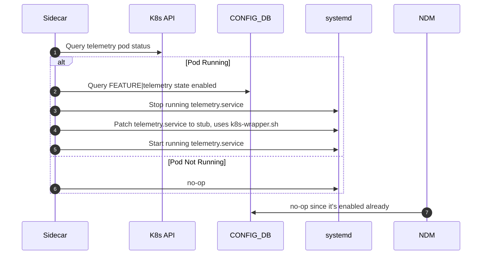
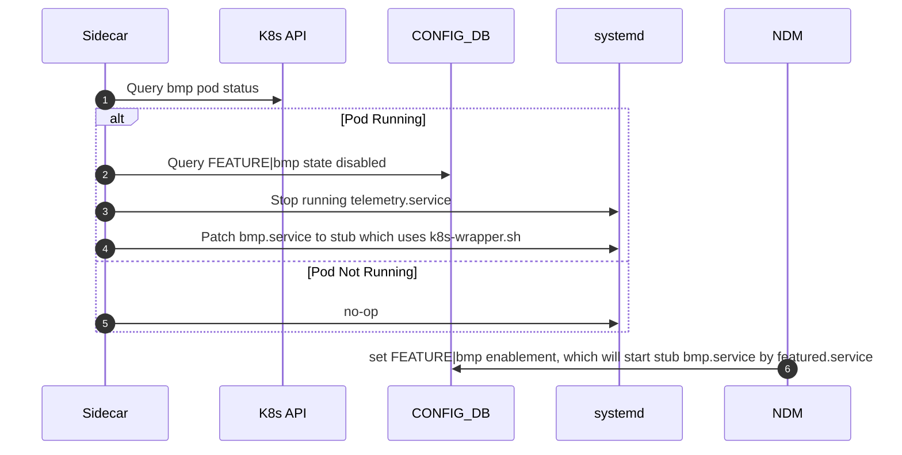
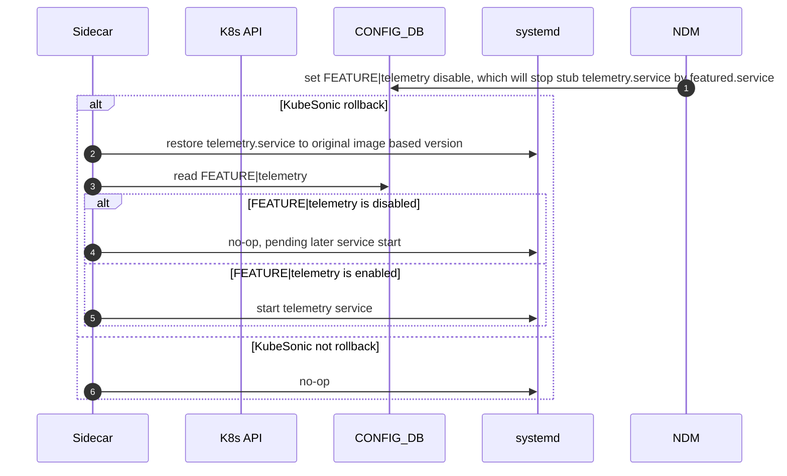
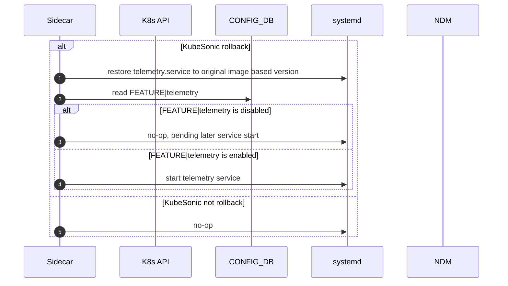

# Migrating Image-Managed Docker Containers to Kubernetes with Resource Control

## Background

In current SONiC architecture, many containers are image-managed, which means it's packed into build image and managed by NDM Golden config. And commonly deployed and managed using `systemd` and monitored using tools like `monit`. But after KubeSonic comes into picture, this deolpyment lacks advanced orchestration and native resource management features offered by Kubernetes.

This document outlines a generic approach to migrate any Image-managed Docker container to Kubernetes, providing CPU and memory resource controls, while maintaining backward compatibility with the existing `systemd` workflows. The telemetry container (`docker-sonic-telemetry`) is used as a concrete example.

## Objective

- Standardize container deployment using Kubernetes, including the image native container which is controlled via NDM golden config FEATURE table.
- Maintain `systemd` interface for backward compatibility.
- Enforce CPU and memory resource constraints natively.
- Optionally integrate existing monitoring systems during transition.

---

## Standardize Kubernetes-Based container Deployment

Since we need migration from a image-managed container to a Kubernetes-managed container, while avoiding dual-running instances and preserving compatibility. Meanwhile, we should not
break any existing feature like CriticalProcessHealthChecker, featured, systemHealth, etc.

### Keep FEATURE table as the source of truth of feature enablement

This means even after we enable feature via KubeSonic, we will still keep FEATURE table and NDM Golden as its owner, KubeSonic will update NDM via GenericConfigUpdate path. That is to say, KubeSonic will decide enable/disable as final desire state, but it will still via NDM golden config path, however, there maybe some intermediate state sync stage like GCU is in progress but config repave is triggered.


#### Feature Ownership and Versioning

The FEATURE controls lifecycle.
- v0, current version iteration in SONiC
- v1, KubeSonic rollout feature container, but keeps fully backward compatible


| Version | Container Installed By | Container service launched                 | systemd Handling         | Kubernetes Presence |
|---------|------------------------|--------------------------------------------|--------------------------|----------------------|
| v0      | SONiCImage             | NDM FEATURE table (featured monitor)       | Native systemd file used | None                 |
| v1      | KubeSonic              | NDM FEATURE table (featured monitor)       | stub service file        | DaemonSet            |


#### Possible scenario for KubeSonic rollout

##### FEATURE state is enabled in NDM golden config, like telemetry




##### FEATURE state is disabled in NDM golden config, like bmp



##### After KubeSonic rollout, FEATURE state is disabled in NDM golden config, like feature switch-off in some livesite issue, etc



Here need a preStop in sidecar to restore systemd script before rollback

```
lifecycle:
  preStop:
    exec:
      command: ["/bin/sh", "-c", 
      "systemctl stop telemetry.service
       cp /tmp/telemetry.service.bak 
       /etc/systemd/system/telemetry.service
       systemctl daemon-reload
       systemctl start telemetry.service
       "]
```

##### After KubeSonic rollout, FEATURE state is still enabled in NDM golden config, but KubeSonic needs to rollback the container




---

#### Periodic State Sync via DaemonSet Sidecar

To patch systemd script aligned with actual runtime state:

---
##### Rationale
Here we leverage a sidecar container inside the `DaemonSet` to perform periodic sync logic.

- The sidecar container:
  - Detects whether the container is running (via `kubectl`, `docker`, or other APIs).
  - Patch or restore systemd service files.

##### Sidecar Design
- Runs a simple shell script patch_service.sh that loops with `sleep`.
- Ensures FEATURE state is in sync with container state.
- For `v0`, restores systemd service files.
- For `v1`, manages FEATURE table and optionally updates systemd stub.

```bash
#!/bin/bash
while true; do

    # Determine version accordingly

    # Restore or patch systemd scripts as needed

    sleep 30
done
```


### Example: DaemonSet YAML
This script is embedded in the sidecar container of the `telemetry` DaemonSet.

```yaml
apiVersion: apps/v1
kind: DaemonSet
metadata:
  name: telemetry
  namespace: sonic
spec:
  selector:
    matchLabels:
      app: telemetry
  template:
    metadata:
      labels:
        app: telemetry
    spec:
      containers:
      - name: telemetry
        image: ksdatatest.azurecr.io/docker-sonic-telemetry:latest
        command: ["/usr/local/bin/supervisord"]
      - name: telemetry-feature-sidecar
        image: sonicinfra/feature-sync:latest
        command: ["/bin/bash", "-c", "/scripts/patch_service.sh"]
        volumeMounts:
        - name: scripts
          mountPath: /scripts
      volumes:
      - name: scripts
        configMap:
          name: feature-sync-script
```


#### Disabling KubeSonic rollouted Feature via Node Taints

When a KubeSonic rollouted feature (e.g., `telemetry`) should be **disabled**:

##### Step 1: Update NDM Golden feature state into disabled
##### FEATURE Table Snapshot
```json
"telemetry": {
  "auto_restart": "enabled",
  "state": "disabled",
  "delayed": "False",
  "check_up_status": "False",
  "has_per_asic_scope": "False",
  "has_global_scope": "True",
  "high_mem_alert": "disabled"
}
```
This will stop the stub systemd service from running corresondingly.

##### Step 2: Taint the Node
```bash
kubectl taint nodes <node-name> telemetry=disabled:NoSchedule
```

This prevents the DaemonSet from scheduling the container on that node.

##### Step 3: Delete the Running Pod
```bash
kubectl delete pod -n sonic <pod-name>
```

As long as the taint remains, the pod will not be rescheduled.


---

#### Rollback Flow

To revert from Kubernetes-managed (`v1`) back to systemd-managed (`v0`):

1. **Stop DaemonSet**
   ```bash
   kubectl delete daemonset telemetry -n sonic
   ```

2. **Remove Sidecar Script Stub** (Optional if installed via ConfigMap)
   ```bash
   kubectl delete configmap feature-sync-script -n sonic
   ```

3. **Restore systemd Script**
   ```bash
   sudo cp /tmp/telemetry.service.backup /lib/systemd/system/telemetry.service
   sudo systemctl daemon-reexec
   sudo systemctl restart telemetry.service
   ```
   Or use patch_service.sh to restore content of systemd script.

4. **Restart systemd service**
   ```bash
   sudo systemctl daemon-reexec
   sudo systemctl daemon-reload
   sudo systemctl restart telemetry.service
   ```

5. **Clean Up Taints (if any)**
   ```bash
   kubectl taint nodes <node-name> telemetry:NoSchedule-
   ```

This rollback ensures systemd regains full control and FEATURE behaves as it did in `v0`.

---


## Maintaining `systemd` Compatibility

In environments where existing operational workflows depend on managing containers via systemd, we can preserve compatibility by implementing a proxy systemd unit that interacts with Kubernetes behind the scenes. This allows existing automation tools and scripts that call systemctl to continue functioning without modification, even though the container is now orchestrated by Kubernetes.

### Rationale


Many production systems have monitoring, automation, or recovery mechanisms that depend on:
- `systemctl start <service>`
- `systemctl stop <service>`
- `systemctl status <service>`

To prevent breaking these expectations during the migration, a `systemd` service stub can be provided.


### v0 Behavior
- Container is fully managed by `systemd` (e.g., `telemetry.service`).
- FEATURE table controls startup (`state: Enabled/Disabled`).
- Actual container starts or stops via `systemctl` by featured.service

### v1+ Behavior with Kubernetes DaemonSet
- The container is deployed via Kubernetes DaemonSet.
- The systemd service is retained as a **stub**, to avoid breaking automation or tools that query it.
- `ExecStart` may invoke a script that checks K8s pod status or uses `kubectl`.


### Step-by-Step Setup

#### 1. Create Wrapper Script

Create a script `/usr/local/bin/k8s-wrapper.sh` that translates `systemd`-style commands to Kubernetes `kubectl` actions:

```bash
POD_NAME=$(kubectl get pod -n sonic -l app=telemetry -o jsonpath='{.items[0].metadata.name}')
if [[ -n "$POD_NAME" ]]; then
    echo "telemetry pod running as: $POD_NAME"
    kubectl get pod -n sonic "$POD_NAME"
else
    echo "telemetry pod not found on this node."
    exit 1
fi
```


#### 2. Create systemd Unit File

Example unit file: /etc/systemd/system/telemetry.service

```
[Unit]
Description=Kubernetes managed container telemetry
After=network.target

[Service]
Type=oneshot
ExecStart=/usr/local/bin/k8s-wrapper.sh telemetry start
ExecStop=/usr/local/bin/k8s-wrapper.sh telemetry stop
ExecReload=/usr/local/bin/k8s-wrapper.sh telemetry restart
RemainAfterExit=yes

[Install]
WantedBy=multi-user.target
```

#### 3. Reload systemd and Enable the Stub Service
```

sudo systemctl daemon-reexec
sudo systemctl daemon-reload
sudo systemctl enable telemetry.service
```

```

sudo systemctl start telemetry.service
sudo systemctl status telemetry.service
sudo systemctl stop telemetry.service
```

### Limitations


systemctl status does not show process PID or exit codes since it proxies Kubernetes pod status.

Restart policies (e.g., Restart=on-failure) defined in systemd will not work—Kubernetes handles restarts via livenessProbe and restartPolicy.


### Enforce CPU and memory resource constraints natively.

Kubernetes provides native resource management through the `resources` spec, allowing you to define minimum (`requests`) and maximum (`limits`) values for CPU and memory.

Container can config --memory as hard limit of usable RAM, and --memory-swap as more extra usage from swap space, once memory allocated exceeds the hard limit, container will get killed by OOM Killer with ExitCode=137 (SIGKILL), --restart=on-failure is used for restarting container automatically.

#### Example Deployment YAML (Generic)

```yaml
apiVersion: apps/v1
kind: Deployment
metadata:
  name: <container-name>
  namespace: <namespace>
spec:
  replicas: 1
  selector:
    matchLabels:
      app: <container-name>
  template:
    metadata:
      labels:
        app: <container-name>
    spec:
      containers:
      - name: <container-name>
        image: <container-image>
        command: ["<startup-command>"]
        resources:
          requests:
            memory: "100Mi"
            cpu: "100m"
          limits:
            memory: "800Mi"
            cpu: "500m"
        ports:
        - containerPort: <port>
        livenessProbe:
          exec:
            command: ["/usr/bin/pgrep", "<main-process>"]
          initialDelaySeconds: 60
          periodSeconds: 30
        readinessProbe:
          exec:
            command: ["/usr/bin/pgrep", "<main-process>"]
          initialDelaySeconds: 30
          periodSeconds: 15
```

#### Example: telemetry Container

```yaml
apiVersion: apps/v1
kind: Deployment
metadata:
  name: telemetry
  namespace: sonic
spec:
  replicas: 1
  selector:
    matchLabels:
      app: telemetry
  template:
    metadata:
      labels:
        app: telemetry
    spec:
      containers:
      - name: telemetry
        image: ksdatatest.azurecr.io/docker-sonic-telemetry:latest
        command: ["/usr/local/bin/supervisord"]
        resources:
          requests:
            memory: "100Mi"
            cpu: "100m"
          limits:
            memory: "800Mi"
            cpu: "500m"
        ports:
        - containerPort: 5000
        livenessProbe:
          exec:
            command: ["/usr/bin/pgrep", "telemetry"]
          initialDelaySeconds: 60
          periodSeconds: 30
        readinessProbe:
          exec:
            command: ["/usr/bin/pgrep", "telemetry"]
          initialDelaySeconds: 30
          periodSeconds: 15
```


## Monitoring and Alerting

Currently SONiC uses monit check memory for specific container, like below

```
###############################################################################
## Monit configuration for telemetry container
###############################################################################
check program container_memory_telemetry with path "/usr/bin/memory_checker telemetry 419430400"
    if status == 3 for 10 times within 20 cycles then exec "/usr/bin/restart_service telemetry" repeat every 2 cycles

```

memory_checker implementation
```
def get_memory_usage(container_id):
    """Reads the container's memory usage from the control group subsystem's file
    '/sys/fs/cgroup/memory/docker/<container_id>/memory.usage_in_bytes'.
    Args:
        container_id: A string indicates the full ID of a container.
    Returns:
        A string indicates memory usage (Bytes) of a container.
    """
    validate_container_id(container_id)

    docker_memory_usage_file_path = CGROUP_DOCKER_MEMORY_DIR + container_id + "/memory.usage_in_bytes"

    for attempt in range(3):
        try:
            with open(docker_memory_usage_file_path, 'r') as file:
                return file.read().strip()
        except FileNotFoundError:
            if attempt < 2:
                time.sleep(0.1)  # retry after short delay
            else:
                break
        except IOError:
            syslog.syslog(syslog.LOG_ERR, ERROR_CONTAINER_MEMORY_USAGE_NOT_FOUND.format(container_id))
            sys.exit(INTERNAL_ERROR)

    syslog.syslog(syslog.LOG_ERR, ERROR_CGROUP_MEMORY_USAGE_NOT_FOUND.format(docker_memory_usage_file_path, container_id))
    sys.exit(INTERNAL_ERROR)
```


During transition period if `monit` must be retained temporarily, we need to rewrite /usr/bin/memory_check to use Kubernetes data (e.g., via `kubectl top`) instead of reading Docker or CGroup files like above.

---


