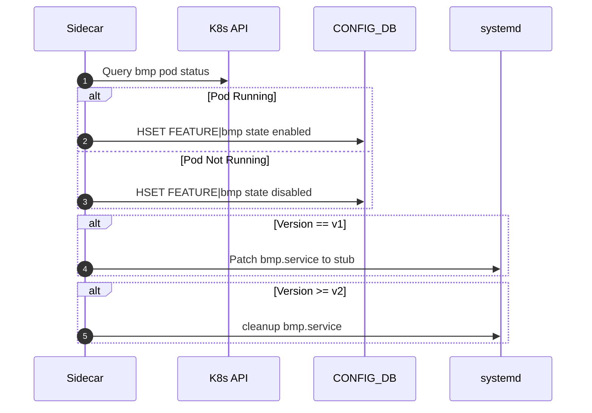

# Migrating Image-Managed Docker Containers to Kubernetes with Resource Control

## Background

In current SONiC architecture, many containers are image-managed, which means it's packed into build image and managed by NDM Golden config. And commonly deployed and managed using `systemd` and monitored using tools like `monit`. But after KubeSonic comes into picture, this deolpyment lacks advanced orchestration and native resource management features offered by Kubernetes.

This document outlines a generic approach to migrate any Image-managed Docker container to Kubernetes, providing CPU and memory resource controls, while maintaining backward compatibility with the existing `systemd` workflows. The BMP container (`docker-sonic-bmp`) is used as a concrete example.

## Objective

- Standardize container deployment using Kubernetes, including the image native container which is controlled via NDM golden config FEATURE table.
- Maintain `systemd` interface for backward compatibility.
- Enforce CPU and memory resource constraints natively.
- Optionally integrate existing monitoring systems during transition.

---

## Standardize Kubernetes-Based container Deployment

Since we need migration from a image-managed container to a Kubernetes-managed container, while preserving compatibility and avoiding dual-running instances.

There are some potential options as below:

### One-Time Migration Step
Define a Kubernetes pre-deployment job, which is to detect and stop/remove the native container (e.g., via systemd, Docker, etc.), before enabling the Kubernetes deployment.
Disable any native auto-restart logic (e.g., systemctl disable, docker rm -f && docker rm, etc.). But this may break some existing feature like CriticalProcessHealthChecker, featured, systemHealth, etc. Thus this option is not preferable.

### Mirror the Real State into the Config Flag

This means once we enable feature via KubeSonic, we can keep updating the FEATURE table to reflect Kubernetes’ real state, by this existing service/script which depends on FEATURE table will not be broken.


#### Feature Ownership and Versioning

The FEATURE table controls feature lifecycle.
- in v0, NDM takes feature's ownership via golden config
- in v1+, Kubernetes will update golden config and take over the ownership of feature table

| Version | Container Managed By | Startup Logic                            | systemd Handling         | Kubernetes Presence |
|---------|----------------------|------------------------------------------|--------------------------|----------------------|
| v0      | systemd              | FEATURE sets container enabled           | Native systemd file used | None                 |
| v1      | Kubernetes           | FEATURE mirrors K8s container state      | Proxy/No-op service file | DaemonSet            |
| v2+     | Kubernetes           | Full migration, enhancements             | Optional cleanup         | DaemonSet + Policies |

---

#### Periodic State Sync via DaemonSet Sidecar

To keep FEATURE state aligned with actual runtime state:

---
##### Rationale
Here we leverage a sidecar container inside the `DaemonSet` to perform periodic sync logic.

- The sidecar container:
  - Detects whether the container is running (via `kubectl`, `docker`, or other APIs).
  - Updates the `enabled` flag in FEATURE table accordingly.

##### Sidecar Design
- Runs a simple shell script that loops with `sleep`.
- Ensures FEATURE state is in sync with container state.
- For `v0`, restores systemd service files.
- For `v1`, manages FEATURE table and optionally updates systemd stub.

```bash
#!/bin/bash
while true; do

    # Determine version and set FEATURE state accordingly

    # Restore or patch systemd scripts as needed

    sleep 60
done
```

This script is embedded in the sidecar container of the `bmp` DaemonSet.

### Example: DaemonSet YAML

```yaml
apiVersion: apps/v1
kind: DaemonSet
metadata:
  name: bmp
  namespace: sonic
spec:
  selector:
    matchLabels:
      app: bmp
  template:
    metadata:
      labels:
        app: bmp
    spec:
      containers:
      - name: bmp
        image: ksdatatest.azurecr.io/docker-sonic-bmp:latest
        command: ["/usr/local/bin/supervisord"]
      - name: bmp-feature-sidecar
        image: sonicinfra/feature-sync:latest
        command: ["/bin/bash", "-c", "/scripts/feature_sync.sh"]
        volumeMounts:
        - name: scripts
          mountPath: /scripts
      volumes:
      - name: scripts
        configMap:
          name: feature-sync-script
```

### ConfigMap with Sidecar Script

```yaml
apiVersion: v1
kind: ConfigMap
metadata:
  name: feature-sync-script
  namespace: sonic
data:
  feature_sync.sh: |
    #!/bin/bash
    while true; do
        # Check if bmp container is running
        if kubectl get pod -l app=bmp -n sonic | grep -q Running; then
            redis-cli -n 6 HSET "FEATURE|bmp" state "Enabled"
        else
            redis-cli -n 6 HSET "FEATURE|bmp" state "Disabled"
        fi
        sleep 60
    done
```

---


#### Disabling Feature via Node Taints

When a feature (e.g., `bmp`) should be **disabled**:

##### Step 1: Taint the Node
```bash
kubectl taint nodes <node-name> bmp=disabled:NoSchedule
```

This prevents the DaemonSet from scheduling the container on that node.

##### Step 2: Delete the Running Pod
```bash
kubectl delete pod -n sonic <pod-name>
```

As long as the taint remains, the pod will not be rescheduled.

---

#### Example: bmp Container Lifecycle

##### FEATURE Table Snapshot
```json
"bmp": {
  "auto_restart": "enabled",
  "state": "enabled",
  "delayed": "False",
  "check_up_status": "False",
  "has_per_asic_scope": "False",
  "has_global_scope": "True",
  "high_mem_alert": "disabled"
}
```

##### Sequence Diagram (v1+)


---

#### Rollback Flow

To revert from Kubernetes-managed (`v1`) back to systemd-managed (`v0`):

1. **Stop DaemonSet**
   ```bash
   kubectl delete daemonset bmp -n sonic
   ```

2. **Remove Sidecar Script Stub** (Optional if installed via ConfigMap)
   ```bash
   kubectl delete configmap feature-sync-script -n sonic
   ```

3. **Restore systemd Script**
   ```bash
   sudo cp /tmp/bmp.service.backup /lib/systemd/system/bmp.service
   sudo systemctl daemon-reexec
   sudo systemctl restart bmp.service
   ```

4. **Update FEATURE Table**
   ```bash
   redis-cli -n 6 HSET "FEATURE|bmp" state "Enabled"
   ```

5. **Clean Up Taints (if any)**
   ```bash
   kubectl taint nodes <node-name> bmp:NoSchedule-
   ```

This rollback ensures systemd regains full control and FEATURE behaves as it did in `v0`.

---


## Maintaining `systemd` Compatibility

In environments where existing operational workflows depend on managing containers via systemd, we can preserve compatibility by implementing a proxy systemd unit that interacts with Kubernetes behind the scenes. This allows existing automation tools and scripts that call systemctl to continue functioning without modification, even though the container is now orchestrated by Kubernetes.

### Rationale


Many production systems have monitoring, automation, or recovery mechanisms that depend on:
- `systemctl start <service>`
- `systemctl stop <service>`
- `systemctl status <service>`

To prevent breaking these expectations during the migration, a `systemd` service stub can be provided.


### v0 Behavior
- Container is fully managed by `systemd` (e.g., `bmp.service`).
- FEATURE table controls startup (`state: Enabled/Disabled`).
- Actual container starts or stops via `systemctl`.

### v1+ Behavior with Kubernetes DaemonSet
- The container is deployed via Kubernetes DaemonSet — **not** started by `systemd`.
- The systemd service is retained as a **stub or proxy**, to avoid breaking automation or tools that query it.

#### Stub Options:
1. **No-op service**  
   Always exits successfully. This avoids errors for `status`, `start`, or `stop`.
2. **Proxy script to K8s**  
   Optionally, `ExecStart` may invoke a script that checks K8s pod status or uses `kubectl`.

### Step-by-Step Setup

#### 1. Create Wrapper Script

Create a script `/usr/local/bin/k8s-wrapper.sh` that translates `systemd`-style commands to Kubernetes `kubectl` actions:

```bash
POD_NAME=$(kubectl get pod -n sonic -l app=bmp -o jsonpath='{.items[0].metadata.name}')
if [[ -n "$POD_NAME" ]]; then
    echo "bmp pod running as: $POD_NAME"
    kubectl get pod -n sonic "$POD_NAME"
else
    echo "bmp pod not found on this node."
    exit 1
fi
```

Make the script executable:

```bash
chmod +x /usr/local/bin/k8s-wrapper.sh
```


#### 2. Create systemd Unit File

Example unit file: /etc/systemd/system/bmp.service

```
[Unit]
Description=Kubernetes managed container bmp
After=network.target

[Service]
Type=oneshot
ExecStart=/usr/local/bin/k8s-wrapper.sh bmp start
ExecStop=/usr/local/bin/k8s-wrapper.sh bmp stop
ExecReload=/usr/local/bin/k8s-wrapper.sh bmp restart
RemainAfterExit=yes

[Install]
WantedBy=multi-user.target
```

#### 3. Reload systemd and Enable the Stub Service
```

sudo systemctl daemon-reexec
sudo systemctl daemon-reload
sudo systemctl enable bmp.service
```

```

sudo systemctl start bmp.service
sudo systemctl status bmp.service
sudo systemctl stop bmp.service
```

### Limitations


systemctl status does not show process PID or exit codes—it proxies Kubernetes pod status.

Restart policies (e.g., Restart=on-failure) defined in systemd will not work—Kubernetes handles restarts via livenessProbe and restartPolicy.

This assumes kubectl is installed and configured to access the correct Kubernetes cluster and namespace.

### Benefits

No disruption to automation or legacy tooling using systemctl.

Operators familiar with systemd can continue using the same commands.

Allows gradual migration to a fully Kubernetes-native setup.

---


### Enforce CPU and memory resource constraints natively.

Kubernetes provides native resource management through the `resources` spec, allowing you to define minimum (`requests`) and maximum (`limits`) values for CPU and memory.

#### Example Deployment YAML (Generic)

```yaml
apiVersion: apps/v1
kind: Deployment
metadata:
  name: <container-name>
  namespace: <namespace>
spec:
  replicas: 1
  selector:
    matchLabels:
      app: <container-name>
  template:
    metadata:
      labels:
        app: <container-name>
    spec:
      containers:
      - name: <container-name>
        image: <container-image>
        command: ["<startup-command>"]
        resources:
          requests:
            memory: "100Mi"
            cpu: "100m"
          limits:
            memory: "800Mi"
            cpu: "500m"
        ports:
        - containerPort: <port>
        livenessProbe:
          exec:
            command: ["/usr/bin/pgrep", "<main-process>"]
          initialDelaySeconds: 60
          periodSeconds: 30
        readinessProbe:
          exec:
            command: ["/usr/bin/pgrep", "<main-process>"]
          initialDelaySeconds: 30
          periodSeconds: 15
```

#### Example: BMP Container

```yaml
apiVersion: apps/v1
kind: Deployment
metadata:
  name: bmp
  namespace: sonic
spec:
  replicas: 1
  selector:
    matchLabels:
      app: bmp
  template:
    metadata:
      labels:
        app: bmp
    spec:
      containers:
      - name: bmp
        image: ksdatatest.azurecr.io/docker-sonic-bmp:latest
        command: ["/usr/local/bin/supervisord"]
        resources:
          requests:
            memory: "100Mi"
            cpu: "100m"
          limits:
            memory: "800Mi"
            cpu: "500m"
        ports:
        - containerPort: 5000
        livenessProbe:
          exec:
            command: ["/usr/bin/pgrep", "openbmpd"]
          initialDelaySeconds: 60
          periodSeconds: 30
        readinessProbe:
          exec:
            command: ["/usr/bin/pgrep", "openbmpd"]
          initialDelaySeconds: 30
          periodSeconds: 15
```


## Monitoring and Alerting

Currently SONiC uses monit check memory for specific container, like below

```
###############################################################################
## Monit configuration for bmp container
###############################################################################
check program container_memory_bmp with path "/usr/bin/memory_checker bmp 419430400"
    if status == 3 for 10 times within 20 cycles then exec "/usr/bin/docker exec bmp supervisorctl restart openbmpd"

```

If legacy tools like `monit` must be retained temporarily, we need to rewrite /usr/bin/memory_check to use Kubernetes data (e.g., via `kubectl top`) instead of Docker or CGroup files.

---


