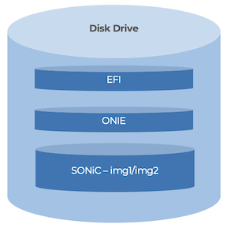
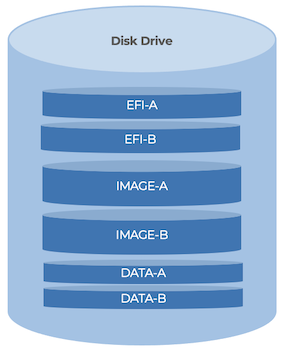
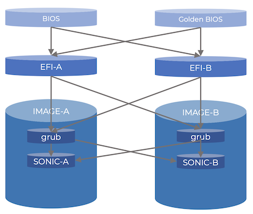

# Enhancing SONiC Boot Resiliency High Level Design

## Table of Content
- [Revision](#revision)
- [Scope](#scope)
- [Definitions/Abbreviations](#definitionsabbreviations)
- [Overview](#overview)
- [Requirements](#requirements)
- [Architecture Design](#architecture-design)
- [High-Level Design](#high-level-design)
  * [Current Partitioning Scheme](#current-partition-scheme)
  * [New Partition Scheme](#new-partition-scheme)
- [SAI API](#sai-api)
- [Configuration and management](#configuration-and-management)
- [Warmboot and Fastboot Design Impact](#warmboot-and-fastboot-design-impact)
- [Memory Consumption](#memory-consumption)
- [Restrictions/Limitations](#restrictionslimitations)
- [Testing Requirements/Design](#testing-requirementsdesign)
- [Open/Action items - if any](#openaction-items-if-any)

### Revision
| Revision | Date        | Author           | Change Description |
| -------- | ----------- | ---------------- | ------------------ |
| 1.0      | Jun 2, 2025 | Prashanth Buddhala | Initial proposal   |

### Scope

This document captures the high-level design for improving SONiC boot resiliency with enhanced partitioning of disk.

### Definitions/Abbreviations
| Definitions/Abbreviation | Description |
| ------------------------ | ----------- |
| EFI | Extensible Firmware Interface |
| iPXE | Internet Preboot Execution Environment |


### Overview
Disk failures, filesystem corruptions, partition corruptions on disks are a common failure that can disrupt any device that is running a modern operating system. If a network device runs into such a failure, the impact could be wide spread unless you have redundancy at each level. There are many scenarios where having device level redundancy is either not practical or is cost prohibitive. A device having ability to be resilient to such failures is paramount if SONiC is to go beyond a traditional DC. Hence forth, proposed below are some of the high level requirements and design changes to make SONiC deployment possible in places like remote offices, branch offices etc where on-site infrastructure to service a device are limited.


### Requirements
1. Ability to recover from disk/filesystem/partition corruptions:
    * Current SONiC devices support only 1 Disk, 1 EFI and 1 OS partition which each are single point of failures. Support multiple of these so that any failure will not render the device offline, but can still function.
2. Reduce dependency on iPXE/localHTTP for device recovery:
    * Needing all of the these pieces is a maintenance overhead. ROBO like deployments will not have any of these infrastructure pieces to support a single device.
3. Have ability to be ONIE independent:
    * Maintaining ONIE and needing ONIE to recover SONiC in the field is an overhead and should be optional and not mandatory.
4. Ability to have same image version as a backup NOS on the device.
    * Currently only 1 copy of a NOS version is allowed on the device. A backup NOS should have such restrictions.
5. Fallback mechanism to recover device from other partition.
    * Ability to recover and boot from backup partition if a NOS version fails to boot successfully.

### Architecture Design

#### Current Paritioning Scheme

Below is an overview of how the Partitions look like. A corruption in either EFI partition or SONiC partition will render the box offline until a recovery is performed.

<p align="center">

</p>

#### New Partition Scheme

* EFI-A: Primary EFI Partition. This partition will have a grub that will first search for a NOS partition labeled IMAGE-A, if inaccessible, will look for IMAGE-B
* EFI-B: Secondary Partition which will also look for a NOS partition labeled IMAGE-A, if inaccessible, will look for IMAGE-B
* IMAGE-A: A completely self-reliant copy SONiC NOS of a specific version.
* IMAGE-B: A completely self-reliant copy SONiC NOS of a specific version.
* DATA-A/DATA-B: Optional Partitions for application data that need disk redundancy.


<p align="center">

</p>

The /host partition was a single partition in the traditional SONiC deployments. With A/B partitioned disk, /host will point to the active partition either IMAGE-A or the IMAGE-B partition. This change needs to be handled appropriately at all the places where /host is used as a common location for all SONiC images.

Given that each SONiC version will be an independant partition, any of the SONiC images can recover the other partition SONiC image in case one of the partitions is corrupted. With this ability, SONiC can now be independant of needing ONIE on the device to recover it in the field.

#### "/host" Partition:

In the single partitioned SONiC disk, /host is the NOS partition and lot of SONiC code functionality has hardcoded "/host" location. In order to keep existing functionality working correctly, in the new partition scheme, /host will point to the current active partition. All functionality that requires "/host" will need to be examined and changed appropriately.

### High-Level Design Changes

* Build Changes:

    The new AB partitioning scheme will be optional and would be enabled through a build flag. The traditional single NOS partition will continue to be supported and work without any changes. 

    IMAGE_AB_PARTITION="y" flag would be added to the build command to enable the new scheme.

* Installer Changes:

    In order to be able to support multiple NOS parititions, we will need to add support to SONiC installer to partition the disk correctly during install. During installation, if "IMAGE_AB_PARTITION" flag is "y", the disk partitioning will create the A/B partitions as described in the previous section. While enabling A/B partitioning would be a build flag option and the partition sizes are configurable during build time through a platform specific attribute. This is an already existing attribute.

* CLI Changes:

    Once SONiC is installed and booted, the SONiC CLI commands that manage images would need to be aware that there are 2 different partitions in order to enable image upgrades, downgrades, set-next-boot etc. sonic-utilities REPO will be modified to add appropriate support.

* Grub Config Changes:

    Grub on each partition will configured to boot either of the SONiC images. When a user configured the CLI next-boot or default-boot option, the grub's default/next-boot will be updated to boot the right image. Both partition grub will be updated with the correct pointers.

* Boot Recovery:

    Each of the partitions are fully independant and can boot any of the images in either of the partitions. Below is a diagram that explains the image pointers. BIOS can boot either EFI-A or EFI-B. EFI-A/EFI-B can boot either IMAGE-A or IMAGE-B. The final grub configuration in the IMAGE-A/IMAGE-B partition will determine which SONiC will boot. This is the grub config that sonic-installer CLI will edit in both image partitions.

<p align="center">

</p>

In the above, the short vertical arrows represent the default decision paths. Only if that path is corrupted or inaccessible, the longer paths are traversed to reach the SONiC version that a user wants to boot.

### SAI API
None

### Configuration and management
None


#### CLI/YANG model Enhancements

sonic-installer CLI would change how the images get displayed in the "sonic-installer list" command. Images will be tagged with IMAGE-A and IMAGE-B along with the SONiC image version. A example CLI output would look like below

```
root@sonic-device:~# sonic-installer list

    Current: IMAGE-A-SONiC-OS-azure_202405.0-20250515.231606
    Next: IMAGE-A-SONiC-OS-azure_202405.0-20250515.231606
    Available:
    IMAGE-A-SONiC-OS-azure_202405.0-20250515.231606
    IMAGE-B-SONiC-OS-azure_202405.0-20250410.120500

```

All "sonic-installer" commands that refer to images would need to use the image tags as displayed in the "list" command.

#### Config DB Enhancements
None

### Warmboot and Fastboot Design Impact

Given that /host now will be separate for each of the images, inorder to support warm boot changes will be needed to make sure the warmboot state is staged on the right partition. When warmboot CLI commands are executed from a particular partition which would be the running partition, the warmboot state needs to staged in the other partition for proper execution.

### Warmboot and Fastboot Performance Impact
No performance impact is expected for both Warmboot and Fastboot.

### Memory Consumption
No change is expected.

### Restrictions/Limitations
Migrations from traditional single partitioned SONiC devices to the new A/B Partitioned devices would need to be done using installer like ONIE. Currently you cannot use "sonic-installer install" command to migrate to new scheme as we cannot re-partition the disk when running from the SONiC paritition.

### Testing Requirements/Design
A SONiC VM image and a HW device image built with A/B partitioned image will be supported and can be used for all or most of the tests. 

#### Unit Test cases
Given that most of the changes are in build and install, System tests will be the focus to make sure all the scenarios are covered appropriately. Please refer to below System tests section.

#### System Test cases
Below list of tests would be executed to test the functionality.

Below tests will be performed on both Traditional Single SONiC NOS partitioned image to make sure no regressions are introduced and the new A/B Partitioned Images for the new functionality.

* Check image install using ONIE.
    * Reboot and test system boot up.
    * Verify partitions on the new image for both IMAGE-A and IMAGE-B

* Test below "sonic-installer" command functionality from the new SONiC image
    * list
    * install
    * set-default
    * set-next-boot

* Verify all above tests with IMAGE-A being the active partition.
* Verify all above tests with IMAGE-B being the active partition.
* Corrupt active IMAGE-A partition and check device recovery to make sure it boots from the IMAGE-B partition.
* Corrupt active IMAGE-B paritition and check device recovery to make sure it boots from the IMAGE-A partition.
* Corrupt EFI-A or EFI-B partitions and make sure device recovers and boots correctly from the other partition.

### Open/Action items - if any

