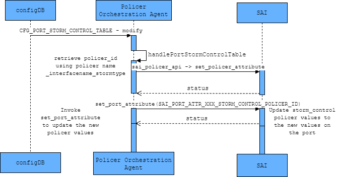

# SONiC BUM Storm Control
# High Level Design Document
#### Rev 0.1

# Table of Contents
  * [List of Tables](#list-of-tables)
  * [Revision](#revision)
  * [About This Manual](#about-this-manual)
  * [Scope](#scope)
  * [Definition/Abbreviation](#definitionabbreviation)
  * [1 Feature Overview](#1-feature-overview)
     * [1.1 Requirements](#11-requirements)
        *  [1.1.1 Functional Requirements](#111-functional-requirements)
        *  [1.1.2 Configuration and Management Requirements](#112-configuration-and-management-requirements)
        *  [1.1.3 Scalability Requirements](#113-scalability-requirements)
        *  [1.1.4 Warm Boot Requirements](#114-warm-boot-requirements)
      *  [1.2 Design Overview](#12-design-overview)
          * [1.2.1 Basic Approach](#121-basic-approach)
          * [1.2.2 Container](#122-container)
          * [1.2.3 SAI Overview](#123-sai-overview)
  * [2 Functionality](#2-functionality)
      * [2.1 Target Deployment Use Cases](#21-target-deployment-use-cases)
      * [2.2 Functional Description](#22-functional-description)
      * [2.3 Limitations](#23-limitations)
  * [3 Design](#3-design)
      * [3.1 Overview](#31-overview)
      * [3.2 DB Changes](#32-db-changes)
          * [3.2.1 CONFIG_DB](#321-config_db)
          * [3.2.2 APP_DB](#322-app_db)
          * [3.2.3 STATE_DB](#323-state_db)
          * [3.2.4 ASIC_DB](#324-asic_db)
          * [3.2.5 COUNTER_DB](#325-counter_db)
      * [3.3 Switch State Service Design](#33-switch-state-service-design)
          * [3.3.1 PolicerOrch changes](#331-policerorch-changes)
      * [3.4 SAI](#34-sai)
      * [3.5 CLI](#35-cli)
          * [3.5.1 Data Models](#351-data-models)
          * [3.5.2 Configuration Commands](#352-configuration-commands)
          * [3.5.3 Show Commands](#353-show-commands)
          * [3.5.4 Clear Commands](#354-clear-commands)
          * [3.5.5 Debug Commands](#355-debug-commands)
  * [4 Flow Diagrams](#4-flow-diagrams)
      * [4.1 Enable storm control on physical interface](#41-enable-storm-control-on-phy)
      * [4.2 Disable storm Control on physical interface](#42-disable-storm-control-on-phy)
      * [4.3 Update storm Control on physical interface](#43-update-storm-control-on-phy)
  * [5 Error Handling](#5-error-handling)
  * [6 Serviceability and Debug](#6-serviceability-and-debug)
  * [7 Warm Boot Support](#7-warm-boot-support)
  * [8 Scalability](#8-scalability)
  * [9 Unit Test](#9-unit-test) 
     * [9.1 CLI Test Cases](#91-cli-test-cases)
     * [9.2 Functional Test Cases](#92-functional-test-cases)
     * [9.3 Scaling Test Cases](#93-scaling-test-cases)
     * [9.4 Warm Boot Test Cases](#94-warm-boot-test-cases)
     * [9.5 Negative Test Cases](#95-negative-test-cases)

# List of Tables
[Table 1: Abbreviations](#table-1-abbreviations)
[Table 2: Storm Control SAI attributes](#table-2-storm-control-sai-attributes)

# Revision
| Rev |     Date    |       Author       | Change Description                |
|:---:|:-----------:|:------------------:|-----------------------------------|
| 0.1 | 06/24/2019  |  Mohanarajan Selvaraj| Initial version                   |

# About this Manual
This document provides general information about Broadcast, Unknown-unicast and unknown-Multicast storm-control feature implementation in SONiC.
# Scope
This document describes the functionality and high level design of Broadcast, Unknown-unicast and unknown-Multicast storm-control feature in SONiC. 

# Definition/Abbreviation
### Table 1: Abbreviations
| Term   | Meaning                                                |
|--------|--------------------------------------------------------|
| BUM   | Broadcast Unknown-unicast and unknown-Multicast         |

# 1 Feature Overview
A traffic storm occurs when packets flood the LAN, creating excessive traffic and degrading network performance. The type of traffic can be Broadcast, Unknown-unicast or unknown-Multicast (BUM). 
The storm-control feature allows the user to limit the amount of BUM traffic admitted to the system. This can be achieved by configuring the type of storm (Broadcast or Unknown-unicast or unknown-Multicast) and the corresponding kilo bits per second (kbps) parameter on a given physical interface. Traffic that exceeds the configured rate will be dropped. 
Unknown-multicast traffic consists of all multicast traffic which donot match any of the statically configured or dynamically learned multicast groups. 

## 1.1 Requirements

### 1.1.1 Functional Requirements
 1. Support configuration of Broadcast, Unknown-unicast and unknown-Multicast storm-control independently on physical interfaces.
 2. Support threshold rate configuration in kilo bits per second (kbps) in the range of 0 kbps to 100,000,000 kbps (100Gbps). 

### 1.1.2 Configuration and Management Requirements
This feature supports Click, Klish, REST, gNMI interfaces.
 1. Support a CLI to add or delete broadcast, unknown-unicast and unknown-multicast storm-control on a physical interface as described in "Configuration Commands" section below. 
 2. Support show commands to display the storm-control configuration as described in "Show Commands" section below. 
 3. Support debug commands as described in "Debug Commands" section below.

### 1.1.3 Scalability Requirements
Storm-control configuration is done on physical ports. Hence it should be supported on all physical ports of the system. 

### 1.1.4 Warm Boot Requirements
Storm-control functionality should continue to work across warm reboot. 

- To support planned system warm boot.
- To support SWSS docker warm boot.

## 1.2 Design Overview

### 1.2.1 Basic Approach
The Policer Orchestration agent is used for handling BUM storm-control configuration. 

### 1.2.2 Container
No new containers are introduced. Functionality is added to the existing swss container. 

### 1.2.3 SAI Overview
The existing SAI policer and interface APIs shall be used to support this feature and they are available at below location, 
https://github.com/opencomputeproject/SAI/blob/master/inc/saipolicer.h  
https://github.com/opencomputeproject/SAI/blob/master/inc/saiport.h

The details of the changes will be discussed in the design section below.

# 2 Functionality
Refer to section 1
## 2.1 Target Deployment Use Cases
Any Layer-2 network segment where unknown-unicast / broadcast / unknown-multicast traffic storm should be  controlled. 

## 2.2 Functional Description
Refer to section 1.1

## 2.3 Limitations
BUM storm control 
- Configuration is not supported on VLAN and port-channel interfaces. User can configure on physical port which is part of a VLAN / port-channel.
- Statistics is not supported. 
- User is expected to remove all storm-control configurations from interface before doing a breakout from Click CLI. 
 

# 3 Design
## 3.1 Overview

__Figure 1: Storm Control High Level Architecture__

1) Storm-control configurations are parsed and stored in CFG_PORT_STORM_CONTROL_TABLE in Configuration database by the Management Framework.
2) The Policer Orchestration Agent subscribes to notifications from the CFG_PORT_STORM_CONTROL_TABLE and parses the input parameters (interface, storm-control type, kbps). A policer_name is created internally by encoding the interface_name and storm_control_type.
3) create_policer SAI API is invoked to create a policer with the given input parameters. 
4) The identifier of the policer created is associated with the encoded policer_name.
5) The policer identifier is passed to set_port_attribute SAI API to set the appropriate type of storm-control on the port. 

## 3.2 DB Changes
This section describes the changes made to different DBs for supporting storm-control.

### 3.2.1 CONFIG_DB
A new table CFG_PORT_STORM_CONTROL_TABLE is introduced in the configuration database for the purpose of storing storm-control configuration parameters. This table is filled by the management framework. 
#### CFG_PORT_STORM_CONTROL_TABLE

    ;Store Storm Control configuration per physical port
    ;Status: work in progress
    ;storm control type - broadcast / unknown-unicast / unknown-multicast
    key     = CFG_PORT_STORM_CONTROL_TABLE:port:storm_control_type ; Ethernet Interface Name and storm control type
    ;field  = value
    enabled = BIT          ; Is the storm control enabled (1) or disabled (0) on the interface 
    kbps     = 1*13 DIGIT   ; CIR value in kilo bits per second
         
### 3.2.2 APP_DB
No tables are introduced in APP_DB
### 3.2.3 STATE_DB
No tables are introduced in STATE_DB. 

### 3.2.4 ASIC_DB
No changes are introduced in ASIC_DB. 
### 3.2.5 COUNTER_DB
No changes are introduced in COUNTER_DB. 

## 3.3 Switch State Service Design
### 3.3.1 PolicerOrch changes 
Policer Orchestration agent is responsible for the following activities:
   - Subscribes to notifications on CFG_PORT_STORM_CONTROL_TABLE entries in the CONFIG_DB. 
   - Creates an internal name for policer by encoding the interface name and storm-control type. 
   - Creates the policer based on the parameters and associates the policer identifier to internal name
   - Populates the port attribute SAI structures and pushes the entry to ASIC_DB. 

## 3.4 SAI
Storm-control SAI interface APIs are already defined. The table below represents the SAI attributes which shall be used for BUM storm-control.

###### Table 2: Storm Control SAI attributes
| Storm Control component  | SAI attributes                                         |                          
|--------------------------|--------------------------------------------------------|
| Meter type               | SAI_POLICER_ATTR_METER_TYPE                            |
| Meter mode               | SAI_POLICER_ATTR_MODE                                  |
| CIR (bps)                | SAI_POLICER_ATTR_CIR                                   |
| Unknown-unicast policer  | SAI_PORT_ATTR_FLOOD_STORM_CONTROL_POLICER_ID           |
| Broadcast policer        | SAI_PORT_ATTR_BROADCAST_STORM_CONTROL_POLICER_ID       |
| Unknown-Multicast policer| SAI_PORT_ATTR_MULTICAST_STORM_CONTROL_POLICER_ID       |

The BUM storm-control feature can be enabled on a physical port. 

The **create_policer** SAI API is used to create the policer based on the policer parameters listed in Table 2.
   - Meter Type - Can be packets or bytes. Storm-control uses bytes meter type. 
   - Meter Mode - Can be st_tcm or tr_tcm or storm. Storm-control uses storm meter mode. 
   - CIR (bps) - Value of CIR given in bps. 

The **set_port_attribute** SAI API is used to set the policer on an interface. 
   - Unknown-unicast policer - Enables storm-control for unknown-unicast traffic received on the interface. 
   - Broadcast policer - Enables storm-control for broadcast traffic received on the interface. 
   - Unknown-multicast policer - Enables storm-control for unknown-multicast traffic received on the interface. 

## 3.5 CLI
### 3.5.1 Data Models
Configuration is supported using Click and Klish CLI commands.

### 3.5.2 Configuration Commands
This section lists down the Click commands.
BUM storm-control can be configured only on physical interfaces.  
**switch# config interface storm-control {broadcast | unknown-unicast | unknown-multicast} {add|del} \<interface_name\> {\<kilo_bits_per_second\>}**

#### 3.5.2.1 Enable Broadcast storm control on a physical interface
This command configures broadcast storm-control on a physical interface.  
**switch# config interface storm-control broadcast add \<interface_name\> {\<kilo_bits_per_second\>}**

#### 3.5.2.1 Enable Unknown-unicast storm control on a physical interface
This command configures unknown-unicast storm-control on a physical interface.  
**switch# config interface storm-control unknown-unicast add \<interface_name\> {\<kilo_bits_per_second\>}**

#### 3.5.2.1 Enable Multicast storm control on a physical interface
This command configures unknown-multicast storm-control on physical interface.  
**switch# config interface storm-control unknown-multicast add \<interface_name\> {\<kilo_bits_per_second\>}**

### 3.5.3 Show Commands
The following show command displays storm-control configurations. 

**show storm-control {all | interface \<interface_name\>}**

Following is a sample output

**show storm-control all**  

###### Table 3: show storm-control
+------------------+-----------------+---------------+
| Interface Name   | Storm Type      |   Rate (kbps) |
+==================+=================+===============+
| Ethernet0        | broadcast       |          1000 |
+------------------+-----------------+---------------+
| Ethernet0        | unknown-unicast |          2000 |
+------------------+-----------------+---------------+
| Ethernet2        | unknown-unicast |          5000 |
+------------------+-----------------+---------------+

**show storm-control interface Ethernet2**  

###### Table 4: show storm-control interface
+------------------+-----------------+---------------+
| Interface Name   | Storm Type      |   Rate (kbps) |
+==================+=================+===============+
| Ethernet2        | unknown-unicast |          5000 |
+------------------+-----------------+---------------+

###  3.5.4 Clear Commands
Not applicable
### 3.5.5 Debug Commands
Not applicable
 
# 4 Flow Diagrams
## 4.1 Enable storm control on physical interface

__Figure 2: Enable storm control on physical interface__

## 4.2 Disable storm control on physical interface

__Figure 3: Disable storm control on physical interface__

## 4.3 Update storm control on physical interface

__Figure 4: Update storm control on physical interface__

# 5 Error Handling
# 6 Serviceability and Debug
Debug commands as described in Debug Command section will be supported. Debug command output will be captured as part of tech support.
- A CLI error will be displayed via console and configuration will be rejected
- Internal processing errors within SwSS will be logged in syslog with ERROR level
- SAI interaction errors will be logged in syslog

# 7 Warm Boot Support
The storm-control setting on the port should be retained across warmboot so that the BUM storm traffic gets rate-limited as per the configured policer parameters. 

# 8 Scalability

Storm-control is a physical port parameter. Testing would be done by enabling storm-control on all the physical ports. 
###### Table 3: Scaling limits
|Name                      |   Scaling value    |
|--------------------------|--------------------|
| Number of interfaces     | max_physical_ports |

# 9 Unit Test
## 9.1 CLI Test Cases

    1. Configure broadcast storm-control on interface and check that it is updated in CONFIG_DB. 
    2. Configure unknown-unicast storm-control on interface and check that it is updated in CONFIG_DB. 
    3. Configure unknown-multicast storm-control on interface and check that it is updated in CONFIG_DB. 
    4. Unconfigure broadcast storm-control on interface and check that it is updated in CONFIG_DB. 
    5. Unconfigure unknown-unicast storm-control on interface and check that it is updated in CONFIG_DB. 
    6. Unconfigure unknown-multicast storm-control on interface and check that it is updated in CONFIG_DB. 
    7. Execute the show storm-control command to check the configuration. 
    8. Verify that the BUM storm-control configurations are correctly re-applied after cold reboot.
    9. Verify that all the three storm-control types can be configured and rate limiting is 
       applied independently on the three types of traffic received at the interface. 
    10. Verify that the kbps value configured is independent per interface.
    11. When user configures BUM storm-control on interface where the same type is already configured,
        verify that if kbps value is different, the new kbps value is updated to the CONFIG_DB.

## 9.2 Functional Test Cases
    12. Verify that broadcast traffic gets rate-limited as per broadcast storm-control policer parameters.
    13. Verify that unknown-unicast traffic gets rate-limited as per unknown-unicast storm-control policer parameters.
    14. Verify that multicast traffic gets rate-limited as per multicast storm-control policer parameters.
    15. Configure all three BUM storm-control on interface and verify that the rate-limiting of traffic is as per the 
        respective policer parameters.
    16. Verify that other traffic streams are unaffected by BUM storm-control configuration.
    17. Verify that after unconfiguring BUM storm-control configuration on interface, BUM storm traffic rate is no 
        more rate limited. 
    18. Verify that traffic is rate-limited as per the updated value of kbps when user updates existing 
        BUM storm-control configuration on interface. 

## 9.3 Scaling Test Cases
    19. Configure BUM storm-control on all the physical interfaces on the system and check that rate-limiting is 
        performed on all interfaces. 

## 9.4 Warm Boot Test Cases
    20. Verify that BUM storm-control configurations are restored after warm boot. 
    21. Verify that BUM storm rate-limiting continues to work at the specific rate across warm boot. 
    22. Verify that BUM storm-control is only active on interfaces that previously had storm-control configurations 
        before warm boot. 

## 9.5 Negative Test Cases
    23. Verify that storm-control configuration errors out when applied on port-channel or vlan interfaces. 
    24. Verify that error is returned when the same configuration is repeated on the interface. 
    25. Configure BUM storm-control on interface without providing kbps value and check that configuration is 
        not accepted. 
    26. Unconfigure BUM storm-control on interface by providing kbps as input and check that 
        additional / invalid parameter error is displayed. 
    27. Verify that invalid parameter error is displayed when value of kbps is out of range or invalid.
    28. Verify that invalid parameter / input error is displayed when invalid input is provided for storm-control type.

