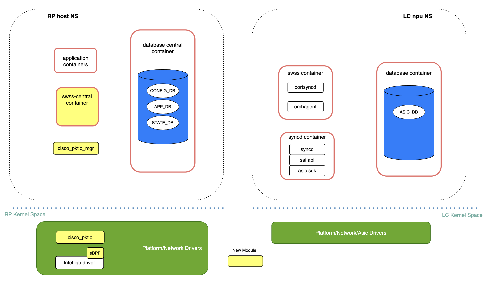
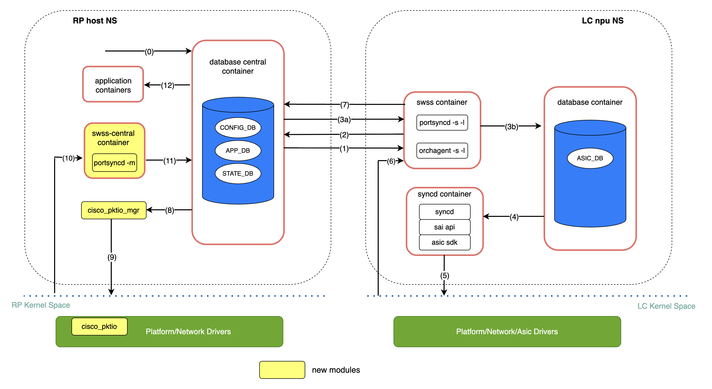
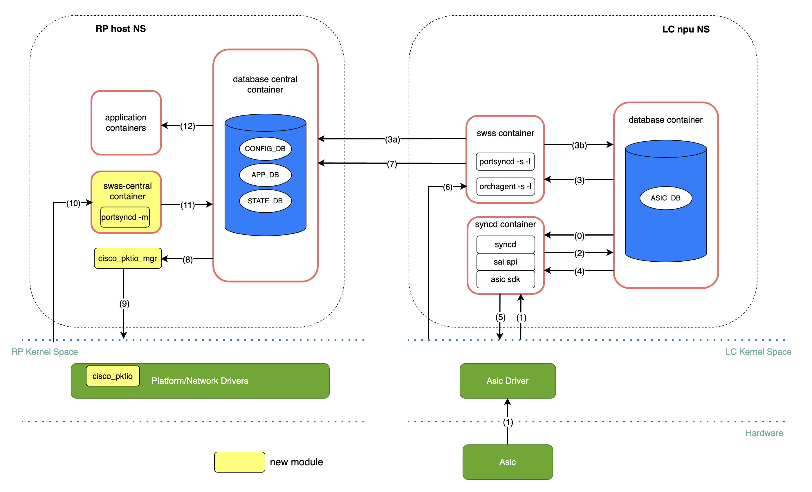
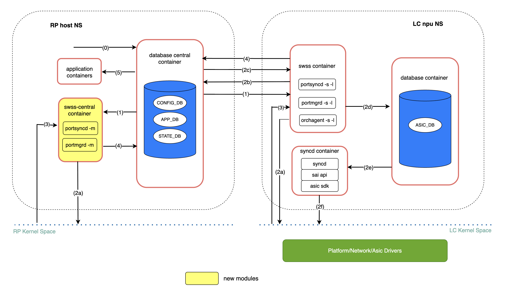

# Port Orchestration and Host Path for VOQ Modular Chassis

# Table of Contents

- [About This Document](#about-this-document)
- [High Level Proposal](#high-level-proposal)
  - [Port Naming Convention](#port-naming-convention)
  - [CONFIG_DB](#config_db)
    - [PORT table](#port-table)
    - [SYSTEM_PORT RP_CPU entry](#system_port-rp_cpu-entry)
  - [STATE_DB PORT_TABLE](#state_db-port_table)
  - [Environment Variables](#environment-variables)
  - [Software Modules](#software-modules)
    - [Swss](#swss)
    - [Swss-central](#swss-central)
    - [Platform Modules](#platform-modules)
- [Port Orchestration](#port-orchestration)
  - [Port Initialization](#port-initialization)
  - [Port State Update](#port-state-update)
  - [Port Config Update](#port-config-update)
- [Host Path](#host-path)
  - [Punt Destinations](#punt-destinations)
  - [Internal Control Path](#internal-control-path)
  - [Platform Modules](#platform-modules-1)
  - [Punt Flow (NPU &rarr; RP CPU)](#punt-flow-npu--rp-cpu)
  - [Inject Flow (RP CPU &rarr; NPU/port)](#inject-flow-rp-cpu--npuport)
- [Future Work](#future-work)
  - [Dynamic System Ports](#dynamic-system-ports)
  - [Platform-Independent Host Interface Management](#platform-independent-host-interface-management)
  - [CPU Destination Parameters for Traps](#cpu-destination-parameters-for-traps)
- [References](#references)

# Revision

| Rev | Date | Author | Change Description |
|-----|------|--------|--------------------|
| 0.1 | 2026-06-12 | Jihong Li | Initial version |

# About This Document

This document covers front panel port orchestration and the host path (aka punt/inject) in a modular chassis running in VOQ mode. 
It assumes that the centralized CONFIG_DB, APPL_DB and STATE_DB in the database-central container run in the RP host namespace. Services running in the linecard npu namespace have access to the centralized database and use it for communication.

The overall centralized architecture of the VOQ modular chassis — including the database/service placement, container distribution across the RP and linecards — is described in the [VOQ chassis architecture HLD](https://github.com/huanlev/SONiC/blob/f4c462700e6b89532f39e7e199b95745320366bc/doc/centralized-chassis/voq_chassis_hld.md). That architecture is taken as a given baseline here and is not covered again in this document; this document focuses only on the port orchestration and host path aspects.

# High Level Proposal

This section describes the major high level design changes required to support front panel port orchestration and the host path in a VOQ modular chassis. 


## Port Naming Convention

To uniquely identify a front panel port across all linecards and asics in the chassis, the port naming scheme is changed from the flat `EthernetX` form to a slot/front-panel-port qualified form:

```
Ethernet<slot_id>_<front_panel_port_id>
```

For example, front panel port 0 on the linecard in slot 2 is named `Ethernet2_0`. This guarantees globally unique interface names so that ports owned by different linecards/asics do not collide in the centralized CONFIG_DB, APPL_DB and STATE_DB.

## CONFIG_DB

### PORT table

Each CONFIG_DB PORT table entry is extended to carry the location of the port within the chassis. Two new fields are added:

- `slot_id`: the slot (linecard) that owns the port.
- `asic_id`: the asic/npu (DEV) within that linecard that owns the port.

These fields allow portsyncd, portmgrd and orchagent to filter and process only the ports that belong to the namespace they are running in.

Example PORT table entry:
```
PORT|Ethernet2_10
    slot_id: 2
    asic_id: 0
    lanes: ...
    alias: ...
    speed: ...
    ...
```

### SYSTEM_PORT RP_CPU entry

A new `RP_CPU` system port is added for each asic in every linecard. It represents the system port that the asic/npu uses to forward control-plane (punt) traffic to the CPU on the RP.

The key naming follow the existing SYSTEM_PORT, in the format of `SYSTEM_PORT|<slot_id>|asic<asic_id>|RP_CPU`, identifying the linecard slot and asic that the system port belongs to.

Example SYSTEM_PORT entry:
```
SYSTEM_PORT|LC0|asic0|RP_CPU
    core_index: 2
    core_port_index: 17
    num_voq: 8
    speed: 10000
    switch_id: 0
    system_port_id: 1512
```

## STATE_DB PORT_TABLE

In a VOQ chassis there will be two host interfaces associated with a front panel port, one in the RP host namespace and one in the linecard npu namespace.  Each of them will have a corresponding record entry in STATE_DB.  To keep north-bound applications agnostic, the state of the hostif in RP will use the global PORT_TABLE keyspace in STATE_DB. The state of the hostif in the npu namespace will use a linecard/npu specific keyspace.

STATE_DB key for RP:
```
PORT_TABLE|Ethernet2_10
```

STATE_DB key for linecard/npu is in the format of PORT_TABLE|<slot_id>|aisc<asid_id>|EthernetX_Y:
```
PORT_TABLE|2|asic0|Ethernet2_10
```

## Environment Variables

`SLOT_ID` and `ASIC_ID` (DEV) are passed into the swss containers as environment variables. The container in turn passes them into the processes running inside it (orchagent, portsyncd and portmgrd). These processes use them to identify which ports they own and to filter the centralized CONFIG_DB/APPL_DB/STATE_DB content so that each instance only acts on the ports belonging to its own slot/asic.

For example, on a linecard in slot 2 that has 3 asics, there is one swss container per asic (`swss0`, `swss1`, `swss2`). Inspecting the environment of the `swss2` container shows `SLOT_ID=2` and `DEV=2`:

```
root@LC2:/home/admin# docker ps | grep swss
a619e35f3e38   docker-orchagent:latest  ...  swss0
974b02d35b64   docker-orchagent:latest  ...  swss2
563fdb65e746   docker-orchagent:latest  ...  swss1

root@LC2:/home/admin# docker exec -it swss2 env
DEV=2
NAMESPACE_PREFIX=asic
NAMESPACE_ID=2
NAMESPACE_COUNT=3
SLOT_ID=2
CONTAINER_NAME=swss2
...
```

These values are then propagated to the processes running inside the container, which pass them on the command line so each instance only acts on its own slot/asic (`-s/-l 2` = slot 2, `-n 2` = asic 2):

```
root@LC2:/home/admin# docker exec -it swss2 ps -efww
... /usr/bin/portsyncd -s 2 -n 2
... /usr/bin/orchagent ... -l 2 -n 2
... /usr/bin/portmgrd -s 2 -n 2
```

On the RP0, the `swss-central` container instead has `SLOT_ID=RP0` and an empty `DEV`/`NAMESPACE_ID`, since it is not tied to a single linecard asic. Its `portsyncd` and `portmgrd` are started with the `-m` option to indicate they run in swss-central rather than a per-asic swss container:

```
root@RP0:/home/admin# docker exec -it swss-central env
SLOT_ID=RP0
NAMESPACE_ID=
NAMESPACE_PREFIX=asic
NAMESPACE_COUNT=16
DEV=
CONTAINER_NAME=swss-central
IMAGENAME=docker-swss-central
...

root@RP0:/home/admin# docker exec -it swss-central ps -efww
... /usr/bin/portsyncd -m
... /usr/bin/portmgrd -m
...
```

## Software Modules

The overall software modules are illustrated in Figure 1 below.
<figure align=center id="figure1">

<figcaption><em>Figure 1. Software modules</em></figcaption>
</figure>

### Swss

On linecard, swss and syncd are still running in npu/asic namespaces. The swss/syncd in each asic namespace remains responsible for initializing and managing the front panel ports that its own asic owns, exactly as in a non-modular system. During initialization, portsyncd running in linecard npu namespace establishes communication channels with the database-central running on RP. Portsyncd declares its intention to act as a publisher towards APPL_DB and STATE_DB, and as a subscriber for CONFIG_DB. Likewise, portsyncd also subscribes to the system's netlink channel responsible for carrying port/link-state information. 

Each swss container running in a linecard npu namespace now has the `SLOT_ID` and `ASIC_ID` (DEV) available to it, and passes them to the orchagent, portsyncd and portmgrd processes running inside it. These processes use the slot/asic id to identify and filter the ports they own in the centralized CONFIG_DB/APPL_DB/STATE_DB. Details on how these values are provided to the container and propagated to the processes are covered in the [Environment Variables](#environment-variables) section.

### Swss-central

 A new container, swss-central, is created and run on RP only. Modified versions of portsyncd and portmgrd run inside swss-central. They are started with the `-m` option to indicate that they are running in the swss-central container (as opposed to a per-asic swss container). The swss-central portsyncd subscribes to the system's netlink channel responsible for carrying hostif information on RP and is a publisher to STATE_DB's global port table. The linecard/npu port state table in STATE_DB is instead subscribed to by the platform-specific module cisco_pktio_mgr, which drives creation of the corresponding host interfaces in the RP kernel (see the Port Initialization section).

### Platform Modules

Two platform-specific modules are involved in mirroring the linecard front panel ports as host interfaces in the RP kernel:

- **cisco_pktio_mgr**: a user-space daemon running in the RP host namespace. It subscribes to the linecard/npu port table entries in STATE_DB and, for each port, sends netlink socket messages to the cisco_pktio kernel module to create or update the matching host interface in the RP kernel using the parameters published by the linecard portsyncd.
- **cisco_pktio**: a kernel module in the RP. It receives the netlink messages from cisco_pktio_mgr and creates/updates the RP host interfaces accordingly. The creation/update of these interfaces in turn generates netlink events that the swss-central portsyncd consumes to populate the global PORT_TABLE in STATE_DB.

Besides mirroring the front panel ports, these same modules, together with an eBPF punt module, implement the RP side of the host path (punt/inject) so that control-plane traffic can be exchanged between the RP CPU and the linecard front panel ports (see the [Host Path](#host-path) section):

- **cisco_pktio_mgr** maintains the mapping between front panel ports (system ports) and their corresponding RP host interfaces (kernel netdevs), and programs this mapping into the kernel and into the eBPF map used for punt processing.
- **cisco_pktio** implements the per-port packet I/O on the RP control path: on inject it prepends the inject header identifying the target system port and transmits the packet over the internal control path.
- **eBPF punt program**: an eBPF program attached to the RP control interface. On punt it inspects the punt header, looks up the source system port in the eBPF map populated by cisco_pktio_mgr, and redirects the packet to the matching RP host interface.

# Port Orchestration

## Port Initialization

This section describes the front panel port initialization sequence after a linecard boots up.

<figure align=center>

<figcaption><em>Figure 2. front panel port initialization flow</em></figcaption>
</figure>

(0) cfg setup service on RP has pushed PORT-related configuration into CONFIG_DB

(1) Portsyncd running in an npu namespace receives port-related configuration such as lanes, interface name, interface alias, speed, etc. for its own npu and publishes them to the port table in APPL_DB

(2) Upon finishing publishing all configuration, portsyncd notifies orchagent by publishing an NPU-specific PortCfgDone in APPL_DB

(3) Orchagent hears about all this new state but will defer acting on it until portsyncd notifies that it is fully done publishing them (3a). Once this happens, orchagent will proceed with the initialization of the corresponding port interfaces in hardware/kernel. Orchagent invokes sairedis APIs to deliver this request to syncd through the usual ASIC_DB interface (3b).

(4) Syncd receives this new request through ASIC_DB and prepares to invoke the SAI APIs required to satisfy Orchagent's request.

(5) Syncd makes use of SAI APIs + ASIC SDK to create kernel host-interfaces associated with the physical ports being initialized on the linecard.

(6) The previous step will generate a netlink message that will be received by portsyncd. Upon arrival at portsyncd of the messages associated with all the ports previously parsed, portsyncd will proceed to declare the 'initialization' process completed.

(7) As part of the previous step, portsyncd writes a record-entry into STATE_DB corresponding to each of the ports that were successfully initialized in a linecard/npu specific keyspace.

(8) From this moment on, applications previously subscribed to STATE_DB content will be notified. One of them is a platform-specific module running in the RP host namespace (cisco_pktio_mgr).

(9) cisco_pktio_mgr subscribes to linecard/npu port table entries in STATE_DB created in step 7 and sends corresponding netlink socket messages to the kernel module (cisco_pktio) to create host-interfaces in the RP kernel using the parameters that are published by portsyncd in step (7)

(10) The previous step will generate a netlink message that will be received by portsyncd in swss-central. 

(11) Swss-central portsyncd writes a record-entry into STATE_DB in the global PORT_TABLE keyspace.

(12) From then on all applications that are interested in port state will receive notification and can start using it.

(13) In modular RP mode, `PortInitDone` is published to APPL_DB as soon as all host interfaces are created for ports in at least one namespace (identified by `slot_id` + `asic_id`), without waiting for other namespaces to complete.

## Port State Update

This section describes the sequence of steps that take place when a physical port state changes. A port-going-down event is used as an example. Other state changes follow the same path.

<figure align=center>

<figcaption><em>Figure 3. front panel port update flow</em></figcaption>
</figure>

(0) Syncd acts both as a publisher and as a subscriber within the context of ASIC_DB. The 'subscriber' mode is for syncd to receive state from the north-bound applications. The 'publisher' mode is required to allow syncd to notify higher-level components of the arrival of hardware-spawned events.

(1) Upon detection of the loss-of-carrier by the corresponding ASIC's optical module, a notification is sent towards the associated driver, which in turn delivers this information to syncd.

(2) Syncd invokes the proper notification-handler and sends the port-down event towards ASIC_DB.

(3) Orchagent makes use of its notification-thread (exclusively dedicated to this task) to collect the new state from ASIC_DB, and executes the 'port-state-change' handler to:

 a.  Generate an update to APPL\_DB to alert applications relying on
    this state for their operation

b.  Invoke sairedis APIs to alert syncd of the need to update the
    kernel state on linecard associated to the host-interface of the port being
    brought down. Again, orchagent delivers this request to syncd
    through the usual ASIC\_DB interface.

(4) Syncd receives this new request through ASIC_DB and prepares to invoke the SAI APIs required to satisfy orchagent's request.

(5) Syncd makes use of SAI APIs + ASIC SDK to update the kernel with the latest operational state (DOWN) of the affected host-interface.

(6) A netlink message associated with the previous step is received at portsyncd.

(7) Portsyncd writes a record-entry into STATE_DB corresponding to the port that is being brought down in a linecard/npu specific keyspace.

(8) From this moment on, applications previously subscribed to STATE_DB content will be notified. One of them is a platform-specific module running in the RP host namespace (cisco_pktio_mgr).

(9) cisco_pktio_mgr sends corresponding netlink socket messages to the kernel module (cisco_pktio) to update host-interfaces in the RP kernel using the parameters that are published by portsyncd in step (7) 

(10) The previous step will generate a netlink message that will be received by portsyncd in swss-central. 

(11) swss-central portsyncd updates the record-entry in STATE_DB in the global PORT_TABLE keyspace to reflect the latest state of the port.

(12) From then on all applications that are interested in port state will receive notification and can start acting on it.

## Port Config Update

This section describes the sequence of steps that take place when a user changes the configuration of an already-initialized front panel port (for example `config interface mtu`, `config interface startup`/`shutdown`). A port MTU change is used as an example; other attribute changes (admin status, etc.) follow the same path.

<figure align=center>

<figcaption><em>Figure 4. front panel port config update flow</em></figcaption>
</figure>

(0) The user changes a port attribute (for example MTU) with a `config` command. This updates the centralized CONFIG_DB PORT table entry, which carries the owning `slot_id` and `asic_id` for the port.

(1) The CONFIG_DB PORT update is delivered to its subscribers: the swss-central `portmgrd`/`portsyncd` on the RP, and the per-npu `portmgrd`/`portsyncd` in the owning linecard npu namespace.

(2) Step 2a happens on both RP and linecard. Steps 2b to 2f happen on linecard per-npu namespace only.

    (2a) `portmgrd` applies the new attribute to the host interface in the kernel (`ip link set dev <Ethernet<slot_id>_<port_id>> ...`). This happens on both sides: the swss-central `portmgrd` updates the RP-side host interface, and the per-npu `portmgrd` updates the linecard-side host interface.

    (2b) The per-npu `portmgrd -s -l` publishes the updated attribute into APP_DB.

    (2c) `orchagent -s -l` in the same linecard npu namespace consumes the APP_DB update.

    (2d) `orchagent` programs the change into ASIC_DB by invoking the sairedis APIs.

    (2e) `syncd` in the linecard npu namespace receives the request through ASIC_DB.

    (2f) `syncd` uses the SAI API + ASIC SDK to apply the new attribute to the physical port.

(3) The resulting kernel netlink event is consumed by `portsyncd`: the per-npu `portsyncd -s -l` on the linecard side, and the swss-central `portsyncd -m` on the RP side.

(4) `portsyncd` writes the updated port state into STATE_DB. The per-npu `portsyncd -s -l` updates the linecard/npu PORT_TABLE keyspace, and the swss-central `portsyncd -m` updates the global PORT_TABLE keyspace.

(5) Any applications subscribed to STATE_DB are notified of the updated port state and can start acting on it.

# Host Path

In a VOQ modular chassis running in centralized mode, the control plane (routing protocols, etc.) runs on the RP rather than on the individual linecards. For this to work, control-plane traffic received on a linecard front panel port must be delivered to the RP CPU, and packets generated by the RP CPU must be sent back out of the owning linecard's front panel port. This punt (NPU &rarr; CPU) and inject (CPU &rarr; NPU/port) traffic is collectively referred to as the *host path*.

The overall software modules involved in host path is already illustrated in [Figure 1](#figure1)

The host path is built on top of the front panel host interfaces described in the [Port Initialization](#port-initialization) section. For every linecard front panel port `Ethernet<slot_id>_<port_id>`, there is a host interface in the owning linecard npu namespace and a mirrored host interface in the RP host namespace. The RP-side host interface is what allows an application running on the RP to send and receive traffic for a port that physically resides on a linecard, exactly as if the port were local.

The host path implementation is mainly platform-dependent. What is documented here describes the implementation for the Cisco 8000 modular chassis only; other platforms may realize the host path differently.

## Punt Destinations

A punted packet can have one of two destinations depending on how it is handled:

- **RP CPU**: control-plane packets that are processed centrally (for example routing-protocol traffic) are punted from the linecard NPU all the way to the RP CPU.
- **Linecard local CPU**: packets that can be serviced locally on the linecard can continue to be punted to the linecard's own CPU, as in a non-modular system.

Which destination applies to a given packet is determined by the NPU trap configuration. Each trap type is programmed with a punt destination (RP CPU or linecard CPU) during ASIC/switch initialization, so the hardware steers each class of punted traffic to the correct CPU.

## Internal Control Path

Punt and inject traffic between a linecard NPU and the RP CPU travels over an internal, chassis-private control path that interconnects the linecards and the RP. Packets carried on this path are tagged with a punt/inject header that identifies the front panel port (system port) they are associated with. This header is what allows the receiving side to map a packet to the correct front panel port / host interface, regardless of which linecard or NPU it belongs to.

## Platform Modules

Three platform-specific modules on the RP, introduced in the [Platform Modules](#platform-modules) section, are responsible for the RP side of the host path:

- A user-space **packet-I/O manager** that monitors the linecard/npu `PORT_TABLE` entries in STATE_DB and drives creation/update of the matching RP host interfaces, and maintains the mapping between front panel ports (system ports) and the corresponding RP host interfaces (kernel netdevs).
- A **kernel module** that creates the RP host interfaces and implements the per-port packet I/O on the RP control path (notably the inject-side processing).
- An **eBPF punt program** attached to the RP control Ethernet interface that handles the punt-side processing.

Because the RP's control interface is driven by a standard NIC driver, the punt-side processing on the RP is implemented as a separate **eBPF program** rather than inside the kernel module. The eBPF program inspects the punt header of each incoming packet, looks up the source system port in a map populated by the packet-I/O manager, and redirects the packet to the matching RP host interface. The system-port-to-host-interface mapping is shared with the eBPF program through an eBPF map.

These modules can be generic in role; the specific implementation is platform-dependent.

## Punt Flow (NPU &rarr; RP CPU)

(1) A control-plane packet arrives on a linecard front panel port and matches a trap whose punt destination is the RP CPU.

(2) The linecard NPU encapsulates the packet with a punt header that carries the source system port and forwards it over the internal control path toward the RP.

(3) The packet is received on the RP host CPU's control interface. The eBPF punt program attached to that interface inspects the punt header, extracts the source system port, and maps it to the corresponding RP host interface (netdev) using the eBPF map maintained by the packet-I/O manager.

(4) The punt header is stripped and the packet is redirected to that RP host interface.

(5) Applications running on the RP receive the packet on the host interface as if it had arrived on a local port.

## Inject Flow (RP CPU &rarr; NPU/port)

(1) An application on the RP transmits a packet out of an RP host interface that mirrors a linecard front panel port.

(2) The platform kernel module intercepts the transmit, prepends an inject header that identifies the target system port (derived from the host interface), and sends the packet over the internal control path toward the owning linecard.

(3) The linecard NPU receives the injected packet, interprets the inject header, and forwards the packet out of the corresponding front panel port.

# Future Work

## Dynamic System Ports

Today the system ports for the entire chassis are configured statically. To properly support forwarding module (linecard) insertion and removal in a modular chassis, system ports need to be created and deleted dynamically as modules come and go, instead of being provisioned up front. This is described as future work in the [VOQ HLD](https://github.com/sonic-net/SONiC/blob/master/doc/voq/voq_hld.md#6-future-work) and is crucial for the modular chassis to gracefully handle forwarding module insertion/removal.

## Platform-Independent Host Interface Management

RP host interface creation/update/deletion and traffic handling are currently implemented in three platform specific modules (cisco_pktio, cisco_pktio_mgr and eBPF). Traffic handling generally is a platform dependent function, while RP host interface management can be generic. Our next step is to generalize the RP-side host interface creation/deletion logic into platform-independent modules, while allowing platform-dependent functions (such as tx/rx packet handling) to be easily plugged in. This keeps the common orchestration logic shared across platforms and confines the platform-specific implementation to well-defined plug-in points.

## CPU Destination Parameters for Traps

In a modular chassis there can be multiple control-plane destinations (the RP CPU, the individual linecard CPUs, etc.). When a trap's `trap_action` includes the CPU as a destination (for example `trap`, `copy` or `log`), the punted/copied traffic needs to be steered to a specific CPU and encapsulated appropriately for the internal control path. This requires defining a set of CPU destination parameters per trap (or per trap group), such as:

- destination CPU (RP CPU vs. a specific linecard CPU)
- source MAC and destination MAC
- VLAN

A follow-up is needed to define how these CPU destination parameters are configured (for example as part of the trap/CoPP configuration), and corresponding SAI changes.


# References

1. Sonic architecture https://github.com/sonic-net/SONiC/wiki/Architecture
2. Centralized SONiC VOQ Chassis Architecture https://github.com/huanlev/SONiC/blob/f4c462700e6b89532f39e7e199b95745320366bc/doc/centralized-chassis/voq_chassis_hld.md
3. SONiC VOQ HLD https://github.com/sonic-net/SONiC/blob/master/doc/voq/voq_hld.md
