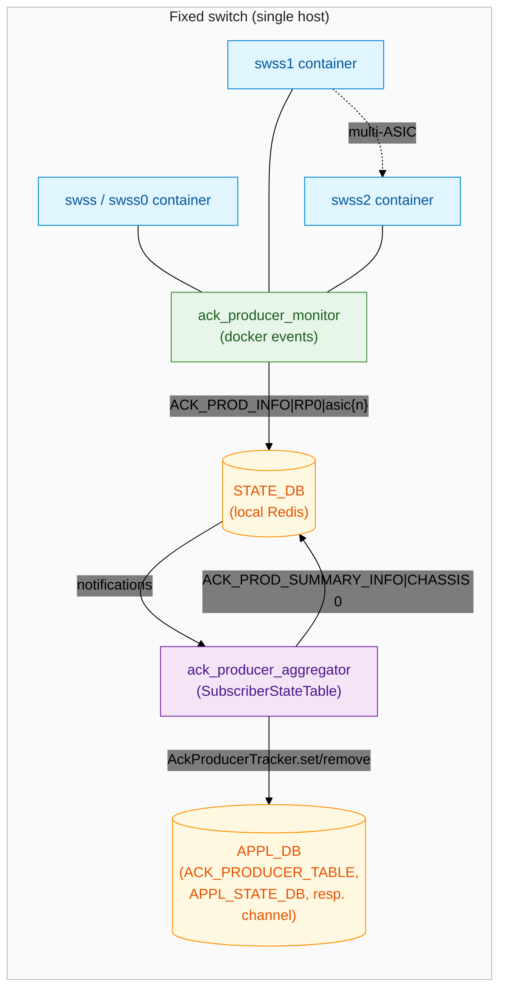
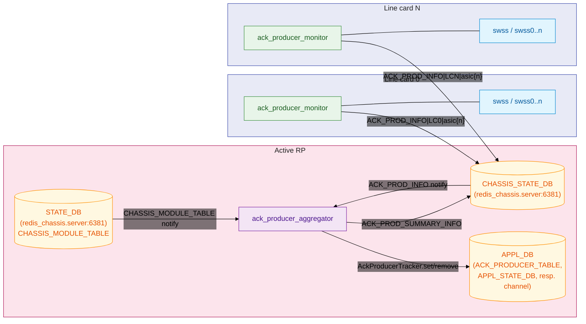

# Route ACK Producer Tracking in SONiC HLD #

### Rev 1.0 ###

# Table of Contents

  * [Revision](#revision)
  * [About this Manual](#about-this-manual)
  * [Scope](#scope)
  * [Acronyms](#acronyms)
  * [1. Goals and Non-Goals](#1-goals-and-non-goals)
    * [Goals](#goals)
    * [Non-Goals](#non-goals)
  * [2. Architecture](#2-architecture)
    * [2.1 Topology](#21-topology)
  * [3. Data Model](#3-data-model)
    * [3.1 ACK_PROD_INFO](#31-ack_prod_info)
    * [3.2 ACK_PROD_SUMMARY_INFO](#32-ack_prod_summary_info)
    * [3.3 Bitmap layout](#33-bitmap-layout)
    * [3.4 AckProducerTracker (addition to sonic-swss-common)](#34-ackproducertracker-addition-to-sonic-swss-common)
  * [4. Monitor (ack_producer_monitor)](#4-monitor-ack_producer_monitor)
    * [4.1 Responsibilities](#41-responsibilities)
    * [4.2 Event handling and debounce](#42-event-handling-and-debounce)
    * [4.3 Why Docker events?](#43-why-docker-events)
  * [5. Aggregator (ack_producer_aggregator)](#5-aggregator-ack_producer_aggregator)
    * [5.1 Responsibilities](#51-responsibilities)
    * [5.2 Two listener threads](#52-two-listener-threads)
    * [5.3 Card-state handling](#53-card-state-handling)
    * [5.4 Producer-event handling](#54-producer-event-handling)
    * [5.5 Concurrency model](#55-concurrency-model)
  * [6. Open Questions for Community Review](#6-open-questions-for-community-review)

### Revision ###

 | Rev |     Date    |       Author                                                            | Change Description                |
 |:---:|:-----------:|:-----------------------------------------------------------------------:|-----------------------------------|
 | 1.0 | 06/22/2026  |  Chanabasappa Gundapi                                                   | Initial version                   |

# About this Manual
This document proposes a SONiC mechanism to track **route-object ACK producers**
— the per-ASIC `swss` instances that program route objects — and to
expose a single chassis-wide bitmap of producers that are alive and able to
acknowledge route-programming requests.

Consumers in the data-plane stack (`orchagent`, route aggregators, FRR shims,
etc.) can use this bitmap to decide when an aggregate ACK has been received
from *all* expected producers, and to suppress phantom ACKs from producers
that are gone (card removed, NPU down, container restarting, etc.).

# Scope
The proposal targets both **fixed (single-host) SONiC switches**, including
multi-ASIC boxes, and **modular chassis** with multiple line cards. The data
contract is identical in both cases; consumers do not branch on platform type.

This document defines the producer-liveness tracking daemons
(`ack_producer_monitor` and `ack_producer_aggregator`), the Redis schema they
publish (`ACK_PROD_INFO`, `ACK_PROD_SUMMARY_INFO`), the `AckProducerTracker`
helper they invoke, and the per-platform behavior that maps the same code
base onto fixed and modular topologies. ACK aggregation logic inside
`orchagent` and other consumers is out of scope; this proposal supplies only
the liveness signal those consumers depend on.

# Acronyms
ACK - Acknowledgement (route-programming response)

APPL_DB - Application Database (Redis logical DB used by `orchagent` and
producers/consumers in `swss`)

APPL_STATE_DB - Application State Database (Redis logical DB used by
`orchagent`'s `ResponsePublisher` to mirror state for fpmsyncd-style
responses)

ASIC - Application-Specific Integrated Circuit

BGP - Border Gateway Protocol

CHASSIS_STATE_DB - Chassis-wide Redis state database hosted on the active
supervisor; readable/writable from line cards over the chassis network

DB - Database

FRR - FRRouting (Free Range Routing) suite

HA - High Availability

LC - Line Card

NPU - Network Processing Unit

RP - Route Processor (Supervisor card on a modular chassis)

swss - Switch State Service (container hosting `orchagent` and related
agents; one instance per ASIC on multi-ASIC platforms)

syncd - Sync Daemon (SAI-facing programmer; one instance per ASIC, runs in
its own container)

---

## 1. Goals and Non-Goals

### Goals
- **Single source of truth** for "which route ACK producers are alive" across
  fixed and modular SONiC platforms.
- **Survive transient container restarts** (`start → kill → die → start`)
  without flapping the producer state seen by consumers.
- **Reflect card-level state** (`Empty` / `PoweredDown` / `Offline` / `Fault`)
  immediately, so consumers do not wait on ACKs from cards that cannot reply.
- **Platform-agnostic schema** — consumers read the same Redis tables on any
  topology.
- **Tunable scale** (cards × NPUs/card) so the same code base covers a
  single-ASIC fixed switch and a large modular chassis without forking.

### Non-Goals
- Per-process death/ready tracking inside a container. The initial proposal
  observes container-level events only; finer-grained signals are a follow-up
  (§6).
- Cross-supervisor leader election. The proposal relies on the standard SONiC
  active-supervisor behavior provided by `database.service` and the placement
  of `CHASSIS_STATE_DB` on the active RP.
---

## 2. Architecture

Two cooperating systemd-managed daemons:

| Daemon | Service unit | Runs on | Writes | Reads |
| --- | --- | --- | --- | --- |
| **`ack_producer_monitor`** | `ack-producer-monitor.service` | Every **line card** and every **fixed** host | `ACK_PROD_INFO` rows (one per NPU on the local card) | Docker events stream + `docker inspect` |
| **`ack_producer_aggregator`** | `ack-producer-aggregator.service` | **Active supervisor** on modular chassis; the host on fixed switches | `ACK_PROD_SUMMARY_INFO` row + the `AckProducerTracker` Redis Lua script | `ACK_PROD_INFO` (all cards), `CHASSIS_MODULE_TABLE` (modular only) |

The split between writer (line card) and aggregator (supervisor) maps cleanly
onto `CHASSIS_STATE_DB`: per-card daemons push their local view into a
chassis-wide Redis on the active supervisor, and a daemon on the supervisor
rolls them up into a single summary row.

### 2.1 Topology

#### Fixed chassis



On a fixed switch, both daemons run on the same host. `is_modular_chassis()
== False` collapses the two logical databases (`ack_db` and `state_db`) onto
the single local `STATE_DB`. The key prefix is `RP<slot>|asic<n>` with
`slot = 0`.

#### Modular chassis



Every line card writes into the **shared chassis Redis** (`redis_chassis.server`,
port 6381) on the RP. The aggregator listens on `CHASSIS_STATE_DB` for
producer changes and rolls them up into a single
`ACK_PROD_SUMMARY_INFO|CHASSIS 0` row. It also reads the **chassis-wide**
`STATE_DB` — the STATE_DB instance on the same `redis_chassis.server`, — for `CHASSIS_MODULE_TABLE`. `chassisd`
on the active RP publishes card oper-state there so the same view of every
line card is visible chassis-wide.

---

## 3. Data Model

### 3.1 `ACK_PROD_INFO`

One row per `(card, NPU)`. Written by the **monitor** on each card / fixed
host.

| Column | Example | Description |
| --- | --- | --- |
| _key_ | `LC0\|asic0` *(modular)* or `RP0\|asic0` *(fixed)* | `<card-prefix><slot>\|asic<n>` |
| `l_slot` | `0` | Logical slot number of the card (PI slot number)|
| `npu_num` | `0` | NPU index within the card |
| `bit_pos` | `0` | `(l_slot * MAX_NPUS_PER_CARD) + npu_num` (precomputed for consumers) |
| `container_name` | `swss0` | The container being tracked |
| `container_id` | `<docker-id>` | Last observed container id |
| `status` | `0` \| `1` | `1` = container active and past debounce, `0` = not active |
| `description` | `start`, `running`, `die`, … | Last docker event/state string |
| `timestamp` | `20260603 14:09:11` | Last update time (UTC of the local host) |

### 3.2 `ACK_PROD_SUMMARY_INFO`

A single row, always keyed `CHASSIS 0`. Written by the **aggregator**.

| Column | Example | Description |
| --- | --- | --- |
| _key_ | `CHASSIS 0` | Fixed key |
| `ack_prod_cnt` | `4` | Number of bits set in the bitmap (= live producers) |
| `ack_prod_bitmap` | `21` | Integer representation of the bitmap |
| `ack_prod_bits` | `10101` | Binary string for human inspection |
| `timestamp` | `20260603 14:09:11` | Last update time |

### 3.3 Bitmap layout

```
bit_pos = l_slot * MAX_NPUS_PER_CARD + npu_num
```

`MAX_NPUS_PER_CARD` is a build-time constant. The chosen bitmap width
determines overall capacity:

| Bitmap width | NPUs / card | Max cards | Notes |
| --- | --- | --- | --- |
| 64-bit | 3 | 21 | Initial proposal; `AckProducerTracker::set` takes `uint64_t` |
| 128-bit | 3 | 42 | Future widening; schema unchanged |
| 128-bit | 6 | 21 | Future widening; denser cards |

The schema does **not** encode these limits — consumers read
`ack_prod_bitmap` as an opaque unsigned integer up to the chosen width.

Example: `LC2 NPU1` → bit `2 * 3 + 1 = 7`.

### 3.4 `AckProducerTracker` (addition to `sonic-swss-common`)

A C++ helper invoked by the aggregator on every bitmap change:

```python
self.ack_tracker.set(bitmap_diff)     # producer(s) appeared
self.ack_tracker.remove(bitmap_diff)  # producer(s) disappeared
```

#### DB targets (important)

`AckProducerTracker` does **not** write to `CHASSIS_STATE_DB`. It opens
connections to the local **`APPL_DB`** and **`APPL_STATE_DB`** and operates
exclusively on them:

| Call | DB | Effect |
| --- | --- | --- |
| `set(bitlist)` | `APPL_DB` | `EVALSHA` of `ackproducer_tracker_add.lua` against `ACK_PRODUCER_TABLE`; adds bits to the per-producer bitmap |
| `remove(bitlist)` | `APPL_DB` | For each key under `ACK_PRODUCER_TABLE`, `EVALSHA` of `ackproducer_tracker_del.lua`; clears bits and, when a producer set goes empty, returns a `system_object` to be ACK-published |
| `remove(bitlist)` (side effect) | `APPL_STATE_DB` | `publishLikeResponsePublisher` writes `<table>` (e.g. `ROUTE_TABLE`) state — mirrors orchagent `ResponsePublisher::publish` |
| `remove(bitlist)` (side effect) | `APPL_DB_<table>_RESPONSE_CHANNEL` | `NotificationProducer::send` with `err_str + protocol + intent` so that `fpmsyncd::RouteSync::onRouteResponse` can ACK the route |

The `ACK_PROD_SUMMARY_INFO` row described in §3.2 is the only artifact the
aggregator publishes into `CHASSIS_STATE_DB` (modular) or `STATE_DB`
(fixed) — and it does so via a normal `Table` write, not via
`AckProducerTracker`.

#### Thread safety

The aggregator runs two listener threads (§5.2) that can both reach
`AckProducerTracker.set/remove`. To preserve ordering between a
producer-up event and a card-offline event for the same slot, the
aggregator serializes them on `self.lock` and holds that lock across the
in-memory bitmap mutation **and** the `AckProducerTracker` call (§5.5).
The C++ helper itself only needs to be re-entrancy-safe per Redis
connection; the application-level ordering is enforced by the caller.

---

## 4. Monitor (`ack_producer_monitor`)

### 4.1 Responsibilities
1. Discover which `swss*` containers the local host is responsible for, based
   on `device_info.is_multi_npu()` / `get_namespaces()`.
2. Translate "container alive / dead" into the
   `(l_slot, npu_num, status)` tuple that the aggregator understands.
3. Tolerate noisy docker event sequences during container restart without
   flapping `status`.
4. Key prefix is `LC<slot>|` on modular, `RP<slot>|` on fixed.

### 4.2 Event handling and debounce

Container events are read from `docker.from_env().events()`. Each event is
classified:

```text
active_states   = {start, restart, unpause, running}
inactive_states = {stop, die, kill, pause, destroy, paused,
                   exited, dead, restarting, created}
```

- **Inactive** → write `status=0` immediately *and* cancel any pending
  active-debounce timer for that container.
- **Active** → schedule a per-container `threading.Timer(DEBOUNCE_SECONDS=5)`;
  if no inactive event arrives within 5 s, re-confirm via `docker inspect`
  and only then write `status=1`.

This matters because a typical container restart goes
`start → kill → stop → die → start` within roughly a second. Without
debounce, consumers would briefly observe `status=1` between the first
`start` and the intervening `kill`, falsely counting the producer as live.


### 4.3 Why Docker events?

SONiC has several adjacent pieces of infrastructure that touch container
state, but none of them is a drop-in source for what the monitor needs: a
real-time, symmetric (up *and* down), per-container signal that covers
`swss` / `syncd`. The table below compares the candidates and explains the
choice of the Docker events stream as the authoritative source.

| Source | Real-time? | Symmetric up/down? | Covers `swss`/`syncd`? | Per-NPU granularity? |
| --- | --- | --- | --- | --- |
| **Docker events** (proposed) | Yes (sub-second) | Yes | Yes | Yes (one container per ASIC) |
| `STATE_DB:FEATURE.container_id` (written by `container_startup.py`) | Event-driven (subscribe) | Up only; cleared on graceful stop, not on crash | **No** — `swss`/`syncd` `start.sh` does not invoke `container_startup.py` | N/A |
| `event-down-ctr` on `sonic-events-host` (published by Monit `container_checker`) | ~60 s (Monit cycle) | Down only | Yes (via `docker ps` fallback for always-running) | Yes (uses per-ASIC FEATURE keys) |
| `process-exited-unexpectedly` on `sonic-events-host` (published by `supervisor-proc-exit-listener`) | Real-time | Down only | Yes (inside `syncd`) | Yes (per container) |
| `STATE_DB:USER\|docker_stats\|<name>` (written by `procdockerstatsd`) | 2-min poll | Implicit (row presence) | Yes | Yes |
| `STATE_DB:SYSTEM_HEALTH_INFO` (written by `healthd`) | Periodic, aggregated | Aggregated text | Indirect | No |
| `CHASSIS_MODULE_TABLE` in the chassis `STATE_DB` on `redis_chassis.server` (written by `chassisd`) | Real-time | Yes (card oper-state) | Card-level only | No (whole-card) |

Concretely:

- `STATE_DB:FEATURE.container_id` is only populated for the kube-aware set
  (`bmp`, `snmp`, `lldp`, `dhcp-relay`, `dhcp-server`, `pmon`, `telemetry`,
  `gnmi`, `router-advertiser`). `swss` and `syncd` are "always-running" and
  never write this field — subscribing to `FEATURE` would silently miss the
  exact containers this daemon must track.
- The `sonic-events-host` event bus only emits **down** events, and
  `container_checker` runs at the Monit cycle (~60 s). Both are useful as
  *additional* corroborating signals but cannot replace a sub-second "up"
  edge.
- `procdockerstatsd` and `healthd` are aggregators of other signals, not
  primary liveness sources, and their 2-min / "summary" cadence is too
  coarse for the debounce state machine in §4.2.
- `CHASSIS_MODULE_TABLE` *is* used — but at the **aggregator** (§5.3), for
  the orthogonal job of clearing all NPU bits on a card-level state change.
  It cannot tell the monitor whether a single `swss<n>` inside a healthy
  card has restarted.

The Docker events stream is the only source that satisfies all four columns
for `swss`/`syncd`, which is why the monitor consumes it directly. The
`sonic-events-host` channel may be added later as a defense-in-depth
**down** corroboration without changing the primary path (§6).

---

## 5. Aggregator (`ack_producer_aggregator`)

### 5.1 Responsibilities
1. Maintain the authoritative `bitmap` and `ack_map` for the chassis.
2. React to producer changes (`ACK_PROD_INFO`) — write changes through
   `AckProducerTracker` and update the summary row.
3. React to card-level state changes (`CHASSIS_MODULE_TABLE`) — when a card
   becomes inactive, clear *all* NPU bits for that slot in one shot so
   consumers do not wait on ACKs from a card that has already been pulled.

### 5.2 Two listener threads

| Thread | Source | Selector | Started when |
| --- | --- | --- | --- |
| `ack_prod_upds_listener` | `ACK_PROD_INFO` via `SubscriberStateTable` on `ack_db` | `swsscommon.Select` | always on supervisor / fixed |
| `card_state_upds_listener` | `CHASSIS_MODULE_TABLE` via `SubscriberStateTable` on the chassis `STATE_DB` (`redis_chassis.server:6381`) | `swsscommon.Select` | only on modular supervisors |

Both threads first replay the existing keys in their respective tables on
entry, so the aggregator's view is correct **before** it starts processing
deltas — important after an aggregator restart while line cards are already
up.

### 5.3 Card-state handling

```python
inactive_states = {"Offline", "Empty", "PoweredDown", "Fault"}
if state in inactive_states:
    self.update_ack_producer_for_slot(slot, False)  # clears all NPU bits + cleans DB
```

`update_ack_producer_for_slot(slot, False)` additionally calls
`cleanup_db_for_slot(slot)`, which deletes every
`ACK_PROD_INFO|LC<slot>|asic*` row, so a removed card does not leave stale
producer entries behind for the next time the slot is repopulated.

### 5.4 Producer-event handling

```python
def process_ack_prod_upds(self, key, op, fvp):
    if key in ["PortConfigDone", "PortInitDone"]: return
    if op != "SET": return
    if slot >= max_num_lcs or npu >= MAX_NPUS_PER_CARD: return
    if self.ack_map[slot][npu] != status:
        self.update_ack_producer_for_npu(slot, npu, bool(status))
```

Idempotent against duplicate notifications and bounded against bad inputs.

### 5.5 Concurrency model

The two listener threads can race on the same slot, so `self.lock` is
held across **both** the in-memory mutation and the matching
`AckProducerTracker.set/remove`, `cleanup_db_for_slot`, and
`update_ack_prod_summary` calls. swsscommon is thread-safe per Redis
operation but does not preserve ordering across threads; keeping the
external calls inside the lock prevents a producer-up from resurrecting
bits that a concurrent card-offline just cleared.

Under the same lock, `update_ack_producer_for_npu` also drops producer-up
events for slots whose `card_state` is `Offline` / `Empty` /
`PoweredDown` / `Fault`. This covers the cross-queue case where a stale
producer-up in `ack_prod_sst` is processed after a fresh card-offline in
`chassis_module_sst`. `self.card_state` is initialized to `None`
("not yet observed") so the gate does not fire on aggregator startup
before the initial `CHASSIS_MODULE_TABLE` replay completes.

---


## 6. Open Questions for Community Review

- **Process-level tracking** — The monitor today observes container-level
  events only. A container-alive producer whose `orchagent` has wedged still
  reports `status=1`. Proposal: optionally watch `syncd`/`orchagent` process
  ready / death notifications inside the container.
- **Bitmap width** — The initial proposal caps at 64 bits (≤ 21 cards × 3
  NPUs). Widening to 128 bits is a non-breaking schema change; should the
  proposal commit to 128 bits up front?
- **Active-supervisor election** — The aggregator relies on standard SONiC
  active-supervisor placement via `database.service` and the chassis Redis
  topology. Are there platforms where explicit hand-off of
  `ACK_PROD_SUMMARY_INFO` across supervisor switchover needs to be specified
  here?
- **Defense-in-depth down signal** — Optionally subscribe to
  `sonic-events-host` (`event-down-ctr`, `process-exited-unexpectedly`) via
  `swsscommon.events_init_subscriber` as a secondary "down" signal, so a
  stuck Docker events stream cannot make the monitor blind to crashes. The
  Docker events path remains the primary source for both edges (§4.3).

---


