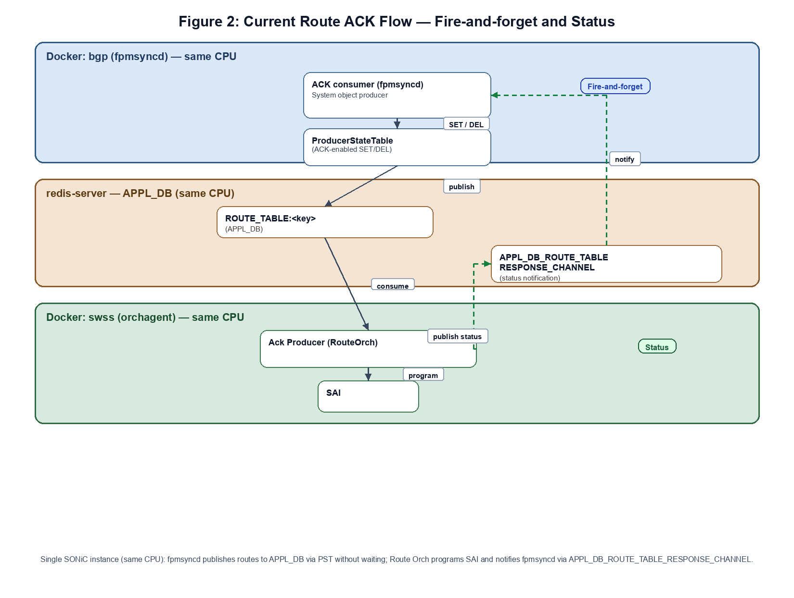
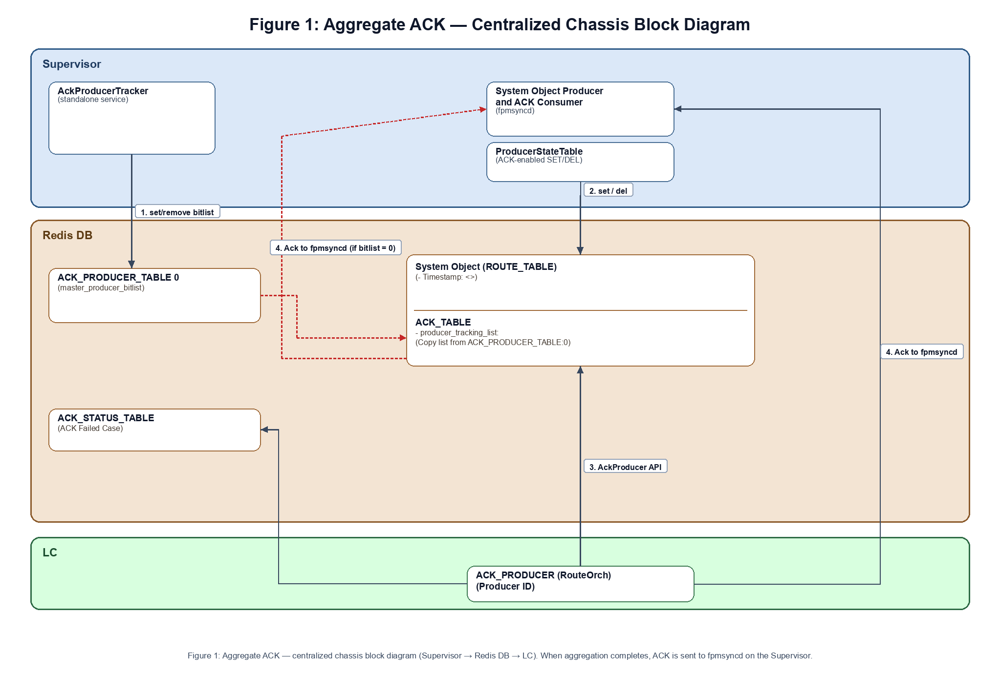
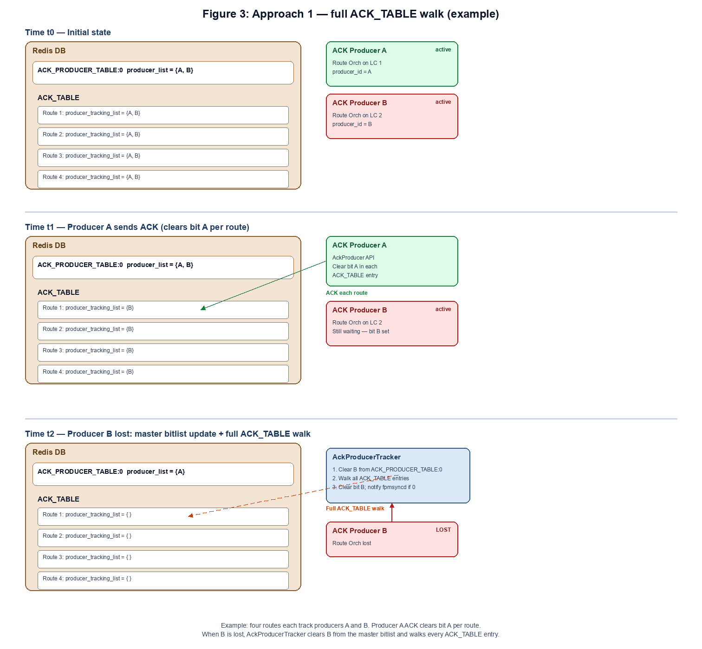
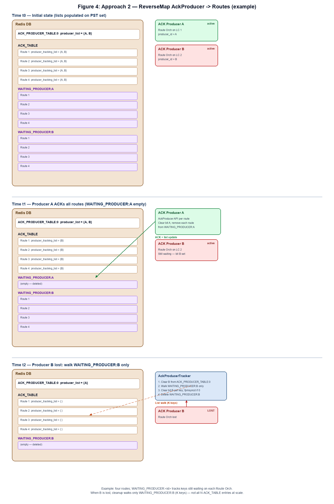
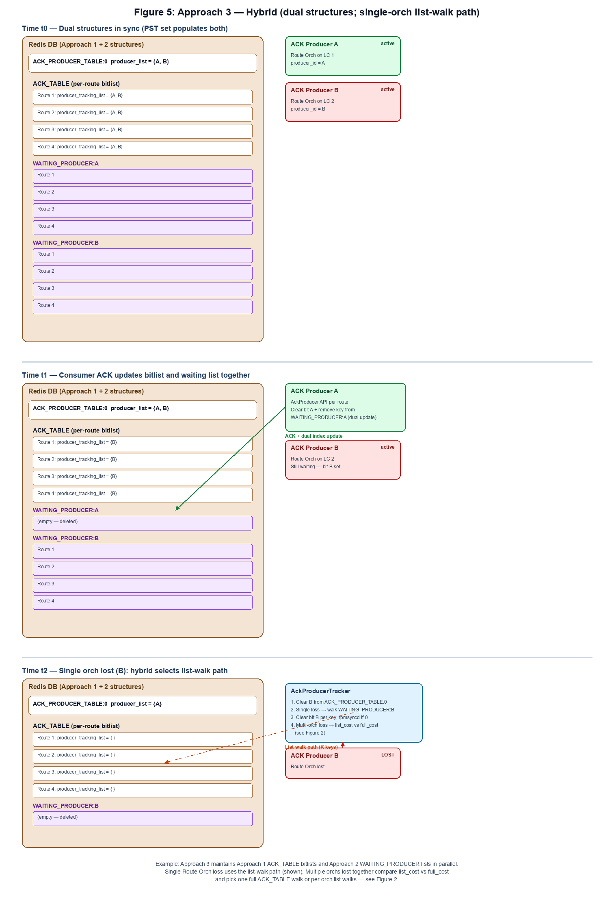
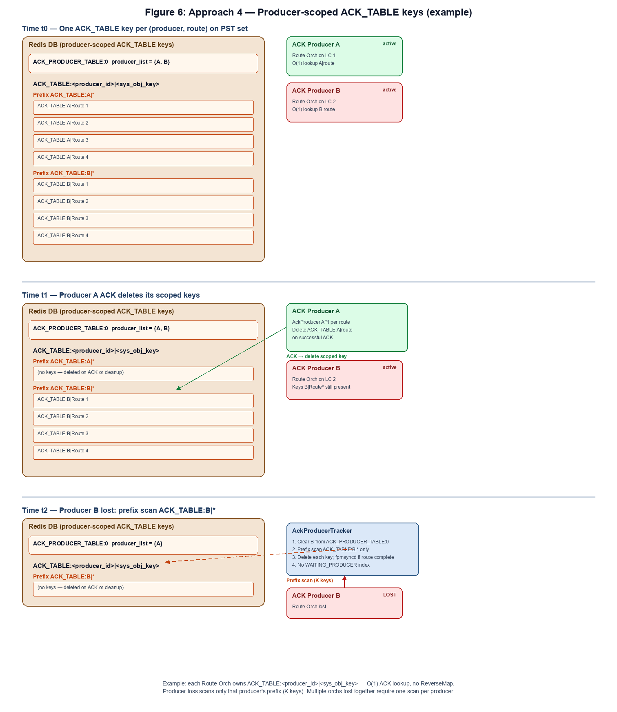

# SONiC Aggregate ACK Mechanism

**Authors**:
Amit Grover — Cisco  
Manas Kumar Mandal — Cisco  
Huan Le — Cisco

**Date:** 06/11/2026

## Table of Contents

- [1. Definitions/Abbreviations](#1-definitionsabbreviations)
- [2. Revision](#2-revision)
- [3. Problem statement](#3-problem-statement)
- [4. Scope](#4-scope)
- [5. Assumptions](#5-assumptions)
- [6. Architecture](#6-architecture)
  - [6.1 SONiC architecture placement](#61-sonic-architecture-placement)
  - [6.2 Non-centralized ACK flow](#62-non-centralized-ack-flow)
  - [6.3 High-level block diagram](#63-high-level-block-diagram)
- [7. Database Schema Changes](#7-database-schema-changes)
  - [7.1 ACK Redis objects summary](#71-ack-redis-objects-summary)
- [8. Operational ACK flows](#8-operational-ack-flows)
  - [8.1 ROUTE_TABLE timestamp](#81-route_table-timestamp)
  - [8.2 ACK producer loss handling](#82-ack-producer-loss-handling)
    - [8.2.1 Approach 1: Full ACK_TABLE walk](#821-approach-1-full-ack_table-walk)
    - [8.2.2 Approach 2: In addition to ACK table, also ReverseMap AckProducer -> Routes](#822-approach-2-in-addition-to-ack-table-also-reversemap-ackproducer---routes)
    - [8.2.3 Approach 3: Hybrid (per-route bitlist + per-orch index)](#823-approach-3-hybrid-per-route-bitlist--per-orch-index)
    - [8.2.4 Approach 4: Producer-scoped ACK_TABLE keys](#824-approach-4-producer-scoped-ack_table-keys)
  - [8.3 Race conditions during ACK_TABLE bit cleanup](#83-race-conditions-during-ack_table-bit-cleanup)
  - [8.4 System object delete trigger](#84-system-object-delete-trigger)
- [9. Acknowledge Management](#9-acknowledge-management)
  - [9.1 LC boot and producer registration](#91-lc-boot-and-producer-registration)
  - [9.2 Impacting service restart](#92-impacting-service-restart)
  - [9.3 LC removal and multi-producer depart](#93-lc-removal-and-multi-producer-depart)
- [10. Related documents](#10-related-documents)
- [11. Restrictions and limitations](#11-restrictions-and-limitations)
- [12. Test plan](#12-test-plan)
- [13. Future Enhancements](#13-future-enhancements)
  - [13.1 Route ACK aggregation at scale — problem statement](#131-route-ack-aggregation-at-scale--problem-statement)
  - [13.2 Comparison summary](#132-comparison-summary)
  - [13.3 Recommendation](#133-recommendation)
  - [13.4 Further approach exploration](#134-further-approach-exploration)

---

## 1. Definitions/Abbreviations

**Table 2: Definitions and abbreviations**

| Term | Definition |
|------|------------|
| Supervisor | Chassis control-plane module where centralized SONiC services run — for example **fpmsyncd**, **AckProducerTracker**, and protocol daemons |
| LC | **Line card** — forwarding module in a modular chassis; hosts **swss** / **Route Orch** and programs local NPUs |
| PST | **ProducerStateTable** — existing class defined in **sonic-swss-common** that allows producers to publish objects to Redis and notify consumers |
| System Object | A logical entity stored in **APPL_DB**, such as `ROUTE_TABLE`, `ACL_TABLE`, or `QOS_TABLE` |
| ACK Producer | Application or component that generates and sends acknowledgement for a system object (e.g., **Route Orch**); lifecycle depends on the system object lifecycle |
| ACK Status Object | Object created when an ACK producer reports failure status for a given system object; lifecycle depends on the system object lifecycle |
| ACK_TABLE | Per-system-object Redis object (`ACK_TABLE:<sys_obj_key>`) used to track which ACK producers are still expected to respond for that system object |
| Producer tracking list | `producer_tracking_list` field in **ACK_TABLE** — integer bitmask copied from **ACK_PRODUCER_TABLE:0** on PST set / del; bits cleared as consumers ACK or during producer-loss cleanup |
| producer_id | Unique identifier assigned to each ACK producer based on slot and ASIC number; allocation is done by the tracking service |

---

## 2. Revision

**Table 1: Document revision history**

| Rev | Date       | Author      | Change Description              |
|-----|------------|-------------|---------------------------------|
| 0.1 | 06/11/2026 | Amit Grover | Initial community HLD draft     |

---

## 3. Problem statement

### 3.1 Problem

In a **centralized chassis**, a control-plane **producer** (for example, on the **Supervisor**) publishes a system object to **APPL_DB** and needs a single, authoritative answer to one question: was that object **successfully installed in hardware**, or did programming fail?

The producer is **platform-agnostic**. It does not know the chassis topology — how many line cards, NPUs, or orch agents exist, or which consumers will program the object into ASIC resources.

In the centralized model, **multiple consumers** (orch agents on line cards) may each install the same system object into local hardware. With the existing per-consumer ACK behavior, the producer observes **multiple independent ACKs**, including **premature ACKs** from consumers that finish before others have completed programming.

That violates a core producer requirement: **one ACK per system object** that reflects **complete end-to-end hardware programming status**, not partial progress from an individual consumer.

**Example:** A route published from the **Supervisor** may require programming on multiple line-card NPUs. If the producer receives an ACK as soon as the first NPU completes, it may incorrectly treat the route as fully installed while other NPUs are still pending or have failed.

### 3.2 Solution

This HLD defines a **vendor-agnostic, platform-agnostic aggregate ACK mechanism** that:

1. **Aggregates multiple consumer ACKs into one ACK** — the producer receives a single final status (success or failure) only after all expected consumers have responded (or loss/cleanup rules complete the snapshot).
2. Provides a **generic, pluggable solution** for any **APPL_DB** system object (for example, `ROUTE_TABLE`, `ACL_TABLE`, `QOS_TABLE`) whose producer opts in to aggregated ACK tracking via PST — independent of chassis vendor, line-card count, or NPU topology.

The mechanism is implemented in **sonic-swss-common**, persists state in Redis using well-defined schemas, and is configurable per producer so objects that do not need aggregated ACK are unaffected. It does not depend on vendor-specific hardware or platform layout.

---

## 4. Scope

This HLD covers:

1. How **ACK status objects** are created when a producer calls **ProducerStateTable (PST)** (SET/DEL) with ACK enabled.
2. How ACK state is updated when a **consumer** (e.g., **Route Orch**) sends an ACK.
3. How **aggregated ACK** state is maintained across multiple ACK producers for a single system object.
4. **Redis key schemas**, lifecycle rules, and cleanup on producer loss or system-object deletion.

---

## 5. Assumptions

This design assumes the following:

1. **APPL_DB co-location** — The aggregate ACK mechanism is implemented on top of existing **APPL_DB** system-object tables (for example `ROUTE_TABLE`). All ACK-related Redis objects (**ACK_TABLE**, **ACK_PRODUCER_TABLE:0**, **ACK_STATUS_TABLE**, **WAITING_PRODUCER** when used, and related keys) reside in **APPL_DB** as well — not in a separate Redis database.
2. **Lua script atomicity** — Keeping system objects and ACK state in the same database allows PST and consumer-side Lua scripts to update a published object and its **ACK_TABLE** snapshot in a **single atomic Redis script**, preserving consistency between object publish and ACK tracking.
3. **Producer registry on the Supervisor** — **AckProducerTracker** on the **Supervisor** is the source of truth for which ACK producers are currently active in the chassis ([§9](#9-acknowledge-management)).

---

## 6. Architecture

### 6.1 SONiC architecture placement

The aggregate ACK mechanism is **not** a standalone **ACK APP** — it is not a dedicated process or Docker container.

It is a **plug-and-play** capability in **sonic-swss-common**, based on Lua scripts at both the producer and consumer side. On the producer side, **ProducerStateTable** Lua scripts have been enhanced to provide ACK functionality. On the consumer side, the **AckProducer** class has been added for ACK producers (e.g., **Route Orch**) to publish ACK updates.

This model provides **distributed ACK management** across the SONiC architecture ecosystem without adding a separate ACK daemon.

ACK state is read and written through the central **redis-server** (**APPL_DB**), the same database producers and consumers use to publish system objects across the chassis.

### 6.2 Non-centralized ACK flow

Before aggregate ACK ([§6.3](#63-high-level-block-diagram)), SONiC already supports per-route acknowledgement between **fpmsyncd** and **Route Orch** when PST is used with ACK enabled. On a **standalone switch**, this is a **single SONiC instance on one CPU**: **fpmsyncd** runs in one Docker container (for example **bgp**), **Route Orch** runs in another (for example **swss** / **orchagent**), and both connect to the same **redis-server** on that CPU — **APPL_DB** for route publish and **APPL_DB_ROUTE_TABLE_RESPONSE_CHANNEL** for programming-status notification. The end-to-end path has two phases — a **fire-and-forget** forward path from **fpmsyncd** through PST to hardware programming, and an asynchronous **status** return path when programming completes.

**Figure 2: Non-centralized ACK flow (single SONiC instance, same CPU)**

On a standalone switch with a **single** **Route Orch** (one ACK producer on that CPU), this model is sufficient: **fpmsyncd** receives **one** status ACK per route update after hardware programming finishes.

**Centralized chassis gap:** A chassis runs **multiple** **Route Orch** instances (typically one per line card / NPU). Each instance uses the same fire-and-forget and status pattern on its CPU, but **fpmsyncd** on the **Supervisor** may observe **multiple status ACKs** for the same route — including **premature** ACKs before every NPU has finished programming ([§3.1](#31-problem)). Aggregate ACK ([§6.3](#63-high-level-block-diagram), [§8](#8-operational-ack-flows)) extends this baseline so **fpmsyncd** still receives a single aggregated ACK per system object.

### 6.3 High-level block diagram

**AckProducerTracker** is a standalone service on the **Supervisor**. It assigns a unique **producer_id** to each slot and ASIC combination, tracks every ACK Producer in the chassis, and updates the master producer bitlist in **ACK_PRODUCER_TABLE:0** when ACK producers register or depart.

**Figure 1: Aggregate ACK — centralized chassis block diagram (Supervisor → Redis DB → line card)**

The block diagram shows where ACK-related components live and how they connect across the **Supervisor**, **Redis DB**, and line card (**LC**). Steps **1–4** on the diagram show the end-to-end ACK flow.

| Step | Figure 1 label | From → To | What happens |
|:-----|:---------------|:----------|:-------------|
| **1** | set/remove bitlist | **AckProducerTracker** → **ACK_PRODUCER_TABLE:0** | On Route Orch register or depart, update the chassis-wide master `producer_list` bitmask (one bit per active ACK producer). |
| **2** | set / del | **ProducerStateTable** → **ROUTE_TABLE** + **ACK_TABLE** | PST **set** / **del** publishes the system object (with **`timestamp`** on routes) and creates or refreshes the per-object **ACK_TABLE** entry; `producer_tracking_list` is copied from **ACK_PRODUCER_TABLE:0** (dotted path on the diagram). |
| **3** | AckProducer API | **Ack Producer (RouteOrch)** → **ACK_TABLE** | After hardware programming completes, **Ack Producer (RouteOrch)** calls the **AckProducer API** with the matching **`timestamp`**; the producer’s bit is cleared in **ACK_TABLE**. On failure only, an entry is written to **ACK_STATUS_TABLE**. |
| **4** | Ack to fpmsyncd | **ACK_TABLE** → **ACK consumer (fpmsyncd)** | When `producer_tracking_list` becomes **0** — all expected producers have ACKed — the aggregated ACK is sent to the waiting consumer on the **Supervisor** (for example **fpmsyncd** for routes, **vrfmgrd** for VRF objects). |

---

## 7. Database Schema Changes

All ACK tables live in the same Redis database namespace as the corresponding PST/system-object tables (typically **APPL_DB**).

### 7.1 ACK Redis objects summary

`<sys_obj_key>` is the PST system-object identifier: **APPL_DB** table name plus object key (`<table>:<key>`). For a route, for example `ROUTE_TABLE:10.0.0.0/24` or `ROUTE_TABLE:Vrf01:10.0.0.0/24`.

| Redis key pattern | Purpose | Fields |
|-------------------|---------|--------|
| `ROUTE_TABLE:<key>` e.g. `ROUTE_TABLE:10.0.0.0/24` | Existing route system object in **APPL_DB**; schema extended for aggregate ACK when PST runs set / del | Existing route fields, plus `timestamp` — set on PST set / del to correlate the published object with its **ACK_TABLE** snapshot lifecycle |
| `ACK_PRODUCER_TABLE:0` | Master producer bitlist maintained by **AckProducerTracker** on the **Supervisor** (Figure 1, step 1); copied into each per-object **ACK_TABLE** entry as `producer_tracking_list` when PST runs set / del | `producer_list` — integer (bitmask): active ACK producers (bit 0..63) |
| `ACK_TABLE:<sys_obj_key>` e.g. `ACK_TABLE:ROUTE_TABLE:<key>` | Per-system-object ACK tracking entry used to correlate consumer ACKs with a snapshot ([Approach 1](#821-approach-1-full-ack_table-walk), [Approach 2](#822-approach-2-in-addition-to-ack-table-also-reversemap-ackproducer---routes), [Approach 3](#823-approach-3-hybrid-per-route-bitlist--per-orch-index)) | `producer_tracking_list` — integer (bitmask): copy of active producers from `ACK_PRODUCER_TABLE:0` at PST set / del |
| `ACK_TABLE:<producer_id>\|<sys_obj_key>` e.g. `ACK_TABLE:3\|ROUTE_TABLE:<key>` | Producer-scoped ACK entry — one key per (Route Orch, system object) ([Approach 4](#824-approach-4-producer-scoped-ack_table-keys)); Route Orch uses direct lookup on ACK; prefix scan on producer loss | Presence of the key indicates this producer still owes an ACK for that object; deleted on successful consumer ACK or producer-loss cleanup |
| `WAITING_PRODUCER:<producer_id>` | In addition to **ACK_TABLE**, ReverseMap AckProducer → Routes ([Approach 2](#822-approach-2-in-addition-to-ack-table-also-reversemap-ackproducer---routes), [Approach 3](#823-approach-3-hybrid-per-route-bitlist--per-orch-index)) — keys still waiting on ACK from that producer | List of `sys_obj_key` values; updated on PST set / del and consumer ACK; walked on producer loss |
| `ACK_STATUS_TABLE:<sys_obj_key>:<producer_id>` e.g. `ACK_STATUS_TABLE:ROUTE_TABLE:<key>:<producer_id>` | Per-producer ACK status for a system object — created only on **failure** (Figure 1, step 3); not written on success | `status` — string: ACK status for this producer (e.g., `success` / `failure`) |

---

## 8. Operational ACK flows

### 8.1 ROUTE_TABLE timestamp

When PST runs set / del on a route, the **ROUTE_TABLE** entry in **APPL_DB** is extended with a **`timestamp`** field (see [§7.1](#71-ack-redis-objects-summary)).

**Why it is needed**

A route may receive multiple updates in quick succession. **Route Orch** on a line card programs the route asynchronously; an ACK from hardware programming for an **older** update could otherwise satisfy aggregation for a **newer** snapshot and produce a **false positive ACK** to **fpmsyncd**.

The **`timestamp`** acts as a **sequence number** for the current PST publish:

1. PST sets **`timestamp`** on **ROUTE_TABLE** when set / del runs (Figure 1, step 2).
2. The route update is delivered to **Route Orch** (orch agent) with that **`timestamp`**.
3. When programming completes, **Route Orch** passes the same **`timestamp`** to the **AckProducer API** (Figure 1, step 3).
4. ACK processing compares the supplied **`timestamp`** against the value stored with the **ROUTE_TABLE** snapshot for that route. An ACK is accepted only when it matches the **latest** update — stale ACKs from superseded programming attempts are ignored.

This ensures the aggregated ACK sent to **fpmsyncd** reflects the **last** route update, not an in-flight or completed operation from an earlier revision.

### 8.2 ACK producer loss handling

When a **Route Orch** (ACK producer) is lost, **AckProducerTracker** (or the ACK tracking service) always performs this first step:

1. Remove the departed producer bit(s) from **ACK_PRODUCER_TABLE:0** — one bit for a single Route Orch loss, or **multiple bits** when several ACK producers depart together (for example, **LC removal**).

How **ACK_TABLE** entries are updated after step 1 depends on how widely the lost producer's bit is still set across outstanding routes. Let **N** = the number of outstanding **ACK_TABLE** entries. Four approaches ([§8.2.1](#821-approach-1-full-ack_table-walk) through [§8.2.4](#824-approach-4-producer-scoped-ack_table-keys)) were evaluated against these scenarios:

1. **Best case (dense single loss):** All **N** **ACK_TABLE** entries still include the lost ACK producer's bit in `producer_tracking_list`. A full **ACK_TABLE** walk updates nearly every key; a per-orch waiting-list walk touches a similar set of routes.
2. **Worst case (no dependency):** None of the **N** entries include the lost producer's bit — the producer departed after already ACKing or before any in-flight route copied its bit. Cleanup must still complete, but a full **ACK_TABLE** walk visits every key with no per-route bit to clear.
3. **Worst case (sparse single loss):** Only a **small subset** of the **N** entries include the lost producer's bit. A full walk still scans all **N** keys; a per-orch waiting-list walk touches only the subset — the main scale advantage at millions of routes.
4. **Multiple ACK producers lost:** Several bits are cleared together (for example, **LC removal** removes every Route Orch on that card). Cleanup cost depends on how many routes still wait on **any** departed producer versus the cost of one full **ACK_TABLE** walk — the trade-off **Approach 3** selects at runtime.

Approach selection also keeps **performance** and **transient memory** in mind. Each option trades Redis read/write cost on producer loss and per-route ACK against extra in-flight structures (for example, per-orch waiting lists or producer-scoped **ACK_TABLE** keys). At millions of routes, cleanup latency and transient **APPL_DB** footprint are first-order constraints alongside correctness — see [§13](#13-future-enhancements) for scale comparison and recommendation.

**Note:** At large route scale, Approach 1 is the current flow in simulation. **Approach 3** is the leading candidate: per-orch list walk for a single departure; for multiple departures, pick full **ACK_TABLE** walk when the sum of affected waiting-list sizes is no cheaper than walking all **ACK_TABLE** keys.

#### 8.2.1 Approach 1: Full ACK_TABLE walk

Approach 1 uses a per-route **ACK_TABLE** entry (`ACK_TABLE:<sys_obj_key>`) with a `producer_tracking_list` bitmask, plus a chassis-wide master bitlist in **ACK_PRODUCER_TABLE:0**. **Figure 3** walks through a small example with four routes and two ACK producers (**A** and **B**).

**Figure 3: Approach 1 — full ACK_TABLE walk (four routes, producers A and B)**

| Time | What happens |
|:-----|:-------------|
| **t0 — Initial state** | **ACK_PRODUCER_TABLE:0** `producer_list` = `{A, B}`. Each of four **ACK_TABLE** entries has `producer_tracking_list` = `{A, B}` (both producers still expected). |
| **t1 — Producer A sends ACK** | **ACK Producer A** (Route Orch) calls the AckProducer API for each route it programs. Each successful ACK clears bit **A** in that route's `producer_tracking_list`. After all four routes ACK from A, each entry shows `{B}` only; **ACK Producer B** remains active and is still expected on every route. The master bitlist in **ACK_PRODUCER_TABLE:0** is unchanged. |
| **t2 — Producer B lost** | **AckProducerTracker** clears bit **B** from **ACK_PRODUCER_TABLE:0** (master list becomes `{A}`). The tracking service walks **every** **ACK_TABLE** entry and clears bit **B** from each `producer_tracking_list`. For each route where the bitlist becomes `{ }`, an ACK is sent to **fpmsyncd**. |

**Table 5: Approach 1 — producer-loss scenario fit**

| Scenario | Description | Approach 1 |
|:---------|:------------|:-----------|
| **Best case (dense single loss)** | All **N** **ACK_TABLE** entries still include the lost ACK producer's bit in `producer_tracking_list`. A full **ACK_TABLE** walk updates nearly every key. | ✅ **Good** |
| **Worst case (no dependency)** | None of the **N** entries include the lost producer's bit — the producer departed after already ACKing or before any in-flight route copied its bit. Cleanup must still complete, but a full walk visits every key with no per-route bit to clear. | ❌ **Bad** |
| **Worst case (sparse single loss)** | Only a **small subset** of the **N** entries include the lost producer's bit. A full walk still scans all **N** keys. | ❌ **Bad** |
| **Multiple ACK producers lost** | Several bits are cleared together (for example, **LC removal** removes every Route Orch on that card). One full **ACK_TABLE** walk can clear all departed bits in a single pass when many routes still wait on those producers. | ✅ **Good** |
| **Transient memory** | In-flight **ACK_TABLE** state only — one entry per route (plus **ACK_PRODUCER_TABLE:0**); no **WAITING_PRODUCER** lists or producer-scoped **ACK_TABLE** keys. | **Low** (lowest among the four approaches) |

#### 8.2.2 Approach 2: In addition to ACK table, also ReverseMap AckProducer -> Routes

Approach 2 keeps the same per-route **ACK_TABLE** entries and **ACK_PRODUCER_TABLE:0** master bitlist as Approach 1. In addition to **ACK_TABLE**, it adds a reverse map from AckProducer to routes: **`WAITING_PRODUCER:<producer_id>`** — a Redis list of system-object keys (`sys_obj_key`) still waiting on ACK from that Route Orch.

**List maintenance**

1. **PST set / del** (ACK path) — add the route key to **WAITING_PRODUCER:<producer_id>** for each producer in the active master bitlist.
2. **Consumer ACK** — remove the route key from that producer's waiting list; delete the list when empty.
3. **Producer loss** — walk **only** **WAITING_PRODUCER:<lost_producer_id>**; for each key, clear the lost bit in the matching **ACK_TABLE** entry, notify **fpmsyncd** if the bitlist becomes zero, then delete the waiting list.

**Figure 4** walks through the same four-route, two-producer example as Figure 3, showing list updates at each phase.

**Figure 4: Approach 2 — In addition to ACK table, also ReverseMap AckProducer -> Routes (four routes, producers A and B)**

| Time | What happens |
|:-----|:-------------|
| **t0 — Initial state** | **ACK_PRODUCER_TABLE:0** `producer_list` = `{A, B}`. Each of four **ACK_TABLE** entries has `producer_tracking_list` = `{A, B}`. **WAITING_PRODUCER:A** and **WAITING_PRODUCER:B** each list all four route keys (populated on PST set). |
| **t1 — Producer A sends ACK** | **ACK Producer A** calls the AckProducer API for each route it programs. Each ACK clears bit **A** in that route's **ACK_TABLE** entry and removes that route key from **WAITING_PRODUCER:A** (one route per ACK; list deleted when empty). After all four routes ACK from A, each entry shows `{B}` only and **WAITING_PRODUCER:A** is empty; **WAITING_PRODUCER:B** still lists all four routes. |
| **t2 — Producer B lost** | **AckProducerTracker** clears bit **B** from **ACK_PRODUCER_TABLE:0**. Cleanup walks **WAITING_PRODUCER:B** only (**K** = 4 keys in this example, not all **N** **ACK_TABLE** entries at scale). For each listed key, clear bit **B**; send ACK to **fpmsyncd** where the bitlist becomes `{ }`; delete **WAITING_PRODUCER:B**. |

**Table 6: Approach 2 — producer-loss scenario fit**

| Scenario | Description | Approach 2 |
|:---------|:------------|:-----------|
| **Best case (dense single loss)** | All **N** **ACK_TABLE** entries still include the lost producer's bit. **WAITING_PRODUCER** list size ≈ **N** — similar work to a full walk, plus ongoing list maintenance. | ❌ **Bad** |
| **Worst case (no dependency)** | None of the **N** entries include the lost producer's bit. Waiting list is empty; no **ACK_TABLE** keys need updating. | ✅ **Good** |
| **Worst case (sparse single loss)** | Only a **small subset** of **N** entries include the lost producer's bit. List walk touches **K** ≪ **N** keys only. | ✅ **Good** |
| **Multiple ACK producers lost** | Several producers depart together (for example, **LC removal**). Each departed orch may require a separate list walk — cost can exceed one Approach 1 full walk. | ❌ **Bad** |
| **Transient memory** | Same per-route **ACK_TABLE** as Approach 1, plus transient **WAITING_PRODUCER** lists (one list entry per in-flight route still waiting on each active producer). | **Higher than Approach 1** |

#### 8.2.3 Approach 3: Hybrid (per-route bitlist + per-orch index)

Approach 3 combines Approach 1 and Approach 2: each route keeps a `producer_tracking_list` in **ACK_TABLE**, and each Route Orch has a **`WAITING_PRODUCER:<producer_id>`** list of routes still waiting on that producer. Both structures are updated together on PST set / del and on each consumer ACK.

**Cleanup selection**

1. **Single Route Orch lost** — walk only that producer's **WAITING_PRODUCER** list (Approach 2 path); for each key, clear the lost bit in the matching **ACK_TABLE** entry and notify **fpmsyncd** when the bitlist becomes zero.
2. **Multiple Route Orchs lost in the same cleanup window** — let `list_cost` = sum of waiting-list sizes for each departed orch, and `full_cost` = number of **ACK_TABLE** entries. If `list_cost ≥ full_cost`, run one full **ACK_TABLE** walk (Approach 1); otherwise walk each departed orch's list (Approach 2).

**Figure 5** walks through the same four-route, two-producer example as Figures 3 and 4, showing dual-structure maintenance and the **single-orch** list-walk path at **t2**.

**Figure 5: Approach 3 — Hybrid (per-route bitlist + per-orch index) (four routes, producers A and B)**

| Time | What happens |
|:-----|:-------------|
| **t0 — Initial state** | **ACK_PRODUCER_TABLE:0** `producer_list` = `{A, B}`. Each of four **ACK_TABLE** entries has `producer_tracking_list` = `{A, B}`. **WAITING_PRODUCER:A** and **WAITING_PRODUCER:B** each list all four route keys (both indexes populated on PST set). |
| **t1 — Producer A sends ACK** | **ACK Producer A** calls the AckProducer API for each route. Each ACK clears bit **A** in that route's **ACK_TABLE** entry **and** removes that route key from **WAITING_PRODUCER:A** (dual update). After all four routes ACK from A, each entry shows `{B}` only, **WAITING_PRODUCER:A** is empty, and **WAITING_PRODUCER:B** still lists all four routes. |
| **t2 — Single orch lost (Producer B)** | **AckProducerTracker** clears bit **B** from **ACK_PRODUCER_TABLE:0**. Hybrid selects the **list-walk path**: walk **WAITING_PRODUCER:B** only (**K** = 4 keys in this example). For each listed key, clear bit **B**; send ACK to **fpmsyncd** where the bitlist becomes `{ }`; delete **WAITING_PRODUCER:B**. |
| **t3 — Multiple orchs lost (not shown in Figure 5)** | When several Route Orchs depart together (for example, **LC removal**), compare `list_cost` (sum of each departed orch's waiting-list size) with `full_cost` (**ACK_TABLE** entry count). Use one full **ACK_TABLE** walk when `list_cost ≥ full_cost`; otherwise walk each departed orch's list. |

**Table 7: Approach 3 — producer-loss scenario fit**

Approach 3 compares **`list_cost`** (sum of relevant **WAITING_PRODUCER** list sizes) with **`full_cost`** (**ACK_TABLE** entry count) at cleanup time and picks the cheaper path — list walks when sparse, one full **ACK_TABLE** walk when the lists are no cheaper.

| Scenario | Description | Approach 3 |
|:---------|:------------|:-----------|
| **Best case (dense single loss)** | All **N** **ACK_TABLE** entries still include the lost producer's bit; **WAITING_PRODUCER** list size ≈ **N**. Hybrid sees `list_cost ≥ full_cost` and selects **one full ACK_TABLE walk** (Approach 1 path) instead of a redundant list walk. | ✅ **Good** |
| **Worst case (no dependency)** | None of the **N** entries include the lost producer's bit. Waiting list is empty (`list_cost` = 0); no **ACK_TABLE** keys need updating. | ✅ **Good** |
| **Worst case (sparse single loss)** | Only a **small subset** of **N** entries include the lost producer's bit. Hybrid sees `list_cost` ≪ `full_cost` and walks **WAITING_PRODUCER** only (**K** keys). | ✅ **Good** |
| **Multiple ACK producers lost** | Several producers depart together (for example, **LC removal**). Hybrid compares combined waiting-list sizes with **ACK_TABLE** count and runs **one** full walk when `list_cost ≥ full_cost`; otherwise walks each departed orch's list. | ✅ **Good** |
| **Transient memory** | Same in-flight **ACK_TABLE** and **WAITING_PRODUCER** structures as Approach 2; cost-based cleanup adds no extra transient Redis state. | **Same as Approach 2** (higher than Approach 1) |

#### 8.2.4 Approach 4: Producer-scoped ACK_TABLE keys

Approach 4 replaces the single per-route **ACK_TABLE** entry with **producer-scoped keys**: **`ACK_TABLE:<producer_id>|<sys_obj_key>`**. Each Route Orch performs an O(1) lookup on its own key when sending an ACK. There is no **`WAITING_PRODUCER`** ReverseMap — producer loss cleanup uses a **prefix scan** of `ACK_TABLE:<lost_producer_id>:*` only.

**Key maintenance**

1. **PST set / del** (ACK path) — create one **ACK_TABLE** key per active producer in **ACK_PRODUCER_TABLE:0** for that system object.
2. **Consumer ACK** — delete `ACK_TABLE:<producer_id>|<sys_obj_key>` on success; evaluate whether all producers for that route have ACKed and notify **fpmsyncd** when complete.
3. **Producer loss** — clear the departed bit(s) from **ACK_PRODUCER_TABLE:0**; prefix-scan `ACK_TABLE:<lost_producer_id>:*`; delete each key and notify **fpmsyncd** for routes that no longer wait on any active producer.

**Figure 6** walks through the same four-route, two-producer example, showing scoped-key creation, per-producer ACK deletion, and prefix-scan cleanup.

**Figure 6: Approach 4 — Producer-scoped ACK_TABLE keys (four routes, producers A and B)**

| Time | What happens |
|:-----|:-------------|
| **t0 — Initial state** | **ACK_PRODUCER_TABLE:0** `producer_list` = `{A, B}`. Eight **ACK_TABLE** keys exist for four routes: `ACK_TABLE:A\|Route*` and `ACK_TABLE:B\|Route*` for each route (one key per producer × route pair). |
| **t1 — Producer A sends ACK** | **ACK Producer A** calls the AckProducer API for each route. Each successful ACK **deletes** `ACK_TABLE:A\|<route_key>`. After all four routes ACK from A, no `ACK_TABLE:A\|*` keys remain; `ACK_TABLE:B\|Route*` keys still exist for all four routes. |
| **t2 — Producer B lost** | **AckProducerTracker** clears bit **B** from **ACK_PRODUCER_TABLE:0**. Cleanup **prefix-scans** `ACK_TABLE:B\|*` only (**K** = 4 keys in this example, not all **N** routes × all producers at scale). Delete each scoped key; send ACK to **fpmsyncd** for routes that no longer wait on any active producer. |

**Table 8: Approach 4 — producer-loss scenario fit**

| Scenario | Description | Approach 4 |
|:---------|:------------|:-----------|
| **Best case (dense single loss)** | All **N** routes still have a scoped key for the lost producer. Prefix scan touches ≈ **N** keys — similar to a full walk. | ❌ **Bad** |
| **Worst case (no dependency)** | No scoped keys remain for the lost producer (already ACKed or never created). Prefix scan finds nothing; no route updates needed. | ✅ **Good** |
| **Worst case (sparse single loss)** | Only **K** ≪ **N** routes still have `ACK_TABLE:<lost_producer>\|*` keys. Prefix scan touches **K** keys only. | ✅ **Good** |
| **Multiple ACK producers lost** | Several producers depart together (for example, **LC removal**). Cleanup runs one prefix scan per lost producer — cost can exceed one Approach 1 full walk. | ❌ **Bad** |
| **Transient memory** | One scoped **ACK_TABLE** key per (producer, in-flight route); no **WAITING_PRODUCER** lists. May scale with active producers × in-flight routes — footprint vs Approaches 1–3 TBD in simulation. | **To be evaluated** |

### 8.3 Race conditions during ACK_TABLE bit cleanup

When **AckProducerTracker** walks **ACK_TABLE** to clear a departed Route Orch's bit from each `producer_tracking_list`, other ACK activity can proceed in parallel. Two cases show why this does not corrupt aggregation state:

1. **Existing route update during the walk** — While delete handling and the **ACK_TABLE** walk are in progress, **ProducerStateTable** may run **set** on an existing route. That is acceptable. Step 1 already removed the lost producer's bit from **ACK_PRODUCER_TABLE:0**, so any PST update copies a master bitlist that no longer includes the departed Route Orch. The per-route entry is refreshed without the lost bit even if the walk has not yet visited that key; if the walk reaches the entry later, clearing an already-absent bit is idempotent.

2. **No new producer bits during delete handling** — A replacement or newly online Route Orch cannot be added to **ACK_PRODUCER_TABLE:0** while the tracking service is still handling the delete operation (including the **ACK_TABLE** walk). **AckProducerTracker** serializes producer registration against in-flight loss cleanup, so the walk does not race with a newly set bit for the same slot/ASIC.

### 8.4 System object delete trigger

When a system object is removed from **APPL_DB**, aggregate ACK for the **delete** follows the **same path as an add (SET) operation**. **ProducerStateTable** runs **del** on DEL (Figure 1): PST publishes the delete, creates or refreshes the per-object **ACK_TABLE** snapshot with the current **ACK_PRODUCER_TABLE:0** bitlist, and each Route Orch that must program the removal sends an ACK through the **AckProducer API**. **fpmsyncd** is notified only after all expected producers have ACKed — the system object may already be gone from **APPL_DB**, but ACK aggregation still applies to the delete operation.

**Why delete needs ACK**

Some features require coordinated delete programming across line cards before the control plane can treat the operation as complete. **VRF management** is one example: removing a VRF or related system object must be acknowledged by every relevant Route Orch before **vrfmgrd** receives the aggregated ACK, even though the object itself has been deleted from Redis.

**Cleanup**

When delete ACK processing completes (or on teardown), all ACK-related Redis objects for that system object are removed — for example, matching entries in **ACK_TABLE**, **WAITING_PRODUCER** lists (Approaches 2–3), producer-scoped keys (Approach 4), and **ACK_STATUS_TABLE**.

**Policy (current and future)**

| | Detail |
|---|--------|
| **Current behavior** | Aggregate ACK is **enabled by default for both add and delete** on system objects that use PST with ACK. |
| **Future enhancement** | A **policy table** may control, per system-object type, whether aggregate ACK applies to **add only**, **delete only**, or **both**. |

---

## 9. Acknowledge Management

Aggregate ACK depends on knowing **which ACK producers must respond** for each system object at publish time. The mechanism maintains the expected-acker list in two layers:

1. **Chassis-wide master list** — **ACK_PRODUCER_TABLE:0** `producer_list` (bitmask of active ACK producers), updated by **AckProducerTracker** when producers register or depart.
2. **Per-object snapshot** — `producer_tracking_list` in each **ACK_TABLE** entry, copied from the master list when PST runs **set** / **del** on that object. In-flight objects retain the snapshot taken at publish time until aggregation completes or producer-loss cleanup runs.

The following operational situations affect how the expected-acker snapshot is established and updated.

### 9.1 LC boot and producer registration

When a line card finishes boot and the **swss** container starts, **orchagent** / **Route Orch** calls the **Tracking Service API** on the **Supervisor** to obtain its unique **producer_id** (slot and ASIC). **AckProducerTracker** on the **Supervisor** updates **ACK_PRODUCER_TABLE:0** — **setting the corresponding bit** in the chassis-wide master `producer_list`. System objects published **after** registration copy the updated master bitlist into their **ACK_TABLE** snapshot. Routes already in flight before the new producer registered are not retroactively updated unless PST runs a new **set** on those keys.

### 9.2 Impacting service restart

When **swss** / **orchagent** or another ACK-producing service restarts on a line card, the ACK producer **departs** and later **re-registers** with **AckProducerTracker**:

- **On depart** — the producer bit is cleared from **ACK_PRODUCER_TABLE:0** and producer-loss cleanup runs for outstanding **ACK_TABLE** entries still waiting on that bit ([§8.2](#82-ack-producer-loss-handling)).
- **On re-register** — the bit is set again; subsequent PST publishes include the restored producer in new snapshots.

**AckProducerTracker** serializes registration against in-flight loss cleanup so a replacing instance does not race with an outstanding **ACK_TABLE** walk ([§8.3](#83-race-conditions-during-ack_table-bit-cleanup)).

### 9.3 LC removal and multi-producer depart

When a line card is removed or multiple ACK producers go offline together, **AckProducerTracker** clears **one or more bits** from **ACK_PRODUCER_TABLE:0** in a single event. Cleanup then updates every affected per-object snapshot — via a full **ACK_TABLE** walk, per-producer waiting list, or hybrid path ([§8.2](#82-ack-producer-loss-handling)). If the departed producer was the last outstanding dependency for a route, **fpmsyncd** receives the aggregated ACK immediately.

---

## 10. Related documents

| Document | Link |
|----------|------|
| Central Chassis Architecture | [voq_chassis_hld.md](https://github.com/huanlev/SONiC/blob/f4c462700e6b89532f39e7e199b95745320366bc/doc/centralized-chassis/voq_chassis_hld.md) |
| Centralized chassis routing HLD | [centralized_chassis_routing_hld.md](./centralized_chassis_routing_hld.md) |
| Internal ACK design (Confluence) | [Aggregate ACK Design](https://ciscoteams.atlassian.net/wiki/spaces/WHITEBOX/pages/883294834/Aggregate+ACK+Design) |
| SONiC HLD template | [hld_template.md](../guidelines/hld_template.md) |

---

## 11. Restrictions and limitations

| Item | Detail |
|------|--------|
| Producer ID space | Bitmask supports producers **0..63** |
| Memory at scale | 2-day TTL and skip-on-success optimizations are required for large route scale |

---

## 12. Test plan

**Unit tests**

| Area | Cases |
|------|-------|
| PST SET | Snapshot creation, old snapshot cleanup, timestamp propagation, publish on new key |
| PST DEL | ACK entry cleanup, snapshot deletion |
| Producer loss | Approach 1: full ACK_TABLE walk; Approach 2: per-orch list walk only; Approach 3 hybrid: list walk for single orch loss, cost-based choice (full walk vs per-orch lists) for multi-orch loss; Approach 4: producer-scoped `ACK_TABLE:<producer_id>|<sys_obj_key>` prefix scan on loss; zero-bitlist fpmsyncd notification |
| System object delete | Full ACK state teardown |

**System tests**

| Area | Cases |
|------|-------|
| Route programming | End-to-end route install with multi-producer ACK; verify fpmsyncd notification |
| Producer restart | ACK producer disconnect/reconnect; verify bitlist and in-flight ACK behavior |
| Scale | ACK status object count and memory with TTL at target route scale (TBD) |
| Negative | Late ACK after snapshot deleted, duplicate ACK from same producer |

---

## 13. Future Enhancements

This section captures follow-on context for route ACK aggregation at scale. Producer-loss flows and approach walkthroughs are in [§8.2](#82-ack-producer-loss-handling).

**Emphasis:** The four approaches documented in §8.2 are a starting set, not an exhaustive list. Further work should **prioritize exploring additional designs** — especially for **transient memory** optimization at millions of routes — and any other viable approach for producer-loss cleanup, ACK lookup, or operational cost while **fpmsyncd** remains unchanged.

### 13.1 Route ACK aggregation at scale — problem statement

Millions of routes may be stored in Redis **APPL_DB**. Each route must be acknowledged by multiple **Route Orch** instances on different line cards before a single ACK can be sent to **fpmsyncd**.

**Characteristics**

- Up to **64** Route Orch instances (`producer_id` **0..63**).
- Every route may require ACKs from a subset of currently active Route Orch instances.
- Route Orch membership can change dynamically at runtime.
- **fpmsyncd** cannot be modified; it never queries route status and expects an asynchronous ACK.
- If a Route Orch disappears, the system must stop waiting for that instance.
- If the departed Route Orch was the last outstanding dependency for a route, an ACK must be sent to **fpmsyncd** immediately.

The main challenge is handling Route Orch membership changes efficiently **without scanning or updating millions of route entries**.

### 13.2 Comparison summary

**Table 3: Producer loss handling approaches — comparison**

| Approach | Transient memory | Route Orch removal cost | ACK processing cost | Immediate ACK after Route Orch removal | Scales to millions of routes |
|:-------|:-----------------|:------------------------|:--------------------|:---------------------------------------|:-----------------------------|
| 1. Full ACK_TABLE walk | **Low** | O(all routes) | O(1) | Yes | Poor when producer bits are sparse |
| 2. ReverseMap AckProducer -> Routes | **Higher than Approach 1** | O(routes on lost orch list) | O(1) + list maintenance | Yes | Good when sparse; poor for multi-orch loss |
| 3. Hybrid (bitlist + per-orch index) | **Same as Approach 2** | min(list sum, all routes) — cost-based | O(1) + dual index maintenance | Yes | Excellent when loss pattern is mixed |
| 4. Producer-scoped ACK_TABLE keys | **To be evaluated** | O(routes per lost producer) × orchs lost | O(1) per producer-object key | Yes | Good for single-orch loss; poor vs Approach 1 when many orchs lost together |

### 13.3 Recommendation

Given the requirements:

- Millions of routes
- **fpmsyncd** cannot be modified and never queries status
- Route Orch membership changes dynamically
- ACKs must be generated immediately when a departed Route Orch was the final outstanding dependency

The strongest candidate is **Approach 3 (hybrid)**:

- Per route: `producer_tracking_list` in **ACK_TABLE** (Approach 1)
- Per Route Orch: system-object key list such as `WAITING_PRODUCER:<producer_id>` (Approach 2)

**Single Route Orch loss:** walk that producer's list only (Approach 2).

**Multiple Route Orchs lost together:** compare `list_cost` (sum of each departed orch's waiting-list size) with `full_cost` (**ACK_TABLE** entry count). Use Approach 1 when `list_cost ≥ full_cost`; otherwise walk each departed orch's list (Approach 2).

Trade-off: dual structures, list-size tracking, and maintenance on every route create and ACK. See [§8.2.3](#823-approach-3-hybrid-per-route-bitlist--per-orch-index) and **Table 3** above. Approach 3 is the leading candidate today; [§13.4](#134-further-approach-exploration) describes why additional options remain in scope.

### 13.4 Further approach exploration

The approaches in [§8.2](#82-ack-producer-loss-handling) and **Table 3** should be treated as **under evaluation**, not as a closed design space. Simulation and scale testing may favor Approach 3 for mixed producer-loss patterns, but **transient memory** and cleanup cost still leave room for better trade-offs — for example, lower footprint than Approaches 2–3 without reverting to a full **ACK_TABLE** walk on every sparse loss, or a confirmed design after Approach 4’s footprint is measured.

**Areas to explore**

1. **Transient memory optimization** — New or hybrid Redis structures, tighter lifecycle (TTL, eager delete on ACK), or encoding schemes that reduce in-flight state per route and per producer without breaking immediate **fpmsyncd** notification on producer loss.
2. **Alternative producer-loss paths** — Designs not listed in §8.2 that improve worst-case cleanup (sparse loss, multi-orch **LC removal**) with acceptable ACK-path overhead.
3. **Operational and scale validation** — Measure Approach 4 and any new candidate at target route counts; compare against Tables 5–8 and **Table 3** before locking a production direction.

New approaches should be documented with the same evaluation dimensions used in §8.2: producer-loss scenario fit, transient memory vs the other options, and compatibility with existing **fpmsyncd** and PST flows.
