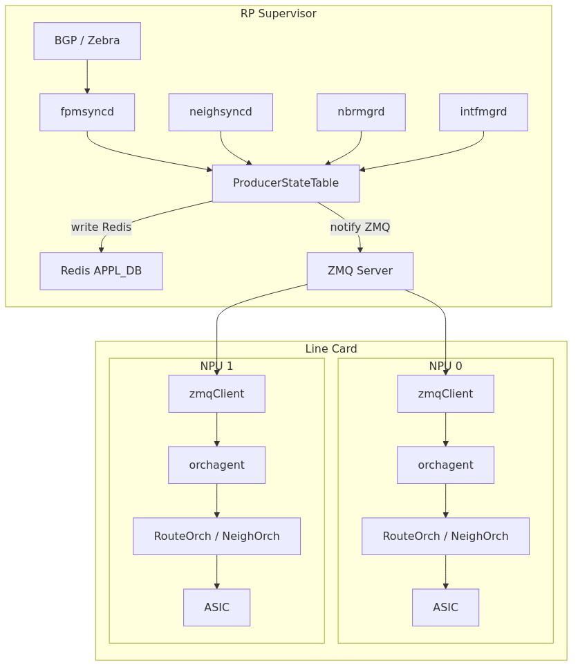
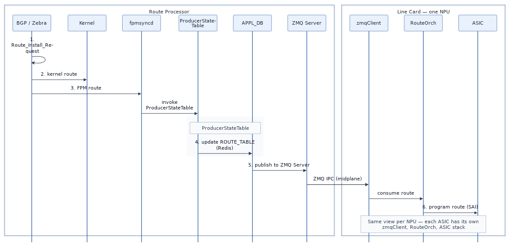
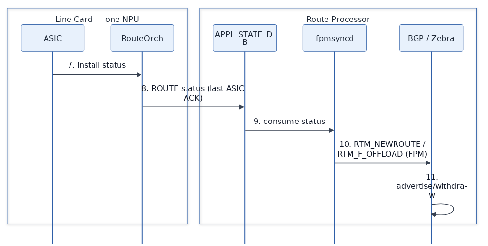
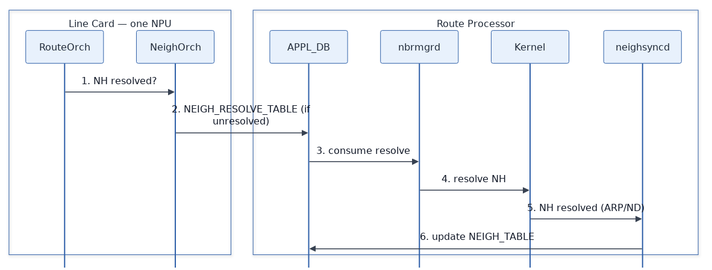
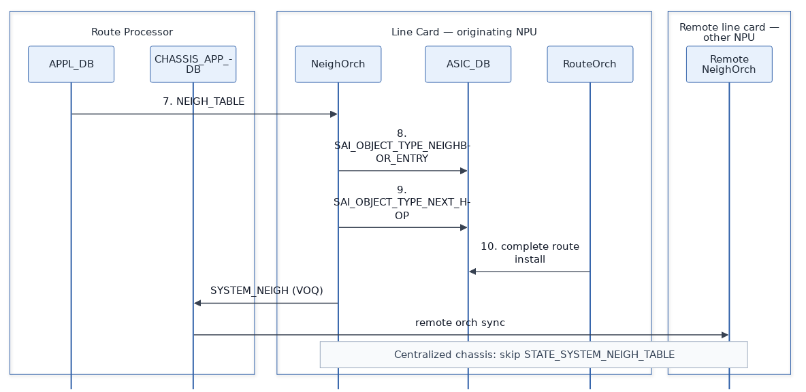

# SONiC Centralized Chassis Routing

**Authors**:
Amit Grover - Cisco

**Date:** 06/04/2026

## Table of Contents

- [1. Revision](#1-revision)
- [2. Scope](#2-scope)
- [3. Definitions/Abbreviations](#3-definitionsabbreviations)
- [4. Overview](#4-overview)
- [5. Architecture](#5-architecture)
  - [5.1 Overall architecture](#51-overall-architecture)
  - [5.2 Implementation changes](#52-implementation-changes)
- [6. Data stores](#6-data-stores)
  - [6.1 Primary Redis databases](#61-primary-redis-databases)
- [7. Route installation](#7-route-installation)
- [8. Neighbor resolution](#8-neighbor-resolution)
- [9. VOQ and system-neighbor considerations](#9-voq-and-system-neighbor-considerations)
- [10. Optimization](#10-optimization)
- [11. Trigger handling](#11-trigger-handling)
  - [LC consumer bootstrap](#lc-consumer-bootstrap)
- [12. Related documents](#12-related-documents)
- [13. Operational notes](#13-operational-notes)
- [14. Test plan](#14-test-plan)

---

## 1. Revision

**Table 1: Document revision history**

| Rev | Date       | Author       | Change Description |
|-----|------------|--------------|--------------------|
| 0.1 | 06/04/2026 | Amit Grover  | Initial centralized chassis routing HLD |

---

## 2. Scope

This document describes **L3 routing control-plane and forwarding programming** on a **SONiC centralized chassis**.

This HLD covers:

1. **Physical/logical split** — which processes run on the **Route Processor (RP)** vs each **line card (LC) NPU namespace**.
2. **Route installation** — end-to-end flow from BGP through hardware programming and status feedback.
3. **Neighbor resolution** — how unresolved next hops on an LC trigger RP-side resolution and VOQ system-neighbor handling.

**In scope**

| Area | Items |
|------|-------|
| RP processes | BGP/Zebra, **fpmsyncd**, **neighsyncd**, **nbrmgrd**, **intfmgrd** |
| LC processes | **orchagent** (**RouteOrch**, **NeighOrch**, **IntfOrch**), **syncd** |
| Central databases | **CONFIG_DB**, **APPL_DB**, **APPL_STATE_DB**, **STATE_DB**, **CHASSIS_APP_DB** |
| Related HLDs | Centralized chassis baseline — [voq_chassis_hld.md](https://github.com/huanlev/SONiC/blob/f4c462700e6b89532f39e7e199b95745320366bc/doc/centralized-chassis/voq_chassis_hld.md); VOQ architecture — [architecture.md](../voq/architecture.md); VOQ data plane — [voq_hld.md](../voq/voq_hld.md); VRF — [sonic-vrf-hld.md](../vrf/sonic-vrf-hld.md) |

**Out of scope**

| Topic | Separate HLD | Notes |
|-------|--------------|-------|
| IPC infrastructure changes & performance analysis | **In progress** | Transport semantics and performance — referenced here at high level only |
| Aggregated ACK / **Distributed ACK** (`ROUTE_TABLE`) | **In progress** | High-level route status feedback only in this HLD |

---

## 3. Definitions/Abbreviations

**Table 2: Definitions and abbreviations**

| Term | Definition |
|------|------------|
| Centralized chassis | VOQ-family chassis with control plane on the **Route Processor (RP)** and distributed forwarding on **line cards (LCs)** |
| RP | Route Processor / supervisor — hosts BGP, Zebra, kernel RIB, sync daemons, and central Redis databases |
| LC | Line card — hosts **orchagent** and per-NPU **RouteOrch**, **NeighOrch**, **IntfOrch**, **syncd**, and local **ASIC_DB** |
| NPU | Network Processing Unit namespace on an LC (multi-ASIC line card) |
| FRR | FRRouting (BGP, Zebra, static, etc.) |
| FPM | Forwarding Plane Manager — Zebra ↔ SONiC route sync |
| RIB | Routing Information Base (Linux kernel / Zebra) |
| NH | Next hop |
| VOQ | Virtual Output Queue — chassis fabric / multi-device forwarding model |
| APPL_DB | Application database (Redis) — producer/consumer tables between control plane and orchagent |
| APPL_STATE_DB | Application state database — route/neighbor programming status |
| CHASSIS_APP_DB | Chassis-scoped application DB (e.g. system-neighbor for VOQ) |
| ASIC_DB | ASIC state database consumed by **syncd** |
| SAI | Switch Abstraction Interface |

---

## 4. Overview

A **centralized chassis** is a **VOQ** chassis operated in centralized mode:

- **Single logical control plane** on the **RP**: BGP and Zebra run in the **default namespace**; the **RP kernel** holds protocol routes and next-hop information.
- **Distributed data plane** on **LCs**: each line card runs **orchagent** (per NPU namespace) to program local ASIC resources.
- **Central databases** on the RP (**CONFIG_DB**, **APPL_DB**, **APPL_STATE_DB**, **STATE_DB**, **CHASSIS_APP_DB**) anchor LC orch-agent state. **APPL_DB** persists in central **Redis** and notifies LCs over **ZMQ**: on **orchagent** restart, **Redis** is the source of truth for the initial sync; after bootstrap, live **ZMQ** messages are the source of truth for ongoing updates (see [§11 LC consumer bootstrap](#lc-consumer-bootstrap)).

Centralized chassis is distinct from **disaggregated** chassis designs where each LC runs its own BGP instance.

---

## 5. Architecture

### 5.1 Overall architecture

The following diagram summarizes RP vs LC responsibilities, central databases, and per-NPU orchestration agents.

**Figure 1: Centralized chassis routing — high-level architecture**

**ProducerStateTable** writes each update to central **Redis** (**APPL_DB**) and notifies the **ZMQ Server**.

All corresponding **host interfaces** for chassis **front-panel ports** are present on the **RP kernel** (default namespace). **intfmgrd**, **neighsyncd**, and **nbrmgrd** on the RP therefore operate against the authoritative kernel interface and neighbor state for those ports — not against per-LC kernel stacks.

### 5.2 Implementation changes

Centralized chassis routing reuses most of the existing SONiC routing stack. Only the **APPL_DB** distribution path on the RP and the **orchagent** table-dispatch layer on each LC are extended for midplane IPC.

**Table 13: Implementation changes for centralized chassis routing**

| # | Component / area | Changed? | Description |
|---|------------------|----------|-------------|
| 1 | FRR stack (BGP, Zebra) | No | Same as before. BGP and Zebra on the RP maintain the RIB, install routes into the kernel, and export them via FPM — unchanged from non-centralized SONiC. |
| 2 | fpmsyncd | No | Same as before. Continues to call **ProducerStateTable** to publish routes into **APPL_DB** `ROUTE_TABLE` and to consume **APPL_STATE_DB** route status. |
| 3 | **ProducerStateTable** | Yes | On centralized chassis, **ProducerStateTable** on the RP uses **Redis** for table storage only and **ZMQ** for IPC to LC subscribers. Writes land in central **APPL_DB** in Redis; the **ZMQ Server** fans the same updates out to each LC **zmqClient**. |
| 4 | LC orchestrators (**RouteOrch**, **NeighOrch**, **IntfOrch**, etc.) | Yes | **Minor** changes for centralized-chassis **optimization** only (for example **`CHASSIS_APP_DB`** port-name keys and **`NEIGH_RESOLVE_TABLE`** de-duplication — see [§10 Optimization](#10-optimization)). Fundamental orchestrator logic is unchanged: each orchestrator still receives route, neighbor, and interface table updates and programs SAI as before; only the delivery path differs (**zmqClient** from the RP vs local Redis on a single-box system). |
| 5 | **orchagent** framework (**`orch.cpp`**) | Yes | The shared infrastructure under all orchestrators invokes the **zmqClient** class to receive **ZMQ Server** messages from the RP and deliver them to orchestrator apps — the same role the local **Redis** subscriber client performs on a non-centralized system. Individual orchestrator implementations are not modified. |

---

## 6. Data stores

### 6.1 Primary Redis databases

On a centralized chassis, routing state is anchored on the **RP**; line cards consume central databases over the midplane and program local **ASIC** tables per NPU.

**Table 5: Primary Redis databases**

| Database | Location | Routing-related tables | How routing uses it |
|----------|----------|-------------------------|---------------------|
| APPL_DB | RP (central) | `ROUTE_TABLE`, `NEIGH_TABLE`, `NEIGH_RESOLVE_TABLE`, `INTF_TABLE`, `NEXTHOP_GROUP_TABLE` | **fpmsyncd** publishes routes from the RP RIB; **RouteOrch** on each LC installs them in hardware. **NeighOrch** requests NH resolution via `NEIGH_RESOLVE_TABLE`; **nbrmgrd** / **neighsyncd** on the RP fill `NEIGH_TABLE` after kernel ARP/ND. |
| APPL_STATE_DB | RP | Route programming responses (`ROUTE_TABLE` keys) | **RouteOrch** on each LC NPU reports local ASIC status; **Distributed ACK** — only the **last participating ASIC** publishes per route (see [§7](#7-route-installation)). |
| STATE_DB | RP | `SYSTEM_NEIGH_TABLE` (VOQ); not LC kernel route/NH mirror | On a centralized chassis, routes and next hops are **not** programmed in the **LC kernel** (forwarding is RP RIB + ASIC only), so **STATE_DB** does **not** need per-LC kernel `ROUTE_TABLE` / neighbor entries. **`SYSTEM_NEIGH_TABLE`** write from LC **NeighOrch** is **not** required — **RP** kernel NH state is already maintained via **`NEIGH_TABLE`** / **nbrmgrd** on the RP. |
| CHASSIS_APP_DB | RP | `SYSTEM_NEIGH` (VOQ) | **NeighOrch** publishes chassis-wide system neighbors so other LCs program consistent VOQ encap/adjacency for fabric paths. |
| ASIC_DB | LC (per NPU) | SAI route, neighbor, next-hop, RIF, NH group objects | **orchagent** writes intended ASIC state; **syncd** programs the chip and returns status used by **RouteOrch** / **NeighOrch**. |

---

## 7. Route installation

**Figures 2a–2b** and **Tables 6–7** cover install (RP → LC → ASIC, steps 1–6) and status feedback (ASIC → BGP, steps 7–11).

### Route install sequence flow

**Figure 2a: Route install path (steps 1–6)** — *one NPU view (repeated on each LC NPU)*

**Figure 2b: Route install status feedback (steps 7–11)**

**Table 6: Route install path (RP → LC → ASIC)**

| Step | From | To | Action |
|------|------|-----|--------|
| 1 | BGP / Zebra (RP) | BGP / Zebra (RP) | **Route_Install_Request** — remote route received and installed in Zebra RIB. |
| 2 | BGP / Zebra (RP) | Kernel (RP) | Route added to Linux routing table. |
| 3 | BGP / Zebra (RP) | fpmsyncd (RP) | Route installed via FPM interface. |
| 4 | fpmsyncd (RP) | ProducerStateTable (RP) | **fpmsyncd** calls **ProducerStateTable** — updates **APPL_DB** **`ROUTE_TABLE`** (`APP_ROUTE_TABLE_NAME`) in Redis. |
| 5 | ProducerStateTable (RP) | zmqClient (LC) | **ProducerStateTable** publishes to **ZMQ Server**; **ZMQ Server** fans out **ROUTE_TABLE** over midplane **ZMQ IPC** to **zmqClient** on **each NPU namespace** on the LC. |
| 6 | RouteOrch (LC) | ASIC (LC) | **Each NPU** runs its own **zmqClient** → **RouteOrch** → **ASIC** stack. Route programmed via **libsairedis** (route + NH objects as needed). **ASIC_DB** → **syncd** → hardware programming is the **same existing SONiC flow** (unchanged). |

**Table 7: Route install status feedback path (ASIC → BGP)**

| Step | From | To | Action |
|------|------|-----|--------|
| 7 | Route install status (LC) | orchagent (LC) | **RouteOrch** on each participating NPU observes local ASIC programming status (**ASIC** → **syncd** → **ASIC_DB** → orchagent is the **same existing SONiC flow**, unchanged). |
| 8 | RouteOrch (LC) | APPL_STATE_DB (RP) | **Distributed ACK**: route status published to **APPL_STATE_DB** **only from the last participating ASIC**; all other LC **RouteOrch** instances **suppress** their ACK on this path. |
| 9 | APPL_STATE_DB (RP) | fpmsyncd (RP) | **fpmsyncd** consumes route programming status (`onRouteResponse`). |
| 10 | fpmsyncd (RP) | BGP / Zebra (RP) | **sendOffloadReply**: **RTM_NEWROUTE** with **RTM_F_OFFLOAD** sent to Zebra over the **FPM feedback channel** (FIB-suppression / offload-reply path — not a kernel netlink route update). |
| 11 | BGP / Zebra (RP) | BGP / Zebra (RP) | Zebra marks route hardware-ready; BGP advertises or withdraws based on installed state. |

---

## 8. Neighbor resolution

**Figures 3a–3b** and **Tables 8–9** cover NH resolution on a centralized chassis. See [§10 Optimization](#10-optimization) for **`NEIGH_RESOLVE_TABLE`** de-duplication across NPUs.

### NH resolution sequence flow

**Figure 3a: NH resolution request (Table 8 steps 1–6)**

**Figure 3b: NH resolved — programming and VOQ (Table 8 steps 7–10, Table 9 steps 9–10)**

**Table 8: NH resolution — route install with unresolved NH**

| Step | From | To | Action |
|------|------|-----|--------|
| 1 | RouteOrch (LC) | NeighOrch (LC) | Ask whether next hop is resolved for route install. |
| 2 | NeighOrch (LC) | APPL_DB (RP) | If unresolved, write **`NEIGH_RESOLVE_TABLE`** entry (`APP_NEIGH_RESOLVE_TABLE_NAME`) **unless** an entry for that NH key is already present (other **NeighOrch** on another NPU/LC suppresses duplicate request). |
| 3 | APPL_DB (RP) | nbrmgrd (RP) | **nbrmgrd** consumes resolve request. |
| 4 | nbrmgrd (RP) | Kernel (RP) | Trigger next-hop / neighbor resolution. |
| 5 | Kernel (RP) | neighsyncd (RP) | NH resolved (ARP/ND complete). |
| 6 | neighsyncd (RP) | APPL_DB (RP) | Update **`NEIGH_TABLE`**. |
| 7 | APPL_DB (RP) | NeighOrch (LC) | **NeighOrch** consumes **`NEIGH_TABLE`**. |
| 8–9 | NeighOrch (LC) | ASIC_DB (LC) | Program **`SAI_OBJECT_TYPE_NEIGHBOR_ENTRY`**, then **`SAI_OBJECT_TYPE_NEXT_HOP`** (SAI next-hop object). |
| 10 | RouteOrch (LC) | ASIC (LC) | Complete route install to the resolved NH. |

**Table 9: NH resolution — VOQ system neighbor (local NH interface)**

| Step | From | To | Action |
|------|------|-----|--------|
| 9 | NeighOrch (LC) | CHASSIS_APP_DB (RP) | Write **`SYSTEM_NEIGH`** (`CHASSIS_APP_SYSTEM_NEIGH_TABLE_NAME`). |
| 10 | CHASSIS_APP_DB (RP) | orchagent (remote LC) | Other LCs learn system neighbor. |
| 11 | NeighOrch (LC) | STATE_DB (RP) | **Not used on centralized chassis** — LC kernel has no route or NH state to update; **RP** kernel is already updated via the **`NEIGH_TABLE`** path (steps 4–6). *(Non-centralized VOQ: write **`SYSTEM_NEIGH_TABLE`** / `STATE_SYSTEM_NEIGH_TABLE_NAME`.)* |
| 12 | STATE_DB (RP) | nbrmgrd (RP) | **N/A on centralized chassis** — **nbrmgrd** consumes **`STATE_SYSTEM_NEIGH_TABLE`** only when step 11 applies. |
| 13 | nbrmgrd (RP) | Kernel (RP) | **N/A on centralized chassis** — kernel NH on **RP** already reflects resolution from **`NEIGH_TABLE`** / **neighsyncd**. |

**Note:** Steps 11–13 exist on non-centralized modular VOQ platforms to drive LC-kernel neighbor state. On a **centralized chassis**, forwarding and kernel NH live on the **RP** only; **CHASSIS_APP_DB** `SYSTEM_NEIGH` (steps 9–10) remains the cross-LC coordination path.

---

## 9. VOQ and system-neighbor considerations

Centralized chassis routing builds on the **VOQ** forwarding model documented in [voq_hld.md](../voq/voq_hld.md):

- Routes may point to **remote** line-card ports via **system port** / **system next hop** abstractions.
- **System neighbors** in **CHASSIS_APP_DB** coordinate adjacency across LCs.

---

## 10. Optimization

Design choices that simplify routing and neighbor synchronization on a centralized chassis (versus disaggregated or non-modular VOQ layouts):

1. **`CHASSIS_APP_DB` keys use port names (global scope)**  
   Entries in **`SYSTEM_NEIGH`** use the SONiC **port name** (for example `Ethernet<N>`) in the table key, not a **system port** identifier. Under centralized chassis, port names are assigned with **global scope** across the chassis, so each name is unique and understood consistently on every LC.  
   Mapping port names to system ports in **CHASSIS_APP_DB** is **not required**: hardware programming still uses system-port / VOQ attributes internally, but the chassis-wide neighbor publish path does not need an extra port-name → system-port translation in the DB key.

2. **`NEIGH_RESOLVE_TABLE` de-duplication (central APPL_DB)**  
   Each **RouteOrch** on every participating NPU may ask **NeighOrch** to resolve the same NH during route install. Because **`NEIGH_RESOLVE_TABLE`** is centralized on the **RP**, only the **first** **NeighOrch** that needs a given NH key publishes the resolve request; other **NeighOrch** instances suppress duplicate entries if a request is already in place. This avoids redundant **nbrmgrd** / kernel ARP work while still allowing every LC **RouteOrch** to complete once **`NEIGH_TABLE`** is updated.

---

## 11. Trigger handling

How routing-related components recover when common restart triggers occur on a centralized chassis. Unless noted, behavior matches the existing (non-centralized chassis) SONiC implementation.

### LC consumer bootstrap

LC **orchagent** follows the **same bootstrap model as today's SONiC table subscribers**: load a **full Redis snapshot** before processing live notifications.

**RP readiness (summary).** Route producers (**fpmsyncd**, **neighsyncd**, **intfmgrd**, …) depend on central **database-central** Redis and the **ZMQ Server** being available. Full supervisor/line-card boot ordering is defined in [voq_chassis_hld.md](https://github.com/huanlev/SONiC/blob/f4c462700e6b89532f39e7e199b95745320366bc/doc/centralized-chassis/voq_chassis_hld.md#boot-sequence-supervisor-and-line-card).

**LC startup sequence**

| Step | Action |
|------|--------|
| 1 | **orchagent** starts; **zmqClient** registers for live **APPL_DB** notifications (updates during recovery are **queued**). |
| 2 | Consumer performs a **full read** of central **Redis** for each **`APPL_DB`** table it consumes (**`ROUTE_TABLE`**, **`NEIGH_TABLE`**, **`INTF_TABLE`**, and related). |
| 3 | Orchestrators apply the snapshot and program the local **ASIC**. |
| 4 | **orchagent** begins processing **queued** and subsequent **ZMQ** runtime updates. |

Steps 1–4 repeat on LC reboot or **orchagent** restart. This avoids treating volatile **ZMQ** notifications as the sole source of truth: the LC always reconciles against central **Redis** first, then applies live updates. Any extended gap-detection or resync protocol beyond this pattern is defined in the **IPC HLD** (**in progress**).

### LC SWSS restart

**No change** from existing implementation. Recovery follows the **LC consumer bootstrap** sequence above: full central **Redis** read, apply snapshot, then drain queued/live **ZMQ** updates.

### LC reboot

Same recovery path as **LC SWSS restart**. After an LC reboot, **orchagent** and **syncd** on each NPU start fresh, **zmqClient** reconnects to the **ZMQ Server** on the **RP**, and each consumer runs the bootstrap sequence before handling runtime traffic. The LC reprograms the local **ASIC** from the reconciled state. **RP** routing state and central databases are unchanged — no **RP** restart is required.

### RP BGP restart

**No change** from existing implementation. BGP and Zebra on the RP re-establish sessions and re-install routes into the kernel and **fpmsyncd** / **APPL_DB** as today.

### RP database restart

Restart SONiC target applications on the **RP** and on **all line cards** (including each LC **ASIC** programming stack — **orchagent**, **syncd**, and related SWSS containers). Central **APPL_DB** / **STATE_DB** are rebuilt on the RP; LCs must resynchronize from the restored databases and reprogram hardware.

---

## 12. Related documents

**Table 11: Related documents**

| Document | Relationship |
|----------|----------------|
| [voq_chassis_hld.md](https://github.com/huanlev/SONiC/blob/f4c462700e6b89532f39e7e199b95745320366bc/doc/centralized-chassis/voq_chassis_hld.md) | Centralized chassis architecture baseline — RP/LC placement, **database-central**, boot sequence, IPC overview |
| [architecture.md](../voq/architecture.md) | Distributed VOQ chassis architecture (community baseline) |
| [voq_hld.md](../voq/voq_hld.md) | VOQ chassis forwarding and system ports |
| [sonic-vrf-hld.md](../vrf/sonic-vrf-hld.md) | VRF tables and per-VRF RIB (orthogonal extension) |

---

## 13. Operational notes

- **Unified routing config model**: centralized chassis uses the **`unified`** `docker_routing_config_mode` (not `split-unified`). This affects BGP **CONFIG_DB** keys and container layout. BGP on the centralized chassis **RP** runs in the **default namespace**.

---

## 14. Test plan

1. **Route install** — inject BGP route on RP; verify `ROUTE_TABLE` → LC **ASIC_DB** on all participating NPUs → **Distributed ACK** (only last ASIC reports **APPL_STATE** status) → BGP advertisement timing.
2. **NH resolution** — add route with unknown NH on LC; verify `NEIGH_RESOLVE_TABLE` → `NEIGH_TABLE` → SAI neighbor + NH + route completion; on multi-NPU LCs, confirm only **one** resolve entry per NH key and suppressed duplicate requests from other **NeighOrch** instances.
3. **VOQ system neighbor** — cross-LC system port route; verify `CHASSIS_APP_DB` `SYSTEM_NEIGH`; confirm **`STATE_SYSTEM_NEIGH_TABLE`** is **not** written from LC on centralized chassis.
4. **ZMQ IPC** — verify **APPL_DB** table updates reach LCs via **ZMQ Server** / **zmqClient**; confirm other databases (e.g. **CONFIG_DB**) use existing non-ZMQ communication paths.
5. **Centralized chassis CLI** — `show ip route` / BGP commands on RP vs LC guard behavior.
6. **sonic-mgmt script execution** — run BGP-specific test cases via **sonic-mgmt** scripts on the centralized chassis testbed.
