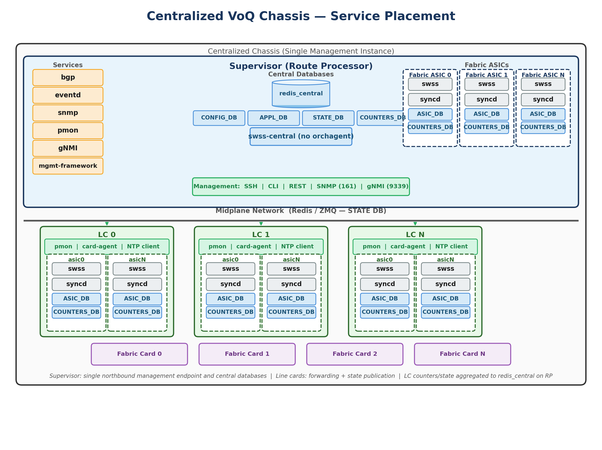
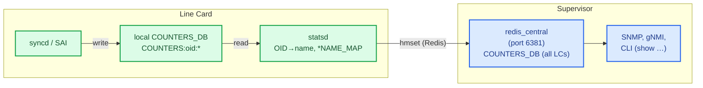
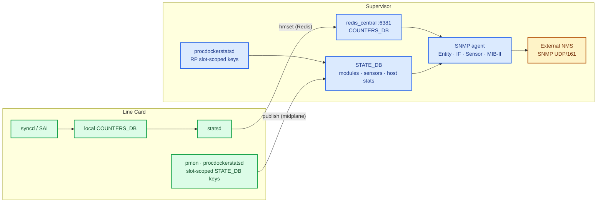
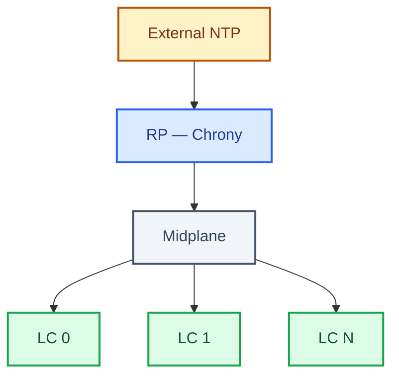

# High Level Design: Manageability for Centralized VoQ Chassis

## Revision

| Rev | Date | Author | Change Description |
|-----|------|--------|----------------------|
| 0.1 | 06/22/2026 | Aseem Choudhary<br>Rakshintha Prasad<br>Huan Lee | Initial version |

---

## Table of Contents

- [Revision](#revision)
- [About This Manual](#about-this-manual)
- [Definitions and Abbreviations](#definitions-and-abbreviations)
- [Scope](#scope)
- [Problem Statement](#problem-statement)
- [Functional Requirements](#functional-requirements)
- [Assumptions](#assumptions)
- [Architecture Overview](#architecture-overview)
  - [Chassis Topology](#chassis-topology)
  - [Chassis Detection APIs](#chassis-detection-apis)
- [Manageability Service Placement](#manageability-service-placement)
  - [Supervisor-only northbound services](#supervisor-only-northbound-services)
  - [Line card services](#line-card-services)
  - [FEATURE table and featured enforcement](#feature-table-and-featured-enforcement)
- [YANG Model Changes](#yang-model-changes)
  - [Device-Metadata Model](#device-metadata-model)
  - [FEATURE Model](#feature-model)
  - [Port and System-Port Models](#port-and-system-port-models)
  - [Event Models](#event-models)
- [Default Configuration](#default-configuration)
- [Database Architecture](#database-architecture)
  - [Device Metadata Schema](#device-metadata-schema)
  - [Central COUNTERS\_DB](#central-counters_db)
  - [STATE\_DB](#state_db)
  - [Sample Database Entries](#sample-database-entries)
- [CLI Manageability Framework](#cli-manageability-framework)
  - [Design Goals](#design-goals)
  - [CLI command scope](#cli-command-scope)
  - [Config Restriction](#config-restriction)
- [REST and OpenConfig](#rest-and-openconfig)
  - [Service placement and enforcement](#service-placement-and-enforcement)
  - [API scope](#api-scope)
  - [OpenConfig and SONiC YANG models](#openconfig-and-sonic-yang-models)
  - [CVL validation](#cvl-validation)
  - [Relationship to CLI](#relationship-to-cli)
- [statsd](#statsd)
  - [When it runs](#when-it-runs)
  - [Data Path Counters](#data-path-counters)
  - [Local inputs (per ASIC namespace)](#local-inputs-per-asic-namespace)
  - [Central outputs](#central-outputs)
  - [Processing loop](#processing-loop)
- [SNMP Manageability](#snmp-manageability)
  - [SNMP Design Overview](#snmp-design-overview)
  - [RFC 2737 — Entity MIB](#rfc-2737--entity-mib)
  - [RFC 2790 — Host Resources MIB](#rfc-2790--host-resources-mib)
  - [RFC 2863 — Interfaces MIB](#rfc-2863--interfaces-mib)
  - [RFC 3433 — Entity Sensor MIB](#rfc-3433--entity-sensor-mib)
  - [RFC 1213 — MIB-II](#rfc-1213--mib-ii)
- [Event Architecture](#event-architecture)
  - [Centralized Events Flow](#centralized-events-flow)
  - [Event Schema (YANG)](#event-schema-yang)
- [Telemetry](#telemetry)
- [NTP](#ntp)
- [References](#references)

---

## About This Manual

This document describes how SONiC **manageability** behaves on a **Single Instance (SI) centralized VOQ chassis**: a modular system where the **Route Processor (Supervisor)** is the sole operator-facing management endpoint, and **line cards** run forwarding, platform monitoring, and ASIC programming without direct external management access.

In the **distributed modular** model, each line card is an independent SONiC instance with its own SSH, CLI, SNMP, configuration store, and control-plane services. Operators and automation must treat every card as a separate device. The **centralized chassis** model changes that operational model while preserving VOQ forwarding semantics—system ports, remote neighbors, encap indices, and cross-ASIC reachability remain VOQ concepts; what changes is **where configuration is authored, where state is observed, and which services are exposed externally**.

On a centralized chassis, the Supervisor owns authoritative configuration, chassis-wide CLI and API access, SNMP and telemetry export, event aggregation, NTP coordination, and diagnostic collection. Line cards consume centrally authored configuration, publish operational and counter state into a shared visibility plane (principally **STATE_DB** and centralized **COUNTERS_DB**), and respond to Supervisor-initiated actions such as reboot, LED control, and firmware workflows. Port and metadata models are extended with **slot** and **ASIC** scope so chassis-wide **PORT** and **SYSTEM_PORT** keys stay unique and align with VOQ programming requirements. Runtime behavior is gated by chassis role detection—for example through **`device_info.is_chassis_centralized()`**, **`device_info.is_supervisor()`**, and platform metadata such as **`CENTRALIZED_CHASSIS`** / **`SUPERVISOR`** in **`platform_env.conf`**.

Centralized deployments use slot- and ASIC-scoped metadata tables—**`DEVICE_METADATA_SLOT`**, **`DEVICE_METADATA_ASIC`**, and **`DEVICE_METADATA|localhost`**—with **`DEVICE_METADATA|localhost`** **`platform`** set to **`centralized-chassis`**, so a single management instance can represent the whole chassis while still driving per-ASIC orchagent behavior on each line card.

The scope of this document is defined in [Scope](#scope). Terms used throughout are defined in [Definitions and Abbreviations](#definitions-and-abbreviations). The sections that follow specify that manageability behavior in detail.

---

## Definitions and Abbreviations

| Term | Definition |
|------|------------|
| SI (Single Instance) | Chassis model where one logical SONiC management instance on the Supervisor represents the entire chassis externally, while line cards run reduced local stacks for forwarding and platform functions |
| Supervisor / RP (Route Processor) | Chassis card that hosts authoritative configuration, external management interfaces, and aggregated operational visibility |
| LC (Line Card) | Forwarding card with one or more ASICs; publishes state to the Supervisor and executes propagated configuration; no direct external management access in centralized mode |
| FC (Fabric Card) | Card providing switch-fabric connectivity between line cards |
| VOQ (Virtual Output Queue) | Multi-ASIC forwarding model using system ports, remote neighbors, and encap indices for cross-ASIC reachability |
| Distributed VOQ chassis | Each ASIC or line card runs an independent SONiC instance with its own manageability stack; coordinated via **CHASSIS_APP_DB** patterns |
| Centralized VOQ chassis | VOQ forwarding semantics preserved; manageability consolidated on the Supervisor with slot/ASIC-scoped metadata and centralized state/counter databases |
| System Port | Logical port representing a physical port in the VOQ system; identified chassis-wide with slot and ASIC scope |
| Midplane | The chassis-internal control/data network that connects the Supervisor (RP) to line cards. Cards exchange manageability traffic over the midplane using assigned IP addresses (published in **STATE_DB** `CHASSIS_MIDPLANE_TABLE`). |
| CONFIG_DB | Authoritative configuration database; full chassis configuration on the Supervisor in centralized mode |
| APPL_DB | Application database consumed by orchagents; may contain chassis-wide entries authored from the Supervisor |
| STATE_DB | Operational state database; in centralized mode, a chassis-visible instance on the Supervisor aggregating line-card state |
| COUNTERS_DB | Counter and statistics database; centralized instance on the Supervisor for per-ASIC and chassis-wide telemetry |
| DEVICE_METADATA | Device identity and platform metadata; extended with slot/ASIC tables in centralized mode |
| DEVICE_METADATA_SLOT | Centralized chassis metadata table scoped to a physical slot |
| DEVICE_METADATA_ASIC | Centralized chassis metadata table scoped to an ASIC within a slot |
| platform_env.conf | Platform environment file identifying card role (`CENTRALIZED_CHASSIS`, `SUPERVISOR`) |
| card-agent | Host systemd service (`card_agent.py` / `card-agent.service`) on each chassis card; applies Supervisor-initiated actions (firmware update, CLI dispatch via `card_event` pub/sub) and publishes card status to **CHASSIS_STATE_DB** |
| swss-central | Supervisor-only SWSS container running central managers (no orchagent); aggregates port state and participates in central APPL_DB orchestration |
| eventd | SONiC event daemon; runs on the Supervisor only in centralized mode |
| gNMI | gRPC Network Management Interface; telemetry and management API served from the Supervisor |
| SNMP | Simple Network Management Protocol; agent runs on the Supervisor only and aggregates chassis-wide data |
| NTP | Network Time Protocol; Supervisor acts as server/proxy; line cards are clients |
| YANG | Data modeling language for configuration and operational schema |
| SAI | Switch Abstraction Interface; ASIC programming API used by syncd on line cards |
| FRU | Field-Replaceable Unit (fan, PSU, line card, fabric card, etc.) |
| OIR | Online Insertion and Removal of chassis modules |
| Push model | Line cards publish local operational data to central `STATE_DB` on the Supervisor (preferred approach in this HLD) |
| hostcfgd | Host configuration daemon in sonic-host-services; applies CONFIG_DB host settings (AAA, SSH, TACACS/RADIUS, logging, kdump, etc.) on each card; on centralized chassis line cards it runs a reduced handler set. Does **not** manage the **FEATURE** table |
| featured | Feature configuration daemon in sonic-host-services; reads CONFIG_DB **FEATURE**, applies scope flags (`has_global_scope`, `has_per_asic_scope`, `has_chassis_scope`), and starts/stops/masks the corresponding systemd container units on RP vs LC |
| mgmt-framework | SONiC management framework providing sonic-cli and REST/RESTCONF northbound APIs |

---

## Scope

This HLD defines **manageability behavior** for a **Single Instance centralized VOQ modular chassis**: how operators and automation use a **Supervisor-only** management surface, and how configuration, state, counters, events, and diagnostics are represented across line cards. It applies to VOQ modular platforms with a single external management endpoint on the Supervisor, midplane connectivity to line cards, and card-role detection via platform metadata and **DEVICE_METADATA**.

The document covers Supervisor-centric design for SSH, CLI, SNMP, gNMI/telemetry, events, NTP, tech-support, and ACLs; **manageability service placement** on the Supervisor versus line cards; YANG and default configuration for metadata, ports, and events; centralized **STATE_DB** and **COUNTERS_DB**; and the CLI, platform API, and SNMP adaptations required for chassis-wide operation.

It does **not** cover image build, low-level boot sequencing, VOQ-SAI programming, fabric orchestration, host data-path or CPU punt behavior, or the full RP-to-line-card integration framework. Peripheral lifecycle topics (fans, power, fabric OIR, firmware) appear here only where they affect manageability, such as module state in **STATE_DB**.

---

## Problem Statement

The current SONiC support for modular chassis is implemented in a distributed manner, with multiple independent SONiC instances. Each line card hosts its own management, routing, and manageability stack. As a result, the management controller must treat every line card in the chassis as an independent router for chassis and configuration management.

For some deployments, this model can be operationally complex. To simplify management, connectivity can be limited to the supervisor cards, allowing the route processor (RP) to centrally manage chassis modules and the control plane.

The **Single Instance (SI) centralized chassis** model introduces a unified management plane on the Supervisor card while correctly reflecting and controlling state across all Line Cards. This requires changes across the entire manageability stack:

| Area | Impact |
|------|--------|
| YANG Models | Per-slot and per-ASIC extensions to `DEVICE_METADATA`, `PORT`, `SYSTEM_PORT`, `FABRIC_PORT`, event schemas |
| Default Configuration | 8-slot default config generated automatically at `config-setup` time |
| Database | New `DEVICE_METADATA_SLOT` / `DEVICE_METADATA_ASIC` tables; centralized `COUNTERS_DB` |
| CLI | Supervisor-only restriction; chassis-wide `show` aggregation and LC dispatch from RP |
| Northbound APIs | mgmt-framework, SNMP, gNMI, and eventd on RP only; enforced via FEATURE `has_chassis_scope` |
| SNMP | Agent on RP only; aggregates data from all LCs via `STATE_DB` |
| Events / Eventlog | `eventd` placed on RP only; events carry `slot` field; published to RP chassis IP |
| Telemetry | Centralized `COUNTERS_DB` for per-ASIC counters; gNMI served from RP |
| NTP | Supervisor acts as NTP server/proxy; Line Cards are NTP clients |
| TechSupport / kdump | Coordinated chassis-wide collection from RP |

---

## Functional Requirements

At a functional level, SONiC shall manage supervisor cards, line cards, and all other peripheral devices as required by the chassis platform specification.

- Line Cards shall be managed via the Supervisor: power up/down, operational status, firmware updates.
- All configuration and management operations shall be performed from the Supervisor card.
- The Supervisor shall propagate configuration to Line Cards as needed.
- Any LC data required on the RP shall be made available through the `STATE_DB` (central Redis on supervisor).
- The Supervisor shall be the sole management interface for SSH, SNMP, gNMI, and CLI.
- Line Cards shall not have direct external management connectivity.
- The SNMP agent, **mgmt-framework** (sonic-cli / RESTCONF), **gNMI**, and **eventd** shall run on the Supervisor only.
- The `config` CLI shall be restricted to the Supervisor; Line Cards shall not accept configuration changes.
- Services like syslog, kdump, NTP, and tech-support shall be adapted for the centralized model.
- The Supervisor shall work as an NTP server/proxy; Line Cards shall act as NTP clients.

---

## Assumptions

- IP connectivity between Supervisor and Line Cards is available via mid-plane connectivity.
- In the centralized architecture, management connectivity is only from the RP. No Line Card shall have external management connectivity.
- The platform env file (`platform_env.conf`) reliably identifies card roles (`CENTRALIZED_CHASSIS`, `SUPERVISOR`).

---

## Architecture Overview

### Chassis Topology



**Key design principle:** The Supervisor is the single control-plane and northbound management node. Line cards run forwarding and platform services (`syncd`, `swss`, `pmon`, **card-agent**, NTP client). They do not run BGP, SNMP, `eventd`, **mgmt-framework**, or **gNMI**. Local **`show`** access remains available on line cards for troubleshooting; **`config`** and all external automation endpoints are Supervisor-only (see [Config Restriction](#config-restriction)).

**Data flow:** Line Cards push data to the central `STATE_DB` on the RP. Applications on the RP subscribe to this central DB to aggregate inventory, sensors, counters, and status from all cards.

### Chassis Detection APIs

The primary detection mechanism is `sonic_py_common.device_info`:

```python
device_info.is_chassis_centralized()  # True on both RP and LC in centralized chassis
device_info.is_supervisor()           # True only on the RP/Supervisor card
```

These functions read **`platform_env.conf`** only (keys **`CENTRALIZED_CHASSIS`** and **`SUPERVISOR`**). If the file or key is missing, or the value is not **`1`**, they return **`False`**. There is no CONFIG_DB fallback. Platform images are expected to set these keys on each card at boot.

```
  ┌────────────────────────────────────────────────────────────────┐
  │              Chassis Type Detection Logic                      │
  │                                                                │
  │   is_chassis_centralized()                                     │
  │   ┌──────────────────────────────────────────────────────┐     │
  │   │ Read platform_env.conf → CENTRALIZED_CHASSIS == "1"?  │     │
  │   │   (else False)                                       │     │
  │   └──────────────────────────────────────────────────────┘     │
  │                                                                │
  │   is_supervisor()                                              │
  │   ┌──────────────────────────────────────────────────────┐     │
  │   │ Read platform_env.conf → SUPERVISOR == "1"?          │     │
  │   │   (else False)                                       │     │
  │   └──────────────────────────────────────────────────────┘     │
  └────────────────────────────────────────────────────────────────┘
```

**Related CONFIG_DB fields (not used by these APIs):** `DEVICE_METADATA|localhost` carries chassis metadata such as **`subtype`** (`supervisor` | `linecard`). Other code paths (for example modular slot/ASIC metadata lookup, or additional VOQ SI gating) may consult **`switch_model`** or other fields separately; they do not substitute for **`is_chassis_centralized()`** or **`is_supervisor()`**.

The `ChassisBase.is_centralized_chassis()` API is also exposed through `sonic-platform-common` so that platform-level code (PMON daemons, chassisd) can make the same determination via the platform driver (default **`False`**; overridden on modular platforms).

---

## Manageability Service Placement

On a centralized chassis, **all operator-facing northbound interfaces are anchored on the active Supervisor (Route Processor)**. External SSH sessions, automation, SNMP polls, gNMI subscriptions, RESTCONF requests, and centralized event collection target the RP management address only. Line cards participate by publishing state and executing propagated configuration; they are not alternate management endpoints.

Service placement is enforced as follows:

1. **FEATURE table policy** — default configuration marks chassis-wide containers with `has_chassis_scope: true` so they start only on the Supervisor.
2. **featured** — the feature configuration daemon (sonic-host-services) runs on **both** the Supervisor and each line card, subscribes to CONFIG_DB **FEATURE**, and uses systemd to start, stop, mask, or unmask container service units according to card role and scope flags (`has_chassis_scope`, `has_global_scope`, `has_per_asic_scope`).
3. **hostcfgd** — a separate host-configuration daemon in the same package; applies CONFIG_DB host settings (AAA, SSH, logging, kdump, etc.) and does **not** read the **FEATURE** table.

Detailed behavior of individual northbound protocols is covered in later sections ([REST and OpenConfig](#rest-and-openconfig), [statsd](#statsd), [SNMP Manageability](#snmp-manageability), [Event Architecture](#event-architecture), [Telemetry](#telemetry), [Config Restriction](#config-restriction)).

### Supervisor-only northbound services

The following manageability services run **only on the Supervisor** in centralized mode:

| Service / container | Northbound role | Notes |
|---------------------|-----------------|-------|
| **mgmt-framework** | sonic-cli shell, REST, RESTCONF | Configuration and modeled GET/SET against central **CONFIG_DB** on the RP |
| **SNMP** | SNMP agent (UDP/161) | Chassis-wide MIB views; aggregates line-card data from central **STATE_DB** |
| **gNMI / telemetry** | gNMI server (e.g. TCP/9339) | Subscriptions served from central **CONFIG_DB**, **STATE_DB**, and **COUNTERS_DB** on the RP |
| **eventd** | Event collection and export | Receives events from all cards; external clients read from the RP |
| **BGP / FRR** | Control-plane routing | Routing protocols are not instantiated on line cards |
| **swss-central** | Central orchestration | Supervisor-only SWSS instance for chassis-wide managers (no per-LC orchagent on RP) |

SSH and the native SONiC CLI (`show` / `config`) are also used from the Supervisor for chassis-wide operations. The **`config`** CLI is blocked on line cards; **`show`** may still be used locally on a line card for troubleshooting (see [Config Restriction](#config-restriction)).

### Line card services

Line cards run a **reduced container set** focused on forwarding, platform monitoring, and state publication:

| Service / container | Role on line card |
|---------------------|-------------------|
| **database** | Local Redis for namespace-scoped **APPL_DB** / **ASIC_DB** |
| **syncd** / **swss** | Per-ASIC forwarding and orchagent (one stack per ASIC namespace) |
| **pmon** | Platform monitoring (thermal, sensor, transceiver) |
| **card-agent** | Host service (`card-agent.service`); applies Supervisor-initiated actions and participates in cross-card CLI dispatch via **CHASSIS_STATE_DB** / `card_event` |
| **hostcfgd** | Host OS configuration (reduced handler set on LC: kdump, logging, banner, auto-techsupport) |
| **featured** | Enforces **FEATURE** scope; starts per-ASIC and global containers, masks chassis-scoped services on LC |
| **NTP client** | Syncs time from the Supervisor |

Line cards **do not** start **mgmt-framework**, **SNMP**, **gNMI**, **eventd**, or **BGP** containers when `has_chassis_scope` enforcement is active for centralized chassis.

### FEATURE table and featured enforcement

Default chassis configuration is generated at image provisioning time (`init_cfg.json` from build templates). For centralized VOQ chassis, selected FEATURE entries include **`has_chassis_scope: true`**, meaning **featured** starts that container only when the card is the Supervisor.

Representative FEATURE entries (illustrative; exact states may vary by platform SKU and image options):

| FEATURE key | `has_chassis_scope` (centralized) | `has_per_asic_scope` | Placement |
|-------------|-----------------------------------|----------------------|-----------|
| `mgmt-framework` | true | false | Supervisor only |
| `snmp` | true | false | Supervisor only |
| `gnmi` | true | false | Supervisor only |
| `eventd` | true | false | Supervisor only |
| `bgp` | true | per platform | Supervisor only (control plane) |
| `swss-central` | true | false | Supervisor only |
| `swss` | false | true | Per-ASIC on line cards |
| `syncd` | false | true | Per-ASIC on line cards |
| `pmon` | false | false (global on card) | Each card |
| `database` | false | true | RP and each LC (namespace-scoped) |

**featured** on the Supervisor starts chassis-scoped containers and the full management stack. **featured** on a line card masks or skips chassis-scoped features and starts only local forwarding and platform containers (via systemd units such as `swss@0`, `syncd@0`, `pmon`). This keeps a single external management surface while still allowing each card to run the processes it needs for ASIC programming and hardware monitoring.

### Comparison with distributed modular SONiC

Compared to **distributed modular SONiC**, where each line card runs a full container set including **bgp**, **snmp**, **gnmi**, **mgmt-framework**, and **eventd**, centralized line cards run only forwarding and platform containers (**database**, **syncd**, **swss**, **pmon**, and related local services) and omit the chassis-scoped FEATURE entries in the table above.

Operators can inspect effective placement with `show feature status` on the Supervisor; line cards should not expose northbound management listeners on external interfaces.

---

## YANG Model Changes

### Device-Metadata Model

The `DEVICE_METADATA` YANG model is extended to support per-slot and per-ASIC configuration:

```
module: sonic-device-metadata (Centralized-Chassis)

+--rw DEVICE_METADATA
|  +--rw localhost
|     +--rw platform?          string        ← "centralized-chassis"
|     +--rw hwsku?             stypes:hwsku
|     +--rw hostname?          stypes:hostname
|     +--rw mac?               yang:mac-address
|     +--rw type?              string
|     +--rw subtype?           string        ← "supervisor" | "linecard"
|     +--rw bgp_router_id?     inet:ipv4-address
|     +--rw buffer_model?      string        ← "dynamic" | "traditional" (chassis-wide)
|     … (standard fields) …

+--rw DEVICE_METADATA_SLOT
|  +--rw DEVICE_METADATA_SLOT_LIST* [slot_id]
|     +--rw slot_id            stypes:slot
|     +--rw product_id?        stypes:hwsku

+--rw DEVICE_METADATA_ASIC
   +--rw DEVICE_METADATA_ASIC_LIST* [slot_id asic_name]
      +--rw slot_id            stypes:slot
      +--rw asic_name          stypes:asic_name
      +--rw asic_id?           string
      +--rw sub_role?          string        ← "FrontEnd" | "BackEnd" | "Fabric"
      +--rw switch_id?         uint16
      +--rw switch_type?       string
      +--rw max_cores?         uint8
      +--rw ring_thread_enabled? boolean
      +--rw default_pfcwd_status? enumeration
      +--rw resource_type?     string
      +--rw supporting_bulk_counter_groups* string
```

This clean separation allows `DEVICE_METADATA|localhost` to represent chassis-wide metadata (`platform` = `centralized-chassis`, `buffer_model` for QoS/buffer calculation, and other global fields), while per-card and per-ASIC metadata live in their own indexed tables, enabling multi-card configuration management from the Supervisor.

### FEATURE Model

The `sonic-feature` YANG module (`CONFIG_DB` **`FEATURE`** table) is extended for centralized chassis with a new leaf, **`has_chassis_scope`**, which declares that a Docker feature runs as a **single chassis-wide instance on the Supervisor only**.

```
module: sonic-feature (Centralized-Chassis)

+--rw sonic-feature
   +--rw FEATURE
      +--rw FEATURE_LIST* [name]
         +--rw name                  string
         +--rw state?                feature-state
         +--rw auto_restart?         feature-state
         +--rw delayed?              feature-delay-status
         +--rw has_chassis_scope?    feature-scope-status   ← NEW (default "false")
         +--rw has_global_scope?     feature-scope-status
         +--rw has_per_asic_scope?   feature-scope-status
         +--rw has_per_dpu_scope?    feature-scope-status
         … (standard fields) …
```

**Semantics**

| Leaf | Scope | Centralized chassis use |
|------|--------|-------------------------|
| `has_chassis_scope` | **One instance for the whole chassis, Supervisor only** | Northbound and control-plane services: `mgmt-framework`, `snmp`, `gnmi`, `eventd`, `bgp`, `swss-central`, etc. |
| `has_global_scope` | **One instance per card** (host namespace) | Services needed once on each physical module (e.g. `pmon`) |
| `has_per_asic_scope` | **One instance per ASIC namespace** | Forwarding stack: `swss`, `syncd`, `database@N` |

When `has_chassis_scope` is **`True`**, **featured** treats the feature as Supervisor-only: it forces `has_global_scope` and `has_per_asic_scope` to **`False`** for that entry and **masks/stops** the systemd service on line cards. On the active Supervisor, the feature runs as a single unit (e.g. `bgp.service`, not `bgp@0`). See [FEATURE table and featured enforcement](#feature-table-and-featured-enforcement) for representative placement and runtime behavior.

**Default configuration**

On images built with `CENTRALIZED_CHASSIS=y`, `init_cfg.json` (from `init_cfg.json.j2`) adds `has_chassis_scope` to selected features. The value is **Jinja-rendered at runtime** from device metadata so the same image can behave as centralized or non-centralized:

```json
"FEATURE|mgmt-framework": {
  "state": "enabled",
  "has_chassis_scope": "True",
  "has_global_scope": "false",
  "has_per_asic_scope": "False"
}
```

Features that receive `has_chassis_scope` in the centralized image template include: **`bgp`**, **`lldp`**, **`teamd`**, **`mgmt-framework`**, **`snmp`**, **`gnmi`**, **`eventd`**, **`restapi`**, **`radv`**, and **`sflow`**. Rendering is gated on `DEVICE_RUNTIME_METADATA['CHASSIS_METADATA']['chassis_subtype'] == 'centralized'`.

### Port and System-Port Models

Both `PORT` and `SYSTEM_PORT` models are extended to carry `slot_id` and `asic_id` for centralized chassis, enabling the Supervisor to maintain a complete, per-card port inventory:

```
module: sonic-system-port (Centralized-Chassis)
+--rw SYSTEM_PORT
   +--rw SYSTEM_PORT_LIST* [hostname asic_name ifname]
      +--rw hostname           stypes:hostname
      +--rw asic_name          stypes:asic_name
      +--rw ifname             string
      +--rw slot_id?           string   ← NEW for centralized
      +--rw asic_id?           string   ← NEW for centralized
      +--rw core_index?        uint8
      +--rw core_port_index?   uint16
      +--rw num_voq?           uint8
      +--rw speed?             uint32
      +--rw switch_id?         uint16
      +--rw system_port_id?    uint32

module: sonic-port (Centralized-Chassis)
+--rw PORT
   +--rw PORT_LIST* [name]
      +--rw name               string
      +--rw slot_id?           string   ← NEW for centralized
      +--rw asic_id?           string   ← NEW for centralized
      +--rw core_id?           string
      +--rw core_port_id?      string
      +--rw num_voq?           string
      … (standard fields) …

module: sonic-fabric-port (Centralized-Chassis)
+--rw FABRIC_PORT
   +--rw FABRIC_PORT_LIST* [name]
      +--rw name               string
      +--rw slot_id?           string   ← NEW for centralized
      +--rw asic_id?           string   ← NEW for centralized
```

### Event Models

Event YANG models are extended with a `slot` field so that events emitted from any card in the chassis (RP, LC, fabric) are tagged with their source slot. This enables centralized event filtering and correlation:

```
module: sonic-events-host
+--rw sonic-events-host
   +--rw disk-usage
   |  +-- … +--rw slot?   string   ← NEW
   +--rw memory-usage
   |  +-- … +--rw slot?   string   ← NEW
   +--rw cpu-usage
   |  +-- … +--rw slot?   string   ← NEW
   +--rw event-disk
   |  +-- … +--rw slot?   string   ← NEW
   +--rw event-kernel
   |  +-- … +--rw slot?   string   ← NEW
   +--rw mem-threshold-exceeded
   |  +-- … +--rw slot?   string   ← NEW
   +--rw process-exited-unexpectedly
      +-- … +--rw slot?   string   ← NEW

module: sonic-events-syncd
+--rw sonic-events-syncd
   +--rw syncd-failure
   |  +-- … +--rw slot?   string   ← NEW
   +--rw alpm-parity-error
      +-- … +--rw slot?   string   ← NEW

module: sonic-events-swss
+--rw sonic-events-swss
   +--rw asic-sdk-health-event
   |  +-- … +--rw slot?   string   ← NEW
   +--rw pfc-storm
   |  +-- … +--rw slot?   string   ← NEW
   +--rw chk_crm_threshold
      +-- … +--rw slot?   string   ← NEW
```

---

## Default Configuration

`config-setup` is modified to generate an **8-slot default configuration** at first boot. `sonic-cfggen` renders Jinja2 templates parameterized by `slot` and `asic` context variables:

```
  Default Configuration Generated at config-setup Time
  ┌──────────────────────────────────────────────────────────────────┐
  │                                                                  │
  │  DEVICE_METADATA                                                 │
  │  ├── localhost (global: platform, hostname, hwsku, mac,           │
  │  │              buffer_model, …)                                 │
  │  ├── DEVICE_METADATA_SLOT[slot=0..7]  (per LC slot)              │
  │  └── DEVICE_METADATA_ASIC[slot=0..7][asic=0..N] (per ASIC)       │
  │                                                                  │
  │  PORT (front-panel + special: NPUH, Punt, Recycle)               │
  │  ├── Slot 0: Ethernet0/0 … Ethernet35/0                          │
  │  ├── Slot 1: Ethernet0/1 … Ethernet35/1                          │
  │  └── … up to Slot 7                                              │
  │                                                                  │
  │  SYSTEM_PORT (all LCs, with slot_id and asic_id)                 │
  │  FABRIC_PORT (fabric ports across all slots)                     │
  │                                                                  │
  └──────────────────────────────────────────────────────────────────┘
```

All basic Docker containers come up in an **active state** on the Supervisor at first boot. The **`config`** CLI and chassis-wide management operations run from the Supervisor only; line cards retain limited local **`show`** access for troubleshooting (see [CLI command scope](#cli-command-scope)).

---

## Database Architecture

### Device Metadata Schema

The original `DEVICE_METADATA` table is replaced by a three-tier schema:

| Table | Key | Description |
|-------|-----|-------------|
| `DEVICE_METADATA` | `localhost` | Chassis-wide metadata on the RP (`platform` = `centralized-chassis`, hwsku, hostname, `buffer_model`, …) |
| `DEVICE_METADATA_SLOT` | `{slot_id}` | Per-slot (per-card) metadata in central CONFIG_DB on RP |
| `DEVICE_METADATA_ASIC` | `{slot_id}\|asic{n}` | Per-ASIC metadata for a given slot |

### Central COUNTERS\_DB

In a centralized chassis, all interface counter queries are served from the Supervisor. A central Redis instance (`redis_central`) on the RP hosts `COUNTERS_DB`. The initialization script redirects the standard COUNTERS_DB to this central instance at startup:

```bash
# docker-database-init.sh
if [[ -f "$REDIS_DIR/sonic-db/database_config.json" ]] && \
   [[ "$NAMESPACE_ID" == "" ]] && \
   [[ "$INCLUDE_CENTRAL_DB" == "y" ]]; then
    sed -i '/"COUNTERS_DB" :/,/instance/s/"instance" : "redis"/"instance" : "redis_central"/' \
        $REDIS_DIR/sonic-db/database_config.json
fi
```

**`redis_central`** is the logical SONiC database instance name. It resolves to **`redis_chassis.server:6381`** on the Supervisor. **`statsd`** writes directly to that endpoint; CLI, SNMP, and gNMI read **`COUNTERS_DB`** through the same instance via `database_config.json`.

This is conditional on the `INCLUDE_CENTRAL_DB` build flag, enabled for centralized chassis images. Line cards populate the central instance via the **`statsd`** host daemon; see [statsd](#statsd).

**Counter Data Flow (Centralized)**



Each line card's `syncd` writes SAI counters into the **local** namespace `COUNTERS_DB`; the **`statsd`** host daemon on that card reads those OID keys, maps them via `*NAME_MAP` tables, and **`hmset`**s named entries to central `COUNTERS_DB` on `redis_chassis.server:6381`. See [statsd](#statsd) for the full sync path.

### STATE\_DB

The `STATE_DB` (hosted on the Supervisor on the midplane) is the central hub for cross-card state:

| Usage | Writer | Reader |
|-------|--------|--------|
| Module state publication | `chassisd` | `snmp`, CLI, monitoring |
| Per-card process/docker stats | `procdockerstatsd` on each LC | RP aggregation |
| kdump file metadata | LC kdump service | RP forwarder |
| CLI command request/response | RP CLI tools | **card-agent** |
| Firmware info | **card-agent** | RP CLI / monitoring |
| Sensor data | LC PMON `thermalctld`, `sensormond` | RP PMON, SNMP |

### Sample Database Entries

The examples below were captured from a live centralized chassis using `sonic-db-dump -y` on the central Redis instance (`redis_central`). `CONFIG_DB`, `APPL_DB`, `STATE_DB`, and `COUNTERS_DB` are all hosted on the Supervisor; line cards publish operational state and counters into these central databases.

**Naming conventions**

| Table | Key format | Example |
|-------|------------|---------|
| `PORT` | `PORT\|Ethernet{slot}_{index}` | `PORT\|Ethernet1_8` |
| `SYSTEM_PORT` | `SYSTEM_PORT\|LC{slot}\|asic{n}\|{ifname}` | `SYSTEM_PORT\|LC1\|asic0\|Ethernet1_8` |
| `FABRIC_PORT` | `FABRIC_PORT\|Fabric_{slot}_{asic}_{lane}` | `FABRIC_PORT\|Fabric_RP0_0_2` |
| `COUNTERS` | `COUNTERS:{port_or_object}` | `COUNTERS:Ethernet1_8` |

#### CONFIG\_DB — `PORT`

```bash
sonic-db-dump -n CONFIG_DB -y -k "PORT|Ethernet1_8"
```

```json
{
  "PORT|Ethernet1_8": {
    "expireat": 1781732218.9661489,
    "ttl": -0.001,
    "type": "hash",
    "value": {
      "admin_status": "up",
      "alias": "Ethernet1_8",
      "asic_id": "0",
      "asic_port_name": "Eth64-ASIC0",
      "core_id": "1",
      "core_port_id": "8",
      "index": "8",
      "lanes": "264,265,266,267,268,269,270,271",
      "mtu": "9100",
      "num_voq": "8",
      "role": "Ext",
      "slot_id": "1",
      "speed": "400000"
    }
  }
}
```

#### CONFIG\_DB — `SYSTEM_PORT`

```bash
sonic-db-dump -n CONFIG_DB -y -k "SYSTEM_PORT|LC1|asic0|Ethernet1_8"
```

```json
{
  "SYSTEM_PORT|LC1|asic0|Ethernet1_8": {
    "expireat": 1781732219.3736343,
    "ttl": -0.001,
    "type": "hash",
    "value": {
      "core_index": "1",
      "core_port_index": "8",
      "num_voq": "8",
      "speed": "400000",
      "switch_id": "3",
      "system_port_id": "72"
    }
  }
}
```

Special ports (for example `Recycle`, `Punt`, `RP_CPU`) use the same key format:

```bash
sonic-db-dump -n CONFIG_DB -y -k "SYSTEM_PORT|LC0|asic1|Recycle4"
```

```json
{
  "SYSTEM_PORT|LC0|asic1|Recycle4": {
    "expireat": 1781732219.786667,
    "ttl": -0.001,
    "type": "hash",
    "value": {
      "asic_id": "1",
      "core_index": "8",
      "core_port_index": "25",
      "num_voq": "8",
      "slot_id": "0",
      "speed": "100000",
      "switch_id": "1",
      "system_port_id": "1510"
    }
  }
}
```

#### CONFIG\_DB — `FABRIC_PORT`

```bash
sonic-db-dump -n CONFIG_DB -y -k "FABRIC_PORT|Fabric_RP0_0_2"
```

```json
{
  "FABRIC_PORT|Fabric_RP0_0_2": {
    "expireat": 1781732220.1771483,
    "ttl": -0.001,
    "type": "hash",
    "value": {
      "alias": "Fabric_RP0_0_2",
      "asic_id": "0",
      "isolateStatus": "False",
      "lanes": "2,3",
      "slot_id": "RP0"
    }
  }
}
```

#### APPL\_DB — operational port state from line cards

After orchagent on each line card programs the ASIC, operational attributes are visible in central `APPL_DB`:

```bash
sonic-db-dump -n APPL_DB -y -k "PORT_TABLE:Ethernet1_8"
```

```json
{
  "PORT_TABLE:Ethernet1_8": {
    "expireat": 1781732221.073052,
    "ttl": -0.001,
    "type": "hash",
    "value": {
      "admin_status": "up",
      "alias": "Ethernet1_8",
      "asic_id": "0",
      "asic_port_name": "Eth64-ASIC0",
      "core_id": "1",
      "core_port_id": "8",
      "description": "",
      "flap_count": "3",
      "index": "8",
      "lanes": "264,265,266,267,268,269,270,271",
      "last_down_time": "Wed Jun 17 20:00:46 2026",
      "last_up_time": "Wed Jun 17 20:00:47 2026",
      "mtu": "9100",
      "num_voq": "8",
      "oper_status": "up",
      "role": "Ext",
      "slot_id": "1",
      "speed": "400000"
    }
  }
}
```

Corresponding `SYSTEM_PORT_TABLE` entry:

```bash
sonic-db-dump -n APPL_DB -y -k "SYSTEM_PORT_TABLE:LC1|asic0|Ethernet1_8"
```

```json
{
  "SYSTEM_PORT_TABLE:LC1|asic0|Ethernet1_8": {
    "expireat": 1781732221.3810472,
    "ttl": -0.001,
    "type": "hash",
    "value": {
      "core_index": "1",
      "core_port_index": "8",
      "num_voq": "8",
      "speed": "400000",
      "switch_id": "3",
      "system_port_id": "72"
    }
  }
}
```

#### STATE\_DB — `FABRIC_PORT_TABLE`

Fabric port reachability state is published to central `STATE_DB` by fabric orchestration on the Supervisor:

```bash
sonic-db-dump -n STATE_DB -y -k "FABRIC_PORT_TABLE|PORT_RP0_0_1538"
```

```json
{
  "FABRIC_PORT_TABLE|PORT_RP0_0_1538": {
    "expireat": 1781732221.8026516,
    "ttl": -0.001,
    "type": "hash",
    "value": {
      "STATUS": "down"
    }
  }
}
```

#### COUNTERS\_DB — counters updated from line cards

Each line card's `syncd` writes SAI counters into the local namespace `COUNTERS_DB`; the **`statsd`** host daemon on that card publishes named counter hashes to central `COUNTERS_DB` on `redis_central` for chassis-wide queries (see [statsd](#statsd)). Central counter entries carry a TTL (`expireat` / `ttl`) set by `statsd` so stale data expires if sync stops.

Front-panel port counters (`Ethernet1_8` on LC1):

```bash
sonic-db-dump -n COUNTERS_DB -y -k "COUNTERS:Ethernet1_8"
```

```json
{
  "COUNTERS:Ethernet1_8": {
    "expireat": 1781732272.3142629,
    "ttl": 50.06,
    "type": "hash",
    "value": {
      "SAI_PORT_STAT_IF_IN_UCAST_PKTS": "0",
      "SAI_PORT_STAT_IF_OUT_UCAST_PKTS": "212",
      "SAI_PORT_STAT_IF_IN_OCTETS": "0",
      "SAI_PORT_STAT_IF_OUT_OCTETS": "61088",
      "SAI_PORT_STAT_IF_IN_ERRORS": "0",
      "SAI_PORT_STAT_IF_OUT_ERRORS": "0",
      "SAI_PORT_STAT_ETHER_STATS_TX_NO_ERRORS": "212",
      "SAI_PORT_STAT_IF_IN_FEC_CORRECTABLE_FRAMES": "0",
      "SAI_PORT_STAT_IF_IN_FEC_NOT_CORRECTABLE_FRAMES": "0",
      "SAI_PORT_STAT_IF_IN_FEC_SYMBOL_ERRORS": "0"
    }
  }
}
```

The live dump includes the full SAI port-statistics set (ether size histograms, PFC, pause, and per-codeword FEC counters).

Queue-level counters for the same port:

```bash
sonic-db-dump -n COUNTERS_DB -y -k "COUNTERS:QUEUE_Ethernet1_8:0"
```

```json
{
  "COUNTERS:QUEUE_Ethernet1_8:0": {
    "expireat": 1781732272.240364,
    "ttl": 49.516,
    "type": "hash",
    "value": {
      "SAI_QUEUE_STAT_BYTES": "68508",
      "SAI_QUEUE_STAT_DROPPED_BYTES": "0",
      "SAI_QUEUE_STAT_DROPPED_PACKETS": "0",
      "SAI_QUEUE_STAT_PACKETS": "212",
      "SAI_QUEUE_STAT_SHARED_WATERMARK_BYTES": "0"
    }
  }
}
```

Fabric port counters:

```bash
sonic-db-dump -n COUNTERS_DB -y -k "COUNTERS:FABRIC_PORT_RP0_0_1542"
```

```json
{
  "COUNTERS:FABRIC_PORT_RP0_0_1542": {
    "expireat": 1781732281.8037527,
    "ttl": 58.596,
    "type": "hash",
    "value": {
      "SAI_PORT_STAT_IF_IN_ERRORS": "0",
      "SAI_PORT_STAT_IF_IN_FABRIC_DATA_UNITS": "0",
      "SAI_PORT_STAT_IF_IN_FEC_CORRECTABLE_FRAMES": "0",
      "SAI_PORT_STAT_IF_IN_FEC_NOT_CORRECTABLE_FRAMES": "0",
      "SAI_PORT_STAT_IF_IN_FEC_SYMBOL_ERRORS": "0",
      "SAI_PORT_STAT_IF_IN_OCTETS": "0",
      "SAI_PORT_STAT_IF_OUT_FABRIC_DATA_UNITS": "0",
      "SAI_PORT_STAT_IF_OUT_OCTETS": "0"
    }
  }
}
```

---

## CLI Manageability Framework

### Design Goals

- Chassis-wide management CLIs are intended for the Supervisor; line cards retain limited local **`show`** access for troubleshooting.
- Where a command needs data from a line card, the RP fetches or aggregates it transparently.
- The entire `config` CLI is supervisor-only on a centralized chassis; commands that modify global state (kdump settings, and similar) follow the same model.

### CLI command scope

Centralized chassis CLI behavior differs by **command tree**, **card role**, and whether the command needs **chassis-wide** or **local-only** data.

**Command scope summary**

| Category | Supervisor (RP) | Line card (LC) |
|----------|-------------------|----------------|
| **`config` (all subcommands)** | Allowed | Not available |
| **`show running-config` / configuration views** | Authoritative chassis config | Not available (no local CONFIG authority) |
| **`show ip bgp` / routing control-plane** | Allowed (RP BGP instance) | Not applicable (no BGP on LC) |
| **`show interfaces`** | Chassis-wide; iterates front-end ASIC namespaces on RP | Local interfaces for this card's ASIC namespace(s) only |
| **`show queue` / `show buffer` / QoS counters** | Aggregated chassis view where implemented | Local ASIC/namespace view only |
| **`show chassis` / module / platform inventory** | Chassis-wide module and FRU state | Local module and hardware state for this card |
| **`show techsupport` and similar diagnostics** | Chassis-wide collection with `--chassis` / `--all-lc` | Local dump for this card when run on LC |
| **Platform hardware diagnostics** | RP execution with relay to target LC (`--node`, `--asic`) | Local execution when logged into LC |

**Supervisor (RP) behavior**

Operators and automation should treat the RP as the **primary CLI entry point** for chassis-wide visibility and all configuration. On the RP:

- `show` commands that report forwarding or platform state across line cards aggregate data from central **STATE_DB**, **COUNTERS_DB**, or explicit LC dispatch.
- Chassis-targeting options (`--chassis`, `--all-lc`, `--lc-list`, `--rp-only`) apply to selected chassis-wide `show` and diagnostic commands on the RP.
- Namespace selection for centralized chassis is simplified on the RP (for example, `show interfaces` defaults to all front-end namespaces rather than requiring per-namespace `-n` on operators).

**Line card (LC) behavior**

Line cards support **`show` only** for local troubleshooting. Typical use cases include inspecting local port state, ASIC tables, platform sensors, and container health on the card where a fault is suspected.

- **`config` is not available** on line cards.
- **`show` results are local** unless the command explicitly reaches the central databases populated by that LC; they do not replace RP chassis-wide views.
- Commands that require RP-only services (BGP, SNMP agent configuration, chassis-wide routing policy) return empty, informational, or error output on the LC.
- Operators who need a chassis-wide view must use the Supervisor CLI (or northbound APIs described in [Manageability Service Placement](#manageability-service-placement)).

**Relationship to northbound APIs**

The same scope rules apply to modeled management interfaces: **sonic-cli**, RESTCONF, and gNMI are served from the RP only. Line cards do not expose parallel northbound configuration or telemetry endpoints externally.


### Config Restriction

On a centralized chassis, configuration changes are made only on the **Supervisor (Route Processor)**. The **`config` CLI is not available on line cards**; operators and automation must use the RP for all configuration.

#### Supervisor-only enforcement

The restriction applies to the **entire `config` command tree**. On a line card, any `config …` attempt is rejected before the subcommand runs.

Enforcement is applied **once at the root of the `config` CLI** in sonic-utilities. The system identifies a centralized chassis and whether the current card is the supervisor. On a line card, the user receives a clear error directing them to run the command on the RP. Standalone and non-centralized systems are unaffected.

#### Config save/load behavior

On the Supervisor, **`config save` and `config load` use a single `config_db.json`** as the authoritative configuration file for the chassis. Centralized chassis does **not** use separate per-ASIC configuration files, unlike distributed multi-ASIC deployments where additional namespace-specific files may exist.

#### Config reload

On a centralized chassis, **`config reload` runs only on the Supervisor**. Line cards reject the command; operators reload chassis-wide configuration from the RP using a **single** `config_db.json` (or YANG equivalent), not per-ASIC namespace files.

Before loading the new config into central **CONFIG_DB**, the RP stops `sonic.target` on itself and on every active line card. After the config is written, it runs `reset-failed` and restarts `sonic.target` on the RP and all line cards in parallel, so forwarding and platform services across the chassis come up against the new configuration together.

For which `show` commands are available on the Supervisor versus line cards, see [CLI command scope](#cli-command-scope).

## REST and OpenConfig

The **mgmt-framework** container on the Supervisor provides modeled northbound management through **REST** and **RESTCONF** APIs. These interfaces share the same authoritative configuration and operational datastores as the SONiC CLI on the RP. External automation targets the Supervisor management address only; line cards do not expose REST or RESTCONF endpoints.

### Service placement and enforcement

| Aspect | Centralized chassis behavior |
|--------|------------------------------|
| **Container** | `mgmt-framework` runs on the **Supervisor only** (`has_chassis_scope: true`) |
| **Line cards** | `mgmt-framework` is not started; no northbound REST/RESTCONF listener |
| **Datastore** | Reads and writes central **CONFIG_DB** on the RP |
| **Operational state** | GET operations use central **STATE_DB** and aggregated chassis data where applicable |
| **Config authority** | Same supervisor-only rule as [Config Restriction](#config-restriction) — configuration changes are accepted only on the RP |

### API scope

| Operation | Supervisor (RP) | Line card (LC) |
|-----------|-----------------|----------------|
| **RESTCONF GET** (configuration / operational state) | Supported against chassis-wide modeled data | Not exposed |
| **RESTCONF POST / PUT / PATCH / DELETE** (configuration) | Supported; writes central **CONFIG_DB** | Not exposed |
| **Legacy REST APIs** used by sonic-cli actioners | Available locally on RP | Not available |
| **sonic-cli modeled commands** | Supported on RP | Configuration commands not available on LC |

### OpenConfig and SONiC YANG models

Modeled APIs are generated from SONiC and OpenConfig YANG. For centralized chassis, chassis-wide objects are extended with **slot** and **ASIC** keys as described in [YANG Model Changes](#yang-model-changes):

- `DEVICE_METADATA`, `DEVICE_METADATA_SLOT`, and `DEVICE_METADATA_ASIC` for card and ASIC identity
- `PORT`, `SYSTEM_PORT`, and `FABRIC_PORT` entries keyed by slot and ASIC
- Event models extended with a `slot` leaf for source-card correlation

Clients therefore manage the chassis as a **single modeled instance** from the RP while still addressing per-card and per-ASIC resources through the extended schema.

### CVL validation

REST and RESTCONF changes are validated by CVL on the transaction cache only. On a centralized chassis, configuration that uses YANG `when` expressions reading `DEVICE_METADATA|localhost` may be validated without that metadata in the cache, so unrelated REST PATCH operations can fail semantic validation. CVL is enhanced to prefetch `DEVICE_METADATA|localhost` for `when`/`leafref` xpath evaluation, to support centralized-chassis configuration parameters in the xpath engine, and to apply centralized-chassis-aware `when` checks.

### Relationship to CLI

- **sonic-cli** on the Supervisor uses the mgmt-framework REST client to perform modeled GET/SET operations.
- RESTCONF and CLI configuration changes target the same central **CONFIG_DB** and follow the same supervisor-only policy documented in [CLI command scope](#cli-command-scope) and [Config Restriction](#config-restriction).
- **`config save` / `config load`** on the RP persist a single `config_db.json` for the chassis; RESTCONF clients observe the same authoritative configuration snapshot.


## statsd

`statsd` is a host daemon in `sonic-host-services` (`src/sonic-host-services/scripts/statsd`) that runs on centralized chassis systems. It periodically aggregates counter data from each local ASIC `COUNTERS_DB` and publishes it to the chassis central Redis, translating SAI OID keys into human-readable counter names. This is SONiC-specific counter sync for centralized VoQ chassis (not the generic StatsD metrics server).

### When it runs

- **Platform gate:** `device_info.is_chassis_centralized()` must be true; otherwise the daemon exits.
- **Service:** `statsd.service` (systemd), started after `database.service` and `config-setup.service`, with `Restart=always`.
- **Placement:** Runs on **both RP and line cards** (the systemd `ExecCondition` checks centralized chassis, not supervisor-only).

### Data Path Counters

```
  statsd Counter Sync (Centralized)
  ┌─────────────────────────────────────────────────────────────────┐
  │  Line card (per ASIC namespace)        Supervisor central Redis │
  │  ┌─────────────────────────┐          ┌───────────────────────┐ │
  │  │ asic0 … asicN           │          │ redis_chassis.server  │ │
  │  │ COUNTERS_DB             │  statsd  │ :6381 / COUNTERS_DB   │ │
  │  │ COUNTERS:oid:*          │ ───────► │ COUNTERS:Ethernet*    │ │
  │  │ RATES:oid:*             │  (10 s)  │ COUNTERS:QUEUE_* …    │ │
  │  │ *NAME_MAP tables        │          │ RATES:<name>          │ │
  │  └─────────────────────────┘          └───────────────────────┘ │
  └─────────────────────────────────────────────────────────────────┘
```

### Local inputs (per ASIC namespace)

For each ASIC namespace (`asic0` … `asicN-1`), `statsd` connects to local `COUNTERS_DB` and builds OID→name maps from:

| Map table | Central key format |
|-----------|-------------------|
| `COUNTERS_PORT_NAME_MAP` | `COUNTERS:<ifname>` (standard interface form; no `PORT_` prefix) |
| `COUNTERS_QUEUE_NAME_MAP` (+ `COUNTERS_QUEUE_TYPE_MAP` filter) | `COUNTERS:QUEUE_<name>` |
| `COUNTERS_PG_NAME_MAP` | `COUNTERS:PG_<name>` |
| `COUNTERS_RIF_NAME_MAP` | `COUNTERS:RIF_<name>` |
| `COUNTERS_FABRIC_PORT_NAME_MAP` | `COUNTERS:FABRIC_PORT_<name>` |

It reads **`COUNTERS:oid:*`** (counter field values) and matching **`RATES:oid:*`** entries when present.

### Central outputs

- Converts each OID entry to a named hash key (for example `COUNTERS:Ethernet1_8`, `RATES:Ethernet1_8`, `COUNTERS:QUEUE_Ethernet0:3`).
- Port counters use the standard **`COUNTERS:<interface-name>`** form so existing CLI, SNMP, and gNMI consumers can query `COUNTERS:Ethernet*` without change. Queue, PG, RIF, and fabric counters retain typed prefixes.
- Writes via **`hmset`** to central `COUNTERS_DB` on **`redis_central`**.
- Sets **TTL = 60 seconds** on each key so stale counters expire if sync stops.

### Processing loop

1. Connect to central `COUNTERS_DB`.
2. For each ASIC namespace: connect local DB, build name maps, collect `COUNTERS:oid:*` and `RATES:oid:*`.
3. Aggregate into a single dict and bulk-transfer to central DB.
4. Sleep **10 seconds** (5 seconds on error).

---

## SNMP Manageability

### SNMP Design Overview

The SNMP agent runs **only on the Supervisor** and aggregates data from all cards via central **`STATE_DB`** and **`COUNTERS_DB`**. Interface and queue counters are served from central **`COUNTERS_DB`**, populated by **`statsd`** on each line card; see [statsd](#statsd). Module, sensor, and host statistics in **`STATE_DB`** are published by **`procdockerstatsd`** (and platform daemons such as **pmon**) on **every card**, including the RP.

**SNMP Agent Architecture (SI Chassis)**



The SNMP agent does **not** run **`statsd`**. It reads central **`COUNTERS_DB`** and **`STATE_DB`** on the RP and serves chassis-wide MIB views to external managers.

### RFC 2737 — Entity MIB

Physical component table (`entPhysicalTable`) is updated to:
- In `is_chassis_centralized()` mode, read module entries from `STATE_DB` instead of local `STATE_DB`.
- Include chassis-level entries (chassis, slots, cards) by iterating modules via the chassis API.

### RFC 2790 — Host Resources MIB

CPU (`hrProcessorTable`), storage (`hrStorageTable`), and filesystem (`hrFSTable`) tables are extended for SI chassis:
- Per-slot memory and storage data is read from `STATE_DB` (published by `procdockerstatsd` on each LC).
- `sub_oid` allocation is slot-aware to ensure uniqueness across the chassis.

### RFC 2863 — Interfaces MIB

Interface table (`ifTable`, `ifXTable`) support:
- In modular mode, interfaces from all Line Card ASICs are included.
- Namespace iteration follows `get_all_namespaces()['front_ns']` to collect all front-panel interfaces.

### RFC 3433 — Entity Sensor MIB

Sensor data (temperature, voltage, current, fan) is adapted:
- In `is_chassis_centralized()` mode, all sensors from all modules are aggregated on the Supervisor.
- Sensors on Line Cards are read via the chassis platform API and mapped to the correct module entry.

### RFC 1213 — MIB-II

IP and routing table entries:
- Routing table is read from the RP's BGP instance (default namespace).
- Interface counts reflect all physical interfaces across all LCs.

---

## Event Architecture

### Centralized Events Flow

`eventd` is placed **exclusively on the Supervisor**. Events from all cards are published to the RP's Chassis IP address. External clients (telemetry, monitoring) collect events through the RP:

```
  Centralized Event Architecture
  ┌──────────────────────────────────────────────────────────────────────┐
  │                                                                      │
  │  Publishers (per slot, per namespace):                               │
  │                                                                      │
  │  RP: BGP, DHCP-Relay → publish events with slot=RP0                  │
  │  LC0: swss/syncd per namespace → publish events with slot=LC0        │
  │  LC1: swss/syncd per namespace → publish events with slot=LC1        │
  │  Host (all cards): disk/mem/cpu → publish events with slot=<slot>    │
  │                                                                      │
  │                         ▼ (via Supervisor midplane)                  │
  │                                                                      │
  │  ┌───────────────────────────────────────────────────────────────┐   │
  │  │  eventd (RP only)                                             │   │
  │  │  - Receives events from all cards                             │   │
  │  │  - Events include slot field (YANG model extension)           │   │
  │  │  - Stores in EVENT_DB on Supervisor                           │   │
  │  └───────────────────────────────────────────────────────────────┘   │
  │                         ▼                                            │
  │  ┌───────────────────────────────────────────────────────────────┐   │
  │  │  External Client (telemetry / gNMI / monitoring)              │   │
  │  └───────────────────────────────────────────────────────────────┘   │
  └──────────────────────────────────────────────────────────────────────┘
```

| Publisher | Event | Expected Frequency |
|-----------|-------|--------------------|
| SWSS | If-state, PFC-storm | Can be High |
| BGP | State Change, Notifications, zebra buffer | Low |
| Monit | CPU/Disk/Memory Threshold Exceeded | Low |
| DHCP | Packet discard, Bind Failure | Low |
| Syncd | Syncd failure | Low |

### Event Schema (YANG)

All event YANG models are extended with a `slot` leaf. This enables filtering by source card and correlation across the chassis:

```yang
// Example: sonic-events-host disk-usage event
leaf slot {
    type string;
    description "Slot identifier of the card generating this event";
}
```

---

## Telemetry

In the Single Instance model, telemetry is served centrally from the Supervisor:

```
  Telemetry Architecture (SI)
  ┌──────────────────────────────────────────────────────────────────────┐
  │  Supervisor (RP)                                                     │
  │                                                                      │
  │  ┌─────────────────────────────────────────────────────────────────┐ │
  │  │  gNMI Server (port 9339)                                        │ │
  │  │  ┌─────────────────────────────────────────────────────────┐   │  │
  │  │  │ Subscribes to:                                          │   │  │
  │  │  │  - COUNTERS_DB (redis_central) — all LC counters        │   │  │
  │  │  │  - STATE_DB — module state, sensor data                 │   │  │
  │  │  │  - CONFIG_DB — configuration state                      │   │  │
  │  │  │  - STATE_DB — operational state (all namespaces)        │   │  │
  │  │  └─────────────────────────────────────────────────────────┘   │  │
  │  └─────────────────────────────────────────────────────────────────┘ │
  │                                                                      │
  │  Per-ASIC counters: syncd → local COUNTERS_DB on each LC;            │
  │  statsd → central COUNTERS_DB (redis_central) — see [statsd](#statsd)│
  └──────────────────────────────────────────────────────────────────────┘
```

Key aspects:
- Per-ASIC counters are written locally by `syncd`, then replicated to the **centralized `COUNTERS_DB`** on `redis_central` by **`statsd`** on each line card (OID→name mapping and `hmset` writes).
- All telemetry subscriptions are served from the RP, providing a single gNMI endpoint.
- gNMI reads the central `COUNTERS_DB` populated by `statsd`; it does not subscribe to per-LC local counter databases directly.

---

## NTP

The Supervisor acts as an NTP server/proxy for the chassis:



Clock distribution is implemented through Chrony. The Supervisor is configured as an NTP stratum server; Line Cards sync their clocks from the Supervisor midplane address (`platform-redis`, typically the RP midplane IP). On the platform, `chronyc` queries require elevated privileges (`sudo chronyc`).

### Sample `chronyc` output

The examples below were captured from a centralized chassis with two online line cards.

#### Supervisor (Route Processor)

`chronyc clients` on the RP lists line cards polling the Supervisor NTP service:

```text
admin@RP:~$ sudo chronyc clients
Hostname                      NTP   Drop Int IntL Last     Cmd   Drop Int  Last
===============================================================================
lc1                            35      0  10   -   332       0      0   -     -
lc0                            59      0  10   -   389       0      0   -     -
localhost                       0      0   -   -     -       2      0  -5    61
```

The `localhost` row is **not** a line-card NTP client. Chrony tracks both NTP clients and local `chronyc` control sessions in this table. For `localhost`, the `NTP` column stays at 0 while the `Cmd` column is non-zero — that reflects monitoring queries from the RP itself (for example operator `chronyc` commands or daemons such as `procdockerstatsd` collecting NTP statistics). The chassis line-card clients are the `lc0` / `lc1` rows with non-zero `NTP` packet counts.

#### Line Card (LC 0)

`chronyc sources` on the LC shows synchronization to the Supervisor via the `platform-redis` hostname (RP midplane address). The `^*` marker indicates the selected source:

```text
admin@LC0:~$ sudo chronyc sources
MS Name/IP address         Stratum Poll Reach LastRx Last sample
===============================================================================
^* platform-redis                8  10   377   373    +19us[  +21us] +/-  137us
```

A second online line card (**LC 1**) shows the same pattern:

```text
admin@LC1:~$ sudo chronyc sources
MS Name/IP address         Stratum Poll Reach LastRx Last sample
===============================================================================
^* platform-redis                8  10   377   318    +14us[  +19us] +/-  120us
```

---

## References

| Document | Description |
|----------|-------------|
| [Centralized SONiC VOQ Chassis HLD](https://github.com/sonic-net/SONiC/pull/2392) | Parent architecture document for the Single Instance centralized VoQ chassis (community HLD PR): system topology, boot sequencing, VoQ forwarding, fabric orchestration, default configuration, and RP–line-card integration. |

---

*End of document*
