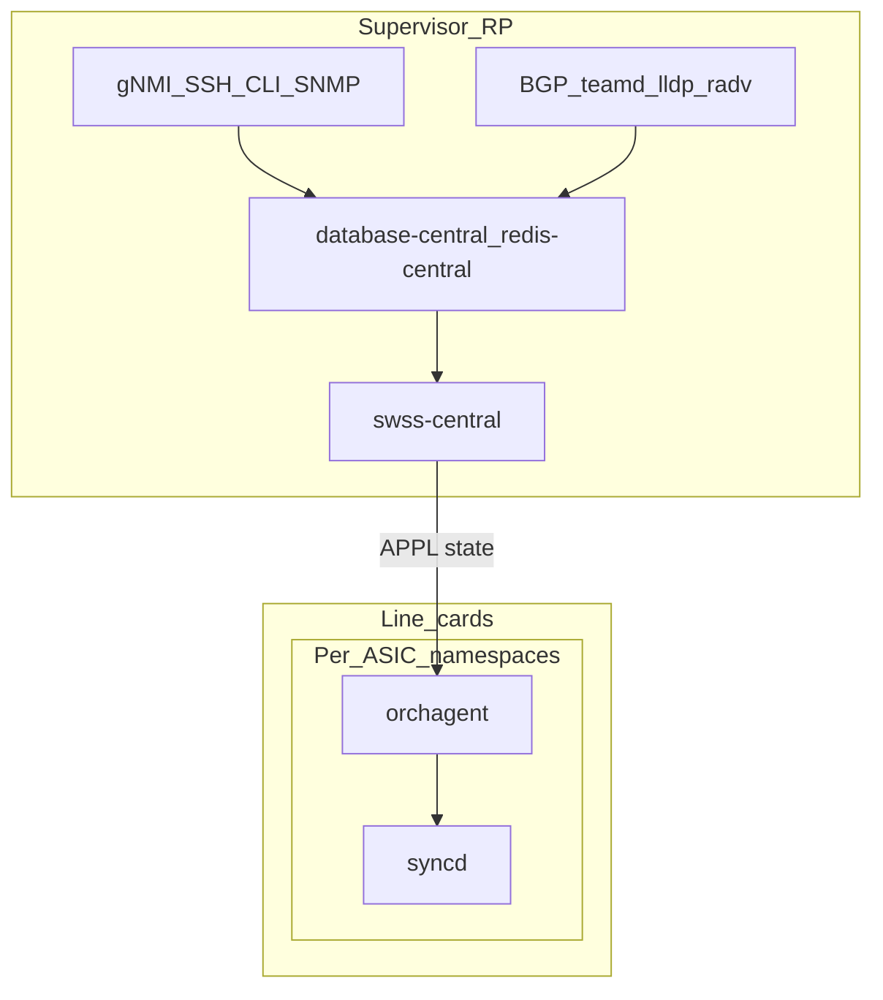
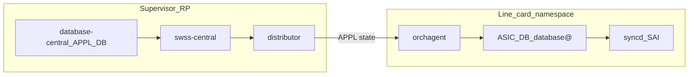
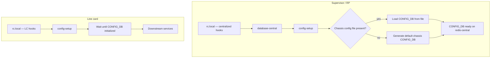
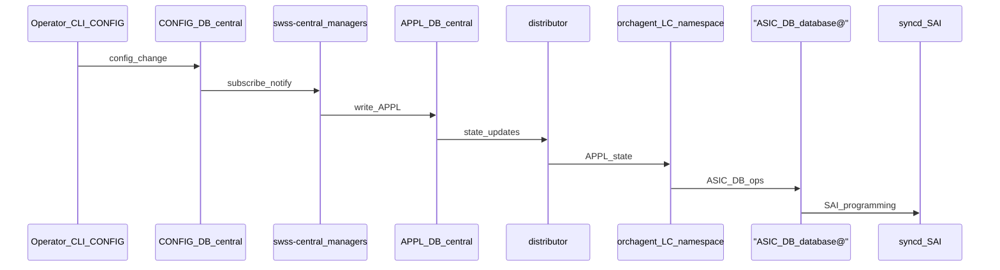

# Centralized SONiC VOQ Chassis Architecture

## High-Level Design Document

This document describes the **Centralized SONiC VOQ Chassis** architecture and summarizes **sonic-buildimage** behavior when the image is built with **`CENTRALIZED_CHASSIS=y`**. It uses the [Distributed VOQ SONiC HLD](https://github.com/sonic-net/SONiC/blob/a9b221e3252e5ef3a45d18f615c23d3794f39a5b/doc/voq/voq_hld.md) as a structural reference.

---

## Revision

| Rev | Date       | Author  | Change Description   |
|:---:|:----------:|:-------:|---------------------|
| 1.0 | 2026-03-31 | Sunesh Rustagi, Amit Grover, Jihong Li, Anand Mehra, Huan Le | Initial HLD version |
| 1.1 | 2026-06-13 | Huan Le | Update authors and fix rich text format |

---

## Table of Contents

- [About This Manual](#about-this-manual)
- [Goals and Motivation](#goals-and-motivation)
- [Scope](#scope)
- [Definitions and Abbreviations](#definitions-and-abbreviations)
- [Distributed vs Centralized VOQ Chassis](#distributed-vs-centralized-voq-chassis)
- [Reference Architecture](#reference-architecture)
- [Service Placement](#service-placement)
- [Host Data-Path Orchestration](#host-data-path-orchestration)
- [Logical Platform and Config DB](#logical-platform-and-config-db)
- [Build Flag: `CENTRALIZED_CHASSIS=y`](#build-flag-centralized_chassisy)
- [Configure Centralized Chassis `platform_asics`](#configure-centralized-chassis-platform_asics)
- [First Boot: ONIE Platform Remapping](#first-boot-onie-platform-remapping)
- [Boot Sequence: Supervisor and Line Card](#boot-sequence-supervisor-and-line-card)
- [Hierarchical Port Naming](#hierarchical-port-naming)
- [1 Requirements Overview](#1-requirements-overview)
- [2 Modules Design](#2-modules-design)
- [3 Submodule and Runtime Summary](#3-submodule-and-runtime-summary)
- [4 Flows](#4-flows)
- [5 Example Configuration](#5-example-configuration)
- [Future Consideration](#future-consideration)
- [7 References](#7-references)

---

## About This Manual

The upstream **Distributed VOQ** design assumes multiple SONiC stack instances coordinated via a **VOQ system database** and consistent VOQ-SAI programming. **Centralized SONiC VOQ Chassis** targets chassis deployments where **line-card resources are limited** and **operators want a simplified procedure**: manageability and many control-plane protocols run **only on the Route Processor (RP) / Supervisor**, while line cards focus on **data-plane** functions. A **chassis-wide** Redis instance (**database-central**) holds selected logical databases (**CONFIG_DB**, **APPL_DB**, **STATE_DB**) for cross-module access, and **swss-central** applies configuration centrally; its **distributor** pushes **APPL_DB-derived state** into each line-card **orchagent** (not a replicated **APPL_DB** view there—see [Service placement](#service-placement)).

This HLD focuses on **image build and integration in sonic-buildimage** when **`CENTRALIZED_CHASSIS=y`**. Low-level VOQ-SAI tables and host-IP connectivity options follow the [distributed VOQ HLD](https://github.com/sonic-net/SONiC/blob/a9b221e3252e5ef3a45d18f615c23d3794f39a5b/doc/voq/voq_hld.md) unless noted otherwise.

---

## Goals and Motivation

### Why Centralized Chassis

1. **Line-card resource constraints**  
   Line-card CPUs and memory are sized primarily for **data-plane** operation (packet forwarding, ASIC programming). Running full manageability stacks and redundant control-plane daemons on every line card consumes scarce resources and complicates lifecycle management. Centralized mode **offloads** those responsibilities to the **supervisor / RP** host, which has the capacity for control-plane and management workloads.

2. **Simplified operations**  
   Operators interact with **one logical place** for **SSH**, **CLI**, **SNMP**, and **gNMI**, and for protocols that benefit from a **single chassis-wide** configuration and state (**BGP**, **teamd**, **lldp**, **radv**). This reduces duplicated configuration, divergent state between cards, and troubleshooting surface compared with running full SONiC stacks independently on every module.

### Relationship to VOQ

**VOQ forwarding** (system ports, fabric, encap indices, cross-ASIC semantics) remains governed by VOQ-SAI and the distributed VOQ design where applicable. The **centralized** architecture changes **where SONiC services run** and **how selected databases are shared** across the chassis, not the fundamental VOQ forwarding model.

---

## Scope

- **In scope:** Logical platform **`centralized-chassis`**; **`CENTRALIZED_CHASSIS`** build effects; **service placement** (database-central, swss-central, supervisor-only daemons); **boot sequence** (**`rc.local`**, **`database-central`**, role-specific **`config-setup`**: supervisor generates or loads chassis **CONFIG_DB**, line card waits for **CONFIG_DB** initialization); **host data-path orchestration** (long-term vs short-term approach); **hierarchical port naming** (chassis-wide unique **PORT** names: **line-card slot**, **front-panel port**, optional **breakout** index—**no NPU field** in the name); **platform_asics** and **first-boot** platform remapping.
- **Out of scope:** Full SAI attribute tables (see distributed VOQ HLD); L2/L3 multicast; warm restart details; exhaustive peripheral management.

---

## Definitions and Abbreviations

| Term | Description |
|------|-------------|
| VOQ | Virtual Output Queue |
| RP / Supervisor | Control module hosting chassis-wide databases and supervisor-only services |
| **database-central** | **`database-central`** systemd service / container (**`centraldb`**) backed by **`/var/run/redis-central`**, intended for chassis-wide **CONFIG_DB**, **APPL_DB**, **STATE_DB** |
| **swss-central** | Docker image and service hosting central **SWSS** configuration managers and the **distributor** that **distributes APPL_DB state** to **orchagent** in each line-card namespace (not a local **APPL_DB** replica; **orchagent** then drives **ASIC_DB** in **database@** toward **syncd**/SAI) |
| Logical platform | **`centralized-chassis`**: **`DEVICE_METADATA|localhost.platform`** value and directory key under **`/usr/share/sonic/device/`** |
| Remote punt destination | **Target SAI abstraction** for steering host-bound traffic (exceptions, CPU delivery, cross-module punt) to a defined remote or logical destination in centralized chassis |
| **Hierarchical port name** | **Chassis-wide unique** logical port key (typically under **PORT**, **INTERFACE**, **SYSTEM_PORT**) that **embeds** **line-card slot** and **front-panel port** (and optionally a **breakout** sub-index). There is **no NPU index** in the interface string; NPUs are addressed by **device** / **ASIC** metadata and **namespace**, not by a field in **`Ethernet…`** |

---

## Distributed vs Centralized VOQ Chassis

| Aspect | Distributed VOQ (reference HLD) | Centralized VOQ chassis (this HLD) |
|--------|----------------------------------|-------------------------------------|
| Control plane on LC | Full or heavy SONiC stack per ASIC/LC | **Data-plane focus** on LC: **syncd**, **orchagent**, **SAI**; minimal manageability/protocol duplication |
| Databases | VOQ DB + per-instance Redis; emphasis on sync across instances | **Chassis-wide** **CONFIG_DB** / **APPL_DB** / **STATE_DB** on **database-central**; **distributor** sends **APPL state** to LC **orchagent**; per-ASIC **ASIC_DB** in **database@** toward **syncd** |
| Manageability / protocols | May run per instance | **gNMI, SSH, CLI, SNMP, BGP, teamd, lldp, radv** run **on RP / Supervisor only** (target architecture) |
| Image build | Standard VOQ/multi-ASIC | **`CENTRALIZED_CHASSIS=y`** enables central DB wiring, **swss-central**, template branches |
| Front-panel port keys | Often per-line-card or per-ASIC local naming; uniqueness scoped to instance | **Hierarchical port naming**: every front-panel (and related) port has a **chassis-wide unique** name encoding **slot**, **front-panel port**, and optionally **breakout**—**not** an NPU index in the name (see [Hierarchical port naming](#hierarchical-port-naming)) |

---

## Reference Architecture



**Narrative:** The supervisor runs **database-central** (chassis-visible **CONFIG_DB**, **APPL_DB**, **STATE_DB**), **swss-central** (managers + **distributor**), and all **manageability** and **listed control-plane protocols**. On each line card, **orchagent** and **syncd** run inside **per-ASIC network namespaces**; the **distributor** delivers **APPL_DB state** to **orchagent** directly (no local **APPL_DB** mirror). **orchagent** programs **syncd**/SAI via **ASIC_DB** on the per-namespace **database@** service.

---

## Service Placement

This section is the **architectural contract** for centralized chassis operation.

### database-central

- **Purpose:** Provide a **chassis-wide** Redis instance (**`redis-central`**, **`DATABASE_TYPE=centraldb`**) so that **CONFIG_DB**, **APPL_DB**, and **STATE_DB** (logical DB indices as defined in **database_config**) are **accessible** from supervisor and, where networked and authorized, from line-card contexts that participate in centralized mode.
- **Buildimage wiring:** [`files/build_templates/docker_image_ctl.j2`](files/build_templates/docker_image_ctl.j2) adds mounts and **`centraldb`** handling when **`build_centralized_chassis_img == "y"`**; **`files/build_templates/centralized_image/database.service.j2`** defines **database-central.service**.
- **Contrast with per-ASIC DB:** Per-namespace **database@** instances may still host **ASIC-local** state required for **syncd** / pipeline programming; the HLD distinguishes **central** (chassis-wide config and orchestration) vs **local** (ASIC-scoped) stores. Exact split is **implementation-defined** and should be documented per platform in a follow-on detailed design.

### Supervisor (RP) Only: Manageability and Networking Protocols

The following run **only on the RP / Supervisor** node in the **target** centralized architecture:

| Category | Services |
|----------|----------|
| Manageability | **gNMI**, **SSH**, **CLI** (interactive management model), **SNMP** |
| Networking / control plane | **BGP**, **teamd**, **lldp**, **radv** |

**Build integration:** [`files/build_templates/init_cfg.json.j2`](files/build_templates/init_cfg.json.j2) uses **`has_chassis_scope`**, **`CHASSIS_METADATA`**, and **`chassis_subtype: centralized`** for **FEATURE** placement; **sonic-host-services** **featured** consumes **`device_info.is_chassis_centralized()`** and slot/supervisor metadata.

### swss-central

**swss-central** combines:

1. **Configuration managers** — Central **SWSS** components that consume **CONFIG_DB** (on the central Redis), orchestrate **chassis-wide** policy, and write the authoritative **APPL_DB** on **database-central**.
2. **Distributor daemon** — Pushes **APPL_DB state** (the relevant object updates derived from central **APPL_DB**) **into each line-card orchagent** in the target namespace. It does **not** stand up a full **APPL_DB** replica or mirrored table view on the line card. **orchagent** applies those updates and, as today, emits **ASIC_DB** operations against the **per-namespace** **database@** instance; **syncd** consumes **ASIC_DB** and talks to **SAI**.



### Line-Card Role

- **Primary role:** **Data plane** — **syncd**, **orchagent**, **SAI**, forwarding pipeline.
- **Not targeted for** (in centralized mode): duplicate **BGP**, **teamd**, **lldp**, **radv**, **SNMP**, **gNMI**, or full **interactive CLI service stacks** that belong on the supervisor.
- **Limited interactive CLI** — The **SONiC CLI** on the line card **remains available** for commands that require **local** resources: for example **`ip netns`**, **local process** inspection, **namespace-scoped** debugging, and **syncd** / **orchagent** diagnostics on that module. This is **not** a second copy of the chassis-wide management CLI; it is **local-only** operator access.

---

## Host Data-Path Orchestration

Centralized chassis still requires a correct **host data path**: packets **punted** or **trapped** to software (exceptions, **CPU** delivery, protocol/control traffic) must reach the intended **Linux network namespace** and interfaces on the **supervisor** and/or **line cards**, consistent with VOQ forwarding and the [distributed VOQ HLD host IP connectivity](https://github.com/sonic-net/SONiC/blob/a9b221e3252e5ef3a45d18f615c23d3794f39a5b/doc/voq/voq_hld.md) model where applicable. In centralized mode, **orchestration** of that path (which ASIC or pipeline stage delivers to which host, and how **remote** destinations are represented) is a first-class design topic.

### Long-Term Approach (Target)

1. **SAI** — Introduce **new SAI APIs** (or attributes) to define a **remote punt destination** (or equivalent): a portable way to program **where** host-directed traffic should be delivered in a **multi-module** VOQ system, without relying on vendor-private switch-init behavior.
2. **SWSS / orchagent** — Extend **SWSS** so that **orchagent** **orchestrates** the host data-path using those SAI constructs: **APPL** state delivered to **orchagent** (from central **APPL_DB** via the **distributor**) drives creation and updates of punt/CPU delivery state **explicitly** in the orchestration layer, aligned with **PortsOrch**, **IntfsOrch**, **NeighOrch**, and related objects.

This keeps behavior **discoverable**, **testable**, and **portable** across ASIC vendors and matches the pattern of other VOQ objects (system ports, RIFs, neighbors) being owned by orchagent rather than hidden inside adapter init.

### Short-Term Approach (Current)

The **current** implementation is **Cisco-specific**: host data-path behavior for centralized chassis is **embedded in SAI switch initialization** (vendor adapter / SDK bring-up) rather than exposed through the long-term SAI APIs and **orchagent** orchestration described above. Operators and integrators should treat this as a **transition** implementation; migrating to the **long-term** model is expected to require **SAI** specification work, **syncd/SAI adapter** changes, and **swss/orchagent** features.

### Relationship to Service Placement

With **control-plane and manageability** on the **supervisor**, punt and **CPU** paths must still satisfy **reachability** between modules (e.g. traffic received on a **line-card** front-panel or **fabric** port that must be **terminated** or **processed** on the **RP**). The **long-term** design uses **SAI** + **orchagent** to make those paths **explicit**; the **short-term** design achieves a similar effect through **Cisco-specific** init until the generic APIs exist.

---

## Logical Platform and Config DB

### `platform: centralized-chassis`

All **examples in this HLD** use:

- **`DEVICE_METADATA|localhost.platform`** = **`centralized-chassis`**

This is the **logical** key for **`/usr/share/sonic/device/centralized-chassis/`** after first-boot remapping (see [First boot](#first-boot-onie-platform-remapping)). It is **not** a vendor-specific string such as `x86_64-88_si_chassis`.

### YANG and Validation

**YANG** and schema validation for centralized chassis SHOULD key off **`DEVICE_METADATA|localhost.platform`** = **`centralized-chassis`** (and related **DEVICE_METADATA** / chassis tables). A separate **`switch_model`** field is **redundant** with **`platform`** for this mode and SHOULD be **removed** or left unused in new templates—do not duplicate the same identity in two keys.

### YANG Model Summary (Centralized Chassis)

The following summarizes **additions and conditional behavior** in the **sonic-device_metadata** and **sonic-port** models used when **`switch_model`** is **`centralized-chassis`** (schema validation and **`when`** expressions still key off **`switch_model`** in the YANG tree even when **`platform`** duplicates the same logical mode in **CONFIG_DB**).

**sonic-device_metadata**

- **Identity** — **`centralized-chassis`** is added under **`switch-model`**, with base identity **`modular-chassis`**, so **`DEVICE_METADATA|localhost.switch_model`** can select centralized modular behavior alongside **`fixed-chassis`** and other chassis modes.
- **Groupings** — **`device_metadata_slot_params`** defines per–line-card fields (**`slot_id`**, **`buffer_model`**, **`product_id`**). **`device_metadata_asic_params`** defines per-ASIC fields, including **`slot_id`** (leafref into the slot list), **`asic_name`**, **`asic_id`** (string used as the SAI-facing ASIC identifier), **`switch_type`** (values such as **`voq`**, **`fabric`**, **`npu`**), **`mac`**, **`max_cores`**, and related vendor or buffer knobs.
- **New containers (conditional on `switch_model`)** — **`DEVICE_METADATA_SLOT`** and **`DEVICE_METADATA_ASIC`** are instantiated only when **`localhost.switch_model`** derives from **`centralized-chassis`**:
  - **`DEVICE_METADATA_SLOT_LIST`** — list keyed by **`slot_id`**; each entry uses **`device_metadata_slot_params`**.
  - **`DEVICE_METADATA_ASIC_LIST`** — list keyed by **`slot_id`** + **`asic_name`**; each entry uses **`device_metadata_asic_params`** (so each ASIC row binds **`asic_id`** to a slot and name).
- **Interaction with existing `localhost` leaves** — numerous existing **`localhost`** leaves are gated with **`when`** such that they apply **only when `switch_model` is *not* `centralized-chassis`**, so slot/ASIC-centric data is carried in **`DEVICE_METADATA_SLOT`** / **`DEVICE_METADATA_ASIC`** instead for this mode.

**sonic-port**

- **`PORT` / `PORT_LIST`** — two optional leaves are added for hierarchical chassis binding; both are active only when **`switch_model`** is **`centralized-chassis`**:
  - **`slot_id`** — **leafref** to **`DEVICE_METADATA_SLOT_LIST`** **`slot_id`** (line-card slot for the port).
  - **`asic_id`** — **leafref** to **`DEVICE_METADATA_ASIC_LIST`** **`asic_id`** (logical **NPU** / ASIC for the port; **not** encoded in the **`Ethernet…`** interface name—see [Port name format](#port-name-format-lc_slot-fp_port-optional-breakout)).

### `platform_env.conf`

**`CENTRALIZED_CHASSIS=1`** in **`platform_env.conf`** drives **`device_info.is_chassis_centralized()`**, used by container scripts and utilities. This is **separate** from Config DB **`platform`**.

### Modular Metadata

When **`DEVICE_METADATA|localhost.platform`** is **`centralized-chassis`**, **VOQ-related fields** may be read from **DEVICE_METADATA_SLOT** / **DEVICE_METADATA_ASIC** (see **`src/sonic-py-common/sonic_py_common/device_info.py`**).

---

## Build Flag: `CENTRALIZED_CHASSIS=y`

| Area | Touchpoints |
|------|-------------|
| Make / compile | `rules/config`, `slave.mk` — **`DEB_BUILD_ENV_GENERIC`**, **`-DCENTRALIZED_CHASSIS`**, **`build_centralized_chassis_img`**, **`*-central.service`** from **`files/build_templates/centralized_image/`** |
| Images | `rules/docker-swss-central.mk` — **docker-swss-central** on install image |
| Init / FEATURE | `files/build_templates/init_cfg.json.j2` |
| Containers | `files/build_templates/docker_image_ctl.j2` — **redis-central**, **centraldb**, **INCLUDE_CENTRAL_DB**, **ZMQ_IPC_ENABLED**, slot metadata keys |
| Rootfs | `files/build_templates/sonic_debian_extension.j2` — SSH keys, kdump, **platform-setup-si-chassis** |
| DB default TCP | `src/sonic-swss-common/common/dbconnector.h` — **`DB_CONNECTOR_DEFAULT_TCP_CONN`** when **`CENTRALIZED_CHASSIS`** defined |

---

## Configure Centralized Chassis `platform_asics`

When **`make configure`** is run with **`CENTRALIZED_CHASSIS=y`**, the build inserts the current **`$PLATFORM`** value into **`device/centralized-chassis/platform_asics`**. That file ties the **hardware / ONIE platform** string selected at configure time to the **`centralized-chassis`** device tree under the repo’s **`device/`** layout, so **config-engine**, **sonic-cfggen**, and **first-boot** logic can resolve the active logical platform consistently.

---

## First Boot: ONIE Platform Remapping

On **first boot** (`rc.local` or dedicated one-shot):

1. If the **ONIE-reported platform** (from **`machine.conf`**: **`onie_platform`** or **`aboot_platform`**) **supports** a **centralized-chassis** deployment, set the active **`platform`** to **`centralized-chassis`**. **`rc.local`** passes the resolved **`$platform`** into **`/usr/bin/platform-setup-si-chassis`**; that wrapper runs a **per-platform** script only if it exists, which is how a SKU **opts in** to SI / centralized-chassis behavior. The excerpt below (from **`files/image_config/platform/rc.local`**, first-boot path) shows how the **hardware** platform string from ONIE is resolved and passed into that hook:

```sh
    if [ -n "$aboot_platform" ]; then
        platform=$aboot_platform
    elif [ -n "$onie_platform" ]; then
        platform=$onie_platform
    else
        echo "Unknown SONiC platform"
        firsttime_exit
    fi

    SI_SETUP_SCRIPT=/usr/bin/platform-setup-si-chassis
    if [ -n "$onie_base_platform" ]; then
        platform=$onie_base_platform
    fi
    [ -x $SI_SETUP_SCRIPT ] && $SI_SETUP_SCRIPT $platform && . /host/machine.conf
    if [ -n "$onie_base_platform" ]; then
        platform=$onie_base_platform
    fi
```

The installed **`/usr/bin/platform-setup-si-chassis`** (from **`files/image_config/platform/platform-setup-si-chassis`**) uses **`$platform`** to select the vendor hook; **centralized-chassis** support is determined by whether **`/usr/share/sonic/device/$platform/platform-setup-si-chassis.sh`** exists and is executable:

```sh
#!/bin/bash

platform=$1

PLATFORM_SETUP_FILE=/usr/share/sonic/device/$platform/platform-setup-si-chassis.sh

[ -x $PLATFORM_SETUP_FILE ] && $PLATFORM_SETUP_FILE
```

2. Persist the **original** ONIE **`onie_platform`** value under the key **`onie_base_platform`** in **`/host/machine.conf`** (before any rewrite of **`onie_platform`** to the logical chassis platform), so the **hardware** identity remains available for packages and diagnostics.

3. **Copy** **`/usr/share/sonic/device/<original>/`** to **`/usr/share/sonic/device/centralized-chassis/`** verbatim (idempotent).

See also [Boot sequence: Supervisor and line card](#boot-sequence-supervisor-and-line-card) for **centralized** extensions to **`rc.local`**, startup of **`database-central`**, and **`config-setup.service`** behavior on the supervisor vs line cards.

---

## Boot Sequence: Supervisor and Line Card

In **centralized chassis** mode, early boot is **role-dependent** (supervisor / RP vs line card). The **target** design introduces three coordinated changes: **`rc.local`** runs **centralized-aware** hooks; the **supervisor** starts **`database-central`** so chassis-wide **CONFIG_DB** lives on **`redis-central`**; **`config-setup.service`** **branches** so the supervisor **authors** the chassis **CONFIG_DB** while each line card **waits** until that **CONFIG_DB** is initialized and usable.

### rc.local (Both Roles)

- **Extensions** beyond stock SONiC: perform [first-boot platform remapping](#first-boot-onie-platform-remapping) when applicable; export or persist **chassis role** (supervisor vs line card) and **slot** metadata for **`device_info`** and systemd; on the **supervisor**, preserve ordering so **`database-central`** can start and accept connections **before** **`config-setup`** writes **CONFIG_DB** on the central instance.
- **Line cards** do **not** start **`database-central`** locally; they obtain **CONFIG_DB** from the **supervisor** (e.g. TCP to **`redis-central`**, or an equivalent **platform-defined** path). Exact connector settings follow **`CENTRALIZED_CHASSIS`** / **sonic-swss-common** wiring.

### Supervisor / RP

1. **`database-central.service`** starts (**`centraldb`**, **`/var/run/redis-central`**) and exposes **CONFIG_DB** (and **APPL_DB** / **STATE_DB** on that instance per [Service placement](#service-placement)).
2. **`config-setup.service`** runs in **supervisor** mode:
   - If a **chassis configuration file** is present (operator golden config or persisted **`config_db.json`** / platform-defined path), **load** it into **CONFIG_DB** on **database-central**.
   - Otherwise **generate** the **default chassis-wide** configuration (device templates, **sonic-cfggen**, **`init_cfg.json`** merge) so the **entire chassis** is represented in a **single** **CONFIG_DB** namespace on the supervisor.
3. Units that **`Requires=config-setup.service`** (**swss-central**, manageability, protocols, etc.) start **after** **CONFIG_DB** initialization completes successfully.

### Line Card

1. **`config-setup.service`** runs in **line-card** mode: it **does not** generate or load the full chassis **CONFIG_DB** on the local host.
2. It **waits** until **CONFIG_DB** is **initialized** — the central **CONFIG_DB** is **reachable** and **ready** for this card (supervisor **config-setup** has populated required keys, schema/migration completed, or a **health** check against **redis-central** succeeds). The wait may use **polling**, **systemd** dependencies on a **remote-db-ready** helper, or equivalent.
3. When the wait completes, **config-setup** exits successfully and **syncd**, **orchagent**, and other services that **`Requires=config-setup.service`** may proceed.



**Narrative:** The **supervisor** path **creates** the authoritative **CONFIG_DB** (file load or default generation). The **line-card** path **consumes** that database and **blocks** in **config-setup** until it is **initialized**.

---

## Hierarchical Port Naming

Centralized chassis operation introduces a single **logical control plane** and **chassis-wide** configuration surface (**CONFIG_DB** on **database-central**, templates under **`platform: centralized-chassis`**). A **required** consequence is that **every user-visible and config-addressable port** in the chassis must have a **stable, chassis-wide unique** identifier. Without that, keys in **PORT**, **INTERFACE**, **LAG**, **ACL**, telemetry, and **VOQ** **SYSTEM_PORT** tables would collide when the same **local** naming convention is reused on multiple line cards or NPUs.

### Goals

1. **Uniqueness** — No two physical or logical front-panel ports anywhere in the chassis share the same **PORT** (or equivalent) key in **Config DB** / **APPL_DB** as seen by **swss-central** and **distributed** to line-card **orchagent** state.
2. **Location encoding** — The port name **encodes** **line-card slot** and **front-panel port** (and **breakout** when the front-panel port is split). Operators and tools can parse **which slot and front-panel position** a port refers to from the name. **NPU** / **ASIC** placement is **not** carried in the **`Ethernet…`** string.
3. **Same mapping, different ports** — Two ports in **different** slots may use the **identical** SerDes **lane** mapping or **asic_port_name** locally; they remain **distinct** configuration objects because the **hierarchical** name differs. Uniqueness is **not** derived from lane strings alone.

### Relationship to VOQ and SYSTEM_PORT

The [distributed VOQ HLD](https://github.com/sonic-net/SONiC/blob/a9b221e3252e5ef3a45d18f615c23d3794f39a5b/doc/voq/voq_hld.md) requires **system port** names that are unique across the chassis for **SYSTEM_PORT** and remote **RIF** / **neighbor** programming. **Hierarchical port naming** aligns the **PORT** (and derived interface) keys with that model: the same string can flow into **SYSTEM_PORT** keys and **APPL_DB** tables consistently from **config** through **orchagent** on each NPU.

### Port Name Format (lc_slot, fp_port, Optional Breakout)

**Product naming** (centralized chassis) follows the structure below. There is **no NPU index** in the interface name; NPU / ASIC binding is expressed elsewhere (for example **`asic_id`** in **PORT** metadata, **namespace**, **DEVICE_METADATA_ASIC**).

| Form | Pattern | Meaning |
|------|---------|--------|
| **Without breakout** | `Ethernet<lc_slot>_<fp_port>` | Chassis-wide unique **front-panel** port name. |
| **With breakout** | `Ethernet<lc_slot>_<fp_port>_<breakout>` | Chassis-wide unique **logical** port after breakout. |

**Field widths (decimal digits, no leading-zero padding required beyond what the grammar allows):**

- **`lc_slot`** — **one or two** digits, values **1–16** (line-card slot).
- **`fp_port`** — **one or two** digits, **front-panel port** index on that line card (**at most two digits** for this field—do not encode a three-digit value in this position).
- **`breakout`** — **one** digit, present **only** when the front-panel port is broken out into multiple logical ports (**0–9**).

Examples: **`Ethernet1_1`**, **`Ethernet16_12`** (no breakout); **`Ethernet1_1_0`**, **`Ethernet2_3_1`** (with breakout).

**Code (`portconfig.py`):** Hierarchical names are matched by **`HIERARCHICAL_INTF_NAME_PATTERN`**:

```text
(Ethernet([1-9]\d*)_([1-9]\d*))(?:_([1-9]\d*))?
```

and **`is_hierarchical_interface_name()`** ([`src/sonic-config-engine/portconfig.py`](src/sonic-config-engine/portconfig.py)) is used by **`sonic-utilities`** (for example [`src/sonic-utilities/config/main.py`](src/sonic-utilities/config/main.py) imports **`portconfig`**). The regex uses **`[1-9]\d*`** per underscore-separated segment (so a **standalone `0`** is not matched as a segment; multi-digit values such as **`10`** are used where needed). The pattern is **permissive** (it does not cap segment length); **centralized-chassis** **PORT** keys **must** follow the **product** field widths above so names stay **unique**, **parseable**, and consistent with **HWSKU** / **YANG**.

Device **HWSKU** / **platform** JSON and **YANG** must stay consistent with this grammar where **`is_hierarchical_interface_name`** applies.

### Orchestration and Config Managers

**swss-central** and per-**NPU** **orchagent** consume **PORT** entries keyed by these hierarchical names. The **distributor** forwards **APPL** state for the relevant objects so each **line-card** **orchagent** programs only ports **local** to its ASICs, while **supervisor**-scoped tools and **CONFIG_DB** refer to ports by the **single** chassis-wide name.

---

## 1 Requirements Overview

### 1.1 Functional Requirements

1. Support **VOQ** chassis forwarding with **centralized** service placement.
2. Run **manageability** (**gNMI**, **SSH**, **CLI**, **SNMP**) **only on supervisor**.
3. Run **BGP**, **teamd**, **lldp**, **radv** **only on supervisor** (target).
4. Provide **database-central** with **CONFIG_DB**, **APPL_DB**, **STATE_DB** chassis-wide (logical).
5. Provide **swss-central** with **configuration managers** and a **distributor** that sends **APPL state** to **line-card orchagents** (not a local **APPL_DB** replica); **orchagent** drives **ASIC_DB** on **database@** toward **syncd**/SAI.
6. Keep **line cards** focused on **syncd**, **orchagent**, and **data-plane** path.
7. **Host data-path orchestration** SHALL converge on **SAI remote punt** (or equivalent) plus **orchagent**-driven programming; interim **vendor-specific SAI switch init** is acceptable only as a **short-term** measure (see [Host data-path orchestration](#host-data-path-orchestration)).
8. **Hierarchical port naming** — Every chassis front-panel (and equivalently addressed) port SHALL use a **chassis-wide unique** name that **encodes line-card slot and front-panel port** (and **breakout** when used), **without** an **NPU** field in the name, including cases where **lane** or **asic_port_name** patterns repeat across slots (see [Hierarchical port naming](#hierarchical-port-naming)).
9. **Boot / CONFIG_DB** — On the **supervisor**, **config-setup** SHALL populate **CONFIG_DB** on **database-central** (default generation or load from file). On each **line card**, **config-setup** SHALL **wait** until **CONFIG_DB** is **initialized** before succeeding (see [Boot sequence: Supervisor and line card](#boot-sequence-supervisor-and-line-card)).

### 1.2 Platform Requirements

1. **`SLOT_ID`** — Set **`SLOT_ID`** in the platform-specific **`platform_env.conf`** file (line-card vs supervisor placement is defined by the product platform).

**VOQ-capable NPUs:** Line-card **NPUs** (ASICs) **must** support **VOQ forwarding** as required by the [distributed VOQ HLD](https://github.com/sonic-net/SONiC/blob/a9b221e3252e5ef3a45d18f615c23d3794f39a5b/doc/voq/voq_hld.md)—including **SAI** / **syncd** and pipeline behavior for virtual output queues and chassis-wide system ports. Centralized control-plane placement does **not** replace or relax this **data-plane** requirement.

### 1.3 Configuration Requirements

**`DEVICE_METADATA|localhost.platform`** = **`centralized-chassis`** (post remap). **PORT** (and dependent **INTERFACE**, LAG member, ACL bind-point) keys use **hierarchical** chassis-wide names, not per-card-local aliases that could collide.

**YANG:** Slot, ASIC, and **PORT** binding for centralized chassis—including **`DEVICE_METADATA_SLOT`**, **`DEVICE_METADATA_ASIC`**, and **`PORT`** **`slot_id`** / **`asic_id`**—are specified in the models summarized under [YANG model summary (centralized chassis)](#yang-model-summary-centralized-chassis).

### 1.4 Orchestration Requirements

**database-central** before **swss-central**; **distributor** distributes **APPL** state to **orchagent** in each line-card namespace; **orchagent** writes **ASIC_DB** on **database@** for **syncd**/SAI (no **APPL_DB** mirror on the line card).

Each line-card **orchagent** is provisioned with its **`slot_id`** and **`npu_id`** (aligned with **`PORT`** **`asic_id`** / **DEVICE_METADATA_ASIC** for that NPU). It **filters** inbound distributor updates and applies only entries that match its **`slot_id`** and **`npu_id`** where those keys exist—for **PORT** and related tables in particular—so each namespace programs only its own ASIC-facing objects.

### 1.5 CLI, Scalability, Warm Restart

CLI on supervisor; scaling follows VOQ targets where applicable; warm restart **TBD**.

---

## 2 Modules Design

This chassis HLD defines how the **centralized VOQ** building blocks fit together. The **high-level design of each module** (for example **database-central**, **swss-central** / **distributor**, **ZMQ** fan-out, **pmon**, and other daemons named below) **will be documented in separate module HLDs**; those documents should be read together with this specification for implementation detail.

### 2.1 Split Database Model

Centralized chassis uses a **split database model**: chassis-wide **control-plane** configuration and **APPL** orchestration live on **database-central** (**`redis-central`**), while **ASIC-facing** and **counter** plane state remain on **per-ASIC** **database@** Redis instances (one **network namespace** per line-card / NPU stack).

- **Chassis-side databases (database-central / database-chassis):** The logical databases used for **chassis-wide** control—**CONFIG_DB**, **APPL_DB**, **STATE_DB** on the central Redis—**remain unchanged** in purpose: they are the **authoritative** surfaces for **swss-central**, operator **config**, and cross-module orchestration. Where the image also runs **database-chassis** (parallel chassis DB service), its **DB responsibilities** for chassis scope **remain unchanged** relative to the centralized design; exact **service** split (**database-central.service** vs **database-chassis.service**) is **platform-defined** (see **`files/build_templates/centralized_image/`**).
- **Per-namespace database@:** **ASIC_DB**, **COUNTERS_DB**, and other **ASIC-local** logical DBs defined for **syncd** / **pipeline** / **telemetry** **remain** on the **per-namespace** **database@** service. **orchagent** ↔ **syncd** traffic uses **ASIC_DB** locally; **COUNTERS_DB** and related statistics **do not** migrate to **database-central**.

#### database-central module

- **Service:** **database-central** (**`database.sh start centraldb`**).
- **Redis:** **`/var/run/redis-central`**.
- **Logical DBs:** **CONFIG_DB**, **APPL_DB**, **STATE_DB** on central instance (target).

### 2.2 swss-central Module

- **Package:** **docker-swss-central** ([`dockers/docker-swss-central/`](dockers/docker-swss-central/)).
- **Service:** **swss-central.service** from **`files/build_templates/centralized_image/swss.service.j2`**.
- **Responsibilities:** Central **SWSS** managers; **distributor** pushes **APPL state** to LC **orchagent** (see [Service placement](#service-placement)).

### 2.3 Hybrid ZMQ+Redis State Distribution

**Authoritative APPL_DB** tables live on **database-central** (**Redis** on **`redis-central`**). A **hybrid** path distributes that state to **per-namespace** **orchagent** instances on line cards:

- **Redis** — Central **APPL_DB** remains the **source of truth** for objects **swss-central** publishes; line cards **do not** host a full **APPL_DB** replica (see [Split Database Model](#21-split-database-model)).
- **ZMQ** — Where **ZMQ** / IPC is enabled in the image (**e.g.** **`ZMQ_IPC_ENABLED`** in **docker** wiring), the **distributor** (or equivalent **SWSS** fan-out) delivers **APPL** updates over **ZMQ** (or a **ZMQ**-backed channel) to each target **orchagent**, scoped to the **namespace** / **NPU** that owns the port or object.

Together, **Redis** (central persistence and orchestration) and **ZMQ** (low-latency, directed updates) implement **state distribution** from central **APPL_DB** to **line-card orchagents** without requiring those agents to subscribe to the central Redis **APPL_DB** directly.

### 2.4 VOQ DB and Distributed HLD

Cross-ASIC **VOQ DB** semantics from the [distributed VOQ HLD](https://github.com/sonic-net/SONiC/blob/a9b221e3252e5ef3a45d18f615c23d3794f39a5b/doc/voq/voq_hld.md) apply where the implementation still uses a **VOQ system database**; centralized mode **adds** central **CONFIG/APPL/STATE** placement and **does not** remove VOQ forwarding requirements unless explicitly redesigned in a separate spec.

### 2.5 Config DB and FEATURE

**init_cfg.json.j2** expresses **chassis_subtype** **`centralized`** and **has_chassis_scope** for features that must run on supervisor only in centralized mode.

**Boot-time CONFIG_DB:** Supervisor **config-setup** authors **CONFIG_DB** on **database-central**; line-card **config-setup** waits for central **CONFIG_DB** readiness. See [Boot sequence: Supervisor and line card](#boot-sequence-supervisor-and-line-card).

### 2.6 Manageability

Centralized mode touches **operator-facing** surfaces beyond **swss-central**:

- **YANG / models** — **Device** and **port** models use **`DEVICE_METADATA|localhost.platform`** = **`centralized-chassis`**; **hierarchical** **PORT** keys and chassis **slot** / **ASIC** metadata flow through **sonic-device_metadata**, **sonic-port**, and related trees. **Validation** and **`when`/`must`** rules must account for **supervisor**-authoritative **CONFIG_DB** vs **line-card** **ASIC_DB** split (see [Split Database Model](#21-split-database-model)). **Telemetry**-oriented models (gNMI paths, streaming keys) align with **chassis-wide** names and **per-ASIC** **COUNTERS_DB** placement.
- **sonic-config utilities** — **config** CLI / **sonic-cfggen** / apply paths on the **supervisor** target **database-central** **CONFIG_DB**; utilities used **on line cards** must support **read-only** or **local** operations (namespace, **show** commands backed by **STATE_DB** / **ASIC_DB** where applicable) without assuming a full local **CONFIG_DB** author. Exact command allow-lists are **product-defined**.
- **Telemetry** — Chassis-wide streaming (e.g. **gNMI**, **EVENTD**) runs on the **supervisor**; **per-ASIC** **COUNTERS_DB** and pipeline stats **remain** on **database@** and may be **aggregated** or **proxied** for northbound views. **SNMP** / **streaming** subscriptions should use **hierarchical** port identities consistently with **CONFIG_DB**.

### 2.7 Hierarchical Port Naming

**PORT** table and related **Config DB** / **APPL_DB** entries use **hierarchical** names as specified in [Hierarchical port naming](#hierarchical-port-naming). Device generation (**sonic-cfggen** / platform JSON), **YANG** (**sonic-port** and related models), and **swss-central** / **orchagent** must treat these keys as the **canonical** chassis-wide port identity.

### 2.8 Chassis Management

**Chassis Management** is realized in the SONiC **pmon** (**platform monitor**) service and related **platform** daemons. It tracks **line-card slot** presence and **state**, and enforces **module compatibility**. Incompatible or mismatched hardware inserts are rejected. Compatible hardware with mismatched software version triggers a software upgrade on the newly inserted module before it is allowed to join the chassis.

### 2.9 Host Data-Path Orchestration

See [Host data-path orchestration](#host-data-path-orchestration). **Orchagent** on line cards remains the long-term owner of **SAI** programming for punt/CPU delivery (via **ASIC_DB**), fed by **APPL** state from the **distributor**, once **remote punt destination** SAI support and **SWSS** extensions land; until then, behavior may be **partially** realized inside **Cisco-specific SAI switch initialization**.

---

## 3 Submodule and Runtime Summary

| Area | Role |
|------|------|
| **sonic-swss-common** | **TCP-oriented** DB connector default when **`CENTRALIZED_CHASSIS`** compiled in |
| **sonic-py-common** | **`is_chassis_centralized()`**, modular metadata |
| **sonic-utilities** | Namespace / CLI / installer behavior |
| **sonic-host-services** | **featured** placement |
| **docker-swss-central** | Central SWSS + distributor (product integration) |

---

## 4 Flows

### 4.1 Configuration Apply (Target)



### 4.2 Image Build

See prior revision: **make** → **J2** → **rootfs** with **`build_centralized_chassis_img`**.

### 4.3 Boot Sequence (Supervisor vs Line Card)

See [Boot sequence: Supervisor and line card](#boot-sequence-supervisor-and-line-card): **`rc.local`** hooks, **`database-central`**, and **`config-setup.service`** (supervisor: generate default chassis **CONFIG_DB** or load from file; line card: wait until **CONFIG_DB** initialized).

---

## 5 Example Configuration

**Hierarchical PORT keys** (illustrative; **slot** and **fp_port** use **one or two** digits per [Port name format](#port-name-format-lc_slot-fp_port-optional-breakout); **`asic_id`** is device metadata, **not** part of the **`Ethernet…`** name):

```json
{
  "PORT": {
    "Ethernet1_1": {
      "alias": "xe1/1",
      "lanes": "8,9,10,11,12,13,14,15",
      "slot_id": "1",
      "asic_id": "0"
    },
    "Ethernet2_1": {
      "alias": "xe2/1",
      "lanes": "8,9,10,11,12,13,14,15",
      "slot_id": "2",
      "asic_id": "0"
    },
    "Ethernet1_1_1": {
      "alias": "xe1/1/1",
      "lanes": "8",
      "slot_id": "1",
      "asic_id": "0"
    }
  }
}
```

The first two ports may use the **same** **lanes** string on **different** slots; their **PORT** keys differ by **`lc_slot`** only. The third entry shows **breakout**: same slot and **fp_port** as **`Ethernet1_1`**, with **`_1`** as the **breakout** digit (not an NPU index).

```json
{
  "DEVICE_METADATA": {
    "localhost": {
      "hostname": "voq-chassis-01",
      "platform": "centralized-chassis",
      "hwsku": "Vendor-Chassis-SKU",
      "switch_type": "voq",
      "subtype": "Centralized"
    }
  }
}
```

---

## Future Consideration

**Host data-path orchestration:** The **long-term** (**SAI** remote punt + **orchagent**) path is **not** assumed to be fully available in any given tree. The **short-term** **Cisco-specific** embedding in **SAI switch initialization** may be present instead; confirm with the platform **SAI** / **syncd** implementation for the SKU in use.

---

## 7 References

Upstream SONiC materials use the public **`sonic-net`** organization on GitHub. This HLD does **not** reference private or enterprise Git mirrors. **Build integration, file paths, and source modules** are intentionally omitted here; use the public repositories below for code and image build details.

1. [Distributed VOQ HLD — voq_hld.md](https://github.com/sonic-net/SONiC/blob/a9b221e3252e5ef3a45d18f615c23d3794f39a5b/doc/voq/voq_hld.md)
2. [SONiC](https://github.com/sonic-net/SONiC) — project documentation and repository index.
3. [sonic-buildimage](https://github.com/sonic-net/sonic-buildimage) — SONiC image build and integration (Make, templates, dockers).

---

*End of document.*
