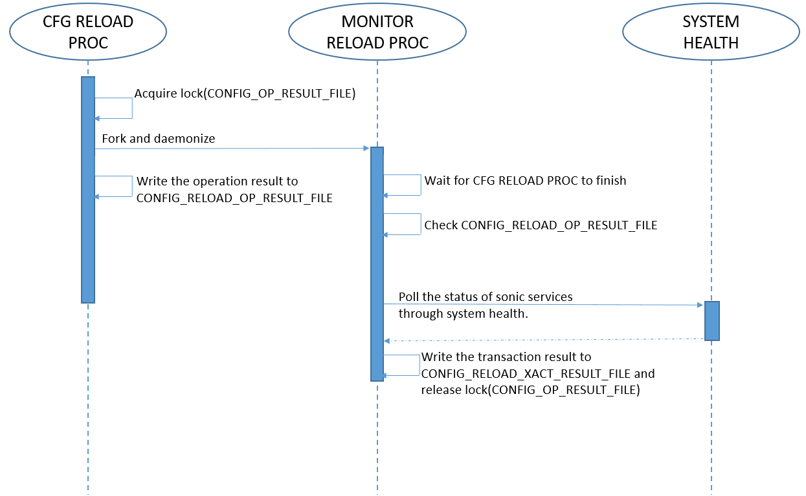
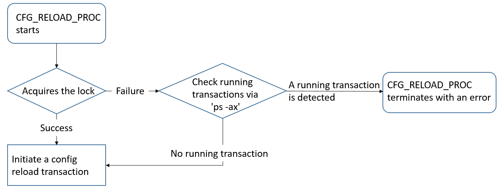

# Config Reload Enhancement - Introduce the Transaction Mechanism
# High Level Design Document
## Rev 0.1

## Table of Content
- [Table of Content](#table-of-content)
- [Revision](#revision)
- [Scope](#scope)
- [Definitions/Abbreviations](#definitions-abbreviations)
- [Overview](#overview)
- [Requirements](#requirements)
- [Architecture Design](#architecture-design)
- [High-Level Design](#high-level-design)
  * [The Temporarily Files Generated by This Enhancement](#the-temporarily-files-generated-by-this-enhancement)
  * [New Error Messages by This Enhancement](#new-error-messages-by-this-enhancement)
  * [CLI/YANG model Enhancements](#cli-yang-model-enhancements)
  * [Config DB Enhancements](#config-db-enhancements)
- [Warmboot and Fastboot Design Impact](#warmboot-and-fastboot-design-impact)
- [Restrictions/Limitations](#restrictions-limitations)
- [Testing Requirements/Design](#testing-requirements-design)
  * [Unit Test Cases](#unit-test-cases)
  * [System Test Cases](#system-test-cases)
- [Open/Action Items](#open-action-items)

### Revision
| Rev |     Date    |       Author       | Change Description                |
|:---:|:-----------:|:------------------:|-----------------------------------|
| 0.1 | 2022/3/18   |     Charlie Chen   | Initial version                   |

### Scope

This document describes the enhancement based on the existing design of the
Sonic CLI command 'config reload'. The enhancement introduces the transaction
mechanism to guarantee that only one 'config reload' session runs in the system
at the same time. The design regarding the determination of a transaction done
is included. The design related to how to do 'config reload' is out of the scope.

### Definitions/Abbreviations

| Definition                    | Description                                                                                                          |
|-------------------------------|----------------------------------------------------------------------------------------------------------------------|
| Config Reload Process         | A process which is resposnible to execute the config reload operation. Abbreviated to 'CFG RELOAD PROC'.             |
| Config Reload Monitor Process | A daemon process which will be forked at the start of a config reload session. Abbreviated to 'MONITOR RELOAD PROC'. |

### Overview

The current design of the CLI command 'config reload' is like a simple oneshot command. It does not have any mechanism to prevent from the situations that a 'config reload' session is issuing from the different login session when there is already an unfinished 'config reload' session on the same device. It takes more time to let a device reach an operational state to start another 'config reload' when the previous one has not finished yet. Besides, the successful return of the CLI command on the current design only implies that the operations which are required to initiate the reloading of the configurations are executed without error. This enhancement will fork a new process together with the execution of 'config reload' to monitor the progress of the operation including the state of the critical sonic fundamental services and records down the operation result at the end of the transaction.

In addition to a use case that prevents multiple users from executing 'config reload' on the same device when a processing 'config reload' is not finished yet. Another use case that this enhancement might help is on the executions of sonic-mgmt test cases. It is known that some pytest code will execute 'config reload' when abnormal states are detected. There is a chance that the 'config reload' has been issued at the end of a test case and the abnormal states are detected again at the start of the next test case so that another 'config reload' issues again when the previous one is still in progress. The execution of the second 'config reload' just wastes time to recover the device. With this enhancement, it is able to realize that a 'config reload' is already running and the pytest code could wait for the finish of the running 'config reload' session and check the sanity status of the device after the session is done.

### Requirements

This enhancement requires the mechanism to know whether the device has reached an operational state to decide the finish of a config reload transaction.
The system health feature provides the functionality to monitor the status of the sonic related services and the sonic critical processes. This enhancement will leverage the functionality to decide the current operational state. Refer to [SONiC System Health Monitor High Level Design](https://github.com/Azure/SONiC/blob/master/doc/system_health_monitoring/system-health-HLD.md) for the details of the system health feature.

### Architecture Design 

There is no change in the SONiC architecture and no new module/submodule is added.

### High-Level Design 

This enhancement is based on the existing 'config reload' Sonic CLI command located in 'sonic-utilities'. The modifications of this enhancement are in the file where the code for 'config reload' lies in.

For the brevity of the explanation, two process names are defined here and will be used in the following paragraphs. The first process name 'CFG_RELOAD_PROC' is used to represent the process that runs the 'config reload' command. The second process name 'MONITOR_RELOAD_PROC' is used to represent the config reload monitor process, which is forked by 'CFG_RELOAD_PROC' and is daemonized to monitor the transitions of the overall config reload transaction.

A high level sequential diagram is shown below.


In order to guarantee only one 'config reload' session is allowed to be run in the system, it is required to acquire a transaction lock before the operation starts. When the command 'config reload' is executed, it acquires the lock. If the lock is acquired successfully, it continues the operation. If the lock cannot be acquired, it checks the running transaction by the existence of 'CFG_RELOAD_PROC' and 'MONITOR_RELOAD_PROC' through the output of 'ps -ax'. It continues the operation when no running transaction is found, and it is not necessary to do the lock operation in this condition because the lock is already in locked state. If any running transaction is detected, it aborts the operation and outputs the error message immediately. The flow chart shown below illustrates the flow to start a config reload transaction.


The detection of running transaction enables the resilience. Assume that the transaction lock is not released correctly by 'MONITOR_RELOAD_PROC' due to an unexpected error upon the previous 'config reload', the error condition can be resolved automatically by the detection.

Before the start of the 'config reload' operation, 'MONITOR_RELOAD_PROC' is forked and daemonized. The pid of 'CFG_RELOAD_PROC' is passed to 'MONITOR_RELOAD_PROC' at fork. Then 'CFG_RELOAD_PROC' continues to run the 'config reload' operation as is. At the end of 'CFG_RELOAD_PROC', it writes the result of the 'config reload' operation to a file named "CONFIG_RELOAD_OP_RESULT_FILE".

'MONITOR_RELOAD_PROC' keeps monitoring the running status of 'CFG_RELOAD_PROC' by the passed pid. When the pid is gone, it checks the content of "CONFIG_RELOAD_OP_RESULT_FILE". If the content of "CONFIG_RELOAD_OP_RESULT_FILE" shows there is an error, 'MONITOR_RELOAD_PROC' writes the transaction result as a failure to "CONFIG_RELOAD_XACT_RESULT_FILE" and is terminated immediately. If the content shows it is OK, 'MONITOR_RELOAD_PROC' continues to monitor the status of the sonic related services and the sonic critical processes through the output of 'show system-health detail' to determine the transaction result. The details about the way to determine the transaction result is explained below.

'MONITOR_RELOAD_PROC' invokes 'show system-health detail' periodically to know the transitions of the sonic related services and the sonic critical processes. The criterion to determine the success of the transaction is the status must be 'OK' on all of the 'Program' type entries in the output of 'show system-health detail'. A timeout mechanism is designed to avoid the infinite lock on the config reload transaction. A special note on the timeout mechanism is it will not be activated until 'CFG_RELOAD_PROC' is terminated. The rationale behind this is 'CFG_RELOAD_PROC' is usually launched by end users. Users are able to realize something wrong when the execution of 'config reload' cannot be terminated in a certain period of time at the first scene. Users may decide to interrupt the execution of 'config reload' if they think it is wrong to take so long. So 'MONITOR_RELOAD_PROC' will not interfere with the execution of 'CFG_RELOAD_PROC' and simply wait for its termination. Thus the measure of the time period begins at the termination of 'CFG_RELOAD_PROC'. If all of the services and critical processes cannot reach the expected states within the timeout period, 'MONITOR_RELOAD_PROC' writes the timeout result to "CONFIG_RELOAD_XACT_RESULT_FILE" and release the lock before the termination. If all of the components reach the expected states within the timeout period, 'MONITOR_RELOAD_PROC' writes the successful result to "CONFIG_RELOAD_XACT_RESULT_FILE", release the lock and terminates.

#### The Temporarily Files Generated by This Enhancement

Two temporarily files are mentioned in [High-Level Design](#High-Level-Design). These files are located under '/tmp' so that they will be removed among each reboot. The usage and the content of the files will be described below.

**CONFIG_RELOAD_OP_RESULT_FILE**

File Location: /tmp/config_reload_op_result

The file is created by 'CFG_RELOAD_PROC' to write the result of the config reload operation.
The file is read by 'MONITOR_RELOAD_PROC' when 'CFG_RELOAD_PROC' terminates.
Besides saving the result of the execution of 'config reload' operation, it is also used as the lock file through InterProcessLock in the python module ['fasteners'](https://pypi.org/project/fasteners/).
The python module 'fasteners' is used for the transaction lock mentioned in [High-Level Design](#High-Level-Design).

The content of the file when the config reload operation is successful.
```
config reload done
```

An example content when the config reload operation is failed.
```
Could not get the HWSKU from config file, exiting
```

**CONFIG_RELOAD_XACT_RESULT_FILE**

File Location: /tmp/config_reload_xact_result

This file is created by 'MONITOR_RELOAD_PROC' to write the config reload operation result before the process terminates.

The format of the file is described below. There are 3 fields in this file.
- Result: At the first line of the file. Valid values are 'timeout', 'fail' and 'done'
- Elapsed Time: At the second line of the file. The elapsed time of the config reload transaction in second.
- Supplemental Information: After the third line of the file, it contains the extra information for the corresponding result

An example content when the result is 'done'
```
done
120
show system-health detail
System status summary
System status LED  STATUS_LED_COLOR_GREEN
  Services:
    Status: OK
  Hardware:
    Status: OK
System services and devices monitor list
Name                      Status    Type
------------------------  --------  ----------
as4630-54npe-1            OK        System
rsyslog                   OK        Process
root-overlay              OK        Filesystem
var-log                   OK        Filesystem
routeCheck                OK        Program
container_checker         OK        Program
telemetry|telemetry       OK        Program
telemetry|dialout_client  OK        Program
teamd|teamsyncd           OK        Program
teamd|teammgrd            OK        Program
syncd|syncd               OK        Program
syncd|dsserve             OK        Program
swss|orchagent            OK        Program
swss|portsyncd            OK        Program
swss|neighsyncd           OK        Program
swss|fdbsyncd             OK        Program
swss|vrfmgrd              OK        Program
swss|vlanmgrd             OK        Program
swss|intfmgrd             OK        Program
swss|portmgrd             OK        Program
swss|buffermgrd           OK        Program
swss|nbrmgrd              OK        Program
swss|vxlanmgrd            OK        Program
swss|coppmgrd             OK        Program
swss|tunnelmgrd           OK        Program
snmp|snmpd                OK        Program
snmp|snmp_subagent        OK        Program
sflow|sflowmgrd           OK        Program
lldp|lldpd_monitor        OK        Program
lldp|lldp_syncd           OK        Program
lldp|lldpmgrd             OK        Program
database|redis_server     OK        Program
bgp|zebra                 OK        Program
bgp|fpmsyncd              OK        Program
bgp|bgpd                  OK        Program
bgp|staticd               OK        Program
bgp|bgpcfgd               OK        Program
bgp|bgpmon                OK        Program
bgp|routecfgd             OK        Program
bgp|essyncd               OK        Program
FAN-1F                    OK        Fan
FAN-1R                    OK        Fan
FAN-2F                    OK        Fan
FAN-2R                    OK        Fan
FAN-3F                    OK        Fan
FAN-3R                    OK        Fan
PSU-1 FAN-1               OK        Fan
PSU-2 FAN-1               OK        Fan
PSU 1                     OK        PSU
PSU 2                     OK        PSU

System services and devices ignore list
Name             Status    Type
---------------  --------  ------
asic             Ignored   Device
psu.temperature  Ignored   Device
```

An example content when the result is 'timeout'
```
timeout
300
show system-health detail
...
```

An example content when the result is 'fail'
```
fail
15
Finish a config reload transaction due to config reload is terminated abnormally. (Could not get the HWSKU from config file, exiting)
```

#### New Error Messages by This Enhancement

The error message output by 'config reload' when a running config reload session is detected.
```
Abort the operation because a config reload transaction is still running.
```

#### CLI/YANG model Enhancements 
None.

#### Config DB Enhancements  
None.

### Warmboot and Fastboot Design Impact  
No impact.

### Restrictions/Limitations  
None.

### Testing Requirements/Design  
To be done.

#### Unit Test Cases
To be done.

#### System Test Cases
To be done.

### Open/Action Items
None.
